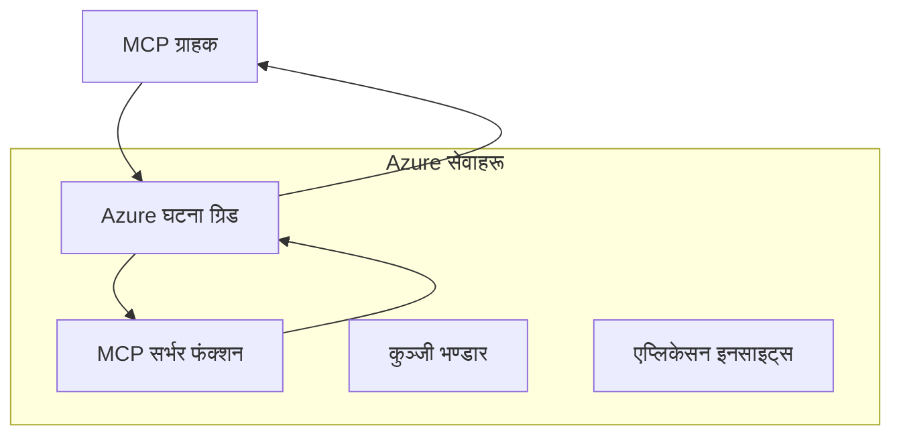
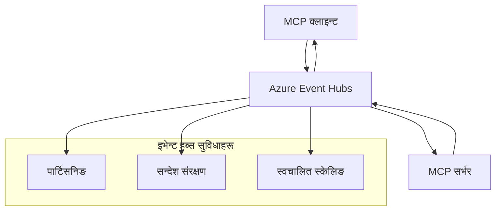

# MCP कस्टम ट्रान्सपोर्टहरू - उन्नत कार्यान्वयन मार्गदर्शन

मोडेल कन्टेक्स्ट प्रोटोकल (MCP) ले ट्रान्सपोर्ट मेकानिज्महरूमा लचिलोपन प्रदान गर्दछ, जसले विशेष उद्यम वातावरणहरूका लागि कस्टम कार्यान्वयनहरू अनुमति दिन्छ। यो उन्नत मार्गदर्शनले Azure Event Grid र Azure Event Hubs लाई व्यावहारिक उदाहरणको रूपमा प्रयोग गरी स्केलेबल, क्लाउड-नेटिभ MCP समाधानहरू निर्माण गर्ने कस्टम ट्रान्सपोर्ट कार्यान्वयनहरू अन्वेषण गर्दछ।

## परिचय

जबकि MCP का मानक ट्रान्सपोर्टहरू (stdio र HTTP स्ट्रिमिङ) अधिकांश प्रयोग केसहरू सेवा दिन्छन्, उद्यम वातावरणहरूले प्रायः सुधारिएको स्केलेबिलिटी, विश्वसनीयता, र विद्यमान क्लाउड पूर्वाधारसँग एकीकरणका लागि विशेष ट्रान्सपोर्ट मेकानिज्महरू आवश्यक पर्छ। कस्टम ट्रान्सपोर्टहरूले MCP लाई असिंक्रोनस सञ्चार, घटना-चालित वास्तुकला, र वितरण गरिएको प्रशोधनका लागि क्लाउड-नेटिभ मेसेजिङ सेवाहरू उपयोग गर्न सक्षम बनाउँछन्।

यो पाठले नवीनतम MCP विनिर्देशन (2025-11-25), Azure मेसेजिङ सेवाहरू, र स्थापित उद्यम एकीकरण ढाँचाहरूमा आधारित उन्नत ट्रान्सपोर्ट कार्यान्वयनहरू अन्वेषण गर्दछ।

### **MCP ट्रान्सपोर्ट वास्तुकला**

**MCP विनिर्देशन (2025-11-25) बाट:**

- **मानक ट्रान्सपोर्टहरू**: stdio (सिफारिस गरिएको), HTTP स्ट्रिमिङ (दूरस्थ परिदृश्यहरूको लागि)
- **कस्टम ट्रान्सपोर्टहरू**: कुनै पनि ट्रान्सपोर्ट जुन MCP मेसेज एक्सचेन्ज प्रोटोकल कार्यान्वयन गर्दछ
- **मेसेज ढाँचा**: JSON-RPC 2.0 MCP-विशिष्ट विस्तारहरूसहित
- **द्विदिश सञ्चार**: सूचनाहरू र प्रतिक्रियाहरूका लागि पूर्ण डुप्लेक्स सञ्चार आवश्यक

## सिकाइ उद्देश्यहरू

यस उन्नत पाठको अन्त्यसम्म, तपाईं सक्षम हुनुहुनेछ:

- **कस्टम ट्रान्सपोर्ट आवश्यकताहरू बुझ्न**: MCP प्रोटोकललाई कुनै पनि ट्रान्सपोर्ट तहमा कार्यान्वयन गर्दा अनुपालन कायम राख्न
- **Azure Event Grid ट्रान्सपोर्ट निर्माण गर्न**: सर्वरलेस स्केलेबिलिटीका लागि Azure Event Grid प्रयोग गरी घटना-चालित MCP सर्भरहरू सिर्जना गर्न
- **Azure Event Hubs ट्रान्सपोर्ट कार्यान्वयन गर्न**: वास्तविक-समय स्ट्रिमिङका लागि Azure Event Hubs प्रयोग गरी उच्च-थ्रुपुट MCP समाधानहरू डिजाइन गर्न
- **उद्यम ढाँचाहरू लागू गर्न**: विद्यमान Azure पूर्वाधार र सुरक्षा मोडेलहरूसँग कस्टम ट्रान्सपोर्टहरू एकीकृत गर्न
- **ट्रान्सपोर्ट विश्वसनीयता व्यवस्थापन गर्न**: उद्यम परिदृश्यहरूको लागि मेसेज टिकाउपन, क्रमबद्धता, र त्रुटि व्यवस्थापन कार्यान्वयन गर्न
- **प्रदर्शन अनुकूलन गर्न**: स्केल, विलम्बता, र थ्रुपुट आवश्यकताहरूका लागि ट्रान्सपोर्ट समाधानहरू डिजाइन गर्न

## **ट्रान्सपोर्ट आवश्यकताहरू**

### **MCP विनिर्देशन (2025-11-25) बाट मुख्य आवश्यकताहरू:**

```yaml
Message Protocol:
  format: "JSON-RPC 2.0 with MCP extensions"
  bidirectional: "Full duplex communication required"
  ordering: "Message ordering must be preserved per session"
  
Transport Layer:
  reliability: "Transport MUST handle connection failures gracefully"
  security: "Transport MUST support secure communication"
  identification: "Each session MUST have unique identifier"
  
Custom Transport:
  compliance: "MUST implement complete MCP message exchange"
  extensibility: "MAY add transport-specific features"
  interoperability: "MUST maintain protocol compatibility"
```

## **Azure Event Grid ट्रान्सपोर्ट कार्यान्वयन**

Azure Event Grid ले घटना-चालित MCP वास्तुकलाहरूका लागि उपयुक्त सर्वरलेस घटना राउटिङ सेवा प्रदान गर्दछ। यो कार्यान्वयनले कसरी स्केलेबल, सुकुम्बासी MCP प्रणालीहरू निर्माण गर्ने देखाउँछ।

### **वास्तुकला अवलोकन**


### **C# कार्यान्वयन - Event Grid ट्रान्सपोर्ट**

```csharp
using Azure.Messaging.EventGrid;
using Microsoft.Extensions.Azure;
using System.Text.Json;

public class EventGridMcpTransport : IMcpTransport
{
    private readonly EventGridPublisherClient _publisher;
    private readonly string _topicEndpoint;
    private readonly string _clientId;
    
    public EventGridMcpTransport(string topicEndpoint, string accessKey, string clientId)
    {
        _publisher = new EventGridPublisherClient(
            new Uri(topicEndpoint), 
            new AzureKeyCredential(accessKey));
        _topicEndpoint = topicEndpoint;
        _clientId = clientId;
    }
    
    public async Task SendMessageAsync(McpMessage message)
    {
        var eventGridEvent = new EventGridEvent(
            subject: $"mcp/{_clientId}",
            eventType: "MCP.MessageReceived",
            dataVersion: "1.0",
            data: JsonSerializer.Serialize(message))
        {
            Id = Guid.NewGuid().ToString(),
            EventTime = DateTimeOffset.UtcNow
        };
        
        await _publisher.SendEventAsync(eventGridEvent);
    }
    
    public async Task<McpMessage> ReceiveMessageAsync(CancellationToken cancellationToken)
    {
        // Event Grid is push-based, so implement webhook receiver
        // This would typically be handled by Azure Functions trigger
        throw new NotImplementedException("Use EventGridTrigger in Azure Functions");
    }
}

// Azure Function for receiving Event Grid events
[FunctionName("McpEventGridReceiver")]
public async Task<IActionResult> HandleEventGridMessage(
    [EventGridTrigger] EventGridEvent eventGridEvent,
    ILogger log)
{
    try
    {
        var mcpMessage = JsonSerializer.Deserialize<McpMessage>(
            eventGridEvent.Data.ToString());
        
        // Process MCP message
        var response = await _mcpServer.ProcessMessageAsync(mcpMessage);
        
        // Send response back via Event Grid
        await _transport.SendMessageAsync(response);
        
        return new OkResult();
    }
    catch (Exception ex)
    {
        log.LogError(ex, "Error processing Event Grid MCP message");
        return new BadRequestResult();
    }
}
```

### **TypeScript कार्यान्वयन - Event Grid ट्रान्सपोर्ट**

```typescript
import { EventGridPublisherClient, AzureKeyCredential } from "@azure/eventgrid";
import { McpTransport, McpMessage } from "./mcp-types";

export class EventGridMcpTransport implements McpTransport {
    private publisher: EventGridPublisherClient;
    private clientId: string;
    
    constructor(
        private topicEndpoint: string,
        private accessKey: string,
        clientId: string
    ) {
        this.publisher = new EventGridPublisherClient(
            topicEndpoint,
            new AzureKeyCredential(accessKey)
        );
        this.clientId = clientId;
    }
    
    async sendMessage(message: McpMessage): Promise<void> {
        const event = {
            id: crypto.randomUUID(),
            source: `mcp-client-${this.clientId}`,
            type: "MCP.MessageReceived",
            time: new Date(),
            data: message
        };
        
        await this.publisher.sendEvents([event]);
    }
    
    // Azure Functions मार्फत घटना-चालित प्राप्ति
    onMessage(handler: (message: McpMessage) => Promise<void>): void {
        // कार्यान्वयनले Azure Functions Event Grid ट्रिगर प्रयोग गर्नेछ
        // यो वेबहुक रिसिभरको लागि एक वैचारिक इन्टरफेस हो
    }
}

// Azure Functions कार्यान्वयन
import { app, InvocationContext, EventGridEvent } from "@azure/functions";

app.eventGrid("mcpEventGridHandler", {
    handler: async (event: EventGridEvent, context: InvocationContext) => {
        try {
            const mcpMessage = event.data as McpMessage;
            
            // MCP सन्देश प्रक्रिया गर्नुहोस्
            const response = await mcpServer.processMessage(mcpMessage);
            
            // Event Grid मार्फत प्रतिक्रिया पठाउनुहोस्
            await transport.sendMessage(response);
            
        } catch (error) {
            context.error("Error processing MCP message:", error);
            throw error;
        }
    }
});
```

### **Python कार्यान्वयन - Event Grid ट्रान्सपोर्ट**

```python
from azure.eventgrid import EventGridPublisherClient, EventGridEvent
from azure.core.credentials import AzureKeyCredential
import asyncio
import json
from typing import Callable, Optional
import uuid
from datetime import datetime

class EventGridMcpTransport:
    def __init__(self, topic_endpoint: str, access_key: str, client_id: str):
        self.client = EventGridPublisherClient(
            topic_endpoint, 
            AzureKeyCredential(access_key)
        )
        self.client_id = client_id
        self.message_handler: Optional[Callable] = None
    
    async def send_message(self, message: dict) -> None:
        """Send MCP message via Event Grid"""
        event = EventGridEvent(
            data=message,
            subject=f"mcp/{self.client_id}",
            event_type="MCP.MessageReceived",
            data_version="1.0"
        )
        
        await self.client.send(event)
    
    def on_message(self, handler: Callable[[dict], None]) -> None:
        """Register message handler for incoming events"""
        self.message_handler = handler

# Azure Functions कार्यान्वयन
import azure.functions as func
import logging

def main(event: func.EventGridEvent) -> None:
    """Azure Functions Event Grid trigger for MCP messages"""
    try:
        # Event Grid घटनाबाट MCP सन्देश पार्स गर्नुहोस्
        mcp_message = json.loads(event.get_body().decode('utf-8'))
        
        # MCP सन्देश प्रक्रिया गर्नुहोस्
        response = process_mcp_message(mcp_message)
        
        # Event Grid मार्फत प्रतिक्रिया फिर्ता पठाउनुहोस्
        # (कार्यान्वयनले नयाँ Event Grid क्लाइन्ट सिर्जना गर्नेछ)
        
    except Exception as e:
        logging.error(f"Error processing MCP Event Grid message: {e}")
        raise
```

## **Azure Event Hubs ट्रान्सपोर्ट कार्यान्वयन**

Azure Event Hubs ले कम विलम्बता र उच्च मेसेज भोल्युम आवश्यक पर्ने MCP परिदृश्यहरूको लागि उच्च-थ्रुपुट, वास्तविक-समय स्ट्रिमिङ क्षमता प्रदान गर्दछ।

### **वास्तुकला अवलोकन**


### **C# कार्यान्वयन - Event Hubs ट्रान्सपोर्ट**

```csharp
using Azure.Messaging.EventHubs;
using Azure.Messaging.EventHubs.Producer;
using Azure.Messaging.EventHubs.Consumer;
using System.Text;

public class EventHubsMcpTransport : IMcpTransport, IDisposable
{
    private readonly EventHubProducerClient _producer;
    private readonly EventHubConsumerClient _consumer;
    private readonly string _consumerGroup;
    private readonly CancellationTokenSource _cancellationTokenSource;
    
    public EventHubsMcpTransport(
        string connectionString, 
        string eventHubName,
        string consumerGroup = "$Default")
    {
        _producer = new EventHubProducerClient(connectionString, eventHubName);
        _consumer = new EventHubConsumerClient(
            consumerGroup, 
            connectionString, 
            eventHubName);
        _consumerGroup = consumerGroup;
        _cancellationTokenSource = new CancellationTokenSource();
    }
    
    public async Task SendMessageAsync(McpMessage message)
    {
        var messageBody = JsonSerializer.Serialize(message);
        var eventData = new EventData(Encoding.UTF8.GetBytes(messageBody));
        
        // Add MCP-specific properties
        eventData.Properties.Add("MessageType", message.Method ?? "response");
        eventData.Properties.Add("MessageId", message.Id);
        eventData.Properties.Add("Timestamp", DateTimeOffset.UtcNow);
        
        await _producer.SendAsync(new[] { eventData });
    }
    
    public async Task StartReceivingAsync(
        Func<McpMessage, Task> messageHandler)
    {
        await foreach (PartitionEvent partitionEvent in _consumer.ReadEventsAsync(
            _cancellationTokenSource.Token))
        {
            try
            {
                var messageBody = Encoding.UTF8.GetString(
                    partitionEvent.Data.EventBody.ToArray());
                var mcpMessage = JsonSerializer.Deserialize<McpMessage>(messageBody);
                
                await messageHandler(mcpMessage);
            }
            catch (Exception ex)
            {
                // Handle deserialization or processing errors
                Console.WriteLine($"Error processing message: {ex.Message}");
            }
        }
    }
    
    public void Dispose()
    {
        _cancellationTokenSource?.Cancel();
        _producer?.DisposeAsync().AsTask().Wait();
        _consumer?.DisposeAsync().AsTask().Wait();
        _cancellationTokenSource?.Dispose();
    }
}
```

### **TypeScript कार्यान्वयन - Event Hubs ट्रान्सपोर्ट**

```typescript
import { 
    EventHubProducerClient, 
    EventHubConsumerClient, 
    EventData 
} from "@azure/event-hubs";

export class EventHubsMcpTransport implements McpTransport {
    private producer: EventHubProducerClient;
    private consumer: EventHubConsumerClient;
    private isReceiving = false;
    
    constructor(
        private connectionString: string,
        private eventHubName: string,
        private consumerGroup: string = "$Default"
    ) {
        this.producer = new EventHubProducerClient(
            connectionString, 
            eventHubName
        );
        this.consumer = new EventHubConsumerClient(
            consumerGroup,
            connectionString,
            eventHubName
        );
    }
    
    async sendMessage(message: McpMessage): Promise<void> {
        const eventData: EventData = {
            body: JSON.stringify(message),
            properties: {
                messageType: message.method || "response",
                messageId: message.id,
                timestamp: new Date().toISOString()
            }
        };
        
        await this.producer.sendBatch([eventData]);
    }
    
    async startReceiving(
        messageHandler: (message: McpMessage) => Promise<void>
    ): Promise<void> {
        if (this.isReceiving) return;
        
        this.isReceiving = true;
        
        const subscription = this.consumer.subscribe({
            processEvents: async (events, context) => {
                for (const event of events) {
                    try {
                        const messageBody = event.body as string;
                        const mcpMessage: McpMessage = JSON.parse(messageBody);
                        
                        await messageHandler(mcpMessage);
                        
                        // कम्तिमा एक पटक डेलिभरीको लागि चेकपोइन्ट अपडेट गर्नुहोस्
                        await context.updateCheckpoint(event);
                    } catch (error) {
                        console.error("Error processing Event Hubs message:", error);
                    }
                }
            },
            processError: async (err, context) => {
                console.error("Event Hubs error:", err);
            }
        });
    }
    
    async close(): Promise<void> {
        this.isReceiving = false;
        await this.producer.close();
        await this.consumer.close();
    }
}
```

### **Python कार्यान्वयन - Event Hubs ट्रान्सपोर्ट**

```python
from azure.eventhub import EventHubProducerClient, EventHubConsumerClient
from azure.eventhub import EventData
import json
import asyncio
from typing import Callable, Dict, Any
import logging

class EventHubsMcpTransport:
    def __init__(
        self, 
        connection_string: str, 
        eventhub_name: str,
        consumer_group: str = "$Default"
    ):
        self.producer = EventHubProducerClient.from_connection_string(
            connection_string, 
            eventhub_name=eventhub_name
        )
        self.consumer = EventHubConsumerClient.from_connection_string(
            connection_string,
            consumer_group=consumer_group,
            eventhub_name=eventhub_name
        )
        self.is_receiving = False
    
    async def send_message(self, message: Dict[str, Any]) -> None:
        """Send MCP message via Event Hubs"""
        event_data = EventData(json.dumps(message))
        
        # MCP-विशिष्ट गुणहरू थप्नुहोस्
        event_data.properties = {
            "messageType": message.get("method", "response"),
            "messageId": message.get("id"),
            "timestamp": "2025-01-14T10:30:00Z"  # वास्तविक टाइमस्ट्याम्प प्रयोग गर्नुहोस्
        }
        
        async with self.producer:
            event_data_batch = await self.producer.create_batch()
            event_data_batch.add(event_data)
            await self.producer.send_batch(event_data_batch)
    
    async def start_receiving(
        self, 
        message_handler: Callable[[Dict[str, Any]], None]
    ) -> None:
        """Start receiving MCP messages from Event Hubs"""
        if self.is_receiving:
            return
        
        self.is_receiving = True
        
        async with self.consumer:
            await self.consumer.receive(
                on_event=self._on_event_received(message_handler),
                starting_position="-1"  # सुरुबाट सुरु गर्नुहोस्
            )
    
    def _on_event_received(self, handler: Callable):
        """Internal event handler wrapper"""
        async def handle_event(partition_context, event):
            try:
                # Event Hubs घटनाबाट MCP सन्देश पार्स गर्नुहोस्
                message_body = event.body_as_str(encoding='UTF-8')
                mcp_message = json.loads(message_body)
                
                # MCP सन्देश प्रक्रिया गर्नुहोस्
                await handler(mcp_message)
                
                # कम्तिमा एक पटक डेलिभरीको लागि चेकपोइन्ट अपडेट गर्नुहोस्
                await partition_context.update_checkpoint(event)
                
            except Exception as e:
                logging.error(f"Error processing Event Hubs message: {e}")
        
        return handle_event
    
    async def close(self) -> None:
        """Clean up transport resources"""
        self.is_receiving = False
        await self.producer.close()
        await self.consumer.close()
```

## **उन्नत ट्रान्सपोर्ट ढाँचाहरू**

### **मेसेज टिकाउपन र विश्वसनीयता**

```csharp
// Implementing message durability with retry logic
public class ReliableTransportWrapper : IMcpTransport
{
    private readonly IMcpTransport _innerTransport;
    private readonly RetryPolicy _retryPolicy;
    
    public async Task SendMessageAsync(McpMessage message)
    {
        await _retryPolicy.ExecuteAsync(async () =>
        {
            try
            {
                await _innerTransport.SendMessageAsync(message);
            }
            catch (TransportException ex) when (ex.IsRetryable)
            {
                // Log and retry
                throw;
            }
        });
    }
}
```

### **ट्रान्सपोर्ट सुरक्षा एकीकरण**

```csharp
// Integrating Azure Key Vault for transport security
public class SecureTransportFactory
{
    private readonly SecretClient _keyVaultClient;
    
    public async Task<IMcpTransport> CreateEventGridTransportAsync()
    {
        var accessKey = await _keyVaultClient.GetSecretAsync("EventGridAccessKey");
        var topicEndpoint = await _keyVaultClient.GetSecretAsync("EventGridTopic");
        
        return new EventGridMcpTransport(
            topicEndpoint.Value.Value,
            accessKey.Value.Value,
            Environment.MachineName
        );
    }
}
```

### **ट्रान्सपोर्ट अनुगमन र अवलोकनयोग्यता**

```csharp
// Adding telemetry to custom transports
public class ObservableTransport : IMcpTransport
{
    private readonly IMcpTransport _transport;
    private readonly ILogger _logger;
    private readonly TelemetryClient _telemetryClient;
    
    public async Task SendMessageAsync(McpMessage message)
    {
        using var activity = Activity.StartActivity("MCP.Transport.Send");
        activity?.SetTag("transport.type", "EventGrid");
        activity?.SetTag("message.method", message.Method);
        
        var stopwatch = Stopwatch.StartNew();
        
        try
        {
            await _transport.SendMessageAsync(message);
            
            _telemetryClient.TrackDependency(
                "EventGrid",
                "SendMessage",
                DateTime.UtcNow.Subtract(stopwatch.Elapsed),
                stopwatch.Elapsed,
                true
            );
        }
        catch (Exception ex)
        {
            _telemetryClient.TrackException(ex);
            throw;
        }
    }
}
```

## **उद्यम एकीकरण परिदृश्यहरू**

### **परिदृश्य 1: वितरण गरिएको MCP प्रशोधन**

धेरै प्रशोधन नोडहरूमा MCP अनुरोधहरू वितरण गर्न Azure Event Grid प्रयोग गर्दै:

```yaml
Architecture:
  - MCP Client sends requests to Event Grid topic
  - Multiple Azure Functions subscribe to process different tool types
  - Results aggregated and returned via separate response topic
  
Benefits:
  - Horizontal scaling based on message volume
  - Fault tolerance through redundant processors
  - Cost optimization with serverless compute
```

### **परिदृश्य 2: वास्तविक-समय MCP स्ट्रिमिङ**

उच्च-फ्रिक्वेन्सी MCP अन्तरक्रियाहरूका लागि Azure Event Hubs प्रयोग गर्दै:

```yaml
Architecture:
  - MCP Client streams continuous requests via Event Hubs
  - Stream Analytics processes and routes messages
  - Multiple consumers handle different aspect of processing
  
Benefits:
  - Low latency for real-time scenarios
  - High throughput for batch processing
  - Built-in partitioning for parallel processing
```

### **परिदृश्य 3: हाइब्रिड ट्रान्सपोर्ट वास्तुकला**

विभिन्न प्रयोग केसहरूका लागि धेरै ट्रान्सपोर्टहरू संयोजन गर्दै:

```csharp
public class HybridMcpTransport : IMcpTransport
{
    private readonly IMcpTransport _realtimeTransport; // Event Hubs
    private readonly IMcpTransport _batchTransport;    // Event Grid
    private readonly IMcpTransport _fallbackTransport; // HTTP Streaming
    
    public async Task SendMessageAsync(McpMessage message)
    {
        // Route based on message characteristics
        var transport = message.Method switch
        {
            "tools/call" when IsRealtime(message) => _realtimeTransport,
            "resources/read" when IsBatch(message) => _batchTransport,
            _ => _fallbackTransport
        };
        
        await transport.SendMessageAsync(message);
    }
}
```

## **प्रदर्शन अनुकूलन**

### **Event Grid का लागि मेसेज ब्याचिङ**

```csharp
public class BatchingEventGridTransport : IMcpTransport
{
    private readonly List<McpMessage> _messageBuffer = new();
    private readonly Timer _flushTimer;
    private const int MaxBatchSize = 100;
    
    public async Task SendMessageAsync(McpMessage message)
    {
        lock (_messageBuffer)
        {
            _messageBuffer.Add(message);
            
            if (_messageBuffer.Count >= MaxBatchSize)
            {
                _ = Task.Run(FlushMessages);
            }
        }
    }
    
    private async Task FlushMessages()
    {
        List<McpMessage> toSend;
        lock (_messageBuffer)
        {
            toSend = new List<McpMessage>(_messageBuffer);
            _messageBuffer.Clear();
        }
        
        if (toSend.Any())
        {
            var events = toSend.Select(CreateEventGridEvent);
            await _publisher.SendEventsAsync(events);
        }
    }
}
```

### **Event Hubs का लागि पार्टिसनिङ रणनीति**

```csharp
public class PartitionedEventHubsTransport : IMcpTransport
{
    public async Task SendMessageAsync(McpMessage message)
    {
        // Partition by client ID for session affinity
        var partitionKey = ExtractClientId(message);
        
        var eventData = new EventData(JsonSerializer.SerializeToUtf8Bytes(message))
        {
            PartitionKey = partitionKey
        };
        
        await _producer.SendAsync(new[] { eventData });
    }
}
```

## **कस्टम ट्रान्सपोर्टहरूको परीक्षण**

### **टेस्ट डबलहरूसँग युनिट परीक्षण**

```csharp
[Test]
public async Task EventGridTransport_SendMessage_PublishesCorrectEvent()
{
    // Arrange
    var mockPublisher = new Mock<EventGridPublisherClient>();
    var transport = new EventGridMcpTransport(mockPublisher.Object);
    var message = new McpMessage { Method = "tools/list", Id = "test-123" };
    
    // Act
    await transport.SendMessageAsync(message);
    
    // Assert
    mockPublisher.Verify(
        x => x.SendEventAsync(
            It.Is<EventGridEvent>(e => 
                e.EventType == "MCP.MessageReceived" &&
                e.Subject == "mcp/test-client"
            )
        ),
        Times.Once
    );
}
```

### **Azure टेस्ट कन्टेनरहरूसँग एकीकरण परीक्षण**

```csharp
[Test]
public async Task EventHubsTransport_IntegrationTest()
{
    // Using Testcontainers for integration testing
    var eventHubsContainer = new EventHubsContainer()
        .WithEventHub("test-hub");
    
    await eventHubsContainer.StartAsync();
    
    var transport = new EventHubsMcpTransport(
        eventHubsContainer.GetConnectionString(),
        "test-hub"
    );
    
    // Test message round-trip
    var sentMessage = new McpMessage { Method = "test", Id = "123" };
    McpMessage receivedMessage = null;
    
    await transport.StartReceivingAsync(msg => {
        receivedMessage = msg;
        return Task.CompletedTask;
    });
    
    await transport.SendMessageAsync(sentMessage);
    await Task.Delay(1000); // Allow for message processing
    
    Assert.That(receivedMessage?.Id, Is.EqualTo("123"));
}
```

## **सर्वोत्तम अभ्यासहरू र मार्गनिर्देशनहरू**

### **ट्रान्सपोर्ट डिजाइन सिद्धान्तहरू**

1. **इडेम्पोटेन्सी**: डुप्लिकेटहरू व्यवस्थापन गर्न मेसेज प्रशोधन इडेम्पोटेन्ट बनाउन सुनिश्चित गर्नुहोस्
2. **त्रुटि व्यवस्थापन**: व्यापक त्रुटि व्यवस्थापन र डेड लेटर क्यूहरू कार्यान्वयन गर्नुहोस्
3. **अनुगमन**: विस्तृत टेलिमेट्री र स्वास्थ्य जाँचहरू थप्नुहोस्
4. **सुरक्षा**: प्रबन्धित पहिचानहरू र न्यूनतम विशेषाधिकार पहुँच प्रयोग गर्नुहोस्
5. **प्रदर्शन**: तपाईंको विशिष्ट विलम्बता र थ्रुपुट आवश्यकताहरूका लागि डिजाइन गर्नुहोस्

### **Azure-विशिष्ट सिफारिसहरू**

1. **प्रबन्धित पहिचान प्रयोग गर्नुहोस्**: उत्पादनमा कनेक्शन स्ट्रिङहरूबाट बच्नुहोस्
2. **सर्किट ब्रेकरहरू कार्यान्वयन गर्नुहोस्**: Azure सेवा अवरोधहरूबाट सुरक्षा गर्न
3. **लागतहरू अनुगमन गर्नुहोस्**: मेसेज भोल्युम र प्रशोधन लागतहरू ट्र्याक गर्नुहोस्
4. **स्केलका लागि योजना बनाउनुहोस्**: प्रारम्भमै पार्टिसनिङ र स्केलिङ रणनीतिहरू डिजाइन गर्नुहोस्
5. **पूर्ण रूपमा परीक्षण गर्नुहोस्**: व्यापक परीक्षणका लागि Azure DevTest Labs प्रयोग गर्नुहोस्

## **निष्कर्ष**

कस्टम MCP ट्रान्सपोर्टहरूले Azure का मेसेजिङ सेवाहरू प्रयोग गरी शक्तिशाली उद्यम परिदृश्यहरू सक्षम बनाउँछन्। Event Grid वा Event Hubs ट्रान्सपोर्टहरू कार्यान्वयन गरेर, तपाईं स्केलेबल, विश्वसनीय MCP समाधानहरू निर्माण गर्न सक्नुहुन्छ जुन विद्यमान Azure पूर्वाधारसँग सहज रूपमा एकीकृत हुन्छन्।

प्रदान गरिएका उदाहरणहरूले कस्टम ट्रान्सपोर्टहरू कार्यान्वयन गर्दा MCP प्रोटोकल अनुपालन र Azure सर्वोत्तम अभ्यासहरू कायम राख्ने उत्पादन-तयार ढाँचाहरू देखाउँछन्।

## **थप स्रोतहरू**

- [MCP Specification 2025-06-18](https://spec.modelcontextprotocol.io/specification/2025-06-18/)
- [Azure Event Grid Documentation](https://docs.microsoft.com/azure/event-grid/)
- [Azure Event Hubs Documentation](https://docs.microsoft.com/azure/event-hubs/)
- [Azure Functions Event Grid Trigger](https://docs.microsoft.com/azure/azure-functions/functions-bindings-event-grid)
- [Azure SDK for .NET](https://github.com/Azure/azure-sdk-for-net)
- [Azure SDK for TypeScript](https://github.com/Azure/azure-sdk-for-js)
- [Azure SDK for Python](https://github.com/Azure/azure-sdk-for-python)

---

> *यो मार्गदर्शन उत्पादन MCP प्रणालीहरूको लागि व्यावहारिक कार्यान्वयन ढाँचाहरूमा केन्द्रित छ। सधैं तपाईंका विशिष्ट आवश्यकताहरू र Azure सेवा सीमाहरूको विरुद्ध ट्रान्सपोर्ट कार्यान्वयनहरू प्रमाणित गर्नुहोस्।*
> **हालको मानक**: यो मार्गदर्शन [MCP Specification 2025-06-18](https://spec.modelcontextprotocol.io/specification/2025-06-18/) ट्रान्सपोर्ट आवश्यकताहरू र उद्यम वातावरणका लागि उन्नत ट्रान्सपोर्ट ढाँचाहरू प्रतिबिम्बित गर्दछ।


## के छ अर्को
- [6. Community Contributions](../../06-CommunityContributions/README.md)

---

<!-- CO-OP TRANSLATOR DISCLAIMER START -->
**अस्वीकरण**:
यो दस्तावेज AI अनुवाद सेवा [Co-op Translator](https://github.com/Azure/co-op-translator) प्रयोग गरी अनुवाद गरिएको हो। हामी शुद्धताका लागि प्रयासरत छौं, तर कृपया ध्यान दिनुहोस् कि स्वचालित अनुवादमा त्रुटि वा अशुद्धता हुन सक्छ। मूल दस्तावेज यसको मूल भाषामा आधिकारिक स्रोत मानिनु पर्छ। महत्वपूर्ण जानकारीका लागि व्यावसायिक मानव अनुवाद सिफारिस गरिन्छ। यस अनुवादको प्रयोगबाट उत्पन्न कुनै पनि गलतफहमी वा गलत व्याख्याका लागि हामी जिम्मेवार छैनौं।
<!-- CO-OP TRANSLATOR DISCLAIMER END -->