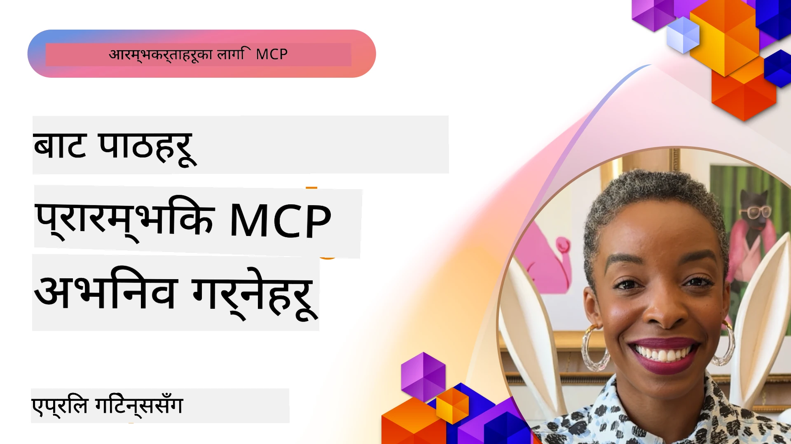

# 🌟 प्रारम्भिक स्विकारकर्ताहरूबाट पाठहरू

[](https://youtu.be/jds7dSmNptE)

_(यस पाठको भिडियो हेर्न माथिको छवि क्लिक गर्नुहोस्)_

## 🎯 यस मोड्युलले के समेट्छ

यस मोड्युलले कसरी वास्तविक संगठनहरू र विकासकर्ताहरूले Model Context Protocol (MCP) लाई वास्तविक चुनौतीहरू समाधान गर्न र नवप्रवर्तनलाई अघि बढाउन प्रयोग गरिरहेका छन् भन्ने कुरा अन्वेषण गर्दछ। विस्तृत केस अध्ययनहरू, व्यावहारिक परियोजनाहरू, र उदाहरणहरूको माध्यमबाट, तपाईंले पत्ता लगाउनुहुनेछ कि MCP कसरी सुरक्षित, स्केलेबल AI एकीकरण सक्षम गर्दछ जुन भाषा मोडेलहरू, उपकरणहरू, र उद्यम डाटालाई जोड्दछ।

### 📚 MCP लाई क्रियाशील रूपमा हेर्नुहोस्

यी सिद्धान्तहरू उत्पादन-तयार उपकरणहरूमा कसरी लागू हुन्छन् देख्न चाहनुहुन्छ? हाम्रो [**10 Microsoft MCP सर्भरहरू जुन विकासकर्ता उत्पादकतामा रूपान्तरण गर्दैछन्**](microsoft-mcp-servers.md) हेर्नुहोस्, जसले तपाईंले आज प्रयोग गर्न सक्ने वास्तविक Microsoft MCP सर्भरहरू प्रदर्शन गर्दछ।

## अवलोकन

यो पाठले प्रारम्भिक स्विकारकर्ताहरूले कसरी Model Context Protocol (MCP) लाई प्रयोग गरेर वास्तविक संसारका चुनौतीहरू समाधान गरेका छन् र उद्योगहरूमा नवप्रवर्तन ल्याएको छ भन्ने कुरा अन्वेषण गर्दछ। विस्तृत केस अध्ययनहरू र व्यावहारिक परियोजनाहरू मार्फत, तपाईंले देख्नुहुनेछ कि MCP कसरी मानकीकृत, सुरक्षित, र स्केलेबल AI एकीकरण सक्षम गर्दछ—ठूला भाषा मोडेलहरू, उपकरणहरू, र उद्यम डाटालाई एकीकृत संरचनामा जोड्ने। तपाईंले MCP-आधारित समाधानहरू डिजाइन र निर्माण गर्ने व्यावहारिक अनुभव पाउनुहुनेछ, प्रमाणित कार्यान्वयन ढाँचाहरूबाट सिक्नुहुनेछ, र उत्पादन वातावरणमा MCP तैनाथीकरणको लागि उत्कृष्ट अभ्यासहरू पत्ता लगाउनुहुनेछ। पाठले उदायी प्रवृत्तिहरू, भविष्यका दिशाहरू, र खुला स्रोत स्रोतहरूलाई समेत प्रकाश पार्छ जसले तपाईंलाई MCP प्रविधि र यसको विकासशील पारिस्थितिकी तन्त्रको अग्रभागमा रहन मद्दत गर्दछ।

## सिकाइ उद्देश्यहरू

- विभिन्न उद्योगहरूमा वास्तविक MCP कार्यान्वयनहरू विश्लेषण गर्नुहोस्
- पूर्ण MCP-आधारित अनुप्रयोगहरू डिजाइन र निर्माण गर्नुहोस्
- MCP प्रविधिमा उदायी प्रवृत्ति र भविष्यका दिशाहरू अन्वेषण गर्नुहोस्
- वास्तविक विकास परिदृश्यहरूमा उत्तम अभ्यासहरू लागू गर्नुहोस्

## वास्तविक संसारका MCP कार्यान्वयनहरू

### केस अध्ययन १: उद्यम ग्राहक समर्थन स्वचालन

एक बहुराष्ट्रिय निगमले MCP-आधारित समाधान लागू गर्‍यो जसले ग्राहक समर्थन प्रणालीहरूमा AI अन्तरक्रियालाई मानकीकृत गर्‍यो। यसले तिनीहरूलाई अनुमति दियो:

- धेरै LLM प्रदायकहरूका लागि एक एकीकृत इन्टरफेस सिर्जना गर्न
- विभागहरूमा सुसंगत प्रॉम्प्ट व्यवस्थापन कायम गर्न
- कडा सुरक्षा र अनुपालन नियन्त्रणहरू कार्यान्वयन गर्न
- विशेष आवश्यकताहरूअनुसार विभिन्न AI मोडेलहरू बीच सजिलै सर्दै गर्न

**प्राविधिक कार्यान्वयन:**

```python
# ग्राहक समर्थनका लागि Python MCP सर्भर कार्यान्वयन
import logging
import asyncio
from modelcontextprotocol import create_server, ServerConfig
from modelcontextprotocol.server import MCPServer
from modelcontextprotocol.transports import create_http_transport
from modelcontextprotocol.resources import ResourceDefinition
from modelcontextprotocol.prompts import PromptDefinition
from modelcontextprotocol.tool import ToolDefinition

# लगिङ कन्फिगर गर्नुहोस्
logging.basicConfig(level=logging.INFO)

async def main():
    # सर्भर कन्फिगरेसन तयार गर्नुहोस्
    config = ServerConfig(
        name="Enterprise Customer Support Server",
        version="1.0.0",
        description="MCP server for handling customer support inquiries"
    )
    
    # MCP सर्भर आरम्भ गर्नुहोस्
    server = create_server(config)
    
    # ज्ञान आधार स्रोतहरू दर्ता गर्नुहोस्
    server.resources.register(
        ResourceDefinition(
            name="customer_kb",
            description="Customer knowledge base documentation"
        ),
        lambda params: get_customer_documentation(params)
    )
    
    # प्रॉम्प्ट टेम्प्लेटहरू दर्ता गर्नुहोस्
    server.prompts.register(
        PromptDefinition(
            name="support_template",
            description="Templates for customer support responses"
        ),
        lambda params: get_support_templates(params)
    )
    
    # समर्थन उपकरणहरू दर्ता गर्नुहोस्
    server.tools.register(
        ToolDefinition(
            name="ticketing",
            description="Create and update support tickets"
        ),
        handle_ticketing_operations
    )
    
    # HTTP ट्रान्सपोर्टसँग सर्भर सुरु गर्नुहोस्
    transport = create_http_transport(port=8080)
    await server.run(transport)

if __name__ == "__main__":
    asyncio.run(main())
```

**परिणामहरू:** मोडेल लागतमा ३०% कटौती, प्रतिक्रिया सुसंगततामा ४५% सुधार, र विश्वव्यापी सञ्चालनहरूमा बढेको अनुपालन।

### केस अध्ययन २: स्वास्थ्य सेवा डायग्नोस्टिक सहायक

एक स्वास्थ्य सेवा प्रदायकले MCP पूर्वाधार विकास गर्‍यो जसले धेरै विशिष्ट चिकित्सा AI मोडेलहरूलाई संयोजन गर्दथ्यो, जबकि संवेदनशील बिरामी डाटा सुरक्षित राखिन्थ्यो:

- सामान्य र विशेषज्ञ चिकित्सा मोडेलहरू बीच सहज स्विचिङ
- कडा गोपनीयता नियन्त्रण र अडिट ट्रेलहरू 
- विद्यमान इलेक्ट्रोनिक स्वास्थ्य अभिलेख (EHR) प्रणालीहरूसँग एकीकरण
- चिकित्सा शब्दावलीमा सुसंगत प्रॉम्प्ट इन्जिनियरिङ

**प्राविधिक कार्यान्वयन:**

```csharp
// C# MCP host application implementation in healthcare application
using Microsoft.Extensions.DependencyInjection;
using ModelContextProtocol.SDK.Client;
using ModelContextProtocol.SDK.Security;
using ModelContextProtocol.SDK.Resources;

public class DiagnosticAssistant
{
    private readonly MCPHostClient _mcpClient;
    private readonly PatientContext _patientContext;
    
    public DiagnosticAssistant(PatientContext patientContext)
    {
        _patientContext = patientContext;
        
        // Configure MCP client with healthcare-specific settings
        var clientOptions = new ClientOptions
        {
            Name = "Healthcare Diagnostic Assistant",
            Version = "1.0.0",
            Security = new SecurityOptions
            {
                Encryption = EncryptionLevel.Medical,
                AuditEnabled = true
            }
        };
        
        _mcpClient = new MCPHostClientBuilder()
            .WithOptions(clientOptions)
            .WithTransport(new HttpTransport("https://healthcare-mcp.example.org"))
            .WithAuthentication(new HIPAACompliantAuthProvider())
            .Build();
    }
    
    public async Task<DiagnosticSuggestion> GetDiagnosticAssistance(
        string symptoms, string patientHistory)
    {
        // Create request with appropriate resources and tool access
        var resourceRequest = new ResourceRequest
        {
            Name = "patient_records",
            Parameters = new Dictionary<string, object>
            {
                ["patientId"] = _patientContext.PatientId,
                ["requestingProvider"] = _patientContext.ProviderId
            }
        };
        
        // Request diagnostic assistance using appropriate prompt
        var response = await _mcpClient.SendPromptRequestAsync(
            promptName: "diagnostic_assistance",
            parameters: new Dictionary<string, object>
            {
                ["symptoms"] = symptoms,
                patientHistory = patientHistory,
                relevantGuidelines = _patientContext.GetRelevantGuidelines()
            });
            
        return DiagnosticSuggestion.FromMCPResponse(response);
    }
}
```

**परिणामहरू:** चिकित्सकहरूका लागि सुधारिएको डायग्नोस्टिक सुझावहरू, पूर्ण HIPAA अनुपालन कायम राख्दै, र प्रणालीहरू बीच सन्दर्भ-सर्नमा उल्लेखनीय कमी।

### केस अध्ययन ३: वित्तीय सेवा जोखिम विश्लेषण

एक वित्तीय संस्था ले MCP लागू गर्‍यो जसले विभिन्न विभागहरूमा उनीहरूको जोखिम विश्लेषण प्रक्रियाहरू मानकीकृत गर्‍यो:

- क्रेडिट जोखिम, ठगी पत्ता लगाउने, र लगानी जोखिम मोडेलहरूको लागि एक एकीकृत इन्टरफेस सिर्जना गर्‍यो
- कडा पहुँच नियन्त्रण र मोडेल संस्करण व्यवस्थापन लागू गर्‍यो
- सबै AI सिफारिशहरूको अडिट सम्भाव्यता सुनिश्चित गर्‍यो
- विभिन्न प्रणालीहरूमा डेटा फर्म्याटिङमा सुसंगतता कायम गर्‍यो

**प्राविधिक कार्यान्वयन:**

```java
// वित्तीय जोखिम मूल्याङ्कनका लागि जाभा MCP सर्भर
import org.mcp.server.*;
import org.mcp.security.*;

public class FinancialRiskMCPServer {
    public static void main(String[] args) {
        // वित्तीय अनुपालन सुविधाहरू सहित MCP सर्भर सिर्जना गर्नुहोस्
        MCPServer server = new MCPServerBuilder()
            .withModelProviders(
                new ModelProvider("risk-assessment-primary", new AzureOpenAIProvider()),
                new ModelProvider("risk-assessment-audit", new LocalLlamaProvider())
            )
            .withPromptTemplateDirectory("./compliance/templates")
            .withAccessControls(new SOCCompliantAccessControl())
            .withDataEncryption(EncryptionStandard.FINANCIAL_GRADE)
            .withVersionControl(true)
            .withAuditLogging(new DatabaseAuditLogger())
            .build();
            
        server.addRequestValidator(new FinancialDataValidator());
        server.addResponseFilter(new PII_RedactionFilter());
        
        server.start(9000);
        
        System.out.println("Financial Risk MCP Server running on port 9000");
    }
}
```

**परिणामहरू:** सुधारिएको नियामकीय अनुपालन, ४०% छिटो मोडेल तैनाथीकरण चक्रहरू, र विभागहरूमा जोखिम मूल्यांकन सुसंगतता।

### केस अध्ययन ४: Microsoft Playwright MCP सर्भर ब्राउजर स्वचालनका लागि

Microsoft ले [Playwright MCP सर्भर](https://github.com/microsoft/playwright-mcp) विकास गर्‍यो जसले Model Context Protocol मार्फत सुरक्षित, मानकीकृत ब्राउजर स्वचालन सक्षम गर्दछ। यो उत्पादन-तयार सर्भरले AI एजेन्टहरू र LLM हरूलाई वेब ब्राउजरहरूसँग नियन्त्रण गरिएको, अडिटेबल, र पुनःबिस्तारयोग्य तरिकाले अन्तरक्रिया गर्न अनुमति दिन्छ—जस्तै स्वचालित वेब परीक्षण, डेटा निष्कर्षण, र अन्त-देखि-अन्त वर्कफ्लोहरू।

> **🎯 उत्पादन तयार उपकरण**
> 
> यो केस अध्ययनले तपाईंले आज प्रयोग गर्न सक्ने एक वास्तविक MCP सर्भर देखाउँछ! Playwright MCP सर्भर र अन्य ९ उत्पादन-तयार Microsoft MCP सर्भरहरूको बारेमा हाम्रो [**Microsoft MCP सर्भर मार्गदर्शक**](microsoft-mcp-servers.md#8--playwright-mcp-server) मा थप जान्नुहोस्।

**मुख्य विशेषताहरू:**
- ब्राउजर स्वचालन क्षमता (नेभिगेसन, फारम भर्नु, स्क्रिनसट लिनु, आदि) MCP उपकरणको रूपमा प्रकट गर्दछ
- अनधिकृत कार्यहरू रोक्न कडा पहुँच नियन्त्रण र स्यान्डबक्सिङ कार्यान्वयन गर्दछ
- सबै ब्राउजर अन्तरक्रियाहरूको विस्तृत अडिट लगहरू प्रदान गर्दछ
- एजेन्ट-चालित स्वचालनका लागि Azure OpenAI र अन्य LLM प्रदायकहरूसँग एकीकरण समर्थन गर्दछ
- GitHub Copilot कोडिङ एजेन्टलाई वेब ब्राउजिङ क्षमताहरूले शक्ति प्रदान गर्दछ

**प्राविधिक कार्यान्वयन:**

```typescript
// TypeScript: MCP सर्भरमा Playwright ब्राउजर अटोमेशन उपकरणहरू दर्ता गर्दै
import { createServer, ToolDefinition } from 'modelcontextprotocol';
import { launch } from 'playwright';

const server = createServer({
  name: 'Playwright MCP Server',
  version: '1.0.0',
  description: 'MCP server for browser automation using Playwright'
});

// URL मा नेभिगेट गर्न र स्क्रिनशट क्याप्चर गर्न उपकरण दर्ता गर्नुहोस्
server.tools.register(
  new ToolDefinition({
    name: 'navigate_and_screenshot',
    description: 'Navigate to a URL and capture a screenshot',
    parameters: {
      url: { type: 'string', description: 'The URL to visit' }
    }
  }),
  async ({ url }) => {
    const browser = await launch();
    const page = await browser.newPage();
    await page.goto(url);
    const screenshot = await page.screenshot();
    await browser.close();
    return { screenshot };
  }
);

// MCP सर्भर सुरु गर्नुहोस्
server.listen(8080);
```

**परिणामहरू:**

- AI एजेन्ट र LLM हरूका लागि सुरक्षित, प्रोग्राममाटिक ब्राउजर स्वचालन सक्षम गर्‍यो
- म्यानुअल परीक्षण प्रयास घटायो र वेब अनुप्रयोगहरूको परीक्षण विस्तार सुधार गर्‍यो
- उद्यम वातावरणमा ब्राउजर-आधारित उपकरण एकीकरणका लागि पुन: प्रयोगयोग्य, पुनःविस्तारयोग्य फ्रेमवर्क प्रदान गर्‍यो
- GitHub Copilot को वेब ब्राउजिङ क्षमताहरूलाई शक्ति प्रदान गर्‍यो

**सन्दर्भहरू:**

- [Playwright MCP Server GitHub रिपोजिटरी](https://github.com/microsoft/playwright-mcp)
- [Microsoft AI र स्वचालन समाधानहरू](https://azure.microsoft.com/en-us/products/ai-services/)

### केस अध्ययन ५: Azure MCP – सेवा रूपमा उद्यम-स्तरीय Model Context Protocol

Azure MCP सर्वर ([https://aka.ms/azmcp](https://aka.ms/azmcp)) Microsoft को व्यवस्थापित, उद्यम-स्तरीय Model Context Protocol कार्यान्वयन हो, जसले क्लाउड सेवाको रूपमा स्केलेबल, सुरक्षित, र अनुपालक MCP सर्भर क्षमता प्रदान गर्दछ। Azure MCP ले संगठनहरूलाई शीघ्र रूपमा MCP सर्भरहरू तैनाथ गर्न, व्यवस्थापन गर्न, र Azure AI, डेटा, र सुरक्षा सेवाहरू सँग एकीकृत गर्न सक्षम पार्छ, जसले सञ्चालन बोझ घटाउँछ र AI अपनत्वलाई तीव्र बनाउँछ।

> **🎯 उत्पादन तयार उपकरण**
> 
> यो एक वास्तविक MCP सर्भर हो जुन तपाईंले आजै प्रयोग गर्न सक्नुहुन्छ! Azure AI Foundry MCP Server को बारेमा हाम्रो [**Microsoft MCP सर्भर गाइड**](microsoft-mcp-servers.md) मा थप जान्नुहोस्।

- पूर्ण रूपमा प्रबन्धित MCP सर्भर होस्टिंग, भित्री स्केलिङ, निगरानी, र सुरक्षा सहित
- Azure OpenAI, Azure AI Search, र अन्य Azure सेवाहरू संग स्वदेशी एकीकरण
- Microsoft Entra ID मार्फत उद्यम प्रमाणीकरण र प्राधिकरण
- अनुकूल उपकरणहरू, प्रॉम्प्ट टेम्प्लेटहरू, र स्रोत कनेक्टरहरूको समर्थन
- उद्यम सुरक्षा र नियामक आवश्यकतासँग अनुपालन

**प्राविधिक कार्यान्वयन:**

```yaml
# Example: Azure MCP server deployment configuration (YAML)
apiVersion: mcp.microsoft.com/v1
kind: McpServer
metadata:
  name: enterprise-mcp-server
spec:
  modelProviders:
    - name: azure-openai
      type: AzureOpenAI
      endpoint: https://<your-openai-resource>.openai.azure.com/
      apiKeySecret: <your-azure-keyvault-secret>
  tools:
    - name: document_search
      type: AzureAISearch
      endpoint: https://<your-search-resource>.search.windows.net/
      apiKeySecret: <your-azure-keyvault-secret>
  authentication:
    type: EntraID
    tenantId: <your-tenant-id>
  monitoring:
    enabled: true
    logAnalyticsWorkspace: <your-log-analytics-id>
```

**परिणामहरू:**  
- उद्यम AI परियोजनाहरूका लागि तयार-प्रयोग, अनुपालन MCP सर्भर प्लेटफर्म प्रदान गरेर मूल्य प्राप्तिको समय कम गर्‍यो  
- LLM हरू, उपकरणहरू, र उद्यम डाटा स्रोतहरूको एकीकरण सरल पारे  
- MCP कार्यभारहरूको लागि सुरक्षा, अवलोकनयोग्यता, र सञ्चालन दक्षता बढायो  
- Azure SDK का उत्तम अभ्यासहरू र वर्तमान प्रमाणीकरण ढाँचाहरूको साथ कोड गुणस्तर सुधार गर्‍यो

**सन्दर्भहरू:**  
- [Azure MCP डकुमेन्टेसन](https://aka.ms/azmcp)  
- [Azure MCP Server GitHub रिपोजिटरी](https://github.com/Azure/azure-mcp)  
- [Azure AI सेवाहरू](https://azure.microsoft.com/en-us/products/ai-services/)  
- [Microsoft MCP केन्द्र](https://mcp.azure.com)

## केस अध्ययन ६: NLWeb  
MCP (Model Context Protocol) च्याटबोटहरू र AI सहायकहरूलाई उपकरणहरूसँग अन्तरक्रिया गर्नको लागि उदयमान प्रोटोकल हो। प्रत्येक NLWeb उदाहरण पनि एक MCP सर्भर हो, जसले एक मुख्य विधि, ask, समर्थन गर्दछ, जुन प्राकृतिक भाषामा वेबसाइटलाई प्रश्न सोध्न प्रयोग गरिन्छ। फर्काइएको प्रतिक्रिया schema.org प्रयोग गर्दछ, जुन वेब डाटालाई वर्णन गर्ने एक व्यापक शब्दावली हो। सामान्य भाषामा, MCP भनेको Http लाई HTML जस्तै हो। NLWeb ले प्रोटोकलहरू, Schema.org ढाँचाहरू, र नमूना कोड संयोजन गरेर साइटहरूलाई ती अन्तिम बिन्दुहरू छिटो सिर्जना गर्न सहयोग पुर्‍याउँछ, जसले मानिसहरूलाई संवादात्मक इन्टरफेसहरू मार्फत र मेसिनहरूलाई प्राकृतिक एजेन्ट-देखि-एजेन्ट अन्तरक्रियामा लाभ पुर्‍याउँछ।

NLWeb का दुई अलग भागहरू छन्:  
- एक प्रोटोकल, सुरुमा न्यूनतम, जसले साइटसँग प्राकृतिक भाषामा अन्तरफलक गर्ने र फर्काइएको उत्तरका लागि json र schema.org मा आधारित ढाँचाको प्रयोग गर्दछ। REST API को डकुमेन्टेसनमा थप विवरणहरू हेर्नुहोस्।  
- (१) को सरल कार्यान्वयन जसले विद्यमान मार्कअप प्रयोग गर्दछ, ती साइटहरूका लागि जुन वस्तुहरूको सूची (उत्पादनहरू, पकाउने विधि, आकर्षण, समीक्षाहरू आदि) को रूपमा सारांश गर्न सकिन्छ। प्रयोगकर्ता अन्तरफलक विजेटहरूको सेटसँगै साइटहरूले आफ्नो सामग्रीलाई सजिलै संवादात्मक इन्टरफेस प्रदान गर्न सक्छन्। कसरी काम गर्छ विस्तृतमा Life of a chat query को डकुमेन्टेसनमा हेर्नुहोस्।

**सन्दर्भहरू:**  
- [Azure MCP दस्तावेज](https://aka.ms/azmcp)  
- [NLWeb](https://github.com/microsoft/NlWeb)

### केस अध्ययन ७: Azure AI Foundry MCP Server – उद्यम AI एजेन्ट एकीकरण

Azure AI Foundry MCP सर्भरहरूले देखाउँछन् कि MCP कसरी उद्यम वातावरणहरूमा AI एजेन्टहरू र वर्कफ्लोहरू संयोजन र व्यवस्थापन गर्न प्रयोग गर्न सकिन्छ। MCP लाई Azure AI Foundry सँग एकीकृत गरेर, संगठनहरूले एजेन्ट अन्तरक्रियाहरू मानकीकृत गर्न, Foundry को वर्कफ्लो व्यवस्थापन उपयोग गर्न, र सुरक्षित, स्केलेबल तैनाथीकरण सुनिश्चित गर्न सक्छन्।

> **🎯 उत्पादन तयार उपकरण**
> 
> यो एक वास्तविक MCP सर्भर हो जुन तपाईंले आजै प्रयोग गर्न सक्नुहुन्छ! Azure AI Foundry MCP Server को बारेमा हाम्रो [**Microsoft MCP सर्भर मार्गदर्शक**](microsoft-mcp-servers.md#9--azure-ai-foundry-mcp-server) मा थप जान्नुहोस्।

**मुख्य विशेषताहरू:**
- मोडेल क्याटलग र तैनाथीकरण व्यवस्थापन सहित Azure को AI पारिस्थितिकी तन्त्रमा व्यापक पहुँच
- RAG अनुप्रयोगहरूको लागि Azure AI Search सँग ज्ञान अनुक्रमणिका
- AI मोडेल प्रदर्शन र गुणस्तर आश्वासनका लागि मूल्याङ्कन उपकरणहरू
- Azure AI Foundry Catalog र Labs सँग नवीनतम अनुसन्धान मोडेलहरू एकीकरण
- उत्पादन परिदृश्यहरूको लागि एजेन्ट व्यवस्थापन र मूल्याङ्कन क्षमताहरू

**परिणामहरू:**
- AI एजेन्ट वर्कफ्लोहरूको द्रुत प्रोटोटाइपिङ र बलियो निगरानी
- उन्नत परिदृश्यहरूको लागि Azure AI सेवाहरूसँग सहज एकीकरण
- एजेन्ट पाइपलाइनहरूको निर्माण, तैनाथीकरण, र निगरानीका लागि एकीकृत इन्टरफेस
- उद्यमहरूको लागि सुरक्षा, अनुपालन, र सञ्चालन दक्षता सुधार
- जटिल एजेन्ट-चालित प्रक्रियाहरूमा नियन्त्रण कायम राख्दै AI अपनत्व तीव्र पार्नुहोस्

**सन्दर्भहरू:**
- [Azure AI Foundry MCP Server GitHub रिपोजिटरी](https://github.com/azure-ai-foundry/mcp-foundry)
- [Azure AI एजेन्टहरूलाई MCP सँग एकीकरण (Microsoft Foundry ब्लग)](https://devblogs.microsoft.com/foundry/integrating-azure-ai-agents-mcp/)

### केस अध्ययन ८: Foundry MCP Playground – प्रयोग र प्रोटोटाइपिङ

Foundry MCP Playground ले MCP सर्भरहरू र Azure AI Foundry एकीकरणहरूको साथ प्रयोग गर्ने र प्रोटोटाइप गर्ने तयार-प्रयोग वातावरण प्रदान गर्दछ। विकासकर्ताहरूले छिटो AI मोडेल र एजेन्ट वर्कफ्लोहरूको प्रोटोटाइप, परीक्षण, र मूल्याङ्कन गर्न सक्छन्, Azure AI Foundry Catalog र Labs का स्रोतहरू प्रयोग गरेर। प्लेग्राउन्डले सेटअप सजिलो बनाउँछ, नमूना परियोजनाहरू प्रदान गर्दछ, र सहकार्यात्मक विकासलाई समर्थन गर्दछ, जसले न्यूनतम झन्झटमा नयाँ परिदृश्य र उत्तम अभ्यासहरूको अन्वेषण सजिलो बनाउँछ। यो विशेषगरी ती टोलीहरूका लागि उपयोगी हुन्छ जुन विचारहरू प्रमाणीकरण गर्न, प्रयोगहरू साझा गर्न, र जटिल पूर्वाधार बिना सिकाइलाई तीव्र पार्न चाहन्छन्। यसले पहुँचको सीमा घटाएर नवप्रवर्तन र समुदाय योगदानलाई MCP र Azure AI Foundry पारिस्थितिकी तन्त्रमा प्रोत्साहन दिन्छ।

**सन्दर्भहरू:**

- [Foundry MCP Playground GitHub रिपोजिटरी](https://github.com/azure-ai-foundry/foundry-mcp-playground)

### केस अध्ययन ९: Microsoft Learn Docs MCP Server – AI-संचालित डकुमेन्टेसन पहुँच

Microsoft Learn Docs MCP Server एक क्लाउड होस्टेड सेवा हो जसले AI सहायकहरूलाई Model Context Protocol मार्फत आधिकारिक Microsoft डकुमेन्टेसनमा वास्तविक-समय पहुँच प्रदान गर्दछ। यो उत्पादन-तयार सर्भरले Microsoft Learn पारिस्थितिकी तन्त्रमा जडान गर्दछ र सबै आधिकारिक Microsoft स्रोतहरूमा सेमाण्टिक खोज सक्षम पार्दछ।

> **🎯 उत्पादन तयार उपकरण**
> 
> यो एक वास्तविक MCP सर्भर हो जुन तपाईंले आजै प्रयोग गर्न सक्नुहुन्छ! Microsoft Learn Docs MCP Server को बारेमा हाम्रो [**Microsoft MCP सर्भर मार्गदर्शक**](microsoft-mcp-servers.md#1--microsoft-learn-docs-mcp-server) मा थप जान्नुहोस्।

**मुख्य विशेषताहरू:**
- आधिकारिक Microsoft डकुमेन्टेसन, Azure डकुमेन्टेसन, र Microsoft 365 डकुमेन्टेसनमा वास्तविक-समय पहुँच
- सन्दर्भ र आशय बुझेको उन्नत सेमाण्टिक खोज क्षमता
- Microsoft Learn सामग्री प्रकाशन भइरहँदा सधैं अद्यावधिक जानकारी
- Microsoft Learn, Azure डकुमेन्टेसन र Microsoft 365 स्रोतहरूमा व्यापक कवरेज
- लेख शीर्षक र URL सहित १० सम्म उच्च-गुणस्तर सामग्री टुक्राहरू फिर्ता गर्छ

**किन यो महत्वपूर्ण छ:**
- Microsoft प्रविधिहरूको लागि "अद्यावधिक नभएको AI ज्ञान" समस्या समाधान गर्दछ
- AI सहायकहरूलाई नवीनतम .NET, C#, Azure, र Microsoft 365 सुविधाहरूको पहुँच सुनिश्चित गर्दछ
- सही कोड उत्पादनका लागि अधिकारिक, पहिलो-पक्ष जानकारी प्रदान गर्दछ
- तीव्र विकास भइरहेको Microsoft प्रविधिहरूसँग काम गर्ने विकासकर्ताहरूका लागि आवश्यक

**परिणामहरू:**
- Microsoft प्रविधिहरूको लागि AI-उत्पन्न कोडको सहीता उल्लेखनीय रूपमा सुधार
- वर्तमान डकुमेन्टेसन र उत्तम अभ्यासहरू खोज्न खर्चिने समय घट्यो
- सन्दर्भ-संवेदनशील डकुमेन्टेसन पुन:प्राप्तिका साथ विकासकर्ता उत्पादकतामा वृद्धि
- IDE छोड्नु नपरी विकास कार्यप्रवाहसँग सहज एकीकरण

**सन्दर्भहरू:**
- [Microsoft Learn Docs MCP Server GitHub रिपोजिटरी](https://github.com/MicrosoftDocs/mcp)
- [Microsoft Learn डकुमेन्टेसन](https://learn.microsoft.com/)

## व्यावहारिक परियोजनाहरू

### परियोजना १: बहु-प्रदायक MCP सर्भर निर्माण गर्नुहोस्

**उद्देश्य:** विशिष्ट मापदण्डहरूमा आधारित अनुरोधहरूलाई विभिन्न AI मोडेल प्रदायकहरूमा मार्गनिर्देशन गर्न सक्ने MCP सर्भर सिर्जना गर्नुहोस्।

**आवश्यकताहरू:**

- कम्तीमा तीन फरक मोडेल प्रदायकहरूलाई समर्थन गर्न (जस्तै OpenAI, Anthropic, स्थानीय मोडेलहरू)
- अनुरोध मेटाडेटामा आधारित मार्गनिर्देशन संयन्त्र कार्यान्वयन
- प्रदायक प्रमाणपत्रहरू व्यवस्थापन गर्ने कन्फिगरेसन प्रणाली सिर्जना
- प्रदर्शन र लागतलाई अनुकूल बनाउन क्याचिङ थप्नुहोस्
- प्रयोग निगरानीका लागि सरल ड्यासबोर्ड निर्माण

**कार्यान्वयन चरणहरू:**

1. आधारभूत MCP सर्भर पूर्वाधार सेटअप गर्नुहोस्
2. प्रत्येक AI मोडेल सेवाका लागि प्रदायक अडाप्टरहरू कार्यान्वयन गर्नुहोस्
3. अनुरोध विशेषताहरूमा आधारित मार्गनिर्देशन तर्क सिर्जना गर्नुहोस्
4. बारम्बार अनुरोधहरूका लागि क्याचिङ मेकेनिज्महरू थप्नुहोस्
5. निगरानी ड्यासबोर्ड विकास गर्नुहोस्
6. विभिन्न अनुरोध ढाँचासँग परीक्षण गर्नुहोस्

**प्रविधिहरू:** तपाईंको प्राथमिकतामा आधारित Python (.NET/Java/Python), Redis क्याचिङका लागि, र ड्यासबोर्डका लागि सरल वेब फ्रेमवर्क छान्नुहोस्।

### परियोजना २: उद्यम प्रॉम्प्ट व्यवस्थापन प्रणाली
**उद्देश्य:** संगठनभरि प्रॉम्प्ट टेम्प्लेटहरूको व्यवस्थापन, संस्करण व्यवस्थापन, र परिनियोजनका लागि MCP-आधारित प्रणाली विकास गर्नु।

**आवश्यकताहरू:**

- प्रॉम्प्ट टेम्प्लेटहरूको लागि केन्द्रीय भण्डार बनाउनुहोस्
- संस्करण व्यवस्था र स्वीकृति कार्यप्रवाहहरू कार्यान्वयन गर्नुहोस्
- नमूना इनपुटहरूसँग टेम्प्लेट परीक्षण क्षमताहरू निर्माण गर्नुहोस्
- भूमिका-आधारित पहुँच नियन्त्रणहरू विकास गर्नुहोस्
- टेम्प्लेट प्राप्ति र परिनियोजनको लागि API बनाउनुहोस्

**कार्यान्वयन चरणहरू:**

1. टेम्प्लेट भण्डारणका लागि डाटाबेस स्कीमा डिजाइन गर्नुहोस्
2. टेम्प्लेट CRUD अपरेशन्सका लागि मूल API सिर्जना गर्नुहोस्
3. संस्करण व्यवस्था प्रणाली लागू गर्नुहोस्
4. स्वीकृति कार्यप्रवाह निर्माण गर्नुहोस्
5. परीक्षण फ्रेमवर्क विकास गर्नुहोस्
6. व्यवस्थापनको लागि सरल वेब इन्टरफेस बनाउनुहोस्
7. MCP सर्भरसँग एकीकरण गर्नुहोस्

**प्रविधिहरू:** तपाईंको रोजाइको ब्याकएन्ड फ्रेमवर्क, SQL वा NoSQL डेटाबेस, र व्यवस्थापन इन्टरफेसको लागि फ्रन्टएन्ड फ्रेमवर्क।

### परियोजना ३: MCP-आधारित सामग्री उत्पादन प्लेटफर्म

**उद्देश्य:** विभिन्न सामग्री प्रकारहरूमा सुसंगत परिणामहरू प्रदान गर्न MCP प्रयोग गर्ने सामग्री उत्पादन प्लेटफर्म निर्माण गर्नु।

**आवश्यकताहरू:**

- बहुमुखी सामग्री ढाँचाहरू (ब्लग पोस्टहरू, सामाजिक संजाल, मार्केटिङ प्रतिलिपि)लाई समर्थन गर्नुहोस्
- अनुकूलन विकल्पहरूसँग टेम्प्लेट-आधारित उत्पादन कार्यान्वयन गर्नुहोस्
- सामग्री समीक्षा र प्रतिक्रिया प्रणाली सिर्जना गर्नुहोस्
- सामग्री प्रदर्शन मेट्रिक्स ट्रयाक गर्नुहोस्
- सामग्री संस्करण व्यवस्थापन र पुनरावृत्तिलाई समर्थन गर्नुहोस्

**कार्यान्वयन चरणहरू:**

1. MCP ग्राहक पूर्वाधार सेटअप गर्नुहोस्
2. विभिन्न सामग्री प्रकारहरूको लागि टेम्प्लेटहरू सिर्जना गर्नुहोस्
3. सामग्री उत्पादन पाइपलाइन निर्माण गर्नुहोस्
4. समीक्षा प्रणाली लागू गर्नुहोस्
5. मेट्रिक्स ट्रयाकिङ प्रणाली विकास गर्नुहोस्
6. टेम्प्लेट व्यवस्थापन र सामग्री उत्पादनको लागि प्रयोगकर्ता इन्टरफेस बनाउनुहोस्

**प्रविधिहरू:** तपाईंको रोजाइको प्रोग्रामिङ भाषा, वेब फ्रेमवर्क, र डेटाबेस प्रणाली।

## MCP प्रविधिका लागि भविष्यका निर्देशनहरू

### उदाउने प्रवृत्तिहरू

1. **बहु-मोडल MCP**
   - छवि, अडियो, र भिडियो मोडेलहरूसँग अन्तरक्रियालाई मानकीकृत गर्न MCP को विस्तार
   - क्रस-मोडल तर्क क्षमताहरू विकास
   - विभिन्न मोडलिटिहरूका लागि मानकीकृत प्रॉम्प्ट ढाँचाहरू

2. **फेडरेटेड MCP पूर्वाधार**
   - संगठनहरूबीच स्रोत साझा गर्न सक्ने वितरित MCP नेटवर्कहरू
   - सुरक्षित मोडेल साझेदारीका लागि मानकीकृत प्रोटोकलहरू
   - गोपनीयता-संरक्षण गणना प्रविधिहरू

3. **MCP बजारहरू**
   - MCP टेम्प्लेट र प्लगइनहरू साझा गर्ने र मोनेटाइज गर्ने इकोसिस्टमहरू
   - गुणस्तर निगरानी र प्रमाणन प्रक्रियाहरू
   - मोडेल बजारहरूसँग एकीकरण

4. **एज कम्प्युटिङका लागि MCP**
   - स्रोत-सीमित एज उपकरणहरूको लागि MCP मानकहरूको अनुकूलन
   - कम ब्यान्डविथ वातावरणका लागि ऑप्टिमाइज्ड प्रोटोकलहरू
   - IoT इकोसिस्टमहरूको लागि विशेष MCP कार्यान्वयनहरू

5. **नियमकारी ढाँचा**
   - नियामक पालना लागि MCP विस्तारहरूको विकास
   - मानकीकृत अडिट ट्रेलहरू र व्याख्यात्मक इन्टरफेसहरू
   - उदाउँदै गरेको AI शासन ढाँचासँग एकीकरण

### माइक्रोसফ्टबाट MCP समाधानहरू

माइक्रोसफ्ट र अजुरेले विभिन्न परिदृश्यहरूमा MCP कार्यान्वयनका लागि विकासकर्ताहरूलाई सहयोग गर्न कयौँ खुला स्रोत रिपोजिटरीहरू विकास गरेका छन्:

#### Microsoft Organization

1. [playwright-mcp](https://github.com/microsoft/playwright-mcp) - ब्राउजर स्वचालन र परीक्षणका लागि Playwright MCP सर्भर
2. [files-mcp-server](https://github.com/microsoft/files-mcp-server) - स्थानीय परीक्षण र समुदाय योगदानका लागि OneDrive MCP सर्भर कार्यान्वयन
3. [NLWeb](https://github.com/microsoft/NlWeb) - खुला प्रोटोकल र सम्बन्धित खुला स्रोत उपकरणहरूको सङ्ग्रह, AI वेबको आधारभूत तह स्थापना गर्ने मुख्य लक्ष्य

#### Azure-Samples Organization

1. [mcp](https://github.com/Azure-Samples/mcp) - MCP सर्भरहरू Azure मा विभिन्न भाषाहरू प्रयोग गरी निर्माण र एकीकृत गर्नका लागि नमूनाहरू, उपकरणहरू, र स्रोतहरूका लिङ्कहरू
2. [mcp-auth-servers](https://github.com/Azure-Samples/mcp-auth-servers) - हालको मोडेल कन्टेक्स्ट प्रोटोकल विनिर्देशनसहित प्रमाणीकरण देखाउने सन्दर्भ MCP सर्भरहरू
3. [remote-mcp-functions](https://github.com/Azure-Samples/remote-mcp-functions) - Azure Functions मा Remote MCP Server कार्यान्वयनहरूको ल्यान्डिङ पृष्ठ र भाषा-विशिष्ट रेपोहरूका लिंकहरू
4. [remote-mcp-functions-python](https://github.com/Azure-Samples/remote-mcp-functions-python) - Python को प्रयोग गरेर Azure Functions मा कस्टम Remote MCP Servers बनाउने र परिनियोजन गर्ने छिटो सुरु टेम्प्लेट
5. [remote-mcp-functions-dotnet](https://github.com/Azure-Samples/remote-mcp-functions-dotnet) - .NET/C# को प्रयोग गरेर Azure Functions मा कस्टम Remote MCP Servers बनाउने र परिनियोजन गर्ने छिटो सुरु टेम्प्लेट
6. [remote-mcp-functions-typescript](https://github.com/Azure-Samples/remote-mcp-functions-typescript) - TypeScript को साथ Azure Functions प्रयोग गरी Remote MCP Servers बनाउने छिटो सुरु टेम्प्लेट
7. [remote-mcp-apim-functions-python](https://github.com/Azure-Samples/remote-mcp-apim-functions-python) - Python को प्रयोग गरी Remote MCP सर्भरहरूका लागि Azure API Management लाई AI गेटवेको रूपमा
8. [AI-Gateway](https://github.com/Azure-Samples/AI-Gateway) - APIM ❤️ AI प्रयोगहरू, MCP क्षमताहरू सहित, Azure OpenAI र AI Foundry सँग एकीकृत

यी रिपोजिटरीहरूले मोडेल कन्टेक्स्ट प्रोटोकलसँग काम गर्न विभिन्न प्रोग्रामिङ भाषाहरू र Azure सेवाहरूमा आधारभूत सर्भर कार्यान्वयनदेखि प्रमाणीकरण, क्लाउड परिनियोजन, र एंटरप्राइज एकीकरण परिदृश्यहरू समेट्ने विविध कार्यान्वयनहरू, टेम्प्लेटहरू, र स्रोतहरू प्रदान गर्दछन्।

#### MCP स्रोतहरू निर्देशिका

आधिकारिक Microsoft MCP रिपोजिटरीमा रहेको [MCP Resources directory](https://github.com/microsoft/mcp/tree/main/Resources) ले मोडेल कन्टेक्स्ट प्रोटोकल सर्भरहरूका लागि उपयोगी नमूनाहरू, प्रॉम्प्ट टेम्प्लेटहरू, र उपकरण परिभाषाहरूको समावेशी सङ्ग्रह प्रदान गर्दछ। यो निर्देशिका विकासकर्ताहरूलाई MCP छिटो सुरू गर्न पुन: प्रयोग गर्न सकिने भवन ब्लकहरू र उत्तम अभ्यास उदाहरणहरू प्रदान गर्न डिजाइन गरिएको छ:

- **प्रॉम्प्ट टेम्प्लेटहरू:** सामान्य AI कार्य र परिदृश्यहरूका लागि तयार प्रॉम्प्ट टेम्प्लेटहरू, जसलाई आफ्नै MCP सर्भर कार्यान्वयनहरूका लागि अनुकूलन गर्न सकिन्छ।
- **उपकरण परिभाषाहरू:** विभिन्न MCP सर्भरहरूमा उपकरण एकीकरण र कललाई मानकीकृत गर्न उदाहरण उपकरण स्कीमा र मेटाडेटा।
- **स्रोत नमूनाहरू:** MCP ढाँचाभित्र डाटा स्रोतहरू, API हरू, र बाह्य सेवाहरूमा जडानका लागि उदाहरण स्रोत परिभाषाहरू।
- **सन्दर्भ कार्यान्वयनहरू:** वास्तविक विश्व MCP परियोजनाहरूमा स्रोतहरू, प्रॉम्प्टहरू, र उपकरणहरू कसरी संरचना र आयोजीत गर्ने देखाउने व्यावहारिक नमूनाहरू।

यी स्रोतहरूले विकास प्रक्रियालाई तीव्र पार्छन्, मानकीकरणलाई प्रोत्साहन गर्छन्, र MCP-आधारित समाधानहरू बनाउँदा र परिनियोजन गर्दा उत्तम अभ्यासहरू सुनिश्चित गर्न मद्दत गर्छन्।

#### MCP स्रोतहरू निर्देशिका

- [MCP Resources (नमूना प्रॉम्प्टहरू, उपकरणहरू, र स्रोत परिभाषाहरू)](https://github.com/microsoft/mcp/tree/main/Resources)

### अनुसन्धान अवसरहरू

- MCP फ्रेमवर्कहरू भित्र प्रभावकारी प्रॉम्प्ट अनुकूलन प्रविधिहरू
- बहु-टेनेन्ट MCP परिनियोजनका लागि सुरक्षा मोडेलहरू
- विभिन्न MCP कार्यान्वयनहरूमा प्रदर्शन तुलना
- MCP सर्भरहरूको औपचारिक प्रमाणीकरण विधिहरू

## निष्कर्ष

मोडेल कन्टेक्स्ट प्रोटोकल (MCP) शीघ्र रूपमा स्ट्यान्डर्ड, सुरक्षित, र अन्तरचालित AI एकीकरणको भविष्य बनाइरहेको छ उद्योगहरूमा। यस पाठका केस अध्ययनहरू र हातमा परियोजनाहरू मार्फत, तपाईंले देख्नुभयो कसरी प्रारम्भिक स्वीकर्ताहरू—माइक्रोसफ्ट र अजुरेसहित—ले वास्तविक चुनौतीहरू समाधान गर्न, AI अपनत्वलाई तीव्र पार्न, र अनुपालन, सुरक्षा, र स्केलेबिलिटी सुनिश्चित गर्न MCP प्रयोग गरिरहेका छन्। MCP को मोडुलर दृष्टिकोणले संगठनहरूलाई एकीकृत, परीक्षणयोग्य फ्रेमवर्कमा ठूलो भाषा मोडेलहरू, उपकरणहरू, र एंटरप्राइज डाटा जडान गर्न सक्षम बनाउँछ। MCP विकास हुँदै जाँदा, समुदायसँग जोडिएर रहनु, खुला स्रोत स्रोतहरूको अन्वेषण गर्नु, र उत्तम अभ्यासहरू लागू गर्नु बलियो, भविष्य-तयार AI समाधानहरू निर्माण गर्ने कुञ्जी हुनेछ।

## थप स्रोतहरू

- [MCP Foundry GitHub Repository](https://github.com/azure-ai-foundry/mcp-foundry)
- [Foundry MCP Playground](https://github.com/azure-ai-foundry/foundry-mcp-playground)
- [Azure AI Agents लाई MCP सँग एकीकृत गर्ने (Microsoft Foundry Blog)](https://devblogs.microsoft.com/foundry/integrating-azure-ai-agents-mcp/)
- [MCP GitHub Repository (Microsoft)](https://github.com/microsoft/mcp)
- [MCP Resources Directory (नमूना प्रॉम्प्टहरू, उपकरणहरू, र स्रोत परिभाषाहरू)](https://github.com/microsoft/mcp/tree/main/Resources)
- [MCP Community & Documentation](https://modelcontextprotocol.io/introduction)
- [MCP Specification (2025-11-25)](https://spec.modelcontextprotocol.io/specification/2025-11-25/)
- [Azure MCP Documentation](https://aka.ms/azmcp)
- [OWASP MCP Top 10](https://microsoft.github.io/mcp-azure-security-guide/mcp/) - सुरक्षा उत्तम अभ्यासहरू
- [Playwright MCP Server GitHub Repository](https://github.com/microsoft/playwright-mcp)
- [Files MCP Server (OneDrive)](https://github.com/microsoft/files-mcp-server)
- [Azure-Samples MCP](https://github.com/Azure-Samples/mcp)
- [MCP Auth Servers (Azure-Samples)](https://github.com/Azure-Samples/mcp-auth-servers)
- [Remote MCP Functions (Azure-Samples)](https://github.com/Azure-Samples/remote-mcp-functions)
- [Remote MCP Functions Python (Azure-Samples)](https://github.com/Azure-Samples/remote-mcp-functions-python)
- [Remote MCP Functions .NET (Azure-Samples)](https://github.com/Azure-Samples/remote-mcp-functions-dotnet)
- [Remote MCP Functions TypeScript (Azure-Samples)](https://github.com/Azure-Samples/remote-mcp-functions-typescript)
- [Remote MCP APIM Functions Python (Azure-Samples)](https://github.com/Azure-Samples/remote-mcp-apim-functions-python)
- [AI-Gateway (Azure-Samples)](https://github.com/Azure-Samples/AI-Gateway)
- [Microsoft AI and Automation Solutions](https://azure.microsoft.com/en-us/products/ai-services/)

## अभ्यासहरू

1. एउटा केस अध्ययन विश्लेषण गरी वैकल्पिक कार्यान्वयन दृष्टिकोण प्रस्ताव गर्नुहोस्।
2. एउटा परियोजना विचार छान्नुहोस् र विस्तृत प्राविधिक विशिष्टता तयार गर्नुहोस्।
3. केस अध्ययनहरूमा समेटिएको नभएको एउटा उद्योग अनुसन्धान गरी MCP ले त्यसका विशिष्ट चुनौतीहरू कसरी सम्बोधन गर्न सक्छ भनेर रूपरेखा बनाउनुहोस्।
4. एक भविष्य निर्देशिका अन्वेषण गरी यसलाई समर्थन गर्न नयाँ MCP विस्तारको अवधारणा तयार गर्नुहोस्।

## अर्को के छ

थप अन्वेषण गर्नुहोस्: [Microsoft MCP Servers](./microsoft-mcp-servers.md)

जारी राख्नुहोस्: [Module 8: Best Practices](../08-BestPractices/README.md)

---

<!-- CO-OP TRANSLATOR DISCLAIMER START -->
**अस्वीकरण**:
यस दस्तावेजलाई AI अनुवाद सेवा [Co-op Translator](https://github.com/Azure/co-op-translator) को प्रयोग गरी अनुवाद गरिएको हो। हामी शुद्धतालाई ध्यानमा राख्छौं तर कृत्रिम अनुवादहरूमा त्रुटिहरू वा अशुद्धिहरू हुन सक्ने कुरा कृपया बुझ्नुस्। मूल दस्तावेजलाई यसको स्वदेशी भाषामा आधिकारिक स्रोत मानिनुपर्छ। महत्वपूर्ण सूचनाका लागि व्यावसायिक मानव अनुवादको सिफारिस गरिन्छ। यस अनुवादको प्रयोगबाट उत्पन्न कुनै पनि गलतफहमी वा गलत व्याख्याका लागि हामी जिम्मेवार छैनौं।
<!-- CO-OP TRANSLATOR DISCLAIMER END -->