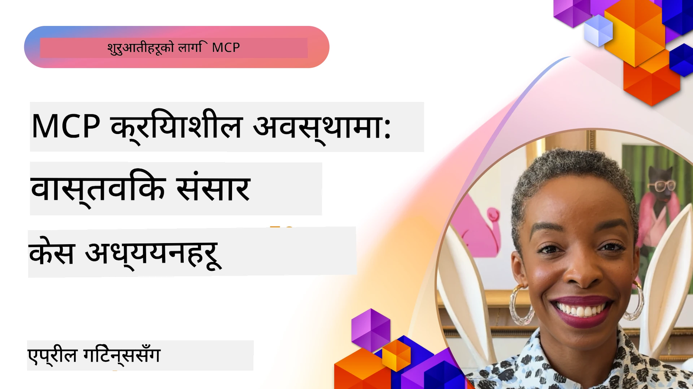

# MCP क्रियामा: वास्तविक विश्वको केस अध्ययनहरू

_(यो पाठको भिडियो हेर्न माथिको चित्रमा क्लिक गर्नुहोस्)_

मोडेल कन्टेक्स्ट प्रोटोकल (MCP) एआई अनुप्रयोगहरू डेटा, उपकरणहरू र सेवाहरूसँग अन्तर्क्रिया गर्ने तरिका रूपान्तरण गर्दैछ। यस अनुभागले विभिन्न उद्यम परिदृश्यहरूमा MCP का व्यावहारिक अनुप्रयोगहरू देखाउने वास्तविक विश्व केस अध्ययनहरू प्रस्तुत गर्दछ।

## अवलोकन

यस अनुभागले MCP कार्यान्वयनका ठोस उदाहरणहरू प्रदर्शन गर्दछ, जसले देखाउँछ कि कसरी संगठनहरूले यो प्रोटोकल प्रयोग गरी जटिल व्यापार चुनौतीहरू समाधान गर्दैछन्। यी केस अध्ययनहरूलाई अध्ययन गरेर, तपाइँले वास्तविक संसारका अवस्थामा MCP को बहुमुखिता, स्केलेबिलिटी र व्यवहारिक लाभहरूबारे जानकारी प्राप्त गर्नुहुनेछ।

## मुख्य सिकाइ लक्ष्यहरू

यी केस अध्ययनहरूको खोजी गरेर, तपाइँले:

- कसरी MCP विशिष्ट व्यापार समस्याहरू समाधान गर्न प्रयोग गर्न सकिन्छ बुझ्नुहोस्
- विभिन्न एकीकरण ढाँचा र वास्तुकला दृष्टिकोणहरूको बारेमा जान्नुहोस्
- उद्यम वातावरणमा MCP लागू गर्दा उत्कृष्ट अभ्यासहरू पहिचान गर्नुहोस्
- वास्तविक विश्व कार्यान्वयनहरूमा देखिएका चुनौतीहरू र समाधानहरूको गहिरो बुझाइ प्राप्त गर्नुहोस्
- आफ्नै परियोजनाहरूमा यस्तै ढाँचाहरू लागू गर्ने अवसरहरू चिन्ह लगाउनुहोस्

## प्रस्तुत केस अध्ययनहरू

### १. [Azure AI Travel Agents – Reference Implementation](./travelagentsample.md)

यस केस अध्ययनले माइक्रोसफ्टको व्यापक संदर्भ समाधानलाई जाँच गर्दछ जसले कसरी MCP, Azure OpenAI, र Azure AI Search प्रयोग गरी बहु-एजेण्ट, एआई-सञ्चालित यात्रा योजना एप्लिकेशन निर्माण गर्ने देखाउँछ। यस परियोजनाले प्रदर्शन गर्दछ:

- MCP मार्फत बहु-एजेण्ट संयोजन
- Azure AI Search सहित उद्यम डेटा एकीकरण
- Azure सेवाहरू प्रयोग गरी सुरक्षित र स्केलेबल वास्तुकला
- पुन: प्रयोग गर्न सकिने MCP कम्पोनेन्टहरूसँग विस्तारयोग्य उपकरणहरू
- Azure OpenAI द्वारा सञ्चालित संवादात्मक प्रयोगकर्ता अनुभव

वास्तुकला र कार्यान्वयन विवरणहरूले MCP लाई समन्वय तहको रूपमा प्रयोग गरी जटिल बहु-एजेण्ट प्रणालीहरू बनाउनका लागि मूल्यवान् बुझाइ प्रदान गर्दछ।

### २. [YouTube डेटा बाट Azure DevOps आइटमहरू अपडेट गर्ने](./UpdateADOItemsFromYT.md)

यस केस अध्ययनले कार्यप्रवाह स्वचालित बनाउन MCP को व्यवहारिक प्रयोग देखाउँछ। यसले देखाउँछ कि कसरी MCP उपकरणहरू प्रयोग गरी:

- अनलाइन प्लेटफर्महरू (YouTube) बाट डेटा निकाल्ने
- Azure DevOps प्रणालीहरूमा कार्य आइटमहरू अपडेट गर्ने
- पुनरावृत्त स्वचालित कार्यप्रवाहहरू सिर्जना गर्ने
- भिन्न प्रणालीहरूमा डेटा एकीकृत गर्ने

यस उदाहरणले देखाउँछ कि तुलना गर्दै सादा MCP कार्यान्वयनहरूले नियमित कार्यहरू स्वचालित बनाउँदै र प्रणालीहरूबीच डेटा स्थिरता सुधार्दै महत्त्वपूर्ण दक्षता वृद्धि कसरी प्रदान गर्न सक्छ।

### ३. [MCP सँग वास्तविक-समय कागजात पुन:प्राप्ति](./docs-mcp/README.md)

यस केस अध्ययनले तपाइँलाई Python कन्सोल क्लाइन्टलाई Model Context Protocol (MCP) सर्भरमा जडान गरेर वास्तविक-समय, सन्दर्भ-स‌चेत Microsoft कागजातहरू पुन:प्राप्ति र लग गर्ने तरिका देखाउँछ। तपाइँले सिक्नुहुनेछ:

- आधिकारिक MCP SDK र Python क्लाइन्ट प्रयोग गरी MCP सर्भरमा जडान कसरी गर्ने
- दक्ष, वास्तविक-समय डेटा पुन:प्राप्तिका लागि स्ट्रिमिङ HTTP क्लाइन्टहरूको प्रयोग
- सर्भरमा कागजात उपकरणहरू कल गरेर प्रतिक्रियाहरू सिधै कन्सोलमा लग गर्ने
- टर्मिनल छोड्नु बिना नै आफ्नो कार्यप्रवाहमा अद्यावधिक Microsoft कागजातहरू समाहित गर्ने

अध्यायमा व्यावहारिक अभ्यास, न्यूनतम कार्यशील कोड नमूना र गहिरो सिकाइका लागि अतिरिक्त स्रोतहरूको लिंकहरू समावेश छन्। MCP कन्सोल-आधारित वातावरणहरूमा कागजात पहुँच र विकासकर्ता उत्पादकतामा कसरी रूपान्तरण गर्न सक्छ भन्ने बुझ्न लिंक गरिएको अध्यायमा पूर्ण चलाइ हेर्नुहोस्।

### ४. [MCP सँग इन्टरऐक्टिभ अध्ययन योजना निर्माणकर्ता वेब एप](./docs-mcp/README.md)

यस केस अध्ययनले Chainlit र Model Context Protocol (MCP) प्रयोग गरेर कुनै पनि विषयको लागि व्यक्तिगत अध्ययन योजना उत्पादन गर्ने इन्टरऐक्टिभ वेब एप कसरी बनाउने देखाउँछ। प्रयोगकर्ताहरू विषय (जस्तै "AI-900 प्रमाणपत्र") र अध्ययन अवधि (उदाहरण, ८ हप्ता) निर्दिष्ट गर्न सक्छन्, र एपले साप्ताहिक रूपमा सिफारिस गरिएका सामग्रीहरूको विवरण प्रदान गर्नेछ। Chainlit ले संवादात्मक च्याट इन्टरफेस सक्षम पार्छ, जसले अनुभवलाई रमाइलो र अनुकूल बनाउँछ।

- Chainlit द्वारा सञ्चालित संवादात्मक वेब एप
- विषय र अवधि निर्धारणका लागि प्रयोगकर्ता-नियन्त्रित प्रम्प्टहरू
- MCP प्रयोग गरी हप्तामा-हप्ता सामग्री सिफारिसहरू
- च्याट इन्टरफेसमा वास्तविक-समय, अनुकूल प्रतिक्रियाहरू

यो परियोजनाले आधुनिक वेब वातावरणमा संवादात्मक एआई र MCP लाई संयोजन गरी गतिशील, प्रयोगकर्ता-केन्द्रित शैक्षिक उपकरणहरू कसरी सिर्जना गर्ने देखाउँछ।

### ५. [VS Code मा MCP सर्भरसँग सम्पादक भित्र कागजातहरू](./docs-mcp/README.md)

यस केस अध्ययनले तपाइँ कसरी MCP सर्भर प्रयोग गरी Microsoft Learn Docs लाई सिधै आफ्नो VS Code वातावरणमा ल्याउन सक्नुहुन्छ—ब्राउजर ट्याब परिवर्तन नगरीकन—देखाउँछ। तपाइँले देख्नुहुनेछ कि कसरी:

- MCP प्यानल वा कमान्ड प्यालेट प्रयोग गरी VS Code भित्र तुरुन्तै कागजातहरू खोज्ने र पढ्ने
- सन्दर्भ कागजातहरू र लिंकहरू सिधै आफ्नो README वा कोर्स मार्कडाउन फाइलहरूमा समावेश गर्ने
- GitHub Copilot र MCP सँगै प्रयोग गरी सहज, AI-सञ्चालित कागजात र कोड कार्यप्रवाहहरू बनाउन
- वास्तविक-समय प्रतिक्रिया र माइक्रोसफ्ट स्रोतिय शुद्धता प्रयोग गरी कागजातहरू प्रमाणित र सुधार गर्ने
- MCP लाई GitHub कार्यप्रवाहसँग समेकन गरी निरन्तर कागजात प्रमाणीकरण गर्ने

कार्यान्वयनमा समावेश छन्:

- सजिलो सेटअपका लागि उदाहरण `.vscode/mcp.json` कन्फिगरेसन
- सम्पादक भित्रको अनुभवका लागि स्क्रिनशट-आधारित चरणहरू
- अधिकतम उत्पादकताका लागि Copilot र MCP सँग संयोजन गर्ने सुझावहरू

यो परिदृश्य कोर्स लेखकहरू, कागजात लेखकहरू र विकासकर्ताहरूका लागि आदर्श छ जसले आफ्नो सम्पादकमा ध्यान केन्द्रित राख्नु पर्ने क्रममा कागजातहरू, Copilot र प्रमाणीकरण उपकरणहरू सबै MCP द्वारा सञ्चालित अवस्थामा काम गर्न चाहन्छन्।

### ६. [APIM MCP सर्भर निर्माण](./apimsample.md)

यस केस अध्ययनले Azure API Management (APIM) प्रयोग गरी कसरी MCP सर्भर सिर्जना गर्ने चरण-द्वारा-चरण मार्गदर्शन प्रदान गर्दछ। यसले समेट्छ:

- Azure API Management मा MCP सर्भर सेटअप गर्ने
- API अपरेशन्सलाई MCP उपकरणहरूका रूपमा एक्स्पोज गर्ने
- दर सीमांकन र सुरक्षा नीतिहरू कन्फिगर गर्ने
- Visual Studio Code र GitHub Copilot प्रयोग गरी MCP सर्भर परीक्षण गर्ने

यस उदाहरणले Azure को क्षमता प्रयोग गरी कसरी धेरै अनुप्रयोगहरूमा प्रयोग गर्न सकिने दृढ MCP सर्भर बनाउन सकिन्छ देखाउँछ, जसले AI प्रणालीहरूलाई उद्यम API सँग राम्रोसँग एकीकृत गर्न मद्दत गर्दछ।

### ७. [GitHub MCP रजिस्ट्री — एजेण्टिक एकीकरणलाई तीव्र बनाउँदै](https://github.com/mcp)

यस केस अध्ययनले GitHub को MCP रजिस्ट्रीलाई (सेप्टेम्बर 2025 मा सुरू गरिएको) जाँच गर्दछ, जसले एआई इकोसिस्टमको एक महत्वपूर्ण चुनौती समाधान गर्दछ: Model Context Protocol (MCP) सर्भरहरूको खण्डित पत्ता लगाउने र तैनाथ गर्ने समस्या।

#### अवलोकन
**MCP रजिस्ट्री** धेरै रिपोजिटरी र रजिस्ट्रीहरूमा वितरित MCP सर्भरहरूको समस्यालाई समाधान गर्दछ, जसले पहिले एकीकरण ढिलो र त्रुटिपूर्ण बनाएको थियो। यी सर्भरहरूले एआई एजेण्टहरूलाई API, डाटाबेस र कागजात स्रोतहरूसँग अन्तर्क्रिया गर्न सक्षम पार्दछन्।

#### समस्या विवरण
एजेण्टिक कार्यप्रवाह निर्माण गर्ने विकासकर्ताहरूले अनेकौं समस्या भोगेका थिए:
- विभिन्न प्लेटफर्महरूमा MCP सर्भरहरूको **कम खोजयोग्यता**
- फोरम र कागजातहरूमा **पुनरावृत्त सेटअप प्रश्नहरू**
- अविश्वसनीय र प्रमाणित नसोकेको स्रोतहरूबाट आउने **सुरक्षा जोखिमहरू**
- सर्भर गुणवत्ता र अनुकूलतामा **मानकीकरणको अभाव**

#### समाधान वास्तुकला
GitHub को MCP रजिस्ट्रीले भरोसायोग्य MCP सर्भरहरूलाई केन्द्रित गर्दछ जसका प्रमुख विशेषताहरू छन्:
- VS Code मार्फत **एक-क्लिक इन्स्टल** सहज सेटअपका लागि
- ताराहरू, गतिविधि, र समुदाय प्रमाणीकरण द्वारा **संकेत-बाहेक-शोर** क्रमबद्धता
- GitHub Copilot र अन्य MCP-अनुकूल उपकरणहरूसँग **प्रत्यक्ष एकीकरण**
- समुदाय र उद्यम साझेदारहरूलाई योगदान दिने **खुला योगदान मोडेल**

#### व्यापार प्रभाव
रजिस्ट्रीले मापनयोग्य सुधारहरू पुर्‍याएको छ:
- Microsoft Learn MCP Server जस्ता उपकरणहरू प्रयोग गर्ने विकासकर्ताहरूको लागि **छिटो अनबोर्डिंग**, जसले आधिकारिक कागजातहरू सिधै एजेण्टमा स्ट्रिम गर्दछ
- `github-mcp-server` जस्ता विशेष सर्भरहरूले प्राकृतिक भाषा GitHub स्वचालन (PR सिर्जना, CI पुनःरन, कोड स्क्यानिङ) प्रदान गरेर **उत्पादकतामा सुधार**
- निरीक्षित सूची र पारदर्शी कन्फिगरेसन मापदण्डहरूमार्फत **दृढ इकोसिस्टम विश्वास**

#### रणनीतिक मूल्य
एजेण्ट जीवनचक्र व्यवस्थापन र पुनरुत्पाद्य कार्यप्रवाहमा विशेषज्ञहरूका लागि MCP रजिस्ट्रीले प्रदान गर्दछ:
- **मानकीकृत कम्पोनेन्टहरूसँग मोड्युलर एजेण्ट तैनाथी**
- निरन्तर परीक्षण र प्रमाणीकरणका लागि **रजिस्ट्री-समर्थित मूल्यांकन पाइपलाइनहरू**
- विभिन्न AI प्लेटफर्महरूबीचको **मर्यादित एकीकरण** सक्षम पार्ने क्रस-टुल अन्तरक्रियाशीलता

यस केस अध्ययनले देखाउँछ कि MCP रजिस्ट्री केवल निर्देशिका मात्र होइन—यो स्केलेबल, वास्तविक विश्व मोडेल एकीकरण र एजेण्टिक प्रणाली तैनाथीको लागि एक आधारभूत प्लेटफर्म हो।

## निष्कर्ष

यी सात व्यापक केस अध्ययनहरूले मोडेल कन्टेक्स्ट प्रोटोकलको असाधारण बहुमुखिता र वास्तविक विश्वका विभिन्न परिदृश्यहरूमा व्यवहारिक अनुप्रयोगहरू देखाउँछन्। जटिल बहु-एजेण्ट यात्रा योजना प्रणालीहरू र उद्यम API व्यवस्थापनदेखि लिएर सहज कागजात कार्यप्रवाह र क्रान्तिकारी GitHub MCP रजिस्ट्रीसम्म, यी उदाहरणहरूले देखाउँछन् कि कसरी MCP ले AI प्रणालीहरूलाई आवश्यक उपकरणहरू, डेटा र सेवाहरूसँग जडान गर्ने मानकीकृत, स्केलेबल तरिका प्रदान गर्दछ।

केस अध्ययनहरूले MCP कार्यान्वयनका विभिन्न आयामहरू व्याख्या गर्छन्:
- **उद्यम एकीकरण**: Azure API प्रबंधन र Azure DevOps स्वचालन
- **बहु-एजेण्ट संयोजन**: समन्वित AI एजेण्टहरूसँग यात्रा योजना
- **विकासकर्ता उत्पादकतामा वृद्धि**: VS Code एकीकरण र वास्तविक-समय कागजात पहुँच
- **इकोसिस्टम विकास**: GitHub को MCP रजिस्ट्री एक आधारभूत प्लेटफर्मको रुपमा
- **शैक्षिक अनुप्रयोगहरू**: संवादात्मक अध्ययन योजना निर्माता र संवादात्मक इन्टरफेसहरू

यी कार्यान्वयनहरू अध्ययन गर्दा, तपाइँ महत्वपूर्ण बुझाइहरू प्राप्त गर्नुहुनेछ:
- विभिन्न स्केल र प्रयोग केसहरूको लागि **वास्तुकला ढाँचाहरू**
- कार्यक्षमता र मर्मतसम्भार सन्तुलन गर्ने **कार्यान्वयन रणनीतिहरू**
- उत्पादन तैनाथीका लागि **सुरक्षा र स्केलेबिलिटी** विचारहरू
- MCP सर्भर विकास र क्लाइन्ट एकीकरणका लागि **श्रेष्ठ अभ्यासहरू**
- आपसमा जडान भएका AI-सञ्चालित समाधानहरू निर्माण गर्नको लागि **इकोसिस्टम सोच**

यी उदाहरणहरूले संयुक्त रूपमा देखाउँछन् कि MCP केवल सैद्धान्तिक संरचना मात्र नभई परिपक्व, उत्पादन-योग्य प्रोटोकल हो जुन जटिल व्यापार चुनौतीहरूलाई व्यावहारिक समाधानहरू प्रदान गर्न सक्षम छ। चाहे तपाइँ साधारण स्वचालन उपकरणहरू बनाउँदै हुनुहुन्छ वा जटिल बहु-एजेण्ट प्रणालीहरू, यहाँ चित्रित ढाँचाहरू र दृष्टिकोणहरूले आफ्नै MCP परियोजनाहरूका लागि एक बलियो आधार प्रदान गर्छ।

## थप स्रोतहरू

- [Azure AI Travel Agents GitHub Repository](https://github.com/Azure-Samples/azure-ai-travel-agents)
- [Azure DevOps MCP Tool](https://github.com/microsoft/azure-devops-mcp)
- [Playwright MCP Tool](https://github.com/microsoft/playwright-mcp)
- [Microsoft Docs MCP Server](https://github.com/MicrosoftDocs/mcp)
- [GitHub MCP Registry — Accelerating Agentic Integration](https://github.com/mcp)
- [MCP Community Examples](https://github.com/microsoft/mcp)

## अर्को के छ

- अघिल्लो: [Module 8: Best Practices](../08-BestPractices/README.md)
- अर्को: [Module 10: Streamlining AI Workflows: Building an MCP Server with AI Toolkit](../10-StreamliningAIWorkflowsBuildingAnMCPServerWithAIToolkit/README.md)

---

<!-- CO-OP TRANSLATOR DISCLAIMER START -->
**अस्वीकरण**:
यो कागजात AI अनुवाद सेवा [Co-op Translator](https://github.com/Azure/co-op-translator) प्रयोग गरेर अनुवाद गरिएको हो। हामी शुद्धताका लागि प्रयास गर्छौं, तर कृपया ध्यान दिनुहोस् कि स्वचालित अनुवादमा त्रुटि वा असत्यता हुन सक्छ। मौलिक कागजात यसको मूल भाषामा आधिकारिक स्रोत मान्नुपर्छ। महत्वपूर्ण जानकारीका लागि व्यावसायिक मान्छेको अनुवाद सिफारिश गरिन्छ। यस अनुवादको प्रयोगबाट उत्पन्न कुनै पनि गलतफहमी वा गलत व्याख्याको लागि हामी जिम्मेवार छैनौं।
<!-- CO-OP TRANSLATOR DISCLAIMER END -->