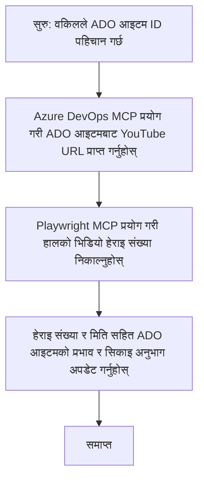

# केस स्टडी: MCP सहित YouTube डाटाबाट Azure DevOps आइटमहरू अपडेट गर्ने

> **अस्वीकरण:** YouTube जस्ता प्लेटफर्मबाट डाटा लिएर Azure DevOps आइटमहरू अपडेट गर्ने प्रक्रिया स्वचालित गर्न पहिले देखि नै अनलाइन उपकरणहरू र रिपोर्टहरू उपलब्ध छन्। तलको परिदृश्य केवल एएमसीपी उपकरणहरू कसरी स्वचालन र एकीकरण कार्यहरूको लागि प्रयोग गर्न सकिन्छ भन्ने उदाहरण स्वरूप प्रदान गरिएको हो।

## अवलोकन

यो केस स्टडीले मोडल कण्टेक्स्ट प्रोटोकल (MCP) र यसको उपकरणहरू कसरी अनलाइन प्लेटफर्महरूबाट जस्तै YouTube बाट प्राप्त जानकारीमार्फत Azure DevOps (ADO) कार्य आइटमहरू अपडेट गर्न स्वचालन गर्न सकिन्छ भन्ने एउटा उदाहरण देखाउँछ। वर्णन गरिएको परिदृश्य यी उपकरणहरूको फराकिलो क्षमताहरू मध्ये एउटा मात्र उदाहरण हो, जुन धेरै समान स्वचालन आवश्यकताहरूमा अनुकूलन गर्न सकिन्छ।

यस उदाहरणमा, एक एडभोकेटले ADO आइटमहरू प्रयोग गरी अनलाइन सत्रहरू ट्र्याक गर्छ, जहाँ प्रत्येक आइटममा YouTube भिडियो URL समावेश छ। MCP उपकरणहरूको मद्दतले, एडभोकेटले ADO आइटमहरूलाई नवीनतम भिडियो मेट्रिक्स जस्तै भ्यु काउन्टसहित दोहोरिने र स्वचालित तरिकाले अद्यावधिक गर्न सक्छ। यो तरिका अनलाइन स्रोतहरूबाट जानकारी ADO वा अन्य प्रणालीहरूसँग एकीकृत गर्नुपर्ने अन्य केसहरूमा पनि सामान्यीकरण गर्न सकिन्छ।

## परिदृश्य

एडभोकेट अनलाइन सत्रहरू र समुदाय सहभागिताको प्रभाव ट्र्याक गर्न जिम्मेवार छ। प्रत्येक सत्र 'DevRel' परियोजनामा ADO कार्य आइटमको रूपमा लग गरिएको छ, र कार्य आइटममा YouTube भिडियो URL को लागि एउटा फिल्ड छ। सत्रको पहुँच सही रूपमा रिपोर्ट गर्न, एडभोकेटले वर्तमान भिडियो भ्यु संख्या र जानकारी प्राप्त गरिएको मिति ADO आइटममा अपडेट गर्न आवश्यक छ।

## प्रयोग गरिएका उपकरणहरू

- [Azure DevOps MCP](https://github.com/microsoft/azure-devops-mcp): MCP मार्फत ADO कार्य आइटमहरूमा प्रोग्रामेटिक पहुँच र अपडेट सक्षम पार्दछ।
- [Playwright MCP](https://github.com/microsoft/playwright-mcp): वेब पृष्ठहरूबाट लाइव डाटा निकाल्न ब्राउजर क्रियाकलाप स्वचालित गर्ने उपकरण, जस्तै YouTube भिडियो तथ्याङ्कहरू।

## चरण-द्वारा-चरण कार्यप्रवाह

1. **ADO आइटम पहिचान गर्ने**: 'DevRel' परियोजनामा ADO कार्य आइटम ID (जस्तै 1234) सहित सुरु गर्ने।
2. **YouTube URL प्राप्त गर्ने**: ADO कार्य आइटमबाट YouTube URL प्राप्त गर्न Azure DevOps MCP उपकरण प्रयोग गर्ने।
3. **भिडियो भ्यु संख्या निकाल्ने**: Playwright MCP उपकरण प्रयोग गरी YouTube URL मा जान र वर्तमान भ्यु काउन्ट निकाल्ने।
4. **ADO आइटम अपडेट गर्ने**: नयाँतम भ्यु काउन्ट र प्राप्त मिति 'Impact and Learnings' खण्डमा लेख्न Azure DevOps MCP उपकरण प्रयोग गर्ने।

## उदाहरण प्रॉम्प्ट

```bash
- Work with the ADO Item ID: 1234
- The project is '2025-Awesome'
- Get the YouTube URL for the ADO item
- Use Playwright to get the current views from the YouTube video
- Update the ADO item with the current video views and the updated date of the information
```

## Mermaid Flowchart


## प्राविधिक कार्यान्वयन

- **MCP समन्वय:** कार्यप्रवाह MCP सर्भरद्वारा समन्वयित हुन्छ, जसले Azure DevOps MCP र Playwright MCP दुवै उपकरणहरूको प्रयोग संयोजन गर्दछ।
- **स्वचालन:** प्रक्रिया म्यानुअल रूपमा ट्रिगर गर्न सकिन्छ वा नियमित अन्तरालमा चलाउन समय निर्धारण गर्न सकिन्छ ताकि ADO आइटमहरू अद्यावधिक रहून्।
- **विस्तारयोग्यता:** सोही ढाँचालाई अन्य अनलाइन मेट्रिक्स (जस्तै रुचि, टिप्पणीहरू) वा अन्य प्लेटफर्मबाट ADO आइटमहरू अपडेट गर्न विस्तार गर्न सकिन्छ।

## परिणामहरू र प्रभाव

- **दक्षता:** भिडियो मेट्रिक्स प्राप्ति र अपडेट स्वचालित गरेर एडभोकेटहरूको म्यानुअल प्रयास कम पार्दछ।
- **शुद्धता:** ADO आइटमहरू अनलाइन स्रोतहरूबाट उपलब्ध सबैभन्दा नयाँ डाटाहरू प्रतिबिम्बित गर्ने सुनिश्चित गर्दछ।
- **दोहर्याउन योग्य:** अन्य डाटा स्रोतहरू वा मेट्रिक्स समावेश गर्ने समान परिदृश्यमाथि पुनः प्रयोग गर्न मिल्ने कार्यप्रवाह प्रदान गर्दछ।

## सन्दर्भहरू

- [Azure DevOps MCP](https://github.com/microsoft/azure-devops-mcp)
- [Playwright MCP](https://github.com/microsoft/playwright-mcp)
- [Model Context Protocol (MCP)](https://modelcontextprotocol.io/)

## के हुनेछ

- फिर्ता जानुहोस्: [Case Studies Overview](./README.md)
- अर्को: [Real-Time Documentation Retrieval with MCP](./docs-mcp/README.md)

---

<!-- CO-OP TRANSLATOR DISCLAIMER START -->
**अस्वीकरण**:
यो कागजात AI अनुवाद सेवा [Co-op Translator](https://github.com/Azure/co-op-translator) प्रयोग गरी अनुवाद गरिएको हो। हामी शुद्धताका लागि प्रयासरत छौँ, तर कृपया ध्यान दिनुहोस् कि स्वचालित अनुवादहरूमा त्रुटिहरू वा अशुद्धता हुन सक्छन्। मूल कागजात यसको स्वदेशी भाषामा नै अधिकारप्राप्त स्रोत मानिनेछ। महत्वपूर्ण सूचनाहरूको लागि पेशेवर मानव अनुवाद सल्लाहयोग्य छ। यस अनुवादको प्रयोगबाट उत्पन्न हुने कुनै पनि गलतफहमी वा भ्रमहरूको लागि हामी जिम्मेवार हुनुहुन्न।
<!-- CO-OP TRANSLATOR DISCLAIMER END -->