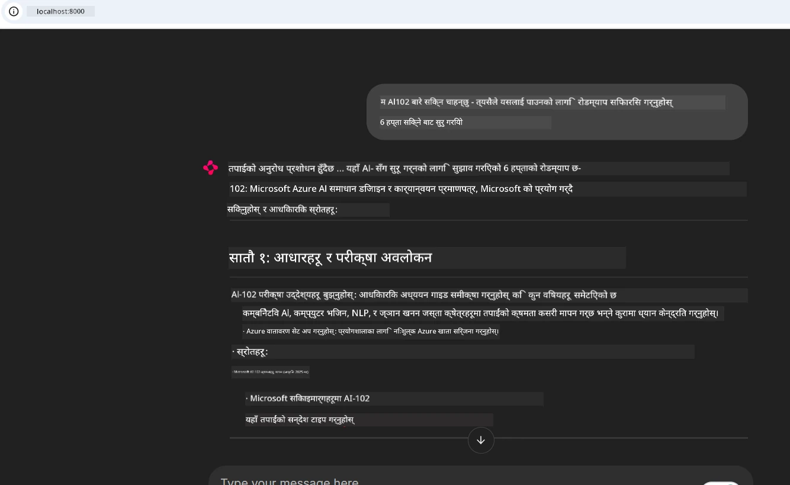
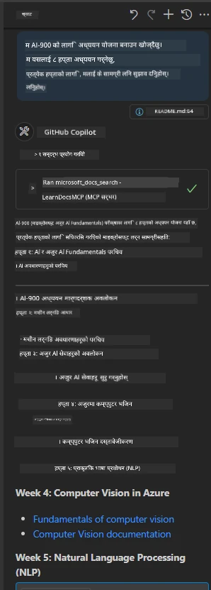

# केस स्टडी: क्लाइन्टबाट Microsoft Learn Docs MCP सर्भरमा जडान

के तपाईं कहिल्यै डकुमेन्टेसन साइटहरू, Stack Overflow, र अनगिन्ती सर्च इन्जिन ट्याबहरू बीच झ्याल मार्दै कोडको समस्याको समाधान खोज्ने क्रममा फसेको महसुस गर्नुभएको छ? सायद तपाईंले डकुमेन्टेसनका लागि दोस्रो मोनीटर राख्नुहुन्छ, वा IDE र ब्राउजरबीच निरन्तर alt-tab गर्दै हुनुहुन्छ। के तपाईंको कार्यप्रवाहमा डकुमेन्टेसनलाई सिधै ल्याउन सकिन्थ्यो भने—तपाईंका एपहरू, तपाईंको IDE मा, वा तपाईंका आफ्नै निजी उपकरणहरूमा समाहित गरेर? यस केस स्टडीमा, हामी तपाईंलाई देखाउँछौं कसरी Microsoft Learn Docs MCP सर्भरसँग आफ्नो क्लाइन्ट एपबाट सिधै जडान गर्ने।

## अवलोकन

आधुनिक विकास केवल कोड लेख्नु मात्र होइन—उपयुक्त समयमा उपयुक्त जानकारी पाउनु हो। डकुमेन्टेसन सबै ठाउँमा पाइन्छ, तर यो अझै पनि तपाईंलाई सबैभन्दा धेरै आवश्यक पर्ने ठाउँमा—तपाईंका उपकरणहरू र कार्यप्रवाह सम्म सीमित हुँदैन। डकुमेन्टेसन प्रत्यक्ष रूपमा तपाईंका एप्लिकेशनहरूमा समाहित गरेर, तपाईं समय बचाउन सक्नुहुन्छ, सन्दर्भ परिवर्तन कम गर्न सक्नुहुन्छ, र उत्पादकता बढाउन सक्नुहुन्छ। यस खण्डमा, हामी तपाईंलाई देखाउनेछौं कसरी Microsoft Learn Docs MCP सर्भरमा क्लाइन्ट जडान गर्ने, जसले तपाईंलाई वास्तविक समयको, सन्दर्भ-सचेत डकुमेन्टेसन एपबाट बाहिर निस्किनु नपर्ने गरी पहुँच दिन्छ।

हामी जडान स्थापित गर्ने प्रक्रिया, अनुरोध पठाउने, र स्ट्रिमिङ प्रतिक्रिया कुशलतापूर्वक कसरी व्यवस्थापन गर्ने कदम–चरणमा देखाउनेछौं। यो तरिका तपाईंको कार्यप्रवाहलाई सरल बनाउन मात्रै होइन, स्मार्ट र बढी उपयोगी विकासकर्ता उपकरणहरू बनाउन पनि मद्दत गर्नेछ।

## सिकाइका उद्देश्यहरू

किन हामी यो गर्दैछौं? किनभने सबैभन्दा राम्रो विकासकर्ता अनुभव त्यस्ता हुन्छन् जसले अवरोध हटाउँछन्। कल्पना गर्नुहोस् यस्तो संसार जहाँ तपाईंको कोड सम्पादक, च्याटबोट, वा वेब एपले तपाईंका डकुमेन्टेसन प्रश्नहरू तुरुन्तै Microsoft Learn बाट नवीनतम सामग्री प्रयोग गरेर उत्तर दिन सक्छ। यस अध्यायको अन्त्यसम्म, तपाईं जान्नुहुनेछ कसरी:

- डकुमेन्टेसनका लागि MCP सर्भर- क्लाइन्ट संचारका आधारभूत कुरा बुझ्ने
- Microsoft Learn Docs MCP सर्भरसँग जडान गर्न कन्सोल वा वेब एप्लिकेशन कार्यान्वयन गर्ने
- वास्तविक समयको डकुमेन्टेसन प्राप्तिका लागि स्ट्रिमिङ HTTP क्लाइंट प्रयोग गर्ने
- तपाईंको एपमा डकुमेन्टेसन प्रतिक्रियाहरू लग गर्ने र व्याख्या गर्ने

यी सीपले तपाईंलाई प्रतिक्रिया मात्र नभएर साँच्चिकै अन्तरक्रियात्मक र सन्दर्भ-सचेत उपकरणहरू बनाउन मद्दत गर्नेछ।

## परिदृश्य १ - MCP संग वास्तविक समय डकुमेन्टेसन प्राप्ति

यस परिदृश्यमा, हामी तपाईंलाई Microsoft Learn Docs MCP सर्भरसँग क्लाइन्ट कसरी जडान गर्ने देखाउन जाँदैछौं, ताकि तपाईं आफ्नो एपबाट बाहिर बिना नै वास्तविक समयको, सन्दर्भ-सचेत डकुमेन्टेसन पहुँच गर्न सक्नुहुन्छ।

यसलाई अभ्यासमा ल्याऔं। तपाईंको काम छ एउटा एप लेख्नु जुन Microsoft Learn Docs MCP सर्भरसँग जडान गर्छ, `microsoft_docs_search` उपकरण कल गर्छ, र स्ट्रिमिङ प्रतिक्रियालाई कन्सोलमा लग गर्छ।

### किन यो तरिका?
किनभने यो थप उन्नत एकीकरणका लागि आधार हो—चाहे तपाईं च्याटबोट, IDE विस्तार, वा वेब ड्यासबोर्ड निर्माण गर्न चाहनुहुन्छ।

यो केस स्टडी भित्रको [`solution`](./solution/README.md) फोल्डरमा यस परिदृश्यको कोड र निर्देशनहरू फेला पार्न सक्नुहुन्छ। चरणहरूले तपाईंलाई जडान सेटअपमा मार्गनिर्देशन गर्नेछ:
- आधिकारिक MCP SDK र स्ट्रिमेबल HTTP क्लाइन्ट प्रयोग गरी जडान
- डकुमेन्टेसन प्राप्तिका लागि क्वेरी प्यारामिटर संग `microsoft_docs_search` उपकरण कल
- उचित लग र त्रुटि व्यवस्थापन कार्यान्वयन
- प्रयोगकर्ताहरूलाई धेरै खोज प्रश्नहरू प्रविष्ट गर्न दिने अन्तःक्रियात्मक कन्सोल इन्टरफेस सिर्जना

यस परिदृश्यले देखाउँछ कसरी:
- Docs MCP सर्भरसँग जडान गर्ने
- क्वेरी पठाउने
- परिणामहरू पार्स गरी मुद्रण गर्ने

समाधान चलाएको बेला यसप्रकार देखिन सक्छ:

```
Prompt> What is Azure Key Vault?
Answer> Azure Key Vault is a cloud service for securely storing and accessing secrets. ...
```

तल न्यूनतम नमूना समाधान छ। पूर्ण कोड र विवरणहरू समाधान फोल्डरमा उपलब्ध छन्।

<details>
<summary>Python</summary>

```python
import asyncio
from mcp.client.streamable_http import streamablehttp_client
from mcp import ClientSession

async def main():
    async with streamablehttp_client("https://learn.microsoft.com/api/mcp") as (read_stream, write_stream, _):
        async with ClientSession(read_stream, write_stream) as session:
            await session.initialize()
            result = await session.call_tool("microsoft_docs_search", {"query": "Azure Functions best practices"})
            print(result.content)

if __name__ == "__main__":
    asyncio.run(main())
```

- पूर्ण कार्यान्वयन र लगका लागि [`scenario1.py`](../../../../09-CaseStudy/docs-mcp/solution/python/scenario1.py) हेर्नुहोस्।
- स्थापना र प्रयोग निर्देशनका लागि सोही फोल्डरमा रहेको [`README.md`](./solution/python/README.md) पढ्नुहोस्।
</details>

## परिदृश्य २ - MCP सँग अन्तरक्रियात्मक अध्ययन योजना जेनेरेटर वेब एप

यस परिदृश्यमा, तपाईं सिक्नुहुनेछ कसरी Docs MCP लाई वेब विकास परियोजनामा समाहित गर्ने। उद्देश्य भनेको प्रयोगकर्ताहरूलाई Microsoft Learn डकुमेन्टेसन वेब इन्टरफेसबाट सिधै खोज्न सक्षम बनाउनु हो, जसले तपाईंको एप वा साइट भित्र डकुमेन्टेसन तत्क्षण पहुँचयोग्य बनाउँछ।

तपाईंले सिक्नुहुनेछ:
- वेब एप सेटअप गर्ने
- Docs MCP सर्भरसँग जडान गर्ने
- प्रयोगकर्ता इनपुट व्यवस्थापन र परिणाम प्रदर्शन गर्ने

समाधान चलाउँदा यसप्रकार देखिन सक्छ:

```
User> I want to learn about AI102 - so suggest the roadmap to get it started from learn for 6 weeks

Assistant> Here’s a detailed 6-week roadmap to start your preparation for the AI-102: Designing and Implementing a Microsoft Azure AI Solution certification, using official Microsoft resources and focusing on exam skills areas:

---
## Week 1: Introduction & Fundamentals
- **Understand the Exam**: Review the [AI-102 exam skills outline](https://learn.microsoft.com/en-us/credentials/certifications/exams/ai-102/).
- **Set up Azure**: Sign up for a free Azure account if you don't have one.
- **Learning Path**: [Introduction to Azure AI services](https://learn.microsoft.com/en-us/training/modules/intro-to-azure-ai/)
- **Focus**: Get familiar with Azure portal, AI capabilities, and necessary tools.

....more weeks of the roadmap...

Let me know if you want module-specific recommendations or need more customized weekly tasks!
```

तल न्यूनतम नमूना समाधान छ। पूर्ण कोड र विवरणहरू समाधान फोल्डरमा उपलब्ध छन्।



<details>
<summary>Python (Chainlit)</summary>

Chainlit संवादात्मक AI वेब एप बनाउन प्रयोग हुने फ्रेमवर्क हो। यसले तीव्र प्रोटोटाइपिङ र प्रयोगकर्ता मैत्री इन्टरफेसका लागि MCP उपकरणहरू कल गरी वास्तविक समयमा नतिजा देखाउन सजिलो बनाउँछ।

```python
import chainlit as cl
import requests

MCP_URL = "https://learn.microsoft.com/api/mcp"

@cl.on_message
def handle_message(message):
    query = {"question": message}
    response = requests.post(MCP_URL, json=query)
    if response.ok:
        result = response.json()
        cl.Message(content=result.get("answer", "No answer found.")).send()
    else:
        cl.Message(content="Error: " + response.text).send()
```

- पूर्ण कार्यान्वयनका लागि [`scenario2.py`](../../../../09-CaseStudy/docs-mcp/solution/python/scenario2.py) हेर्नुहोस्।
- सेटअप र चलाउने निर्देशनका लागि [`README.md`](./solution/python/README.md) पढ्नुहोस्।
</details>

## परिदृश्य ३: VS Code मा MCP सर्भरसँग इन-एडिटर डकुमेन्टेसन

यदि तपाईं Microsoft Learn Docs सिधै आफ्नो VS Code भित्र प्राप्त गर्न चाहानुहुन्छ (ब्राउजर ट्याबहरू स्विच नगरी), तपाईंले आफ्नो सम्पादकमा MCP सर्भर प्रयोग गर्न सक्नुहुन्छ। यसले तपाईंलाई:
- VS Code मा बिना कोडिङ वातावरण छोडी डकुमेन्टेसन खोज्न र पढ्न सक्षम पार्छ।
- डकुमेन्टेसनलाई सिधै README वा पाठ्यक्रम फाइलहरूमा रेफरेन्स र लिंक इन्सर्ट गर्न दिन्छ।
- GitHub Copilot र MCP लाई जोडेर सहज, AI-सञ्चालित डकुमेन्टेसन कार्यप्रवाह सिर्जना गर्न सहयोग गर्दछ।

**तपाईं देख्नुहुनेछ कसरी:**
- तपाईंको कार्यक्षेत्र रूटमा वैध `.vscode/mcp.json` फाइल थप्ने (तल उदाहरण हेर्नुहोस्)।
- MCP प्यानल खोल्ने वा VS Code कमाण्ड प्यालेट प्रयोग गरेर डकुमेन्टेसन खोज्ने र इन्सर्ट गर्ने।
- काम गर्दै गर्दा तपाईंका मार्कडाउन फाइलहरूमा डकुमेन्टेसन सिधै रेफरेन्स गर्ने।
- यो कार्यप्रवाह GitHub Copilot सँग संयोजन गरेर अझ बढी उत्पादकता प्राप्त गर्ने।

VS Code मा MCP सर्भर सेटअप कसरी गर्ने बारे यहाँ उदाहरण छ:

```json
{
  "servers": {
    "LearnDocsMCP": {
      "url": "https://learn.microsoft.com/api/mcp"
    }
  }
}
```

</details>

> विस्तृत मार्गदर्शन, स्क्रिनशटहरू र चरण-दर-चरण निर्देशनका लागि, [`README.md`](./solution/scenario3/README.md) हेर्नुहोस्।



यो तरिका प्राविधिक पाठ्यक्रमहरू निर्माण गर्ने, डकुमेन्टेसन लेख्ने, वा बारम्बार रेफरेन्स आवश्यक पर्ने विकासकर्ताहरूका लागि आदर्श हो।

## मुख्य सिकाइ बुँदाहरू

डकुमेन्टेसनलाई सिधै तपाईंका उपकरणहरूमा समाहित गर्नु केवल सुविधा मात्र होइन—यो उत्पादकताको लागि क्रान्तिकारी कदम हो। Microsoft Learn Docs MCP सर्भरमा क्लाइन्टबाट जडान गरेर तपाईं:

- तपाईंको कोड र डकुमेन्टेसनबीच सन्दर्भ परिवर्तन हटाउन सक्नुहुन्छ
- वास्तविक समयमा अद्यावधिक, सन्दर्भ-सचेत डकुमेन्टेसन प्राप्त गर्न सक्नुहुन्छ
- स्मार्ट र बढी अन्तरक्रियात्मक विकासकर्ता उपकरणहरू निर्माण गर्न सक्नुहुन्छ

यी सीपहरूले तपाईंलाई ती समाधानहरू सिर्जना गर्न मद्दत गर्नेछन् जुन मात्र कुशल नभएर प्रयोगमा रमाइलो पनि हुन्छ।

## थप स्रोतहरू

तपाईंको बुझाइ गहिरो बनाउन यी आधिकारिक स्रोतहरू अन्वेषण गर्नुहोस्:

- [Microsoft Learn Docs MCP Server (GitHub)](https://github.com/MicrosoftDocs/mcp)
- [Azure MCP Server सँग सुरु गर्ने (mcp-python)](https://learn.microsoft.com/en-us/azure/developer/azure-mcp-server/get-started#create-the-python-app)
- [Azure MCP Server के हो?](https://learn.microsoft.com/en-us/azure/developer/azure-mcp-server/)
- [मोडेल कन्टेक्स्ट प्रोटोकल (MCP) परिचय](https://modelcontextprotocol.io/introduction)
- [MCP सर्भरबाट प्लगइनहरू थप्ने (Python)](https://learn.microsoft.com/en-us/semantic-kernel/concepts/plugins/adding-mcp-plugins)

## के आउँदैछ

- फिर्ता जानुहोस्: [केस स्टडीहरू अवलोकन](../README.md)
- अघि बढ्नुहोस्: [मोड्युल १०: AI टूलकिट सँग AI कार्यप्रवाहलाई सरल बनाउने](../../10-StreamliningAIWorkflowsBuildingAnMCPServerWithAIToolkit/README.md)

---

<!-- CO-OP TRANSLATOR DISCLAIMER START -->
**अस्वीकरण**:
यस दस्तावेजलाई कृत्रिम बुद्धिमत्ता अनुवाद सेवा [Co-op Translator](https://github.com/Azure/co-op-translator) प्रयोग गरेर अनुवाद गरिएको हो। हामी शुद्धताका लागि प्रयासरत छौं भने पनि, कृपया जानकार हुनुहोस् कि स्वचालित अनुवादहरूमा त्रुटि वा अशुद्धता हुन सक्छ। मूल दस्तावेजलाई यसको मौलिक भाषामा नै अधिकारिक स्रोतको रूपमा मान्नुपर्छ। महत्वपूर्ण जानकारीका लागि व्यावसायिक मानव अनुवाद सिफारिश गरिन्छ। यस अनुवादको प्रयोगबाट उत्पन्न कुनै पनि असमझदारी वा गलत व्याख्याको लागि हामी जिम्मेवार छैनौं।
<!-- CO-OP TRANSLATOR DISCLAIMER END -->