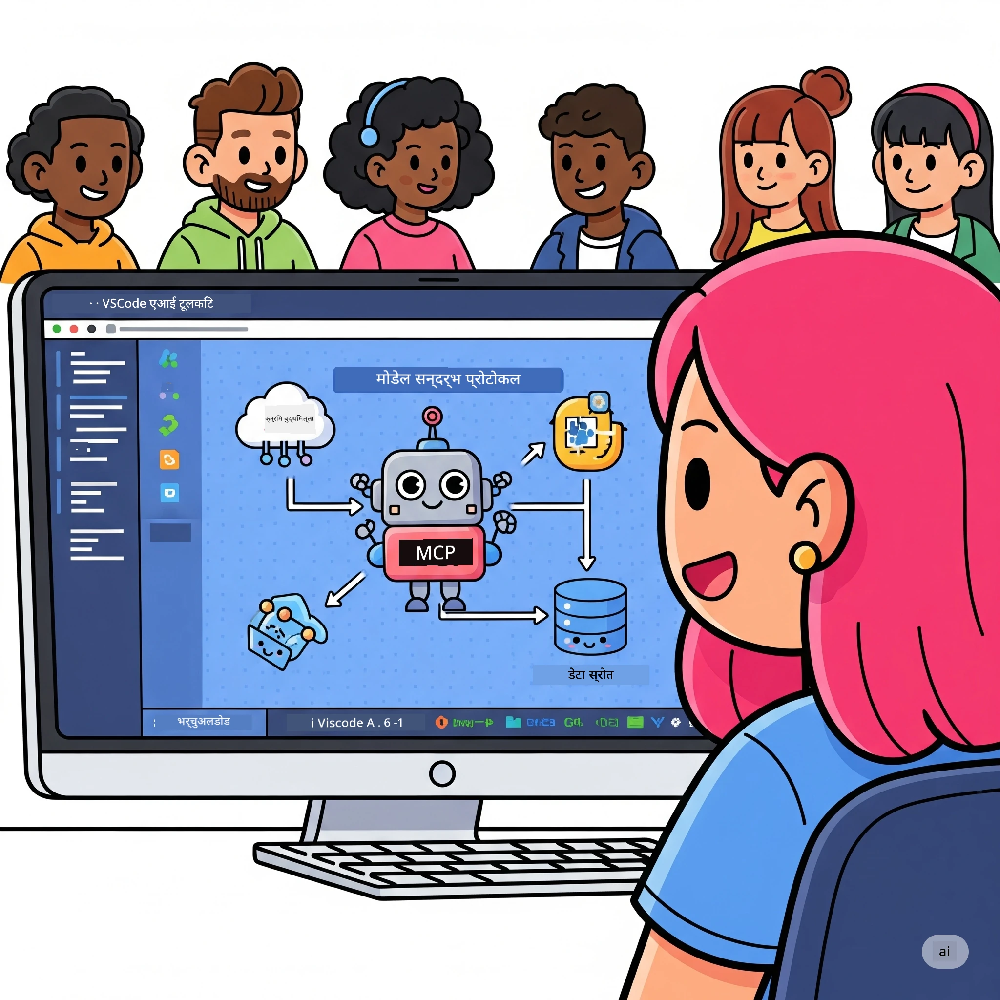
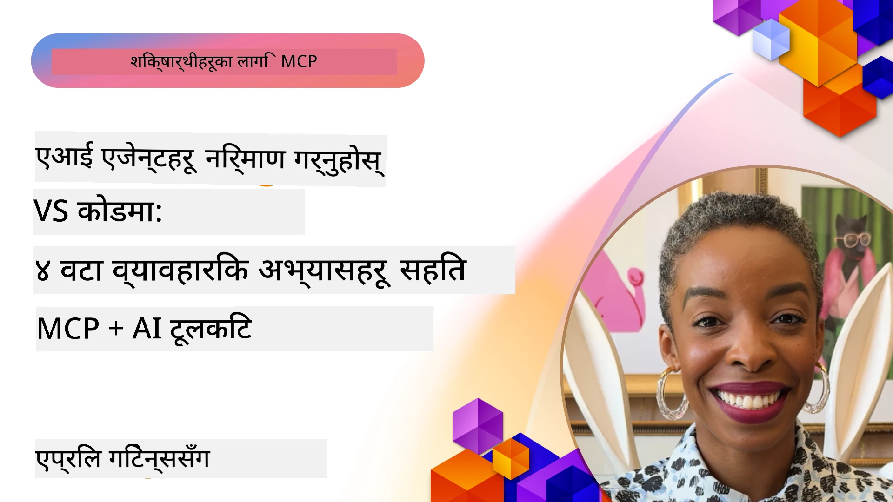

# AI कार्यप्रवाहहरूलाई सरल बनाउँदै: AI Toolkit सँग MCP सर्भर निर्माण

## 🎯  अवलोकन

_(यस पाठको भिडियो हेर्न माथिको छवि क्लिक गर्नुहोस्)_

**Model Context Protocol (MCP) कार्यशाला** मा स्वागत छ! यो विस्तृत व्यावहारिक कार्यशालाले दुई आधुनिक प्रविधिहरूलाई जोडेर AI अनुप्रयोग विकासलाई क्रान्तिकारी बनाउँछ:

- **🔗 Model Context Protocol (MCP)**: सहज AI-उपकरण एकीकरणको लागि खुला मापदण्ड
- **🛠️ AI Toolkit for Visual Studio Code (AITK)**: Microsoft को शक्तिशाली AI विकास विस्तार

### 🎓 तपाईंले के सिक्नुहुनेछ

यस कार्यशालाको अन्त्यसम्म, तपाईंले AI मोडेलहरूलाई वास्तविक विश्वका उपकरण र सेवाहरूसँग जोड्ने बुद्धिमान अनुप्रयोगहरू निर्माण गर्ने कला हात पार्नुहुनेछ। स्वचालित परीक्षणदेखि अनुकूलित API एकीकरणसम्म, तपाईंले जटिल व्यावसायिक चुनौतीहरू समाधान गर्ने व्यावहारिक सीपहरू हासिल गर्नुहुनेछ।

## 🏗️ प्रविधि स्ट्याक

### 🔌 Model Context Protocol (MCP)

MCP भनेको **"AI का लागि USB-C"** हो - एक सार्वभौमिक मापदण्ड जुन AI मोडेलहरूलाई बाह्य उपकरणहरू र डाटा स्रोतहरूसँग जोड्छ।

**✨ प्रमुख सुविधाहरू:**

- 🔄 **मानकीकृत एकीकरण**: AI-उपकरण जडानको लागि सार्वभौमिक अन्तरफलक
- 🏛️ **लचिलो वास्तुकला**: stdio/SSE ट्रान्सपोर्ट मार्फत स्थानीय र रिमोट सर्भरहरू
- 🧰 **समृद्ध इकोसिस्टम**: उपकरणहरू, प्रॉम्प्टहरू, र स्रोतहरू एउटै प्रोटोकलमा
- 🔒 **उद्यम-तयार**: निर्मित सुरक्षा र विश्वसनीयता

**🎯 किन MCP महत्त्वपूर्ण छ:**
USB-C ले जस्तै केबल झरझर हटायो, MCP ले AI एकीकरणहरूको जटिलता हटाउँछ। एक प्रोटोकल, अनन्त सम्भावनाहरू।

### 🤖 AI Toolkit for Visual Studio Code (AITK)

Microsoft को प्रमुख AI विकास विस्तार जसले VS Code लाई AI को शक्तिशाली केन्द्र बनाउँछ।

**🚀 मुख्य क्षमताहरू:**

- 📦 **मोडेल सूची**: Azure AI, GitHub, Hugging Face, Ollama बाट मोडेलहरू पहुँच
- ⚡ **स्थानीय पूर्वानुमान**: ONNX-अनुकूलित CPU/GPU/NPU कार्यान्वयन
- 🏗️ **एजेन्ट बिल्डर**: MCP एकीकरणसहित भिजुअल AI एजेन्ट विकास
- 🎭 **बहु-प्रकारीय**: पाठ, दृष्टि, र संरचित आउटपुट समर्थन

**💡 विकास लाभहरू:**

- जिरो-कन्फिग मोडेल नियोजन
- भिजुअल प्रॉम्प्ट इन्जिनियरिङ
- वास्तविक-समय परीक्षण खेलथलो
- सहज MCP सर्भर एकीकरण

## 📚 सिकाइ यात्रा

### [🚀 मोड्युल 1: AI Toolkit आधारहरू](./lab1/README.md)

**अवधि**: १५ मिनेट

- 🛠️ VS Code का लागि AI Toolkit इन्स्टल र कन्फिगर गर्नुहोस्
- 🗂️ मोडेल सूची अन्वेषण गर्नुहोस् (GitHub, ONNX, OpenAI, Anthropic, Google बाट १००+ मोडेल)
- 🎮 वास्तविक-समय मोडेल परीक्षणको लागि अन्तरक्रियात्मक मैदानमा दक्षता प्राप्त गर्नुहोस्
- 🤖 एजेन्ट बिल्डर मार्फत पहिला AI एजेन्ट बनाउनुहोस्
- 📊 निर्मित मेट्रिक्सहरू (F1, सान्दर्भिकता, समानता, एकरूपता) संग मोडेल प्रदर्शन मूल्याङ्कन गर्नुहोस्
- ⚡ ब्याच प्रोसिसिङ र बहु-प्रकारीय समर्थन क्षमताहरू सिक्नुहोस्

**🎯 सिकाइ नतिजा**: AITK क्षमताहरूको पूर्ण बुझाइसहित कार्यशील AI एजेन्ट सिर्जना गर्नुहोस्

### [🌐 मोड्युल 2: MCP र AI Toolkit आधारहरू](./lab2/README.md)

**अवधि**: २० मिनेट

- 🧠 Model Context Protocol (MCP) वास्तुकला र अवधारणाहरूमा विशेषज्ञता हासिल गर्नुहोस्
- 🌐 Microsoft को MCP सर्भर इकोसिस्टम अन्वेषण गर्नुहोस्
- 🤖 Playwright MCP सर्भर प्रयोग गरेर ब्राउजर स्वचालन एजेन्ट बनाउनुहोस्
- 🔧 MCP सर्भरहरू AI Toolkit एजेन्ट बिल्डरसँग एकीकरण गर्नुहोस्
- 📊 आफ्नो एजेन्टहरू भित्र MCP उपकरणहरू कन्फिगर र परीक्षण गर्नुहोस्
- 🚀 उत्पादनको लागि MCP-संचालित एजेन्टहरू निर्यात र तैनाथ गर्नुहोस्

**🎯 सिकाइ नतिजा**: MCP मार्फत बाह्य उपकरणहरू सहयोगी AI एजेन्ट तैनाथ गर्नुहोस्

### [🔧 मोड्युल 3: AI Toolkit सँग उन्नत MCP विकास](./lab3/README.md)

**अवधि**: २० मिनेट

- 💻 AI Toolkit प्रयोग गरेर अनुकूलित MCP सर्भरहरू सिर्जना गर्नुहोस्
- 🐍 नयाँ MCP Python SDK (v1.9.3) कन्फिगर र प्रयोग गर्नुहोस्
- 🔍 डिबगिङका लागि MCP Inspector सेट अप र प्रयोग गर्नुहोस्
- 🛠️ व्यावसायिक डिबगिङ कार्यप्रवाहसहित मौसम MCP सर्भर निर्माण गर्नुहोस्
- 🧪 एजेन्ट बिल्डर र Inspector वातावरणहरूमा MCP सर्भरहरू डिबग गर्नुहोस्

**🎯 सिकाइ नतिजा**: आधुनिक उपकरणहरू प्रयोग गरेर अनुकूलित MCP सर्भरहरू विकास र डिबग गर्नुहोस्

### [🐙 मोड्युल 4: व्यावहारिक MCP विकास - अनुकूलित GitHub Clone सर्भर](./lab4/README.md)

**अवधि**: ३० मिनेट

- 🏗️ विकास कार्यप्रवाहहरूको लागि वास्तविक GitHub Clone MCP सर्भर निर्माण गर्नुहोस्
- 🔄 प्रमाणीकरण र त्रुटि ह्यान्डलिङसहित स्मार्ट रिपोजिटरी क्लोनिङ कार्यान्वयन गर्नुहोस्
- 📁 बुद्धिमान निर्देशिका व्यवस्थापन र VS Code एकीकरण सिर्जना गर्नुहोस्
- 🤖 अनुकूलित MCP उपकरणहरू प्रयोग गरेर GitHub Copilot एजेन्ट मोड प्रयोग गर्नुहोस्
- 🛡️ उत्पादन-तयार विश्वसनीयता र क्रस-प्लेटफर्म उपयुक्तता लागू गर्नुहोस्

**🎯 सिकाइ नतिजा**: वास्तविक विकास कार्यप्रवाहहरूलाई सरल तुल्याउने उत्पादन-तयार MCP सर्भर तैनाथ गर्नुहोस्

## 💡 वास्तविक संसारका अनुप्रयोगहरू र प्रभाव

### 🏢 उद्यम प्रयोग केसहरू

#### 🔄 DevOps स्वचालन

तपाईंको विकास कार्यप्रवाहलाई बुद्धिमान स्वचालनले रूपान्तरण गर्नुहोस्:

- **स्मार्ट रिपोजिटरी व्यवस्थापन**: AI-चालित कोड समीक्षा र मर्ज निर्णयहरू
- **बुद्धिमान CI/CD**: कोड परिवर्तनहरूमा आधारित स्वचालित पाइपलाइन अनुकूलन
- **समस्या वर्गीकरण**: स्वतः बग वर्गीकरण र जिम्मेवारी तोक्ने

#### 🧪 गुणस्तर आश्वासन क्रान्ति

AI-शक्ति प्राप्त स्वचालनसँग परीक्षण उचाइमा पु-याउनुहोस्:

- **बुद्धिमान परीक्षण सृजना**: स्वचालित रूपमा व्यापक परीक्षण सूटहरू बनाउनुहोस्
- **दृश्य रिग्रेसन परीक्षण**: AI-शक्ति प्राप्त UI परिवर्तन पत्ता लगाउने
- **प्रदर्शन अनुगमन**: सक्रिय समस्या पहिचान र समाधान

#### 📊 डाटा पाइपलाइन बुद्धिमत्ता

बुद्धिमान डाटा प्रशोधन कार्यप्रवाहहरू निर्माण गर्नुहोस्:

- **अनुकूलित ETL प्रक्रिया**: स्व-उन्नत डाटा रूपान्तरणहरू
- **विकृति पहिचान**: वास्तविक-समय डाटा गुणस्तर अनुगमन
- **बुद्धिमान मार्गनिर्देशन**: स्मार्ट डाटा प्रवाह व्यवस्थापन

#### 🎧 ग्राहक अनुभव सुधार

उल्लेखनीय ग्राहक अन्तरक्रियाहरू सिर्जना गर्नुहोस्:

- **सन्दर्भ-सम्बन्धित समर्थन**: ग्राहक इतिहासमा पहुँच भएको AI एजेन्टहरू
- **सक्रिय समस्या समाधान**: पूर्वानुमान ग्राहक सेवा
- **बहु-च्यानल एकीकरण**: प्लेटफर्महरूमा एकीकृत AI अनुभव

## 🛠️ पूर्वापेक्षा र सेटअप

### 💻 प्रणाली आवश्यकताहरू

| घटक | आवश्यकता | नोटहरू |
|-----------|-------------|-------|
| **अपरेटिङ सिस्टम** | Windows 10+, macOS 10.15+, Linux | कुनै पनि आधुनिक OS |
| **Visual Studio Code** | पछिल्लो स्थिर संस्करण | AITK का लागि आवश्यक |
| **Node.js** | v18.0+ र npm | MCP सर्भर विकासका लागि |
| **Python** | 3.10+ | Python MCP सर्भरहरूका लागि वैकल्पिक |
| **मेमोरी** | कम्तिमा 8GB RAM | स्थानीय मोडेलहरूका लागि 16GB सिफारिस गरिएको |

### 🔧 विकास वातावरण

#### सिफारिस गरिएको VS Code विस्तारहरू

- **AI Toolkit** (ms-windows-ai-studio.windows-ai-studio)
- **Python** (ms-python.python)
- **Python Debugger** (ms-python.debugpy)
- **GitHub Copilot** (GitHub.copilot) - वैकल्पिक तर उपयोगी

#### वैकल्पिक उपकरणहरू

- **uv**: आधुनिक Python प्याकेज म्यानेजर
- **MCP Inspector**: MCP सर्भरहरूको लागि दृश्यात्मक डिबगिङ उपकरण
- **Playwright**: वेब स्वचालन उदाहरणका लागि

## 🎖️ सिकाइ नतिजा र प्रमाणपत्र मार्ग

### 🏆 कौशल महारथ जाँचसूची

यस कार्यशाला पूरा गरेर, तपाईंले निम्नमा महारथ हासिल गर्नुहुनेछ:

#### 🎯 मुख्य दक्षताहरू

- [ ] **MCP प्रोटोकल महारथ**: वास्तुकला र कार्यान्वयन ढाँचाहरूको गहिरो बुझाइ
- [ ] **AITK दक्षता**: छिटो विकासका लागि AI Toolkit को विशेषज्ञ स्तर प्रयोग
- [ ] **अनुकूलित सर्भर विकास**: उत्पादन MCP सर्भरहरू निर्माण, तैनाथ र मर्मत गर्नुहोस्
- [ ] **उपकरण एकीकरण उत्कृष्टता**: विद्यमान विकास कार्यप्रवाहसँग AI सहज जडान गर्नुहोस्
- [ ] **समस्या समाधान आवेदन**: सिकेका सीपहरू वास्तविक व्यवसायिक चुनौतीहरूमा लागू गर्नुहोस्

#### 🔧 प्राविधिक सीपहरू

- [ ] VS Code मा AI Toolkit सेट अप र कन्फिगर गर्नुहोस्
- [ ] अनुकूलित MCP सर्भरहरू डिजाइन र कार्यान्वयन गर्नुहोस्
- [ ] GitHub मोडेलहरूलाई MCP वास्तुकलामा एकीकृत गर्नुहोस्
- [ ] Playwright सँग स्वचालित परीक्षण कार्यप्रवाहहरू निर्माण गर्नुहोस्
- [ ] उत्पादन प्रयोगको लागि AI एजेन्टहरू तैनाथ गर्नुहोस्
- [ ] MCP सर्भर प्रदर्शन डिबग र अनुकूलन गर्नुहोस्

#### 🚀 उन्नत क्षमताहरू

- [ ] उद्यम-स्तर AI एकीकरणहरू वास्तुकला डिजाइन गर्नुहोस्
- [ ] AI अनुप्रयोगहरूको लागि सुरक्षा सर्वोत्तम अभ्यासहरू लागू गर्नुहोस्
- [ ] स्केलेबल MCP सर्भर वास्तुकला डिजाइन गर्नुहोस्
- [ ] विशिष्ट डोमेनहरूको लागि अनुकूलित उपकरण श्रृंखलाहरू सिर्जना गर्नुहोस्
- [ ] अन्यहरूलाई AI-आधारित विकासमा मार्गदर्शन गर्नुहोस्

## 📖 अतिरिक्त स्रोतहरू

- [MCP Specification (2025-11-25)](https://spec.modelcontextprotocol.io/specification/2025-11-25/)
- [AI Toolkit GitHub Repository](https://github.com/microsoft/vscode-ai-toolkit)
- [Sample MCP Servers Collection](https://github.com/modelcontextprotocol/servers)
- [Best Practices Guide](https://modelcontextprotocol.io/docs/best-practices)
- [OWASP MCP Top 10](https://microsoft.github.io/mcp-azure-security-guide/mcp/) - सुरक्षा सर्वोत्तम अभ्यासहरू

---

**🚀 तपाईंको AI विकास कार्यप्रवाह क्रान्तिकारी बनाउन तयार हुनुहुन्छ?**

MCP र AI Toolkit सँग बुद्धिमान अनुप्रयोगहरूको भविष्य एकसाथ निर्माण गरौं!

## के छपछि

जारी राख्नुहोस्: [मोड्युल ११: MCP सर्भर अभ्यास गरिने मोड्युलहरू](../11-MCPServerHandsOnLabs/README.md)

---

<!-- CO-OP TRANSLATOR DISCLAIMER START -->
**अस्वीकरण**:
यो दस्तावेज AI अनुवाद सेवा [Co-op Translator](https://github.com/Azure/co-op-translator) प्रयोग गरी अनुवाद गरिएको हो। हामी शुद्धताका लागि प्रयासरत छौँ भने पनि, कृपया बुझ्नुस् कि स्वचालित अनुवादहरूमा त्रुटि वा अशुद्धता हुनसक्छ। मूल दस्तावेज यसको मातृ भाषामा नै अधिकारिक स्रोत मानिनुपर्छ। महत्वपूर्ण जानकारीका लागि पेशेवर मानव अनुवाद सिफारिस गरिन्छ। यस अनुवादको प्रयोगबाट उत्पन्न कुनै पनि गलतफहमी वा गलत व्याख्याका लागि हामी जिम्मेवार हौंन।
<!-- CO-OP TRANSLATOR DISCLAIMER END -->