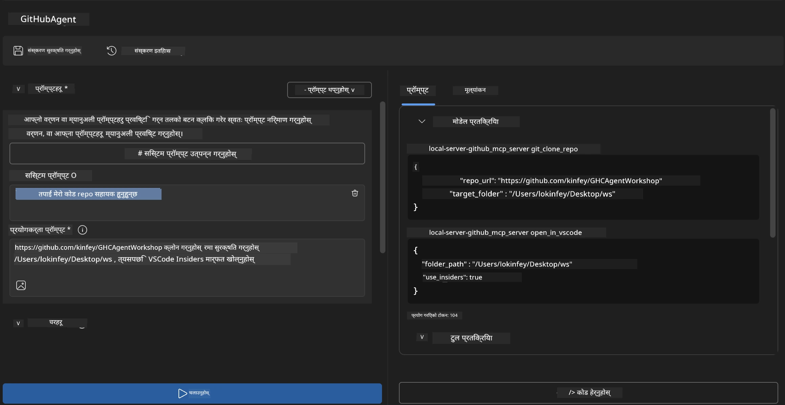
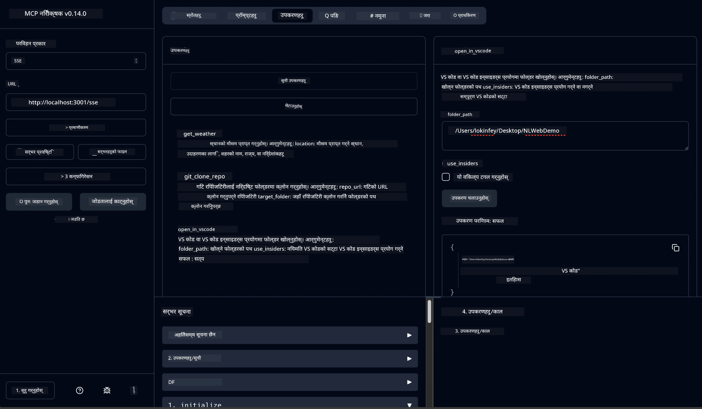

# 🐙 मोड्युल ४: व्यावहारिक MCP विकास - कस्टम GitHub क्लोन सर्भर


> **⚡ छिटो आरम्भ:** केवल ३० मिनेटमा GitHub रिपोजिटरी क्लोनिङ र VS Code इंटिग्रेशनलाई स्वत: गर्ने उत्पादन-तयार MCP सर्भर तयार पार्नुहोस्!

## 🎯 सिक्ने उद्देश्यहरू

यस ल्याबको अन्त्यसम्ममा, तपाईं सक्षम हुनुहुनेछ:

- ✅ वास्तविक विकास कार्यप्रवाहहरूका लागि कस्टम MCP सर्भर बनाउने
- ✅ MCP मार्फत GitHub रिपोजिटरी क्लोनिङ कार्यक्षमता कार्यान्वयन गर्ने
- ✅ VS Code र Agent Builder सँग कस्टम MCP सर्भरहरू एकीकृत गर्ने
- ✅ कस्टम MCP उपकरणहरूसँग GitHub Copilot Agent Mode प्रयोग गर्ने
- ✅ उत्पादन वातावरणमा कस्टम MCP सर्भरहरू परीक्षण र परिनियोजन गर्ने

## 📋 पूर्व आवश्यकताहरू

- ल्याब १-३ को सम्पन्नता (MCP मूल सिद्धान्त र उन्नत विकास)
- GitHub Copilot सदस्यता ([निःशुल्क दर्ता उपलब्ध](https://github.com/github-copilot/signup))
- AI Toolkit र GitHub Copilot एक्सटेन्सनहरूसहित VS Code
- Git CLI स्थापना र कन्फिगर गरिएको

## 🏗️ परियोजना अवलोकन

### **वास्तविक विश्व विकास चुनौती**
डेभलपर्सको रूपमा हामी प्रायः GitHub बाट रिपोजिटरी क्लोन गरेर VS Code वा VS Code Insiders मा खोल्ने काम गर्छौं। यो म्यानुअल प्रक्रियाले समावेश गर्दछ:
1. टर्मिनल/कमाण्ड प्रॉम्प्ट खोल्नु
2. इच्छित डिरेक्टरीमा जानु
3. `git clone` कमाण्ड चलाउनु
4. क्लोन गरेको डिरेक्टरीमा VS Code खोल्नु

**हाम्रो MCP समाधान यसलाई एक बुद्धिमान कमाण्डमा रूपान्तरण गर्छ!**

### **तपाईंले बनाउने कुरा**
एक **GitHub Clone MCP Server** (`git_mcp_server`) जसले प्रदान गर्छ:

| सुविधा | विवरण | लाभ |
|---------|-------------|---------|
| 🔄 **स्मार्ट रिपोजिटरी क्लोनिङ** | मान्यकरण सहित GitHub रिपोजिटरी क्लोन गर्नु | स्वचालित त्रुटि जाँच |
| 📁 **बुद्धिमान डिरेक्टरी व्यवस्थापन** | सुरक्षित तरिकाले डिरेक्टरीहरू जाँच र सिर्जना गर्नु | ओभरराइट रोकथाम |
| 🚀 **क्रस-प्लेटफर्म VS Code इंटीग्रेशन** | प्रोजेक्टहरू VS Code/Insiders मा खोल्नु | निर्बाध कार्यप्रवाह रूपान्तरण |
| 🛡️ **दृढ त्रुटि ह्यान्डलिङ** | नेटवर्क, अनुमति, र पथ समस्याहरू ह्यान्डल गर्नु | उत्पादन-तयार विश्वसनीयता |

---

## 📖 चरण-दर-चरण कार्यान्वयन

### चरण १: Agent Builder मा GitHub Agent सिर्जना गर्नुहोस्

1. AI Toolkit एक्सटेन्सनमार्फत **Agent Builder खोल्नुहोस्**
2. निम्न कन्फिगरेसनसहित **नयाँ एजेन्ट बनाउनुहोस्:**
   ```
   Agent Name: GitHubAgent
   ```

3. **कस्टम MCP सर्भर सुरु गर्नुहोस्:**
   - **Tools** → **Add Tool** → **MCP Server** जानुहोस्
   - **"Create A new MCP Server"** चयन गर्नुहोस्
   - अधिकतम लचकताको लागि **Python टेम्पलेट** छान्नुहोस्
   - **सर्भर नाम:** `git_mcp_server`

### चरण २: GitHub Copilot Agent Mode कन्फिगर गर्नुहोस्

1. VS Code मा **GitHub Copilot खोल्नुहोस्** (Ctrl/Cmd + Shift + P → "GitHub Copilot: Open")
2. Copilot इन्टरफेसमा **Agent Model चयन गर्नुहोस्**
3. प्रविधि सुधारका लागि **Claude 3.7 मोडेल छान्नुहोस्**
4. उपकरण पहुँचका लागि **MCP इंटीग्रेशन सक्षम पार्नुहोस्**

> **💡 प्रो सुझाव:** Claude 3.7 ले विकास कार्यप्रवाह र त्रुटि ह्यान्डलिङ ढाँचाको उत्कृष्ट समझ प्रदान गर्छ।

### चरण ३: मुख्य MCP सर्भर कार्यक्षमता कार्यान्वयन गर्नुहोस्

**GitHub Copilot Agent Mode सँग निम्न विस्तृत प्रॉम्प्ट प्रयोग गर्नुहोस्:**

```
Create two MCP tools with the following comprehensive requirements:

🔧 TOOL A: clone_repository
Requirements:
- Clone any GitHub repository to a specified local folder
- Return the absolute path of the successfully cloned project
- Implement comprehensive validation:
  ✓ Check if target directory already exists (return error if exists)
  ✓ Validate GitHub URL format (https://github.com/user/repo)
  ✓ Verify git command availability (prompt installation if missing)
  ✓ Handle network connectivity issues
  ✓ Provide clear error messages for all failure scenarios

🚀 TOOL B: open_in_vscode
Requirements:
- Open specified folder in VS Code or VS Code Insiders
- Cross-platform compatibility (Windows/Linux/macOS)
- Use direct application launch (not terminal commands)
- Auto-detect available VS Code installations
- Handle cases where VS Code is not installed
- Provide user-friendly error messages

Additional Requirements:
- Follow MCP 1.9.3 best practices
- Include proper type hints and documentation
- Implement logging for debugging purposes
- Add input validation for all parameters
- Include comprehensive error handling
```

### चरण ४: आफ्नो MCP सर्भर परीक्षण गर्नुहोस्

#### 4a. Agent Builder मा परीक्षण

1. Agent Builder को डिबग कन्फिगरेसन सुरु गर्नुहोस्
2. आफ्नो एजेन्टलाई यस प्रणाली प्रॉम्प्टसङ्ग कन्फिगर गर्नुहोस्:

```
SYSTEM_PROMPT:
You are my intelligent coding repository assistant. You help developers efficiently clone GitHub repositories and set up their development environment. Always provide clear feedback about operations and handle errors gracefully.
```

3. वास्तविक प्रयोगकर्ता परिदृश्यहरू परीक्षण गर्नुहोस्:

```
USER_PROMPT EXAMPLES:

Scenario : Basic Clone and Open
"Clone {Your GitHub Repo link such as https://github.com/kinfey/GHCAgentWorkshop
 } and save to {The global path you specify}, then open it with VS Code Insiders"
```



**अपेक्षित परिणामहरू:**
- ✅ पथ पुष्टि सहित सफल क्लोनिङ
- ✅ स्वतः VS Code सुरु
- ✅ अमान्य परिदृश्यहरूको लागि स्पष्ट त्रुटि सन्देशहरू
- ✅ सीमा अवस्थाहरूको सही ह्यान्डलिङ

#### 4b. MCP Inspector मा परीक्षण




---


**🎉 बधाई छ!** तपाईंले सफलतापूर्वक एक व्यावहारिक, उत्पादन-तयार MCP सर्भर सिर्जना गर्नुभयो जुन वास्तविक विकास कार्यप्रवाह चुनौतीहरू समाधान गर्छ। तपाईंको कस्टम GitHub क्लोन सर्भरले MCP को शक्ति प्रकट गर्छ जसले डेभलपर उत्पादकतामा स्वचालन र सुधार ल्याउँछ।

### 🏆 उपलब्धि अनलक गरियो:
- ✅ **MCP डेभलपर** - कस्टम MCP सर्भर सिर्जना गरियो
- ✅ **कार्यप्रवाह स्वचालक** - विकास प्रक्रियाहरूलाई सरल बनायो  
- ✅ **एकीकरण विशेषज्ञ** - धेरै विकास उपकरणहरूको जडान गर्यो
- ✅ **उत्पादन तयार** - परिनियोजनयोग्य समाधानहरू बनायो

---

## 🎓 कार्यशाला समाप्ति: तपाईंको Model Context Protocol सँग यात्रा

**प्रिय कार्यशाला सहभागी,**

Model Context Protocol कार्यशालाका सबै चार मोड्युलहरू सम्पन्न गर्नुभएकोमा बधाई छ! तपाईंले AI Toolkit का आधारभूत अवधारणाहरू बुझ्नबाट लिएर उत्पादन-तयार MCP सर्भरहरू निर्माण गर्नसम्मको लामो यात्रा तय गर्नुभएको छ जसले वास्तविक विकास चुनौतीहरू समाधान गर्छ।

### 🚀 तपाईंको सिकाइ मार्ग सारांश:

**[मोड्युल १](../lab1/README.md)**: तपाईंले AI Toolkit का मूल सिद्धान्तहरू, मोडेल परीक्षण, र पहिलो AI एजेन्ट सिर्जना गरेको सुरूवात गर्नुभयो।

**[मोड्युल २](../lab2/README.md)**: MCP वास्तुकला थाहा पाउनुभयो, Playwright MCP एकीकृत गर्नुभयो, र पहिलो ब्राउजर ऑटोमेशन एजेन्ट बनायो।

**[मोड्युल ३](../lab3/README.md)**: मौसम MCP सर्भरसहित कस्टम MCP सर्भर विकासमा अघि बढ्नुभयो र डिबगिङ उपकरणहरूमा दक्षता हासिल गर्नुभयो।

**[मोड्युल ४](../lab4/README.md)**: अब तपाईंले व्यावहारिक GitHub रिपोजिटरी कार्यप्रवाह स्वचालन उपकरण सिर्जना गर्न सबै कुरा लागू गर्नुभयो।

### 🌟 के तपाईंले पारंगत गर्नुभयो:

- ✅ **AI Toolkit पारिस्थितिकी तन्त्र**: मोडेलहरू, एजेन्टहरू, र एकीकरण ढाँचा
- ✅ **MCP वास्तुकला**: क्लाइन्ट-सर्भर डिजाइन, यातायात प्रोटोकल, र सुरक्षा
- ✅ **डेभलपर उपकरण**: प्लेग्राउन्डदेखि इन्स्पेक्टरसम्म उत्पादन परिनियोजनसम्म
- ✅ **कस्टम विकास**: आफ्नै MCP सर्भर बनाउने, परीक्षण गर्ने, र परिनियोजन गर्ने
- ✅ **व्यावहारिक अनुप्रयोगहरू**: AI सँग वास्तविक कार्यप्रवाह चुनौतीहरू समाधान गर्ने

### 🔮 तपाईंको आगामी कदमहरू:

1. **आफ्नो MCP सर्भर बनाउनुहोस्**: यी सीपहरू प्रयोग गरेर तपाईंको विशिष्ट कार्यप्रवाहहरू स्वचालित बनाउन
2. **MCP समुदायमा सहभागी हुनुहोस्**: आफ्ना सिर्जनाहरू साझा गर्नुहोस् र धेरैसँग सिक्नुहोस्
3. **उन्नत एकीकरण अन्वेषण गर्नुहोस्**: MCP सर्भरहरूलाई एण्टरप्राइज सिस्टमहरूसँग जडान गर्नुहोस्
4. **ओपन सोर्समा योगदान गर्नुहोस्**: MCP उपकरण र प्रलेखन सुधार गर्न मद्दत गर्नुहोस्

याद राख्नुहोस्, यो कार्यशाला केवल सुरुवात हो। Model Context Protocol पारिस्थितिकी प्रणाली तीव्र रूपमा विकास हुँदैछ, र तपाईं अहिले AI-शक्ति सम्पन्न विकास उपकरणहरूमा अग्रणी हुन सक्षम हुनुहुन्छ।

**तपाईंको सहभागीता र सिकाइमा समर्पणका लागि धन्यवाद!**

हामी आशा गर्छौं यस कार्यशालाले तपाईंलाई यस्तो सोच दिन्छ जुन तपाईंको विकास यात्रामा AI उपकरणहरूसँग कसरी सिर्जनात्मक रूपमा काम गर्ने परिवर्तन ल्याउनेछ।

**शुभ कोडिङ!**

---

## अगाडि के छ

मोड्युल १० का सबै ल्याबहरू पूरा गरेकोमा बधाई!

- फर्कनुहोस्: [मोड्युल १० अवलोकन](../README.md)
- जारी राख्नुहोस्: [मोड्युल ११: MCP सर्भर व्यावहारिक ल्याबहरू](../../11-MCPServerHandsOnLabs/README.md)

---

<!-- CO-OP TRANSLATOR DISCLAIMER START -->
**अस्वीकरण**:
यो दस्तावेज AI अनुवाद सेवा [Co-op Translator](https://github.com/Azure/co-op-translator) मार्फत अनुवाद गरिएको हो। हामी शुद्धताका लागि प्रयासरत छौं, तर कृपया बुझ्नुहोस् कि स्वचालित अनुवादमा त्रुटि वा अशुद्धता हुन सक्छ। मूल दस्तावेज यसको मूल भाषामा नै अधिकारिक स्रोत मानिनुपर्छ। महत्वपूर्ण जानकारीका लागि व्यावसायिक मान्छेको अनुवाद सिफारिस गरिन्छ। यस अनुवादको प्रयोगबाट उत्पन्न कुनै पनि गलतफहमी वा गलत व्याख्याका लागि हामी जिम्मेवार छैनौं।
<!-- CO-OP TRANSLATOR DISCLAIMER END -->