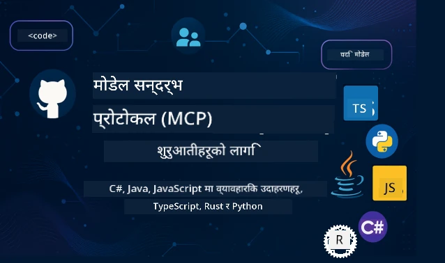

 

[](https://GitHub.com/microsoft/mcp-for-beginners/graphs/contributors)
[](https://GitHub.com/microsoft/mcp-for-beginners/issues)
[](https://GitHub.com/microsoft/mcp-for-beginners/pulls)
[](http://makeapullrequest.com)

[](https://GitHub.com/microsoft/mcp-for-beginners/watchers)
[](https://GitHub.com/microsoft/mcp-for-beginners/fork)
[](https://GitHub.com/microsoft/mcp-for-beginners/stargazers)


[](https://discord.gg/nTYy5BXMWG)

यी स्रोतहरू प्रयोग गरिरहनु अघि यी चरणहरू अनुसरण गर्नुहोस्:
1. **रेपोजिटरी फोर्क गर्नुहोस्**: क्लिक गर्नुहोस् [](https://GitHub.com/microsoft/mcp-for-beginners/fork)
2. **रेपोजिटरी क्लोन गर्नुहोस्**:   `git clone https://github.com/microsoft/mcp-for-beginners.git`
3. **जोडिनुहोस्** [](https://discord.gg/nTYy5BXMWG)


### 🌐 बहुभाषिक समर्थन

#### GitHub Action मार्फत समर्थित (स्वचालित र सधैं अपडेट रहने)

<!-- CO-OP TRANSLATOR LANGUAGES TABLE START -->
[Arabic](../ar/README.md) | [Bengali](../bn/README.md) | [Bulgarian](../bg/README.md) | [Burmese (Myanmar)](../my/README.md) | [Chinese (Simplified)](../zh-CN/README.md) | [Chinese (Traditional, Hong Kong)](../zh-HK/README.md) | [Chinese (Traditional, Macau)](../zh-MO/README.md) | [Chinese (Traditional, Taiwan)](../zh-TW/README.md) | [Croatian](../hr/README.md) | [Czech](../cs/README.md) | [Danish](../da/README.md) | [Dutch](../nl/README.md) | [Estonian](../et/README.md) | [Finnish](../fi/README.md) | [French](../fr/README.md) | [German](../de/README.md) | [Greek](../el/README.md) | [Hebrew](../he/README.md) | [Hindi](../hi/README.md) | [Hungarian](../hu/README.md) | [Indonesian](../id/README.md) | [Italian](../it/README.md) | [Japanese](../ja/README.md) | [Kannada](../kn/README.md) | [Korean](../ko/README.md) | [Lithuanian](../lt/README.md) | [Malay](../ms/README.md) | [Malayalam](../ml/README.md) | [Marathi](../mr/README.md) | [Nepali](./README.md) | [Nigerian Pidgin](../pcm/README.md) | [Norwegian](../no/README.md) | [Persian (Farsi)](../fa/README.md) | [Polish](../pl/README.md) | [Portuguese (Brazil)](../pt-BR/README.md) | [Portuguese (Portugal)](../pt-PT/README.md) | [Punjabi (Gurmukhi)](../pa/README.md) | [Romanian](../ro/README.md) | [Russian](../ru/README.md) | [Serbian (Cyrillic)](../sr/README.md) | [Slovak](../sk/README.md) | [Slovenian](../sl/README.md) | [Spanish](../es/README.md) | [Swahili](../sw/README.md) | [Swedish](../sv/README.md) | [Tagalog (Filipino)](../tl/README.md) | [Tamil](../ta/README.md) | [Telugu](../te/README.md) | [Thai](../th/README.md) | [Turkish](../tr/README.md) | [Ukrainian](../uk/README.md) | [Urdu](../ur/README.md) | [Vietnamese](../vi/README.md)

> **स्थानीय रूपमा क्लोन गर्न चाहनुहुन्छ?**
>
> यस रेपोजिटरीमा ५०+ भाषाका अनुवादहरू छन् जसले डाउनलोड आकार धेरै बढाउँछ। अनुवादहरूबिना क्लोन गर्न sparse checkout प्रयोग गर्नुहोस्:
>
> **Bash / macOS / Linux:**
> ```bash
> git clone --filter=blob:none --sparse https://github.com/microsoft/mcp-for-beginners.git
> cd mcp-for-beginners
> git sparse-checkout set --no-cone '/*' '!translations' '!translated_images'
> ```
>
> **CMD (Windows):**
> ```cmd
> git clone --filter=blob:none --sparse https://github.com/microsoft/mcp-for-beginners.git
> cd mcp-for-beginners
> git sparse-checkout set --no-cone "/*" "!translations" "!translated_images"
> ```
>
> यसले तपाईंलाई पाठ्यक्रम पूरा गर्न आवश्यक सबै कुरा छिटो डाउनलोड गर्ने अनुमति दिन्छ।
<!-- CO-OP TRANSLATOR LANGUAGES TABLE END -->

# 🚀 मोडेल कन्टेक्स्ट प्रोटोकल (MCP) पाठ्यक्रम शुरुवातीहरूका लागि

## **C#, Java, JavaScript, Rust, Python, र TypeScript मा हातेमालो गरेर MCP सिक्नुहोस्**

## 🧠 मोडेल कन्टेक्स्ट प्रोटोकल पाठ्यक्रमको अवलोकन
मोडेल कन्टेक्स्ट प्रोटोकलमा तपाईंको यात्रा मा स्वागत छ! यदि तपाईं कहिल्यै सोच्नुभएको छ AI अनुप्रयोगहरूले विभिन्न उपकरण र सेवाहरू संग कसरि संवाद गर्छन्, तपाईं अब त्यो सरल समाधान पत्ता लगाउन लाग्नु भएको छ जसले विकासकर्ताहरूलाई बुद्धिमान प्रणालीहरू बनाउन रूपान्तरण गर्दैछ।

MCP लाई AI अनुप्रयोगहरूको लागि एक विश्वव्यापी अनुवादकको रूपमा सोच्नुहोस् - जस्तै USB पोर्टहरूले तपाईंलाई कुनै पनि उपकरण कम्प्युटरसँग जोड्न दिन्छ, MCP ले AI मोडेलहरूलाई कुनै पनि उपकरण वा सेवासँग मानकीकृत रूपमा जडान गर्न अनुमति दिन्छ। तपाईं पहिलो च्याटबोट बनाउँदै हुनुहुन्छ वा जटिल AI कार्यप्रवाहहरूमा काम गर्दै हुनुहुन्छ, MCP बुझ्दा तपाईंलाई अझ सक्षम र लचिलो अनुप्रयोगहरू सिर्जना गर्न शक्तिशाली योग्यता मिल्नेछ।

यो पाठ्यक्रम तपाईंको सिकाइ यात्राको लागि धैर्य र सावधानीका साथ तयार गरिएको हो। हामी सरल अवधारणाबाट सुरु गर्नेछौं जुन तपाईंले पहिले नै बुझ्नुभएको छ र क्रमशः तपाईको मनपर्नेको प्रोग्रामिङ भाषामा प्रत्यक्ष अभ्यासमार्फत तपाईंको दक्षताका स्तरलाई बढाउनेछौं। प्रत्येक कदममा स्पष्ट व्याख्या, व्यावहारिक उदाहरणहरू, र प्रोत्साहन पर्याप्त हुनेछ।

यो यात्रा पूरा गरेपछि, तपाईंलाई आफ्नै MCP सर्भरहरू बनाउन, तिनीहरूलाई लोकप्रिय AI प्लेटफर्महरूसँग एकीकृत गर्न, र यो प्रविधिले कसरी AI विकासको भविष्यलाई आकार दिइरहेको छ बुझ्नको लागि आत्मविश्वास हुनेछ। आउनुहोस्, यो रोमाञ्चक साहसिक कार्यलाई सँगै सुरु गरौं!

### आधिकारिक दस्तावेज र विशिष्टताहरू

यो पाठ्यक्रम **MCP Specification 2025-11-25** (सबैभन्दा नयाँ स्थिर संस्करण) सँग मेल खान्छ। MCP विशिष्टता मिति-आधारित संस्करण प्रयोग गर्दछ (YYYY-MM-DD ढाँचा) जसले प्रोटोकल संस्करण ट्र्याकिंग स्पष्ट बनाउँछ।

यी स्रोतहरू तपाईंको बुझाइ बढ्दै जाँदा अझ मूल्यवान् हुनेछन्, तर सबै कुरा तुरुन्तै पढ्न दबाब नलिनुहोला। सबैभन्दा रुचाएका क्षेत्रहरूबाट सुरु गर्नुहोस्!
- 📘 [MCP Documentation](https://modelcontextprotocol.io/) – यो तपाईको चरण-द्वारा-चरण ट्यूटोरियल र प्रयोगकर्ता मार्गदर्शिकाको लागि मार्गदर्शन स्रोत हो। दस्तावेजीकरण शुरुवातीहरूलाई ध्यानमा राखेर लेखिएको छ, जसले तपाईंलाई स्पष्ट उदाहरणहरूसँग सहजै अगाडि बढ्न दिन्छ।
- 📜 [MCP Specification](https://modelcontextprotocol.io/specification/2025-11-25) – यसलाई तपाईंको व्यापक संदर्भ पुस्तिका को रूपमा सोच्नुहोस्। पाठ्यक्रम भित्र जाँदै गर्दा, तपाईं विशिष्ट विवरणहरू हेर्न र उन्नत सुविधाहरू पत्ता लगाउन यहाँ बारम्बार फर्कदै गर्नुहुनेछ।
- 📜 [MCP Specification Versioning](https://modelcontextprotocol.io/specification/versioning) – यसमा प्रोटोकल संस्करण इतिहास र मिति-आधारित संस्करण प्रयोगबारे जानकारी छ।
- 🧑‍💻 [MCP GitHub Repository](https://github.com/modelcontextprotocol) – यहाँ तपाईंलाई SDK हरू, उपकरणहरू, र विभिन्न प्रोग्रामिङ भाषाहरूमा कोड नमूनाहरू भेटिनेछन्। यो व्यावहारिक उदाहरण र तयार-प्रयोग कम्पोनेन्टहरूको खजाना हो।
- 🌐 [MCP Community](https://github.com/orgs/modelcontextprotocol/discussions) – MCP सम्बन्धी छलफलमा अन्य सिक्दै गरेका र अनुभवी विकासकर्ताहरू सँग जोडिनुहोस्। यो सहयोगी समुदाय हो जहाँ प्रश्न गर्न स्वागत छ र ज्ञान स्वतन्त्र रूपमा साझा हुन्छ।
  
## सिकाइ लक्ष्यहरू

यो पाठ्यक्रम सकिंदा, तपाईं नयाँ क्षमताहरू प्रति आत्मविश्वासी र उत्साहित महसुस गर्नुहुनेछ। यहाँ तपाईंले हासिल गर्ने कुराहरू छन्:

• **MCP को आधारभूत ज्ञान पाउनुहोस्**: तपाईं मोडेल कन्टेक्स्ट प्रोटोकल के हो र किन यो AI अनुप्रयोगहरूको सहकार्यमा क्रान्ति ल्याइरहेको छ बुझ्नुहुनेछ, सरल उदाहरण र तुलना प्रयोग गरेर।

• **आफ्नो पहिलो MCP सर्भर बनाउनुहोस्**: मनपर्ने प्रोग्रामिङ भाषामा चल्छ यस्तो प्रयोगयोग्य MCP सर्भर सिर्जना गर्नुहोस्, सरल उदाहरणबाट सुरु गर्दै क्रमशः आफ्नो सीप वृद्धिका लागि।

• **AI मोडेलहरूलाई वास्तविक उपकरणहरूसँग जडान गर्नुहोस्**: तपाईले AI मोडेल र वास्तविक सेवाहरू बीचको खाडल कसरी पुर्याउने जान्नहुनेछ, जसले तपाईका अनुप्रयोगहरूलाई सशक्त नयाँ क्षमताहरु प्रदान गर्छ।

• **सुरक्षा उत्तम अभ्यास लागू गर्नुहोस्**: आफ्नो MCP कार्यान्वयनहरू सुरक्षित राख्ने तरिका बुझ्नुहोस्, जसले तपाईंका अनुप्रयोग र प्रयोगकर्ताहरुलाई बचाउँछ।

• **आश्वस्त साथ परिनियोजन गर्नुहोस्**: तपाईंले MCP परियोजनाहरू विकासबाट उत्पादनमा लैजान सिक्नु हुनेछ, त्यस्तो व्यवहारिक रणनीतिहरू जसले वास्तविक संसारमा काम गर्छ।

• **MCP समुदायमा सहभागी हुनुहोस्**: तपाईं ती विकासकर्ताहरूको समुदायको हिस्सा बन्नुहुनेछ जो AI अनुप्रयोग विकासको भविष्य आकार गरिरहेका छन्। 

## आवश्यक पृष्ठभूमि

हामी MCP विशेषताहरूमा प्रवेश गर्नु अघि, केहि आधारभूत अवधारणासँग परिचित हुनुहोस्। यी क्षेत्रमा विशेषज्ञ हुनु आवश्यक छैन - हामी अघि बढ्दै जान आवश्यक सबै कुरा व्यাখ्या गर्नेछौं!

### प्रोटोकलहरू बुझ्नुहोस् (आधार)

प्रोटोकललाई वार्तालापका नियमहरू जस्तै सोच्नुहोस्। तपाईंले साथीलाई फोन गर्दा दुबैजनाले जवाफमा “नमस्कार” बोल्ने, पालो पालो कुरा गर्ने, र सकेपछि “अलविदा” भन्नेसम्म सम्झनु आवश्यक हुन्छ। कम्प्युटर प्रोग्रामहरूले प्रभावकारी संवादका लागि यस्तै नियमहरू चाहिन्छ।

MCP एउटा प्रोटोकल हो – सहमत नियमहरूको सेट जसले AI मोडेलहरू र अनुप्रयोगहरूलाई उपकरणहरू र सेवाहरूसँग प्रभावकारी “वार्तालाप” गर्न मद्दत गर्छ। जसरी मानिसबीचको संवादलाई नियमले सहज बनाउँछ, MCP ले पनि AI अनुप्रयोग संवादलाई बढी विश्वसनीय र शक्तिशाली बनाउँछ।

### क्लायन्ट-सर्भर सम्बन्धहरू (प्रोग्रामहरू कसरी संगै काम गर्छन्)

तपाईं दैनिकजसो क्लायन्ट-सर्भर सम्बन्धहरू प्रयोग गर्दै आउनुभएको छ! जब तपाईं वेब ब्राउजर (क्लायन्ट) मार्फत वेबपेज हेर्नुहुन्छ, तपाईं वेब सर्भरमा जडान हुनुहुन्छ जसले पृष्ठ सामग्री पठाउँछ। ब्राउजरलाई आवश्यक कुरा सोध्न थाहा छ र सर्भरले जवाफ दिन थाहा छ।

MCP मा हामीसँग यस्तै सम्बन्ध छ: AI मोडेलहरू क्लायन्टको रूपमा काम गर्छन् जो जानकारी वा कार्यहरूको अनुरोध गर्छन्, र MCP सर्भरहरूले तिनीहरूको लागि ती कार्यहरू उपलब्ध गराउँछन्। यो एउटा सहयोगी सहायक (सर्भर) जस्तै हो जसलाई AI ले विशेष कार्यहरू गर्न आग्रह गर्न सक्छ।

### मानकीकरण किन महत्वपूर्ण छ (चिजहरूलाई सँगै काम गर्न बनाउने)

कल्पना गर्नुहोस् यदि हरेक गाडी निर्माता फरक आकारको ग्याँस पम्प प्रयोग गरुन् - तपाईंलाई प्रत्येक गाडीका लागि फरक एडाप्टर चाहिन्थ्यो! मानकीकरण भनेको सामान्य उपायहरूमा समझदारी जनाउने कुरा हो जसले चिजहरूलाई बिना बाधा सँगै काम गर्न दिन्छ।

MCP ले AI अनुप्रयोगहरूको लागि यस्तै मानकीकरण प्रदान गर्छ। हरेक AI मोडेलले उपकरणसँग काम गर्न फरक कोड लेख्न हुँदैन, MCP ले उनीहरूलाई बोल्न एक सार्वभौमिक तरिका बनाउँछ। यसले विकासकर्ताहरूलाई एक पटक उपकरण बनाएर धेरै AI प्रणालिहरूसँग काम गर्न दिन्छ।

## 🧭 तपाईंको सिकाइ मार्ग अवलोकन

तपाईंको MCP यात्रा व्यवस्थित तरिकाले बनाईएको छ जसले तपाईंको आत्मविश्वास र सीपलाई क्रमिक रूपमा विकास गर्छ। प्रत्येक चरणले नयाँ अवधारणाहरू प्रस्तुत गर्दै पहिले सिकेका कुराहरूलाई बलियो बनाउँछ।

### 🌱 आधार चरण: आधारभूत कुरा बुझ्न (मोड्युल ०-२)

यहाँ तपाईंको यात्रा सुरु हुन्छ! हामी परिचित तुलना र सरल उदाहरणहरू प्रयोग गरेर MCP का अवधारणाहरू प्रस्तुत गर्नेछौं। तपाईं बुझ्नुहुनेछ MCP के हो, किन छ, र कसरी AI विकासको ठूलो संसारमा फिट हुन्छ।

• **मोड्युल 0 - MCP परिचय**: हामी सुरुमा MCP के हो र किन आधुनिक AI अनुप्रयोगहरूको लागि यसले महत्त्व राख्छ पत्ता लगाउनेछौं। तपाईं वास्तविक संसारका MCP कार्यान्वयनहरू देख्नुहुनेछ र विकासकर्ताहरूले सामना गर्ने सामान्य समस्याहरू कसरी समाधान गर्छ बुझ्नुहुनेछ।

• **मोड्युल 1 - मुख्य अवधारणाहरू व्याख्या**: यहाँ तपाईंले MCP का आधारभूत भागहरू सिक्नुहुनेछ। धेरै तुलना र दृश्य उदाहरणहरू प्रयोग गरेर यी अवधारणाहरू स्वाभाविक र बुझ्न सजिलो बनाइनेछ।

• **मोड्युल २ - MCP मा सुरक्षा**: सुरक्षा डर लाग्न सक्छ, तर हामी तपाईलाई देखाउनेछौं कसरी MCP मा सुरक्षाका विशेषताहरू अन्तर्निहित छन् र सुरुदेखि नै अनुप्रयोगहरूलाई सुरक्षित राख्ने उत्तम अभ्यासहरू सिकाउनेछौं।

### 🔨 निर्माण चरण: तपाईंका पहिलो कार्यान्वयनहरू सिर्जना गर्दै (मोड्युल ३)

अब वास्तविक रमाइलो सुरु हुन्छ! तपाईंले प्रत्यक्ष MCP सर्भर र क्लायन्टहरू बनाउन अभ्यास पाउनुहुनेछ। चिन्ता नलिनुहोस् - हामी सरलबाट सुरु गर्नेछौं र प्रत्येक चरणमा तपाईंलाई मार्गदर्शन गर्नेछौं।
यो मोड्युलले तपाईंलाई तपाईंको रोजाइको प्रोग्रामिङ्ग भाषामा अभ्यास गर्न दिने विभिन्न ह्यान्स-ऑन मार्गदर्शिकाहरू समावेश गर्दछ। तपाईंले आफ्नो पहिलो सर्भर सिर्जना गर्नुहुनेछ, त्यससँग जडान गर्न क्लाइन्ट बनाउनुहुनेछ, र लोकप्रिय विकास उपकरणहरू जस्तै VS Code सँग पनि एकीकृत गर्नुहुनेछ।

हरेक मार्गदर्शिकामा पूर्ण कोड उदाहरणहरू, समस्या समाधान सुझावहरू, र हामीले के कारण विशेष डिजाइन छनोटहरू गर्छौं तिनको व्याख्या समावेश छ। यस चरणको अन्त्यमा, तपाईंलाई गर्व लाग्ने कार्यरत MCP कार्यान्वयनहरू हुनेछ!

### 🚀 वृद्धि चरण: उन्नत अवधारणाहरू र वास्तविक संसार प्रयोग (मोड्युल ४-५)

मूल कुरा मास्टर गरेपछि, तपाईं अधिक परिष्कृत MCP सुविधाहरू अन्वेषण गर्न तयार हुनुहुन्छ। हामी व्यावहारिक कार्यान्वयन रणनीतिहरू, डिबगिङ प्रविधिहरू, र बहु-मोडल AI एकीकरण जस्ता उन्नत विषयहरू समेट्नेछौं।

तपाईंले उत्पादन प्रयोगको लागि तपाईंको MCP कार्यान्वयनहरू कसरी विस्तार गर्ने र Azure जस्ता क्लाउड प्लेटफर्महरूसँग एकीकृत गर्ने पनि सिक्नुहुनेछ। यी मोड्युलहरूले तपाईंलाई वास्तविक आवश्यकताहरू सामना गर्न सक्ने MCP समाधानहरू बनाउन तयार पार्छ।

### 🌟 प्राविण्यता चरण: समुदाय र विशेषीकरण (मोड्युल ६-११)

अन्तिम चरण MCP समुदायमा सामेल हुन र तपाईंलाई सबैभन्दा बढी रुचि भएका क्षेत्रमा विशेषज्ञता हासिल गर्न केन्द्रित छ। तपाईंले ओपन-सोर्स MCP परियोजनाहरूमा योगदान गर्ने तरिका, उन्नत प्रमाणीकरण ढाँचाहरू कार्यान्वयन गर्ने, र व्यापक रूपमा डेटाबेस-एकीकृत समाधानहरू निर्माण गर्ने सिक्नुहुनेछ।

मोड्युल ११ विशेष उल्लेख योग्य छ - यो पूर्ण १३-लाब ह्यान्स-ऑन सिकाइ मार्ग हो जसले तपाईलाई PostgreSQL एकीकरणका साथ उत्पादन-तयार MCP सर्भरहरू बनाउन सिकाउँछ। यो सबै तपाईंले सिक्नुभएको कुरा एकीकृत गरिदिने एक क्यापस्टोन परियोजना जस्तै हो!

### 📚 पूर्ण पाठ्यक्रम संरचना

| मोड्युल | विषय | विवरण | लिंक |
|--------|-------|-------------|------|
| **मोड्युल ०-३: आधारभूत कुरा** | | | |
| ०० | MCP परिचय | मोडेल कन्क्टेक्स्ट प्रोटोकलको अवलोकन र AI पाइपलाइनहरूमा यसको महत्त्व | [थप पढ्नुहोस्](./00-Introduction/README.md) |
| ०१ | मुख्य अवधारणाहरूको व्याख्या | मुख्य MCP अवधारणाहरूको गहिरो अन्वेषण | [थप पढ्नुहोस्](./01-CoreConcepts/README.md) |
| ०२ | MCP मा सुरक्षा | सुरक्षा खतराहरू र उत्कृष्ट अभ्यासहरू | [थप पढ्नुहोस्](./02-Security/README.md) |
| ०३ | MCP सुरूवात | वातावरण सेटअप, आधारभूत सर्भर/क्लाइन्टहरू, एकीकरण | [थप पढ्नुहोस्](./03-GettingStarted/README.md) |
| **मोड्युल ३: पहिलो सर्भर र क्लाइन्ट निर्माण** | | | |
| ३.१ | पहिलो सर्भर | तपाईंको पहिलो MCP सर्भर बनाउनुहोस् | [मार्गदर्शन](./03-GettingStarted/01-first-server/README.md) |
| ३.२ | पहिलो क्लाइन्ट | आधारभूत MCP क्लाइन्ट विकास गर्नुहोस् | [मार्गदर्शन](./03-GettingStarted/02-client/README.md) |
| ३.३ | LLM सहित क्लाइन्ट | ठूला भाषा मोडेलहरूसँग एकीकृत गर्नुहोस् | [मार्गदर्शन](./03-GettingStarted/03-llm-client/README.md) |
| ३.४ | VS Code एकीकरण | MCP सर्भरहरूलाई VS Code मा प्रयोग गर्नुहोस् | [मार्गदर्शन](./03-GettingStarted/04-vscode/README.md) |
| ३.५ | stdio सर्भर | stdio ट्रान्सपोर्ट प्रयोग गरी सर्भरहरू सिर्जना गर्नुहोस् | [मार्गदर्शन](./03-GettingStarted/05-stdio-server/README.md) |
| ३.६ | HTTP स्ट्रिमिंग | MCP मा HTTP स्ट्रिमिंग लागू गर्नुहोस् | [मार्गदर्शन](./03-GettingStarted/06-http-streaming/README.md) |
| ३.७ | AI उपकरण समूह | MCP सँग AI उपकरण समूह प्रयोग गर्नुहोस् | [मार्गदर्शन](./03-GettingStarted/07-aitk/README.md) |
| ३.८ | परीक्षण | MCP सर्भर कार्यान्वयन परीक्षण गर्नुहोस् | [मार्गदर्शन](./03-GettingStarted/08-testing/README.md) |
| ३.९ | परिनियोजन | MCP सर्भरहरू उत्पादनमा परिनियोजन गर्नुहोस् | [मार्गदर्शन](./03-GettingStarted/09-deployment/README.md) |
| ३.१० | उन्नत सर्भर प्रयोग | उन्नत सुविधा प्रयोग र सुधारिएको वास्तुकलाका लागि उन्नत सर्भरहरू प्रयोग गर्नुहोस् | [मार्गदर्शन](./03-GettingStarted/10-advanced/README.md) |
| ३.११ | सरल प्रमाणीकरण | सुरुदेखि प्रमाणीकरण र RBAC देखाउने अध्याय | [मार्गदर्शन](./03-GettingStarted/11-simple-auth/README.md) |
| ३.१२ | MCP होस्टहरू | Claude Desktop, Cursor, Cline र अन्य MCP होस्टहरू कन्फिगर गर्नुहोस् | [मार्गदर्शन](./03-GettingStarted/12-mcp-hosts/README.md) |
| ३.१३ | MCP निरीक्षक | निरीक्षक उपकरणबाट MCP सर्भरहरू डिबग र परीक्षण गर्नुहोस् | [मार्गदर्शन](./03-GettingStarted/13-mcp-inspector/README.md) |
| **मोड्युल ४-५: व्यावहारिक र उन्नत** | | | |
| ०४ | व्यावहारिक कार्यान्वयन | SDKs, डिबगिङ, परीक्षण, पुन: प्रयोगयोग्य प्रॉम्प्ट टेम्प्लेटहरू | [थप पढ्नुहोस्](./04-PracticalImplementation/README.md) |
| ४.१ | पेजिनेसन | कर्सर-आधारित पेजिनेसन सहित ठूलो परिणाम सेटहरू व्यवस्थापन गर्नुहोस् | [मार्गदर्शन](./04-PracticalImplementation/pagination/README.md) |
| ०५ | MCP का उन्नत विषयहरू | बहु-मोडल AI, विस्तार, उद्यम प्रयोग | [थप पढ्नुहोस्](./05-AdvancedTopics/README.md) |
| ५.१ | Azure एकीकरण | Azure सँग MCP एकीकरण | [मार्गदर्शन](./05-AdvancedTopics/mcp-integration/README.md) |
| ५.२ | बहु-मोदालत | विभिन्न मोडलिटीहरूसँग काम गर्ने | [मार्गदर्शन](./05-AdvancedTopics/mcp-multi-modality/README.md) |
| ५.३ | OAuth2 डेमो | OAuth2 प्रमाणीकरण कार्यान्वयन गर्नुहोस् | [मार्गदर्शन](./05-AdvancedTopics/mcp-oauth2-demo/README.md) |
| ५.४ | मूल सन्दर्भहरू | मूल सन्दर्भहरू बुझ्न र कार्यान्वयन गर्नुहोस् | [मार्गदर्शन](./05-AdvancedTopics/mcp-root-contexts/README.md) |
| ५.५ | राउटिङ | MCP राउटिङ रणनीतिहरू | [मार्गदर्शन](./05-AdvancedTopics/mcp-routing/README.md) |
| ५.६ | स्याम्पलिङ | MCP मा स्याम्पलिङ प्रविधिहरू | [मार्गदर्शन](./05-AdvancedTopics/mcp-sampling/README.md) |
| ५.७ | विस्तार | MCP कार्यान्वयनहरू विस्तार गर्नुहोस् | [मार्गदर्शन](./05-AdvancedTopics/mcp-scaling/README.md) |
| ५.८ | सुरक्षा | उन्नत सुरक्षा विचारहरू | [मार्गदर्शन](./05-AdvancedTopics/mcp-security/README.md) |
| ५.९ | वेब सर्च | वेब सर्च क्षमताहरू कार्यान्वयन गर्नुहोस् | [मार्गदर्शन](./05-AdvancedTopics/web-search-mcp/README.md) |
| ५.१० | वास्तविक-समय स्ट्रिमिंग | वास्तविक-समय स्ट्रिमिंग कार्यक्षमता बनाउनुहोस् | [मार्गदर्शन](./05-AdvancedTopics/mcp-realtimestreaming/README.md) |
| ५.११ | वास्तविक-समय सर्च | वास्तविक-समय सर्च कार्यान्वयन गर्नुहोस् | [मार्गदर्शन](./05-AdvancedTopics/mcp-realtimesearch/README.md) |
| ५.१२ | Entra ID प्रमाणीकरण | Microsoft Entra ID सँग प्रमाणीकरण | [मार्गदर्शन](./05-AdvancedTopics/mcp-security-entra/README.md) |
| ५.१३ | Foundry एकीकरण | Azure AI Foundry सँग एकीकरण गर्नुहोस् | [मार्गदर्शन](./05-AdvancedTopics/mcp-foundry-agent-integration/README.md) |
| ५.१४ | सन्दर्भ अभियांत्रण | प्रभावकारी सन्दर्भ अभियांत्रणका प्रविधिहरू | [मार्गदर्शन](./05-AdvancedTopics/mcp-contextengineering/README.md) |
| ५.१५ | MCP कस्टम ट्रान्सपोर्ट | कस्टम ट्रान्सपोर्ट कार्यान्वयनहरू | [मार्गदर्शन](./05-AdvancedTopics/mcp-transport/README.md) |
| ५.१६ | प्रोटोकल सुविधाहरू | प्रगति सूचनाहरू, रद्दीकरण, स्रोत टेम्प्लेटहरू | [मार्गदर्शन](./05-AdvancedTopics/mcp-protocol-features/README.md) |
| **मोड्युल ६-१०: समुदाय र उत्कृष्ट अभ्यासहरू** | | | |
| ०६ | समुदाय योगदानहरू | MCP इकोसिस्टममा कसरी योगदान गर्ने | [मार्गदर्शन](./06-CommunityContributions/README.md) |
| ०७ | प्रारम्भिक अपनत्वबाट सिकाइ | वास्तविक कार्यान्वयन कथाहरू | [मार्गदर्शन](./07-LessonsfromEarlyAdoption/README.md) |
| ०८ | MCP का लागि उत्कृष्ट अभ्यासहरू | प्रदर्शन, दोष-सहिष्णुता, लचीलोपन | [मार्गदर्शन](./08-BestPractices/README.md) |
| ०९ | MCP केस अध्ययनहरू | व्यावहारिक कार्यान्वयन उदाहरणहरू | [मार्गदर्शन](./09-CaseStudy/README.md) |
| १० | ह्यान्स-ऑन कार्यशाला | AI उपकरण समूहको साथ MCP सर्भर निर्माण | [लाब](./10-StreamliningAIWorkflowsBuildingAnMCPServerWithAIToolkit/README.md) |
| **मोड्युल ११: MCP सर्भर ह्यान्स-ऑन लाब** | | | |
| ११ | MCP सर्भर डेटाबेस एकीकरण | PostgreSQL एकीकरणका लागि व्यापक १३-लाब ह्यान्स-ऑन सिकाइ मार्ग | [लाबहरू](./11-MCPServerHandsOnLabs/README.md) |
| ११.१ | परिचय | डेटाबेस एकीकरण र खुद्रा विश्लेषण प्रयोग केसको साथ MCP को अवलोकन | [लाब ००](./11-MCPServerHandsOnLabs/00-Introduction/README.md) |
| ११.२ | मूख्य वास्तुकला | MCP सर्भर वास्तुकला, डेटाबेस तहहरू, र सुरक्षा ढाँचाहरूको बुझाइ | [लाब ०१](./11-MCPServerHandsOnLabs/01-Architecture/README.md) |
| ११.३ | सुरक्षा र बहु-जेनेन्सी | रो लेवल सुरक्षा, प्रमाणीकरण, र बहु-टेनेन्ट डाटा पहुँच | [लाब ०२](./11-MCPServerHandsOnLabs/02-Security/README.md) |
| ११.४ | वातावरण सेटअप | विकास वातावरण सेटअप, डकर, Azure स्रोतहरू | [लाब ०३](./11-MCPServerHandsOnLabs/03-Setup/README.md) |
| ११.५ | डेटाबेस डिजाइन | PostgreSQL सेटअप, खुद्रा स्कीमा डिजाइन, र नमूना डाटा | [लाब ०४](./11-MCPServerHandsOnLabs/04-Database/README.md) |
| ११.६ | MCP सर्भर कार्यान्वयन | डेटाबेस एकीकरणसहित FastMCP सर्भर निर्माण | [लाब ०५](./11-MCPServerHandsOnLabs/05-MCP-Server/README.md) |
| ११.७ | उपकरण विकास | डेटाबेस क्वेरी उपकरण र स्कीमा इन्ट्रोस्पेक्शन सिर्जना | [लाब ०६](./11-MCPServerHandsOnLabs/06-Tools/README.md) |
| ११.८ | सेम्यान्टिक सर्च | Azure OpenAI र pgvector सँग भेक्टर एम्बेडिङ कार्यान्वयन | [लाब ०७](./11-MCPServerHandsOnLabs/07-Semantic-Search/README.md) |
| ११.९ | परीक्षण र डिबगिङ | परीक्षण रणनीतिहरू, डिबगिङ उपकरणहरू, र मान्यता विधिहरू | [लाब ०८](./11-MCPServerHandsOnLabs/08-Testing/README.md) |
| ११.१० | VS Code एकीकरण | VS Code MCP एकीकरण र AI च्याट प्रयोग कन्फिगर गर्नुहोस् | [लाब ०९](./11-MCPServerHandsOnLabs/09-VS-Code/README.md) |
| ११.११ | परिनियोजन रणनीतिहरू | डकर परिनियोजन, Azure Container Apps, र विस्तार विचारहरू | [लाब १०](./11-MCPServerHandsOnLabs/10-Deployment/README.md) |
| ११.१२ | अनुगमन | एप्लिकेसन इनसाइट्स, लगिङ, प्रदर्शन अनुगमन | [लाब ११](./11-MCPServerHandsOnLabs/11-Monitoring/README.md) |
| ११.१३ | उत्कृष्ट अभ्यासहरू | प्रदर्शन अनुकूलन, सुरक्षा कडा बनाउने, र उत्पादन सुझावहरू | [लाब १२](./11-MCPServerHandsOnLabs/12-Best-Practices/README.md) |

### 💻 नमूना कोड परियोजनाहरू

MCP सिक्नको सबैभन्दा रुचिकर भाग मध्येको एक हो तपाईंको कोड क्षमताहरू क्रमिक रूपमा विकसित हुँदै आएको देख्नु। हामीले हाम्रो कोड उदाहरणहरूलाई सजिलोबाट सुरु गरी तपाईंको बुझाइ गहिरो हुँदै जाँदा बढी परिष्कृत हुँदै जाने गरी डिजाइन गरेका छौं। यहाँ कसरी हामी अवधारणाहरू परिचय गराउँछौं - यस्तो कोड जुन बुझ्न सजिलो तर वास्तविक MCP सिद्धान्तहरू प्रदर्शन गर्दछ, तपाईंले बुझ्नुहुनेछ यो कोड के गर्छ मात्र होइन, किन यसरी संरचित छ र यो ठूलो MCP अनुप्रयोगहरूमा कसरी फिट हुन्छ।

#### आधारभूत MCP क्याल्कुलेटर नमूना

| भाषा | विवरण | लिंक |
|----------|-------------|------|
| C# | MCP सर्भर उदाहरण | [कोड हेर्नुहोस्](./03-GettingStarted/samples/csharp/README.md) |
| Java | MCP क्याल्कुलेटर | [कोड हेर्नुहोस्](./03-GettingStarted/samples/java/calculator/README.md) |
| JavaScript | MCP डेमो | [कोड हेर्नुहोस्](./03-GettingStarted/samples/javascript/README.md) |
| Python | MCP सर्भर | [कोड हेर्नुहोस्](../../03-GettingStarted/samples/python/mcp_calculator_server.py) |
| TypeScript | MCP उदाहरण | [कोड हेर्नुहोस्](./03-GettingStarted/samples/typescript/README.md) |
| Rust | MCP उदाहरण | [कोड हेर्नुहोस्](./03-GettingStarted/samples/rust/README.md) |

#### उन्नत MCP कार्यान्वयन

| भाषा | विवरण | लिंक |
|----------|-------------|------|
| C# | उन्नत नमूना | [कोड हेर्नुहोस्](./04-PracticalImplementation/samples/csharp/README.md) |
| Java साथ स्प्रिङ | कन्टेनर एप्लिकेसन उदाहरण | [कोड हेर्नुहोस्](./04-PracticalImplementation/samples/java/containerapp/README.md) |
| JavaScript | उन्नत नमूना | [कोड हेर्नुहोस्](./04-PracticalImplementation/samples/javascript/README.md) |
| Python | जटिल कार्यान्वयन | [कोड हेर्नुहोस्](./04-PracticalImplementation/samples/python/README.md) |
| TypeScript | कन्टेनर नमूना | [कोड हेर्नुहोस्](./04-PracticalImplementation/samples/typescript/README.md) |


## 🎯 MCP सिक्नका लागि पूर्वआवश्यकताहरू

यस पाठ्यक्रमबाट अधिकतम लाभ लिन तपाईंलाई हुनैपर्ने:

- कम्तीमा एउटा प्रोग्रामिङ्ग भाषामा आधारभूत ज्ञान: C#, Java, JavaScript, Python, वा TypeScript मध्ये कुनै एक
- क्लाइन्ट-सर्भर मोडेल र API हरूको बुझाइ
- REST र HTTP अवधारणाहरूमा परिचित हुनु
- (वैकल्पिक) AI/ML अवधारणाहरूमा पृष्ठभूमि

- सहयोगका लागि हाम्रो समुदाय छलफलहरूमा सामेल हुनु

## 📚 अध्ययन मार्गनिर्देशन र स्रोतहरू

यस रिपोजिटरीले तपाईंलाई सजिलै सिक्न र मार्गदर्शन गर्न सहयोग पुर्‍याउने विभिन्न स्रोतहरू समावेश गर्दछ:

### अध्ययन मार्गनिर्देशन
एक व्यापक [अध्ययन गाइड](./study_guide.md) उपलब्ध छ जसले तपाईलाई यो रिपोजिटरी प्रभावकारी रूपमा नेभिगेट गर्न मद्दत गर्दछ। यो दृश्य पाठ्यक्रम नक्साले सबै विषयहरू कसरी जडित छन् देखाउँछ र नमूना परियोजनाहरू कसरी प्रभावकारी रूपमा प्रयोग गर्ने भनेर मार्गदर्शन प्रदान गर्दछ। यदि तपाईं दृश्य शिक्षार्थी हुनुहुन्छ जसलाई ठूलो तस्वीर हेर्न मन पर्छ भने यो विशेष गरी सहायक छ।

गाइडमा समावेश छ:
- सबै समावेश विषयहरू देखाउने दृश्य पाठ्यक्रम नक्सा
- प्रत्येक रिपोजिटरी खण्डको विस्तृत बिबरण
- नमूना परियोजनाहरू प्रयोग गर्ने मार्गदर्शन
- विभिन्न सीप स्तरका लागि सिफारिस गरिएको सिकाइ मार्गहरू
- तपाईंको सिकाइ यात्रालाई पूरक गर्ने अतिरिक्त स्रोतहरू

### परिवर्तन विवरण

हामी विस्तृत [चेंजलग](./changelog.md) राख्छौं जसले पाठ्यक्रम सामग्रीका सबै महत्वपूर्ण अपडेटहरू ट्र्याक गर्दछ, त्यसैले तपाईं नवीनतम सुधार र थपका साथ वर्तमान रहन सक्नुहुन्छ।
- नयाँ सामग्री थप
- संरचनात्मक परिवर्तनहरू
- सुविधाहरूको सुधार
- दस्तावेजीकरण अपडेटहरू

## 🛠️ यस पाठ्यक्रमलाई प्रभावकारी रूपमा कसरी प्रयोग गर्ने

यस गाइडमा प्रत्येक पाठले समावेश गर्दछ:

1. MCP अवधारणाहरूको स्पष्ट व्याख्या  
2. धेरै भाषामा प्रत्यक्ष कोड उदाहरणहरू  
3. वास्तविक MCP अनुप्रयोगहरू निर्माण गर्न अभ्यासहरू  
4. उन्नत सिक्नेहरूको लागि अतिरिक्त स्रोतहरू

### C# सँग MCP सिकौं - ट्युटोरियल सिरिज
हामी Model Context Protocol (MCP) बारे सिक्नेछौं, जुन एक आधुनिक फ्रेमवर्क हो जसले AI मोडेलहरू र क्लाइन्ट अनुप्रयोगहरू बीच अन्तरक्रिया मानकीकरण गर्दछ। यो शुरुआतीका लागि सत्रमार्फत हामी तपाईंलाई MCP परिचय गराउनेछौं र तपाईले पहिलो MCP सर्भर कसरी निर्माण गर्ने देखाउनेछौं।
#### C#: [https://aka.ms/letslearnmcp-csharp](https://aka.ms/letslearnmcp-csharp)
#### Java: [https://aka.ms/letslearnmcp-java](https://aka.ms/letslearnmcp-java)
#### JavaScript: [https://aka.ms/letslearnmcp-javascript](https://aka.ms/letslearnmcp-javascript)
#### Python: [https://aka.ms/letslearnmcp-python](https://aka.ms/letslearnmcp-python)

## 🎓 तपाईंको MCP यात्रा सुरु हुन्छ

बधाई छ! तपाईंले एउटा उत्साहजनक यात्राको पहिलो कदम उठाउनुभएको छ जसले तपाईंको प्रोग्रामिङ क्षमता विस्तार गर्नेछ र तपाईंलाई AI विकासको सबैभन्दा अघिल्लो तहमा जोड्नेछ।

### तपाईंले पहिले नै के हासिल गर्नुभएको छ

यस परिचय पढेर तपाईंले पहिले नै आफ्नो MCP ज्ञानको आधार बनाउन शुरू गर्नुभएको छ। तपाईं बुझ्नुभएको छ MCP के हो, यसको महत्त्व किन छ, र यस पाठ्यक्रमले तपाईंको सिकाइ यात्रालाई कसरी समर्थन गर्नेछ। यो एक महत्वपूर्ण उपलब्धि हो र यो महत्वपूर्ण प्रविधिमा तपाईंको विशेषज्ञताको सुरुआत हो।

### आगामी साहसिक यात्रा

मोड्युलहरू मार्फत प्रगति गर्दा याद राख्नुहोस् कि प्रत्येक विशेषज्ञ पहिले एक सञ्चालनकर्तै थिए। अहिले जटिल लाग्ने अवधारणाहरू अभ्यास र प्रयोग गरेपछि दोस्रो प्रकृतिमा परिणत हुनेछन्। प्रत्येक सानो कदम शक्तिशाली क्षमताहरू तर्फ तान्नेछ जुन तपाईंको विकास करियरभर सेवा गर्नेछन्।

### तपाईंको सहयोग नेटवर्क

तपाईं सिक्ने र विशेषज्ञहरूको समुदायमा सामेल हुँदै हुनुहुन्छ जसले MCP प्रति उत्साही छन् र अरूलाई सफल हुन मद्दत गर्न इच्छुक छन्। तपाईं चाहे कोडिङ चुनौतीमा अड्किनुहोस् वा कुनै नयाँ आविष्कार साझा गर्न उत्साहित हुनुहोस्, त्यो समुदाय तपाईंको यात्रामा साथ दिन तयार छ।

यदि तपाईं अड्किनुभयो वा AI एपहरू निर्माण गर्ने बारे कुनै प्रश्न छ भने, अन्य सिक्नेहरू र अनुभवी विकासकर्तासँग MCP सम्बन्धी छलफलहरूमा सहभागी हुनुहोस्। यो एक सहयोगी समुदाय हो जहाँ प्रश्नहरू स्वागत योग्य छन् र ज्ञान स्वतन्त्र रूपमा साझा गरिन्छ।

[](https://discord.gg/nTYy5BXMWG)

यदि तपाईंलाई उत्पादन सम्बन्धि प्रतिक्रिया वा निर्माण गर्दा त्रुटिहरू छन् भने यहाँ जानुहोस्:

[](https://aka.ms/foundry/forum)

### सुरुवात गर्न तयार?

तपाईंको MCP साहसिक यात्रा अहिले सुरु हुन्छ! समर्पित Module 0 बाट सुरु गर्नुहोस् र आफ्नो पहिलो MCP अनुभवहरूमा हात हाल्नुहोस्, अथवा नमूना परियोजनाहरू अन्वेषण गरेर तपाईं के निर्माण गर्नुहुनेछ हेर्नुहोस्। सम्झनुहोस् - हरेक विशेषज्ञले ठीक त्यही ठाउँबाट सुरु गरेको हो जुन तपाईं अहिले हुनुहुन्छ, र धैर्य र अभ्यासले तपाईंले आश्चर्यजनक उपलब्धि हासिल गर्नुहुनेछ।

Model Context Protocol विकासको संसारमा स्वागत छ। आउनुहोस्, केही अद्भुत कुरा सँगै बनाऔं!

## 🤝 सिकाइ समुदायमा योगदान दिने

यो पाठ्यक्रम तपाईं जस्ता सिक्नेहरूको योगदानले अझ बलियो हुन्छ! तपाईंले चाहे त्रुटि सच्याउनुहोस्, स्पष्ट व्याख्या सुझाव गर्नुहोस्, वा नयाँ उदाहरण थप्नुहोस्, तपाईंको योगदानले अन्य शुरुवातीहरूलाई सफल हुन मद्दत गर्दछ।

Microsoft Valued Professional [Shivam Goyal](https://www.linkedin.com/in/shivam2003/) लाई कोड नमूना योगदानका लागि धन्यवाद।

योगदान प्रक्रिया स्वागतयोग्य र सहयोगी बनाउन डिजाइन गरिएको छ। अधिकांस योगदानहरूका लागि Contributor License Agreement (CLA) आवश्यक छ, तर स्वचालित उपकरणहरूले प्रक्रिया सहज रूपमा मार्गनिर्देशन गर्नेछन्।

## 📜 खुला स्रोत सिकाइ

यो सम्पूर्ण पाठ्यक्रम MIT [LICENSE](../../LICENSE) अन्तर्गत उपलब्ध छ, जसले तपाईंलाई यसलाई स्वतन्त्र रूपमा प्रयोग, संशोधन, र साझा गर्न अनुमति दिन्छ। यसले हामीलाई MCP ज्ञानलाई सबै विकासकर्ताहरूका लागि पहुँचयोग्य बनाउने मिशनलाई समर्थन गर्दछ।

## 🤝 योगदान मार्गनिर्देशहरू

यो परियोजनाले योगदानहरू र सुझावहरू स्वागत गर्दछ। अधिकांस योगदानहरूका लागि Contributor License Agreement (CLA) मा सहमति जनाउनु आवश्यक छ जसले तपाईंलाई तपाईंको योगदान प्रयोग गर्न अधिकार दिन्छ। विवरणहरूको लागि <https://cla.opensource.microsoft.com> मा जानुहोस्।

जब तपाईं पुल रिक्वेस्ट पेश गर्नुहुन्छ, CLA बोटले तपाईंलाई CLA आवश्यक छ कि छैन निर्धारण गर्नेछ र PR लाई उपयुक्त रूपमा चिन्हित गर्नेछ (जस्तै स्थिति जाँच, टिप्पणी)। बोटले दिएको निर्देशनहरू पालन गर्नुहोस्। यसलाई तपाईंले सबै रिपोजिटरीहरूमा एकपटक मात्र गर्नुपर्नेछ।

यो परियोजनाले [Microsoft Open Source कोड अफ कन्डक्ट](https://opensource.microsoft.com/codeofconduct/) अपनाएको छ। थप जानकारीको लागि [Code of Conduct FAQ](https://opensource.microsoft.com/codeofconduct/faq/) हेर्नुहोस् वा कुनै थप प्रश्न वा टिप्पणीका लागि [opencode@microsoft.com](mailto:opencode@microsoft.com) सँग सम्पर्क गर्नुहोस्।

---

*तपाईंको MCP यात्रा सुरु गर्न तयार? [Module 00 - MCP परिचय](./00-Introduction/README.md) बाट सुरु गर्नुहोस् र Model Context Protocol विकासको संसारमा पहिलो कदम चाल्नुहोस्!*

## 🎒 अन्य कोर्सहरू
हाम्रो टिमले अन्य कोर्सहरू उत्पादन गर्दछ! हेर्नुहोस्:

<!-- CO-OP TRANSLATOR OTHER COURSES START -->
### LangChain
[](https://aka.ms/langchain4j-for-beginners)
[](https://aka.ms/langchainjs-for-beginners?WT.mc_id=m365-94501-dwahlin)
[](https://github.com/microsoft/langchain-for-beginners?WT.mc_id=m365-94501-dwahlin)
---

### Azure / Edge / MCP / Agents
[](https://github.com/microsoft/AZD-for-beginners?WT.mc_id=academic-105485-koreyst)
[](https://github.com/microsoft/edgeai-for-beginners?WT.mc_id=academic-105485-koreyst)
[](https://github.com/microsoft/mcp-for-beginners?WT.mc_id=academic-105485-koreyst)
[](https://github.com/microsoft/ai-agents-for-beginners?WT.mc_id=academic-105485-koreyst)

---
 
### Generative AI Series
[](https://github.com/microsoft/generative-ai-for-beginners?WT.mc_id=academic-105485-koreyst)
[-9333EA?style=for-the-badge&labelColor=E5E7EB&color=9333EA)](https://github.com/microsoft/Generative-AI-for-beginners-dotnet?WT.mc_id=academic-105485-koreyst)
[-C084FC?style=for-the-badge&labelColor=E5E7EB&color=C084FC)](https://github.com/microsoft/generative-ai-for-beginners-java?WT.mc_id=academic-105485-koreyst)
[-E879F9?style=for-the-badge&labelColor=E5E7EB&color=E879F9)](https://github.com/microsoft/generative-ai-with-javascript?WT.mc_id=academic-105485-koreyst)

---
 
### Core Learning
[](https://aka.ms/ml-beginners?WT.mc_id=academic-105485-koreyst)
[](https://aka.ms/datascience-beginners?WT.mc_id=academic-105485-koreyst)
[](https://aka.ms/ai-beginners?WT.mc_id=academic-105485-koreyst)
[](https://github.com/microsoft/Security-101?WT.mc_id=academic-96948-sayoung)
[](https://aka.ms/webdev-beginners?WT.mc_id=academic-105485-koreyst)
[](https://aka.ms/iot-beginners?WT.mc_id=academic-105485-koreyst)
[](https://github.com/microsoft/xr-development-for-beginners?WT.mc_id=academic-105485-koreyst)

---
 
### Copilot Series
[](https://aka.ms/GitHubCopilotAI?WT.mc_id=academic-105485-koreyst)
[](https://github.com/microsoft/mastering-github-copilot-for-dotnet-csharp-developers?WT.mc_id=academic-105485-koreyst)
[](https://github.com/microsoft/CopilotAdventures?WT.mc_id=academic-105485-koreyst)
<!-- CO-OP TRANSLATOR OTHER COURSES END -->

---

<!-- CO-OP TRANSLATOR DISCLAIMER START -->
**अस्वीकरण**:
यस दस्तावेजलाई AI अनुवाद सेवा [Co-op Translator](https://github.com/Azure/co-op-translator) को प्रयोग गरी अनुवाद गरिएको हो। हामी शुद्धताको लागि प्रयास गर्दैछौं, तर कृपया जानकार हुनुहोस् कि स्वचालित अनुवादमा त्रुटि वा अशुद्धता हुन सक्छ। मूल भाषा मा रहेको दस्तावेजलाई आधिकारिक स्रोतको रूपमा मान्नुपर्छ। महत्वपूर्ण जानकारीका लागि व्यावसायिक मानव अनुवाद सिफारिस गरिन्छ। यस अनुवादको प्रयोगबाट हुने कुनै पनि गलतफहमी वा गलत व्याख्याको लागि हामी जिम्मेवार छैनौं।
<!-- CO-OP TRANSLATOR DISCLAIMER END -->