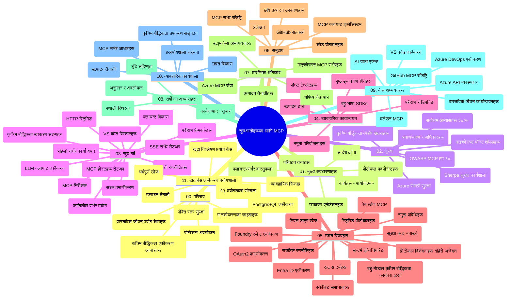

# मॉडल कन्टेक्स्ट प्रोटोकल (MCP) प्रारम्भिकहरूको लागि - अध्ययन मार्गदर्शिका

यो अध्ययन मार्गदर्शिकाले "मोडेल कन्टेक्स्ट प्रोटोकल (MCP) प्रारम्भिकहरूको लागि" पाठ्यक्रमको लागि संग्रह संरचना र सामग्रीको अवलोकन प्रदान गर्दछ। यस मार्गदर्शिकालाई प्रयोग गरी संग्रहलाई प्रभावकारी रूपमा नेभिगेट गर्नुहोस् र उपलब्ध स्रोतहरूबाट बढी लाभ लिनुहोस्।

## संग्रह अवलोकन

मोडेल कन्टेक्स्ट प्रोटोकल (MCP) AI मोडेलहरू र क्लाइन्ट अनुप्रयोगहरू बीच अन्तरक्रियाहरूको लागि मानकीकृत फ्रेमवर्क हो। मूल रूपमा Anthropic द्वारा सिर्जना गरिएको, MCP अब आधिकारिक GitHub संगठन द्वारा व्यापक MCP समुदायले व्यवस्थापित गर्दछ। यो संग्रह AI विकासकर्ताहरू, प्रणाली वास्तुकारहरू, र सफ्टवेयर इञ्जीनियरहरूको लागि डिजाइन गरिएको C#, Java, JavaScript, Python, र TypeScript मा व्यावहारिक कोड उदाहरणहरूसहित व्यापक पाठ्यक्रम प्रदान गर्दछ।

## भिजुअल पाठ्यक्रम नक्शा

## संग्रह संरचना

संग्रहलाई एघार मुख्य खण्डहरूमा संगठन गरिएको छ, प्रत्येक MCP का फरक पक्षहरूमा केन्द्रित:

1. **परिचय (00-Introduction/)**
   - मोडेल कन्टेक्स्ट प्रोटोकलको अवलोकन
   - AI पाइपलाइनहरूमा मानकीकरण किन महत्वपूर्ण छ
   - व्यावहारिक प्रयोग केसहरू र फाइदाहरू

2. **कोर अवधारणाहरू (01-CoreConcepts/)**
   - क्लाइन्ट-सर्भर वास्तुकला
   - मुख्य प्रोटोकल कम्पोनेन्टहरू
   - MCP मा संदेश आदान-प्रदान ढाँचाहरू

3. **सुरक्षा (02-Security/)**
   - MCP-आधारित प्रणालीहरूमा सुरक्षा खतरा
   - कार्यान्वयनहरू सुरक्षित गर्नका लागि उत्तम अभ्यासहरू
   - प्रमाणीकरण र प्राधिकरण रणनीतिहरू
   - **व्यापक सुरक्षा कागजातहरू**:
     - MCP सुरक्षा उत्तम अभ्यासहरू 2025
     - Azure सामग्री सुरक्षा कार्यान्वयन मार्गदर्शिका
     - MCP सुरक्षा नियन्त्रण र प्रविधिहरू
     - MCP उत्तम अभ्यासहरू त्वरित संदर्भ
   - **प्रमुख सुरक्षा विषयहरू**:
     - प्रॉम्प्ट इन्जेक्शन र उपकरण विषाक्तता आक्रमणहरू
     - सत्र अपहरण र गडबड डिपुटी समस्याहरू
     - टोकन पासथ्रू कमजोरीहरू
     - अत्यधिक अनुमतिहरू र पहुँच नियन्त्रण
     - AI कम्पोनेन्टहरूको आपूर्ति श्रृंखला सुरक्षा
     - Microsoft प्रॉम्प्ट शिल्ड्स एकीकरण

4. **शुरू गरौं (03-GettingStarted/)**
   - वातावरण सेटअप र कन्फिगरेसन
   - आधारभूत MCP सर्भरहरू र क्लाइन्टहरू बनाउन
   - अवस्थित अनुप्रयोगहरूसँग एकीकरण
   - समावेश खण्डहरू:
     - पहिलो सर्भर कार्यान्वयन
     - क्लाइन्ट विकास
     - LLM क्लाइन्ट एकीकरण
     - VS Code एकीकरण
     - सर्भर-सेंट इभेन्ट्स (SSE) सर्भर
     - उन्नत सर्भर प्रयोग
     - HTTP स्ट्रिमिङ्ग
     - AI उपकरण सेट एकीकरण
     - परीक्षण रणनीतिहरू
     - परिनियोजन मार्गदर्शिका

5. **व्यावहारिक कार्यान्वयन (04-PracticalImplementation/)**
   - विभिन्न प्रोग्रामिङ भाषाहरूमा SDK प्रयोग
   - डिबगिङ, परीक्षण, र प्रमाणीकरण तरिकाहरू
   - पुन: प्रयोग योग्य प्रॉम्प्ट टेम्प्लेट र कार्यप्रवाहहरू तयार पार्नु
   - कार्यान्वयन उदाहरणहरूसहित नमूना परियोजनाहरू

6. **उन्नत विषयहरू (05-AdvancedTopics/)**
   - कन्टेक्स्ट इञ्जिनियरिङ प्रविधिहरू
   - फाउन्ड्री एजेन्ट एकीकरण
   - बहु-मोडल AI कार्यप्रवाहहरू
   - OAuth2 प्रमाणीकरण डेमोहरू
   - रियल-टाइम खोज क्षमता
   - रियल-टाइम स्ट्रिमिङ्ग
   - मूल कन्टेक्स्टहरू कार्यान्वयन
   - राउटिङ रणनीतिहरू
   - नमूना प्रविधिहरू
   - स्केलिङ उपायहरू
   - सुरक्षा विचारहरू
   - Entra ID सुरक्षा एकीकरण
   - वेब खोज एकीकरण

7. **समुदाय योगदानहरू (06-CommunityContributions/)**
   - कोड र कागजातमा कसरी योगदान गर्ने
   - GitHub मार्फत सहकार्य
   - समुदाय-चालित सुधार र प्रतिक्रिया
   - विभिन्न MCP क्लाइन्टहरू प्रयोग: Claude Desktop, Cline, VSCode
   - लोकप्रिय MCP सर्भरहरूसँग काम: इमेज निर्माण सहित

8. **प्रारम्भिक स्वीकृतिबाट सिकाई (07-LessonsfromEarlyAdoption/)**
   - वास्तविक-विश्व कार्यान्वयन र सफलताका कथाहरू
   - MCP-आधारित समाधानहरू निर्माण र परिनियोजन
   - प्रवृत्ति र भविष्यको रोडम्याप
   - **Microsoft MCP सर्भरहरू मार्गदर्शिका**: १० उत्पादन-तयार Microsoft MCP सर्भरहरूको व्यापक मार्गदर्शिका:
     - Microsoft Learn Docs MCP Server
     - Azure MCP Server (१५+ विशेष कनेक्टरहरू)
     - GitHub MCP Server
     - Azure DevOps MCP Server
     - MarkItDown MCP Server
     - SQL Server MCP Server
     - Playwright MCP Server
     - Dev Box MCP Server
     - Azure AI Foundry MCP Server
     - Microsoft 365 Agents Toolkit MCP Server

9. **उत्तम अभ्यासहरू (08-BestPractices/)**
   - प्रदर्शन ट्यूनिङ्ग र अनुकूलन
   - दोष सहिष्णु MCP प्रणालीहरू डिजाइन
   - परीक्षण र लचिलोपन रणनीतिहरू

10. **केस अध्ययनहरू (09-CaseStudy/)**
    - **सात व्यापक केस अध्ययनहरू** जुन विभिन्न परिदृश्यहरूमा MCP को बहुमुखितालाई देखाउँछन्:
    - **Azure AI ट्राभल एजेन्टहरू**: Azure OpenAI र AI खोजसँग बहु-एजेन्ट समन्वय
    - **Azure DevOps एकीकरण**: YouTube डाटा अद्यावधिकहरूसँग कार्यप्रवाह प्रक्रिया स्वचालित गर्नु
    - **रियल-टाइम कागजात पुनःप्राप्ति**: Python कन्सोल क्लाइन्ट HTTP स्ट्रिमिङ्गसहित
    - **इंटरएक्टिभ अध्ययन योजना जेनेरेटर**: Chainlit वेब एप्लिकेसन संवादात्मक AI सहित
    - **इन-एडिटर कागजात**: VS Code GitHub Copilot कार्यप्रवाहसँग एकीकरण
    - **Azure API व्यवस्थापन**: उद्यम API एकीकरण र MCP सर्भर सिर्जना
    - **GitHub MCP रजिस्ट्री**: पारिस्थितिकी तन्त्र विकास र एजेन्टिक एकीकरण प्लेटफर्म
    - उद्यम एकीकरण, विकासकर्ता उत्पादकता, र पारिस्थितिकी तन्त्र विकासमा फैलिएका कार्यान्वयन उदाहरणहरू

11. **व्यावहारिक कार्यशाला (10-StreamliningAIWorkflowsBuildingAnMCPServerWithAIToolkit/)**
    - MCP र AI उपकरण सेटलाई संयोजन गर्ने व्यापक व्यावहारिक कार्यशाला
    - AI मोडेलहरूलाई वास्तविक-विश्व उपकरणहरूसँग जोड्ने बुद्धिमान अनुप्रयोगहरू निर्माण
    - मूलभूत, कस्टम सर्भर विकास, र उत्पादन परिनियोजन रणनीतिहरू सम्बन्धित व्यावहारिक मोड्युलहरू
    - **प्रयोगशालाको संरचना**:
      - प्रयोगशाला १: MCP सर्भर आधारहरू
      - प्रयोगशाला २: उन्नत MCP सर्भर विकास
      - प्रयोगशाला ३: AI उपकरण सेट एकीकरण
      - प्रयोगशाला ४: उत्पादन परिनियोजन र स्केलिङ्ग
    - चरण-द्वारा-चरण निर्देशनसहित प्रयोगशालामा आधारित सिकाइ

12. **MCP सर्भर डेटाबेस एकीकरण प्रयोगशालाहरू (11-MCPServerHandsOnLabs/)**
    - उत्पादन-तयार MCP सर्भरहरू PostgreSQL एकीकरणसहित बनाउनका लागि **१३-प्रयोगशालाहरूको व्यापक सिकाइ मार्ग**
    - वास्तविक-दुनियाँ खुद्रा विश्लेषण कार्यान्वयन, Zava Retail प्रयोग केस प्रयोग गर्दै
    - उद्यम-स्तरीय ढाँचाहरू जस्तै रो लेवल सुरक्षा (RLS), सेम्यान्टिक खोज, र बहु-टेनेंट डेटा पहुँच
    - **पूर्ण प्रयोगशाला संरचना**:
      - **प्रयोगशाला ००-०३: आधारहरू** - परिचय, वास्तुकला, सुरक्षा, वातावरण सेटअप
      - **प्रयोगशाला ०४-०६: MCP सर्भर निर्माण** - डेटाबेस डिजाइन, MCP सर्भर कार्यान्वयन, उपकरण विकास
      - **प्रयोगशाला ०७-०९: उन्नत सुविधाहरू** - सेम्यान्टिक खोज, परीक्षण र डिबगिङ्ग, VS Code एकीकरण
      - **प्रयोगशाला १०-१२: उत्पादन र उत्तम अभ्यासहरू** - परिनियोजन, अनुगमन, अनुकूलन
    - **अवस्थित प्रविधिहरू**: FastMCP फ्रेमवर्क, PostgreSQL, Azure OpenAI, Azure कन्टेनर एप्स, एप्लिकेसन इनसाइट्स
    - **सिकाइ नतिजाहरू**: उत्पादन-तयार MCP सर्भरहरू, डेटाबेस एकीकरण ढाँचाहरू, AI-संचालित विश्लेषण, उद्यम सुरक्षा

## अतिरिक्त स्रोतहरू

संग्रहमा समर्थन स्रोतहरू समावेश छन्:

- **इमेज फोल्डर**: पाठ्यक्रमभर प्रयोग भएका आरेख र चित्रणहरू
- **अनुवादहरू**: कागजातहरूको स्वचालित बहुभाषी समर्थन
- **आधिकारिक MCP स्रोतहरू**:
  - [MCP Documentation](https://modelcontextprotocol.io/)
  - [MCP Specification](https://spec.modelcontextprotocol.io/)
  - [MCP GitHub Repository](https://github.com/modelcontextprotocol)

## यस संग्रह कसरी प्रयोग गर्ने

1. **क्रमबद्ध सिकाइ**: संरचित सिकाइ अनुभवको लागि अध्यायहरू (०० देखि ११ सम्म) पालना गर्नुहोस्।
2. **भाषा-विशेष केन्द्रित**: यदि तपाईं कुनै विशेष प्रोग्रामिङ भाषामा रुचि राख्नुहुन्छ भने, पंसदीदा भाषामा कार्यान्वयनहरूको लागि नमूना निर्देशिकाहरू अन्वेषण गर्नुहोस्।
3. **व्यावहारिक कार्यान्वयन**: "शुरू गरौं" खण्डबाट आफ्नो वातावरण सेटअप गर्नुहोस् र पहिलो MCP सर्भर र क्लाइन्ट सिर्जना गर्नुहोस्।
4. **उन्नत अन्वेषण**: आधारहरूमा सहज भएपछि, आफ्नो ज्ञान विस्तार गर्न उन्नत विषयहरूमा छिर्नुहोस्।
5. **समुदाय संलग्नता**: विशेषज्ञहरू र साथी विकासकर्ताहरूसँग जडान गर्न GitHub छलफल र Discord च्यानलहरू मार्फत MCP समुदायमा सहभागी हुनुहोस्।

## MCP क्लाइन्ट र उपकरणहरू

पाठ्यक्रमले विभिन्न MCP क्लाइन्ट र उपकरणहरू समेट्छ:

1. **आधिकारिक क्लाइन्टहरू**:
   - Visual Studio Code
   - MCP in Visual Studio Code
   - Claude Desktop
   - Claude in VSCode
   - Claude API

2. **समुदाय क्लाइन्टहरू**:
   - Cline (टर्मिनल-आधारित)
   - Cursor (कोड सम्पादक)
   - ChatMCP
   - Windsurf

3. **MCP व्यवस्थापन उपकरणहरू**:
   - MCP CLI
   - MCP Manager
   - MCP Linker
   - MCP Router

## लोकप्रिय MCP सर्भरहरू

संग्रह विभिन्न MCP सर्भरहरू परिचय गराउँछ, जसमध्ये:

1. **आधिकारिक Microsoft MCP सर्भरहरू**:
   - Microsoft Learn Docs MCP Server
   - Azure MCP Server (१५+ विशेष कनेक्टरहरू)
   - GitHub MCP Server
   - Azure DevOps MCP Server
   - MarkItDown MCP Server
   - SQL Server MCP Server
   - Playwright MCP Server
   - Dev Box MCP Server
   - Azure AI Foundry MCP Server
   - Microsoft 365 Agents Toolkit MCP Server

2. **आधिकारिक संदर्भ सर्भरहरू**:
   - Filesystem
   - Fetch
   - Memory
   - Sequential Thinking

3. **छवि निर्माण**:
   - Azure OpenAI DALL-E 3
   - Stable Diffusion WebUI
   - Replicate

4. **विकास उपकरणहरू**:
   - Git MCP
   - Terminal Control
   - Code Assistant

5. **विशेष सर्भरहरू**:
   - Salesforce
   - Microsoft Teams
   - Jira & Confluence

## योगदान

यो संग्रहले समुदायबाट योगदानहरू स्वागत गर्दछ। MCP पारिस्थितिकी तन्त्रमा प्रभावकारी योगदान कसरी गर्ने भनेर मार्गदर्शनका लागि समुदाय योगदानहरू खण्ड हेर्नुहोस्।

----

*यस अध्ययन मार्गदर्शिका फेब्रुअरी ५, २०२६ मा अन्तिम पटक अद्यावधिक गरिएको हो, जसले नवीनतम MCP विशिष्टता २०२५-११-२५ लाई प्रतिबिम्बित गर्छ र उक्त मितिदेखि संग्रहको अवलोकन प्रदान गर्दछ। संग्रह सामग्री यस मितिपछि अद्यावधिक हुन सक्छ।*

---

<!-- CO-OP TRANSLATOR DISCLAIMER START -->
**अस्वीकरण**:
यो दस्तावेज कृत्रिम बुद्धिमत्ता अनुवाद सेवा [Co-op Translator](https://github.com/Azure/co-op-translator) प्रयोग गरेर अनुवाद गरिएको हो। हामी सही अनुवादको प्रयास गर्छौं, तर कृपया जानकार हुनुहोस् कि स्वचालित अनुवादहरूमा त्रुटि वा अशुद्धता हुन सक्छ। मूल दस्तावेज यसको स्वदेशी भाषामा नै अधिकारिक स्रोत मानिनु पर्छ। महत्वपूर्ण जानकारीका लागि व्यावसायिक मानव अनुवाद सिफारिस गरिन्छ। यस अनुवादको प्रयोगबाट उत्पन्न कुनै पनि गलतफहमी वा गलत व्याख्याका लागि हामी जिम्मेवार हौंैनौं।
<!-- CO-OP TRANSLATOR DISCLAIMER END -->