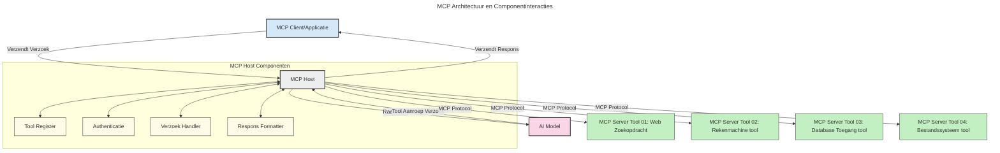

# Introductie van het Model Context Protocol (MCP): Waarom Het Belangrijk Is voor Schaalbare AI-toepassingen

[](https://youtu.be/agBbdiOPLQA)

_(Klik op de afbeelding hierboven om de video van deze les te bekijken)_

Generatieve AI-toepassingen zijn een grote stap vooruit omdat ze de gebruiker vaak laten communiceren met de app via natuurlijke taal prompts. Echter, naarmate er meer tijd en middelen worden geïnvesteerd in zulke apps, wil je ervoor zorgen dat je functionaliteiten en bronnen gemakkelijk kunt integreren op een manier die eenvoudig uit te breiden is, ervoor zorgen dat je app meerdere modellen kan ondersteunen en verschillende modelcomplexiteiten kan afhandelen. Kortom, het bouwen van Gen AI-apps is in het begin eenvoudig, maar naarmate ze groeien en complexer worden, moet je beginnen met het definiëren van een architectuur en zul je waarschijnlijk moeten vertrouwen op een standaard om ervoor te zorgen dat je apps op een consistente manier worden gebouwd. Hier komt MCP om de hoek kijken om dingen te organiseren en een standaard te bieden.

---

## **🔍 Wat is het Model Context Protocol (MCP)?**

Het **Model Context Protocol (MCP)** is een **open, gestandaardiseerde interface** die het mogelijk maakt dat grote taalmodellen (LLM's) naadloos kunnen communiceren met externe tools, API’s en databronnen. Het biedt een consistente architectuur om de functionaliteit van AI-modellen te verbeteren buiten hun trainingsdata, waardoor slimmere, schaalbare en meer responsieve AI-systemen ontstaan.

---

## **🎯 Waarom standaardisatie in AI belangrijk is**

Naarmate generatieve AI-toepassingen complexer worden, is het essentieel om standaarden te adopteren die zorgen voor **schaalbaarheid, uitbreidbaarheid, onderhoudbaarheid** en **het voorkomen van vendor lock-in**. MCP voorziet in deze behoeften door:

- Integraties van modellen en tools te uniformeren
- Minder breekbare, eenmalige maatwerkoplossingen te creëren
- Meerdere modellen van verschillende leveranciers binnen één ecosysteem te laten samenwerken

**Let op:** Hoewel MCP zichzelf als een open standaard presenteert, zijn er geen plannen om MCP te standaardiseren via bestaande standaardisatieorganisaties zoals IEEE, IETF, W3C, ISO of een andere standaardenorganisatie.

---

## **📚 Leerdoelen**

Aan het eind van dit artikel kun je:

- **Model Context Protocol (MCP)** definiëren en de toepassingsgebieden benoemen
- Begrijpen hoe MCP de communicatie tussen model en tool standaardiseert
- De kerncomponenten van de MCP-architectuur identificeren
- Praktijkvoorbeelden van MCP in bedrijfs- en ontwikkelingscontexten verkennen

---

## **💡 Waarom het Model Context Protocol (MCP) een doorbraak is**

### **🔗 MCP lost fragmentatie op in AI-interacties**

Voor MCP vereiste het integreren van modellen met tools:

- Maatwerkcode per tool-modelcombinatie
- Niet-gestandaardiseerde API's voor elke leverancier
- Regelmatige onderbrekingen door updates
- Slechte schaalbaarheid bij meer tools

### **✅ Voordelen van MCP-standaardisatie**

| **Voordeel**             | **Omschrijving**                                                              |
|--------------------------|--------------------------------------------------------------------------------|
| Interoperabiliteit       | LLM's werken naadloos met tools van verschillende leveranciers                |
| Consistentie             | Uniform gedrag over platforms en tools                                        |
| Herbruikbaarheid         | Tools die eenmaal zijn gebouwd, zijn herbruikbaar over projecten en systemen  |
| Versnelde ontwikkeling   | Vermindert ontwikkelingstijd door gestandaardiseerde, plug-and-play interfaces |

---

## **🧱 Overzicht van de MCP-architectuur op hoog niveau**

MCP volgt een **client-servermodel**, waarbij:

- **MCP Hosts** de AI-modellen draaien
- **MCP Clients** verzoeken initiëren
- **MCP Servers** context, tools en capaciteiten leveren

### **Belangrijke componenten:**

- **Resources** – Statische of dynamische data voor modellen  
- **Prompts** – Vooraf gedefinieerde workflows voor geleide generaties  
- **Tools** – Uitvoerbare functies zoals zoeken, berekeningen  
- **Sampling** – Agentgedrag via recursieve interacties
- **Elicitation** – Server-gestuurde verzoeken om gebruikersinvoer
- **Roots** – Bestandsysteemgrenzen voor servertoegangscontrole

### **Protocolarchitectuur:**

MCP gebruikt een tweelaagse architectuur:
- **Datalayer**: Communicatie gebaseerd op JSON-RPC 2.0 met lifecycle management en primitieve functies
- **Transportlaag**: STDIO (lokaal) en Streamable HTTP met SSE (remote) communicatiekanalen

---

## Hoe MCP-servers werken

MCP-servers functioneren als volgt:

- **Verzoekstroom**:
    1. Een verzoek wordt geïnitieerd door een eindgebruiker of software die namens hen handelt.
    2. De **MCP Client** stuurt het verzoek naar een **MCP Host**, die de AI Model runtime beheert.
    3. Het **AI Model** ontvangt de gebruikersprompt en kan toegang tot externe tools of data aanvragen via één of meerdere tool-aanroepen.
    4. De **MCP Host**, niet het model rechtstreeks, communiceert met de juiste **MCP Server(s)** via het gestandaardiseerde protocol.
- **Functionaliteit van MCP Host**:
    - **Toolregistratie**: Houdt een catalogus bij van beschikbare tools en hun mogelijkheden.
    - **Authenticatie**: Verifieert permissies voor tooltoegang.
    - **Request Handler**: Verwerkt binnenkomende toolverzoeken van het model.
    - **Response Formatter**: Structureert tooloutputs in een formaat dat het model begrijpt.
- **Uitvoering van MCP Server**:
    - De **MCP Host** leidt tool-aanroepen naar één of meerdere **MCP Servers**, die elk gespecialiseerde functies aanbieden (bijv. zoeken, berekeningen, database-queries).
    - De **MCP Servers** voeren hun bewerkingen uit en retourneren resultaten aan de **MCP Host** in een consistent formaat.
    - De **MCP Host** formatteert en stuurt deze resultaten door naar het **AI Model**.
- **Afronding respons**:
    - Het **AI Model** verwerkt de tooloutputs in een definitief antwoord.
    - De **MCP Host** stuurt deze respons terug naar de **MCP Client**, die deze aan de eindgebruiker of aanroepende software bezorgt.
    


## 👨‍💻 Hoe bouw je een MCP-server (met voorbeelden)

MCP-servers stellen je in staat om LLM-capaciteiten uit te breiden door data en functionaliteit te bieden. 

Klaar om het te proberen? Hier vind je taal- en/of stack-specifieke SDK’s met voorbeelden van het maken van eenvoudige MCP-servers in verschillende talen/stacks:

- **Python SDK**: https://github.com/modelcontextprotocol/python-sdk

- **TypeScript SDK**: https://github.com/modelcontextprotocol/typescript-sdk

- **Java SDK**: https://github.com/modelcontextprotocol/java-sdk

- **C#/.NET SDK**: https://github.com/modelcontextprotocol/csharp-sdk


## 🌍 Praktijkvoorbeelden van MCP

MCP maakt een breed scala aan toepassingen mogelijk door AI-capaciteiten uit te breiden:

| **Toepassing**               | **Omschrijving**                                                             |
|-----------------------------|-------------------------------------------------------------------------------|
| Enterprise Data-integratie   | Verbind LLM's met databases, CRM's of interne tools                          |
| Agent-achtige AI-systemen    | Maak autonome agents mogelijk met tooltoegang en besluitvormingsworkflows    |
| Multi-modale toepassingen    | Combineer tekst-, beeld- en audio-tools binnen één geïntegreerde AI-app      |
| Real-time data-integratie    | Breng live data in AI-interacties voor nauwkeurigere, actuele output         |


### 🧠 MCP = Universele standaard voor AI-interacties

Het Model Context Protocol (MCP) fungeert als een universele standaard voor AI-interacties, net zoals USB-C fysieke verbindingen voor apparaten standaardiseerde. In de AI-wereld biedt MCP een consistente interface, waarmee modellen (clients) naadloos kunnen integreren met externe tools en dataproviders (servers). Dit elimineert de noodzaak voor diverse, aangepaste protocollen per API of databron.

Onder MCP volgt een MCP-compatibele tool (ook wel een MCP-server genoemd) een uniforme standaard. Deze servers kunnen de tools of acties die zij aanbieden weergeven en deze acties uitvoeren wanneer een AI-agent dit vraagt. AI-agentplatforms die MCP ondersteunen kunnen beschikbare tools van de servers ontdekken en deze via dit standaardprotocol aanroepen.

### 💡 Faciliteert toegang tot kennis

Naast het aanbieden van tools faciliteert MCP ook de toegang tot kennis. Het stelt applicaties in staat om context aan grote taalmodellen (LLM’s) te bieden door deze te koppelen aan diverse databronnen. Bijvoorbeeld, een MCP-server kan de documentenbibliotheek van een bedrijf vertegenwoordigen, waardoor agents relevante informatie op verzoek kunnen opvragen. Een andere server kan specifieke acties behandelen, zoals het verzenden van e-mails of het bijwerken van records. Vanuit het oogpunt van de agent zijn dit eenvoudigweg tools die gebruikt kunnen worden—sommige tools leveren data (kenniscontext), terwijl andere acties uitvoeren. MCP beheert beide efficiënt.

Een agent die verbinding maakt met een MCP-server leert automatisch over de beschikbare capaciteiten en toegankelijke data van de server via een gestandaardiseerd formaat. Deze standaardisatie maakt dynamische beschikbaarheid van tools mogelijk. Bijvoorbeeld, door een nieuwe MCP-server toe te voegen aan het agentensysteem worden de functies direct bruikbaar zonder verdere aanpassing van de agentinstructies.

Deze gestroomlijnde integratie sluit aan bij de stroom zoals weergegeven in het volgende diagram, waarin servers zowel tools als kennis leveren, wat zorgt voor naadloze samenwerking tussen systemen.

### 👉 Voorbeeld: Schaalbare agentoplossing

```mermaid
---
title: Schaalbare Agentoplossing met MCP
description: Een diagram dat illustreert hoe een gebruiker interacteert met een LLM die verbinding maakt met meerdere MCP-servers, waarbij elke server zowel kennis als tools aanbiedt, wat een schaalbare AI-systeemarchitectuur creëert
---
graph TD
    User -->|Prompt| LLM
    LLM -->|Response| User
    LLM -->|MCP| ServerA
    LLM -->|MCP| ServerB
    ServerA -->|Universele connector| ServerB
    ServerA --> KnowledgeA
    ServerA --> ToolsA
    ServerB --> KnowledgeB
    ServerB --> ToolsB

    subgraph Server A
        KnowledgeA[Kennis]
        ToolsA[Tools]
    end

    subgraph Server B
        KnowledgeB[Kennis]
        ToolsB[Tools]
    end
```De Universal Connector maakt het mogelijk dat MCP-servers met elkaar communiceren en capaciteiten delen, waardoor ServerA taken kan delegeren aan ServerB of toegang kan krijgen tot diens tools en kennis. Dit federereert tools en data tussen servers, wat schaalbare en modulaire agentarchitecturen ondersteunt. Omdat MCP het beschikbaar stellen van tools standaardiseert, kunnen agents dynamisch tools ontdekken en verzoeken routen tussen servers zonder hardcoded integraties.


Tool- en kennisfederatie: Tools en data zijn toegankelijk over servers heen, wat meer schaalbare en modulaire agentachtige architecturen mogelijk maakt.

### 🔄 Geavanceerde MCP-scenario’s met client-side LLM-integratie

Naast de basis MCP-architectuur zijn er geavanceerde scenario’s waarbij zowel client als server LLM’s bevatten, waardoor complexere interacties mogelijk zijn. In het volgende diagram kan de **Client App** bijvoorbeeld een IDE zijn met verschillende MCP-tools beschikbaar voor gebruik door de LLM:

```mermaid
---
title: Geavanceerde MCP-scenario's met Client-Server LLM-integratie
description: Een sequentiediagram dat de gedetailleerde interactiestroom toont tussen gebruiker, clientapplicatie, client LLM, meerdere MCP-servers en server LLM, waarin tool-ontdekking, gebruikersinteractie, directe tool-aanroep en functievergelijkingsfasen worden geïllustreerd
---
sequenceDiagram
    autonumber
    actor User as 👤 Gebruiker
    participant ClientApp as 🖥️ Client App
    participant ClientLLM as 🧠 Client LLM
    participant Server1 as 🔧 MCP Server 1
    participant Server2 as 📚 MCP Server 2
    participant ServerLLM as 🤖 Server LLM
    
    %% Ontdekkingsfase
    rect rgb(220, 240, 255)
        Note over ClientApp, Server2: TOOL ONTDEKKINGSFASE
        ClientApp->>+Server1: Vraag beschikbare tools/bronnen op
        Server1-->>-ClientApp: Geef lijst met tools terug (JSON)
        ClientApp->>+Server2: Vraag beschikbare tools/bronnen op
        Server2-->>-ClientApp: Geef lijst met tools terug (JSON)
        Note right of ClientApp: Sla gecombineerde tool<br/>catalogus lokaal op
    end
    
    %% Gebruikersinteractie
    rect rgb(255, 240, 220)
        Note over User, ClientLLM: GEBRUIKERSINTERACTIEFASE
        User->>+ClientApp: Voer prompt in natuurlijke taal in
        ClientApp->>+ClientLLM: Doorsturen prompt + toolcatalogus
        ClientLLM->>-ClientLLM: Analyseer prompt & selecteer tools
    end
    
    %% Scenario A: Directe tool-aanroep
    alt Directe tool-aanroep
        rect rgb(220, 255, 220)
            Note over ClientApp, Server1: SCENARIO A: DIRECTE TOOL-AANROEP
            ClientLLM->>+ClientApp: Vraag tooluitvoering aan
            ClientApp->>+Server1: Voer specifieke tool uit
            Server1-->>-ClientApp: Geef resultaten terug
            ClientApp->>+ClientLLM: Verwerk resultaten
            ClientLLM-->>-ClientApp: Genereer antwoord
            ClientApp-->>-User: Toon eindantwoord
        end
    
    %% Scenario B: Functievergelijking (VS Code-stijl)
    else Functievergelijking (VS Code-stijl)
        rect rgb(255, 220, 220)
            Note over ClientApp, ServerLLM: SCENARIO B: FUNCTIEVERGELIJKING
            ClientLLM->>+ClientApp: Identificeer benodigde mogelijkheden
            ClientApp->>+Server2: Onderhandel functies/mogelijkheden
            Server2->>+ServerLLM: Vraag aanvullende context aan
            ServerLLM-->>-Server2: Bied context aan
            Server2-->>-ClientApp: Geef beschikbare functies terug
            ClientApp->>+Server2: Roep onderhandelde tools aan
            Server2-->>-ClientApp: Geef resultaten terug
            ClientApp->>+ClientLLM: Verwerk resultaten
            ClientLLM-->>-ClientApp: Genereer antwoord
            ClientApp-->>-User: Toon eindantwoord
        end
    end
```
## 🔐 Praktische voordelen van MCP

Hier zijn de praktische voordelen van het gebruik van MCP:

- **Actualiteit**: Modellen kunnen toegang krijgen tot up-to-date informatie buiten hun trainingsdata
- **Capaciteitsuitbreiding**: Modellen kunnen gespecialiseerde tools gebruiken voor taken waarvoor ze niet getraind zijn
- **Verminderde hallucinaties**: Externe databronnen bieden feitelijke onderbouwing
- **Privacy**: Gevoelige data kan binnen veilige omgevingen blijven in plaats van in prompts verwerkt te worden

## 📌 Belangrijkste punten

De volgende punten zijn belangrijk bij het gebruik van MCP:

- **MCP** standaardiseert hoe AI-modellen communiceren met tools en data
- Bevordert **uitbreidbaarheid, consistentie en interoperabiliteit**
- MCP helpt **ontwikkelingstijd te verminderen, betrouwbaarheid te verbeteren en modelcapaciteiten uit te breiden**
- De client-serverarchitectuur maakt **flexibele, uitbreidbare AI-applicaties mogelijk**

## 🧠 Oefening

Denk na over een AI-toepassing die je graag wilt bouwen.

- Welke **externe tools of data** zouden de mogelijkheden kunnen vergroten?
- Hoe zou MCP de integratie **eenvoudiger en betrouwbaarder** kunnen maken?

## Aanvullende bronnen

- [MCP GitHub Repository](https://github.com/modelcontextprotocol)


## Wat nu

Vervolg: [Hoofdstuk 1: Kernconcepten](../01-CoreConcepts/README.md)

---

<!-- CO-OP TRANSLATOR DISCLAIMER START -->
**Disclaimer**:  
Dit document is vertaald met behulp van de AI-vertalingsdienst [Co-op Translator](https://github.com/Azure/co-op-translator). Hoewel wij streven naar nauwkeurigheid, dient u er rekening mee te houden dat automatische vertalingen fouten of onnauwkeurigheden kunnen bevatten. Het originele document in de oorspronkelijke taal moet als de gezaghebbende bron worden beschouwd. Voor belangrijke informatie wordt een professionele menselijke vertaling aanbevolen. Wij zijn niet aansprakelijk voor misverstanden of verkeerde interpretaties die voortvloeien uit het gebruik van deze vertaling.
<!-- CO-OP TRANSLATOR DISCLAIMER END -->