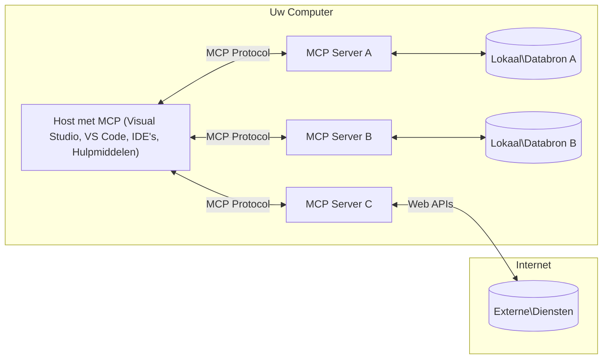

# MCP Kernconcepten: Beheersing van het Model Context Protocol voor AI-integratie

[](https://youtu.be/earDzWGtE84)

_(Klik op de afbeelding hierboven om de video van deze les te bekijken)_

Het [Model Context Protocol (MCP)](https://github.com/modelcontextprotocol) is een krachtig, gestandaardiseerd kader dat communicatie tussen Large Language Models (LLM's) en externe hulpmiddelen, applicaties en databronnen optimaliseert.  
Deze gids neemt je mee door de kernconcepten van MCP. Je leert over de client-serverarchitectuur, essentiële componenten, communicatiemechanismen en implementatiebest practices.

- **Expliciete Gebruikerstoestemming**: Alle gegevens toegang en operaties vereisen expliciete goedkeuring van de gebruiker voordat ze worden uitgevoerd. Gebruikers moeten duidelijk begrijpen welke gegevens worden geraadpleegd en welke acties worden uitgevoerd, met gedetailleerde controle over permissies en autorisaties.

- **Bescherming van Gegevensprivacy**: Gebruikersgegevens worden alleen blootgesteld met expliciete toestemming en moeten worden beschermd door robuuste toegangscontroles gedurende de gehele interactiecyclus. Implementaties moeten onbevoegde gegevensoverdracht voorkomen en strikte privacygrenzen handhaven.

- **Veiligheid bij Hulpmiddeluitvoering**: Elke aanroep van een hulpmiddel vereist expliciete gebruikerstoestemming met een duidelijk begrip van de functionaliteit, parameters en mogelijke impact. Robuuste beveiligingscontroles moeten onbedoelde, onveilige of schadelijke uitvoering van hulpmiddelen voorkomen.

- **Transportlaagbeveiliging**: Alle communicatiekanalen moeten gebruikmaken van passende encryptie- en authenticatiemechanismen. Externe verbindingen moeten beveiligde transportprotocollen en degelijke beheer van referenties implementeren.

#### Implementatierichtlijnen:

- **Beheer van Permissies**: Implementeer fijnmazige permissiesystemen waarmee gebruikers kunnen bepalen welke servers, hulpmiddelen en bronnen toegankelijk zijn  
- **Authenticatie & Autorisatie**: Gebruik veilige authenticatiemethoden (OAuth, API-sleutels) met correct tokenbeheer en verlopen  
- **Invoervalidatie**: Valideer alle parameters en gegevensinvoer volgens gedefinieerde schema's om injectieaanvallen te voorkomen  
- **Auditlogging**: Houd uitgebreide logboeken bij van alle operaties voor beveiligingsmonitoring en naleving  

## Overzicht

Deze les verkent de fundamentele architectuur en componenten die het Model Context Protocol (MCP) ecosysteem vormen. Je leert over de client-serverarchitectuur, kerncomponenten en communicatiemechanismen die MCP-interacties aandrijven.

## Belangrijkste Leerdoelen

Aan het einde van deze les zul je:

- De MCP client-serverarchitectuur begrijpen.  
- Rollen en verantwoordelijkheden van Hosts, Clients en Servers kunnen identificeren.  
- De kernfuncties analyseren die MCP tot een flexibele integratielaag maken.  
- Leren hoe informatie stroomt binnen het MCP-ecosysteem.  
- Praktische inzichten opdoen via codevoorbeelden in .NET, Java, Python en JavaScript.  

## MCP Architectuur: Een Diepere Kijk

Het MCP-ecosysteem is opgebouwd volgens een client-servermodel. Deze modulaire structuur stelt AI-applicaties in staat efficiënt te communiceren met hulpmiddelen, databanken, API's en contextuele bronnen. Laten we deze architectuur opbreken in de kerncomponenten.

In de kern volgt MCP een client-serverarchitectuur waarbij een hostapplicatie kan verbinden met meerdere servers:


- **MCP Hosts**: Programma's zoals VSCode, Claude Desktop, IDE's of AI-hulpmiddelen die via MCP toegang willen tot data  
- **MCP Clients**: Protocolclients die 1:1-verbindingen met servers onderhouden  
- **MCP Servers**: Lichtgewicht programma's die via het gestandaardiseerde Model Context Protocol specifieke functionaliteiten aanbieden  
- **Lokale Gegevensbronnen**: Bestanden, databases en services op jouw computer die MCP-servers veilig kunnen benaderen  
- **Externe Diensten**: Externe systemen bereikbaar via internet waar MCP-servers via API's mee kunnen verbinden  

Het MCP-protocol is een evoluerende standaard die versiebeheer op datum gebruikt (formaat JJJJ-MM-DD). De huidige protocolversie is **2025-11-25**. Je kunt de laatste updates zien in de [protocolspecificatie](https://modelcontextprotocol.io/specification/2025-11-25/)

### 1. Hosts

In het Model Context Protocol (MCP) zijn **Hosts** AI-applicaties die dienen als de primaire interface waarlangs gebruikers met het protocol interacteren. Hosts coördineren en beheren verbindingen met meerdere MCP-servers door voor iedere serververbinding een dedicated MCP-client te creëren. Voorbeelden van Hosts zijn:

- **AI Applicaties**: Claude Desktop, Visual Studio Code, Claude Code  
- **Ontwikkelomgevingen**: IDE's en code editors met MCP-integratie  
- **Maatwerkapplicaties**: Speciaal gebouwde AI-agenten en hulpmiddelen  

**Hosts** zijn applicaties die AI-modelinteracties coördineren. Ze:

- **Orkestreren AI Modellen**: Voeren LLM's uit of interacteren ermee om reacties te genereren en AI-workflows te coördineren  
- **Beheren Clientverbindingen**: Creëren en onderhouden één MCP-client per MCP-serververbinding  
- **Besturen de Gebruikersinterface**: Beheren gesprekstroom, gebruikersinteracties en presentatie van reacties  
- **Handhaven Beveiliging**: Controleren permissies, beveiligingsregels en authenticatie  
- **Beheren Gebruikerstoestemming**: Regelen goedkeuring van gebruikers voor gegevensdeling en uitvoering van hulpmiddelen  

### 2. Clients

**Clients** zijn essentiële componenten die toegewijde één-op-één verbindingen onderhouden tussen Hosts en MCP-servers. Elke MCP-client wordt door de Host gecreëerd om te verbinden met een specifieke MCP-server, wat georganiseerde en veilige communicatiekanalen garandeert. Meerdere clients maken het mogelijk dat Hosts gelijktijdig met meerdere servers verbinden.

**Clients** zijn connectorcomponenten binnen de hostapplicatie. Ze:

- **Protocolcommunicatie**: Verzenden JSON-RPC 2.0-verzoeken naar servers met prompts en instructies  
- **Onderhandeling Capaciteiten**: Onderhandelen over ondersteunde functies en protocolversies met servers tijdens initialisatie  
- **Uitvoering Hulpmiddelen**: Beheren verzoeken tot uitvoering van hulpmiddelen van modellen en verwerken responses  
- **Realtime Updates**: Verwerken notificaties en realtime updates van servers  
- **Verwerkingsresponses**: Verwerken en formatteren serverantwoorden voor weergave aan gebruikers  

### 3. Servers

**Servers** zijn programma's die context, hulpmiddelen en functionaliteiten aan MCP-clients bieden. Ze kunnen lokaal draaien (op dezelfde machine als de Host) of extern (op externe platforms) en zijn verantwoordelijk voor het afhandelen van clientverzoeken en het leveren van gestructureerde antwoorden. Servers bieden specifieke functionaliteit via het gestandaardiseerde Model Context Protocol.

**Servers** zijn diensten die context en mogelijkheden bieden. Ze:

- **Feature-registratie**: Registreren en openbaren beschikbare primitieve functies (bronnen, prompts, hulpmiddelen) aan clients  
- **Verwerkingsverzoeken**: Ontvangen en voeren aanroepen van hulpmiddelen uit, verwerken resource- en promptverzoeken van clients  
- **Contextvoorziening**: Bieden contextuele informatie en data ter verbetering van modelantwoorden  
- **Statusbeheer**: Onderhouden sessiestatus en behandelen stateful interacties indien nodig  
- **Realtime Notificaties**: Sturen meldingen over capaciteitswijzigingen en updates naar verbonden clients  

Servers kunnen door iedereen ontwikkeld worden om modelcapaciteiten uit te breiden met gespecialiseerde functionaliteiten, en ondersteunen zowel lokale als externe implementaties.

### 4. Server Primitives

Servers in het Model Context Protocol (MCP) bieden drie kern-**primitieven** die de fundamentele bouwstenen definiëren voor rijke interacties tussen clients, hosts en taalmodellen. Deze primitieve functies specificeren de soorten contextuele informatie en acties die via het protocol beschikbaar zijn.

MCP-servers kunnen elke combinatie van de volgende drie kernprimitieven aanbieden:

#### Bronnen 

**Bronnen** zijn gegevensbronnen die contextuele informatie aan AI-applicaties leveren. Ze representeren statische of dynamische inhoud die het begrip en de besluitvorming van het model kan verbeteren:

- **Contextuele Data**: Gestructureerde informatie en context voor AI-modelverwerking  
- **Kennisbanken**: Documentrepositories, artikelen, handleidingen en onderzoeksartikelen  
- **Lokale Gegevensbronnen**: Bestanden, databases en lokale systeeminformatie  
- **Externe Data**: API-antwoorden, webservices en externe systeembedrijven  
- **Dynamische Inhoud**: Realtime gegevens die bijwerken op basis van externe omstandigheden  

Bronnen worden geïdentificeerd met URI's en ondersteunen ontdekking via `resources/list` en ophalen via `resources/read` methoden:

```text
file://documents/project-spec.md
database://production/users/schema
api://weather/current
```

#### Prompts

**Prompts** zijn herbruikbare sjablonen die helpen bij het structureren van interacties met taalmodellen. Ze bieden gestandaardiseerde interactiepatronen en sjabloonworkflows:

- **Sjabloon-gebaseerde Interacties**: Vooraf gestructureerde berichten en gespreksaanzetten  
- **Workflow Templates**: Gestandaardiseerde sequenties voor veelvoorkomende taken en interacties  
- **Few-shot Voorbeelden**: Voorbeeldgebaseerde sjablonen voor modelinstructie  
- **Systeem Prompts**: Fundamentele prompts die gedrag en context van het model definiëren  
- **Dynamische Sjablonen**: Genereerde prompts die zich aanpassen aan specifieke contexten  

Prompts ondersteunen variabele substitutie, kunnen ontdekt worden via `prompts/list` en worden opgehaald met `prompts/get`:

```markdown
Generate a {{task_type}} for {{product}} targeting {{audience}} with the following requirements: {{requirements}}
```

#### Hulpmiddelen

**Hulpmiddelen** zijn uitvoerbare functies die AI-modellen kunnen aanroepen om specifieke acties uit te voeren. Ze vertegenwoordigen de "werkwoorden" van het MCP-ecosysteem, waarmee modellen met externe systemen kunnen interageren:

- **Uitvoerbare Functies**: Discrete operaties die modellen kunnen aanroepen met specifieke parameters  
- **Integratie van Externe Systemen**: API-aanroepen, databasequery's, bestandsbewerkingen, berekeningen  
- **Unieke Identiteit**: Elk hulpmiddel heeft een unieke naam, beschrijving en parameterschema  
- **Gestructureerde I/O**: Hulpmiddelen accepteren gevalideerde parameters en leveren gestructureerde, getypeerde responses  
- **Actiemogelijkheden**: Stelt modellen in staat om echte acties uit te voeren en live data op te halen  

Hulpmiddelen worden gedefinieerd met JSON Schema voor parametervalidatie en worden ontdekt via `tools/list` en uitgevoerd via `tools/call`. Hulpmiddelen kunnen ook **iconen** bevatten als extra metadata voor betere UI-presentatie.

**Annotaties Hulpmiddelen**: Hulpmiddelen ondersteunen gedragsannotaties (bijv. `readOnlyHint`, `destructiveHint`) die aangeven of een hulpmiddel alleen-lezen of destructief is, zodat clients geïnformeerde beslissingen kunnen nemen over uitvoering.

Voorbeeld van hulpmiddeldefinitie:

```typescript
server.tool(
  "search_products", 
  {
    query: z.string().describe("Search query for products"),
    category: z.string().optional().describe("Product category filter"),
    max_results: z.number().default(10).describe("Maximum results to return")
  }, 
  async (params) => {
    // Voer een zoekopdracht uit en retourneer gestructureerde resultaten
    return await productService.search(params);
  }
);
```

## Client Primitives

In het Model Context Protocol (MCP) kunnen **clients** primitieve functies openbaren die servers in staat stellen om extra mogelijkheden op te vragen bij de hostapplicatie. Deze client-side primitieve maken rijkere, interactievere serverimplementaties mogelijk die toegang hebben tot AI-modelcapaciteiten en gebruikersinteracties.

### Sampling

**Sampling** stelt servers in staat voltooiingen van taalmodellen op te vragen via de AI-applicatie van de client. Deze primitive laat servers toe LLM-capaciteiten te benutten zonder eigen modelafhankelijkheden:

- **Modelonafhankelijke Toegang**: Servers kunnen voltooiingen opvragen zonder LLM SDK's te moeten embedden of modeltoegang te beheren  
- **Door Server Geïnitieerde AI**: Laat servers autonoom content genereren met het AI-model van de client  
- **Recursieve LLM-interacties**: Ondersteunt complexe scenario's waarin servers AI-assistentie nodig hebben voor verwerking  
- **Dynamische Inhoudsgeneratie**: Laat servers contextuele antwoorden creëren met het model van de host  
- **Ondersteuning voor Hulpmiddelen**: Servers kunnen `tools`- en `toolChoice`-parameters gebruiken om de client toe te staan hulpmiddelen aan te roepen tijdens sampling  

Sampling wordt gestart via de `sampling/complete`-methode waar servers voltooiingsverzoeken naar clients sturen.

### Roots

**Roots** bieden een gestandaardiseerde manier voor clients om filesystemgrenzen aan servers bekend te maken, zodat servers weten welke mappen en bestanden toegankelijk zijn:

- **Filesystemgrenzen**: Definiëren de grenzen waarbinnen servers mogen opereren in het bestandssysteem  
- **Toegangscontrole**: Helpen servers begrijpen tot welke mappen en bestanden ze permissies hebben  
- **Dynamische Updates**: Clients kunnen servers notificeren als de lijst met roots wijzigt  
- **URI-gebaseerde Identificatie**: Roots gebruiken `file://` URI's om toegankelijke directories en bestanden te identificeren  

Roots worden ontdekt via de `roots/list`-methode, waarbij clients `notifications/roots/list_changed` sturen als roots wijzigen.

### Elicitation  

**Elicitation** stelt servers in staat via de clientinterface extra informatie of bevestiging van gebruikers op te vragen:

- **Verzoeken om Gebruikersinvoer**: Servers kunnen aanvullende informatie vragen indien nodig voor uitvoering van hulpmiddelen  
- **Bevestigingsdialoogvensters**: Vragen gebruikerstoestemming voor gevoelige of ingrijpende operaties  
- **Interactieve Workflows**: Stellen servers in staat stapsgewijze gebruikersinteracties te creëren  
- **Dynamische Parameterverzameling**: Verzamelen ontbrekende of optionele parameters tijdens uitvoering  

Elicitation-verzoeken worden gedaan via de `elicitation/request`-methode om gebruikersinvoer via de clientinterface te verzamelen.

**URL Modus Elicitation**: Servers kunnen ook URL-gebaseerde gebruikersinteracties opvragen, waarmee gebruikers naar externe webpagina's geleid kunnen worden voor authenticatie, bevestiging of gegevensinvoer.

### Logging

**Logging** stelt servers in staat gestructureerde logberichten naar clients te sturen voor debugging, monitoring en operationele zichtbaarheid:

- **Ondersteuning Debugging**: Laat servers gedetailleerde uitvoeringslogboeken voor troubleshooting verstrekken  
- **Operationele Monitoring**: Stuur statusupdates en prestatiestatistieken naar clients  
- **Foutmelding**: Bied gedetailleerde context en diagnostische informatie bij fouten  
- **Audit Trails**: Creëer uitgebreide logboeken van serveractiviteiten en beslissingen  

Loggingberichten worden naar clients gestuurd om transparantie te bieden in serveroperaties en debugging te vergemakkelijken.

## Informatiestroom in MCP

Het Model Context Protocol (MCP) definieert een gestructureerde informatiestroom tussen hosts, clients, servers en modellen. Het begrijpen van deze stroom verduidelijkt hoe gebruikersverzoeken worden verwerkt en hoe externe hulpmiddelen en data geïntegreerd worden in modelantwoorden.

- **Host Initieert Verbinding**  
  De hostapplicatie (zoals een IDE of chatinterface) maakt een verbinding met een MCP-server, doorgaans via STDIO, WebSocket, of een ander ondersteund transport.

- **Onderhandeling Capaciteiten**  
  De client (ingebed in de host) en de server wisselen informatie uit over hun ondersteunde functies, hulpmiddelen, bronnen en protocolversies. Dit verzekert dat beide partijen begrijpen welke capaciteiten beschikbaar zijn voor de sessie.

- **Gebruikersverzoek**  
  De gebruiker interageert met de host (bijvoorbeeld door een prompt of commando in te voeren). De host verzamelt deze invoer en geeft deze door aan de client voor verwerking.

- **Gebruik van Bron of Hulpmiddel**  
  - De client kan aanvullende context of bronnen bij de server opvragen (zoals bestanden, database-items of kennisbankartikelen) om het begrip van het model te verrijken.  
  - Als het model bepaalt dat een hulpmiddel nodig is (bijvoorbeeld om data op te halen, een berekening uit te voeren of een API aan te roepen), stuurt de client een verzoek tot aanroep van het hulpmiddel naar de server, met de naam van het hulpmiddel en parameters.

- **Serveruitvoering**  
De server ontvangt het verzoek om een bron of tool, voert de benodigde bewerkingen uit (zoals het uitvoeren van een functie, het opvragen van een database of het ophalen van een bestand) en retourneert de resultaten aan de client in een gestructureerd formaat.

- **Genereren van antwoord**  
  De client integreert de reacties van de server (brongegevens, tooluitvoeringen, enz.) in de lopende modelinteractie. Het model gebruikt deze informatie om een uitgebreid en contextueel relevant antwoord te genereren.

- **Presentatie van resultaat**  
  De host ontvangt de uiteindelijke output van de client en presenteert deze aan de gebruiker, vaak inclusief zowel de door het model gegenereerde tekst als de resultaten van tooluitvoeringen of bronopvragingen.

Deze stroom stelt MCP in staat om geavanceerde, interactieve en contextbewuste AI-toepassingen te ondersteunen door modellen naadloos te verbinden met externe tools en databronnen.

## Protocolarchitectuur & lagen

MCP bestaat uit twee afzonderlijke architectonische lagen die samenwerken om een compleet communicatieframework te bieden:

### Datalagen

De **datalagen** implementeert het kern-MCP-protocol met **JSON-RPC 2.0** als fundament. Deze laag definieert de berichtstructuur, semantiek en interactiepatronen:

#### Kerncomponenten:

- **JSON-RPC 2.0 Protocol**: Alle communicatie gebruikt een gestandaardiseerd JSON-RPC 2.0-berichtformaat voor method calls, antwoorden en notificaties  
- **Levenscyclusbeheer**: Behandelt initialisatie van verbinding, onderhandeling over mogelijkheden en beëindiging van sessies tussen clients en servers  
- **Serverprimitieven**: Stelt servers in staat kernfunctionaliteit te bieden via tools, resources en prompts  
- **Clientprimitieven**: Stelt servers in staat om sampling van LLM’s aan te vragen, gebruikersinput op te roepen en logberichten te verzenden  
- **Realtime Notificaties**: Ondersteunt asynchrone notificaties voor dynamische updates zonder polling

#### Belangrijkste kenmerken:

- **Protocolversie-onderhandeling**: Gebruikt datumgebaseerde versies (JJJJ-MM-DD) om compatibiliteit te waarborgen  
- **Capabiliteitsontdekking**: Clients en servers wisselen tijdens initialisatie informatie over ondersteunde functies uit  
- **Stateful Sessies**: Behoudt verbindingsstatus over meerdere interacties voor contextcontinuïteit

### Transportlaag

De **transportlaag** beheert communicatiekanalen, berichtafbakening en authenticatie tussen MCP-deelnemers:

#### Ondersteunde transportmechanismen:

1. **STDIO Transport**:  
   - Gebruikt standaard in-/uitvoerstromen voor directe procescommunicatie  
   - Optimaal voor lokale processen op dezelfde machine zonder netwerkoverhead  
   - Algemeen gebruikt voor lokale MCP-serverimplementaties

2. **Streamable HTTP Transport**:  
   - Gebruikt HTTP POST voor berichten van client naar server  
   - Optioneel Server-Sent Events (SSE) voor streaming van server naar client  
   - Maakt communicatie met externe servers via netwerken mogelijk  
   - Ondersteunt standaard HTTP-authenticatie (bearer tokens, API-sleutels, aangepaste headers)  
   - MCP raadt OAuth aan voor veilige token-gebaseerde authenticatie

#### Transportabstractie:

De transportlaag abstraheert communicatie-details van de datalaag, waardoor hetzelfde JSON-RPC 2.0-berichtformaat gebruikt kan worden over alle transportmechanismen. Deze abstractie maakt het mogelijk applicaties naadloos te wisselen tussen lokale en externe servers.

### Beveiligingsoverwegingen

MCP-implementaties moeten voldoen aan een aantal kritische beveiligingsprincipes om veilige, betrouwbare en beveiligde interacties over alle protocoloperaties te garanderen:

- **Gebruikersconsent en controle**: Gebruikers moeten expliciete toestemming geven voordat er data wordt geraadpleegd of operaties worden uitgevoerd. Ze moeten duidelijke controle hebben over welke data gedeeld wordt en welke acties zijn toegestaan, ondersteund door intuïtieve gebruikersinterfaces voor het beoordelen en goedkeuren van activiteiten.

- **Dataprivacy**: Gebruikersdata mag alleen worden blootgesteld met expliciete toestemming en moet worden beschermd door passende toegangscorrecties. MCP-implementaties moeten onbevoegde datatransmissie voorkomen en zorgen dat privacy gedurende alle interacties behouden blijft.

- **Toolveiligheid**: Voor het aanroepen van een tool is expliciete gebruikersconsent vereist. Gebruikers moeten een duidelijk begrip hebben van de functionaliteit van elke tool en robuuste beveiligingsgrenzen moeten worden gehandhaafd om onbedoelde of onveilige tooluitvoering te voorkomen.

Door deze beveiligingsprincipes te volgen, waarborgt MCP vertrouwen, privacy en veiligheid voor gebruikers over alle protocolinteracties, terwijl het krachtige AI-integraties mogelijk maakt.

## Codevoorbeelden: Kerncomponenten

Hieronder staan codevoorbeelden in diverse populaire programmeertalen die illustreren hoe belangrijke MCP-servercomponenten en tools kunnen worden geïmplementeerd.

### .NET Voorbeeld: Een eenvoudige MCP-server met tools maken

Hier is een praktisch .NET-codevoorbeeld dat laat zien hoe een eenvoudige MCP-server met aangepaste tools geïmplementeerd kan worden. Dit voorbeeld demonstreert hoe je tools definieert en registreert, verzoeken afhandelt en de server koppelt via het Model Context Protocol.

```csharp
using System;
using System.Threading.Tasks;
using ModelContextProtocol.Server;
using ModelContextProtocol.Server.Transport;
using ModelContextProtocol.Server.Tools;

public class WeatherServer
{
    public static async Task Main(string[] args)
    {
        // Create an MCP server
        var server = new McpServer(
            name: "Weather MCP Server",
            version: "1.0.0"
        );
        
        // Register our custom weather tool
        server.AddTool<string, WeatherData>("weatherTool", 
            description: "Gets current weather for a location",
            execute: async (location) => {
                // Call weather API (simplified)
                var weatherData = await GetWeatherDataAsync(location);
                return weatherData;
            });
        
        // Connect the server using stdio transport
        var transport = new StdioServerTransport();
        await server.ConnectAsync(transport);
        
        Console.WriteLine("Weather MCP Server started");
        
        // Keep the server running until process is terminated
        await Task.Delay(-1);
    }
    
    private static async Task<WeatherData> GetWeatherDataAsync(string location)
    {
        // This would normally call a weather API
        // Simplified for demonstration
        await Task.Delay(100); // Simulate API call
        return new WeatherData { 
            Temperature = 72.5,
            Conditions = "Sunny",
            Location = location
        };
    }
}

public class WeatherData
{
    public double Temperature { get; set; }
    public string Conditions { get; set; }
    public string Location { get; set; }
}
```

### Java Voorbeeld: MCP-servercomponenten

Dit voorbeeld toont dezelfde MCP-server en toolregistratie als het .NET-voorbeeld hierboven, maar dan geïmplementeerd in Java.

```java
import io.modelcontextprotocol.server.McpServer;
import io.modelcontextprotocol.server.McpToolDefinition;
import io.modelcontextprotocol.server.transport.StdioServerTransport;
import io.modelcontextprotocol.server.tool.ToolExecutionContext;
import io.modelcontextprotocol.server.tool.ToolResponse;

public class WeatherMcpServer {
    public static void main(String[] args) throws Exception {
        // Maak een MCP-server
        McpServer server = McpServer.builder()
            .name("Weather MCP Server")
            .version("1.0.0")
            .build();
            
        // Registreer een weerhulpmiddel
        server.registerTool(McpToolDefinition.builder("weatherTool")
            .description("Gets current weather for a location")
            .parameter("location", String.class)
            .execute((ToolExecutionContext ctx) -> {
                String location = ctx.getParameter("location", String.class);
                
                // Haal weergegevens op (vereenvoudigd)
                WeatherData data = getWeatherData(location);
                
                // Geef geformatteerde reactie terug
                return ToolResponse.content(
                    String.format("Temperature: %.1f°F, Conditions: %s, Location: %s", 
                    data.getTemperature(), 
                    data.getConditions(), 
                    data.getLocation())
                );
            })
            .build());
        
        // Verbind de server via stdio-transport
        try (StdioServerTransport transport = new StdioServerTransport()) {
            server.connect(transport);
            System.out.println("Weather MCP Server started");
            // Houd de server actief totdat het proces wordt beëindigd
            Thread.currentThread().join();
        }
    }
    
    private static WeatherData getWeatherData(String location) {
        // Implementatie zou een weer-API aanroepen
        // Vereenvoudigd voor voorbeelddoeleinden
        return new WeatherData(72.5, "Sunny", location);
    }
}

class WeatherData {
    private double temperature;
    private String conditions;
    private String location;
    
    public WeatherData(double temperature, String conditions, String location) {
        this.temperature = temperature;
        this.conditions = conditions;
        this.location = location;
    }
    
    public double getTemperature() {
        return temperature;
    }
    
    public String getConditions() {
        return conditions;
    }
    
    public String getLocation() {
        return location;
    }
}
```

### Python Voorbeeld: Een MCP-server bouwen

Dit voorbeeld gebruikt fastmcp, zorg er dus voor dat je dit eerst installeert:

```python
pip install fastmcp
```
Codevoorbeeld:

```python
#!/usr/bin/env python3
import asyncio
from fastmcp import FastMCP
from fastmcp.transports.stdio import serve_stdio

# Maak een FastMCP-server aan
mcp = FastMCP(
    name="Weather MCP Server",
    version="1.0.0"
)

@mcp.tool()
def get_weather(location: str) -> dict:
    """Gets current weather for a location."""
    return {
        "temperature": 72.5,
        "conditions": "Sunny",
        "location": location
    }

# Alternatieve aanpak met een klasse
class WeatherTools:
    @mcp.tool()
    def forecast(self, location: str, days: int = 1) -> dict:
        """Gets weather forecast for a location for the specified number of days."""
        return {
            "location": location,
            "forecast": [
                {"day": i+1, "temperature": 70 + i, "conditions": "Partly Cloudy"}
                for i in range(days)
            ]
        }

# Registreer klassehulpmiddelen
weather_tools = WeatherTools()

# Start de server
if __name__ == "__main__":
    asyncio.run(serve_stdio(mcp))
```

### JavaScript Voorbeeld: Een MCP-server maken

Dit voorbeeld laat zien hoe je een MCP-server maakt in JavaScript en twee weergerelateerde tools registreert.

```javascript
// Gebruik van de officiële Model Context Protocol SDK
import { McpServer } from "@modelcontextprotocol/sdk/server/mcp.js";
import { StdioServerTransport } from "@modelcontextprotocol/sdk/server/stdio.js";
import { z } from "zod"; // Voor parameter validatie

// Maak een MCP-server aan
const server = new McpServer({
  name: "Weather MCP Server",
  version: "1.0.0"
});

// Definieer een weerhulpmiddel
server.tool(
  "weatherTool",
  {
    location: z.string().describe("The location to get weather for")
  },
  async ({ location }) => {
    // Dit zou normaal gesproken een weer-API aanroepen
    // Vereenvoudigd voor demonstratie
    const weatherData = await getWeatherData(location);
    
    return {
      content: [
        { 
          type: "text", 
          text: `Temperature: ${weatherData.temperature}°F, Conditions: ${weatherData.conditions}, Location: ${weatherData.location}` 
        }
      ]
    };
  }
);

// Definieer een weersvoorspellingshulpmiddel
server.tool(
  "forecastTool",
  {
    location: z.string(),
    days: z.number().default(3).describe("Number of days for forecast")
  },
  async ({ location, days }) => {
    // Dit zou normaal gesproken een weer-API aanroepen
    // Vereenvoudigd voor demonstratie
    const forecast = await getForecastData(location, days);
    
    return {
      content: [
        { 
          type: "text", 
          text: `${days}-day forecast for ${location}: ${JSON.stringify(forecast)}` 
        }
      ]
    };
  }
);

// Hulpfuncties
async function getWeatherData(location) {
  // Simuleer API-aanroep
  return {
    temperature: 72.5,
    conditions: "Sunny",
    location: location
  };
}

async function getForecastData(location, days) {
  // Simuleer API-aanroep
  return Array.from({ length: days }, (_, i) => ({
    day: i + 1,
    temperature: 70 + Math.floor(Math.random() * 10),
    conditions: i % 2 === 0 ? "Sunny" : "Partly Cloudy"
  }));
}

// Verbind de server met stdio-transport
const transport = new StdioServerTransport();
server.connect(transport).catch(console.error);

console.log("Weather MCP Server started");
```

Dit JavaScript-voorbeeld demonstreert het creëren van een MCP-client die verbinding maakt met een server, een prompt verzendt en het antwoord verwerkt, inclusief eventuele gemaakte toolaanroepen.

## Beveiliging en autorisatie

MCP bevat diverse ingebouwde concepten en mechanismen voor het beheren van beveiliging en autorisatie door het hele protocol:

1. **Tooltoestemmingsbeheer**:  
  Clients kunnen specificeren welke tools een model mag gebruiken binnen een sessie. Dit zorgt ervoor dat alleen expliciet geautoriseerde tools toegankelijk zijn, waardoor het risico op onbedoelde of onveilige handelingen afneemt. Toestemmingen kunnen dynamisch worden ingesteld op basis van gebruikersvoorkeuren, organisatorische beleidsregels of de context van de interactie.

2. **Authenticatie**:  
  Servers kunnen authenticatie vereisen voordat toegang wordt verleend tot tools, resources of gevoelige operaties. Dit kan API-sleutels, OAuth-tokens of andere authenticatieschema's omvatten. Een correcte authenticatie garandeert dat alleen vertrouwde clients en gebruikers serverfunctionaliteit mogen aanroepen.

3. **Validatie**:  
  Parametervalidatie wordt afgedwongen bij alle toolaanroepen. Elke tool definieert de verwachte types, formaten en beperkingen voor zijn parameters, en de server valideert inkomende verzoeken dienovereenkomstig. Dit voorkomt dat verkeerd gevormde of kwaadwillige invoer bij toolimplementaties terechtkomt en helpt de integriteit van de operaties te behouden.

4. **Rate Limiting**:  
  Om misbruik te voorkomen en een eerlijke verdeling van serverbronnen te waarborgen kunnen MCP-servers rate limiting toepassen voor toolaanroepen en resource toegang. Rate limits kunnen gelden per gebruiker, per sessie of globaal en helpen bescherming te bieden tegen denial-of-service aanvallen of overmatig resourcegebruik.

Door deze mechanismen te combineren biedt MCP een veilige basis om taalmodellen te integreren met externe tools en databronnen, terwijl gebruikers en ontwikkelaars gedetailleerde controle krijgen over toegang en gebruik.

## Protocolberichten & communicatieflow

MCP-communicatie gebruikt gestructureerde **JSON-RPC 2.0**-berichten om heldere en betrouwbare interacties tussen hosts, clients en servers mogelijk te maken. Het protocol definieert specifieke berichtpatronen voor verschillende types operaties:

### Kernberichttypen:

#### **Initialisatieberichten**
- **`initialize` Aanvraag**: Legt verbinding vast en onderhandelt over protocolversie en mogelijkheden  
- **`initialize` Antwoord**: Bevestigt ondersteunde functies en serverinformatie  
- **`notifications/initialized`**: Geeft aan dat initialisatie voltooid is en de sessie gereed is

#### **Ontdekkingsberichten**
- **`tools/list` Aanvraag**: Ontdekt beschikbare tools van de server  
- **`resources/list` Aanvraag**: Lijst van beschikbare resources (databronnen)  
- **`prompts/list` Aanvraag**: Haalt beschikbare prompt-sjablonen op

#### **Uitvoeringsberichten**  
- **`tools/call` Aanvraag**: Voert een specifieke tool uit met meegeleverde parameters  
- **`resources/read` Aanvraag**: Haalt inhoud op uit een specifieke resource  
- **`prompts/get` Aanvraag**: Haalt een prompt-sjabloon op met optionele parameters

#### **Client-berichten**
- **`sampling/complete` Aanvraag**: Server vraagt voltooide LLM-sampling op bij de client  
- **`elicitation/request`**: Server vraagt gebruikersinput via de clientinterface op  
- **Logberichten**: Server stuurt gestructureerde logberichten naar de client

#### **Notificatieberichten**
- **`notifications/tools/list_changed`**: Server meldt toolwijzigingen aan client  
- **`notifications/resources/list_changed`**: Server meldt resourcewijzigingen aan client  
- **`notifications/prompts/list_changed`**: Server meldt promptwijzigingen aan client

### Berichtstructuur:

Alle MCP-berichten volgen het JSON-RPC 2.0-formaat met:
- **Aanvraagberichten**: Bevatten `id`, `method` en optionele `params`  
- **Antwoordberichten**: Bevatten `id` en ofwel `result` of `error`  
- **Notificatieberichten**: Bevatten `method` en optionele `params` (geen `id` en geen antwoord verwacht)

Deze gestructureerde communicatie zorgt voor betrouwbare, traceerbare en uitbreidbare interacties die geavanceerde scenario’s zoals realtime-updates, toolketens en robuuste foutafhandeling ondersteunen.

### Taken (experimentieel)

**Taken** zijn een experimentele functionaliteit die duurzame uitvoerings-omslagen biedt waarmee uitgestelde resultaatopvraging en statusbewaking voor MCP-verzoeken mogelijk is:

- **Langdurige bewerkingen**: Volgt dure berekeningen, workflowautomatisering en batchverwerking  
- **Uitgestelde resultaten**: Pollt de status van taken en haalt resultaten op bij voltooiing  
- **Statusbewaking**: Monitor de voortgang van taken via gedefinieerde levenscyclusstaten  
- **Meerdere stappen**: Ondersteunt complexe workflows die meerdere interacties omvatten

Taken wikkelen standaard MCP-verzoeken in om asynchrone uitvoeringspatronen mogelijk te maken voor bewerkingen die niet onmiddellijk kunnen worden afgerond.

## Belangrijkste punten

- **Architectuur**: MCP gebruikt een client-serverarchitectuur waarbij hosts meerdere clientverbindingen met servers beheren  
- **Deelnemers**: Het ecosysteem omvat hosts (AI-toepassingen), clients (protocolconnectors) en servers (functionaliteitsaanbieders)  
- **Transportmechanismen**: Communicatie ondersteunt STDIO (lokaal) en Streamable HTTP met optionele SSE (extern)  
- **Kernprimitieven**: Servers bieden tools (uitvoerbare functies), resources (databronnen) en prompts (sjablonen)  
- **Clientprimitieven**: Servers kunnen sampling (LLM-completions met toolaanroepen), elicitation (gebruikersinput inclusief URL-modus), roots (bestandsysteemgrenzen) en logging bij clients aanvragen  
- **Experimentele functies**: Taken bieden duurzame uitvoeringsomslagen voor langdurige operaties  
- **Protocollenbasis**: Gebouwd op JSON-RPC 2.0 met datumgebaseerde versie (huidig: 2025-11-25)  
- **Realtime mogelijkheden**: Ondersteunt notificaties voor dynamische updates en realtime synchronisatie  
- **Beveiliging eerst**: Expliciete gebruikersconsent, privacybescherming en veilige transportmethode zijn kernvereisten

## Oefening

 ontwerp een eenvoudige MCP-tool die nuttig zou zijn in jouw domein. Definieer:  
1. Hoe de tool heet  
2. Welke parameters het accepteert  
3. Welke output het retourneert  
4. Hoe een model deze tool kan gebruiken om gebruikersproblemen op te lossen


---

## Wat volgt daarna

Volgende: [Hoofdstuk 2: Beveiliging](../02-Security/README.md)

---

<!-- CO-OP TRANSLATOR DISCLAIMER START -->
**Disclaimer**:  
Dit document is vertaald met behulp van de AI vertaaldienst [Co-op Translator](https://github.com/Azure/co-op-translator). Hoewel we streven naar nauwkeurigheid, dient u zich ervan bewust te zijn dat geautomatiseerde vertalingen fouten of onnauwkeurigheden kunnen bevatten. Het oorspronkelijke document in de oorspronkelijke taal moet worden beschouwd als de gezaghebbende bron. Voor cruciale informatie wordt professionele menselijke vertaling aanbevolen. Wij zijn niet aansprakelijk voor eventuele misverstanden of verkeerde interpretaties die voortvloeien uit het gebruik van deze vertaling.
<!-- CO-OP TRANSLATOR DISCLAIMER END -->