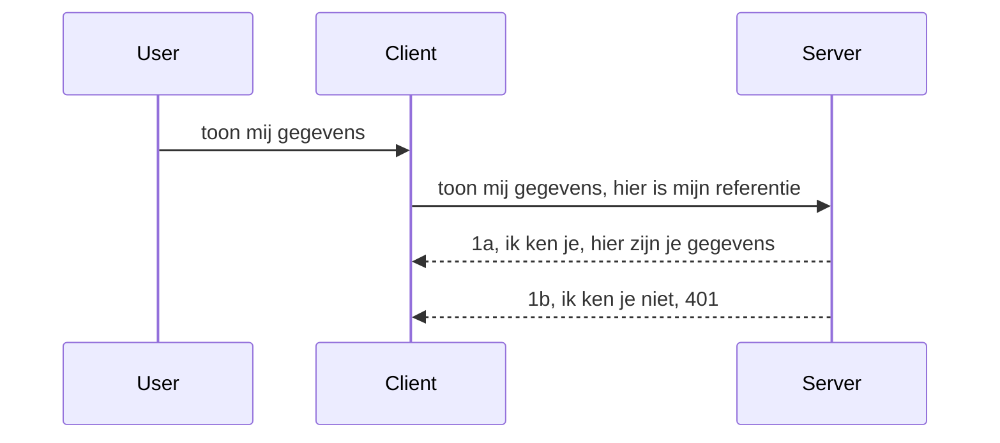

# Simple auth

MCP SDK's ondersteunen het gebruik van OAuth 2.1 wat eerlijk gezegd een behoorlijk complex proces is waarbij concepten zoals auth-server, resource-server, het posten van referenties, het verkrijgen van een code, het omwisselen van de code voor een bearer token tot je uiteindelijk je resource data kunt krijgen. Als je niet gewend bent aan OAuth, wat een geweldige techniek is om te implementeren, is het een goed idee om te beginnen met een basaal niveau van authenticatie en op te bouwen naar betere en betere beveiliging. Daarom bestaat dit hoofdstuk, om je op te bouwen naar geavanceerdere authenticatie.

## Auth, wat bedoelen we?

Auth is een afkorting voor authenticatie en autorisatie. Het idee is dat we twee dingen moeten doen:

- **Authenticatie**, wat het proces is van uitzoeken of we een persoon binnenlaten in ons huis, dat ze het recht hebben om "hier" te zijn, dat wil zeggen toegang hebben tot onze resource-server waar onze MCP Server functionaliteiten zich bevinden.
- **Autorisatie**, is het proces om te bepalen of een gebruiker toegang mag hebben tot deze specifieke resources waar ze om vragen, bijvoorbeeld die bestellingen of die producten of of ze bijvoorbeeld wel de inhoud mogen lezen maar niet verwijderen als ander voorbeeld.

## Referenties: hoe we het systeem vertellen wie we zijn

Nou, de meeste webontwikkelaars beginnen te denken in termen van het verstrekken van een referentie aan de server, meestal een geheim dat zegt of ze hier mogen zijn "Authenticatie". Deze referentie is meestal een base64-gecodeerde versie van gebruikersnaam en wachtwoord of een API-sleutel die een specifieke gebruiker uniek identificeert.

Dit houdt in dat het via een header wordt gestuurd die "Authorization" heet, zoals volgt:

```json
{ "Authorization": "secret123" }
```

Dit wordt meestal basic authentication genoemd. Hoe de totale flow dan werkt is als volgt:


Nu we begrijpen hoe het werkt vanuit een flow-oogpunt, hoe implementeren we het? Nou, de meeste webservers hebben een concept middleware, een stukje code dat draait als onderdeel van de aanvraag die referenties kan verifiëren, en als de referenties geldig zijn kan de aanvraag doorgelaten worden. Als de aanvraag geen geldige referenties heeft krijg je een auth-fout. Laten we eens kijken hoe dit geïmplementeerd kan worden:

**Python**

```python
class AuthMiddleware(BaseHTTPMiddleware):
    async def dispatch(self, request, call_next):

        has_header = request.headers.get("Authorization")
        if not has_header:
            print("-> Missing Authorization header!")
            return Response(status_code=401, content="Unauthorized")

        if not valid_token(has_header):
            print("-> Invalid token!")
            return Response(status_code=403, content="Forbidden")

        print("Valid token, proceeding...")
       
        response = await call_next(request)
        # voeg eventuele klantheaders toe of wijzig de response op een bepaalde manier
        return response


starlette_app.add_middleware(CustomHeaderMiddleware)
```

Hier hebben we:

- Een middleware gemaakt genaamd `AuthMiddleware` waarbij de `dispatch` methode wordt aangeroepen door de webserver.
- De middleware toegevoegd aan de webserver:

    ```python
    starlette_app.add_middleware(AuthMiddleware)
    ```

- Validatielogica geschreven die controleert of de Authorization header aanwezig is en of het verzonden geheim geldig is:

    ```python
    has_header = request.headers.get("Authorization")
    if not has_header:
        print("-> Missing Authorization header!")
        return Response(status_code=401, content="Unauthorized")

    if not valid_token(has_header):
        print("-> Invalid token!")
        return Response(status_code=403, content="Forbidden")
    ```

    als het geheim aanwezig en geldig is, laten we de aanvraag doorgaan door `call_next` aan te roepen en de response terug te geven.

    ```python
    response = await call_next(request)
    # voeg eventuele klantkoppen toe of wijzig de respons op een bepaalde manier
    return response
    ```

Hoe het werkt is dat als een webaanvraag wordt gedaan naar de server de middleware wordt aangeroepen en gegeven zijn implementatie zal het ofwel de aanvraag doorlaten of een fout retourneren die aangeeft dat de client niet mag doorgaan.

**TypeScript**

Hier maken we een middleware met het populaire framework Express en onderscheppen we de aanvraag voordat deze de MCP Server bereikt. Hier is de code voor:

```typescript
function isValid(secret) {
    return secret === "secret123";
}

app.use((req, res, next) => {
    // 1. Autorisatieheader aanwezig?
    if(!req.headers["Authorization"]) {
        res.status(401).send('Unauthorized');
    }
    
    let token = req.headers["Authorization"];

    // 2. Controleer geldigheid.
    if(!isValid(token)) {
        res.status(403).send('Forbidden');
    }

   
    console.log('Middleware executed');
    // 3. Geeft het verzoek door aan de volgende stap in de verzoekverwerkingsketen.
    next();
});
```

In deze code:

1. Controleren we of de Authorization header überhaupt aanwezig is, zo niet, sturen we een 401 fout.
2. Zorgen we dat de referentie/token geldig is, zo niet, sturen we een 403 fout.
3. Tenslotte geven we de aanvraag door in de request pipeline en retourneren de opgevraagde resource.

## Oefening: Implementeer authenticatie

Laten we onze kennis gebruiken en proberen het te implementeren. Dit is het plan:

Server

- Maak een webserver en MCP instantie aan.
- Implementeer een middleware voor de server.

Client

- Stuur een webaanvraag, met referentie, via header.

### -1- Maak een webserver en MCP instantie

In de eerste stap maken we de webserver instantie en de MCP Server.

**Python**

Hier maken we een MCP server instantie, creëren een starlette web app en hosten die met uvicorn.

```python
# MCP-server aan het maken

app = FastMCP(
    name="MCP Resource Server",
    instructions="Resource Server that validates tokens via Authorization Server introspection",
    host=settings["host"],
    port=settings["port"],
    debug=True
)

# starlette webapp aan het maken
starlette_app = app.streamable_http_app()

# app serveren via uvicorn
async def run(starlette_app):
    import uvicorn
    config = uvicorn.Config(
            starlette_app,
            host=app.settings.host,
            port=app.settings.port,
            log_level=app.settings.log_level.lower(),
        )
    server = uvicorn.Server(config)
    await server.serve()

run(starlette_app)
```

In deze code:

- Maken we de MCP Server aan.
- Construeren we de starlette web app van de MCP Server, `app.streamable_http_app()`.
- Hosten en serveren we de web app met uvicorn `server.serve()`.

**TypeScript**

Hier maken we een MCP Server instantie.

```typescript
const server = new McpServer({
      name: "example-server",
      version: "1.0.0"
    });

    // ... stel serverbronnen, hulpmiddelen en prompts in ...
```

De creatie van deze MCP Server moet plaatsvinden binnen onze POST /mcp route definitie, dus laten we bovenstaande code verplaatsen zoals volgt:

```typescript
import express from "express";
import { randomUUID } from "node:crypto";
import { McpServer } from "@modelcontextprotocol/sdk/server/mcp.js";
import { StreamableHTTPServerTransport } from "@modelcontextprotocol/sdk/server/streamableHttp.js";
import { isInitializeRequest } from "@modelcontextprotocol/sdk/types.js"

const app = express();
app.use(express.json());

// Kaart om transporten op te slaan per sessie-ID
const transports: { [sessionId: string]: StreamableHTTPServerTransport } = {};

// Verwerk POST-verzoeken voor communicatie van client naar server
app.post('/mcp', async (req, res) => {
  // Controleer op bestaande sessie-ID
  const sessionId = req.headers['mcp-session-id'] as string | undefined;
  let transport: StreamableHTTPServerTransport;

  if (sessionId && transports[sessionId]) {
    // Hergebruik bestaand transport
    transport = transports[sessionId];
  } else if (!sessionId && isInitializeRequest(req.body)) {
    // Nieuwe initialisatie aanvraag
    transport = new StreamableHTTPServerTransport({
      sessionIdGenerator: () => randomUUID(),
      onsessioninitialized: (sessionId) => {
        // Sla het transport op per sessie-ID
        transports[sessionId] = transport;
      },
      // DNS-rebindingbescherming is standaard uitgeschakeld voor achterwaartse compatibiliteit. Als je deze server
      // lokaal uitvoert, zorg er dan voor dat je het volgende instelt:
      // enableDnsRebindingProtection: true,
      // allowedHosts: ['127.0.0.1'],
    });

    // Ruim transport op wanneer gesloten
    transport.onclose = () => {
      if (transport.sessionId) {
        delete transports[transport.sessionId];
      }
    };
    const server = new McpServer({
      name: "example-server",
      version: "1.0.0"
    });

    // ... stel serverbronnen, tools en prompts in ...

    // Maak verbinding met de MCP-server
    await server.connect(transport);
  } else {
    // Ongeldig verzoek
    res.status(400).json({
      jsonrpc: '2.0',
      error: {
        code: -32000,
        message: 'Bad Request: No valid session ID provided',
      },
      id: null,
    });
    return;
  }

  // Verwerk het verzoek
  await transport.handleRequest(req, res, req.body);
});

// Herbruikbare handler voor GET- en DELETE-verzoeken
const handleSessionRequest = async (req: express.Request, res: express.Response) => {
  const sessionId = req.headers['mcp-session-id'] as string | undefined;
  if (!sessionId || !transports[sessionId]) {
    res.status(400).send('Invalid or missing session ID');
    return;
  }
  
  const transport = transports[sessionId];
  await transport.handleRequest(req, res);
};

// Verwerk GET-verzoeken voor server-naar-client notificaties via SSE
app.get('/mcp', handleSessionRequest);

// Verwerk DELETE-verzoeken voor het beëindigen van sessies
app.delete('/mcp', handleSessionRequest);

app.listen(3000);
```

Nu zie je hoe de MCP Server creatie binnen `app.post("/mcp")` is verplaatst.

Laten we doorgaan naar de volgende stap: het maken van de middleware zodat we de binnenkomende referentie kunnen valideren.

### -2- Implementeer een middleware voor de server

Laten we naar het middleware gedeelte gaan. Hier maken we een middleware die zoekt naar een referentie in de `Authorization` header en deze valideert. Als die acceptabel is gaat de aanvraag verder om te doen wat nodig is (bijv. tools tonen, een resource lezen of welke MCP functionaliteit de client ook vroeg).

**Python**

Om de middleware te maken moeten we een klasse creëren die erft van `BaseHTTPMiddleware`. Er zijn twee interessante elementen:

- De aanvraag `request`, waar we de header info van lezen.
- `call_next` de callback die we moeten aanroepen als de client een referentie heeft meegebracht die we accepteren.

Eerst moeten we de situatie afhandelen als de `Authorization` header ontbreekt:

```python
has_header = request.headers.get("Authorization")

# geen header aanwezig, faal met 401, anders doorgaan.
if not has_header:
    print("-> Missing Authorization header!")
    return Response(status_code=401, content="Unauthorized")
```

Hier sturen we een 401 unauthorized bericht omdat de client faalt bij authenticatie.

Vervolgens, als een referentie is meegegeven, moeten we de geldigheid controleren zoals volgt:

```python
 if not valid_token(has_header):
    print("-> Invalid token!")
    return Response(status_code=403, content="Forbidden")
```

Merk op dat we hier een 403 forbidden bericht sturen. Laten we de volledige middleware zien waarin alles van hierboven is geïmplementeerd:

```python
class AuthMiddleware(BaseHTTPMiddleware):
    async def dispatch(self, request, call_next):

        has_header = request.headers.get("Authorization")
        if not has_header:
            print("-> Missing Authorization header!")
            return Response(status_code=401, content="Unauthorized")

        if not valid_token(has_header):
            print("-> Invalid token!")
            return Response(status_code=403, content="Forbidden")

        print("Valid token, proceeding...")
        print(f"-> Received {request.method} {request.url}")
        response = await call_next(request)
        response.headers['Custom'] = 'Example'
        return response

```

Prima, maar hoe zit het met de `valid_token` functie? Die is hier beneden:
:

```python
# NIET gebruiken voor productie - verbeter het !!
def valid_token(token: str) -> bool:
    # verwijder het "Bearer " voorvoegsel
    if token.startswith("Bearer "):
        token = token[7:]
        return token == "secret-token"
    return False
```

Dit kan uiteraard verbeterd worden.

BELANGRIJK: Je zou NOOIT geheimen zoals deze in de code moeten hebben. Idealiter haal je de waarde om mee te vergelijken uit een databron of van een IDP (identity service provider) of nog beter, laat de IDP de validatie doen.

**TypeScript**

Om dit met Express te implementeren moeten we de `use` methode aanroepen die middleware funkties accepteert.

We moeten:

- Interageren met de request variabele om de meegegeven referentie in de `Authorization` property te controleren.
- De referentie valideren en als die geldig is de aanvraag laten doorlopen en de MCP aanvraag van de client laten doen wat het hoort (bijv. tools tonen, resource lezen of andere MCP gerelateerde zaken).

Hier controleren we of de `Authorization` header aanwezig is en zo niet stoppen we de aanvraag:

```typescript
if(!req.headers["authorization"]) {
    res.status(401).send('Unauthorized');
    return;
}
```

Als de header helemaal niet wordt meegegeven, krijg je een 401.

Dan controleren we of de referentie geldig is, zo niet stoppen we de aanvraag opnieuw met een iets andere foutmelding:

```typescript
if(!isValid(token)) {
    res.status(403).send('Forbidden');
    return;
} 
```

Merk op dat je nu een 403 fout krijgt.

Hier is de volledige code:

```typescript
app.use((req, res, next) => {
    console.log('Request received:', req.method, req.url, req.headers);
    console.log('Headers:', req.headers["authorization"]);
    if(!req.headers["authorization"]) {
        res.status(401).send('Unauthorized');
        return;
    }
    
    let token = req.headers["authorization"];

    if(!isValid(token)) {
        res.status(403).send('Forbidden');
        return;
    }  

    console.log('Middleware executed');
    next();
});
```

We hebben de webserver zo opgezet dat die middleware accepteert om de referentie te controleren die de client hopelijk meestuurt. Maar hoe zit het met de client zelf?

### -3- Stuur webaanvraag met referentie via header

We moeten ervoor zorgen dat de client de referentie via de header meestuurt. Omdat we een MCP client gaan gebruiken moeten we uitvinden hoe dat gedaan wordt.

**Python**

Voor de client moeten we een header meesturen met onze referentie, zo:

```python
# HARDICODEER DE WAARDE NIET, sla deze minimaal op in een omgevingsvariabele of een veiliger opslagmedium
token = "secret-token"

async with streamablehttp_client(
        url = f"http://localhost:{port}/mcp",
        headers = {"Authorization": f"Bearer {token}"}
    ) as (
        read_stream,
        write_stream,
        session_callback,
    ):
        async with ClientSession(
            read_stream,
            write_stream
        ) as session:
            await session.initialize()
      
            # TODO, wat je gedaan wilt hebben in de client, bijv. lijst met tools, tools aanroepen etc.
```

Merk op dat we de `headers` property zo vullen ` headers = {"Authorization": f"Bearer {token}"}`.

**TypeScript**

We kunnen dit in twee stappen oplossen:

1. Vul een configuratie-object met onze referentie.
2. Geef het configuratie-object mee aan de transport.

```typescript

// SCHRIJF de waarde niet hardcoded zoals hier getoond. Heb het minimaal als een omgevingsvariabele en gebruik iets als dotenv (in ontwikkelmodus).
let token = "secret123"

// definieer een client transportoptie-object
let options: StreamableHTTPClientTransportOptions = {
  sessionId: sessionId,
  requestInit: {
    headers: {
      "Authorization": "secret123"
    }
  }
};

// geef het opties-object door aan de transport
async function main() {
   const transport = new StreamableHTTPClientTransport(
      new URL(serverUrl),
      options
   );
```

Hier zie je hierboven hoe we een `options` object moesten maken en onze headers in de `requestInit` property plaatsen.

BELANGRIJK: Hoe verbeteren we dit? De huidige implementatie heeft wat problemen. Ten eerste is het doorgeven van een referentie zo riskant tenzij je minimaal HTTPS hebt. Zelfs dan kan de referentie gestolen worden, dus je hebt een systeem nodig waarin je makkelijk het token kan intrekken en extra controles kunt toevoegen zoals waar in de wereld het vandaan komt, gebeurt de request té vaak (bot-achtig gedrag), kortom, er zijn veel zorgen.

Er moet wel gezegd worden dat voor hele simpele API's waar je niet wilt dat zomaar iedereen je API aanroept zonder geauthenticeerd te zijn, is wat we hier hebben een goede start.

Dat gezegd hebbende, laten we proberen de beveiliging wat te versterken door een gestandaardiseerd formaat te gebruiken zoals JSON Web Token, ook wel JWT of "JOT" tokens genoemd.

## JSON Web Tokens, JWT

Dus, we proberen de dingen te verbeteren ten opzichte van zeer eenvoudige referenties. Wat zijn de directe verbeteringen wanneer we JWT adopteren?

- **Beveiligingsverbeteringen**. Bij basic auth stuur je de gebruikersnaam en wachtwoord als base64-gecodeerde token (of stuur je een API key) steeds opnieuw wat het risico verhoogt. Met JWT stuur je je username en password en krijg je een token terug die ook tijdgebonden is en verloopt. JWT laat je gemakkelijk fijnmazige toegangscontrole toepassen via rollen, scopes en permissies.
- **Stateloosheid en schaalbaarheid**. JWT's zijn self-contained, ze bevatten alle gebruikersinfo en elimineren de noodzaak van server-side sessie-opslag. Tokens kunnen ook lokaal gevalideerd worden.
- **Interoperabiliteit en federatie**. JWT's zijn centraal in Open ID Connect en worden gebruikt bij bekende identity providers zoals Entra ID, Google Identity en Auth0. Ze maken ook single sign-on en meer mogelijk waardoor het bedrijfsniveau wordt.
- **Modulariteit en flexibiliteit**. JWT's kunnen ook gebruikt worden met API Gateways zoals Azure API Management, NGINX en meer. Het ondersteunt ook authenticatiescenario's en server-to-service communicatie inclusief imitatie en delegatie scenario's.
- **Prestaties en caching**. JWT's kunnen worden gecachet na decodering waardoor de behoefte aan parsing wordt verminderd. Dit helpt vooral bij apps met veel verkeer omdat het de doorvoer verhoogt en de belasting op je infrastructuur verlaagt.
- **Geavanceerde functies**. Het ondersteunt ook introspectie (validiteitscontrole op server) en intrekking (het ongeldig maken van een token).

Met al deze voordelen, laten we zien hoe we onze implementatie naar een hoger niveau kunnen tillen.

## Basic auth omzetten naar JWT

De wijzigingen die we op hoog niveau moeten doen zijn:

- **Leren een JWT token te construeren** en het klaar te maken om van client naar server te worden gestuurd.
- **Valideren van een JWT token** en als die geldig is, de client toegang geven tot onze resources.
- **Veilige tokenopslag**. Hoe we deze token opslaan.
- **Beschermen van routes**. We moeten routes beschermen, in ons geval specifieke routes en MCP functionaliteiten.
- **Toevoegen van refresh tokens**. Zorg dat tokens kortstondig zijn maar dat er refresh tokens zijn die lang geldig zijn, waarmee nieuwe tokens verkregen kunnen worden bij verlopen. Zorg ook voor een refresh endpoint en een rotatiestrategie.

### -1- Constructie van een JWT token

Allereerst heeft een JWT token de volgende onderdelen:

- **header**, welke algoritme en token-type.
- **payload**, claims, zoals sub (de gebruiker of entiteit die de token vertegenwoordigt, in een auth scenario meestal het gebruikers-id), exp (wanneer het verloopt) en rol (de rol).
- **signature**, ondertekend met een geheim of privésleutel.

Hiervoor moeten we de header, payload en het gecodeerde token opbouwen.

**Python**

```python

import jwt
import jwt
from jwt.exceptions import ExpiredSignatureError, InvalidTokenError
import datetime

# Geheime sleutel gebruikt om de JWT te tekenen
secret_key = 'your-secret-key'

header = {
    "alg": "HS256",
    "typ": "JWT"
}

# de gebruikersinformatie en zijn claims en vervaltijd
payload = {
    "sub": "1234567890",               # Onderwerp (gebruikers-ID)
    "name": "User Userson",                # Aangepaste claim
    "admin": True,                     # Aangepaste claim
    "iat": datetime.datetime.utcnow(),# Uitgegeven op
    "exp": datetime.datetime.utcnow() + datetime.timedelta(hours=1)  # Verloopt
}

# codeer het
encoded_jwt = jwt.encode(payload, secret_key, algorithm="HS256", headers=header)
```

In bovenstaande code hebben we:

- Een header gedefinieerd met HS256 als algoritme en type JWT.
- Een payload geconstrueerd met een subject of gebruikersid, een gebruikersnaam, een rol, wanneer het is uitgegeven en wanneer het verloopt, waarmee de eerder genoemde tijdgebonden aspect wordt geïmplementeerd.

**TypeScript**

Hier hebben we wat dependencies nodig die ons helpen het JWT token te bouwen.

Dependencies

```sh

npm install jsonwebtoken
npm install --save-dev @types/jsonwebtoken
```

Nu dat we dat hebben, laten we de header en payload maken en daarmee het gecodeerde token creëren.

```typescript
import jwt from 'jsonwebtoken';

const secretKey = 'your-secret-key'; // Gebruik omgevingsvariabelen in productie

// Definieer de payload
const payload = {
  sub: '1234567890',
  name: 'User usersson',
  admin: true,
  iat: Math.floor(Date.now() / 1000), // Uitgegeven op
  exp: Math.floor(Date.now() / 1000) + 60 * 60 // Verloopt over 1 uur
};

// Definieer de header (optioneel, jsonwebtoken stelt standaardwaarden in)
const header = {
  alg: 'HS256',
  typ: 'JWT'
};

// Maak het token aan
const token = jwt.sign(payload, secretKey, {
  algorithm: 'HS256',
  header: header
});

console.log('JWT:', token);
```

Deze token is:

Ondertekend met HS256
Geldig voor 1 uur
Bevat claims zoals sub, name, admin, iat, en exp.

### -2- Valideer een token

We zullen ook een token moeten valideren, dit moeten we op de server doen om zeker te zijn dat wat de client stuurt geldig is. Er zijn veel controles die we moeten uitvoeren; van het valideren van de structuur tot de geldigheid. Je wordt ook aangemoedigd extra checks toe te voegen om te zien of de gebruiker in jouw systeem staat en meer.

Om een token te valideren moeten we het decoderen zodat we het kunnen lezen en dan de validiteit gaan controleren:

**Python**

```python

# Decodeer en verifieer de JWT
try:
    decoded = jwt.decode(token, secret_key, algorithms=["HS256"])
    print("✅ Token is valid.")
    print("Decoded claims:")
    for key, value in decoded.items():
        print(f"  {key}: {value}")
except ExpiredSignatureError:
    print("❌ Token has expired.")
except InvalidTokenError as e:
    print(f"❌ Invalid token: {e}")

```

In deze code roepen we `jwt.decode` aan met de token, het geheime sleutel en het gekozen algoritme als input. Merk op dat we een try-catch constructie gebruiken omdat een mislukte validatie een error veroorzaakt.

**TypeScript**

Hier moeten we `jwt.verify` aanroepen om een gedeode token te krijgen die we verder kunnen analyseren. Als deze call faalt betekent het dat de structuur van de token onjuist is of dat het niet meer geldig is.

```typescript

try {
  const decoded = jwt.verify(token, secretKey);
  console.log('Decoded Payload:', decoded);
} catch (err) {
  console.error('Token verification failed:', err);
}
```

NOTITIE: zoals eerder genoemd, zouden we aanvullende controles moeten uitvoeren om er zeker van te zijn dat deze token een gebruiker in ons systeem aanduidt en dat de gebruiker beschikt over de juiste rechten die het claimt te hebben.
Laten we nu kijken naar op rollen gebaseerde toegangscontrole, ook wel bekend als RBAC.

## Toevoegen van op rollen gebaseerde toegangscontrole

Het idee is dat we willen aangeven dat verschillende rollen verschillende machtigingen hebben. Bijvoorbeeld, we gaan ervan uit dat een admin alles kan doen en dat een gewone gebruiker lees-/schrijfrechten heeft en dat een gast alleen kan lezen. Daarom zijn hier enkele mogelijke machtigingsniveaus:

- Admin.Write 
- User.Read
- Guest.Read

Laten we bekijken hoe we zo'n controle kunnen implementeren met middleware. Middleware kan per route worden toegevoegd, evenals voor alle routes.

**Python**

```python
from starlette.middleware.base import BaseHTTPMiddleware
from starlette.responses import JSONResponse
import jwt

# HEB HET GEHEIM NIET IN DE CODE zoals deze, dit is alleen voor demonstratiedoeleinden. Lees het van een veilige plaats.
SECRET_KEY = "your-secret-key" # zet dit in een omgevingsvariabele
REQUIRED_PERMISSION = "User.Read"

class JWTPermissionMiddleware(BaseHTTPMiddleware):
    async def dispatch(self, request, call_next):
        auth_header = request.headers.get("Authorization")
        if not auth_header or not auth_header.startswith("Bearer "):
            return JSONResponse({"error": "Missing or invalid Authorization header"}, status_code=401)

        token = auth_header.split(" ")[1]
        try:
            decoded = jwt.decode(token, SECRET_KEY, algorithms=["HS256"])
        except jwt.ExpiredSignatureError:
            return JSONResponse({"error": "Token expired"}, status_code=401)
        except jwt.InvalidTokenError:
            return JSONResponse({"error": "Invalid token"}, status_code=401)

        permissions = decoded.get("permissions", [])
        if REQUIRED_PERMISSION not in permissions:
            return JSONResponse({"error": "Permission denied"}, status_code=403)

        request.state.user = decoded
        return await call_next(request)


```

Er zijn een paar verschillende manieren om de middleware toe te voegen zoals hieronder:

```python

# Alt 1: middleware toevoegen bij het construeren van de starlette app
middleware = [
    Middleware(JWTPermissionMiddleware)
]

app = Starlette(routes=routes, middleware=middleware)

# Alt 2: middleware toevoegen nadat de starlette app al geconstrueerd is
starlette_app.add_middleware(JWTPermissionMiddleware)

# Alt 3: middleware toevoegen per route
routes = [
    Route(
        "/mcp",
        endpoint=..., # handler
        middleware=[Middleware(JWTPermissionMiddleware)]
    )
]
```

**TypeScript**

We kunnen `app.use` gebruiken en een middleware die voor alle verzoeken wordt uitgevoerd.

```typescript
app.use((req, res, next) => {
    console.log('Request received:', req.method, req.url, req.headers);
    console.log('Headers:', req.headers["authorization"]);

    // 1. Controleer of de autorisatieheader is verzonden

    if(!req.headers["authorization"]) {
        res.status(401).send('Unauthorized');
        return;
    }
    
    let token = req.headers["authorization"];

    // 2. Controleer of het token geldig is
    if(!isValid(token)) {
        res.status(403).send('Forbidden');
        return;
    }  

    // 3. Controleer of de token gebruiker in ons systeem bestaat
    if(!isExistingUser(token)) {
        res.status(403).send('Forbidden');
        console.log("User does not exist");
        return;
    }
    console.log("User exists");

    // 4. Verifieer of het token de juiste permissies heeft
    if(!hasScopes(token, ["User.Read"])){
        res.status(403).send('Forbidden - insufficient scopes');
    }

    console.log("User has required scopes");

    console.log('Middleware executed');
    next();
});

```

Er zijn nogal wat dingen die we onze middleware kunnen laten doen en die onze middleware MOET doen, namelijk:

1. Controleren of de autorisatieheader aanwezig is
2. Controleren of het token geldig is, we roepen `isValid` aan, wat een methode is die we hebben geschreven die de integriteit en geldigheid van een JWT-token controleert.
3. Verifiëren dat de gebruiker bestaat in ons systeem, dit moeten we controleren.

   ```typescript
    // gebruikers in DB
   const users = [
     "user1",
     "User usersson",
   ]

   function isExistingUser(token) {
     let decodedToken = verifyToken(token);

     // TODO, controleer of gebruiker bestaat in DB
     return users.includes(decodedToken?.name || "");
   }
   ```

   Bovenstaand hebben we een zeer eenvoudige lijst `users` gemaakt, die uiteraard in een database zou moeten staan.

4. Daarnaast moeten we ook controleren of het token de juiste machtigingen heeft.

   ```typescript
   if(!hasScopes(token, ["User.Read"])){
        res.status(403).send('Forbidden - insufficient scopes');
   }
   ```

   In deze code hierboven van de middleware, controleren we dat het token de machtiging User.Read bevat, zo niet sturen we een 403-fout. Hieronder de helpermethode `hasScopes`.

   ```typescript
   function hasScopes(scope: string, requiredScopes: string[]) {
     let decodedToken = verifyToken(scope);
    return requiredScopes.every(scope => decodedToken?.scopes.includes(scope));
  }
   ```

Have a think which additional checks you should be doing, but these are the absolute minimum of checks you should be doing.

Using Express as a web framework is a common choice. There are helpers library when you use JWT so you can write less code.

- `express-jwt`, helper library that provides a middleware that helps decode your token.
- `express-jwt-permissions`, this provides a middleware `guard` that helps check if a certain permission is on the token.

Here's what these libraries can look like when used:

```typescript
const express = require('express');
const jwt = require('express-jwt');
const guard = require('express-jwt-permissions')();

const app = express();
const secretKey = 'your-secret-key'; // put this in env variable

// Decode JWT and attach to req.user
app.use(jwt({ secret: secretKey, algorithms: ['HS256'] }));

// Check for User.Read permission
app.use(guard.check('User.Read'));

// multiple permissions
// app.use(guard.check(['User.Read', 'Admin.Access']));

app.get('/protected', (req, res) => {
  res.json({ message: `Welcome ${req.user.name}` });
});

// Error handler
app.use((err, req, res, next) => {
  if (err.code === 'permission_denied') {
    return res.status(403).send('Forbidden');
  }
  next(err);
});

```

Nu je hebt gezien hoe middleware zowel voor authenticatie als autorisatie kan worden gebruikt, hoe zit het met MCP? Verandert het hoe we authenticatie doen? Laten we dat ontdekken in de volgende sectie.

### -3- RBAC toevoegen aan MCP

Je hebt tot nu toe gezien hoe je RBAC via middleware kunt toevoegen, maar voor MCP is er geen gemakkelijke manier om RBAC per MCP-functie toe te voegen. Wat doen we dan? Nou, we moeten gewoon code toevoegen zoals deze die controleert of de client in dit geval het recht heeft om een specifieke tool aan te roepen:

Je hebt een paar verschillende keuzes hoe je per functie RBAC kunt realiseren, hier zijn er een paar:

- Voeg een controle toe voor elke tool, resource, prompt waar je het machtigingsniveau moet controleren.

   **python**

   ```python
   @tool()
   def delete_product(id: int):
      try:
          check_permissions(role="Admin.Write", request)
      catch:
        pass # client mislukte autorisatie, verhoog autorisatiefout
   ```

   **typescript**

   ```typescript
   server.registerTool(
    "delete-product",
    {
      title: Delete a product",
      description: "Deletes a product",
      inputSchema: { id: z.number() }
    },
    async ({ id }) => {
      
      try {
        checkPermissions("Admin.Write", request);
        // todo, stuur id naar productService en externe invoer
      } catch(Exception e) {
        console.log("Authorization error, you're not allowed");  
      }

      return {
        content: [{ type: "text", text: `Deletected product with id ${id}` }]
      };
    }
   );
   ```


- Gebruik een geavanceerde serveraanpak en de request handlers zodat je minimaliseert op hoeveel plaatsen je de controle moet uitvoeren.

   **Python**

   ```python
   
   tool_permission = {
      "create_product": ["User.Write", "Admin.Write"],
      "delete_product": ["Admin.Write"]
   }

   def has_permission(user_permissions, required_permissions) -> bool:
      # user_permissions: lijst met machtigingen die de gebruiker heeft
      # required_permissions: lijst met machtigingen die vereist zijn voor de tool
      return any(perm in user_permissions for perm in required_permissions)

   @server.call_tool()
   async def handle_call_tool(
     name: str, arguments: dict[str, str] | None
   ) -> list[types.TextContent]:
    # Ga ervan uit dat request.user.permissions een lijst met machtigingen voor de gebruiker is
     user_permissions = request.user.permissions
     required_permissions = tool_permission.get(name, [])
     if not has_permission(user_permissions, required_permissions):
        # Fout opwerpen "Je hebt geen toestemming om tool {name} aan te roepen"
        raise Exception(f"You don't have permission to call tool {name}")
     # doorgaan en de tool aanroepen
     # ...
   ```   
   

   **TypeScript**

   ```typescript
   function hasPermission(userPermissions: string[], requiredPermissions: string[]): boolean {
       if (!Array.isArray(userPermissions) || !Array.isArray(requiredPermissions)) return false;
       // Geef waar terug als de gebruiker ten minste één vereiste toestemming heeft
       
       return requiredPermissions.some(perm => userPermissions.includes(perm));
   }
  
   server.setRequestHandler(CallToolRequestSchema, async (request) => {
      const { params: { name } } = request;
  
      let permissions = request.user.permissions;
  
      if (!hasPermission(permissions, toolPermissions[name])) {
         return new Error(`You don't have permission to call ${name}`);
      }
  
      // ga door..
   });
   ```

   Let op, je moet ervoor zorgen dat je middleware een gedecodeerd token aan de user-eigenschap van het verzoek toekent, zodat de code hierboven eenvoudig is.

### Samenvatting

Nu we hebben besproken hoe je ondersteuning voor RBAC in het algemeen en voor MCP in het bijzonder kunt toevoegen, is het tijd om zelf beveiliging te proberen implementeren om ervoor te zorgen dat je de gepresenteerde concepten begrijpt.

## Opdracht 1: Bouw een mcp server en mcp client met basis authenticatie

Hier ga je toepassen wat je hebt geleerd over het versturen van inloggegevens via headers.

## Oplossing 1

[Oplossing 1](./code/basic/README.md)

## Opdracht 2: Upgrade de oplossing van Opdracht 1 naar JWT

Neem de eerste oplossing, maar dit keer verbeteren we die.

In plaats van Basic Auth, gebruiken we JWT.

## Oplossing 2

[Oplossing 2](./solution/jwt-solution/README.md)

## Uitdaging

Voeg per tool de RBAC toe die we beschrijven in de sectie "Add RBAC to MCP".

## Samenvatting

Je hebt hopelijk veel geleerd in dit hoofdstuk, van geen beveiliging, tot basisbeveiliging, tot JWT en hoe dit kan worden toegevoegd aan MCP.

We hebben een solide basis gelegd met aangepaste JWT's, maar naarmate we opschalen, bewegen we naar een op standaarden gebaseerd identiteitsmodel. Het adopteren van een IdP zoals Entra of Keycloak stelt ons in staat om tokenuitgifte, validatie en levenscyclusbeheer uit te besteden aan een vertrouwd platform — waardoor we ons kunnen richten op applicatielogica en gebruikerservaring.

Hiervoor hebben we een meer [gevorderd hoofdstuk over Entra](../../05-AdvancedTopics/mcp-security-entra/README.md)

## Wat is de volgende stap

- Volgende: [MCP Hosts instellen](../12-mcp-hosts/README.md)

---

<!-- CO-OP TRANSLATOR DISCLAIMER START -->
**Disclaimer**:  
Dit document is vertaald met behulp van de AI-vertalingsdienst [Co-op Translator](https://github.com/Azure/co-op-translator). Hoewel wij streven naar nauwkeurigheid, dient u er rekening mee te houden dat automatische vertalingen fouten of onnauwkeurigheden kunnen bevatten. Het oorspronkelijke document in de eigen taal moet als de gezaghebbende bron worden beschouwd. Voor cruciale informatie wordt professioneel menselijke vertaling aanbevolen. Wij zijn niet aansprakelijk voor eventuele misverstanden of verkeerde interpretaties die voortvloeien uit het gebruik van deze vertaling.
<!-- CO-OP TRANSLATOR DISCLAIMER END -->