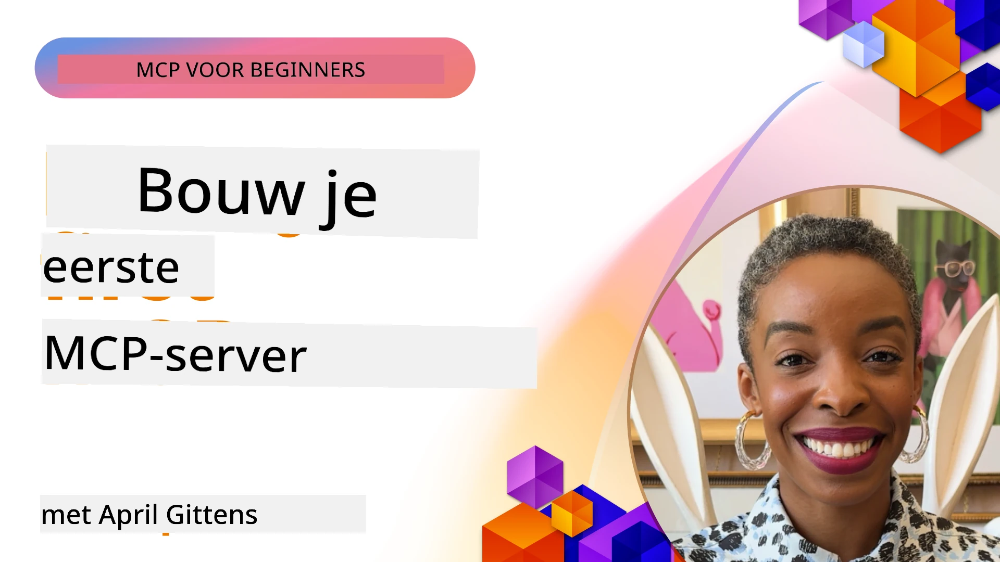

## Aan de Slag  

_(Klik op de afbeelding hierboven om de video van deze les te bekijken)_

Deze sectie bestaat uit meerdere lessen:

- **1 Je eerste server**, in deze eerste les leer je hoe je je eerste server maakt en inspecteert met de inspector tool, een waardevolle manier om je server te testen en te debuggen, [naar de les](01-first-server/README.md)

- **2 Client**, in deze les leer je hoe je een client schrijft die verbinding kan maken met je server, [naar de les](02-client/README.md)

- **3 Client met LLM**, een nog betere manier om een client te schrijven is door er een LLM aan toe te voegen zodat deze met je server kan "onderhandelen" over wat te doen, [naar de les](03-llm-client/README.md)

- **4 Gebruik een server GitHub Copilot Agent modus in Visual Studio Code**. Hier kijken we naar het draaien van onze MCP Server vanuit Visual Studio Code, [naar de les](04-vscode/README.md)

- **5 stdio Transport Server** stdio transport is de aanbevolen standaard voor lokale MCP server-naar-client communicatie, die veilige subprocess-gebaseerde communicatie met ingebouwde procesisolatie biedt, [naar de les](05-stdio-server/README.md)

- **6 HTTP Streaming met MCP (Streamable HTTP)**. Leer over moderne HTTP streaming transport (de aanbevolen aanpak voor externe MCP-servers volgens [MCP Specificatie 2025-11-25](https://spec.modelcontextprotocol.io/specification/2025-11-25/basic/transports/#streamable-http)), voortgangsnotificaties, en hoe je schaalbare, real-time MCP-servers en clients kunt implementeren met Streamable HTTP. [naar de les](06-http-streaming/README.md)

- **7 Gebruik van AI Toolkit voor VSCode** om je MCP Clients en Servers te gebruiken en testen [naar de les](07-aitk/README.md)

- **8 Testen**. Hier richten we ons vooral op hoe we onze server en client op verschillende manieren kunnen testen, [naar de les](08-testing/README.md)

- **9 Deployment**. Dit hoofdstuk bekijkt verschillende manieren om je MCP-oplossingen te deployen, [naar de les](09-deployment/README.md)

- **10 Geavanceerd servergebruik**. Dit hoofdstuk behandelt geavanceerd servergebruik, [naar de les](./10-advanced/README.md)

- **11 Auth**. Dit hoofdstuk behandelt hoe je eenvoudige authenticatie toevoegt, van Basic Auth tot het gebruik van JWT en RBAC. Je wordt aangeraden hier te beginnen en vervolgens naar geavanceerde onderwerpen in hoofdstuk 5 te kijken en aanvullende beveiligingsverstevigingen te doen volgens aanbevelingen in hoofdstuk 2, [naar de les](./11-simple-auth/README.md)

- **12 MCP Hosts**. Configureer en gebruik populaire MCP host clients zoals Claude Desktop, Cursor, Cline en Windsurf. Leer over transporttypes en het oplossen van problemen, [naar de les](./12-mcp-hosts/README.md)

- **13 MCP Inspector**. Debug en test je MCP-servers interactief met behulp van de MCP Inspector tool. Leer over probleemoplossingshulpmiddelen, bronnen en protocolberichten, [naar de les](./13-mcp-inspector/README.md)

Het Model Context Protocol (MCP) is een open protocol dat standaardiseert hoe applicaties context aan LLM’s verstrekken. Zie MCP als een USB-C poort voor AI-applicaties – het biedt een gestandaardiseerde manier om AI-modellen met verschillende databronnen en tools te verbinden.

## Leerdoelen

Aan het einde van deze les ben je in staat om:

- Ontwikkelomgevingen op te zetten voor MCP in C#, Java, Python, TypeScript en JavaScript
- Basis MCP-servers te bouwen en te deployen met aangepaste functies (resources, prompts en tools)
- Hostapplicaties te maken die verbinding maken met MCP-servers
- MCP-implementaties te testen en te debuggen
- Veelvoorkomende installatieproblemen en hun oplossingen te begrijpen
- Je MCP-implementaties te verbinden met populaire LLM-diensten

## Je MCP-omgeving instellen

Voordat je begint met MCP is het belangrijk om je ontwikkelomgeving voor te bereiden en de basisworkflow te begrijpen. Deze sectie begeleidt je door de eerste installatiestappen om een soepele start met MCP te garanderen.

### Vereisten

Voordat je aan MCP-ontwikkeling begint, zorg ervoor dat je beschikt over:

- **Ontwikkelomgeving**: Voor je gekozen taal (C#, Java, Python, TypeScript of JavaScript)
- **IDE/Editor**: Visual Studio, Visual Studio Code, IntelliJ, Eclipse, PyCharm, of een moderne code-editor
- **Package Managers**: NuGet, Maven/Gradle, pip, of npm/yarn
- **API-sleutels**: Voor AI-diensten die je in je hostapplicaties gaat gebruiken

### Officiële SDK’s

In de komende hoofdstukken zie je oplossingen gebouwd met Python, TypeScript, Java en .NET. Hier zijn alle officieel ondersteunde SDK’s.

MCP biedt officiële SDK’s voor meerdere talen (in lijn met [MCP Specificatie 2025-11-25](https://spec.modelcontextprotocol.io/specification/2025-11-25/)):

- [C# SDK](https://github.com/modelcontextprotocol/csharp-sdk) - Onderhouden in samenwerking met Microsoft
- [Java SDK](https://github.com/modelcontextprotocol/java-sdk) - Onderhouden in samenwerking met Spring AI
- [TypeScript SDK](https://github.com/modelcontextprotocol/typescript-sdk) - De officiële TypeScript-implementatie
- [Python SDK](https://github.com/modelcontextprotocol/python-sdk) - De officiële Python-implementatie (FastMCP)
- [Kotlin SDK](https://github.com/modelcontextprotocol/kotlin-sdk) - De officiële Kotlin-implementatie
- [Swift SDK](https://github.com/modelcontextprotocol/swift-sdk) - Onderhouden in samenwerking met Loopwork AI
- [Rust SDK](https://github.com/modelcontextprotocol/rust-sdk) - De officiële Rust-implementatie
- [Go SDK](https://github.com/modelcontextprotocol/go-sdk) - De officiële Go-implementatie

## Belangrijke punten

- Het opzetten van een MCP-ontwikkelomgeving is eenvoudig met taalspecifieke SDK’s
- Het bouwen van MCP-servers omvat het maken en registreren van tools met duidelijke schema’s
- MCP-clients verbinden met servers en modellen om uitgebreide mogelijkheden te benutten
- Testen en debuggen zijn essentieel voor betrouwbare MCP-implementaties
- Deployopties variëren van lokale ontwikkeling tot cloudgebaseerde oplossingen

## Oefenen

We hebben een reeks voorbeelden die de oefeningen uit alle hoofdstukken in deze sectie aanvullen. Daarnaast heeft elk hoofdstuk ook eigen oefeningen en opdrachten.

- [Java Calculator](./samples/java/calculator/README.md)
- [.Net Calculator](../../../03-GettingStarted/samples/csharp)
- [JavaScript Calculator](./samples/javascript/README.md)
- [TypeScript Calculator](./samples/typescript/README.md)
- [Python Calculator](../../../03-GettingStarted/samples/python)

## Extra bronnen

- [Agents bouwen met Model Context Protocol op Azure](https://learn.microsoft.com/azure/developer/ai/intro-agents-mcp)
- [Remote MCP met Azure Container Apps (Node.js/TypeScript/JavaScript)](https://learn.microsoft.com/samples/azure-samples/mcp-container-ts/mcp-container-ts/)
- [.NET OpenAI MCP Agent](https://learn.microsoft.com/samples/azure-samples/openai-mcp-agent-dotnet/openai-mcp-agent-dotnet/)

## Wat is de volgende stap

Begin met de eerste les: [Je eerste MCP Server maken](01-first-server/README.md)

Als je dit module hebt afgerond, ga door naar: [Module 4: Praktische Implementatie](../04-PracticalImplementation/README.md)

---

<!-- CO-OP TRANSLATOR DISCLAIMER START -->
**Disclaimer**:
Dit document is vertaald met behulp van de AI-vertalingsdienst [Co-op Translator](https://github.com/Azure/co-op-translator). Hoewel we streven naar nauwkeurigheid, dient u er rekening mee te houden dat automatische vertalingen fouten of onnauwkeurigheden kunnen bevatten. Het originele document in de oorspronkelijke taal moet als de gezaghebbende bron worden beschouwd. Voor kritieke informatie wordt professionele menselijke vertaling aanbevolen. Wij zijn niet aansprakelijk voor eventuele misverstanden of verkeerd geïnterpreteerde informatie die voortvloeien uit het gebruik van deze vertaling.
<!-- CO-OP TRANSLATOR DISCLAIMER END -->