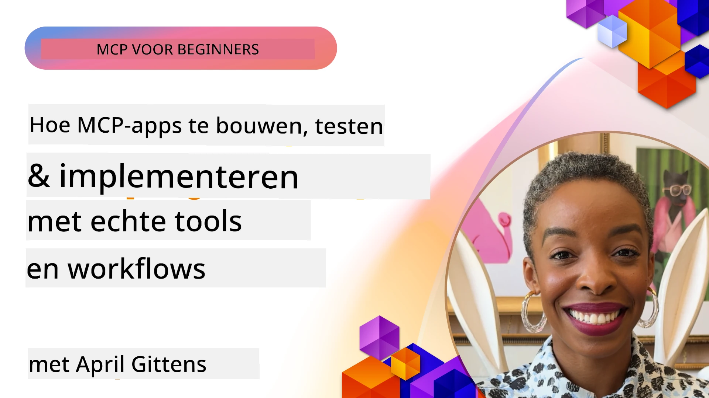
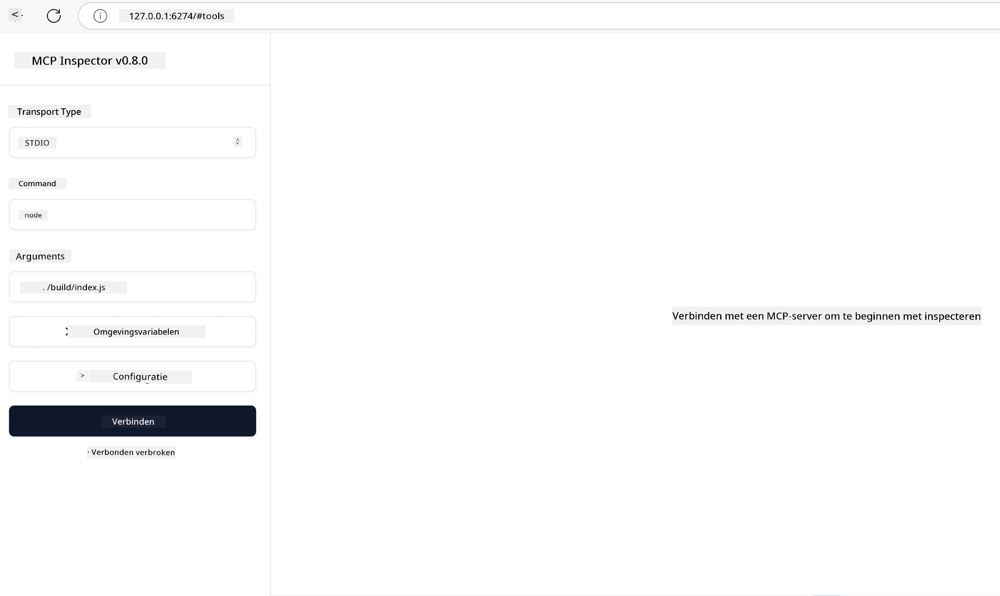

# Praktische Implementatie

[](https://youtu.be/vCN9-mKBDfQ)

_(Klik op de afbeelding hierboven om de video van deze les te bekijken)_

Praktische implementatie is waar de kracht van het Model Context Protocol (MCP) tastbaar wordt. Hoewel het belangrijk is om de theorie en architectuur achter MCP te begrijpen, komt de echte waarde naar voren wanneer je deze concepten toepast om oplossingen te bouwen, testen en implementeren die echte problemen in de praktijk oplossen. Dit hoofdstuk overbrugt de kloof tussen conceptuele kennis en praktische ontwikkeling, en begeleidt je door het proces van het tot leven brengen van MCP-gebaseerde applicaties.

Of je nu intelligente assistenten ontwikkelt, AI integreert in bedrijfsworkflows of aangepaste tools bouwt voor gegevensverwerking, MCP biedt een flexibele basis. Het taal-agnostische ontwerp en de officiële SDK's voor populaire programmeertalen maken het toegankelijk voor een breed scala aan ontwikkelaars. Door deze SDK's te gebruiken, kun je snel prototypes maken, itereren en je oplossingen opschalen over verschillende platforms en omgevingen.

In de volgende secties vind je praktische voorbeelden, voorbeeldcode en implementatiestrategieën die laten zien hoe je MCP implementeert in C#, Java met Spring, TypeScript, JavaScript en Python. Je leert ook hoe je MCP-servers debugt en test, API's beheert en oplossingen naar de cloud implementeert met Azure. Deze praktische bronnen zijn ontworpen om je leren te versnellen en je te helpen zelfverzekerd robuuste, productieklare MCP-applicaties te bouwen.

## Overzicht

Deze les richt zich op praktische aspecten van MCP-implementatie in meerdere programmeertalen. We verkennen hoe je MCP SDK's gebruikt in C#, Java met Spring, TypeScript, JavaScript en Python om robuuste applicaties te bouwen, MCP-servers te debuggen en testen, en herbruikbare bronnen, prompts en tools te creëren.

## Leerdoelen

Aan het einde van deze les kun je:

- MCP-oplossingen implementeren met officiële SDK's in verschillende programmeertalen
- MCP-servers systematisch debuggen en testen
- Serverfuncties creëren en gebruiken (Resources, Prompts en Tools)
- Effectieve MCP-workflows ontwerpen voor complexe taken
- MCP-implementaties optimaliseren voor prestaties en betrouwbaarheid

## Officiële SDK-bronnen

Het Model Context Protocol biedt officiële SDK's voor meerdere talen (in lijn met [MCP Specificatie 2025-11-25](https://spec.modelcontextprotocol.io/specification/2025-11-25/)):

- [C# SDK](https://github.com/modelcontextprotocol/csharp-sdk)
- [Java met Spring SDK](https://github.com/modelcontextprotocol/java-sdk) **Let op:** vereist afhankelijkheid van [Project Reactor](https://projectreactor.io). (Zie [discussie issue 246](https://github.com/orgs/modelcontextprotocol/discussions/246).)
- [TypeScript SDK](https://github.com/modelcontextprotocol/typescript-sdk)
- [Python SDK](https://github.com/modelcontextprotocol/python-sdk)
- [Kotlin SDK](https://github.com/modelcontextprotocol/kotlin-sdk)
- [Go SDK](https://github.com/modelcontextprotocol/go-sdk)

## Werken met MCP SDK's

Deze sectie biedt praktische voorbeelden van MCP-implementatie in meerdere programmeertalen. Je vindt voorbeeldcode in de `samples` directory, georganiseerd per taal.

### Beschikbare Voorbeelden

De repository bevat [voorbeeldimplementaties](../../../04-PracticalImplementation/samples) in de volgende talen:

- [C#](./samples/csharp/README.md)
- [Java met Spring](./samples/java/containerapp/README.md)
- [TypeScript](./samples/typescript/README.md)
- [JavaScript](./samples/javascript/README.md)
- [Python](./samples/python/README.md)

Elk voorbeeld demonstreert belangrijke MCP-concepten en implementatiepatronen voor die specifieke taal en ecosysteem.

### Praktische Handleidingen

Aanvullende handleidingen voor praktische MCP-implementatie:

- [Paginering en Grote Resultaatsets](./pagination/README.md) - Beheer cursor-gebaseerde paginering voor tools, resources en grote datasets

## Kernserverfuncties

MCP-servers kunnen elke combinatie van deze functies implementeren:

### Resources

Resources bieden context en data voor de gebruiker of AI-model om te gebruiken:

- Documentenrepositories
- Kennisbanken
- Gestructureerde databronnen
- Bestandsystemen

### Prompts

Prompts zijn sjablonen voor berichten en workflows voor gebruikers:

- Vooraf gedefinieerde gespreksmodellen
- Geleide interactiepatronen
- Gespecialiseerde dialoogstructuren

### Tools

Tools zijn functies die het AI-model kan uitvoeren:

- Hulpmiddelen voor gegevensverwerking
- Externe API-integraties
- Computationele mogelijkheden
- Zoekfunctionaliteit

## Voorbeeldimplementaties: C# Implementatie

De officiële C# SDK-repository bevat verschillende voorbeeldimplementaties die verschillende aspecten van MCP demonstreren:

- **Basic MCP Client**: Eenvoudig voorbeeld hoe een MCP-client te maken en tools aan te roepen
- **Basic MCP Server**: Minimale serverimplementatie met basis tool-registratie
- **Advanced MCP Server**: Volledige server met tool-registratie, authenticatie en foutafhandeling
- **ASP.NET Integratie**: Voorbeelden die integratie met ASP.NET Core demonstreren
- **Tool Implementatiepatronen**: Verschillende patronen voor het implementeren van tools met diverse complexiteitsniveaus

De MCP C# SDK is in preview en API's kunnen veranderen. We zullen deze blog continu bijwerken naarmate de SDK evolueert.

### Belangrijke Kenmerken

- [C# MCP Nuget ModelContextProtocol](https://www.nuget.org/packages/ModelContextProtocol)
- Bouw je [eerste MCP Server](https://devblogs.microsoft.com/dotnet/build-a-model-context-protocol-mcp-server-in-csharp/).

Voor volledige C# implementatievoorbeelden, bezoek de [officiële C# SDK voorbeeldrepository](https://github.com/modelcontextprotocol/csharp-sdk)

## Voorbeeldimplementatie: Java met Spring Implementatie

De Java met Spring SDK biedt robuuste opties voor MCP-implementatie met enterprise-grade features.

### Belangrijke Kenmerken

- Spring Framework integratie
- Sterke typeveiligheid
- Ondersteuning voor reactief programmeren
- Uitgebreide foutafhandeling

Voor een volledige Java met Spring implementatievoorbeeld, zie [Java met Spring voorbeeld](samples/java/containerapp/README.md) in de voorbeeldmap.

## Voorbeeldimplementatie: JavaScript Implementatie

De JavaScript SDK biedt een lichte en flexibele benadering van MCP-implementatie.

### Belangrijke Kenmerken

- Ondersteuning voor Node.js en browsers
- Promise-gebaseerde API
- Gemakkelijke integratie met Express en andere frameworks
- WebSocket-ondersteuning voor streaming

Voor een volledige JavaScript implementatievoorbeeld, zie [JavaScript voorbeeld](samples/javascript/README.md) in de voorbeeldmap.

## Voorbeeldimplementatie: Python Implementatie

De Python SDK biedt een Pythonic benadering van MCP-implementatie met uitstekende integraties voor ML-frameworks.

### Belangrijke Kenmerken

- Async/await ondersteuning met asyncio
- FastAPI integratie``
- Eenvoudige tool-registratie
- Native integratie met populaire ML-bibliotheken

Voor een volledige Python implementatievoorbeeld, zie [Python voorbeeld](samples/python/README.md) in de voorbeeldmap.

## API-beheer

Azure API Management is een uitstekende oplossing om MCP-servers te beveiligen. Het idee is om een Azure API Management-instantie voor je MCP-server te plaatsen en deze functies te laten afhandelen die je waarschijnlijk wilt, zoals:

- tariefbeperking
- tokenbeheer
- monitoring
- load balancing
- beveiliging

### Azure Voorbeeld

Hier is een Azure Voorbeeld dat precies dat doet, oftewel [het maken van een MCP Server en deze beveiligen met Azure API Management](https://github.com/Azure-Samples/remote-mcp-apim-functions-python).

Zie hoe de autorisatiestroom verloopt in de onderstaande afbeelding:


In de bovenstaande afbeelding vindt het volgende plaats:

- Authenticatie/Autorisatie vindt plaats via Microsoft Entra.
- Azure API Management fungeert als een gateway en gebruikt beleidsregels om verkeer te sturen en te beheren.
- Azure Monitor logt alle verzoeken voor verdere analyse.

#### Autorisatiestroom

Laten we de autorisatiestroom wat gedetailleerder bekijken:


#### MCP autorisatiespecificatie

Lees meer over de [MCP Autorisatie specificatie](https://spec.modelcontextprotocol.io/specification/2025-11-25/basic/authorization/)

## Remote MCP Server implementeren naar Azure

Laten we kijken of we het eerder genoemde voorbeeld kunnen implementeren:

1. Clone de repo

    ```bash
    git clone https://github.com/Azure-Samples/remote-mcp-apim-functions-python.git
    cd remote-mcp-apim-functions-python
    ```

1. Registreer de `Microsoft.App` resource provider.

   - Als je Azure CLI gebruikt, voer dan `az provider register --namespace Microsoft.App --wait` uit.
   - Als je Azure PowerShell gebruikt, voer dan `Register-AzResourceProvider -ProviderNamespace Microsoft.App` uit. Controleer daarna na enige tijd `(Get-AzResourceProvider -ProviderNamespace Microsoft.App).RegistrationState` om te zien of de registratie voltooid is.

1. Voer dit [azd](https://aka.ms/azd) commando uit om de API management service, function app (met code) en alle andere benodigde Azure-resources te provisioneren

    ```shell
    azd up
    ```

    Dit commando moet alle cloudresources op Azure implementeren

### Test je server met MCP Inspector

1. Open in een **nieuw terminalvenster** MCP Inspector via installatie en uitvoering

    ```shell
    npx @modelcontextprotocol/inspector
    ```

    Je zou een interface moeten zien die lijkt op:

    

1. CTRL-klik om de MCP Inspector webapp te laden via de door de app weergegeven URL (bijv. [http://127.0.0.1:6274/#resources](http://127.0.0.1:6274/#resources))
1. Stel het transporttype in op `SSE`
1. Stel de URL in op je lopende API Management SSE-eindpunt weergegeven na `azd up` en **Verbind**:

    ```shell
    https://<apim-servicename-from-azd-output>.azure-api.net/mcp/sse
    ```

1. **List Tools**. Klik op een tool en **Run Tool**.

Als alle stappen zijn gelukt, zou je nu verbonden moeten zijn met de MCP-server en in staat zijn een tool aan te roepen.

## MCP-servers voor Azure

[Remote-mcp-functions](https://github.com/Azure-Samples/remote-mcp-functions-dotnet): Deze set repositories zijn een quickstart-template voor het bouwen en implementeren van aangepaste remote MCP (Model Context Protocol) servers met Azure Functions met Python, C# .NET of Node/TypeScript.

De voorbeelden bieden een complete oplossing waarmee ontwikkelaars kunnen:

- Lokaal bouwen en uitvoeren: Ontwikkel en debug een MCP-server op een lokale machine
- Implementeren naar Azure: Eenvoudig in de cloud implementeren met een eenvoudig azd up-commando
- Verbinden vanuit clients: Verbinden met de MCP-server vanuit diverse clients, waaronder VS Code's Copilot agent modus en de MCP Inspector-tool

### Belangrijke Kenmerken

- Beveiliging by design: De MCP-server is beveiligd met sleutels en HTTPS
- Authenticatie-opties: Ondersteunt OAuth via ingebouwde authenticatie en/of API Management
- Netwerkisolatie: Maakt netwerkisolatie mogelijk via Azure Virtual Networks (VNET)
- Serverless architectuur: Gebruikt Azure Functions voor schaalbare, event-driven uitvoering
- Lokale ontwikkeling: Uitgebreide ondersteuning voor lokale ontwikkeling en debugging
- Eenvoudige implementatie: Gestroomlijnd implementatieproces naar Azure

De repository bevat alle benodigde configuratiebestanden, broncode en infrastructuurdefinities om snel aan de slag te gaan met een productieklare MCP-serverimplementatie.

- [Azure Remote MCP Functions Python](https://github.com/Azure-Samples/remote-mcp-functions-python) - Voorbeeldimplementatie van MCP met Azure Functions en Python

- [Azure Remote MCP Functions .NET](https://github.com/Azure-Samples/remote-mcp-functions-dotnet) - Voorbeeldimplementatie van MCP met Azure Functions en C# .NET

- [Azure Remote MCP Functions Node/Typescript](https://github.com/Azure-Samples/remote-mcp-functions-typescript) - Voorbeeldimplementatie van MCP met Azure Functions en Node/TypeScript.

## Belangrijkste Leerpunten

- MCP SDK's bieden taalspecifieke tools voor het implementeren van robuuste MCP-oplossingen
- Het debuggen en testen is cruciaal voor betrouwbare MCP-applicaties
- Herbruikbare prompt-sjablonen zorgen voor consistente AI-interacties
- Goed ontworpen workflows kunnen complexe taken orkestreren met meerdere tools
- Het implementeren van MCP-oplossingen vereist aandacht voor beveiliging, prestaties en foutafhandeling

## Oefening

Ontwerp een praktische MCP-workflow die een echt probleem in jouw domein aanpakt:

1. Identificeer 3-4 tools die nuttig zouden zijn om dit probleem op te lossen
2. Maak een workflowdiagram waarin je laat zien hoe deze tools samenwerken
3. Implementeer een basisversie van één van de tools in je voorkeursprogrammeertaal
4. Maak een prompt-sjabloon dat het model helpt jouw tool effectief te gebruiken

## Aanvullende Bronnen

---

## Wat Nu

Volgende: [Geavanceerde Onderwerpen](../05-AdvancedTopics/README.md)

---

<!-- CO-OP TRANSLATOR DISCLAIMER START -->
**Disclaimer**:
Dit document is vertaald met behulp van de AI-vertalingsdienst [Co-op Translator](https://github.com/Azure/co-op-translator). Hoewel we streven naar nauwkeurigheid, dient u er rekening mee te houden dat geautomatiseerde vertalingen fouten of onnauwkeurigheden kunnen bevatten. Het originele document in de oorspronkelijke taal moet worden beschouwd als de gezaghebbende bron. Voor kritieke informatie wordt professionele menselijke vertaling aanbevolen. Wij zijn niet aansprakelijk voor enige misverstanden of verkeerde interpretaties die voortvloeien uit het gebruik van deze vertaling.
<!-- CO-OP TRANSLATOR DISCLAIMER END -->