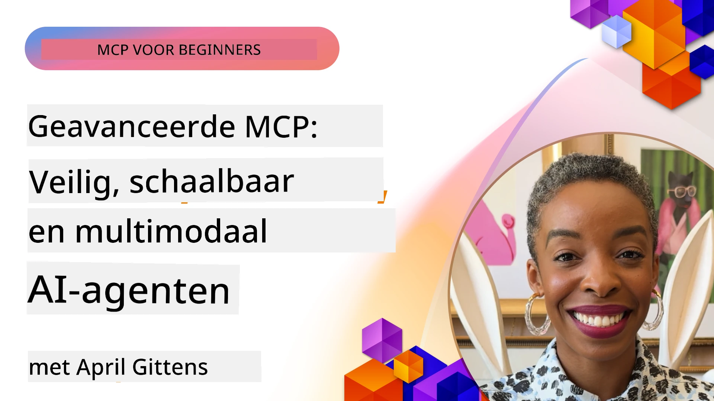

# Geavanceerde Onderwerpen in MCP

_(Klik op de afbeelding hierboven om de video van deze les te bekijken)_

Dit hoofdstuk behandelt een reeks geavanceerde onderwerpen in de implementatie van het Model Context Protocol (MCP), waaronder multi-modale integratie, schaalbaarheid, beveiligingsbest practices en enterprise-integratie. Deze onderwerpen zijn cruciaal voor het bouwen van robuuste en productieklare MCP-toepassingen die kunnen voldoen aan de eisen van moderne AI-systemen.

## Overzicht

Deze les onderzoekt geavanceerde concepten in de implementatie van het Model Context Protocol, met de nadruk op multi-modale integratie, schaalbaarheid, beveiligingsbest practices en enterprise-integratie. Deze onderwerpen zijn essentieel voor het bouwen van productiekwaliteits-MCP-toepassingen die complexe vereisten kunnen afhandelen in enterprise-omgevingen.

## Leerdoelen

Aan het einde van deze les ben je in staat om:

- Multi-modale mogelijkheden binnen MCP-frameworks te implementeren
- Schaalbare MCP-architecturen te ontwerpen voor scenario's met hoge vraag
- Beveiligingsbest practices toe te passen die aansluiten bij de beveiligingsprincipes van MCP
- MCP te integreren met enterprise AI-systemen en frameworks
- Prestatie en betrouwbaarheid in productieomgevingen te optimaliseren

## Lessen en voorbeeldprojecten

| Link | Titel | Beschrijving |
|------|-------|--------------|
| [5.1 Integratie met Azure](./mcp-integration/README.md) | Integreren met Azure | Leer hoe je je MCP-server op Azure integreert |
| [5.2 Multi modale voorbeelden](./mcp-multi-modality/README.md) | MCP Multi modale voorbeelden | Voorbeelden voor audio-, beeld- en multi modale respons |
| [5.3 MCP OAuth2 voorbeeld](../../../05-AdvancedTopics/mcp-oauth2-demo) | MCP OAuth2 Demo | Minimale Spring Boot-app die OAuth2 met MCP toont, zowel als Autorisatie- als Resource Server. Demonstreert veilige tokenuitgifte, beveiligde eindpunten, Azure Container Apps-implementatie en API Management-integratie. |
| [5.4 Root Contexts](./mcp-root-contexts/README.md) | Root contexts | Leer meer over root context en hoe je deze implementeert |
| [5.5 Routing](./mcp-routing/README.md) | Routing | Leer verschillende soorten routing |
| [5.6 Sampling](./mcp-sampling/README.md) | Sampling | Leer hoe je met sampling werkt |
| [5.7 Scaling](./mcp-scaling/README.md) | Schalen | Leer over schaalbaarheid |
| [5.8 Security](./mcp-security/README.md) | Beveiliging | Beveilig je MCP-server |
| [5.9 Web Search voorbeeld](./web-search-mcp/README.md) | Web Search MCP | Python MCP-server en client die integreren met SerpAPI voor realtime web-, nieuws-, productzoekopdrachten en Q&A. Demonstreert multi-tool orkestratie, externe API-integratie en robuuste foutafhandeling. |
| [5.10 Realtime Streaming](./mcp-realtimestreaming/README.md) | Streaming | Realtime datastreaming is essentieel geworden in de hedendaagse data-gedreven wereld, waar bedrijven en applicaties directe toegang tot informatie nodig hebben om tijdige beslissingen te nemen. |
| [5.11 Realtime Web Search](./mcp-realtimesearch/README.md) | Web Search | Hoe MCP realtime websearch transformeert door een gestandaardiseerde aanpak te bieden voor contextbeheer over AI-modellen, zoekmachines en applicaties. |
| [5.12 Entra ID Authenticatie voor Model Context Protocol Servers](./mcp-security-entra/README.md) | Entra ID Authenticatie | Microsoft Entra ID biedt een robuuste cloud-gebaseerde identiteits- en toegangsbeheeroplossing, die helpt te waarborgen dat alleen geautoriseerde gebruikers en applicaties kunnen interacteren met je MCP-server. |
| [5.13 Azure AI Foundry Agent Integratie](./mcp-foundry-agent-integration/README.md) | Azure AI Foundry Integratie | Leer hoe je Model Context Protocol-servers integreert met Azure AI Foundry-agenten, wat krachtige toolorkestratie en enterprise AI-mogelijkheden mogelijk maakt met gestandaardiseerde verbindingen naar externe gegevensbronnen. |
| [5.14 Context Engineering](./mcp-contextengineering/README.md) | Context Engineering | De toekomstige mogelijkheden van context engineering technieken voor MCP-servers, inclusief contextoptimalisatie, dynamisch contextbeheer en strategieën voor effectieve prompt engineering binnen MCP-frameworks. |
| [5.15 MCP Custom Transport](./mcp-transport/README.md) | Aangepast Transport | Leer hoe je aangepaste transportmechanismen kunt implementeren voor gespecialiseerde MCP-communicatiescenario's. |
| [5.16 Diepgaande Protocol Features](./mcp-protocol-features/README.md) | Protocol Features | Beheers geavanceerde protocolfuncties, inclusief voortgangsnotificaties, annulering van verzoeken, resource templates en foutafhandelingspatronen. |

> **Nieuw in MCP Specificatie 2025-11-25**: De specificatie bevat nu experimentele ondersteuning voor **Taken** (langdurige operaties met voortgangsbewaking), **Tool Annotaties** (metadata over toolgedrag voor veiligheid), **URL Mode Elicitation** (het opvragen van specifieke URL-inhoud van clients) en verbeterde **Roots** (voor workspace contextbeheer). Zie de [MCP Specificatie changelog](https://spec.modelcontextprotocol.io/) voor volledige details.

## Aanvullende Referenties

Voor de meest actuele informatie over geavanceerde MCP-onderwerpen, raadpleeg:
- [MCP Documentatie](https://modelcontextprotocol.io/)
- [MCP Specificatie (2025-11-25)](https://spec.modelcontextprotocol.io/specification/2025-11-25/)
- [GitHub Repository](https://github.com/modelcontextprotocol)
- [OWASP MCP Top 10](https://microsoft.github.io/mcp-azure-security-guide/mcp/) - Beveiligingsrisico's en mitigaties
- [MCP Security Summit Workshop (Sherpa)](https://azure-samples.github.io/sherpa/) - Praktische beveiligingstraining

## Belangrijkste Leerpunten

- Multi-modale MCP-implementaties breiden AI-capaciteiten uit voorbij tekstverwerking
- Schaalbaarheid is essentieel voor enterprise-implementaties en kan worden aangepakt via horizontale en verticale schaalvergroting
- Omvattende beveiligingsmaatregelen beschermen data en zorgen voor correcte toegangscontrole
- Enterprise-integratie met platforms zoals Azure OpenAI en Microsoft AI Foundry versterkt de MCP-capaciteiten
- Geavanceerde MCP-implementaties profiteren van geoptimaliseerde architecturen en zorgvuldige resourcebeheer

## Oefening

Ontwerp een enterprise-grade MCP-implementatie voor een specifieke use case:

1. Identificeer multi-modale vereisten voor je use case
2. Schets de benodigde beveiligingsmaatregelen om gevoelige data te beschermen
3. Ontwerp een schaalbare architectuur die wisselende belasting aankan
4. Plan integratiepunten met enterprise AI-systemen
5. Documenteer potentiële prestatieknelpunten en mitigerende strategieën

## Aanvullende Bronnen

- [Azure OpenAI Documentatie](https://learn.microsoft.com/en-us/azure/ai-services/openai/)
- [Microsoft AI Foundry Documentatie](https://learn.microsoft.com/en-us/ai-services/)

---

## Wat nu?

Verken de lessen in deze module beginnend met: [5.1 MCP Integratie](./mcp-integration/README.md)

Als je deze module hebt afgerond, ga dan verder naar: [Module 6: Community Bijdragen](../06-CommunityContributions/README.md)

---

<!-- CO-OP TRANSLATOR DISCLAIMER START -->
**Disclaimer**:
Dit document is vertaald met behulp van de AI-vertalingsdienst [Co-op Translator](https://github.com/Azure/co-op-translator). Hoewel we streven naar nauwkeurigheid, dient u zich ervan bewust te zijn dat geautomatiseerde vertalingen fouten of onnauwkeurigheden kunnen bevatten. Het originele document in de oorspronkelijke taal moet als de gezaghebbende bron worden beschouwd. Voor cruciale informatie wordt een professionele menselijke vertaling aanbevolen. Wij zijn niet aansprakelijk voor eventuele misverstanden of verkeerde interpretaties voortvloeiend uit het gebruik van deze vertaling.
<!-- CO-OP TRANSLATOR DISCLAIMER END -->