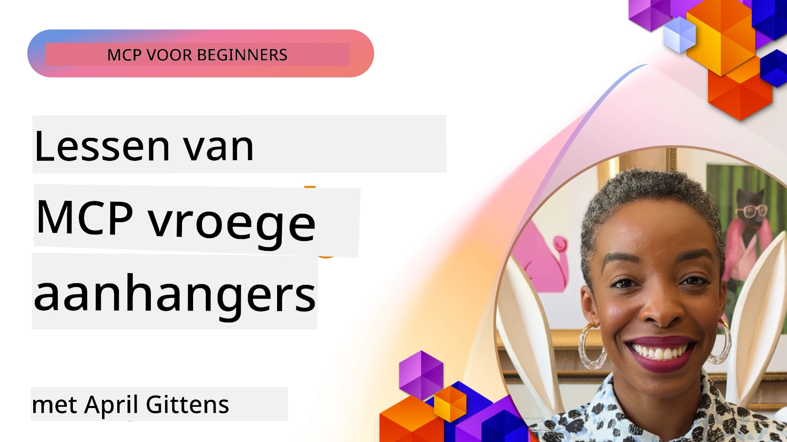

# 🌟 Lessen van vroege gebruikers

[](https://youtu.be/jds7dSmNptE)

_(Klik op de afbeelding hierboven om de video van deze les te bekijken)_

## 🎯 Wat deze module behandelt

Deze module onderzoekt hoe echte organisaties en ontwikkelaars het Model Context Protocol (MCP) gebruiken om daadwerkelijke uitdagingen op te lossen en innovatie te stimuleren. Via gedetailleerde casestudy's, hands-on projecten en praktische voorbeelden ontdek je hoe MCP veilige, schaalbare AI-integratie mogelijk maakt die taalmodellen, tools en bedrijfsgegevens met elkaar verbindt.

### 📚 Zie MCP in actie

Wil je zien hoe deze principes worden toegepast op productie-klare tools? Bekijk onze [**10 Microsoft MCP-servers die de productiviteit van ontwikkelaars transformeren**](microsoft-mcp-servers.md), waarin echte Microsoft MCP-servers worden getoond die je vandaag kunt gebruiken.

## Overzicht

Deze les onderzoekt hoe vroege gebruikers het Model Context Protocol (MCP) hebben ingezet om echte uitdagingen op te lossen en innovatie te stimuleren binnen verschillende sectoren. Door gedetailleerde casestudy's en hands-on projecten zie je hoe MCP gestandaardiseerde, veilige en schaalbare AI-integratie mogelijk maakt — waarbij grote taalmodellen, tools en bedrijfsgegevens in een uniform framework worden verbonden. Je doet praktische ervaring op met het ontwerpen en bouwen van MCP-gebaseerde oplossingen, leert van bewezen implementatiepatronen en ontdekt best practices voor het inzetten van MCP in productieomgevingen. De les belicht ook opkomende trends, toekomstige richtingen en open-sourcebronnen om je te helpen voorop te blijven lopen in MCP-technologie en het evoluerende ecosysteem.

## Leerdoelen

- Analyseer praktijkvoorbeelden van MCP-implementaties in diverse sectoren  
- Ontwerp en bouw complete MCP-gebaseerde applicaties  
- Verken opkomende trends en toekomstige richtingen in MCP-technologie  
- Pas best practices toe in daadwerkelijke ontwikkelscenario’s  

## Praktijkvoorbeelden van MCP-implementaties

### Casestudy 1: Enterprise klantenservice-automatisering

Een multinational implementeerde een MCP-gebaseerde oplossing om AI-interacties binnen hun klantenservicesystemen te standaardiseren. Dit stelde hen in staat om:

- Een uniforme interface te creëren voor meerdere LLM-providers  
- Consistente promptbeheer te behouden over afdelingen heen  
- Robuuste beveiligings- en compliancecontroles te implementeren  
- Gemakkelijk te schakelen tussen verschillende AI-modellen op basis van specifieke behoeften  

**Technische implementatie:**

```python
# Python MCP-serverimplementatie voor klantenondersteuning
import logging
import asyncio
from modelcontextprotocol import create_server, ServerConfig
from modelcontextprotocol.server import MCPServer
from modelcontextprotocol.transports import create_http_transport
from modelcontextprotocol.resources import ResourceDefinition
from modelcontextprotocol.prompts import PromptDefinition
from modelcontextprotocol.tool import ToolDefinition

# Logboekregistratie configureren
logging.basicConfig(level=logging.INFO)

async def main():
    # Serverconfiguratie maken
    config = ServerConfig(
        name="Enterprise Customer Support Server",
        version="1.0.0",
        description="MCP server for handling customer support inquiries"
    )
    
    # MCP-server initialiseren
    server = create_server(config)
    
    # Kennisbankbronnen registreren
    server.resources.register(
        ResourceDefinition(
            name="customer_kb",
            description="Customer knowledge base documentation"
        ),
        lambda params: get_customer_documentation(params)
    )
    
    # Prompt-sjablonen registreren
    server.prompts.register(
        PromptDefinition(
            name="support_template",
            description="Templates for customer support responses"
        ),
        lambda params: get_support_templates(params)
    )
    
    # Ondersteuningstools registreren
    server.tools.register(
        ToolDefinition(
            name="ticketing",
            description="Create and update support tickets"
        ),
        handle_ticketing_operations
    )
    
    # Server starten met HTTP-transmissie
    transport = create_http_transport(port=8080)
    await server.run(transport)

if __name__ == "__main__":
    asyncio.run(main())
```
  
**Resultaten:** 30% kostenreductie van modellen, 45% verbetering in consistentie van reacties en verbeterde compliance over wereldwijde operaties.

### Casestudy 2: Diagnostische assistent in de gezondheidszorg

Een zorgaanbieder ontwikkelde een MCP-infrastructuur om meerdere gespecialiseerde medische AI-modellen te integreren, terwijl gevoelige patiëntgegevens beschermd blijven:

- Naadloos schakelen tussen generalistische en specialistische medische modellen  
- Strikte privacycontroles en audittrail  
- Integratie met bestaande Elektronische Patiënten Dossiers (EPD systemen)  
- Consistente prompt engineering voor medische terminologie  

**Technische implementatie:**

```csharp
// C# MCP host application implementation in healthcare application
using Microsoft.Extensions.DependencyInjection;
using ModelContextProtocol.SDK.Client;
using ModelContextProtocol.SDK.Security;
using ModelContextProtocol.SDK.Resources;

public class DiagnosticAssistant
{
    private readonly MCPHostClient _mcpClient;
    private readonly PatientContext _patientContext;
    
    public DiagnosticAssistant(PatientContext patientContext)
    {
        _patientContext = patientContext;
        
        // Configure MCP client with healthcare-specific settings
        var clientOptions = new ClientOptions
        {
            Name = "Healthcare Diagnostic Assistant",
            Version = "1.0.0",
            Security = new SecurityOptions
            {
                Encryption = EncryptionLevel.Medical,
                AuditEnabled = true
            }
        };
        
        _mcpClient = new MCPHostClientBuilder()
            .WithOptions(clientOptions)
            .WithTransport(new HttpTransport("https://healthcare-mcp.example.org"))
            .WithAuthentication(new HIPAACompliantAuthProvider())
            .Build();
    }
    
    public async Task<DiagnosticSuggestion> GetDiagnosticAssistance(
        string symptoms, string patientHistory)
    {
        // Create request with appropriate resources and tool access
        var resourceRequest = new ResourceRequest
        {
            Name = "patient_records",
            Parameters = new Dictionary<string, object>
            {
                ["patientId"] = _patientContext.PatientId,
                ["requestingProvider"] = _patientContext.ProviderId
            }
        };
        
        // Request diagnostic assistance using appropriate prompt
        var response = await _mcpClient.SendPromptRequestAsync(
            promptName: "diagnostic_assistance",
            parameters: new Dictionary<string, object>
            {
                ["symptoms"] = symptoms,
                patientHistory = patientHistory,
                relevantGuidelines = _patientContext.GetRelevantGuidelines()
            });
            
        return DiagnosticSuggestion.FromMCPResponse(response);
    }
}
```
  
**Resultaten:** Verbeterde diagnostische suggesties voor artsen, terwijl volledige HIPAA-naleving werd behouden en context-switching tussen systemen aanzienlijk werd verminderd.

### Casestudy 3: Risicoanalyse in financiële dienstverlening

Een financiële instelling implementeerde MCP om hun risicoanalyseprocessen te standaardiseren binnen verschillende afdelingen:

- Een uniforme interface gecreëerd voor kredietrisico, fraude-detectie en investeringsrisicomodellen  
- Strikte toegangscontroles en versiebeheer van modellen geïmplementeerd  
- Auditeerbaarheid van alle AI-aanbevelingen verzekerd  
- Consistente gegevensformattering binnen diverse systemen gehandhaafd  

**Technische implementatie:**

```java
// Java MCP-server voor financiële risicobeoordeling
import org.mcp.server.*;
import org.mcp.security.*;

public class FinancialRiskMCPServer {
    public static void main(String[] args) {
        // Maak MCP-server met functies voor financiële naleving
        MCPServer server = new MCPServerBuilder()
            .withModelProviders(
                new ModelProvider("risk-assessment-primary", new AzureOpenAIProvider()),
                new ModelProvider("risk-assessment-audit", new LocalLlamaProvider())
            )
            .withPromptTemplateDirectory("./compliance/templates")
            .withAccessControls(new SOCCompliantAccessControl())
            .withDataEncryption(EncryptionStandard.FINANCIAL_GRADE)
            .withVersionControl(true)
            .withAuditLogging(new DatabaseAuditLogger())
            .build();
            
        server.addRequestValidator(new FinancialDataValidator());
        server.addResponseFilter(new PII_RedactionFilter());
        
        server.start(9000);
        
        System.out.println("Financial Risk MCP Server running on port 9000");
    }
}
```
  
**Resultaten:** Verbeterde naleving van regelgeving, 40% snellere uitrolcycli van modellen en verbeterde consistentie van risicobeoordelingen binnen afdelingen.

### Casestudy 4: Microsoft Playwright MCP Server voor browserautomatisering

Microsoft ontwikkelde de [Playwright MCP-server](https://github.com/microsoft/playwright-mcp) om veilige, gestandaardiseerde browserautomatisering mogelijk te maken via het Model Context Protocol. Deze productie-klare server maakt het AI-agenten en LLM's mogelijk om op gecontroleerde, auditbare en uitbreidbare wijze te interacteren met webbrowsers — waardoor use-cases zoals geautomatiseerde webtesten, data-extractie en end-to-end workflows mogelijk zijn.

> **🎯 Productieklaar hulpmiddel**  
>  
> Deze casestudy laat een echte MCP-server zien die je vandaag kunt gebruiken! Leer meer over de Playwright MCP Server en 9 andere productie-klare Microsoft MCP-servers in onze [**Microsoft MCP Servers Guide**](microsoft-mcp-servers.md#8--playwright-mcp-server).  

**Belangrijkste kenmerken:**  
- Maakt browserautomatiseringsfuncties (navigatie, formulierinvoer, screenshot maken, etc.) beschikbaar als MCP-tools  
- Implementeert strikte toegangscontrole en sandboxing om ongeautoriseerde acties te voorkomen  
- Biedt gedetailleerde auditlogs voor alle browserinteracties  
- Ondersteunt integratie met Azure OpenAI en andere LLM-providers voor agentgedreven automatisering  
- Dreunt GitHub Copilot’s Coding Agent aan met webbrowse-mogelijkheden  

**Technische implementatie:**

```typescript
// TypeScript: Registreren van Playwright-browserautomatiseringstools in een MCP-server
import { createServer, ToolDefinition } from 'modelcontextprotocol';
import { launch } from 'playwright';

const server = createServer({
  name: 'Playwright MCP Server',
  version: '1.0.0',
  description: 'MCP server for browser automation using Playwright'
});

// Registreer een tool om naar een URL te navigeren en een screenshot te maken
server.tools.register(
  new ToolDefinition({
    name: 'navigate_and_screenshot',
    description: 'Navigate to a URL and capture a screenshot',
    parameters: {
      url: { type: 'string', description: 'The URL to visit' }
    }
  }),
  async ({ url }) => {
    const browser = await launch();
    const page = await browser.newPage();
    await page.goto(url);
    const screenshot = await page.screenshot();
    await browser.close();
    return { screenshot };
  }
);

// Start de MCP-server
server.listen(8080);
```
  
**Resultaten:**  

- Veilige, programmatische browserautomatisering voor AI-agenten en LLM's mogelijk gemaakt  
- Verminderd handmatig testwerk en verbeterde testdekking voor webapplicaties  
- Biedt een herbruikbaar, uitbreidbaar framework voor browsergebaseerde toolintegratie in bedrijfsomgevingen  
- Dreunt GitHub Copilot’s webbrowse-functionaliteiten aan  

**Referenties:**  

- [Playwright MCP Server GitHub Repository](https://github.com/microsoft/playwright-mcp)  
- [Microsoft AI and Automation Solutions](https://azure.microsoft.com/en-us/products/ai-services/)  

### Casestudy 5: Azure MCP – Enterprise-grade Model Context Protocol als dienst

Azure MCP Server ([https://aka.ms/azmcp](https://aka.ms/azmcp)) is Microsoft’s beheerde, enterprise-grade implementatie van het Model Context Protocol, ontworpen om schaalbare, veilige en conforme MCP-serverfuncties aan te bieden als clouddienst. Azure MCP maakt het organisaties mogelijk om snel MCP-servers uit te rollen, beheren en integreren met Azure AI, data- en beveiligingsservices, wat operationele lasten vermindert en AI-adoptie versnelt.

> **🎯 Productieklaar hulpmiddel**  
>  
> Dit is een echte MCP-server die je vandaag kunt gebruiken! Lees meer over de Azure AI Foundry MCP Server in onze [**Microsoft MCP Servers Guide**](microsoft-mcp-servers.md).  

- Volledig beheerde hosting van MCP-servers met ingebouwde schaalbaarheid, monitoring en beveiliging  
- Natieve integratie met Azure OpenAI, Azure AI Search en andere Azure-diensten  
- Enterprise authenticatie en autorisatie via Microsoft Entra ID  
- Ondersteuning voor aangepaste tools, promptsjablonen en resourceconnectors  
- Naleving van bedrijfsbeveiligings- en regelgevingseisen  

**Technische implementatie:**

```yaml
# Example: Azure MCP server deployment configuration (YAML)
apiVersion: mcp.microsoft.com/v1
kind: McpServer
metadata:
  name: enterprise-mcp-server
spec:
  modelProviders:
    - name: azure-openai
      type: AzureOpenAI
      endpoint: https://<your-openai-resource>.openai.azure.com/
      apiKeySecret: <your-azure-keyvault-secret>
  tools:
    - name: document_search
      type: AzureAISearch
      endpoint: https://<your-search-resource>.search.windows.net/
      apiKeySecret: <your-azure-keyvault-secret>
  authentication:
    type: EntraID
    tenantId: <your-tenant-id>
  monitoring:
    enabled: true
    logAnalyticsWorkspace: <your-log-analytics-id>
```
  
**Resultaten:**  
- Verkort tijd tot waarde voor bedrijfs-AI-projecten door een kant-en-klaar, compliant MCP-serverplatform te bieden  
- Vereenvoudigde integratie van LLM's, tools en bedrijfsgegevensbronnen  
- Verbeterde beveiliging, observeerbaarheid en operationele efficiëntie voor MCP-workloads  
- Verbeterde codekwaliteit met Azure SDK-best practices en actuele authenticatiepatronen  

**Referenties:**  
- [Azure MCP Documentatie](https://aka.ms/azmcp)  
- [Azure MCP Server GitHub Repository](https://github.com/Azure/azure-mcp)  
- [Azure AI Services](https://azure.microsoft.com/en-us/products/ai-services/)  
- [Microsoft MCP Center](https://mcp.azure.com)  

## Casestudy 6: NLWeb  
MCP (Model Context Protocol) is een opkomend protocol waarmee chatbots en AI-assistenten kunnen interacteren met tools. Elke NLWeb-instantie is ook een MCP-server die één kernmethode ondersteunt, ask, die wordt gebruikt om een website een vraag in natuurlijke taal te stellen. Het geretourneerde antwoord maakt gebruik van schema.org, een breed gebruikte vocabulaire voor het beschrijven van webdata. Vrij vertaald is MCP voor NLWeb wat HTTP is voor HTML. NLWeb combineert protocollen, Schema.org-formaten en voorbeeldcode om sites snel deze endpoints te laten creëren, wat zowel mensen via conversatieinterfaces als machines via natuurlijke agent-tot-agentinteractie ten goede komt.

NLWeb bestaat uit twee afzonderlijke componenten:  
- Een protocol, heel eenvoudig in het begin, om te interfacen met een site in natuurlijke taal en een formaat, gebruikmakend van json en schema.org voor het geretourneerde antwoord. Zie de documentatie over de REST API voor meer details.  
- Een eenvoudige implementatie van (1) die gebruikmaakt van bestaande markup, voor sites die kunnen worden geabstraheerd als lijsten met items (producten, recepten, attracties, recensies, enz.). Samen met een set gebruikersinterface-widgets kunnen sites eenvoudig conversatieinterfaces voor hun content bieden. Zie de documentatie over Life of a chat query voor meer details over hoe dit werkt.  

**Referenties:**  
- [Azure MCP Documentatie](https://aka.ms/azmcp)  
- [NLWeb](https://github.com/microsoft/NlWeb)  

### Casestudy 7: Azure AI Foundry MCP Server – Enterprise AI-agent integratie

Azure AI Foundry MCP-servers laten zien hoe MCP kan worden gebruikt om AI-agenten en workflows te orkestreren en beheren in bedrijfsomgevingen. Door integratie van MCP met Azure AI Foundry kunnen organisaties agentinteracties standaardiseren, gebruikmaken van Foundry’s workflowbeheer, en veilige, schaalbare uitrol garanderen.

> **🎯 Productieklaar hulpmiddel**  
>  
> Dit is een echte MCP-server die je vandaag kunt gebruiken! Lees meer over de Azure AI Foundry MCP Server in onze [**Microsoft MCP Servers Guide**](microsoft-mcp-servers.md#9--azure-ai-foundry-mcp-server).  

**Belangrijkste kenmerken:**  
- Uitgebreide toegang tot Azure's AI-ecosysteem, inclusief modelcatalogi en implementatiebeheer  
- Kennisindexering met Azure AI Search voor RAG-applicaties  
- Evaluatietools voor AI-modelprestaties en kwaliteitsborging  
- Integratie met Azure AI Foundry Catalog en Labs voor geavanceerde onderzoekmodellen  
- Agentbeheer en evaluatiecapaciteiten voor productiescenario’s  

**Resultaten:**  
- Snelle prototyping en robuuste monitoring van AI-agentworkflows  
- Naadloze integratie met Azure AI-diensten voor geavanceerde scenario’s  
- Eenvormige interface voor het bouwen, implementeren en monitoren van agentpijplijnen  
- Verbeterde beveiliging, naleving en operationele efficiëntie voor bedrijven  
- Versnelde AI-adoptie met behoud van controle over complexe agentgestuurde processen  

**Referenties:**  
- [Azure AI Foundry MCP Server GitHub Repository](https://github.com/azure-ai-foundry/mcp-foundry)  
- [Integratie van Azure AI Agents met MCP (Microsoft Foundry Blog)](https://devblogs.microsoft.com/foundry/integrating-azure-ai-agents-mcp/)  

### Casestudy 8: Foundry MCP Playground – Experimenteren en prototypen

De Foundry MCP Playground biedt een kant-en-klare omgeving voor experimenteren met MCP-servers en Azure AI Foundry-integraties. Ontwikkelaars kunnen snel AI-modellen en agentworkflows prototypen, testen en evalueren met resources van de Azure AI Foundry Catalog en Labs. De playground vereenvoudigt de setup, biedt voorbeeldprojecten en ondersteunt samenwerking, waardoor het eenvoudig is best practices en nieuwe scenario's te verkennen met minimale overhead. Het is vooral nuttig voor teams die ideeën willen valideren, experimenten willen delen en leren willen versnellen zonder complexe infrastructuur. Door de drempel te verlagen, helpt de playground innovatie en bijdragen vanuit de community in het MCP- en Azure AI Foundry-ecosysteem te stimuleren.

**Referenties:**  

- [Foundry MCP Playground GitHub Repository](https://github.com/azure-ai-foundry/foundry-mcp-playground)  

### Casestudy 9: Microsoft Learn Docs MCP Server – AI-gestuurde documentatietoegang

De Microsoft Learn Docs MCP Server is een cloudgehoste dienst die AI-assistenten realtime toegang geeft tot officiële Microsoft-documentatie via het Model Context Protocol. Deze productie-klare server koppelt aan het uitgebreide Microsoft Learn-ecosysteem en maakt semantisch zoeken mogelijk over alle officiële Microsoft-bronnen.

> **🎯 Productieklaar hulpmiddel**  
>  
> Dit is een echte MCP-server die je vandaag kunt gebruiken! Lees meer over de Microsoft Learn Docs MCP Server in onze [**Microsoft MCP Servers Guide**](microsoft-mcp-servers.md#1--microsoft-learn-docs-mcp-server).  

**Belangrijkste kenmerken:**  
- Realtime toegang tot officiële Microsoft-documentatie, Azure-docs en Microsoft 365-documentatie  
- Geavanceerde semantische zoekmogelijkheden die context en intentie begrijpen  
- Altijd up-to-date informatie doordat Microsoft Learn-inhoud continu wordt gepubliceerd  
- Uitgebreide dekking van Microsoft Learn, Azure-documentatie en Microsoft 365-bronnen  
- Levert tot 10 hoogwaardige contentfragmenten met artikeltitels en URL's  

**Waarom het cruciaal is:**  
- Lost het "verouderde AI-kennis" probleem op voor Microsoft-technologieën  
- Zorgt dat AI-assistenten toegang hebben tot de nieuwste .NET-, C#-, Azure- en Microsoft 365-functies  
- Biedt gezaghebbende, eerstehands informatie voor nauwkeurige codegeneratie  
- Essentieel voor ontwikkelaars die werken met snel evoluerende Microsoft-technologieën  

**Resultaten:**  
- Dramatisch verbeterde nauwkeurigheid van AI-gegenereerde code voor Microsoft-technologieën  
- Minder tijd kwijt aan zoeken naar actuele documentatie en best practices  
- Verhoogde productiviteit van ontwikkelaars dankzij contextbewuste documentatietroepen  
- Naadloze integratie met ontwikkelworkflows zonder IDE te verlaten  

**Referenties:**  
- [Microsoft Learn Docs MCP Server GitHub Repository](https://github.com/MicrosoftDocs/mcp)  
- [Microsoft Learn Documentatie](https://learn.microsoft.com/)  

## Hands-on projecten

### Project 1: Bouw een Multi-Provider MCP-server

**Doel:** Maak een MCP-server die verzoeken kan routeren naar meerdere AI-modelproviders op basis van specifieke criteria.

**Vereisten:**

- Ondersteuning voor minimaal drie verschillende modelproviders (bijv. OpenAI, Anthropic, lokale modellen)  
- Implementeer een routeringsmechanisme op basis van verzoekmetadata  
- Maak een configuratiesysteem voor het beheren van providerreferenties  
- Voeg caching toe om prestaties en kosten te optimaliseren  
- Bouw een eenvoudig dashboard voor monitoring van gebruik  

**Implementatiestappen:**

1. Zet de basisinfrastructuur van de MCP-server op  
2. Implementeer provider-adapters voor elke AI-modelservice  
3. Maak de routeringslogica op basis van verzoekattributen  
4. Voeg caching-mechanismen toe voor frequente verzoeken  
5. Ontwikkel het monitoringdashboard  
6. Test met diverse verzoekpatronen  

**Technologieën:** Kies uit Python (.NET/Java/Python op basis van voorkeur), Redis voor caching en een eenvoudig webframework voor het dashboard.

### Project 2: Enterprise Prompt Management Systeem
**Doel:** Ontwikkel een MCP-gebaseerd systeem voor het beheren, versiebeheer en implementeren van prompt-sjablonen binnen een organisatie.

**Vereisten:**

- Maak een gecentraliseerde repository voor prompt-sjablonen
- Implementeer versiebeheer en goedkeuringsworkflows
- Bouw testmogelijkheden voor sjablonen met voorbeeldinvoer
- Ontwikkel rolgebaseerde toegangscontroles
- Maak een API voor het ophalen en implementeren van sjablonen

**Implementatiestappen:**

1. Ontwerp het databaseschema voor sjabloonopslag
2. Maak de kern-API voor CRUD-operaties van sjablonen
3. Implementeer het versiebeheersysteem
4. Bouw de goedkeuringsworkflow
5. Ontwikkel het testframework
6. Maak een eenvoudige webinterface voor beheer
7. Integreer met een MCP-server

**Technologieën:** Jouw keuze van backend-framework, SQL- of NoSQL-database en een frontend-framework voor de beheerinterface.

### Project 3: MCP-gebaseerd contentgeneratieplatform

**Doel:** Bouw een contentgeneratieplatform dat MCP gebruikt om consistente resultaten te leveren voor verschillende contenttypes.

**Vereisten:**

- Ondersteun meerdere contentformaten (blogposts, sociale media, marketingteksten)
- Implementeer sjabloongebaseerde generatie met aanpassingsopties
- Maak een contentbeoordelings- en feedbacksysteem
- Volg prestatie-indicatoren voor content
- Ondersteun contentversiebeheer en iteratie

**Implementatiestappen:**

1. Zet de MCP-clientinfrastructuur op
2. Maak sjablonen voor verschillende contenttypes
3. Bouw de contentgeneratie-pijplijn
4. Implementeer het beoordelingssysteem
5. Ontwikkel het systeem voor het volgen van statistieken
6. Maak een gebruikersinterface voor sjabloonbeheer en contentgeneratie

**Technologieën:** Jouw voorkeursprogrammeertaal, webframework en databasesysteem.

## Toekomstige Richtingen voor MCP Technologie

### Opkomende Trends

1. **Multi-Modale MCP**
   - Uitbreiding van MCP om interacties met beeld-, audio- en videomodellen te standaardiseren
   - Ontwikkeling van cross-modal redeneringsmogelijkheden
   - Gestandaardiseerde promptformaten voor verschillende modaliteiten

2. **Gefedereerde MCP-Infrastructuur**
   - Gedistribueerde MCP-netwerken die middelen kunnen delen tussen organisaties
   - Gestandaardiseerde protocollen voor veilige modeldeling
   - Privacy-beschermende berekeningstechnieken

3. **MCP Marktpleinen**
   - Ecosystemen voor het delen en gelde verdienen met MCP-sjablonen en plugins
   - Kwaliteitsborging en certificeringsprocessen
   - Integratie met modelmarktplaatsen

4. **MCP voor Edge Computing**
   - Aanpassing van MCP-standaarden voor apparaten met beperkte resources aan de rand
   - Geoptimaliseerde protocollen voor omgevingen met lage bandbreedte
   - Gespecialiseerde MCP-implementaties voor IoT-ecosystemen

5. **Regelgevende Kaders**
   - Ontwikkeling van MCP-uitbreidingen voor naleving van regelgeving
   - Gestandaardiseerde audit trails en uitlegbaarheidsinterfaces
   - Integratie met opkomende AI-governance kaders

### MCP Oplossingen van Microsoft

Microsoft en Azure hebben verschillende open-source repositories ontwikkeld om ontwikkelaars te helpen MCP in diverse scenario’s te implementeren:

#### Microsoft Organisatie

1. [playwright-mcp](https://github.com/microsoft/playwright-mcp) - Een Playwright MCP-server voor browserautomatisering en testen
2. [files-mcp-server](https://github.com/microsoft/files-mcp-server) - Een OneDrive MCP-serverimplementatie voor lokaal testen en communitybijdragen
3. [NLWeb](https://github.com/microsoft/NlWeb) - NLWeb is een verzameling van open protocollen en bijbehorende open-source tools. De focus ligt op het creëren van een fundamentele laag voor het AI-web

#### Azure-Samples Organisatie

1. [mcp](https://github.com/Azure-Samples/mcp) - Links naar voorbeelden, tools en bronnen voor het bouwen en integreren van MCP-servers op Azure met meerdere talen
2. [mcp-auth-servers](https://github.com/Azure-Samples/mcp-auth-servers) - Referentie MCP-servers die authenticatie demonstreren conform de huidige Model Context Protocol-specificatie
3. [remote-mcp-functions](https://github.com/Azure-Samples/remote-mcp-functions) - Landingspagina voor Remote MCP Server-implementaties in Azure Functions met links naar taal-specifieke repos
4. [remote-mcp-functions-python](https://github.com/Azure-Samples/remote-mcp-functions-python) - Quickstart-sjabloon voor het bouwen en implementeren van aangepaste remote MCP-servers met Azure Functions in Python
5. [remote-mcp-functions-dotnet](https://github.com/Azure-Samples/remote-mcp-functions-dotnet) - Quickstart-sjabloon voor het bouwen en implementeren van aangepaste remote MCP-servers met Azure Functions in .NET/C#
6. [remote-mcp-functions-typescript](https://github.com/Azure-Samples/remote-mcp-functions-typescript) - Quickstart-sjabloon voor het bouwen en implementeren van aangepaste remote MCP-servers met Azure Functions in TypeScript
7. [remote-mcp-apim-functions-python](https://github.com/Azure-Samples/remote-mcp-apim-functions-python) - Azure API Management als AI Gateway naar Remote MCP-servers met Python
8. [AI-Gateway](https://github.com/Azure-Samples/AI-Gateway) - APIM ❤️ AI-experimenten inclusief MCP-mogelijkheden, integratie met Azure OpenAI en AI Foundry

Deze repositories bieden diverse implementaties, sjablonen en bronnen voor het werken met het Model Context Protocol in verschillende programmeertalen en Azure-diensten. Ze bestrijken een scala aan use-cases, van basisserverimplementaties tot authenticatie, cloudimplementatie en enterprise-integratiescenario’s.

#### MCP Resources Directory

De [MCP Resources directory](https://github.com/microsoft/mcp/tree/main/Resources) in de officiële Microsoft MCP-repository biedt een zorgvuldig samengestelde collectie van voorbeeldbronnen, prompt-sjablonen en tooldefinities voor gebruik met Model Context Protocol-servers. Deze directory is ontworpen om ontwikkelaars snel aan de slag te helpen met MCP door herbruikbare bouwstenen en best-practice voorbeelden te bieden voor:

- **Prompt-sjablonen:** Direct bruikbare prompt-sjablonen voor veelvoorkomende AI-taken en scenario’s, die aangepast kunnen worden voor eigen MCP-serverimplementaties.
- **Tooldefinities:** Voorbeeldschemas en metadata voor tools om integratie en aanroep van tools te standaardiseren tussen verschillende MCP-servers.
- **Resourcevoorbeelden:** Voorbeelden van resource-definities voor verbinding met databronnen, API’s en externe services binnen het MCP-kader.
- **Referentie-implementaties:** Praktische voorbeelden die laten zien hoe je resources, prompts en tools structureert en organiseert in praktische MCP-projecten.

Deze resources versnellen de ontwikkeling, bevorderen standaardisatie en helpen best practices te waarborgen bij het bouwen en implementeren van MCP-gebaseerde oplossingen.

#### MCP Resources Directory

- [MCP Resources (Voorbeeld Prompts, Tools en Resource-Definities)](https://github.com/microsoft/mcp/tree/main/Resources)

### Onderzoeksmogelijkheden

- Efficiënte promptoptimalisatietechnieken binnen MCP-frameworks
- Beveiligingsmodellen voor multi-tenant MCP-implementaties
- Prestatiebenchmarking tussen verschillende MCP-implementaties
- Formele verificatiemethoden voor MCP-servers

## Conclusie

Het Model Context Protocol (MCP) vormt snel de toekomst van gestandaardiseerde, veilige en interoperabele AI-integratie binnen verschillende industrieën. Via de casestudy’s en hands-on projecten in deze les heb je gezien hoe vroege gebruikers—waaronder Microsoft en Azure—MCP inzetten om echte problemen op te lossen, AI-acceptatie te versnellen en naleving, veiligheid en schaalbaarheid te waarborgen. De modulaire aanpak van MCP stelt organisaties in staat grote taalmodellen, tools en zakelijke data te verbinden binnen een uniform, controleerbaar kader. Naarmate MCP zich blijft ontwikkelen, is betrokkenheid bij de community, het verkennen van open-sourcebronnen en toepassen van best practices essentieel voor het bouwen van robuuste, toekomstbestendige AI-oplossingen.

## Extra Bronnen

- [MCP Foundry GitHub Repository](https://github.com/azure-ai-foundry/mcp-foundry)
- [Foundry MCP Playground](https://github.com/azure-ai-foundry/foundry-mcp-playground)
- [Integratie van Azure AI Agents met MCP (Microsoft Foundry Blog)](https://devblogs.microsoft.com/foundry/integrating-azure-ai-agents-mcp/)
- [MCP GitHub Repository (Microsoft)](https://github.com/microsoft/mcp)
- [MCP Resources Directory (Voorbeeld Prompts, Tools en Resource-Definities)](https://github.com/microsoft/mcp/tree/main/Resources)
- [MCP Community & Documentatie](https://modelcontextprotocol.io/introduction)
- [MCP-specificatie (2025-11-25)](https://spec.modelcontextprotocol.io/specification/2025-11-25/)
- [Azure MCP Documentatie](https://aka.ms/azmcp)
- [OWASP MCP Top 10](https://microsoft.github.io/mcp-azure-security-guide/mcp/) - Beveiligingsbest practices
- [Playwright MCP Server GitHub Repository](https://github.com/microsoft/playwright-mcp)
- [Files MCP Server (OneDrive)](https://github.com/microsoft/files-mcp-server)
- [Azure-Samples MCP](https://github.com/Azure-Samples/mcp)
- [MCP Auth Servers (Azure-Samples)](https://github.com/Azure-Samples/mcp-auth-servers)
- [Remote MCP Functions (Azure-Samples)](https://github.com/Azure-Samples/remote-mcp-functions)
- [Remote MCP Functions Python (Azure-Samples)](https://github.com/Azure-Samples/remote-mcp-functions-python)
- [Remote MCP Functions .NET (Azure-Samples)](https://github.com/Azure-Samples/remote-mcp-functions-dotnet)
- [Remote MCP Functions TypeScript (Azure-Samples)](https://github.com/Azure-Samples/remote-mcp-functions-typescript)
- [Remote MCP APIM Functions Python (Azure-Samples)](https://github.com/Azure-Samples/remote-mcp-apim-functions-python)
- [AI-Gateway (Azure-Samples)](https://github.com/Azure-Samples/AI-Gateway)
- [Microsoft AI en Automatiseringsoplossingen](https://azure.microsoft.com/en-us/products/ai-services/)

## Oefeningen

1. Analyseer een van de casestudy’s en stel een alternatieve implementatieaanpak voor.
2. Kies een van de projectideeën en maak een gedetailleerde technische specificatie.
3. Onderzoek een sector die niet is behandeld in de casestudy’s en schets hoe MCP haar specifieke uitdagingen kan aanpakken.
4. Verken een van de toekomstige richtingen en ontwikkel een concept voor een nieuwe MCP-uitbreiding ter ondersteuning daarvan.

## Wat Nu?

Meer verkennen: [Microsoft MCP Servers](./microsoft-mcp-servers.md)

Ga verder naar: [Module 8: Best Practices](../08-BestPractices/README.md)

---

<!-- CO-OP TRANSLATOR DISCLAIMER START -->
**Disclaimer**:  
Dit document is vertaald met behulp van de AI-vertalingsservice [Co-op Translator](https://github.com/Azure/co-op-translator). Hoewel we streven naar nauwkeurigheid, dient u er rekening mee te houden dat geautomatiseerde vertalingen fouten of onnauwkeurigheden kunnen bevatten. Het originele document in de oorspronkelijke taal geldt als de gezaghebbende bron. Voor cruciale informatie wordt professionele menselijke vertaling aanbevolen. Wij zijn niet aansprakelijk voor misverstanden of verkeerde interpretaties die voortvloeien uit het gebruik van deze vertaling.
<!-- CO-OP TRANSLATOR DISCLAIMER END -->