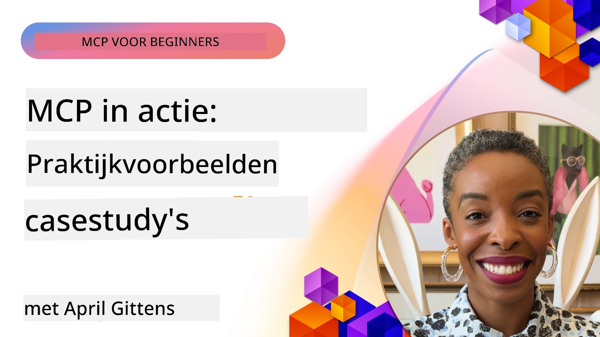

# MCP in Actie: Praktijkvoorbeelden

_(Klik op de afbeelding hierboven om de video van deze les te bekijken)_

Het Model Context Protocol (MCP) transformeert hoe AI-toepassingen omgaan met gegevens, tools en diensten. Deze sectie presenteert praktijkvoorbeelden die praktische toepassingen van MCP in verschillende bedrijfsomgevingen demonstreren.

## Overzicht

Deze sectie toont concrete voorbeelden van MCP-implementaties, waarbij wordt belicht hoe organisaties dit protocol inzetten om complexe zakelijke uitdagingen op te lossen. Door deze casestudy’s te bestuderen, krijgt u inzicht in de veelzijdigheid, schaalbaarheid en praktische voordelen van MCP in realistische scenario’s.

## Belangrijkste Leerdoelen

Door deze casestudy's te verkennen zult u:

- Begrijpen hoe MCP kan worden toegepast om specifieke zakelijke problemen op te lossen
- Leren over verschillende integratiepatronen en architectonische benaderingen
- Best practices herkennen voor het implementeren van MCP in bedrijfsomgevingen
- Inzichten verkrijgen in de uitdagingen en oplossingen bij realistische implementaties
- Kansen identificeren om vergelijkbare patronen in uw eigen projecten toe te passen

## Uitgelichte Casestudy's

### 1. [Azure AI Reisagenten – Referentie-implementatie](./travelagentsample.md)

Deze casestudy onderzoekt Microsofts uitgebreide referentie-oplossing die aantoont hoe een multi-agent reisplanningsapplicatie met AI gebouwd kan worden met MCP, Azure OpenAI en Azure AI Search. Het project toont:

- Multi-agent orkestratie via MCP
- Integratie van bedrijfsgegevens met Azure AI Search
- Veilige, schaalbare architectuur met Azure-diensten
- Uitbreidbare tooling met herbruikbare MCP-componenten
- Conversatieve gebruikerservaring aangedreven door Azure OpenAI

De architectuur- en implementatiedetails bieden waardevolle inzichten in het bouwen van complexe multi-agent systemen met MCP als coördinatielaag.

### 2. [Azure DevOps Items bijwerken vanuit YouTube-gegevens](./UpdateADOItemsFromYT.md)

Deze casestudy toont een praktische toepassing van MCP voor het automatiseren van workflowprocessen. Het laat zien hoe MCP-tools kunnen worden gebruikt om:

- Gegevens te extraheren van online platforms (YouTube)
- Werkitems in Azure DevOps-systemen bij te werken
- Herhaalbare automatiseringsworkflows te creëren
- Gegevens te integreren over uiteenlopende systemen

Dit voorbeeld illustreert hoe zelfs relatief eenvoudige MCP-implementaties aanzienlijke efficiëntiewinsten kunnen opleveren door routinetaken te automatiseren en de gegevensconsistentie tussen systemen te verbeteren.

### 3. [Realtime Documentatie Opvragen met MCP](./docs-mcp/README.md)

Deze casestudy begeleidt u bij het verbinden van een Python consoleclient met een Model Context Protocol (MCP)-server om real-time, contextbewuste Microsoft-documentatie op te halen en vast te leggen. U leert hoe u:

- Verbindt met een MCP-server met een Python client en de officiële MCP SDK
- Streaming HTTP-clients gebruikt voor efficiënte, realtime gegevensopvraging
- Documentatietools op de server aanroept en reacties rechtstreeks naar de console logt
- Up-to-date Microsoft-documentatie in uw workflow integreert zonder de terminal te verlaten

Het hoofdstuk bevat een praktische opdracht, minimale werkende codesample en links naar aanvullende bronnen voor diepere studie. Zie de volledige walkthrough en code in het gelinkte hoofdstuk om te begrijpen hoe MCP toegang tot documentatie en ontwikkelaarsproductiviteit in console-omgevingen kan transformeren.

### 4. [Interactieve Studieplangenerator Webapp met MCP](./docs-mcp/README.md)

Deze casestudy toont hoe u een interactieve webapp bouwt met Chainlit en het Model Context Protocol (MCP) om gepersonaliseerde studieplannen voor elk onderwerp te genereren. Gebruikers kunnen een onderwerp specificeren (zoals “AI-900 certificering”) en een studieduur (bijv. 8 weken), waarna de app een week-tot-week overzicht aanbiedt van aanbevolen inhoud. Chainlit maakt een conversatieve chatinterface mogelijk, wat de ervaring boeiend en adaptief maakt.

- Conversatieve webapp aangedreven door Chainlit
- Gebruikergestuurde prompts voor onderwerp en duur
- Week-tot-week inhoudsaanbevelingen met MCP
- Realtime, adaptieve reacties in een chatinterface

Het project laat zien hoe conversatieve AI en MCP gecombineerd kunnen worden om dynamische, gebruikergestuurde educatieve tools in een moderne webomgeving te creëren.

### 5. [In-Editor Documentatie met MCP-server in VS Code](./docs-mcp/README.md)

Deze casestudy toont hoe u Microsoft Learn Docs rechtstreeks in uw VS Code-omgeving brengt met behulp van de MCP-server—geen tabbladswitches naar de browser meer! U ziet hoe u:

- Documentatie direct binnen VS Code instant doorzoekt en leest via het MCP-paneel of opdrachtpalet
- Documentatie verwijst en links invoegt in README- of cursus-markdownbestanden
- GitHub Copilot en MCP samen gebruikt voor naadloze, AI-aangedreven documentatie- en code-workflows
- Uw documentatie valideert en verbetert met realtime feedback en Microsoft-accuratesse
- MCP integreert met GitHub workflows voor continue documentatievalidatie

De implementatie omvat:

- Voorbeeld `.vscode/mcp.json` configuratie voor eenvoudige setup
- Screenshot-walkthroughs van de ervaring in de editor
- Tips voor het combineren van Copilot en MCP voor maximale productiviteit

Dit scenario is ideaal voor cursusmakers, documentatieschrijvers en ontwikkelaars die gefocust willen blijven in hun editor tijdens het werken met docs, Copilot en validatietools—alles aangedreven door MCP.

### 6. [APIM MCP Server Creatie](./apimsample.md)

Deze casestudy biedt een stapsgewijze gids voor het creëren van een MCP-server met Azure API Management (APIM). Het behandelt:

- Het opzetten van een MCP-server in Azure API Management
- Het blootstellen van API-operaties als MCP-tools
- Het configureren van beleidsregels voor rate limiting en beveiliging
- Het testen van de MCP-server met Visual Studio Code en GitHub Copilot

Dit voorbeeld illustreert hoe u de mogelijkheden van Azure benut om een robuuste MCP-server te creëren die in diverse toepassingen gebruikt kan worden, waardoor de integratie van AI-systemen met bedrijfs-API's wordt verbeterd.

### 7. [GitHub MCP Registry — Versnelling van Agentgebaseerde Integratie](https://github.com/mcp)

Deze casestudy onderzoekt hoe het GitHub MCP Registry, gelanceerd in september 2025, een kritieke uitdaging in het AI-ecosysteem aanpakt: de gefragmenteerde ontdekking en uitrol van Model Context Protocol (MCP)-servers.

#### Overzicht
Het **MCP Registry** lost het groeiende probleem op van verspreide MCP-servers over repositories en registries, wat eerder integratie traag en foutgevoelig maakte. Deze servers stellen AI-agents in staat te interacteren met externe systemen zoals API's, databases en documentatiebronnen.

#### Probleemstelling
Ontwikkelaars die agentgebaseerde workflows bouwen, stonden voor verschillende uitdagingen:
- **Slechte vindbaarheid** van MCP-servers op diverse platforms
- **Redundante setupvragen** verspreid over forums en documentatie
- **Beveiligingsrisico's** door ongeverifieerde en onbetrouwbare bronnen
- **Gebrek aan standaardisatie** in serverkwaliteit en compatibiliteit

#### Oplossingsarchitectuur
GitHub's MCP Registry centraliseert vertrouwde MCP-servers met kernfuncties:
- **One-click install** integratie via VS Code voor een gestroomlijnde setup
- **Signal-over-noise sortering** op sterren, activiteit en communityvalidatie
- **Directe integratie** met GitHub Copilot en andere MCP-compatibele tools
- **Open contributiemodel** dat zowel community- als enterprisepartners inschakelt

#### Zakelijke Impact
De registry heeft meetbare verbeteringen opgeleverd:
- **Snellere onboarding** voor ontwikkelaars met tools zoals de Microsoft Learn MCP Server, die officiële documentatie rechtstreeks in agents streamt
- **Verbeterde productiviteit** via gespecialiseerde servers zoals `github-mcp-server`, die natuurlijke taal GitHub-automatisering mogelijk maken (PR-creatie, CI-herstarts, code-scanning)
- **Sterker vertrouwen in het ecosysteem** door samengestelde listings en transparante configuratiestandaarden

#### Strategische Waarde
Voor praktijkmensen die gespecialiseerd zijn in agent lifecycle management en reproduceerbare workflows biedt het MCP Registry:
- **Modulaire agentdistributie** met gestandaardiseerde componenten
- **Registry-ondersteunde evaluatiepijplijnen** voor consistente tests en validatie
- **Cross-tool interoperabiliteit** voor naadloze integratie tussen diverse AI-platforms

Deze casestudy toont aan dat het MCP Registry meer is dan een directory—het is een fundamenteel platform voor schaalbare, praktische modelintegratie en agentgebaseerde systeemplatforms.

## Conclusie

Deze zeven uitgebreide casestudy's tonen de opmerkelijke veelzijdigheid en praktische toepassingen van het Model Context Protocol in diverse real-world scenario’s. Van complexe multi-agent reisplanningssystemen en enterprise API-management tot gestroomlijnde documentatieworkflows en het revolutionaire GitHub MCP Registry, deze voorbeelden illustreren hoe MCP een gestandaardiseerde, schaalbare manier biedt om AI-systemen te verbinden met de tools, gegevens en diensten die zij nodig hebben om uitzonderlijke waarde te leveren.

De casestudy's bestrijken meerdere dimensies van MCP-implementatie:
- **Enterprise Integratie**: Azure API Management en Azure DevOps-automatisering
- **Multi-Agent Orkestratie**: Reisplanning met gecoördineerde AI-agenten
- **Ontwikkelaarsproductiviteit**: VS Code-integratie en realtime documentatietoegang
- **Ecosysteemontwikkeling**: GitHub's MCP Registry als fundamenteel platform
- **Educatieve Toepassingen**: Interactieve studieplangeneratoren en conversatieve interfaces

Door deze implementaties te bestuderen, krijgt u cruciale inzichten in:
- **Architectuurpatronen** voor verschillende schalen en toepassingen
- **Implementatiestrategieën** die functionaliteit en onderhoudbaarheid in balans brengen
- **Beveiligings- en schaalbaarheidsaspecten** voor productie-omgevingen
- **Best practices** voor MCP-serverontwikkeling en clientintegratie
- **Ecosysteemdenken** voor het bouwen van onderling verbonden AI-gedreven oplossingen

Deze voorbeelden tonen gezamenlijk aan dat MCP niet zomaar een theoretisch raamwerk is, maar een volwassen, productieklare protocol dat praktische oplossingen mogelijk maakt voor complexe zakelijke uitdagingen. Of u nu eenvoudige automatiseringstools bouwt of geavanceerde multi-agent systemen, de hier geïllustreerde patronen en benaderingen bieden een solide basis voor uw eigen MCP-projecten.

## Aanvullende Bronnen

- [Azure AI Reisagenten GitHub-repository](https://github.com/Azure-Samples/azure-ai-travel-agents)
- [Azure DevOps MCP Tool](https://github.com/microsoft/azure-devops-mcp)
- [Playwright MCP Tool](https://github.com/microsoft/playwright-mcp)
- [Microsoft Docs MCP Server](https://github.com/MicrosoftDocs/mcp)
- [GitHub MCP Registry — Versnelling van Agentgebaseerde Integratie](https://github.com/mcp)
- [MCP Community Voorbeelden](https://github.com/microsoft/mcp)

## Wat Nu?

- Vorige: [Module 8: Best Practices](../08-BestPractices/README.md)
- Volgende: [Module 10: Stroomlijnen van AI-Workflows: Het Bouwen van een MCP Server met AI Toolkit](../10-StreamliningAIWorkflowsBuildingAnMCPServerWithAIToolkit/README.md)

---

<!-- CO-OP TRANSLATOR DISCLAIMER START -->
**Vrijwaring**:
Dit document is vertaald met behulp van de AI-vertalingsdienst [Co-op Translator](https://github.com/Azure/co-op-translator). Hoewel we streven naar nauwkeurigheid, dient u er rekening mee te houden dat automatische vertalingen fouten of onnauwkeurigheden kunnen bevatten. Het originele document in de oorspronkelijke taal moet worden beschouwd als de gezaghebbende bron. Voor belangrijke informatie wordt professionele menselijke vertaling aanbevolen. Wij zijn niet aansprakelijk voor misverstanden of verkeerde interpretaties die voortvloeien uit het gebruik van deze vertaling.
<!-- CO-OP TRANSLATOR DISCLAIMER END -->