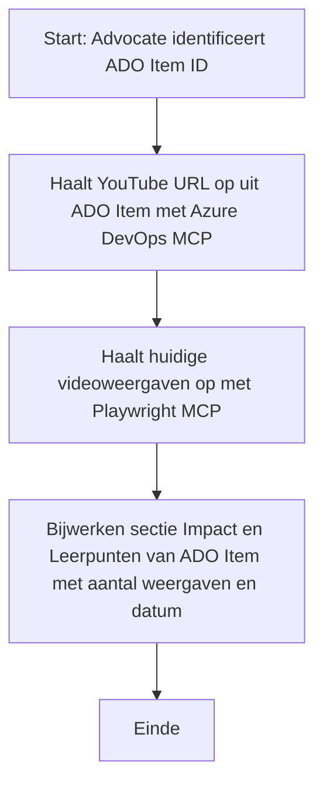

# Case Study: Azure DevOps-items bijwerken met YouTube-data via MCP

> **Disclaimer:** Er bestaan al online tools en rapporten die het proces kunnen automatiseren om Azure DevOps-items bij te werken met data van platforms zoals YouTube. De volgende situatie wordt uitsluitend als voorbeeldcase aangeboden om te illustreren hoe MCP-tools kunnen worden toegepast voor automatiserings- en integratietaken.

## Overzicht

Deze case study laat een voorbeeld zien van hoe het Model Context Protocol (MCP) en de bijbehorende tools kunnen worden gebruikt om het proces te automatiseren waarmee Azure DevOps (ADO) werkitems worden bijgewerkt met informatie afkomstig van online platformen, zoals YouTube. De beschreven scenario is slechts één illustratie van de bredere mogelijkheden van deze tools, die kunnen worden aangepast aan vele vergelijkbare automatiseringsbehoeften.

In dit voorbeeld houdt een Advocate online sessies bij met behulp van ADO-items, waarbij elk item een YouTube-video-URL bevat. Door gebruik te maken van MCP-tools kan de Advocate ADO-items actueel houden met de nieuwste videometingen, zoals het aantal weergaven, op een herhaalbare en geautomatiseerde wijze. Deze aanpak is te generaliseren naar andere scenario's waarbij informatie uit online bronnen moet worden geïntegreerd in ADO of andere systemen.

## Scenario

Een Advocate is verantwoordelijk voor het bijhouden van de impact van online sessies en communitybetrokkenheid. Elke sessie wordt vastgelegd als een ADO-werkitem in het 'DevRel'-project, en het werkitem bevat een veld voor de YouTube-video-URL. Om een nauwkeurige rapportage van het bereik van de sessie te kunnen geven, moet de Advocate het ADO-item bijwerken met het actuele aantal videoweergaven en de datum waarop deze informatie is opgehaald.

## Gebruikte Tools

- [Azure DevOps MCP](https://github.com/microsoft/azure-devops-mcp): Maakt programmatic toegang tot en updates van ADO-werkitems mogelijk via MCP.
- [Playwright MCP](https://github.com/microsoft/playwright-mcp): Automatiseert browseracties om live data van webpagina's te halen, zoals YouTube-video-statistieken.

## Stapsgewijze Workflow

1. **Identificeer het ADO-item**: Begin met het ADO-werkitem-ID (bijv. 1234) in het ‘DevRel’-project.
2. **Haal de YouTube-URL op**: Gebruik de Azure DevOps MCP-tool om de YouTube-URL uit het werkitem op te halen.
3. **Extraheer videoweergaven**: Gebruik de Playwright MCP-tool om naar de YouTube-URL te navigeren en het actuele aantal weergaven te verkrijgen.
4. **Werk het ADO-item bij**: Schrijf het nieuwste aantal weergaven en de datum van ophalen in de sectie ‘Impact and Learnings’ van het ADO-werkitem met behulp van de Azure DevOps MCP-tool.

## Voorbeeld Prompt

```bash
- Work with the ADO Item ID: 1234
- The project is '2025-Awesome'
- Get the YouTube URL for the ADO item
- Use Playwright to get the current views from the YouTube video
- Update the ADO item with the current video views and the updated date of the information
```

## Mermaid Flowchart


## Technische Implementatie

- **MCP Orchestratie**: De workflow wordt georkestreerd door een MCP-server, die het gebruik coördineert van zowel Azure DevOps MCP als Playwright MCP-tools.
- **Automatisering**: Het proces kan handmatig worden gestart of gepland worden om op regelmatige tijdstippen te draaien om ADO-items actueel te houden.
- **Uitbreidbaarheid**: Hetzelfde patroon kan worden uitgebreid om ADO-items bij te werken met andere online statistieken (bijv. likes, reacties) of van andere platforms.

## Resultaten en Impact

- **Efficiëntie**: Vermindert handmatige inspanning voor Advocates door het ophalen en bijwerken van videometingen te automatiseren.
- **Nauwkeurigheid**: Zorgt ervoor dat ADO-items de meest actuele gegevens van online bronnen bevatten.
- **Herhaalbaarheid**: Biedt een herbruikbare workflow voor soortgelijke scenario's met andere databronnen of statistieken.

## Referenties

- [Azure DevOps MCP](https://github.com/microsoft/azure-devops-mcp)
- [Playwright MCP](https://github.com/microsoft/playwright-mcp)
- [Model Context Protocol (MCP)](https://modelcontextprotocol.io/)

## Wat Nu

- Terug naar: [Case Studies Overzicht](./README.md)
- Volgende: [Documentatie realtime ophalen met MCP](./docs-mcp/README.md)

---

<!-- CO-OP TRANSLATOR DISCLAIMER START -->
**Disclaimer**:  
Dit document is vertaald met behulp van de AI-vertalingsdienst [Co-op Translator](https://github.com/Azure/co-op-translator). Hoewel we streven naar nauwkeurigheid, dient u er rekening mee te houden dat automatische vertalingen fouten of onnauwkeurigheden kunnen bevatten. Het originele document in de oorspronkelijke taal moet worden beschouwd als de gezaghebbende bron. Voor cruciale informatie wordt professionele menselijke vertaling aanbevolen. Wij zijn niet aansprakelijk voor eventuele misverstanden of verkeerde interpretaties die voortvloeien uit het gebruik van deze vertaling.
<!-- CO-OP TRANSLATOR DISCLAIMER END -->