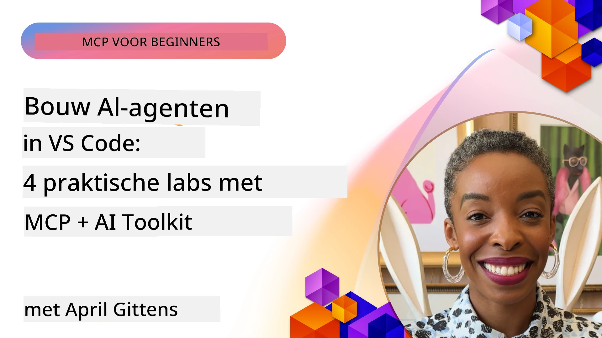

# Stroomlijnen van AI Workflows: Het Bouwen van een MCP Server met AI Toolkit

## 🎯 Overzicht

_(Klik op de afbeelding hierboven om de video van deze les te bekijken)_

Welkom bij de **Model Context Protocol (MCP) Workshop**! Deze uitgebreide praktische workshop combineert twee baanbrekende technologieën om AI-applicatieontwikkeling te revolutioneren:

- **🔗 Model Context Protocol (MCP)**: Een open standaard voor naadloze integratie van AI-tools
- **🛠️ AI Toolkit voor Visual Studio Code (AITK)**: Microsofts krachtige AI-ontwikkelextensie

### 🎓 Wat Je Zal Leren

Aan het einde van deze workshop beheers je de kunst van het bouwen van intelligente applicaties die AI-modellen verbinden met tools en diensten uit de echte wereld. Van geautomatiseerd testen tot aangepaste API-integraties, je verwerft praktische vaardigheden om complexe zakelijke uitdagingen op te lossen.

## 🏗️ Technologiestack

### 🔌 Model Context Protocol (MCP)

MCP is de **"USB-C voor AI"** - een universele standaard die AI-modellen verbindt met externe tools en databronnen.

**✨ Belangrijkste Kenmerken:**

- 🔄 **Gestandaardiseerde Integratie**: Universele interface voor AI-toolverbindingen
- 🏛️ **Flexibele Architectuur**: Lokale & externe servers via stdio/SSE transport
- 🧰 **Rijk Ecosysteem**: Tools, prompts en bronnen in één protocol
- 🔒 **Enterprise-Klaar**: Ingebouwde beveiliging en betrouwbaarheid

**🎯 Waarom MCP Belangrijk Is:**
Net zoals USB-C de kabelchaos heeft geëlimineerd, verwijdert MCP de complexiteit van AI-integraties. Eén protocol, oneindige mogelijkheden.

### 🤖 AI Toolkit voor Visual Studio Code (AITK)

Microsofts vlaggenschip AI-ontwikkelextensie die VS Code transformeert tot een AI-krachtpatser.

**🚀 Kernmogelijkheden:**

- 📦 **Modelcatalogus**: Toegang tot modellen van Azure AI, GitHub, Hugging Face, Ollama
- ⚡ **Lokale Inferentie**: ONNX-geoptimaliseerde CPU/GPU/NPU uitvoering
- 🏗️ **Agent Builder**: Visuele AI-agentontwikkeling met MCP integratie
- 🎭 **Multi-Modal**: Ondersteuning voor tekst, beeld en gestructureerde output

**💡 Ontwikkelvoordelen:**

- Zero-config modeluitrol
- Visuele prompt engineering
- Real-time testomgeving
- Naadloze MCP server integratie

## 📚 Leertraject

### [🚀 Module 1: AI Toolkit Basisprincipes](./lab1/README.md)

**Duur**: 15 minuten

- 🛠️ Installeer en configureer AI Toolkit voor VS Code
- 🗂️ Verken de Modelcatalogus (100+ modellen van GitHub, ONNX, OpenAI, Anthropic, Google)
- 🎮 Beheers de interactieve speelomgeving voor real-time modeltesten
- 🤖 Bouw je eerste AI-agent met Agent Builder
- 📊 Evalueer modelprestaties met ingebouwde metrics (F1, relevantie, gelijkenis, coherentie)
- ⚡ Leer batchverwerking en multi-modal ondersteuning

**🎯 Leerresultaat**: Creëer een functionele AI-agent met een volledig begrip van AITK-mogelijkheden

### [🌐 Module 2: MCP met AI Toolkit Basisprincipes](./lab2/README.md)

**Duur**: 20 minuten

- 🧠 Beheers Model Context Protocol (MCP) architectuur en concepten
- 🌐 Verken het MCP server-ecosysteem van Microsoft
- 🤖 Bouw een browser-automatiseringsagent met Playwright MCP server
- 🔧 Integreer MCP-servers met AI Toolkit Agent Builder
- 📊 Configureer en test MCP-tools binnen je agents
- 🚀 Exporteer en implementeer MCP-aangedreven agents voor productiegebruik

**🎯 Leerresultaat**: Zet een AI-agent in productie die is versterkt met externe tools via MCP

### [🔧 Module 3: Geavanceerde MCP Ontwikkeling met AI Toolkit](./lab3/README.md)

**Duur**: 20 minuten

- 💻 Maak aangepaste MCP-servers met AI Toolkit
- 🐍 Configureer en gebruik de nieuwste MCP Python SDK (v1.9.3)
- 🔍 Stel MCP Inspector in en gebruik deze voor debugging
- 🛠️ Bouw een Weather MCP Server met professionele debugging workflows
- 🧪 Debug MCP-servers in zowel Agent Builder als Inspector omgevingen

**🎯 Leerresultaat**: Ontwikkel en debug aangepaste MCP-servers met moderne tooling

### [🐙 Module 4: Praktische MCP Ontwikkeling - Aangepaste GitHub Clone Server](./lab4/README.md)

**Duur**: 30 minuten

- 🏗️ Bouw een realistische GitHub Clone MCP Server voor ontwikkelworkflows
- 🔄 Implementeer slimme repository-cloning met validatie en foutafhandeling
- 📁 Creëer intelligente directorybeheer en VS Code integratie
- 🤖 Gebruik GitHub Copilot Agent Mode met aangepaste MCP-tools
- 🛡️ Pas productieklaar betrouwbaarheid en cross-platform compatibiliteit toe

**🎯 Leerresultaat**: Zet een productieklaar MCP-server in die echte ontwikkelworkflows stroomlijnt

## 💡 Toepassingen en Impact in de Praktijk

### 🏢 Enterprise Use Cases

#### 🔄 DevOps Automatisering

Transformeer je ontwikkelworkflow met intelligente automatisering:

- **Slim Repositorybeheer**: AI-gedreven code review en merge-beslissingen
- **Intelligente CI/CD**: Geautomatiseerde pijplijnoptimalisatie op basis van codewijzigingen
- **Issue Triage**: Automatische bugclassificatie en toewijzing

#### 🧪 Kwaliteitsborging Revolutie

Verhoog testen met AI-gestuurde automatisering:

- **Intelligente Testgeneratie**: Automatisch uitgebreide testsuites creëren
- **Visuele Regressietest**: AI-gestuurde UI-wijzigingsdetectie
- **Prestaties Monitoring**: Proactieve probleemidentificatie en -oplossing

#### 📊 Data Pipeline Intelligentie

Bouw slimmere gegevensverwerkingsworkflows:

- **Adaptieve ETL-processen**: Zelfoptimaliserende datatransformaties
- **Anomaliedetectie**: Real-time bewaking van datakwaliteit
- **Intelligente Routering**: Slim datavoorraadbeheer

#### 🎧 Verbetering van Klantbeleving

Creëer uitzonderlijke klantinteracties:

- **Contextbewuste Ondersteuning**: AI-agents met toegang tot klantgeschiedenis
- **Proactieve Probleemoplossing**: Voorspellende klantenservice
- **Multi-Channel Integratie**: Geünificeerde AI-ervaring over platforms heen

## 🛠️ Vereisten & Setup

### 💻 Systeemvereisten

| Component           | Vereiste            | Notities                          |
|---------------------|---------------------|----------------------------------|
| **Besturingssysteem**| Windows 10+, macOS 10.15+, Linux | Elke moderne OS                 |
| **Visual Studio Code**| Laatste stabiele versie | Vereist voor AITK              |
| **Node.js**          | v18.0+ en npm       | Voor MCP-server ontwikkeling     |
| **Python**           | 3.10+               | Optioneel voor Python MCP servers|
| **Geheugen**         | Minimaal 8GB RAM    | 16GB aanbevolen voor lokale modellen |

### 🔧 Ontwikkelomgeving

#### Aanbevolen VS Code Extensies

- **AI Toolkit** (ms-windows-ai-studio.windows-ai-studio)
- **Python** (ms-python.python)
- **Python Debugger** (ms-python.debugpy)
- **GitHub Copilot** (GitHub.copilot) - Optioneel maar nuttig

#### Optionele Tools

- **uv**: Moderne Python package manager
- **MCP Inspector**: Visuele debugging tool voor MCP-servers
- **Playwright**: Voor webautomatiseringsvoorbeelden

## 🎖️ Leerresultaten & Certificeringspad

### 🏆 Overzicht Vaardigheden

Door deze workshop te voltooien, bereik je beheersing in:

#### 🎯 Kerncompetenties

- [ ] **MCP Protocol Beheersing**: Diepgaand begrip van architectuur en implementatiepatronen
- [ ] **AITK Vaardigheid**: Expertgebruik van AI Toolkit voor snelle ontwikkeling
- [ ] **Aangepaste Serverontwikkeling**: Bouwen, implementeren en onderhouden van productieservers MCP
- [ ] **Toolintegratie Uitmuntendheid**: Naadloze verbinding van AI met bestaande ontwikkelworkflows
- [ ] **Probleemoplossing Toepassing**: Toepassen van geleerde vaardigheden op echte zakelijke uitdagingen

#### 🔧 Technische Vaardigheden

- [ ] AI Toolkit opzetten en configureren in VS Code
- [ ] Aangepaste MCP-servers ontwerpen en implementeren
- [ ] GitHub-modellen integreren met MCP-architectuur
- [ ] Geautomatiseerde testworkflows bouwen met Playwright
- [ ] AI-agents inzetten voor productiegebruik
- [ ] MCP-serverprestaties debuggen en optimaliseren

#### 🚀 Geavanceerde Capaciteiten

- [ ] Enterprise-scale AI-integraties ontwerpen
- [ ] Beveiligingsbest practices implementeren voor AI-applicaties
- [ ] Schaalbare MCP serverarchitecturen ontwerpen
- [ ] Aangepaste toolchains creëren voor specifieke domeinen
- [ ] Anderen coachen in AI-native ontwikkeling

## 📖 Aanvullende Bronnen

- [MCP Specificatie (2025-11-25)](https://spec.modelcontextprotocol.io/specification/2025-11-25/)
- [AI Toolkit GitHub Repository](https://github.com/microsoft/vscode-ai-toolkit)
- [Collectie van Voorbeeld MCP Servers](https://github.com/modelcontextprotocol/servers)
- [Gids met Best Practices](https://modelcontextprotocol.io/docs/best-practices)
- [OWASP MCP Top 10](https://microsoft.github.io/mcp-azure-security-guide/mcp/) - Security best practices

---

**🚀 Klaar om je AI-ontwikkelworkflow te revolutioneren?**

Laten we samen de toekomst van intelligente applicaties bouwen met MCP en AI Toolkit!

## Wat Nu?

Ga verder naar: [Module 11: MCP Server Hands-On Labs](../11-MCPServerHandsOnLabs/README.md)

---

<!-- CO-OP TRANSLATOR DISCLAIMER START -->
**Disclaimer**:  
Dit document is vertaald met behulp van de AI-vertalingsdienst [Co-op Translator](https://github.com/Azure/co-op-translator). Hoewel wij streven naar nauwkeurigheid, dient u er rekening mee te houden dat automatische vertalingen fouten of onnauwkeurigheden kunnen bevatten. Het originele document in de oorspronkelijke taal moet worden beschouwd als de gezaghebbende bron. Voor kritieke informatie wordt professionele menselijke vertaling aanbevolen. Wij zijn niet aansprakelijk voor eventuele misverstanden of verkeerde interpretaties die voortvloeien uit het gebruik van deze vertaling.
<!-- CO-OP TRANSLATOR DISCLAIMER END -->