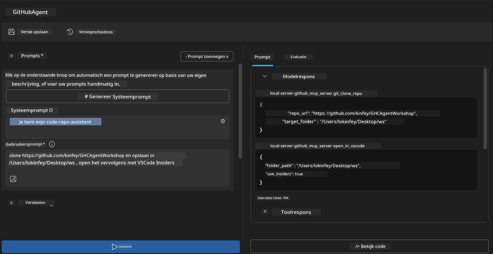
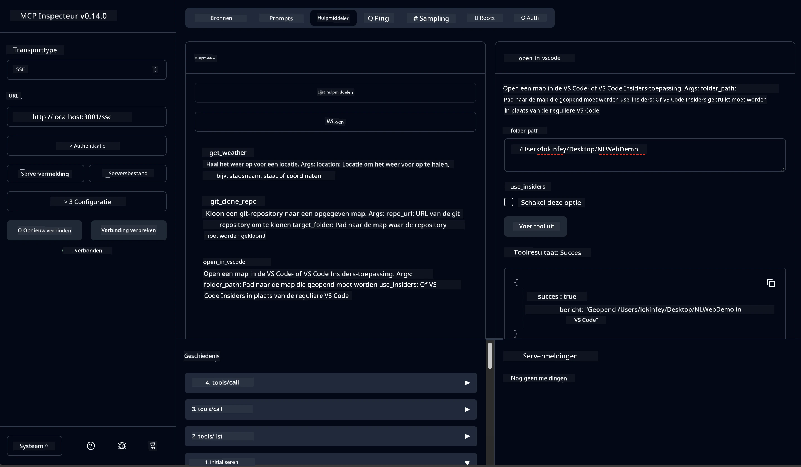

# 🐙 Module 4: Praktische MCP-ontwikkeling - Aangepaste GitHub Clone Server


> **⚡ Snelle start:** Bouw een productieklaar MCP-server die GitHub-repositoryklonen en VS Code-integratie automatiseert in slechts 30 minuten!

## 🎯 Leerdoelen

Aan het einde van deze lab sessie kun je:

- ✅ Een aangepaste MCP-server maken voor echte ontwikkelworkflows
- ✅ Functionaliteit voor het klonen van GitHub-repositories via MCP implementeren
- ✅ Aangepaste MCP-servers integreren met VS Code en Agent Builder
- ✅ GitHub Copilot Agent Mode gebruiken met aangepaste MCP-tools
- ✅ Aangepaste MCP-servers testen en implementeren in productieomgevingen

## 📋 Vereisten

- Voltooiing van Labs 1-3 (MCP basisprincipes en geavanceerde ontwikkeling)
- GitHub Copilot-abonnement ([gratis aanmelden beschikbaar](https://github.com/github-copilot/signup))
- VS Code met AI Toolkit en GitHub Copilot extensies
- Git CLI geïnstalleerd en geconfigureerd

## 🏗️ Projectoverzicht

### **Echte Ontwikkeluitdaging**
Als ontwikkelaars gebruiken we vaak GitHub om repositories te klonen en deze te openen in VS Code of VS Code Insiders. Dit handmatige proces omvat:
1. Terminal/commandoprompt openen
2. Naar de gewenste map navigeren
3. De `git clone` opdracht uitvoeren
4. VS Code openen in de gekloonde map

**Onze MCP-oplossing stroomlijnt dit in één intelligente opdracht!**

### **Wat je gaat bouwen**
Een **GitHub Clone MCP Server** (`git_mcp_server`) die biedt:

| Functie | Beschrijving | Voordeel |
|---------|-------------|---------|
| 🔄 **Slim Repository Klonen** | GitHub repos klonen met validatie | Geautomatiseerde foutcontrole |
| 📁 **Intelligent Mapbeheer** | Controleer en maak mappen veilig aan | Voorkomt overschrijven |
| 🚀 **Cross-platform VS Code Integratie** | Open projecten in VS Code/Insiders | Naadloze workflowovergang |
| 🛡️ **Robuuste Foutafhandeling** | Behandel netwerk-, permissie- en padproblemen | Productieklaar betrouwbaar |

---

## 📖 Stapsgewijze implementatie

### Stap 1: Maak GitHub Agent in Agent Builder

1. **Start Agent Builder** via de AI Toolkit-extensie
2. **Maak een nieuwe agent** met de volgende configuratie:
   ```
   Agent Name: GitHubAgent
   ```

3. **Initialiseer aangepaste MCP-server:**
   - Navigeer naar **Tools** → **Add Tool** → **MCP Server**
   - Selecteer **"Create A new MCP Server"**
   - Kies **Python-template** voor maximale flexibiliteit
   - **Servernaam:** `git_mcp_server`

### Stap 2: Configureer GitHub Copilot Agent Mode

1. **Open GitHub Copilot** in VS Code (Ctrl/Cmd + Shift + P → "GitHub Copilot: Open")
2. **Selecteer Agent Model** in de Copilot-interface
3. **Kies het Claude 3.7-model** voor verbeterde redeneercapaciteiten
4. **Activeer MCP-integratie** voor toegang tot tools

> **💡 Pro Tip:** Claude 3.7 biedt superieur begrip van ontwikkelworkflows en foutafhandelingspatronen.

### Stap 3: Implementeer kernfunctionaliteit van MCP-server

**Gebruik de volgende gedetailleerde prompt met GitHub Copilot Agent Mode:**

```
Create two MCP tools with the following comprehensive requirements:

🔧 TOOL A: clone_repository
Requirements:
- Clone any GitHub repository to a specified local folder
- Return the absolute path of the successfully cloned project
- Implement comprehensive validation:
  ✓ Check if target directory already exists (return error if exists)
  ✓ Validate GitHub URL format (https://github.com/user/repo)
  ✓ Verify git command availability (prompt installation if missing)
  ✓ Handle network connectivity issues
  ✓ Provide clear error messages for all failure scenarios

🚀 TOOL B: open_in_vscode
Requirements:
- Open specified folder in VS Code or VS Code Insiders
- Cross-platform compatibility (Windows/Linux/macOS)
- Use direct application launch (not terminal commands)
- Auto-detect available VS Code installations
- Handle cases where VS Code is not installed
- Provide user-friendly error messages

Additional Requirements:
- Follow MCP 1.9.3 best practices
- Include proper type hints and documentation
- Implement logging for debugging purposes
- Add input validation for all parameters
- Include comprehensive error handling
```

### Stap 4: Test je MCP-server

#### 4a. Test in Agent Builder

1. **Start de debug-configuratie** voor Agent Builder
2. **Configureer je agent met deze systeem-prompt:**

```
SYSTEM_PROMPT:
You are my intelligent coding repository assistant. You help developers efficiently clone GitHub repositories and set up their development environment. Always provide clear feedback about operations and handle errors gracefully.
```

3. **Test met realistische gebruikersscenario's:**

```
USER_PROMPT EXAMPLES:

Scenario : Basic Clone and Open
"Clone {Your GitHub Repo link such as https://github.com/kinfey/GHCAgentWorkshop
 } and save to {The global path you specify}, then open it with VS Code Insiders"
```



**Verwachte resultaten:**
- ✅ Succesvol klonen met padbevestiging
- ✅ Automatisch VS Code starten
- ✅ Duidelijke foutmeldingen bij ongeldige scenario's
- ✅ Juiste afhandeling van randgevallen

#### 4b. Test in MCP Inspector




---


**🎉 Gefeliciteerd!** Je hebt met succes een praktische, productieklaar MCP-server gemaakt die echte ontwikkelworkflowproblemen oplost. Je aangepaste GitHub clone server toont de kracht van MCP aan voor het automatiseren en verbeteren van de productiviteit van ontwikkelaars.

### 🏆 Behaald resultaat:
- ✅ **MCP Ontwikkelaar** - Aangepaste MCP-server gemaakt
- ✅ **Workflow Automator** - Ontwikkelprocessen gestroomlijnd  
- ✅ **Integratie-expert** - Meerdere ontwikkeltools verbonden
- ✅ **Productieklaar** - Oplossingen gebouwd en uitgerold

---

## 🎓 Workshop voltooiing: Jouw reis met Model Context Protocol

**Beste workshopdeelnemer,**

Gefeliciteerd met het afronden van alle vier modules van de Model Context Protocol-workshop! Je hebt een lange weg afgelegd van het begrijpen van basisconcepten van AI Toolkit tot het bouwen van productieklaar MCP-servers die echte ontwikkeluitdagingen oplossen.

### 🚀 Overzicht van je leerreis:

**[Module 1](../lab1/README.md)**: Je begon met het verkennen van AI Toolkit- basisprincipes, modeltesten en het maken van je eerste AI-agent.

**[Module 2](../lab2/README.md)**: Je leerde de MCP-architectuur, integreerde Playwright MCP, en bouwde je eerste browserautomatiseringsagent.

**[Module 3](../lab3/README.md)**: Je maakte een stap verder met aangepaste MCP-serverontwikkeling met de Weather MCP-server en beheerde debuggingtools.

**[Module 4](../lab4/README.md)**: Je hebt nu alles toegepast om een praktische GitHub repository workflow automatiseringstool te maken.

### 🌟 Wat je hebt beheerst:

- ✅ **AI Toolkit-ecosysteem**: Modellen, agents en integratiepatronen
- ✅ **MCP-architectuur**: Client-server ontwerp, transportprotocollen en beveiliging
- ✅ **Ontwikkeltools**: Van Playground tot Inspector tot productie-implementatie
- ✅ **Aangepaste ontwikkeling**: Het bouwen, testen, en implementeren van eigen MCP-servers
- ✅ **Praktische toepassingen**: Echte workflow-uitdagingen oplossen met AI

### 🔮 Jouw volgende stappen:

1. **Bouw je eigen MCP-server**: Pas deze vaardigheden toe om jouw unieke workflows te automatiseren
2. **Word lid van de MCP-community**: Deel je creaties en leer van anderen
3. **Verken geavanceerde integratie**: Verbind MCP-servers met enterprise-systemen
4. **Draag bij aan Open Source**: Help MCP-tools en documentatie verbeteren

Onthoud, deze workshop is slechts het begin. Het Model Context Protocol-ecosysteem ontwikkelt zich snel en jij bent nu uitgerust om aan de voorhoede te staan van AI-gedreven ontwikkeltools.

**Bedankt voor je deelname en je toewijding aan leren!**

We hopen dat deze workshop je heeft geïnspireerd met ideeën die zullen transformeren hoe je AI-tools bouwt en gebruikt in je ontwikkeltraject.

**Veel programmeerplezier!**

---

## Wat Nu?

Gefeliciteerd met het voltooien van alle labs in Module 10!

- Terug naar: [Module 10 Overzicht](../README.md)
- Ga verder naar: [Module 11: MCP Server Hands-On Labs](../../11-MCPServerHandsOnLabs/README.md)

---

<!-- CO-OP TRANSLATOR DISCLAIMER START -->
**Disclaimer**:  
Dit document is vertaald met behulp van de AI-vertalingsdienst [Co-op Translator](https://github.com/Azure/co-op-translator). Hoewel wij streven naar nauwkeurigheid, dient u er rekening mee te houden dat geautomatiseerde vertalingen fouten of onnauwkeurigheden kunnen bevatten. Het originele document in de oorspronkelijke taal dient als de gezaghebbende bron te worden beschouwd. Voor cruciale informatie wordt professionele menselijke vertaling aanbevolen. Wij zijn niet aansprakelijk voor eventuele misverstanden of verkeerde interpretaties die voortvloeien uit het gebruik van deze vertaling.
<!-- CO-OP TRANSLATOR DISCLAIMER END -->