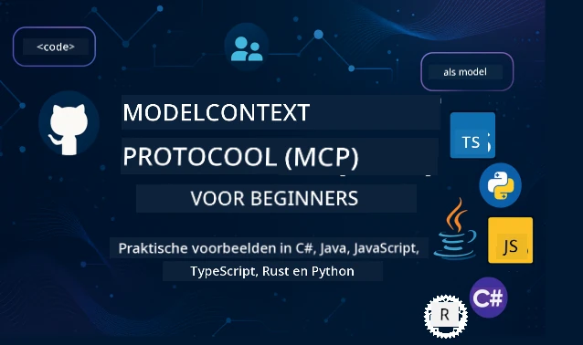

 

[](https://GitHub.com/microsoft/mcp-for-beginners/graphs/contributors)
[](https://GitHub.com/microsoft/mcp-for-beginners/issues)
[](https://GitHub.com/microsoft/mcp-for-beginners/pulls)
[](http://makeapullrequest.com)

[](https://GitHub.com/microsoft/mcp-for-beginners/watchers)
[](https://GitHub.com/microsoft/mcp-for-beginners/fork)
[](https://GitHub.com/microsoft/mcp-for-beginners/stargazers)


[](https://discord.gg/nTYy5BXMWG)

Volg deze stappen om aan de slag te gaan met deze bronnen:
1. **Fork de Repository**: Klik op [](https://GitHub.com/microsoft/mcp-for-beginners/fork)
2. **Clone de Repository**:   `git clone https://github.com/microsoft/mcp-for-beginners.git`
3. **Word lid van de** [](https://discord.gg/nTYy5BXMWG)


### 🌐 Meertalige Ondersteuning

#### Ondersteund via GitHub Action (Geautomatiseerd & Altijd Up-to-Date)

<!-- CO-OP TRANSLATOR LANGUAGES TABLE START -->
[Arabisch](../ar/README.md) | [Bengaals](../bn/README.md) | [Bulgaars](../bg/README.md) | [Birmaans (Myanmar)](../my/README.md) | [Chinees (Vereenvoudigd)](../zh-CN/README.md) | [Chinees (Traditioneel, Hong Kong)](../zh-HK/README.md) | [Chinees (Traditioneel, Macau)](../zh-MO/README.md) | [Chinees (Traditioneel, Taiwan)](../zh-TW/README.md) | [Kroatisch](../hr/README.md) | [Tsjechisch](../cs/README.md) | [Deens](../da/README.md) | [Nederlands](./README.md) | [Ests](../et/README.md) | [Fins](../fi/README.md) | [Frans](../fr/README.md) | [Duits](../de/README.md) | [Grieks](../el/README.md) | [Hebreeuws](../he/README.md) | [Hindi](../hi/README.md) | [Hongaars](../hu/README.md) | [Indonesisch](../id/README.md) | [Italiaans](../it/README.md) | [Japans](../ja/README.md) | [Kannada](../kn/README.md) | [Koreaans](../ko/README.md) | [Litouws](../lt/README.md) | [Maleis](../ms/README.md) | [Malayalam](../ml/README.md) | [Marathi](../mr/README.md) | [Nepalees](../ne/README.md) | [Nigeriaans Pidgin](../pcm/README.md) | [Noors](../no/README.md) | [Perzisch (Farsi)](../fa/README.md) | [Pools](../pl/README.md) | [Portugees (Brazilië)](../pt-BR/README.md) | [Portugees (Portugal)](../pt-PT/README.md) | [Punjabi (Gurmukhi)](../pa/README.md) | [Roemeens](../ro/README.md) | [Russisch](../ru/README.md) | [Servisch (Cyrillisch)](../sr/README.md) | [Slowaaks](../sk/README.md) | [Sloveens](../sl/README.md) | [Spaans](../es/README.md) | [Swahili](../sw/README.md) | [Zweeds](../sv/README.md) | [Tagalog (Filipino)](../tl/README.md) | [Tamil](../ta/README.md) | [Telugu](../te/README.md) | [Thai](../th/README.md) | [Turks](../tr/README.md) | [Oekraïens](../uk/README.md) | [Urdu](../ur/README.md) | [Vietnamees](../vi/README.md)

> **Liever lokaal clonen?**
>
> Deze repository bevat vertalingen in meer dan 50 talen, wat de downloadgrootte aanzienlijk vergroot. Om zonder vertalingen te clonen, gebruik sparse checkout:
>
> **Bash / macOS / Linux:**
> ```bash
> git clone --filter=blob:none --sparse https://github.com/microsoft/mcp-for-beginners.git
> cd mcp-for-beginners
> git sparse-checkout set --no-cone '/*' '!translations' '!translated_images'
> ```
>
> **CMD (Windows):**
> ```cmd
> git clone --filter=blob:none --sparse https://github.com/microsoft/mcp-for-beginners.git
> cd mcp-for-beginners
> git sparse-checkout set --no-cone "/*" "!translations" "!translated_images"
> ```
>
> Dit geeft je alles wat je nodig hebt om de cursus te voltooien met een veel snellere download.
<!-- CO-OP TRANSLATOR LANGUAGES TABLE END -->

# 🚀 Model Context Protocol (MCP) Curriculum voor Beginners

## **Leer MCP met Praktijkvoorbeelden in C#, Java, JavaScript, Rust, Python en TypeScript**

## 🧠 Overzicht van het Model Context Protocol Curriculum
Welkom op je reis in het Model Context Protocol! Als je je ooit hebt afgevraagd hoe AI-toepassingen communiceren met verschillende tools en diensten, ontdek je nu de elegante oplossing die verandert hoe ontwikkelaars intelligente systemen bouwen.

Zie MCP als een universele vertaler voor AI-toepassingen - net zoals USB-poorten je toestaan om elk apparaat op je computer aan te sluiten, laat MCP AI-modellen op een gestandaardiseerde manier verbinden met elke tool of dienst. Of je nu je eerste chatbot bouwt of werkt aan complexe AI-workflows, het begrijpen van MCP geeft je de kracht om krachtigere en flexibelere toepassingen te creëren.

Dit curriculum is met geduld en zorg ontworpen voor jouw leerproces. We beginnen met eenvoudige concepten die je al kent en bouwen je expertise geleidelijk op via praktijkervaring in je favoriete programmeertaal. Elke stap bevat duidelijke uitleg, praktische voorbeelden en veel aanmoediging.

Als je deze reis hebt voltooid, heb je het vertrouwen om je eigen MCP-servers te bouwen, ze te integreren met populaire AI-platformen en te begrijpen hoe deze technologie de toekomst van AI-ontwikkeling verandert. Laten we samen aan dit spannende avontuur beginnen!

### Officiële Documentatie en Specificaties

Dit curriculum is afgestemd op **MCP Specificatie 2025-11-25** (de nieuwste stabiele release). De MCP-specificatie gebruikt datumgebaseerde versiebeheer (YYYY-MM-DD-formaat) om versiegeschiedenis helder te houden.

Deze bronnen worden waardevoller naarmate je meer begrijpt, maar voel je niet verplicht om alles direct te lezen. Begin met de gebieden die je het meest interesseren!
- 📘 [MCP Documentatie](https://modelcontextprotocol.io/) – Dit is je go-to bron voor stapsgewijze tutorials en gebruikersgidsen. De documentatie is geschreven voor beginners en biedt heldere voorbeelden waar je op je eigen tempo mee aan de slag kunt.
- 📜 [MCP Specificatie](https://modelcontextprotocol.io/specification/2025-11-25) – Zie dit als je uitgebreide referentiehandleiding. Tijdens het curriculum zul je hier vaak op terugkomen om specifieke details te raadplegen en geavanceerde functies te verkennen.
- 📜 [MCP Specificatie Versiebeheer](https://modelcontextprotocol.io/specification/versioning) – Dit bevat informatie over de protocolversies en hoe MCP datumgebaseerd versiebeheer toepast (YYYY-MM-DD).
- 🧑‍💻 [MCP GitHub Repository](https://github.com/modelcontextprotocol) – Hier vind je SDK’s, tools en voorbeeldcode in meerdere programmeertalen. Het is een schat aan praktische voorbeelden en kant-en-klare componenten.
- 🌐 [MCP Community](https://github.com/orgs/modelcontextprotocol/discussions) – Sluit je aan bij medeleerders en ervaren ontwikkelaars voor discussies over MCP. Het is een ondersteunende gemeenschap waar vragen welkom zijn en kennis open wordt gedeeld.
  
## Leerdoelen

Aan het einde van dit curriculum voel je je zelfverzekerd en enthousiast over je nieuwe vaardigheden. Dit ga je bereiken:

• **Begrijp MCP-grondbeginselen**: Je krijgt inzicht in wat het Model Context Protocol is en waarom het de manier waarop AI-toepassingen samenwerken revolutioneert, met analogieën en voorbeelden die logisch zijn.

• **Bouw je eerste MCP-server**: Je maakt een werkende MCP-server in je favoriete programmeertaal, beginnende met eenvoudige voorbeelden en je vaardigheden stapsgewijs uitbreidend.

• **Verbind AI-modellen met echte tools**: Je leert hoe je de kloof overbrugt tussen AI-modellen en echte diensten, waardoor je toepassingen krachtige nieuwe mogelijkheden krijgen.

• **Implementeer beveiligingsbest practices**: Je begrijpt hoe je je MCP-implementaties veilig en betrouwbaar houdt, en zo zowel je toepassingen als gebruikers beschermt.

• **Implementeer met vertrouwen**: Je weet hoe je je MCP-projecten van ontwikkeling naar productie brengt, met praktische deployment-strategieën die in de praktijk werken.

• **Word lid van de MCP-community**: Je wordt onderdeel van een groeiende gemeenschap van ontwikkelaars die de toekomst van AI-toepassingsontwikkeling vormgeven. 

## Essentiële Achtergrond

Voordat we in MCP-details duiken, zorgen we eerst dat je vertrouwd bent met enkele basisconcepten. Maak je geen zorgen als je geen expert bent - we leggen alles uit wat je moet weten terwijl we verder gaan!

### Begrip van Protocols (De Basis)

Zie een protocol als de regels voor een gesprek. Als je een vriend belt, weet je allebei om "hallo" te zeggen als je opneemt, om beurten te praten en "dag" te zeggen als je klaar bent. Computerprogramma’s hebben vergelijkbare regels nodig om effectief te communiceren.

MCP is een protocol - een set afspraken die AI-modellen en toepassingen helpen om productieve "gesprekken" te voeren met tools en diensten. Net zoals gespreksregels menselijke communicatie soepeler maken, zorgt MCP ervoor dat communicatie tussen AI-toepassingen veel betrouwbaarder en krachtiger verloopt.

### Client-Server Relaties (Hoe Programma’s Samenwerken)

Je gebruikt client-serverrelaties elke dag! Als je een webbrowser (de client) gebruikt om een website te bezoeken, maak je verbinding met een webserver die je de pagina-inhoud stuurt. De browser weet hoe informatie gevraagd wordt, en de server weet hoe te antwoorden.

In MCP is er een vergelijkbare relatie: AI-modellen zijn clients die informatie of acties aanvragen, terwijl MCP-servers die mogelijkheden bieden. Het is alsof er een behulpzame assistent (de server) is die de AI vraagt om specifieke taken uit te voeren.

### Waarom Standaardisatie Belangrijk Is (Dingen Samenwerkend Maken)

Stel je voor dat elke autofabrikant een andere vorm voor voertuigtanks gebruikt - je zou voor elke auto een andere adapter nodig hebben! Standaardisatie betekent afspraken maken over gemeenschappelijke aanpak zodat dingen naadloos samenwerken.

MCP biedt deze standaardisatie voor AI-toepassingen. In plaats van dat elk AI-model unieke code nodig heeft om met elke tool te werken, creëert MCP een universele manier om te communiceren. Dit betekent dat ontwikkelaars tools één keer kunnen bouwen die werken met veel verschillende AI-systemen.

## 🧭 Jouw Leerroute Overzicht

Je MCP-reis is zorgvuldig opgebouwd om je vertrouwen en vaardigheden stapsgewijs te vergroten. Elke fase introduceert nieuwe concepten terwijl het eerdere leert verstevigt.

### 🌱 Basisfase: De Basis Begrijpen (Modules 0-2)

Hier begint je avontuur! We introduceren MCP-concepten met behulp van bekende analogieën en eenvoudige voorbeelden. Je leert wat MCP is, waarom het bestaat, en hoe het past in de bredere wereld van AI-ontwikkeling.

• **Module 0 - Introductie tot MCP**: We beginnen met het verkennen wat MCP is en waarom het zo belangrijk is voor moderne AI-toepassingen. Je ziet voorbeelden uit de praktijk van MCP in actie en begrijpt hoe het veelvoorkomende problemen voor ontwikkelaars oplost.

• **Module 1 - Kernconcepten Uitgelegd**: Hier leer je de essentiële bouwstenen van MCP. We gebruiken veel analogieën en visuele voorbeelden om ervoor te zorgen dat deze concepten natuurlijk en begrijpelijk aanvoelen.

• **Module 2 - Beveiliging in MCP**: Beveiliging klinkt misschien intimiderend, maar we laten je zien hoe MCP ingebouwde veiligheidsfuncties heeft en leren je best practices die je toepassingen vanaf het begin beschermen.

### 🔨 Bouwfase: Je Eerste Implementaties Maken (Module 3)

Nu begint het echte werk! Je krijgt praktijkervaring met het bouwen van echte MCP-servers en clients. Geen zorgen - we beginnen eenvoudig en begeleiden je bij elke stap.
Deze module bevat meerdere praktische gidsen waarmee je kunt oefenen in je voorkeursprogrammeertaal. Je maakt je eerste server, bouwt een client om ermee verbinding te maken en integreert zelfs met populaire ontwikkeltools zoals VS Code.

Elke gids bevat volledige codevoorbeelden, tips voor probleemoplossing en uitleg over waarom we specifieke ontwerpkeuzes maken. Aan het einde van deze fase heb je werkende MCP-implementaties waar je trots op kunt zijn!

### 🚀 Groeifase: Geavanceerde Concepten en Toepassing in de Praktijk (Modules 4-5)

Met de basis onder de knie ben je klaar om meer geavanceerde MCP-functies te ontdekken. We behandelen praktische implementatiestrategieën, debugtechnieken en geavanceerde onderwerpen zoals multimodale AI-integratie.

Je leert ook hoe je je MCP-implementaties kunt schalen voor productiegebruik en kunt integreren met cloudplatforms zoals Azure. Deze modules bereiden je voor op het bouwen van MCP-oplossingen die voldoen aan de eisen van echte toepassingen.

### 🌟 Meesterfase: Community en Specialisatie (Modules 6-11)

De laatste fase richt zich op het aansluiten bij de MCP-community en specialiseren in de gebieden die je het meest interesseren. Je leert hoe je kunt bijdragen aan open-source MCP-projecten, geavanceerde authenticatiepatronen kunt implementeren en uitgebreide database-geïntegreerde oplossingen kunt bouwen.

Module 11 verdient een speciale vermelding - het is een complete leerroute met 13 labs die je leert productierijpe MCP-servers te bouwen met PostgreSQL-integratie. Het is als een afstudeerproject dat alles wat je hebt geleerd samenbrengt!

### 📚 Volledige Curriculumstructuur

| Module | Onderwerp | Beschrijving | Link |
|--------|-----------|--------------|------|
| **Module 0-3: Basisprincipes** | | | |
| 00 | Introductie tot MCP | Overzicht van het Model Context Protocol en het belang ervan in AI-pijplijnen | [Lees meer](./00-Introduction/README.md) |
| 01 | Kernconcepten uitgelegd | Diepgaande verkenning van kernconcepten van MCP | [Lees meer](./01-CoreConcepts/README.md) |
| 02 | Veiligheid in MCP | Beveiligingsrisico's en best practices | [Lees meer](./02-Security/README.md) |
| 03 | Aan de slag met MCP | Omgevingssetup, basisservers/-clients, integratie | [Lees meer](./03-GettingStarted/README.md) |
| **Module 3: Je eerste server en client bouwen** | | | |
| 3.1 | Eerste server | Creëer je eerste MCP-server | [Gids](./03-GettingStarted/01-first-server/README.md) |
| 3.2 | Eerste client | Ontwikkel een basis MCP-client | [Gids](./03-GettingStarted/02-client/README.md) |
| 3.3 | Client met LLM | Integreer grote taalmodellen | [Gids](./03-GettingStarted/03-llm-client/README.md) |
| 3.4 | VS Code-integratie | Gebruik MCP-servers in VS Code | [Gids](./03-GettingStarted/04-vscode/README.md) |
| 3.5 | stdio-server | Maak servers met stdio-transport | [Gids](./03-GettingStarted/05-stdio-server/README.md) |
| 3.6 | HTTP Streaming | Implementeer HTTP-streaming in MCP | [Gids](./03-GettingStarted/06-http-streaming/README.md) |
| 3.7 | AI Toolkit | Gebruik AI Toolkit met MCP | [Gids](./03-GettingStarted/07-aitk/README.md) |
| 3.8 | Testen | Test je MCP-serverimplementatie | [Gids](./03-GettingStarted/08-testing/README.md) |
| 3.9 | Deployment | Zet MCP-servers in productie | [Gids](./03-GettingStarted/09-deployment/README.md) |
| 3.10 | Geavanceerd servergebruik | Gebruik geavanceerde servers voor geavanceerde functionaliteiten en verbeterde architectuur | [Gids](./03-GettingStarted/10-advanced/README.md) |
| 3.11 | Simpele authenticatie | Een hoofdstuk dat auth vanaf het begin en RBAC laat zien | [Gids](./03-GettingStarted/11-simple-auth/README.md) |
| 3.12 | MCP Hosts | Configureer Claude Desktop, Cursor, Cline en andere MCP-hosts | [Gids](./03-GettingStarted/12-mcp-hosts/README.md) |
| 3.13 | MCP Inspector | Debug en test MCP-servers met de Inspector-tool | [Gids](./03-GettingStarted/13-mcp-inspector/README.md) |
| **Module 4-5: Praktisch & Geavanceerd** | | | |
| 04 | Praktische implementatie | SDK's, debugging, testen, herbruikbare prompt-sjablonen | [Lees meer](./04-PracticalImplementation/README.md) |
| 4.1 | Paginering | Grote resultaatsets afhandelen met cursor-gebaseerde paginering | [Gids](./04-PracticalImplementation/pagination/README.md) |
| 05 | Geavanceerde onderwerpen in MCP | Multimodale AI, schalen, zakelijk gebruik | [Lees meer](./05-AdvancedTopics/README.md) |
| 5.1 | Azure-integratie | MCP-integratie met Azure | [Gids](./05-AdvancedTopics/mcp-integration/README.md) |
| 5.2 | Multimodaliteit | Werken met meerdere modaliteiten | [Gids](./05-AdvancedTopics/mcp-multi-modality/README.md) |
| 5.3 | OAuth2-demo | OAuth2-authenticatie implementeren | [Gids](./05-AdvancedTopics/mcp-oauth2-demo/README.md) |
| 5.4 | Root Contexts | Begrijp en implementeer root contexts | [Gids](./05-AdvancedTopics/mcp-root-contexts/README.md) |
| 5.5 | Routing | MCP-routingstrategieën | [Gids](./05-AdvancedTopics/mcp-routing/README.md) |
| 5.6 | Sampling | Sampling-technieken in MCP | [Gids](./05-AdvancedTopics/mcp-sampling/README.md) |
| 5.7 | Schalen | Schaal MCP-implementaties | [Gids](./05-AdvancedTopics/mcp-scaling/README.md) |
| 5.8 | Veiligheid | Geavanceerde beveiligingsoverwegingen | [Gids](./05-AdvancedTopics/mcp-security/README.md) |
| 5.9 | Web Search | Webzoekfuncties implementeren | [Gids](./05-AdvancedTopics/web-search-mcp/README.md) |
| 5.10 | Realtime streaming | Realtime streaming-functionaliteit bouwen | [Gids](./05-AdvancedTopics/mcp-realtimestreaming/README.md) |
| 5.11 | Realtime zoeken | Realtime zoeken implementeren | [Gids](./05-AdvancedTopics/mcp-realtimesearch/README.md) |
| 5.12 | Entra ID Auth | Authenticatie met Microsoft Entra ID | [Gids](./05-AdvancedTopics/mcp-security-entra/README.md) |
| 5.13 | Foundry-integratie | Integreren met Azure AI Foundry | [Gids](./05-AdvancedTopics/mcp-foundry-agent-integration/README.md) |
| 5.14 | Context Engineering | Technieken voor effectieve context-engineering | [Gids](./05-AdvancedTopics/mcp-contextengineering/README.md) |
| 5.15 | MCP Custom Transport | Custom Transport-implementaties | [Gids](./05-AdvancedTopics/mcp-transport/README.md) |
| 5.16 | Protocolfuncties | Voortgangsnotificaties, annulering, resource-sjablonen | [Gids](./05-AdvancedTopics/mcp-protocol-features/README.md) |
| **Module 6-10: Community & Best Practices** | | | |
| 06 | Communitybijdragen | Hoe bij te dragen aan het MCP-ecosysteem | [Gids](./06-CommunityContributions/README.md) |
| 07 | Inzichten van vroege adoptie | Praktijkverhalen over implementatie | [Gids](./07-LessonsfromEarlyAdoption/README.md) |
| 08 | Best practices voor MCP | Prestaties, fouttolerantie, veerkracht | [Gids](./08-BestPractices/README.md) |
| 09 | MCP Case Studies | Praktische implementatievoorbeelden | [Gids](./09-CaseStudy/README.md) |
| 10 | Hands-on workshop | Een MCP-server bouwen met AI Toolkit | [Lab](./10-StreamliningAIWorkflowsBuildingAnMCPServerWithAIToolkit/README.md) |
| **Module 11: MCP Server Hands On Lab** | | | |
| 11 | MCP Server Database-integratie | Uitgebreide leerroute met 13 labs voor PostgreSQL-integratie | [Labs](./11-MCPServerHandsOnLabs/README.md) |
| 11.1 | Introductie | Overzicht van MCP met database-integratie en retail analytics use case | [Lab 00](./11-MCPServerHandsOnLabs/00-Introduction/README.md) |
| 11.2 | Kernarchitectuur | Begrip van MCP-serverarchitectuur, databaselagen en beveiligingspatronen | [Lab 01](./11-MCPServerHandsOnLabs/01-Architecture/README.md) |
| 11.3 | Beveiliging & Multi-Tenancy | Row Level Security, authenticatie en multi-tenant toegang tot data | [Lab 02](./11-MCPServerHandsOnLabs/02-Security/README.md) |
| 11.4 | Omgevingssetup | Ontwikkelomgeving opzetten, Docker, Azure-resources | [Lab 03](./11-MCPServerHandsOnLabs/03-Setup/README.md) |
| 11.5 | Databaseontwerp | PostgreSQL-setup, retailschema-design en voorbeelddata | [Lab 04](./11-MCPServerHandsOnLabs/04-Database/README.md) |
| 11.6 | MCP Server Implementatie | De FastMCP-server bouwen met database-integratie | [Lab 05](./11-MCPServerHandsOnLabs/05-MCP-Server/README.md) |
| 11.7 | Toolontwikkeling | Databasequery-tools en schema-introspectie maken | [Lab 06](./11-MCPServerHandsOnLabs/06-Tools/README.md) |
| 11.8 | Semantisch zoeken | Vector embeddings implementeren met Azure OpenAI en pgvector | [Lab 07](./11-MCPServerHandsOnLabs/07-Semantic-Search/README.md) |
| 11.9 | Testen & Debuggen | Teststrategieën, debugtools en validatiemethoden | [Lab 08](./11-MCPServerHandsOnLabs/08-Testing/README.md) |
| 11.10 | VS Code-integratie | VS Code MCP-integratie en AI Chat-gebruik configureren | [Lab 09](./11-MCPServerHandsOnLabs/09-VS-Code/README.md) |
| 11.11 | Deployment-strategieën | Docker-deployment, Azure Container Apps en schaalbaarheidsoverwegingen | [Lab 10](./11-MCPServerHandsOnLabs/10-Deployment/README.md) |
| 11.12 | Monitoring | Application Insights, logging, prestatiebewaking | [Lab 11](./11-MCPServerHandsOnLabs/11-Monitoring/README.md) |
| 11.13 | Best practices | Prestatieoptimalisatie, beveiligingsversterking en productietips | [Lab 12](./11-MCPServerHandsOnLabs/12-Best-Practices/README.md) |

### 💻 Voorbeeldcodeprojecten

Een van de leukste aspecten van het leren van MCP is het zien van je codeervaardigheden die geleidelijk groeien. We hebben onze codevoorbeelden zo ontworpen dat ze simpel beginnen en complexer worden naarmate je begrip verdiept. Zo introduceren we concepten - met code die makkelijk te begrijpen is maar echte MCP-principes demonstreert, begrijp je niet alleen wat deze code doet, maar ook waarom het zo is opgebouwd en hoe het past in grotere MCP-toepassingen.

#### Basis MCP Calculator Voorbeelden

| Taal | Beschrijving | Link |
|-------|-------------|------|
| C# | MCP Server Voorbeeld | [Bekijk code](./03-GettingStarted/samples/csharp/README.md) |
| Java | MCP Calculator | [Bekijk code](./03-GettingStarted/samples/java/calculator/README.md) |
| JavaScript | MCP Demo | [Bekijk code](./03-GettingStarted/samples/javascript/README.md) |
| Python | MCP Server | [Bekijk code](../../03-GettingStarted/samples/python/mcp_calculator_server.py) |
| TypeScript | MCP Voorbeeld | [Bekijk code](./03-GettingStarted/samples/typescript/README.md) |
| Rust | MCP Voorbeeld | [Bekijk code](./03-GettingStarted/samples/rust/README.md) |

#### Geavanceerde MCP Implementaties

| Taal | Beschrijving | Link |
|-------|-------------|------|
| C# | Geavanceerd voorbeeld | [Bekijk code](./04-PracticalImplementation/samples/csharp/README.md) |
| Java met Spring | Container App Voorbeeld | [Bekijk code](./04-PracticalImplementation/samples/java/containerapp/README.md) |
| JavaScript | Geavanceerd voorbeeld | [Bekijk code](./04-PracticalImplementation/samples/javascript/README.md) |
| Python | Complexe implementatie | [Bekijk code](./04-PracticalImplementation/samples/python/README.md) |
| TypeScript | Container voorbeeld | [Bekijk code](./04-PracticalImplementation/samples/typescript/README.md) |


## 🎯 Vereisten voor het leren van MCP

Om het meeste uit dit curriculum te halen, moet je beschikken over:

- Basiskennis van programmeren in ten minste een van de volgende talen: C#, Java, JavaScript, Python of TypeScript
- Begrip van het client-servermodel en API's
- Bekendheid met REST- en HTTP-concepten
- (Optioneel) Achtergrond in AI/ML-concepten

- Meedoen aan onze community-discussies voor ondersteuning

## 📚 Studiegids & bronnen

Deze repository bevat verschillende bronnen om je te helpen effectief te leren en navigeren:

### Studiegids
Een uitgebreide [Studiegids](./study_guide.md) is beschikbaar om je te helpen deze repository effectief te navigeren. Deze visuele curriculumkaart toont hoe alle onderwerpen met elkaar verbonden zijn en biedt begeleiding over hoe je de voorbeeldprojecten effectief kunt gebruiken. Het is vooral handig als je een visuele leerling bent die graag het grotere geheel ziet.

De gids bevat:
- Een visuele curriculumkaart die alle behandelde onderwerpen toont
- Gedetailleerde uitsplitsing per gedeelte van de repository
- Richtlijnen over het gebruik van voorbeeldprojecten
- Aanbevolen leerpaden voor verschillende vaardigheidsniveaus
- Extra middelen ter aanvulling van je leertraject

### Wijzigingslog

We onderhouden een gedetailleerde [Wijzigingslog](./changelog.md) die alle belangrijke updates aan het curriculummateriaal bijhoudt, zodat je op de hoogte blijft van de nieuwste verbeteringen en toevoegingen.
- Nieuwe inhoud toegevoegd
- Structurele wijzigingen
- Verbeteringen in functionaliteit
- Documentatie-updates

## 🛠️ Hoe gebruik je dit curriculum effectief

Elke les in deze gids bevat:

1. Duidelijke uitleg van MCP-concepten  
2. Live codevoorbeelden in meerdere programmeertalen  
3. Oefeningen om echte MCP-applicaties te bouwen  
4. Extra bronnen voor gevorderde leerlingen

### Laten we MCP leren met C# - Tutorials
Laten we kennismaken met het Model Context Protocol (MCP), een baanbrekend framework ontworpen om interacties tussen AI-modellen en clientapplicaties te standaardiseren. In deze beginnersvriendelijke sessie introduceren we MCP en begeleiden we je bij het maken van je eerste MCP-server.
#### C#: [https://aka.ms/letslearnmcp-csharp](https://aka.ms/letslearnmcp-csharp)
#### Java: [https://aka.ms/letslearnmcp-java](https://aka.ms/letslearnmcp-java)
#### JavaScript: [https://aka.ms/letslearnmcp-javascript](https://aka.ms/letslearnmcp-javascript)
#### Python: [https://aka.ms/letslearnmcp-python](https://aka.ms/letslearnmcp-python)

## 🎓 Je MCP-reis begint

Gefeliciteerd! Je hebt zojuist de eerste stap gezet in een spannende reis die je programmeermogelijkheden zal uitbreiden en je zal verbinden met de voorhoede van AI-ontwikkeling.

### Wat je al hebt bereikt

Door deze introductie te lezen, ben je al begonnen met het opbouwen van je MCP-kennisbasis. Je begrijpt wat MCP is, waarom het belangrijk is en hoe dit curriculum je leertraject zal ondersteunen. Dat is een belangrijke prestatie en het begin van je expertise in deze belangrijke technologie.

### Het avontuur dat voor je ligt

Terwijl je door de modules gaat, onthoud dat elke expert ooit een beginner was. De concepten die nu misschien complex lijken, worden vanzelfsprekend naarmate je oefent en ze toepast. Elke kleine stap bouwt aan krachtige vaardigheden die je zullen helpen tijdens je gehele ontwikkelcarrière.

### Je ondersteuningsnetwerk

Je sluit je aan bij een gemeenschap van leerlingen en experts die enthousiast zijn over MCP en graag anderen helpen slagen. Of je nu vastloopt bij een programmeeruitdaging of enthousiast bent om een doorbraak te delen, de gemeenschap staat klaar om je te ondersteunen.

Als je vastloopt of vragen hebt over het bouwen van AI-apps, sluit je dan aan bij medeleerlingen en ervaren ontwikkelaars in discussies over MCP. Het is een ondersteunende gemeenschap waar vragen welkom zijn en kennis vrij wordt gedeeld.

[](https://discord.gg/nTYy5BXMWG)

Als je productfeedback hebt of fouten tegenkomt tijdens het bouwen, bezoek dan:

[](https://aka.ms/foundry/forum)

### Klaar om te beginnen?

Je MCP-avontuur begint nu! Begin met Module 0 om je eerste praktische MCP-ervaringen op te doen, of verken de voorbeeldprojecten om te zien wat je gaat bouwen. Onthoud - elke expert begon precies waar jij nu bent, en met geduld en oefening zul je versteld staan van wat je kunt bereiken.

Welkom in de wereld van Model Context Protocol-ontwikkeling. Laten we samen iets geweldigs bouwen!

## 🤝 Bijdragen aan de leergemeenschap

Dit curriculum wordt sterker door bijdragen van leerlingen zoals jij! Of je nu een typefout corrigeert, een duidelijkere uitleg voorstelt, of een nieuw voorbeeld toevoegt, jouw bijdragen helpen andere beginners slagen.

Dank aan Microsoft Valued Professional [Shivam Goyal](https://www.linkedin.com/in/shivam2003/) voor het bijdragen van codevoorbeelden.

Het bijdrageproces is ontworpen om gastvrij en ondersteunend te zijn. De meeste bijdragen vereisen een Contributor License Agreement (CLA), maar de geautomatiseerde tools begeleiden je soepel door het proces.

## 📜 Open Source Leren

Dit gehele curriculum is beschikbaar onder de MIT [LICENSE](../../LICENSE), wat betekent dat je het vrij kunt gebruiken, aanpassen en delen. Dit ondersteunt onze missie om MCP-kennis toegankelijk te maken voor ontwikkelaars overal ter wereld.
## 🤝 Richtlijnen voor bijdragen

Dit project verwelkomt bijdragen en suggesties. De meeste bijdragen vereisen dat je akkoord gaat met een
Contributor License Agreement (CLA) waarin je verklaart dat je het recht hebt en daadwerkelijk ons
de rechten verleent om je bijdrage te gebruiken. Voor details, bezoek <https://cla.opensource.microsoft.com>.

Wanneer je een pull request indient, bepaalt een CLA-bot automatisch of je een
CLA moet aanleveren en voorziet het PR van de juiste aanduidingen (bijvoorbeeld statuscontrole, commentaar). Volg eenvoudig de instructies die de bot geeft. Dit hoef je slechts één keer te doen voor alle repos die onze CLA gebruiken.

Dit project hanteert de [Microsoft Open Source Gedragscode](https://opensource.microsoft.com/codeofconduct/).
Voor meer informatie zie de [Gedragscode FAQ](https://opensource.microsoft.com/codeofconduct/faq/) of
neem contact op met [opencode@microsoft.com](mailto:opencode@microsoft.com) voor aanvullende vragen of opmerkingen.

---

*Klaar om je MCP-reis te beginnen? Start met [Module 00 - Introductie tot MCP](./00-Introduction/README.md) en zet je eerste stappen in de wereld van Model Context Protocol-ontwikkeling!*


## 🎒 Andere Cursussen
Ons team produceert ook andere cursussen! Bekijk:

<!-- CO-OP TRANSLATOR OTHER COURSES START -->
### LangChain
[](https://aka.ms/langchain4j-for-beginners)
[](https://aka.ms/langchainjs-for-beginners?WT.mc_id=m365-94501-dwahlin)
[](https://github.com/microsoft/langchain-for-beginners?WT.mc_id=m365-94501-dwahlin)
---

### Azure / Edge / MCP / Agents
[](https://github.com/microsoft/AZD-for-beginners?WT.mc_id=academic-105485-koreyst)
[](https://github.com/microsoft/edgeai-for-beginners?WT.mc_id=academic-105485-koreyst)
[](https://github.com/microsoft/mcp-for-beginners?WT.mc_id=academic-105485-koreyst)
[](https://github.com/microsoft/ai-agents-for-beginners?WT.mc_id=academic-105485-koreyst)

---
 
### Generatieve AI-serie
[](https://github.com/microsoft/generative-ai-for-beginners?WT.mc_id=academic-105485-koreyst)
[-9333EA?style=for-the-badge&labelColor=E5E7EB&color=9333EA)](https://github.com/microsoft/Generative-AI-for-beginners-dotnet?WT.mc_id=academic-105485-koreyst)
[-C084FC?style=for-the-badge&labelColor=E5E7EB&color=C084FC)](https://github.com/microsoft/generative-ai-for-beginners-java?WT.mc_id=academic-105485-koreyst)
[-E879F9?style=for-the-badge&labelColor=E5E7EB&color=E879F9)](https://github.com/microsoft/generative-ai-with-javascript?WT.mc_id=academic-105485-koreyst)

---
 
### Kernleren
[](https://aka.ms/ml-beginners?WT.mc_id=academic-105485-koreyst)
[](https://aka.ms/datascience-beginners?WT.mc_id=academic-105485-koreyst)
[](https://aka.ms/ai-beginners?WT.mc_id=academic-105485-koreyst)
[](https://github.com/microsoft/Security-101?WT.mc_id=academic-96948-sayoung)
[](https://aka.ms/webdev-beginners?WT.mc_id=academic-105485-koreyst)
[](https://aka.ms/iot-beginners?WT.mc_id=academic-105485-koreyst)
[](https://github.com/microsoft/xr-development-for-beginners?WT.mc_id=academic-105485-koreyst)

---
 
### Copilot-serie
[](https://aka.ms/GitHubCopilotAI?WT.mc_id=academic-105485-koreyst)
[](https://github.com/microsoft/mastering-github-copilot-for-dotnet-csharp-developers?WT.mc_id=academic-105485-koreyst)
[](https://github.com/microsoft/CopilotAdventures?WT.mc_id=academic-105485-koreyst)
<!-- CO-OP TRANSLATOR OTHER COURSES END -->

---

<!-- CO-OP TRANSLATOR DISCLAIMER START -->
**Vrijwaring**:
Dit document is vertaald met behulp van de AI-vertalingsdienst [Co-op Translator](https://github.com/Azure/co-op-translator). Hoewel we streven naar nauwkeurigheid, dient u er rekening mee te houden dat geautomatiseerde vertalingen fouten of onnauwkeurigheden kunnen bevatten. Het originele document in de oorspronkelijke taal wordt beschouwd als de gezaghebbende bron. Voor kritieke informatie wordt professionele menselijke vertaling aanbevolen. Wij zijn niet aansprakelijk voor eventuele misverstanden of verkeerde interpretaties die voortvloeien uit het gebruik van deze vertaling.
<!-- CO-OP TRANSLATOR DISCLAIMER END -->