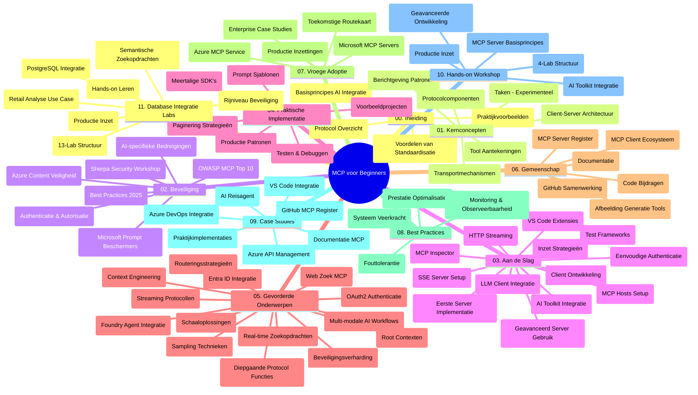

# Model Context Protocol (MCP) voor Beginners - Studiegids

Deze studiegids biedt een overzicht van de repositorystructuur en inhoud voor het curriculum "Model Context Protocol (MCP) voor Beginners". Gebruik deze gids om efficiënt door de repository te navigeren en optimaal gebruik te maken van de beschikbare bronnen.

## Overzicht van de Repository

Het Model Context Protocol (MCP) is een gestandaardiseerd raamwerk voor interacties tussen AI-modellen en clientapplicaties. Oorspronkelijk gemaakt door Anthropic, wordt MCP nu onderhouden door de bredere MCP-gemeenschap via de officiële GitHub-organisatie. Deze repository biedt een uitgebreid curriculum met praktische codevoorbeelden in C#, Java, JavaScript, Python en TypeScript, ontworpen voor AI-ontwikkelaars, systeemarchitecten en software engineers.

## Visuele Curriculumkaart

## Repositoriumstructuur

De repository is ingedeeld in elf hoofdsecties, elk gericht op verschillende aspecten van MCP:

1. **Inleiding (00-Introduction/)**
   - Overzicht van het Model Context Protocol
   - Waarom standaardisatie belangrijk is in AI-pijplijnen
   - Praktische use cases en voordelen

2. **Kernconcepten (01-CoreConcepts/)**
   - Client-serverarchitectuur
   - Belangrijke protocolcomponenten
   - Messagingpatronen in MCP

3. **Beveiliging (02-Security/)**
   - Beveiligingsbedreigingen in MCP-gebaseerde systemen
   - Best practices voor het beveiligen van implementaties
   - Authenticatie- en autorisatiestrategieën
   - **Uitgebreide beveiligingsdocumentatie**:
     - MCP Security Best Practices 2025
     - Azure Content Safety Implementatiegids
     - MCP Beveiligingscontroles en Technieken
     - MCP Best Practices Snelle Referentie
   - **Belangrijke beveiligingsthema’s**:
     - Promptinjection en toolvergiftigingsaanvallen
     - Sessiekaping en confused deputy-problemen
     - Token passthrough-kwetsbaarheden
     - Overmatige machtigingen en toegangscontrole
     - Supply chain-beveiliging voor AI-componenten
     - Microsoft Prompt Shields-integratie

4. **Aan de slag (03-GettingStarted/)**
   - Omgevingsinstellingen en configuratie
   - Basis MCP-servers en clients maken
   - Integratie met bestaande applicaties
   - Inclusief secties voor:
     - Eerste serverimplementatie
     - Clientontwikkeling
     - LLM-clientintegratie
     - VS Code-integratie
     - Server-Sent Events (SSE) server
     - Geavanceerd servergebruik
     - HTTP-streaming
     - AI Toolkit-integratie
     - Teststrategieën
     - Implementatierichtlijnen

5. **Praktische implementatie (04-PracticalImplementation/)**
   - Gebruik van SDK’s in verschillende programmeertalen
   - Debuggen, testen en validatietechnieken
   - Opstellen van herbruikbare promptsjablonen en workflows
   - Voorbeeldprojecten met implementatievoorbeelden

6. **Geavanceerde onderwerpen (05-AdvancedTopics/)**
   - Context engineering technieken
   - Foundry-agentintegratie
   - Multimodale AI-workflows
   - OAuth2 authenticatiedemo's
   - Real-time zoekmogelijkheden
   - Real-time streaming
   - Root context-implementaties
   - Routeringsstrategieën
   - Samplingmethoden
   - Schaalmethode
   - Beveiligingsoverwegingen
   - Entra ID beveiligingsintegratie
   - Webzoekintegratie

7. **Gemeenschapsbijdragen (06-CommunityContributions/)**
   - Hoe code en documentatie bij te dragen
   - Samenwerken via GitHub
   - Door de gemeenschap aangedreven verbeteringen en feedback
   - Gebruik van diverse MCP-clients (Claude Desktop, Cline, VSCode)
   - Werken met populaire MCP-servers inclusief beeldgeneratie

8. **Lessen uit vroege adoptie (07-LessonsfromEarlyAdoption/)**
   - Praktijkvoorbeelden en succesverhalen
   - Bouwen en uitrollen van MCP-gebaseerde oplossingen
   - Trends en toekomstige roadmap
   - **Microsoft MCP Servers Gids**: Uitgebreide gids voor 10 productieklare Microsoft MCP-servers inclusief:
     - Microsoft Learn Docs MCP Server
     - Azure MCP Server (15+ gespecialiseerde connectors)
     - GitHub MCP Server
     - Azure DevOps MCP Server
     - MarkItDown MCP Server
     - SQL Server MCP Server
     - Playwright MCP Server
     - Dev Box MCP Server
     - Azure AI Foundry MCP Server
     - Microsoft 365 Agents Toolkit MCP Server

9. **Best Practices (08-BestPractices/)**
   - Prestatieafstemming en optimalisatie
   - Ontwerpen van fouttolerante MCP-systemen
   - Test- en veerkrachtstrategieën

10. **Casestudy’s (09-CaseStudy/)**
    - **Zeven uitgebreide casestudy's** die de veelzijdigheid van MCP aantonen binnen diverse scenario's:
    - **Azure AI Travel Agents**: Multi-agent orkestratie met Azure OpenAI en AI Search
    - **Azure DevOps-integratie**: Automatiseren van workflowprocessen met YouTube-data-updates
    - **Realtime documentatie-opvraging**: Python consoleclient met HTTP-streaming
    - **Interactieve studieplangenerator**: Chainlit webapp met converserende AI
    - **In-editor documentatie**: VS Code-integratie met GitHub Copilot-workflows
    - **Azure API Management**: Enterprise API-integratie met MCP-servercreatie
    - **GitHub MCP Registry**: Ecosysteemontwikkeling en agentische integratieplatform
    - Implementatievoorbeelden variërend van enterprise-integratie, ontwikkelaarproductiviteit tot ecosysteemontwikkeling

11. **Praktische workshop (10-StreamliningAIWorkflowsBuildingAnMCPServerWithAIToolkit/)**
    - Uitgebreide praktische workshop die MCP combineert met AI Toolkit
    - Bouwen van intelligente applicaties die AI-modellen koppelen aan tools uit de echte wereld
    - Praktische modules met fundamenten, aangepaste serverontwikkeling en productiedeploymentsstrategieën
    - **Labstructuur**:
      - Lab 1: MCP Server Fundamentals
      - Lab 2: Geavanceerde MCP Serverontwikkeling
      - Lab 3: AI Toolkit-integratie
      - Lab 4: Productiedeployment en schaalbaarheid
    - Lab-gebaseerde leerbenadering met stapsgewijze instructies

12. **MCP Server Database Integratie Labs (11-MCPServerHandsOnLabs/)**
    - **Uitgebreide 13-lab leerroute** voor het bouwen van productieklare MCP-servers met PostgreSQL-integratie
    - **Praktische retail analytics-implementatie** met de Zava Retail use case
    - **Enterprise-grade patronen** inclusief Row Level Security (RLS), semantisch zoeken en multi-tenant data toegang
    - **Compleet labstructuur**:
      - **Labs 00-03: Fundamentals** - Introductie, Architectuur, Beveiliging, Omgevingsinstelling
      - **Labs 04-06: MCP Server bouwen** - Databaseontwerp, MCP Server-implementatie, Toolontwikkeling
      - **Labs 07-09: Geavanceerde functies** - Semantisch zoeken, testen & debuggen, VS Code-integratie
      - **Labs 10-12: Productie & Best practices** - Deployment, monitoring, optimalisatie
    - **Behandelde technologieën**: FastMCP framework, PostgreSQL, Azure OpenAI, Azure Container Apps, Application Insights
    - **Leeruitkomsten**: Productieklare MCP-servers, database-integratiepatronen, AI-gedreven analytics, enterprise beveiliging

## Aanvullende bronnen

De repository bevat ondersteunende bronnen:

- **Afbeeldingenmap**: Bevat diagrammen en illustraties die door het curriculum worden gebruikt
- **Vertalingen**: Meertalige ondersteuning met geautomatiseerde vertalingen van documentatie
- **Officiële MCP-bronnen**:
  - [MCP Documentatie](https://modelcontextprotocol.io/)
  - [MCP Specificatie](https://spec.modelcontextprotocol.io/)
  - [MCP GitHub Repository](https://github.com/modelcontextprotocol)

## Hoe deze repository te gebruiken

1. **Sequentieel leren**: Volg de hoofdstukken op volgorde (00 tot 11) voor een gestructureerde leerervaring.
2. **Taal-specifieke focus**: Als je geïnteresseerd bent in een specifieke programmeertaal, verken dan de voorbeeldmappen voor implementaties in je voorkeurstaal.
3. **Praktische implementatie**: Begin met de sectie "Aan de slag" om je omgeving op te zetten en je eerste MCP-server en client te maken.
4. **Geavanceerde verkenning**: Zodra je vertrouwd bent met de basis, ga door naar de geavanceerde onderwerpen om je kennis uit te breiden.
5. **Gemeenschapsbetrokkenheid**: Word lid van de MCP-gemeenschap via GitHub-discussies en Discord-kanalen om in contact te komen met experts en medeontwikkelaars.

## MCP Clients en Tools

Het curriculum behandelt diverse MCP-clients en tools:

1. **Officiële clients**:
   - Visual Studio Code
   - MCP in Visual Studio Code
   - Claude Desktop
   - Claude in VSCode
   - Claude API

2. **Gemeenschapclients**:
   - Cline (terminal-gebaseerd)
   - Cursor (code-editor)
   - ChatMCP
   - Windsurf

3. **MCP Management Tools**:
   - MCP CLI
   - MCP Manager
   - MCP Linker
   - MCP Router

## Populaire MCP-servers

De repository introduceert diverse MCP-servers, waaronder:

1. **Officiële Microsoft MCP-servers**:
   - Microsoft Learn Docs MCP Server
   - Azure MCP Server (15+ gespecialiseerde connectors)
   - GitHub MCP Server
   - Azure DevOps MCP Server
   - MarkItDown MCP Server
   - SQL Server MCP Server
   - Playwright MCP Server
   - Dev Box MCP Server
   - Azure AI Foundry MCP Server
   - Microsoft 365 Agents Toolkit MCP Server

2. **Officiële referentieservers**:
   - Filesysteem
   - Fetch
   - Memory
   - Sequential Thinking

3. **Beeldgeneratie**:
   - Azure OpenAI DALL-E 3
   - Stable Diffusion WebUI
   - Replicate

4. **Ontwikkeltools**:
   - Git MCP
   - Terminal Control
   - Code Assistant

5. **Gespecialiseerde servers**:
   - Salesforce
   - Microsoft Teams
   - Jira & Confluence

## Bijdragen

Deze repository verwelkomt bijdragen van de gemeenschap. Zie de sectie Gemeenschapsbijdragen voor richtlijnen over hoe je effectief kunt bijdragen aan het MCP-ecosysteem.

----

*Deze studiegids is voor het laatst bijgewerkt op 5 februari 2026, weerspiegelt de nieuwste MCP Specificatie 2025-11-25 en biedt een overzicht van de repository tot die datum. De inhoud van de repository kan na deze datum worden bijgewerkt.*

---

<!-- CO-OP TRANSLATOR DISCLAIMER START -->
**Disclaimer**:
Dit document is vertaald met behulp van de AI-vertalingsdienst [Co-op Translator](https://github.com/Azure/co-op-translator). Hoewel we streven naar nauwkeurigheid, dient u er rekening mee te houden dat automatische vertalingen fouten of onnauwkeurigheden kunnen bevatten. Het oorspronkelijke document in de oorspronkelijke taal wordt beschouwd als de gezaghebbende bron. Voor belangrijke informatie wordt professionele menselijke vertaling aanbevolen. Wij zijn niet aansprakelijk voor misverstanden of verkeerde interpretaties die voortkomen uit het gebruik van deze vertaling.
<!-- CO-OP TRANSLATOR DISCLAIMER END -->