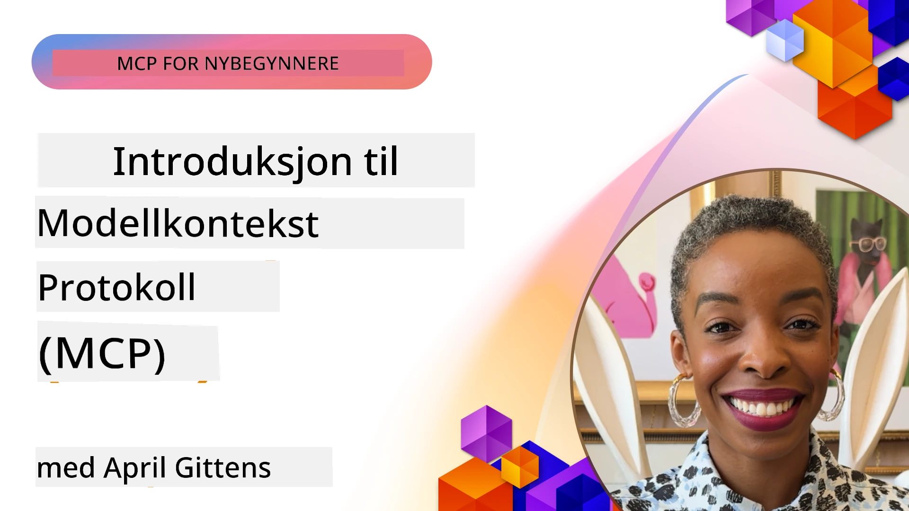
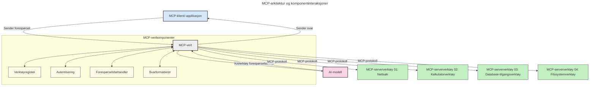

# Introduksjon til Model Context Protocol (MCP): Hvorfor det er viktig for skalerbare AI-applikasjoner

[](https://youtu.be/agBbdiOPLQA)

_(Klikk på bildet over for å se video av denne leksjonen)_

Generative AI-applikasjoner er et stort steg fremover, da de ofte lar brukeren samhandle med appen ved bruk av naturlige språkprompt. Men etter hvert som mer tid og ressurser investeres i slike apper, ønsker du å sikre at du enkelt kan integrere funksjoner og ressurser på en måte som gjør det lett å utvide, at appen din kan håndtere mer enn én modell, og håndtere forskjellige modellspesifika. Kort sagt, å bygge Gen AI-apper er enkelt i starten, men når de vokser og blir mer komplekse, må du begynne å definere en arkitektur og vil sannsynligvis trenge å stole på en standard for å sikre at appene dine er bygget på en konsistent måte. Her kommer MCP inn for å organisere ting og tilby en standard.

---

## **🔍 Hva er Model Context Protocol (MCP)?**

**Model Context Protocol (MCP)** er et **åpent, standardisert grensesnitt** som lar store språkmodeller (LLMs) interagere sømløst med eksterne verktøy, API-er og datakilder. Det gir en konsekvent arkitektur for å forbedre AI-modellers funksjonalitet utover deres treningsdata, noe som muliggjør smartere, skalerbare og mer responsive AI-systemer.

---

## **🎯 Hvorfor standardisering i AI er viktig**

Etter hvert som generative AI-applikasjoner blir mer komplekse, er det essensielt å adoptere standarder som sikrer **skalerbarhet, utvidbarhet, vedlikeholdbarhet** og **unngå leverandørlåsning**. MCP dekker disse behovene ved å:

- Forene modell-verktøy-integrasjoner
- Redusere skjøre, engangs skreddersydde løsninger
- Tillate at flere modeller fra forskjellige leverandører kan eksistere i ett økosystem

**Merk:** Selv om MCP omtaler seg selv som en åpen standard, er det ingen planer om å standardisere MCP gjennom eksisterende standardiseringsorganer som IEEE, IETF, W3C, ISO eller andre standardorganer.

---

## **📚 Læringsmål**

Innen slutten av denne artikkelen vil du kunne:

- Definere **Model Context Protocol (MCP)** og dets bruksområder
- Forstå hvordan MCP standardiserer kommunikasjon mellom modell og verktøy
- Identifisere kjernekomponentene i MCP-arkitekturen
- Utforske virkelige anvendelser av MCP i bedrifts- og utviklingssammenhenger

---

## **💡 Hvorfor Model Context Protocol (MCP) er en banebryter**

### **🔗 MCP løser fragmentering i AI-interaksjoner**

Før MCP krevde integrasjon av modeller med verktøy:

- Egen kode per verktøy-modell-par
- Ikke-standardiserte API-er for hver leverandør
- Hyppige brudd ved oppdateringer
- Dårlig skalerbarhet med flere verktøy

### **✅ Fordeler med MCP-standardisering**

| **Fordel**               | **Beskrivelse**                                                               |
|-------------------------|-------------------------------------------------------------------------------|
| Interoperabilitet        | LLMer fungerer sømløst med verktøy på tvers av forskjellige leverandører     |
| Konsistens               | Enhetlig oppførsel på tvers av plattformer og verktøy                        |
| Gjenbrukbarhet           | Verktøy bygget én gang kan brukes på tvers av prosjekter og systemer         |
| Raskere utvikling        | Redusert utviklingstid ved bruk av standardiserte, plug-and-play-grensesnitt |

---

## **🧱 Høy-nivås oversikt over MCP-arkitektur**

MCP følger en **klient-server-modell**, hvor:

- **MCP Hosts** kjører AI-modellene
- **MCP Clients** initierer forespørsler
- **MCP Servers** leverer kontekst, verktøy og funksjonalitet

### **Hovedkomponenter:**

- **Ressurser** – Statisk eller dynamisk data for modeller  
- **Prompter** – Forhåndsdefinerte arbeidsflyter for styrt generering  
- **Verktøy** – Kjørbare funksjoner som søk, beregninger  
- **Sampling** – Agentatferd via rekursive interaksjoner
- **Elicitation** – Server-initierte forespørsler om brukerinput
- **Roots** – Filssystemgrenser for servertilgangskontroll

### **Protokollarkitektur:**

MCP benytter en to-lags arkitektur:
- **Data-laget**: JSON-RPC 2.0 basert kommunikasjon med livssyklusstyring og primitiv
- **Transport-laget**: STDIO (lokal) og Streamable HTTP med SSE (fjernkommunikasjon)

---

## Hvordan MCP-servere fungerer

MCP-servere fungerer på følgende måte:

- **Forespørselsflyt**:
    1. En forespørsel initieres av en sluttbruker eller programvare som handler på deres vegne.
    2. **MCP-klienten** sender forespørselen til en **MCP Host**, som styrer AI-modellens kjøring.
    3. **AI-modellen** mottar brukerprompten og kan be om tilgang til eksterne verktøy eller data via ett eller flere verktøykall.
    4. **MCP Host**, ikke modellen direkte, kommuniserer med passende **MCP Server(e)** ved bruk av den standardiserte protokollen.
- **MCP Host-funksjonalitet**:
    - **Verktøyregister**: Opprettholder en katalog over tilgjengelige verktøy og deres funksjoner.
    - **Autentisering**: Bekrefter tillatelser for verktøytildgang.
    - **Forespørselsbehandler**: Håndterer innkommende verktøyforespørsler fra modellen.
    - **Svarformatterer**: Formaterer verktøyutdata i et format modellen kan forstå.
- **Kjøring av MCP Server**:
    - **MCP Host** ruter verktøykall til en eller flere **MCP Servere**, som hver eksponerer spesialiserte funksjoner (f.eks. søk, beregninger, databaseforespørsler).
    - **MCP Servere** utfører sine respektive operasjoner og returnerer resultater til **MCP Host** i et konsistent format.
    - **MCP Host** formaterer og videresender disse resultatene til **AI-modellen**.
- **Ferdigstillelse av svar**:
    - **AI-modellen** inkorporerer verktøyutdata i et endelig svar.
    - **MCP Host** sender dette svaret tilbake til **MCP-klienten**, som leverer det til sluttbrukeren eller kallende programvare.
    


## 👨‍💻 Hvordan bygge en MCP-server (med eksempler)

MCP-servere lar deg utvide LLMs evner ved å tilby data og funksjonalitet. 

Klar til å prøve? Her er språk- og/eller stack-spesifikke SDK-er med eksempler på å lage enkle MCP-servere i ulike språk/stacks:

- **Python SDK**: https://github.com/modelcontextprotocol/python-sdk

- **TypeScript SDK**: https://github.com/modelcontextprotocol/typescript-sdk

- **Java SDK**: https://github.com/modelcontextprotocol/java-sdk

- **C#/.NET SDK**: https://github.com/modelcontextprotocol/csharp-sdk


## 🌍 Virkelige brukstilfeller for MCP

MCP muliggjør en rekke applikasjoner ved å utvide AI-funksjonalitet:

| **Bruksområde**             | **Beskrivelse**                                                                |
|----------------------------|--------------------------------------------------------------------------------|
| Enterprise Data Integration | Koble LLMer til databaser, CRM-er, eller interne verktøy                      |
| Agentiske AI-systemer       | Muliggjør autonome agenter med verktøystøtte og beslutningsflyt               |
| Multimodale applikasjoner   | Kombiner tekst, bilde og lydverktøy i én samlet AI-app                        |
| Sanntidsdata-integrasjon    | Bringe levende data inn i AI-interaksjoner for mer nøyaktige, aktuelle output |

### 🧠 MCP = Universell standard for AI-interaksjoner

Model Context Protocol (MCP) fungerer som en universell standard for AI-interaksjoner, på samme måte som USB-C standardiserte fysiske tilkoblinger for enheter. I AI-verdenen gir MCP et konsekvent grensesnitt, som lar modeller (klienter) integrere sømløst med eksterne verktøy og dataleverandører (servere). Dette eliminerer behovet for diverse, tilpassede protokoller for hver API eller datakilde.

Under MCP følger et MCP-kompatibelt verktøy (referert til som en MCP-server) en samlet standard. Disse serverne kan liste opp verktøy eller handlinger de tilbyr og utføre disse når en AI-agent ber om det. AI-agent-plattformer som støtter MCP kan oppdage tilgjengelige verktøy fra serverne og påkalle dem gjennom denne standardprotokollen.

### 💡 Legger til rette for kunnskapstilgang

Utover å tilby verktøy, legger MCP også til rette for tilgang til kunnskap. Det gjør det mulig for applikasjoner å gi kontekst til store språkmodeller (LLMs) ved å koble dem til ulike datakilder. For eksempel kan en MCP-server representere et selskaps dokumentlager, som lar agenter hente relevant informasjon på forespørsel. En annen server kan håndtere spesifikke handlinger som å sende e-post eller oppdatere oppføringer. Fra agentens perspektiv er dette helt enkelt verktøy den kan bruke – noen verktøy returnerer data (kunnskapskontekst), mens andre utfører handlinger. MCP håndterer begge effektivt.

En agent som kobler til en MCP-server lærer automatisk serverens tilgjengelige kapabiliteter og tilgjengelige data via et standardformat. Denne standardiseringen muliggjør dynamisk verktøystøtte. For eksempel gjør det å legge til en ny MCP-server i et agentsystem funksjonene umiddelbart tilgjengelige uten behov for videre tilpasning av agentens instruksjoner.

Denne strømlinjeformede integrasjonen følger flyten vist i diagrammet under, hvor servere tilbyr både verktøy og kunnskap, noe som sikrer sømløst samarbeid på tvers av systemer.

### 👉 Eksempel: Skalerbar agentløsning

```mermaid
---
title: Skalerbar agentløsning med MCP
description: Et diagram som illustrerer hvordan en bruker samhandler med en LLM som kobler til flere MCP-servere, hvor hver server tilbyr både kunnskap og verktøy, og skaper en skalerbar AI-systemarkitektur
---
graph TD
    User -->|Prompt| LLM
    LLM -->|Respons| User
    LLM -->|MCP| ServerA
    LLM -->|MCP| ServerB
    ServerA -->|Universalkonnektor| ServerB
    ServerA --> KnowledgeA
    ServerA --> ToolsA
    ServerB --> KnowledgeB
    ServerB --> ToolsB

    subgraph Server A
        KnowledgeA[Kunnskap]
        ToolsA[Verktøy]
    end

    subgraph Server B
        KnowledgeB[Kunnskap]
        ToolsB[Verktøy]
    end
```Universal Connector gir MCP-servere mulighet til å kommunisere og dele kapabiliteter med hverandre, slik at ServerA kan delegere oppgaver til ServerB eller få tilgang til dens verktøy og kunnskap. Dette federerer verktøy og data på tvers av servere, og støtter skalerbare og modulære agentarkitekturer. Fordi MCP standardiserer verktøyeksponering, kan agenter dynamisk oppdage og rute forespørsler mellom servere uten hardkodede integrasjoner.

Verktøy- og kunnskapsfederasjon: Verktøy og data kan nås på tvers av servere, hvilket muliggjør mer skalerbare og modulære agentiske arkitekturer.

### 🔄 Avanserte MCP-scenarier med klientbasert LLM-integrasjon

Utover den grunnleggende MCP-arkitekturen finnes avanserte scenarier hvor både klient og server inneholder LLM-er, noe som muliggjør mer avanserte interaksjoner. I diagrammet nedenfor kan **Client App** være et IDE med flere MCP-verktøy tilgjengelige for brukeren av LLM:

```mermaid
---
title: Avanserte MCP-scenarier med klient-server LLM-integrasjon
description: Et sekvensdiagram som viser den detaljerte samhandlingsflyten mellom bruker, klientapplikasjon, klient-LLM, flere MCP-servere og server-LLM, som illustrerer verktøyoppdagelse, brukerinteraksjon, direkte verktøysamtaler og funksjonsforhandlingsfaser
---
sequenceDiagram
    autonumber
    actor User as 👤 Bruker
    participant ClientApp as 🖥️ Klientapp
    participant ClientLLM as 🧠 Klient-LLM
    participant Server1 as 🔧 MCP-server 1
    participant Server2 as 📚 MCP-server 2
    participant ServerLLM as 🤖 Server-LLM
    
    %% Discovery Phase
    rect rgb(220, 240, 255)
        Note over ClientApp, Server2: VERKTØYOPPDAGELSESFASE
        ClientApp->>+Server1: Be om tilgjengelige verktøy/ressurser
        Server1-->>-ClientApp: Returner verktøyliste (JSON)
        ClientApp->>+Server2: Be om tilgjengelige verktøy/ressurser
        Server2-->>-ClientApp: Returner verktøyliste (JSON)
        Note right of ClientApp: Lagre kombinert verktøy<br/>katalog lokalt
    end
    
    %% User Interaction
    rect rgb(255, 240, 220)
        Note over User, ClientLLM: BRUKERINTERAKSJONSFASE
        User->>+ClientApp: Skriv inn naturlig språk-prompt
        ClientApp->>+ClientLLM: Send prompt + verktøykatalog
        ClientLLM->>-ClientLLM: Analyser prompt & velg verktøy
    end
    
    %% Scenario A: Direct Tool Calling
    alt Direkte verktøysamtale
        rect rgb(220, 255, 220)
            Note over ClientApp, Server1: SCENARIO A: DIREKTE VERKTØYSAMTALE
            ClientLLM->>+ClientApp: Be om verktøykjøring
            ClientApp->>+Server1: Utfør spesifikt verktøy
            Server1-->>-ClientApp: Returner resultater
            ClientApp->>+ClientLLM: Behandle resultater
            ClientLLM-->>-ClientApp: Generer svar
            ClientApp-->>-User: Vis endelig svar
        end
    
    %% Scenario B: Feature Negotiation (VS Code style)
    else Funksjonsforhandling (VS Code-stil)
        rect rgb(255, 220, 220)
            Note over ClientApp, ServerLLM: SCENARIO B: FUNKSJONSFORHANDLING
            ClientLLM->>+ClientApp: Identifiser nødvendige funksjoner
            ClientApp->>+Server2: Forhandle funksjoner/kapasiteter
            Server2->>+ServerLLM: Be om ytterligere kontekst
            ServerLLM-->>-Server2: Gi kontekst
            Server2-->>-ClientApp: Returner tilgjengelige funksjoner
            ClientApp->>+Server2: Kall forhandlede verktøy
            Server2-->>-ClientApp: Returner resultater
            ClientApp->>+ClientLLM: Behandle resultater
            ClientLLM-->>-ClientApp: Generer svar
            ClientApp-->>-User: Vis endelig svar
        end
    end
```
## 🔐 Praktiske fordeler med MCP

Her er de praktiske fordelene ved å bruke MCP:

- **Oppdatert informasjon**: Modeller kan få tilgang til oppdatert informasjon utover treningsdataene
- **Utvidede funksjoner**: Modeller kan bruke spesialiserte verktøy for oppgaver de ikke er trent for
- **Reduserte hallusinasjoner**: Eksterne datakilder gir faktabasert forankring
- **Personvern**: Sensitive data kan forbli innen sikre miljøer i stedet for å være innebygd i prompt

## 📌 Viktige poenger

Følgende er nøkkelpunkter for bruk av MCP:

- **MCP** standardiserer hvordan AI-modeller interagerer med verktøy og data
- Fremmer **utvidbarhet, konsistens og interoperabilitet**
- MCP hjelper til med å **redusere utviklingstid, forbedre pålitelighet og utvide modellfunksjoner**
- Klient-server-arkitekturen **muliggjør fleksible, utvidbare AI-applikasjoner**

## 🧠 Øvelse

Tenk på en AI-applikasjon du er interessert i å bygge.

- Hvilke **eksterne verktøy eller data** kan forbedre dens funksjonalitet?
- Hvordan kan MCP gjøre integrasjonen **enklere og mer pålitelig?**

## Ekstra ressurser

- [MCP GitHub-repositorium](https://github.com/modelcontextprotocol)


## Hva er neste

Neste: [Kapittel 1: Kjernebegreper](../01-CoreConcepts/README.md)

---

<!-- CO-OP TRANSLATOR DISCLAIMER START -->
**Ansvarsfraskrivelse**:
Dette dokumentet er oversatt ved hjelp av AI-oversettelsestjenesten [Co-op Translator](https://github.com/Azure/co-op-translator). Selv om vi streber etter nøyaktighet, vennligst vær oppmerksom på at automatiske oversettelser kan inneholde feil eller unøyaktigheter. Det originale dokumentet på dets opprinnelige språk bør betraktes som den autoritative kilden. For kritisk informasjon anbefales profesjonell menneskelig oversettelse. Vi er ikke ansvarlige for eventuelle misforståelser eller feiltolkninger som oppstår ved bruk av denne oversettelsen.
<!-- CO-OP TRANSLATOR DISCLAIMER END -->