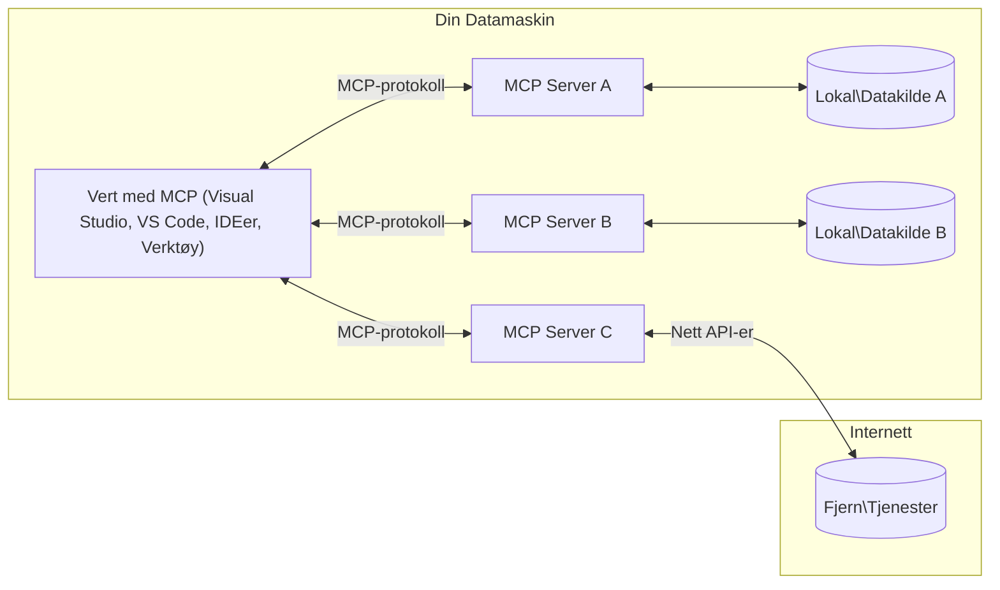

# MCP Core Concepts: Mester i Model Context Protocol for AI-integrasjon

[](https://youtu.be/earDzWGtE84)

_(Klikk på bildet ovenfor for å se video av denne leksjonen)_

[Model Context Protocol (MCP)](https://github.com/modelcontextprotocol) er en kraftfull, standardisert ramme som optimaliserer kommunikasjon mellom store språkmodeller (LLMs) og eksterne verktøy, applikasjoner og datakilder.  
Denne guiden vil lede deg gjennom kjernebegrepene i MCP. Du vil lære om klient-server-arkitekturen, essensielle komponenter, kommunikasjonsmekanismer og beste praksis for implementering.

- **Eksplisitt Brukersamtykke**: All data-tilgang og operasjoner krever eksplisitt godkjenning fra brukeren før utførelse. Brukere må tydelig forstå hvilke data som vil bli aksessert og hvilke handlinger som vil bli utført, med detaljert kontroll over tillatelser og autorisasjoner.

- **Datasikkerhet og Personvern**: Brukerdata kun eksponeres med eksplisitt samtykke og må beskyttes av robuste tilgangskontroller gjennom hele interaksjonslivssyklusen. Implementeringer må forhindre uautorisert datatransmisjon og opprettholde strenge personverngrenser.

- **Sikkerhet ved Verktøyutførelse**: Hver verktøyanrop krever eksplisitt brukersamtykke med klar forståelse av verktøyets funksjonalitet, parametere og potensielle konsekvenser. Robuste sikkerhetsgrenser må forhindre utilsiktet, usikker eller ondsinnet verktøyutførelse.

- **Transportlagsikkerhet**: Alle kommunikasjonskanaler bør bruke passende kryptering og autentiseringsmekanismer. Eksterne tilkoblinger bør implementere sikre transportprotokoller og riktig håndtering av legitimasjon.

#### Implementeringsretningslinjer:

- **Tillatelsesstyring**: Implementer finmasket tillatelsessystem som lar brukerne kontrollere hvilke servere, verktøy og ressurser som er tilgjengelige  
- **Autentisering og Autorisasjon**: Bruk sikre autentiseringsmetoder (OAuth, API-nøkler) med riktig token-håndtering og utløp  
- **Inputvalidering**: Valider alle parametere og data-input i henhold til definerte skjemaer for å forhindre injeksjonsangrep  
- **Revisjonslogg**: Oppretthold omfattende logger av alle operasjoner for sikkerhetsovervåkning og samsvar

## Oversikt

Denne leksjonen utforsker den grunnleggende arkitekturen og komponentene som utgjør Model Context Protocol (MCP) økosystemet. Du vil lære om klient-server-arkitektur, nøkkelkomponenter og kommunikasjonsmekanismer som driver MCP-interaksjoner.

## Viktige læringsmål

Etter denne leksjonen vil du:

- Forstå MCPs klient-server-arkitektur.  
- Identifisere roller og ansvar for Hosts, Clients og Servers.  
- Analysere kjernegenskaper som gjør MCP til et fleksibelt integrasjonslag.  
- Lære hvordan informasjon flyter i MCP-økosystemet.  
- Få praktiske innsikter via kodeeksempler i .NET, Java, Python og JavaScript.

## MCP-arkitektur: Et dypere blikk

MCP-økosystemet er bygget på en klient-server-modell. Denne modulære strukturen gjør at AI-applikasjoner effektivt kan interagere med verktøy, databaser, APIer og kontekstuelle ressurser. La oss dele denne arkitekturen inn i kjernekomponentene.

I kjernen følger MCP en klient-server-arkitektur der en vertapplikasjon kan koble til flere servere:


- **MCP Hosts**: Programmer som VSCode, Claude Desktop, IDEer eller AI-verktøy som ønsker å få tilgang til data gjennom MCP  
- **MCP Clients**: Protokollklienter som opprettholder 1:1-tilkoblinger til servere  
- **MCP Servers**: Letteviktige programmer som hver eksponerer spesifikke funksjoner gjennom den standardiserte Model Context Protocol  
- **Lokale Datakilder**: Filene, databasene og tjenestene på din datamaskin som MCP-servere sikkert kan aksessere  
- **Eksterne Tjenester**: Eksterne systemer tilgjengelige over internett som MCP-servere kan koble til via APIer.

MCP-protokollen er en kontinuerlig utviklet standard med datobasert versjonering (YYYY-MM-DD-format). Den nåværende protokollversjonen er **2025-11-25**. Du kan se de siste oppdateringene i [protokollspesifikasjonen](https://modelcontextprotocol.io/specification/2025-11-25/)

### 1. Hosts

I Model Context Protocol (MCP) er **Hosts** AI-applikasjoner som fungerer som det primære grensesnittet brukerne interagerer med protokollen gjennom. Hosts koordinerer og administrerer tilkoblinger til flere MCP-servere ved å opprette dedikerte MCP-klienter for hver servertilkobling. Eksempler på Hosts inkluderer:

- **AI-applikasjoner**: Claude Desktop, Visual Studio Code, Claude Code  
- **Utviklingsmiljøer**: IDEer og kodeeditorer med MCP-integrasjon  
- **Egendefinerte applikasjoner**: Formålsbygde AI-agenter og verktøy

**Hosts** er applikasjoner som koordinerer AI-modellinteraksjoner. De:

- **Orkestrerer AI-modeller**: Kjører eller kommuniserer med LLMer for å generere svar og koordinere AI-arbeidsflyter  
- **Administrerer klienttilkoblinger**: Oppretter og vedlikeholder én MCP-klient per MCP-servertilkobling  
- **Kontrollerer brukergrensesnitt**: Håndterer samtaleflyt, brukerinteraksjoner og responsvisning  
- **Håndhever sikkerhet**: Kontrollerer tillatelser, sikkerhetsbegrensninger og autentisering  
- **Håndterer brukersamtykke**: Administrerer brukerens godkjenning for datadeling og verktøykjøring

### 2. Clients

**Clients** er essensielle komponenter som opprettholder dedikerte én-til-én-tilkoblinger mellom Hosts og MCP-servere. Hver MCP-klient initieres av Host for å koble til en spesifikk MCP-server, noe som sikrer organiserte og sikre kommunikasjonskanaler. Flere klienter gjør det mulig for Hosts å koble til flere servere samtidig.

**Clients** er koblingskomponenter innenfor vertapplikasjonen. De:

- **Protokollkommunikasjon**: Sender JSON-RPC 2.0-forespørsler til servere med prompts og instruksjoner  
- **Funksjonsforhandling**: Forhandler om støttede funksjoner og protokollversjoner med servere under initiering  
- **Verktøyutførelse**: Håndterer verktøyspørringer fra modeller og prosesserer svar  
- **Sanntidsoppdateringer**: Håndterer varsler og sanntidsoppdateringer fra servere  
- **Responsbehandling**: Prosesserer og formaterer serversvar for visning til brukere

### 3. Servers

**Servers** er programmer som tilbyr kontekst, verktøy og funksjonaliteter til MCP-klienter. De kan kjøres lokalt (på samme maskin som Host) eller eksternt (på eksterne plattformer) og er ansvarlige for å håndtere klientforespørsler og gi strukturerte svar. Servere eksponerer spesifikke funksjoner gjennom den standardiserte Model Context Protocol.

**Servers** er tjenester som tilbyr kontekst og kapasiteter. De:

- **Funksjonsregistrering**: Registrerer og eksponerer tilgjengelige primitiv (ressurser, prompts, verktøy) til klienter  
- **Forespørselsbehandling**: Mottar og utfører verktøy-kall, ressursforespørsler og prompt-forespørsler fra klienter  
- **Konteksttilgangspunkt**: Gir kontekstuell informasjon og data for å forbedre modelsvar  
- **Tilstandshåndtering**: Opprettholder sesjonstilstand og håndterer tilstandsbaserte interaksjoner ved behov  
- **Sanntidsvarslinger**: Sender varsler om endringer i kapasiteter og oppdateringer til tilkoblede klienter

Servere kan utvikles av hvem som helst for å utvide modellkapabiliteter med spesialisert funksjonalitet, og de støtter både lokale og eksterne driftsmiljøer.

### 4. Server Primitives

Servere i Model Context Protocol (MCP) leverer tre kjerne-**primitiver** som definerer grunnleggende byggeklosser for rike interaksjoner mellom klienter, hosts og språkmodeller. Disse primitivene spesifiserer hvilke typer kontekstuell informasjon og handlinger som er tilgjengelige gjennom protokollen.

MCP-servere kan eksponere en hvilken som helst kombinasjon av følgende tre kjerne-primitiver:

#### Ressurser 

**Ressurser** er datakilder som gir kontekstuell informasjon til AI-applikasjoner. De representerer statisk eller dynamisk innhold som kan forbedre modellens forståelse og beslutningstaking:

- **Kontekstuell data**: Strukturert informasjon og kontekst for AI-modellens konsum  
- **Kunnskapsbaser**: Dokumentarkiver, artikler, manualer og forskningspublikasjoner  
- **Lokale datakilder**: Filer, databaser og lokale systeminformasjon  
- **Eksterne data**: API-svar, webtjenester og eksterne systemdata  
- **Dynamisk innhold**: Sanntidsdata som oppdateres basert på eksterne forhold

Ressurser identifiseres via URIer og støtter oppdagelse gjennom `resources/list` og henting via `resources/read`-metoder:

```text
file://documents/project-spec.md
database://production/users/schema
api://weather/current
```

#### Prompts

**Prompts** er gjenbrukbare maler som hjelper til med å strukturere interaksjoner med språkmodeller. De gir standardiserte interaksjonsmønstre og malbaserte arbeidsflyter:

- **Malbaserte interaksjoner**: Forhåndsstrukturerte meldinger og samtalestartere  
- **Arbeidsflytmaler**: Standardiserte sekvenser for vanlige oppgaver og interaksjoner  
- **Få-skudd-eksempler**: Maler basert på eksempler for modellinstruksjon  
- **Systemprompts**: Grunnleggende prompts som definerer modelladferd og kontekst  
- **Dynamiske maler**: Parametriserte prompts som tilpasses spesifikk kontekst

Prompts støtter variabelsubstitusjon og kan oppdages via `prompts/list` og hente med `prompts/get`:

```markdown
Generate a {{task_type}} for {{product}} targeting {{audience}} with the following requirements: {{requirements}}
```

#### Verktøy

**Verktøy** er kjørbare funksjoner som AI-modeller kan påkalle for å utføre spesifikke handlinger. De representerer "verbene" i MCP-økosystemet, og gjør det mulig for modeller å interagere med eksterne systemer:

- **Kjørbare funksjoner**: Diskrete operasjoner som modeller kan påkalle med spesifikke parametere  
- **Integrasjon med eksterne systemer**: API-kall, databaseforespørsler, filoperasjoner, beregninger  
- **Unik identitet**: Hvert verktøy har et distinkt navn, beskrivelse og parameter-skjema  
- **Strukturert I/O**: Verktøy tar imot validerte parametere og returnerer strukturerte, typede svar  
- **Handlingskapasitet**: Gjør det mulig for modeller å utføre virkelige handlinger og hente levende data

Verktøy defineres med JSON Schema for parameter-validering og oppdages gjennom `tools/list` og utføres via `tools/call`. Verktøy kan også inkludere **ikoner** som tilleggsmmetadata for bedre UI-presentasjon.

**Verktøyanmerkninger**: Verktøy støtter adferdsanmerkninger (f.eks. `readOnlyHint`, `destructiveHint`) som beskriver om et verktøy er skrivebeskyttet eller destruktivt, hvilket hjelper klienter til å ta informerte avgjørelser ved verktøyutførelse.

Eksempel på verktøydefinisjon:

```typescript
server.tool(
  "search_products", 
  {
    query: z.string().describe("Search query for products"),
    category: z.string().optional().describe("Product category filter"),
    max_results: z.number().default(10).describe("Maximum results to return")
  }, 
  async (params) => {
    // Utfør søk og returner strukturerte resultater
    return await productService.search(params);
  }
);
```

## Klientprimitiver

I Model Context Protocol (MCP) kan **klienter** eksponere primitiv som gjør det mulig for servere å be om tilleggskapabiliteter fra vertapplikasjonen. Disse klient-sidige primitivene gir rikere, mer interaktive serverimplementasjoner som kan aksessere AI-modellkapasiteter og brukerinteraksjoner.

### Sampling

**Sampling** gjør det mulig for servere å be om fullføringer fra språkmodellen i klientens AI-applikasjon. Denne primitiven åpner for at servere kan aksessere LLM-kapasitet uten å bygge inn egne modellavhengigheter:

- **Modelluavhengig tilgang**: Servere kan be om fullføringer uten å inkludere LLM-SDKer eller administrere modelltilgang  
- **Serverinitiert AI**: Gjøres mulig for servere å autonomt generere innhold ved bruk av klientens AI-modell  
- **Rekursiv LLM-interaksjon**: Støtter komplekse scenarioer der servere trenger AI-hjelp for behandling  
- **Dynamisk innholdsgenerering**: Lar servere lage kontekstuelle svar med vertens modell  
- **Støtte for verktøypårop**: Servere kan inkludere `tools` og `toolChoice`-parametere for å la klientens modell påkalle verktøy under sampling

Sampling initieres via `sampling/complete`-metoden, der servere sender fullføringsforespørsler til klienter.

### Roots

**Roots** gir en standardisert måte for klienter å eksponere filsystemgrenser til servere, slik at servere kan forstå hvilke kataloger og filer de har tilgang til:

- **Filsystemgrenser**: Definerer grensene for hvor servere kan operere i filsystemet  
- **Tilgangskontroll**: Hjelper servere til å forstå hvilke kataloger og filer de har tillatelse til å aksessere  
- **Dynamiske oppdateringer**: Klienter kan varsle servere når listen over roots endres  
- **URI-basert identifikasjon**: Roots bruker `file://` URIer for å identifisere tilgjengelige kataloger og filer

Roots oppdages gjennom `roots/list`-metoden, med klienter som sender `notifications/roots/list_changed` når roots endres.

### Elicitation  

**Elicitation** gjør det mulig for servere å be om tilleggsinformasjon eller brukerbekreftelse via klientgrensesnittet:

- **Forespørsler om brukerinput**: Servere kan be om tilleggsinformasjon når det er nødvendig for verktøyutførelse  
- **Bekreftelsesdialoger**: Forespør brukerens godkjenning for sensitive eller avgjørende operasjoner  
- **Interaktive arbeidsflyter**: Gjør servere i stand til å lage steg-for-steg brukerinteraksjoner  
- **Dynamisk parameterinnsamling**: Samler manglende eller valgfrie parametere under verktøyutførelse

Elicitation-forespørsler gjøres med `elicitation/request`-metoden for å samle brukerinput via klientens grensesnitt.

**URL Mode Elicitation**: Servere kan også be om URL-baserte brukerinteraksjoner, som lar servere lede brukere til eksterne nettsider for autentisering, bekreftelse eller datainnsamling.

### Logging

**Logging** gjør det mulig for servere å sende strukturerte loggmeldinger til klienter for feilsøking, overvåkning og operasjonell synlighet:

- **Feilsøkingsstøtte**: Gir servere mulighet til å levere detaljerte utførelseslogger for problemløsning  
- **Driftsovervåkning**: Sender statusoppdateringer og ytelsesmetrikker til klienter  
- **Feilmelding**: Gir detaljert feilkontekst og diagnostisk informasjon  
- **Revisjonsspor**: Oppretter omfattende logger over serveroperasjoner og beslutninger

Loggmeldinger sendes til klienter for å gi åpenhet rundt serveroperasjoner og legge til rette for feilsøking.

## Informasjonsflyt i MCP

Model Context Protocol (MCP) definerer en strukturert informasjonsflyt mellom hosts, clients, servers og modeller. Å forstå denne flyten hjelper med å klargjøre hvordan brukerspørringer behandles og hvordan eksterne verktøy og data integreres i modelsvar.

- **Verten initierer tilkobling**  
  Vertapplikasjonen (slik som en IDE eller chattegrensesnitt) etablerer en tilkobling til en MCP-server, vanligvis via STDIO, WebSocket eller annen støttet transport.

- **Funksjonsforhandling**  
  Klienten (innebygd i verten) og serveren utveksler informasjon om hvilke funksjoner, verktøy, ressurser og protokollversjoner de støtter. Dette sikrer at begge parter forstår hvilke kapabiliteter som er tilgjengelige for økten.

- **Brukerspørring**  
  Brukeren interagerer med verten (f.eks. skriver inn en prompt eller kommando). Vert samler opp denne inputen og sender den videre til klienten for behandling.

- **Ressurs- eller verktøybruk**  
  - Klienten kan be om ekstra kontekst eller ressurser fra serveren (slik som filer, databaseoppføringer eller kunnskapsbaseartikler) for å berike modellens forståelse.  
  - Hvis modellen bestemmer at et verktøy er nødvendig (f.eks. for å hente data, utføre en beregning eller kalle et API), sender klienten en verktøyinnkallingsforespørsel til serveren, med spesifisering av verktøynavn og parametere.

- **Serverutførelse**  
Serveren mottar ressurs- eller verktøyforespørselen, utfører de nødvendige operasjonene (for eksempel kjører en funksjon, spør en database, eller henter en fil), og returnerer resultatene til klienten i et strukturert format.

- **Responsgenerering**  
  Klienten integrerer serverens responser (ressursdata, verktøyutdata osv.) i den pågående modellinteraksjonen. Modellen bruker denne informasjonen til å generere et omfattende og kontekstuelt relevant svar.

- **Resultatpresentasjon**  
  Vertsmaskinen mottar det endelige resultatet fra klienten og presenterer det for brukeren, ofte inkludert både modellens genererte tekst og eventuelle resultater fra verktøykjøringer eller ressursoppslag.

Dette flyten gjør det mulig for MCP å støtte avanserte, interaktive og kontekstbevisste AI-applikasjoner ved å sømløst koble modeller med eksterne verktøy og datakilder.

## Protokollarkitektur og lag

MCP består av to distinkte arkitekturlag som samarbeider for å tilby en komplett kommunikasjonsramme:

### Datalag

**Datalaget** implementerer kjernen i MCP-protokollen med **JSON-RPC 2.0** som grunnlag. Dette laget definerer meldingsstruktur, semantikk og interaksjonsmønstre:

#### Kjernekomponenter:

- **JSON-RPC 2.0-protokoll**: All kommunikasjon bruker standardisert JSON-RPC 2.0 meldingsformat for metodekall, svar og varsler  
- **Livssyklushåndtering**: Håndterer tilkoblingsinitialisering, kapabilitetsforhandling og sesjonsavslutning mellom klienter og servere  
- **Serverprimitiver**: Gjør det mulig for servere å tilby grunnleggende funksjonalitet via verktøy, ressurser og prompts  
- **Klientprimitiver**: Gjør det mulig for servere å be om sampling fra LLM-er, innhente brukerinput og sende loggmeldinger  
- **Sanntidsvarsler**: Støtter asynkrone varsler for dynamiske oppdateringer uten behov for polling

#### Nøkkelfunksjoner:

- **Protokollversjonsforhandling**: Benytter datobasert versjonering (ÅÅÅÅ-MM-DD) for å sikre kompatibilitet  
- **Kapabilitetsoppdagelse**: Klienter og servere utveksler informasjon om støttede funksjoner under initialisering  
- **Tilstandsholdende sesjoner**: Opprettholder tilkoblingsstatus over flere interaksjoner for kontekstuelt kontinuitet

### Transportlag

**Transportlaget** håndterer kommunikasjonskanaler, meldingsinnramming og autentisering mellom MCP-deltakere:

#### Støttede transportmekanismer:

1. **STDIO-transport**:
   - Bruker standard inn-/ut-strømmer for direkte prosesskommunikasjon  
   - Optimal for lokale prosesser på samme maskin uten nettverkskostnader  
   - Vanlig brukt for lokale MCP-serverimplementasjoner

2. **Streambar HTTP-transport**:
   - Bruker HTTP POST for klient-til-server meldinger  
   - Valgfri Server-Sent Events (SSE) for server-til-klient streaming  
   - Muliggjør fjernserverkommunikasjon over nettverk  
   - Støtter standard HTTP-autentisering (bearer tokens, API-nøkler, egendefinerte headere)  
   - MCP anbefaler OAuth for sikker tokenbasert autentisering

#### Transportabstraksjon:

Transportlaget abstraherer kommunikasjonsdetaljer fra datalaget, noe som muliggjør samme JSON-RPC 2.0 meldingsformat over alle transportmekanismer. Denne abstraksjonen lar applikasjoner enkelt bytte mellom lokale og eksterne servere.

### Sikkerhetshensyn

MCP-implementeringer må følge flere viktige sikkerhetsprinsipper for å sikre trygge, pålitelige og sikre interaksjoner i hele protokolloperasjonene:

- **Brukersamtykke og kontroll**: Brukere må gi eksplisitt samtykke før data tilgås eller operasjoner utføres. De bør ha klar kontroll over hvilke data som deles og hvilke handlinger som autoriseres, støttet av intuitive brukergrensesnitt for gjennomgang og godkjenning.

- **Dataprivacy**: Brukerdata skal kun eksponeres med eksplisitt samtykke og må beskyttes av passende tilgangskontroller. MCP-implementeringer må forhindre uautorisert datatransmisjon og sikre personvernet gjennom alle interaksjoner.

- **Verktøysikkerhet**: Før et verktøy kalles, kreves eksplisitt brukersamtykke. Brukere skal ha god forståelse av hvert verktøys funksjonalitet, og robuste sikkerhetsbarrierer må håndheves for å forhindre utilsiktet eller usikker kjøring av verktøy.

Ved å følge disse sikkerhetsprinsippene sikrer MCP brukerens tillit, personvern og sikkerhet gjennom alle protokollinteraksjoner, samtidig som kraftige AI-integrasjoner muliggjøres.

## Kodeeksempler: Nøkkelkomponenter

Nedenfor er kodeeksempler i flere populære programmeringsspråk som illustrerer hvordan man implementerer sentrale MCP-serverkomponenter og verktøy.

### .NET-eksempel: Lage en enkel MCP-server med verktøy

Her er et praktisk .NET-kodeeksempel som demonstrerer hvordan man implementerer en enkel MCP-server med tilpassede verktøy. Eksemplet viser hvordan definere og registrere verktøy, håndtere forespørsler og koble serveren med Model Context Protocol.

```csharp
using System;
using System.Threading.Tasks;
using ModelContextProtocol.Server;
using ModelContextProtocol.Server.Transport;
using ModelContextProtocol.Server.Tools;

public class WeatherServer
{
    public static async Task Main(string[] args)
    {
        // Create an MCP server
        var server = new McpServer(
            name: "Weather MCP Server",
            version: "1.0.0"
        );
        
        // Register our custom weather tool
        server.AddTool<string, WeatherData>("weatherTool", 
            description: "Gets current weather for a location",
            execute: async (location) => {
                // Call weather API (simplified)
                var weatherData = await GetWeatherDataAsync(location);
                return weatherData;
            });
        
        // Connect the server using stdio transport
        var transport = new StdioServerTransport();
        await server.ConnectAsync(transport);
        
        Console.WriteLine("Weather MCP Server started");
        
        // Keep the server running until process is terminated
        await Task.Delay(-1);
    }
    
    private static async Task<WeatherData> GetWeatherDataAsync(string location)
    {
        // This would normally call a weather API
        // Simplified for demonstration
        await Task.Delay(100); // Simulate API call
        return new WeatherData { 
            Temperature = 72.5,
            Conditions = "Sunny",
            Location = location
        };
    }
}

public class WeatherData
{
    public double Temperature { get; set; }
    public string Conditions { get; set; }
    public string Location { get; set; }
}
```

### Java-eksempel: MCP-serverkomponenter

Dette eksemplet demonstrerer samme MCP-server og verktøyregistrering som .NET-eksempelet ovenfor, men implementert i Java.

```java
import io.modelcontextprotocol.server.McpServer;
import io.modelcontextprotocol.server.McpToolDefinition;
import io.modelcontextprotocol.server.transport.StdioServerTransport;
import io.modelcontextprotocol.server.tool.ToolExecutionContext;
import io.modelcontextprotocol.server.tool.ToolResponse;

public class WeatherMcpServer {
    public static void main(String[] args) throws Exception {
        // Opprett en MCP-server
        McpServer server = McpServer.builder()
            .name("Weather MCP Server")
            .version("1.0.0")
            .build();
            
        // Registrer et værverktøy
        server.registerTool(McpToolDefinition.builder("weatherTool")
            .description("Gets current weather for a location")
            .parameter("location", String.class)
            .execute((ToolExecutionContext ctx) -> {
                String location = ctx.getParameter("location", String.class);
                
                // Hent værdata (forenklet)
                WeatherData data = getWeatherData(location);
                
                // Returner formatert svar
                return ToolResponse.content(
                    String.format("Temperature: %.1f°F, Conditions: %s, Location: %s", 
                    data.getTemperature(), 
                    data.getConditions(), 
                    data.getLocation())
                );
            })
            .build());
        
        // Koble til serveren ved å bruke stdio-transport
        try (StdioServerTransport transport = new StdioServerTransport()) {
            server.connect(transport);
            System.out.println("Weather MCP Server started");
            // Hold serveren kjørende til prosessen avsluttes
            Thread.currentThread().join();
        }
    }
    
    private static WeatherData getWeatherData(String location) {
        // Implementeringen ville kalle en vær-API
        // Forenklet for eksempelformål
        return new WeatherData(72.5, "Sunny", location);
    }
}

class WeatherData {
    private double temperature;
    private String conditions;
    private String location;
    
    public WeatherData(double temperature, String conditions, String location) {
        this.temperature = temperature;
        this.conditions = conditions;
        this.location = location;
    }
    
    public double getTemperature() {
        return temperature;
    }
    
    public String getConditions() {
        return conditions;
    }
    
    public String getLocation() {
        return location;
    }
}
```

### Python-eksempel: Lage en MCP-server

Dette eksemplet bruker fastmcp, så vær sikker på at du installerer det først:

```python
pip install fastmcp
```
Kodeeksempel:

```python
#!/usr/bin/env python3
import asyncio
from fastmcp import FastMCP
from fastmcp.transports.stdio import serve_stdio

# Opprett en FastMCP-server
mcp = FastMCP(
    name="Weather MCP Server",
    version="1.0.0"
)

@mcp.tool()
def get_weather(location: str) -> dict:
    """Gets current weather for a location."""
    return {
        "temperature": 72.5,
        "conditions": "Sunny",
        "location": location
    }

# Alternativ tilnærming ved bruk av en klasse
class WeatherTools:
    @mcp.tool()
    def forecast(self, location: str, days: int = 1) -> dict:
        """Gets weather forecast for a location for the specified number of days."""
        return {
            "location": location,
            "forecast": [
                {"day": i+1, "temperature": 70 + i, "conditions": "Partly Cloudy"}
                for i in range(days)
            ]
        }

# Registrer klasseverktøy
weather_tools = WeatherTools()

# Start serveren
if __name__ == "__main__":
    asyncio.run(serve_stdio(mcp))
```

### JavaScript-eksempel: Lage en MCP-server

Dette eksemplet viser MCP-serveropprettelse i JavaScript og hvordan registrere to vær-relaterte verktøy.

```javascript
// Bruke den offisielle Model Context Protocol SDK
import { McpServer } from "@modelcontextprotocol/sdk/server/mcp.js";
import { StdioServerTransport } from "@modelcontextprotocol/sdk/server/stdio.js";
import { z } from "zod"; // For parametervalidering

// Opprett en MCP-server
const server = new McpServer({
  name: "Weather MCP Server",
  version: "1.0.0"
});

// Definer et værverktøy
server.tool(
  "weatherTool",
  {
    location: z.string().describe("The location to get weather for")
  },
  async ({ location }) => {
    // Dette ville vanligvis kalle en vær-API
    // Forenklet for demonstrasjon
    const weatherData = await getWeatherData(location);
    
    return {
      content: [
        { 
          type: "text", 
          text: `Temperature: ${weatherData.temperature}°F, Conditions: ${weatherData.conditions}, Location: ${weatherData.location}` 
        }
      ]
    };
  }
);

// Definer et prognoseverktøy
server.tool(
  "forecastTool",
  {
    location: z.string(),
    days: z.number().default(3).describe("Number of days for forecast")
  },
  async ({ location, days }) => {
    // Dette ville vanligvis kalle en vær-API
    // Forenklet for demonstrasjon
    const forecast = await getForecastData(location, days);
    
    return {
      content: [
        { 
          type: "text", 
          text: `${days}-day forecast for ${location}: ${JSON.stringify(forecast)}` 
        }
      ]
    };
  }
);

// Hjelpefunksjoner
async function getWeatherData(location) {
  // Simuler API-kall
  return {
    temperature: 72.5,
    conditions: "Sunny",
    location: location
  };
}

async function getForecastData(location, days) {
  // Simuler API-kall
  return Array.from({ length: days }, (_, i) => ({
    day: i + 1,
    temperature: 70 + Math.floor(Math.random() * 10),
    conditions: i % 2 === 0 ? "Sunny" : "Partly Cloudy"
  }));
}

// Koble serveren ved hjelp av stdio-transport
const transport = new StdioServerTransport();
server.connect(transport).catch(console.error);

console.log("Weather MCP Server started");
```

Dette JavaScript-eksemplet demonstrerer hvordan lage en MCP-klient som kobler til en server, sender en prompt, og behandler responsen inkludert eventuelle verktøysamtaler som ble gjort.

## Sikkerhet og autorisasjon

MCP inkluderer flere innebygde konsepter og mekanismer for å håndtere sikkerhet og autorisasjon gjennom hele protokollen:

1. **Verktøytillatelsesstyring**:  
  Klienter kan spesifisere hvilke verktøy en modell har lov til å bruke under en økt. Dette sikrer at kun eksplisitt autoriserte verktøy er tilgjengelige, noe som reduserer risikoen for utilsiktede eller usikre operasjoner. Tillatelser kan konfigureres dynamisk basert på brukerpreferanser, organisasjonspolicyer eller konteksten for interaksjonen.

2. **Autentisering**:  
  Servere kan kreve autentisering før tilgang til verktøy, ressurser eller sensitive operasjoner gis. Dette kan innebære API-nøkler, OAuth-tokens eller andre autentiseringsmetoder. Korrekt autentisering sikrer at bare betrodde klienter og brukere kan påkalle serverside funksjonalitet.

3. **Validering**:  
  Parameter-validering håndheves for alle verktøykall. Hvert verktøy definerer forventede typer, formater og begrensninger for sine parametere, og serveren validerer innkommende forespørsler deretter. Dette hindrer malformed eller ondsinnet input fra å nå verktøyimplementasjoner og opprettholder operasjonenes integritet.

4. **Ratebegrensning**:  
  For å forhindre misbruk og sikre rettferdig bruk av serverressurser kan MCP-servere implementere ratebegrensning på verktøykall og ressursaksess. Grenseverdier kan settes per bruker, per økt eller globalt, og bidrar til å beskytte mot denial-of-service-angrep eller overdreven ressursbruk.

Ved å kombinere disse mekanismene tilbyr MCP et sikkert grunnlag for å integrere språkmodeller med eksterne verktøy og datakilder, samtidig som brukere og utviklere får detaljert kontroll over tilgang og bruk.

## Protokollmeldinger og kommunikasjonsflyt

MCP-kommunikasjon bruker strukturerte **JSON-RPC 2.0** meldinger for å legge til rette for klare og pålitelige interaksjoner mellom verter, klienter og servere. Protokollen definerer spesifikke meldingsmønstre for ulike typer operasjoner:

### Kjernetypemeldinger:

#### **Initialiseringsmeldinger**
- **`initialize`-forespørsel**: Etablerer tilkobling og forhandler protokollversjon og kapabiliteter  
- **`initialize`-svar**: Bekrefter støttede funksjoner og serverinformasjon  
- **`notifications/initialized`**: Signaliserer at initialisering er fullført og sesjonen er klar

#### **Oppdagelsesmeldinger**
- **`tools/list`-forespørsel**: Oppdager tilgjengelige verktøy fra serveren  
- **`resources/list`-forespørsel**: Lister tilgjengelige ressurser (datakilder)  
- **`prompts/list`-forespørsel**: Henter tilgjengelige promptmaler

#### **Kjøremeldinger**  
- **`tools/call`-forespørsel**: Utfører et spesifikt verktøy med gitte parametere  
- **`resources/read`-forespørsel**: Henter innhold fra en spesifikk ressurs  
- **`prompts/get`-forespørsel**: Henter en promptmal med valgfrie parametere

#### **Klientside-meldinger**
- **`sampling/complete`-forespørsel**: Server ber om LLM-komplettering fra klient  
- **`elicitation/request`**: Server ber om brukerinput gjennom klientgrensesnitt  
- **Loggmeldinger**: Server sender strukturerte loggmeldinger til klient

#### **Varslingsmeldinger**
- **`notifications/tools/list_changed`**: Server varsler klient om endringer i verktøyliste  
- **`notifications/resources/list_changed`**: Server varsler klient om endringer i ressursliste  
- **`notifications/prompts/list_changed`**: Server varsler klient om endringer i promptliste

### Meldingsstruktur:

Alle MCP-meldinger følger JSON-RPC 2.0-format med:  
- **Forespørselsmeldinger**: Inkluderer `id`, `method` og valgfrie `params`  
- **Svarmeldinger**: Inkluderer `id` og enten `result` eller `error`  
- **Varslingsmeldinger**: Inkluderer `method` og valgfrie `params` (ingen `id` eller forventet svar)

Denne strukturerte kommunikasjonen sikrer pålitelige, sporbare og utvidbare interaksjoner som støtter avanserte scenarier som sanntidsoppdateringer, verktøykjedning og robust feilbehandling.

### Oppgaver (Eksperimentelt)

**Oppgaver** er en eksperimentell funksjon som gir holdbare utførelsesinnpakninger som muliggjør utsatt resultatinnhenting og statussporing for MCP-forespørsler:

- **Langvarige operasjoner**: Sporer kostbare beregninger, arbeidsflytautomatisering og batchprosessering  
- **Utsatte resultater**: Poller for oppgavestatus og hent resultater når operasjoner er fullført  
- **Statussporing**: Overvåk oppgaveprogresjon gjennom definerte livssyklusstadier  
- **Flertrinnsoperasjoner**: Støtter komplekse arbeidsflyter som går over flere interaksjoner

Oppgaver pakker standard MCP-forespørsler for å muliggjøre asynkrone utførelsesmønstre for operasjoner som ikke kan fullføres umiddelbart.

## Viktige punkter

- **Arkitektur**: MCP bruker en klient-server-arkitektur der verter håndterer flere klientforbindelser til servere  
- **Deltakere**: Økosystemet inkluderer verter (AI-applikasjoner), klienter (protokollkoblinger) og servere (funksjonalitetstilbydere)  
- **Transportmekanismer**: Kommunikasjonen støtter STDIO (lokal) og streambar HTTP med valgfri SSE (fjern)  
- **Kjerneprimitiver**: Servere eksponerer verktøy (utførbare funksjoner), ressurser (datakilder) og prompts (maler)  
- **Klientprimitiver**: Servere kan be om sampling (LLM-kompletteringer med støtte for verktøysamtaler), elicitation (brukerinput inkludert URL-modus), roots (filsystemgrenser) og logging fra klienter  
- **Eksperimentelle funksjoner**: Oppgaver gir holdbare innpakninger for langvarige operasjoner  
- **Protokollgrunnlag**: Bygget på JSON-RPC 2.0 med datobasert versjonering (nåværende: 2025-11-25)  
- **Sanntidsmuligheter**: Støtter varsler for dynamiske oppdateringer og sanntidssynkronisering  
- **Sikkerhet først**: Eksplisitt brukersamtykke, personvern, og sikker transport er kjernekrav

## Øvelse

Design et enkelt MCP-verktøy som ville være nyttig i ditt domene. Definér:  
1. Hva verktøyet skal hete  
2. Hvilke parametere det skal akseptere  
3. Hvilket resultat det skal returnere  
4. Hvordan en modell kan bruke dette verktøyet for å løse brukerproblemer


---

## Hva nå

Neste: [Kapittel 2: Sikkerhet](../02-Security/README.md)

---

<!-- CO-OP TRANSLATOR DISCLAIMER START -->
**Ansvarsfraskrivelse**:
Dette dokumentet er oversatt ved hjelp av AI-oversettelsestjenesten [Co-op Translator](https://github.com/Azure/co-op-translator). Selv om vi streber etter nøyaktighet, vennligst vær oppmerksom på at automatiske oversettelser kan inneholde feil eller unøyaktigheter. Det opprinnelige dokumentet på dets originalspråk skal anses som den autoritative kilden. For kritisk informasjon anbefales profesjonell menneskelig oversettelse. Vi påtar oss ikke ansvar for eventuelle misforståelser eller feiltolkninger som oppstår ved bruk av denne oversettelsen.
<!-- CO-OP TRANSLATOR DISCLAIMER END -->