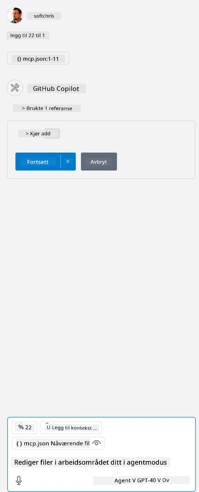

Dette tilsvarer å kjøre en kommando som dette: `node build/index.js`.

- Endre denne serveroppføringen slik at den passer til hvor serverfilen din ligger, eller til det som trengs for å starte serveren din, avhengig av valgt runtime og serverplassering.

## Bruk funksjonene i serveren

- Klikk på `play`-ikonet når du har lagt til *mcp.json* i *./vscode*-mappen,

    Legg merke til at verktøyikonet endres for å øke antallet tilgjengelige verktøy. Verktøyikonet ligger rett over chattefeltet i GitHub Copilot.

## Kjør et verktøy

- Skriv en prompt i chattevinduet som samsvarer med beskrivelsen av verktøyet ditt. For eksempel, for å aktivere verktøyet `add`, skriv noe som "add 3 to 20".

    Du skal se at et verktøy vises over chatteksten, som indikerer at du kan velge å kjøre verktøyet, slik som i dette bildet:

    

    Å velge verktøyet skal gi et numerisk resultat som sier "23" hvis prompten din var som vi nevnte tidligere.

**Ansvarsfraskrivelse**:  
Dette dokumentet er oversatt ved hjelp av AI-oversettelsestjenesten [Co-op Translator](https://github.com/Azure/co-op-translator). Selv om vi streber etter nøyaktighet, vennligst vær oppmerksom på at automatiske oversettelser kan inneholde feil eller unøyaktigheter. Det opprinnelige dokumentet på originalspråket skal anses som den autoritative kilden. For kritisk informasjon anbefales profesjonell menneskelig oversettelse. Vi er ikke ansvarlige for eventuelle misforståelser eller feiltolkninger som oppstår ved bruk av denne oversettelsen.