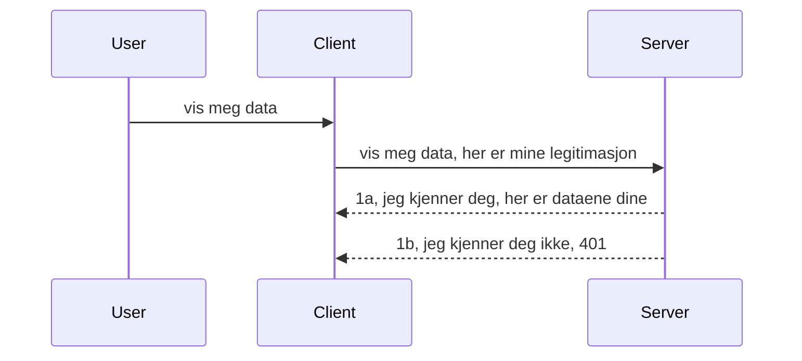

# Enkel autentisering

MCP SDK-er støtter bruk av OAuth 2.1 som for å være ærlig er en ganske involvert prosess som innebærer konsepter som autentiseringsserver, ressursserver, sende legitimasjon, få en kode, bytte koden mot en bærertoken inntil du endelig kan hente ressursdataen din. Hvis du ikke er vant til OAuth, som er en flott ting å implementere, er det en god idé å starte med et grunnleggende nivå av autentisering og bygge opp til bedre og bedre sikkerhet. Det er derfor dette kapitlet eksisterer, for å bygge deg opp til mer avansert autentisering.

## Autentisering, hva mener vi?

Autentisering er kort for autentisering og autorisasjon. Ideen er at vi trenger å gjøre to ting:

- **Autentisering**, som er prosessen med å finne ut om vi lar en person komme inn i huset vårt, at de har rett til å være "her" det vil si ha tilgang til vår ressursserver der våre MCP Server-funksjoner finnes.
- **Autorisasjon**, er prosessen med å finne ut om en bruker skal ha tilgang til disse spesifikke ressursene de ber om, for eksempel disse ordrene eller disse produktene, eller om de bare har lov til å lese innholdet, men ikke slette som et annet eksempel.

## Legitimasjon: hvordan vi forteller systemet hvem vi er

Vel, de fleste webutviklere der ute begynner å tenke i termer av å gi et legitimasjonsbevis til serveren, vanligvis en hemmelighet som sier om de har lov til å være her "Autentisering". Denne legitimasjonen er vanligvis en base64-kodet versjon av brukernavn og passord eller en API-nøkkel som identifiserer en bestemt bruker unikt.

Dette innebærer å sende det via en header kalt "Authorization" slik:

```json
{ "Authorization": "secret123" }
```

Dette kalles vanligvis grunnleggende autentisering. Hvordan den overordnede flyten da fungerer er som følger:


Nå som vi forstår hvordan det fungerer fra et flytperspektiv, hvordan implementerer vi det? Vel, de fleste webservere har et konsept kalt middleware, en kodebit som kjører som en del av forespørselen som kan verifisere legitimasjon, og hvis legitimasjonen er gyldig kan la forespørselen passere igjennom. Hvis forespørselen ikke har gyldig legitimasjon får du en autentiseringsfeil. La oss se hvordan dette kan implementeres:

**Python**

```python
class AuthMiddleware(BaseHTTPMiddleware):
    async def dispatch(self, request, call_next):

        has_header = request.headers.get("Authorization")
        if not has_header:
            print("-> Missing Authorization header!")
            return Response(status_code=401, content="Unauthorized")

        if not valid_token(has_header):
            print("-> Invalid token!")
            return Response(status_code=403, content="Forbidden")

        print("Valid token, proceeding...")
       
        response = await call_next(request)
        # legg til eventuelle kundeoverskrifter eller endre i svaret på en eller annen måte
        return response


starlette_app.add_middleware(CustomHeaderMiddleware)
```

Her har vi:

- Opprettet en middleware kalt `AuthMiddleware` hvor dens `dispatch`-metode blir kalt av webserveren.
- Lagt til middleware i webserveren:

    ```python
    starlette_app.add_middleware(AuthMiddleware)
    ```

- Skrevet valideringslogikk som sjekker om Authorization-header er tilstede og om hemmeligheten som sendes er gyldig:

    ```python
    has_header = request.headers.get("Authorization")
    if not has_header:
        print("-> Missing Authorization header!")
        return Response(status_code=401, content="Unauthorized")

    if not valid_token(has_header):
        print("-> Invalid token!")
        return Response(status_code=403, content="Forbidden")
    ```

    hvis hemmeligheten er tilstede og gyldig, lar vi forespørselen passere ved å kalle `call_next` og returnere svaret.

    ```python
    response = await call_next(request)
    # legg til eventuelle kundeoverskrifter eller endre svaret på noen måte
    return response
    ```

Slik fungerer det at hvis en web-forespørsel blir gjort mot serveren, vil middleware bli kalt, og gitt implementasjonen vil den enten la forespørselen passere eller returnere en feil som indikerer at klienten ikke har lov til å fortsette.

**TypeScript**

Her lager vi en middleware med det populære rammeverket Express og avskjærer forespørselen før den når MCP Serveren. Her er koden for det:

```typescript
function isValid(secret) {
    return secret === "secret123";
}

app.use((req, res, next) => {
    // 1. Autorisasjonsheader til stede?
    if(!req.headers["Authorization"]) {
        res.status(401).send('Unauthorized');
    }
    
    let token = req.headers["Authorization"];

    // 2. Sjekk gyldighet.
    if(!isValid(token)) {
        res.status(403).send('Forbidden');
    }

   
    console.log('Middleware executed');
    // 3. Sender forespørselen videre til neste trinn i forespørselskjeden.
    next();
});
```

I denne koden:

1. Sjekker vi først om Authorization-headeren er tilstede, hvis ikke sender vi en 401-feil.
2. Sikrer at legitimasjonen/token er gyldig, hvis ikke sender vi en 403-feil.
3. Til slutt lar vi forespørselen passere i forespørselsrøret og returnerer ressursen som ble spurt om.

## Øvelse: Implementer autentisering

La oss ta vår kunnskap og prøve å implementere det. Her er planen:

Server

- Opprett en webserver og MCP-instans.
- Implementer en middleware for serveren.

Klient

- Send web-forespørsel med legitimasjon via header.

### -1- Opprett en webserver og MCP-instans

I vårt første steg, må vi opprette webserver-instansen og MCP Serveren.

**Python**

Her lager vi en MCP server-instans, oppretter en starlette web-app og hoster den med uvicorn.

```python
# oppretter MCP Server

app = FastMCP(
    name="MCP Resource Server",
    instructions="Resource Server that validates tokens via Authorization Server introspection",
    host=settings["host"],
    port=settings["port"],
    debug=True
)

# oppretter starlette nettapp
starlette_app = app.streamable_http_app()

# serverer app via uvicorn
async def run(starlette_app):
    import uvicorn
    config = uvicorn.Config(
            starlette_app,
            host=app.settings.host,
            port=app.settings.port,
            log_level=app.settings.log_level.lower(),
        )
    server = uvicorn.Server(config)
    await server.serve()

run(starlette_app)
```

I denne koden:

- Oppretter vi MCP Serveren.
- Konstruerer starlette webappen fra MCP Serveren, `app.streamable_http_app()`.
- Hoster og serverer webappen med uvicorn `server.serve()`.

**TypeScript**

Her lager vi en MCP Server-instans.

```typescript
const server = new McpServer({
      name: "example-server",
      version: "1.0.0"
    });

    // ... sette opp serverressurser, verktøy og oppfordringer ...
```

Denne opprettelsen av MCP Server må skje innenfor vår POST /mcp rutedefinisjon, så la oss ta koden over og flytte den slik:

```typescript
import express from "express";
import { randomUUID } from "node:crypto";
import { McpServer } from "@modelcontextprotocol/sdk/server/mcp.js";
import { StreamableHTTPServerTransport } from "@modelcontextprotocol/sdk/server/streamableHttp.js";
import { isInitializeRequest } from "@modelcontextprotocol/sdk/types.js"

const app = express();
app.use(express.json());

// Kart for å lagre transporter etter sesjons-ID
const transports: { [sessionId: string]: StreamableHTTPServerTransport } = {};

// Håndter POST-forespørsler for kommunikasjon fra klient til server
app.post('/mcp', async (req, res) => {
  // Sjekk etter eksisterende sesjons-ID
  const sessionId = req.headers['mcp-session-id'] as string | undefined;
  let transport: StreamableHTTPServerTransport;

  if (sessionId && transports[sessionId]) {
    // Gjenbruk eksisterende transport
    transport = transports[sessionId];
  } else if (!sessionId && isInitializeRequest(req.body)) {
    // Ny initialiseringsforespørsel
    transport = new StreamableHTTPServerTransport({
      sessionIdGenerator: () => randomUUID(),
      onsessioninitialized: (sessionId) => {
        // Lagre transporten etter sesjons-ID
        transports[sessionId] = transport;
      },
      // DNS-rebindingbeskyttelse er som standard deaktivert for bakoverkompatibilitet. Hvis du kjører denne serveren
      // lokalt, sørg for å sette:
      // enableDnsRebindingProtection: true,
      // allowedHosts: ['127.0.0.1'],
    });

    // Rydd opp transport når den er lukket
    transport.onclose = () => {
      if (transport.sessionId) {
        delete transports[transport.sessionId];
      }
    };
    const server = new McpServer({
      name: "example-server",
      version: "1.0.0"
    });

    // ... sett opp serverressurser, verktøy og spørsmål ...

    // Koble til MCP-serveren
    await server.connect(transport);
  } else {
    // Ugyldig forespørsel
    res.status(400).json({
      jsonrpc: '2.0',
      error: {
        code: -32000,
        message: 'Bad Request: No valid session ID provided',
      },
      id: null,
    });
    return;
  }

  // Håndter forespørselen
  await transport.handleRequest(req, res, req.body);
});

// Gjenbrukbar håndterer for GET- og DELETE-forespørsler
const handleSessionRequest = async (req: express.Request, res: express.Response) => {
  const sessionId = req.headers['mcp-session-id'] as string | undefined;
  if (!sessionId || !transports[sessionId]) {
    res.status(400).send('Invalid or missing session ID');
    return;
  }
  
  const transport = transports[sessionId];
  await transport.handleRequest(req, res);
};

// Håndter GET-forespørsler for server-til-klient-varsler via SSE
app.get('/mcp', handleSessionRequest);

// Håndter DELETE-forespørsler for avslutning av sesjon
app.delete('/mcp', handleSessionRequest);

app.listen(3000);
```

Nå ser du hvordan MCP Server-opprettelsen ble flyttet inn i `app.post("/mcp")`.

La oss gå videre til neste steg med å lage middleware slik at vi kan validere den innkommende legitimasjonen.

### -2- Implementer middleware for serveren

La oss gå til middleware-delen neste. Her skal vi lage en middleware som ser etter en legitimasjon i `Authorization`-headeren og validere den. Hvis den er akseptabel, vil forespørselen gå videre for å gjøre det den trenger (for eksempel liste verktøy, lese en ressurs eller hva enn MCP-funksjonalitet klienten ba om).

**Python**

For å lage middleware må vi opprette en klasse som arver fra `BaseHTTPMiddleware`. Det er to interessante deler:

- Forespørselen `request`, som vi leser header-informasjonen fra.
- `call_next` callbacken vi trenger å kalle hvis klienten har medbrakt en legitimasjon vi aksepterer.

Først må vi håndtere tilfelle hvor `Authorization`-header mangler:

```python
has_header = request.headers.get("Authorization")

# ingen overskrift til stede, feiler med 401, ellers fortsett.
if not has_header:
    print("-> Missing Authorization header!")
    return Response(status_code=401, content="Unauthorized")
```

Her sender vi en 401 unauthorized melding fordi klienten feiler autentisering.

Deretter, hvis en legitimasjon ble sendt, må vi sjekke dens gyldighet slik:

```python
 if not valid_token(has_header):
    print("-> Invalid token!")
    return Response(status_code=403, content="Forbidden")
```

Legg merke til hvordan vi over sender en 403 forbidden melding. La oss se hele middleware under som implementerer alt ovenfor:

```python
class AuthMiddleware(BaseHTTPMiddleware):
    async def dispatch(self, request, call_next):

        has_header = request.headers.get("Authorization")
        if not has_header:
            print("-> Missing Authorization header!")
            return Response(status_code=401, content="Unauthorized")

        if not valid_token(has_header):
            print("-> Invalid token!")
            return Response(status_code=403, content="Forbidden")

        print("Valid token, proceeding...")
        print(f"-> Received {request.method} {request.url}")
        response = await call_next(request)
        response.headers['Custom'] = 'Example'
        return response

```

Flott, men hva med `valid_token` funksjonen? Her er den nedenfor:

```python
# IKKE bruk til produksjon - forbedre det !!
def valid_token(token: str) -> bool:
    # fjern "Bearer " prefikset
    if token.startswith("Bearer "):
        token = token[7:]
        return token == "secret-token"
    return False
```

Dette bør selvsagt forbedres.

VIKTIG: Du bør ALDRI ha hemmeligheter som dette i koden. Du bør ideelt sett hente verdien du sammenligner med fra en datakilde eller fra en IDP (identitetstjenesteleverandør) eller enda bedre, la IDP gjøre valideringen.

**TypeScript**

For å implementere dette med Express må vi kalle `use` metoden som tar middleware-funksjoner.

Vi må:

- Interagere med forespørsels-variabelen for å sjekke den sendte legitimasjonen i `Authorization`-feltet.
- Validere legitimasjonen, og hvis den er godkjent la forespørselen fortsette og la klientens MCP-forespørsel gjøre det den skal (for eksempel liste verktøy, lese ressurs eller annet relatert til MCP).

Her sjekker vi om `Authorization`-header er tilstede, og hvis ikke stopper vi forespørselen:

```typescript
if(!req.headers["authorization"]) {
    res.status(401).send('Unauthorized');
    return;
}
```

Hvis headeren ikke sendes i det hele tatt, får du en 401.

Deretter sjekker vi om legitimasjonen er gyldig, hvis ikke stopper vi forespørselen igjen men med en litt annen melding:

```typescript
if(!isValid(token)) {
    res.status(403).send('Forbidden');
    return;
} 
```

Legg merke til at du nå får en 403-feil.

Her er hele koden:

```typescript
app.use((req, res, next) => {
    console.log('Request received:', req.method, req.url, req.headers);
    console.log('Headers:', req.headers["authorization"]);
    if(!req.headers["authorization"]) {
        res.status(401).send('Unauthorized');
        return;
    }
    
    let token = req.headers["authorization"];

    if(!isValid(token)) {
        res.status(403).send('Forbidden');
        return;
    }  

    console.log('Middleware executed');
    next();
});
```

Vi har satt opp webserveren til å akseptere en middleware som sjekker legitimasjonen klienten forhåpentligvis sender oss. Hva med klienten selv?

### -3- Send web-forespørsel med legitimasjon via header

Vi må sørge for at klienten sender legitimasjonen gjennom headeren. Ettersom vi skal bruke en MCP-klient til dette, må vi finne ut hvordan det gjøres.

**Python**

For klienten må vi sende en header med vår legitimasjon slik:

```python
# IKKE hardkod verdien, ha den minst i en miljøvariabel eller en mer sikker lagring
token = "secret-token"

async with streamablehttp_client(
        url = f"http://localhost:{port}/mcp",
        headers = {"Authorization": f"Bearer {token}"}
    ) as (
        read_stream,
        write_stream,
        session_callback,
    ):
        async with ClientSession(
            read_stream,
            write_stream
        ) as session:
            await session.initialize()
      
            # TODO, hva du vil ha gjort i klienten, f.eks liste verktøy, kalle verktøy osv.
```

Legg merke til hvordan vi fyller opp `headers`-feltet slik ` headers = {"Authorization": f"Bearer {token}"}`.

**TypeScript**

Dette kan vi løse i to steg:

1. Fyll ut et konfigurasjonsobjekt med vår legitimasjon.
2. Send konfigurasjonsobjektet til transporten.

```typescript

// IKKE hardkod verdien som vist her. Ha det minst som en miljøvariabel og bruk noe som dotenv (i utviklingsmodus).
let token = "secret123"

// definer et klient transportopsjonsobjekt
let options: StreamableHTTPClientTransportOptions = {
  sessionId: sessionId,
  requestInit: {
    headers: {
      "Authorization": "secret123"
    }
  }
};

// send opsjonsobjektet til transporten
async function main() {
   const transport = new StreamableHTTPClientTransport(
      new URL(serverUrl),
      options
   );
```

Her ser du hvordan vi ovenfor måtte lage et `options`-objekt og plassere headerene under `requestInit`-feltet.

VIKTIG: Hvordan forbedrer vi det herfra? Vel, dagens implementering har noen problemer. For det første, å sende en legitimasjon på denne måten er ganske risikabelt med mindre du minst har HTTPS. Selv da kan legitimasjonen bli stjålet, så du trenger et system der du enkelt kan tilbakekalle token og legge til ekstra sjekker som hvor i verden det kommer fra, om forespørslene skjer altfor ofte (bot-lignende oppførsel), kort sagt, det er en hel rekke hensyn.

Det må likevel sies at for veldig enkle API-er hvor du ikke vil at noen skal kalle API-et ditt uten å være autentisert, er det vi har her en god start.

Med det sagt, la oss prøve å styrke sikkerheten litt ved å bruke et standardisert format som JSON Web Token, også kjent som JWT eller "JOT"-tokens.

## JSON Web Tokens, JWT

Så, vi prøver å forbedre ting fra å sende veldig enkle legitimasjoner. Hva er de umiddelbare forbedringene vi får ved å adoptere JWT?

- **Sikkerhetsforbedringer**. I grunnleggende autentisering sender du brukernavn og passord som en base64-kodet token (eller du sender en API-nøkkel) om og om igjen, noe som øker risikoen. Med JWT sender du brukernavn og passord og får en token tilbake, og den er også tidsbegrenset, noe som betyr at den utløper. JWT lar deg enkelt bruke finmasket tilgangskontroll ved hjelp av roller, scopes og tillatelser.
- **Statelessness og skalerbarhet**. JWT-er er selv-inneholdende, de bærer all brukerinfo og eliminerer behovet for server-side sesjonslagring. Token kan også valideres lokalt.
- **Interoperabilitet og føderasjon**. JWT-er er sentrale i Open ID Connect og brukes med kjente identitetsleverandører som Entra ID, Google Identity og Auth0. De gjør det også mulig å bruke single sign on og mye mer som gjør det bedriftsnivå.
- **Modularitet og fleksibilitet**. JWT-er kan også brukes med API-gatewayer som Azure API Management, NGINX og mer. De støtter også autentiseringsscenarier og server-til-tjeneste kommunikasjon inkludert imitasjon og delegasjonsscenarier.
- **Ytelse og caching**. JWT-er kan caches etter dekoding noe som reduserer behovet for parsing. Dette hjelper spesielt med apper med høyt trafikkvolum da det forbedrer gjennomstrømningen og reduserer belastningen på valgt infrastruktur.
- **Avanserte funksjoner**. De har også støtte for introspeksjon (sjekk av gyldighet på server) og tilbakekallelse (gjøre en token ugyldig).

Med alle disse fordelene, la oss se hvordan vi kan ta implementasjonen vår til neste nivå.

## Gjøre om grunnleggende autentisering til JWT

Så, endringene vi må gjøre på et overordnet nivå er å:

- **Lære å konstruere en JWT-token** og gjøre den klar for å sendes fra klient til server.
- **Validere en JWT-token**, og hvis gyldig, la klienten få tilgang til våre ressurser.
- **Sikker lagring av token**. Hvordan vi lagrer denne token.
- **Beskytt ruter**. Vi må beskytte rutene, i vårt tilfelle beskytte ruter og spesifikke MCP-funksjoner.
- **Legge til refresh tokens**. Sørge for at vi lager tokens som er kortlevde men med oppfriskningstokener som er langlevde og kan brukes til å skaffe nye tokens hvis de utløper. Ha også en oppfriskningsendepunkt og en rotasjonsstrategi.

### -1- Konstruer en JWT-token

Først har en JWT-token følgende deler:

- **header**, algoritme som brukes og tokentype.
- **payload**, claims, som sub (brukeren eller entiteten token representerer. I et autentiseringsscenario er dette vanligvis bruker-ID), exp (når den utløper), role (rollen)
- **signature**, signert med en hemmelighet eller privat nøkkel.

For dette må vi konstruere header, payload og den kodede token.

**Python**

```python

import jwt
import jwt
from jwt.exceptions import ExpiredSignatureError, InvalidTokenError
import datetime

# Hemmelig nøkkel brukt til å signere JWT-en
secret_key = 'your-secret-key'

header = {
    "alg": "HS256",
    "typ": "JWT"
}

# brukerinfoen og dens påstander og utløpstid
payload = {
    "sub": "1234567890",               # Emne (bruker-ID)
    "name": "User Userson",                # Egendefinert påstand
    "admin": True,                     # Egendefinert påstand
    "iat": datetime.datetime.utcnow(),# Utstedt tidspunkt
    "exp": datetime.datetime.utcnow() + datetime.timedelta(hours=1)  # Utløp
}

# kodes det
encoded_jwt = jwt.encode(payload, secret_key, algorithm="HS256", headers=header)
```

I koden over har vi:

- Definert en header som bruker HS256 som algoritme og type som JWT.
- Konstruert en payload som inneholder et subject eller bruker-ID, et brukernavn, en rolle, når token ble utstedt og når den skal utløpe, og på den måten implementerer tidsbegrensningen vi nevnte tidligere.

**TypeScript**

Her trenger vi noen avhengigheter som hjelper oss å konstruere JWT-token.

Avhengigheter

```sh

npm install jsonwebtoken
npm install --save-dev @types/jsonwebtoken
```

Nå som vi har det på plass, la oss lage header, payload og gjennom det lage den kodede token.

```typescript
import jwt from 'jsonwebtoken';

const secretKey = 'your-secret-key'; // Bruk miljøvariabler i produksjon

// Definer nyttelasten
const payload = {
  sub: '1234567890',
  name: 'User usersson',
  admin: true,
  iat: Math.floor(Date.now() / 1000), // Utstedt på
  exp: Math.floor(Date.now() / 1000) + 60 * 60 // Utløper om 1 time
};

// Definer headeren (valgfritt, jsonwebtoken setter standardverdier)
const header = {
  alg: 'HS256',
  typ: 'JWT'
};

// Lag tokenet
const token = jwt.sign(payload, secretKey, {
  algorithm: 'HS256',
  header: header
});

console.log('JWT:', token);
```

Denne token er:

Signert med HS256
Gyldig i 1 time
Inkluderer claims som sub, name, admin, iat og exp.

### -2- Valider en token

Vi må også validere en token, dette bør gjøres på serveren for å sikre at klienten faktisk sender oss en gyldig token. Det er mange sjekker vi bør gjøre her fra å validere strukturen til gyldigheten. Du oppfordres også til å legge til andre sjekker for å se om brukeren finnes i systemet ditt og mer.

For å validere en token må vi dekode den slik at vi kan lese den og deretter begynne å sjekke gyldigheten:

**Python**

```python

# Dekod og verifiser JWT
try:
    decoded = jwt.decode(token, secret_key, algorithms=["HS256"])
    print("✅ Token is valid.")
    print("Decoded claims:")
    for key, value in decoded.items():
        print(f"  {key}: {value}")
except ExpiredSignatureError:
    print("❌ Token has expired.")
except InvalidTokenError as e:
    print(f"❌ Invalid token: {e}")

```

I denne koden kaller vi `jwt.decode` med token, hemmelig nøkkel og valgt algoritme som input. Legg merke til at vi bruker try-catch da en mislykket validering fører til en feil.

**TypeScript**

Her må vi kalle `jwt.verify` for å få en dekodet versjon av token som vi kan analysere videre. Hvis dette kallet feiler, betyr det at strukturen på token er feil eller den ikke lenger er gyldig.

```typescript

try {
  const decoded = jwt.verify(token, secretKey);
  console.log('Decoded Payload:', decoded);
} catch (err) {
  console.error('Token verification failed:', err);
}
```

MERK: som nevnt tidligere bør vi utføre flere sjekker for å forsikre oss om at denne token peker på en bruker i systemet vårt og sikrer at brukeren har de rettighetene den skal ha.
Neste, la oss se på rollebasert tilgangskontroll, også kjent som RBAC.

## Legge til rollebasert tilgangskontroll

Ideen er at vi ønsker å uttrykke at forskjellige roller har forskjellige tillatelser. For eksempel antar vi at en administrator kan gjøre alt, at en vanlig bruker kan lese/skrive, og at en gjest kun kan lese. Derfor er her noen mulige tillatelsesnivåer:

- Admin.Write 
- User.Read
- Guest.Read

La oss se på hvordan vi kan implementere slik kontroll med mellomvare. Mellomvare kan legges til per rute samt for alle ruter.

**Python**

```python
from starlette.middleware.base import BaseHTTPMiddleware
from starlette.responses import JSONResponse
import jwt

# IKKE ha hemmeligheten i koden, dette er kun for demonstrasjonsformål. Les det fra et sikkert sted.
SECRET_KEY = "your-secret-key" # legg dette i en miljøvariabel
REQUIRED_PERMISSION = "User.Read"

class JWTPermissionMiddleware(BaseHTTPMiddleware):
    async def dispatch(self, request, call_next):
        auth_header = request.headers.get("Authorization")
        if not auth_header or not auth_header.startswith("Bearer "):
            return JSONResponse({"error": "Missing or invalid Authorization header"}, status_code=401)

        token = auth_header.split(" ")[1]
        try:
            decoded = jwt.decode(token, SECRET_KEY, algorithms=["HS256"])
        except jwt.ExpiredSignatureError:
            return JSONResponse({"error": "Token expired"}, status_code=401)
        except jwt.InvalidTokenError:
            return JSONResponse({"error": "Invalid token"}, status_code=401)

        permissions = decoded.get("permissions", [])
        if REQUIRED_PERMISSION not in permissions:
            return JSONResponse({"error": "Permission denied"}, status_code=403)

        request.state.user = decoded
        return await call_next(request)


```

Det finnes noen forskjellige måter å legge til mellomvaren på som vist under:

```python

# Alternativ 1: legg til middleware mens du bygger starlette-appen
middleware = [
    Middleware(JWTPermissionMiddleware)
]

app = Starlette(routes=routes, middleware=middleware)

# Alternativ 2: legg til middleware etter at starlette-appen allerede er konstruert
starlette_app.add_middleware(JWTPermissionMiddleware)

# Alternativ 3: legg til middleware per rute
routes = [
    Route(
        "/mcp",
        endpoint=..., # behandler
        middleware=[Middleware(JWTPermissionMiddleware)]
    )
]
```

**TypeScript**

Vi kan bruke `app.use` og en mellomvare som kjører for alle forespørsler.

```typescript
app.use((req, res, next) => {
    console.log('Request received:', req.method, req.url, req.headers);
    console.log('Headers:', req.headers["authorization"]);

    // 1. Sjekk om autorisasjonsheader er sendt

    if(!req.headers["authorization"]) {
        res.status(401).send('Unauthorized');
        return;
    }
    
    let token = req.headers["authorization"];

    // 2. Sjekk om token er gyldig
    if(!isValid(token)) {
        res.status(403).send('Forbidden');
        return;
    }  

    // 3. Sjekk om token-bruker eksisterer i vårt system
    if(!isExistingUser(token)) {
        res.status(403).send('Forbidden');
        console.log("User does not exist");
        return;
    }
    console.log("User exists");

    // 4. Verifiser at token har riktige tillatelser
    if(!hasScopes(token, ["User.Read"])){
        res.status(403).send('Forbidden - insufficient scopes');
    }

    console.log("User has required scopes");

    console.log('Middleware executed');
    next();
});

```

Det er flere ting vi kan la mellomvaren vår gjøre og som den BØR gjøre, nemlig:

1. Sjekke om autorisasjonsheader er tilstede
2. Sjekke om token er gyldig, vi kaller `isValid` som er en metode vi har skrevet som sjekker integriteten og gyldigheten til JWT-tokenet.
3. Verifisere at brukeren eksisterer i systemet vårt, dette bør vi også sjekke.

   ```typescript
    // brukere i DB
   const users = [
     "user1",
     "User usersson",
   ]

   function isExistingUser(token) {
     let decodedToken = verifyToken(token);

     // TODO, sjekk om bruker finnes i DB
     return users.includes(decodedToken?.name || "");
   }
   ```

   Ovenfor har vi laget en veldig enkel `users`-liste, som selvfølgelig burde vært i en database.

4. I tillegg bør vi også sjekke at tokenet har riktige tillatelser.

   ```typescript
   if(!hasScopes(token, ["User.Read"])){
        res.status(403).send('Forbidden - insufficient scopes');
   }
   ```

   I koden over fra mellomvaren sjekker vi at tokenet inneholder User.Read-tillatelse, hvis ikke sender vi en 403-feil. Under er hjelpsmannen `hasScopes`.

   ```typescript
   function hasScopes(scope: string, requiredScopes: string[]) {
     let decodedToken = verifyToken(scope);
    return requiredScopes.every(scope => decodedToken?.scopes.includes(scope));
  }
   ```

Have a think which additional checks you should be doing, but these are the absolute minimum of checks you should be doing.

Using Express as a web framework is a common choice. There are helpers library when you use JWT so you can write less code.

- `express-jwt`, helper library that provides a middleware that helps decode your token.
- `express-jwt-permissions`, this provides a middleware `guard` that helps check if a certain permission is on the token.

Here's what these libraries can look like when used:

```typescript
const express = require('express');
const jwt = require('express-jwt');
const guard = require('express-jwt-permissions')();

const app = express();
const secretKey = 'your-secret-key'; // put this in env variable

// Decode JWT and attach to req.user
app.use(jwt({ secret: secretKey, algorithms: ['HS256'] }));

// Check for User.Read permission
app.use(guard.check('User.Read'));

// multiple permissions
// app.use(guard.check(['User.Read', 'Admin.Access']));

app.get('/protected', (req, res) => {
  res.json({ message: `Welcome ${req.user.name}` });
});

// Error handler
app.use((err, req, res, next) => {
  if (err.code === 'permission_denied') {
    return res.status(403).send('Forbidden');
  }
  next(err);
});

```

Nå har du sett hvordan mellomvare kan brukes både til autentisering og autorisering, men hva med MCP, endrer det hvordan vi gjør autentisering? La oss finne ut i neste seksjon.

### -3- Legg til RBAC i MCP

Så langt har du sett hvordan du kan legge til RBAC via mellomvare, men for MCP finnes det ikke en enkel måte å legge til RBAC per MCP-funksjon, så hva gjør vi? Vel, vi må bare legge til kode som denne som sjekker om klienten i dette tilfellet har rettigheter til å kalle et spesifikt verktøy:

Du har noen forskjellige valg for hvordan å få til RBAC per funksjon, her er noen:

- Legge til en sjekk for hvert verktøy, ressurs, prompt hvor du må sjekke tillatelsesnivå.

   **python**

   ```python
   @tool()
   def delete_product(id: int):
      try:
          check_permissions(role="Admin.Write", request)
      catch:
        pass # klienten mislyktes i autorisasjon, kast autorisasjonsfeil
   ```

   **typescript**

   ```typescript
   server.registerTool(
    "delete-product",
    {
      title: Delete a product",
      description: "Deletes a product",
      inputSchema: { id: z.number() }
    },
    async ({ id }) => {
      
      try {
        checkPermissions("Admin.Write", request);
        // todo, send id til productService og ekstern oppføring
      } catch(Exception e) {
        console.log("Authorization error, you're not allowed");  
      }

      return {
        content: [{ type: "text", text: `Deletected product with id ${id}` }]
      };
    }
   );
   ```


- Bruke avansert server-tilnærming og request handlers slik at du minimerer antall steder du må gjøre sjekken.

   **Python**

   ```python
   
   tool_permission = {
      "create_product": ["User.Write", "Admin.Write"],
      "delete_product": ["Admin.Write"]
   }

   def has_permission(user_permissions, required_permissions) -> bool:
      # bruker_rettigheter: liste over rettigheter brukeren har
      # nødvendige_rettigheter: liste over rettigheter som kreves for verktøyet
      return any(perm in user_permissions for perm in required_permissions)

   @server.call_tool()
   async def handle_call_tool(
     name: str, arguments: dict[str, str] | None
   ) -> list[types.TextContent]:
    # Anta at request.user.permissions er en liste over rettigheter for brukeren
     user_permissions = request.user.permissions
     required_permissions = tool_permission.get(name, [])
     if not has_permission(user_permissions, required_permissions):
        # Kast feil "Du har ikke tillatelse til å bruke verktøyet {name}"
        raise Exception(f"You don't have permission to call tool {name}")
     # fortsett og kall verktøyet
     # ...
   ```   
   

   **TypeScript**

   ```typescript
   function hasPermission(userPermissions: string[], requiredPermissions: string[]): boolean {
       if (!Array.isArray(userPermissions) || !Array.isArray(requiredPermissions)) return false;
       // Returner true hvis brukeren har minst én påkrevd tillatelse
       
       return requiredPermissions.some(perm => userPermissions.includes(perm));
   }
  
   server.setRequestHandler(CallToolRequestSchema, async (request) => {
      const { params: { name } } = request;
  
      let permissions = request.user.permissions;
  
      if (!hasPermission(permissions, toolPermissions[name])) {
         return new Error(`You don't have permission to call ${name}`);
      }
  
      // Fortsett..
   });
   ```

   Merk at du må sørge for at mellomvaren din tilordner et dekodet token til forespørselens user-egenskap slik at koden over blir enkel.

### Oppsummering

Nå som vi har diskutert hvordan man kan legge til støtte for RBAC generelt og for MCP spesielt, er det på tide å prøve å implementere sikkerhet på egenhånd for å sikre at du har forstått konseptene som er presentert.

## Oppgave 1: Bygg en mcp-server og mcp-klient med grunnleggende autentisering

Her skal du ta det du har lært om å sende legitimasjon gjennom headere.

## Løsning 1

[Løsning 1](./code/basic/README.md)

## Oppgave 2: Oppgrader løsningen fra Oppgave 1 til å bruke JWT

Ta den første løsningen, men denne gangen forbedrer vi den.

I stedet for å bruke Basic Auth, bruker vi JWT.

## Løsning 2

[Løsning 2](./solution/jwt-solution/README.md)

## Utfordring

Legg til RBAC per verktøy som vi beskriver i seksjonen "Legg til RBAC i MCP".

## Sammendrag

Du har forhåpentligvis lært mye i dette kapitlet, fra ingen sikkerhet i det hele tatt, til grunnleggende sikkerhet, til JWT og hvordan det kan legges til i MCP.

Vi har bygget et solid fundament med egendefinerte JWT-er, men når vi skalerer, går vi mot en standardbasert identitetsmodell. Å ta i bruk en IdP som Entra eller Keycloak lar oss overlate utstedelsen, valideringen og livssyklusadministrasjonen av token til en pålitelig plattform – slik at vi kan fokusere på app-logikk og brukeropplevelse.

For det har vi et mer [avansert kapittel om Entra](../../05-AdvancedTopics/mcp-security-entra/README.md)

## Hva er det neste

- Neste: [Setting Up MCP Hosts](../12-mcp-hosts/README.md)

---

<!-- CO-OP TRANSLATOR DISCLAIMER START -->
**Ansvarsfraskrivelse**:
Dette dokumentet er oversatt ved hjelp av AI-oversettelsestjenesten [Co-op Translator](https://github.com/Azure/co-op-translator). Selv om vi streber etter nøyaktighet, vennligst vær oppmerksom på at automatiserte oversettelser kan inneholde feil eller unøyaktigheter. Det opprinnelige dokumentet på originalspråket bør betraktes som den autoritative kilden. For kritisk informasjon anbefales profesjonell menneskelig oversettelse. Vi er ikke ansvarlige for eventuelle misforståelser eller feiltolkninger som oppstår ved bruk av denne oversettelsen.
<!-- CO-OP TRANSLATOR DISCLAIMER END -->