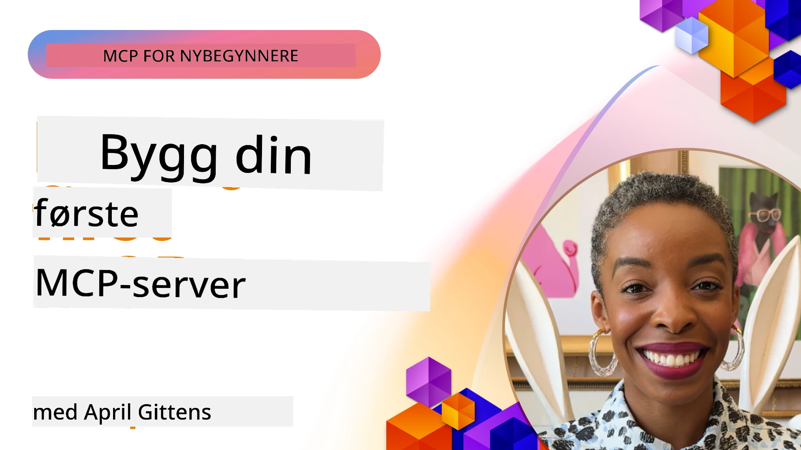

## Komme i gang  

_(Klikk på bildet over for å se video av denne leksjonen)_

Denne seksjonen består av flere leksjoner:

- **1 Din første server**, i denne første leksjonen vil du lære hvordan du oppretter din første server og inspiserer den med inspektørverktøyet, en verdifull måte å teste og feilsøke serveren din på, [til leksjonen](01-first-server/README.md)

- **2 Klient**, i denne leksjonen vil du lære hvordan du skriver en klient som kan koble til serveren din, [til leksjonen](02-client/README.md)

- **3 Klient med LLM**, en enda bedre måte å skrive en klient på er ved å legge til en LLM slik at den kan "forhandle" med serveren din om hva den skal gjøre, [til leksjonen](03-llm-client/README.md)

- **4 Bruke en server GitHub Copilot Agent-modus i Visual Studio Code**. Her ser vi på hvordan vi kan kjøre vår MCP Server fra Visual Studio Code, [til leksjonen](04-vscode/README.md)

- **5 stdio Transport Server** stdio-transport er den anbefalte standarden for lokal MCP server-til-klient kommunikasjon, og gir sikker kommunikasjon basert på underprosesser med innebygd prosessisolasjon [til leksjonen](05-stdio-server/README.md)

- **6 HTTP Streaming med MCP (Strømbar HTTP)**. Lær om moderne HTTP streaming transport (den anbefalte tilnærmingen for eksterne MCP-servere i henhold til [MCP Specification 2025-11-25](https://spec.modelcontextprotocol.io/specification/2025-11-25/basic/transports/#streamable-http)), fremdriftsvarsler, og hvordan implementere skalerbare, sanntids MCP-servere og klienter ved bruk av Strømbar HTTP. [til leksjonen](06-http-streaming/README.md)

- **7 Bruke AI Toolkit for VSCode** for å konsumere og teste MCP-klienter og -servere [til leksjonen](07-aitk/README.md)

- **8 Testing**. Her fokuserer vi spesielt på hvordan vi kan teste serveren og klienten på forskjellige måter, [til leksjonen](08-testing/README.md)

- **9 Distribusjon**. Dette kapitlet ser på forskjellige måter å distribuere MCP-løsningene dine på, [til leksjonen](09-deployment/README.md)

- **10 Avansert serverbruk**. Dette kapitlet dekker avansert serverbruk, [til leksjonen](./10-advanced/README.md)

- **11 Auth**. Dette kapitlet dekker hvordan legge til enkel autentisering, fra Basic Auth til bruk av JWT og RBAC. Du oppfordres til å starte her og så se på avanserte temaer i kapittel 5 og utføre tilleggssikkerhet ved hjelp av anbefalinger i kapittel 2, [til leksjonen](./11-simple-auth/README.md)

- **12 MCP Hosts**. Konfigurer og bruk populære MCP host-klienter, inkludert Claude Desktop, Cursor, Cline og Windsurf. Lær om transporttyper og feilsøking, [til leksjonen](./12-mcp-hosts/README.md)

- **13 MCP Inspector**. Feilsøk og test dine MCP-servere interaktivt med MCP Inspector-verktøyet. Lær å feilsøke verktøy, ressurser og protokollmeldinger, [til leksjonen](./13-mcp-inspector/README.md)

Model Context Protocol (MCP) er en åpen protokoll som standardiserer hvordan applikasjoner gir kontekst til LLM-er. Tenk på MCP som en USB-C-port for AI-applikasjoner - den gir en standardisert måte å koble AI-modeller til ulike datakilder og verktøy.

## Læringsmål

Ved slutten av denne leksjonen vil du kunne:

- Sette opp utviklingsmiljøer for MCP i C#, Java, Python, TypeScript og JavaScript
- Bygge og distribuere grunnleggende MCP-servere med egendefinerte funksjoner (ressurser, prompts og verktøy)
- Lage host-applikasjoner som kobler til MCP-servere
- Teste og feilsøke MCP-implementasjoner
- Forstå vanlige utfordringer med oppsett og deres løsninger
- Koble MCP-implementasjonene dine til populære LLM-tjenester

## Sette opp ditt MCP-miljø

Før du begynner å jobbe med MCP, er det viktig å forberede utviklingsmiljøet og forstå den grunnleggende arbeidsflyten. Denne seksjonen vil veilede deg gjennom de første oppsettsstegene for å sikre en smidig start med MCP.

### Forutsetninger

Før du begynner med MCP-utvikling, sørg for at du har:

- **Utviklingsmiljø**: For ditt valgte språk (C#, Java, Python, TypeScript eller JavaScript)
- **IDE/Editor**: Visual Studio, Visual Studio Code, IntelliJ, Eclipse, PyCharm eller en moderne kodeeditor
- **Pakkeforvaltere**: NuGet, Maven/Gradle, pip, eller npm/yarn
- **API-nøkler**: For eventuelle AI-tjenester du planlegger å bruke i host-applikasjonene dine

### Offisielle SDK-er

I kommende kapitler vil du se løsninger bygget med Python, TypeScript, Java og .NET. Her er alle offisielt støttede SDK-er.

MCP tilbyr offisielle SDK-er for flere språk (i tråd med [MCP Specification 2025-11-25](https://spec.modelcontextprotocol.io/specification/2025-11-25/)):
- [C# SDK](https://github.com/modelcontextprotocol/csharp-sdk) - Vedlikeholdes i samarbeid med Microsoft
- [Java SDK](https://github.com/modelcontextprotocol/java-sdk) - Vedlikeholdes i samarbeid med Spring AI
- [TypeScript SDK](https://github.com/modelcontextprotocol/typescript-sdk) - Den offisielle TypeScript-implementasjonen
- [Python SDK](https://github.com/modelcontextprotocol/python-sdk) - Den offisielle Python-implementasjonen (FastMCP)
- [Kotlin SDK](https://github.com/modelcontextprotocol/kotlin-sdk) - Den offisielle Kotlin-implementasjonen
- [Swift SDK](https://github.com/modelcontextprotocol/swift-sdk) - Vedlikeholdes i samarbeid med Loopwork AI
- [Rust SDK](https://github.com/modelcontextprotocol/rust-sdk) - Den offisielle Rust-implementasjonen
- [Go SDK](https://github.com/modelcontextprotocol/go-sdk) - Den offisielle Go-implementasjonen

## Viktige punkter

- Oppsett av MCP utviklingsmiljø er enkelt med språkspesifikke SDK-er
- Bygging av MCP-servere innebærer å lage og registrere verktøy med klare skjemaer
- MCP-klienter kobler til servere og modeller for å utnytte utvidede muligheter
- Testing og feilsøking er essensielt for pålitelige MCP-implementasjoner
- Distribusjonsalternativer spenner fra lokal utvikling til skybaserte løsninger

## Øving

Vi har et sett med eksempler som utfyller oppgavene du vil se i alle kapitlene i denne seksjonen. I tillegg har hvert kapittel egne øvelser og oppdrag.

- [Java Kalkulator](./samples/java/calculator/README.md)
- [.Net Kalkulator](../../../03-GettingStarted/samples/csharp)
- [JavaScript Kalkulator](./samples/javascript/README.md)
- [TypeScript Kalkulator](./samples/typescript/README.md)
- [Python Kalkulator](../../../03-GettingStarted/samples/python)

## Ytterligere ressurser

- [Bygg agenter ved bruk av Model Context Protocol på Azure](https://learn.microsoft.com/azure/developer/ai/intro-agents-mcp)
- [Fjern MCP med Azure Container Apps (Node.js/TypeScript/JavaScript)](https://learn.microsoft.com/samples/azure-samples/mcp-container-ts/mcp-container-ts/)
- [.NET OpenAI MCP Agent](https://learn.microsoft.com/samples/azure-samples/openai-mcp-agent-dotnet/openai-mcp-agent-dotnet/)

## Hva kommer nå

Start med den første leksjonen: [Opprette din første MCP-server](01-first-server/README.md)

Når du har fullført dette modulen, fortsett til: [Modul 4: Praktisk implementering](../04-PracticalImplementation/README.md)

---

<!-- CO-OP TRANSLATOR DISCLAIMER START -->
**Ansvarsfraskrivelse**:
Dette dokumentet er oversatt ved hjelp av AI-oversettelsestjenesten [Co-op Translator](https://github.com/Azure/co-op-translator). Selv om vi streber etter nøyaktighet, vennligst vær oppmerksom på at automatiske oversettelser kan inneholde feil eller unøyaktigheter. Det originale dokumentet på originalspråket bør anses som den autoritative kilden. For kritisk informasjon anbefales profesjonell menneskelig oversettelse. Vi er ikke ansvarlige for eventuelle misforståelser eller feiltolkninger som oppstår ved bruk av denne oversettelsen.
<!-- CO-OP TRANSLATOR DISCLAIMER END -->