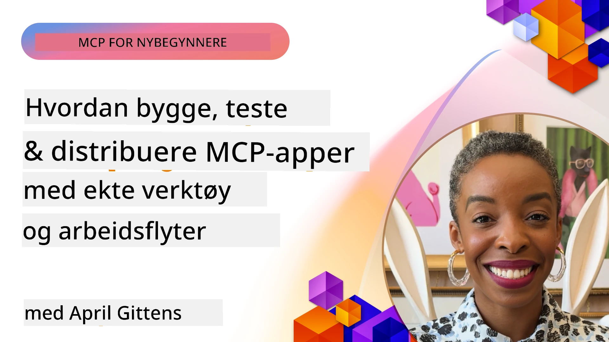

# Praktisk implementering

[](https://youtu.be/vCN9-mKBDfQ)

_(Klikk på bildet over for å se video av denne leksjonen)_

Praktisk implementering er hvor kraften i Model Context Protocol (MCP) blir håndgripelig. Selv om det er viktig å forstå teorien og arkitekturen bak MCP, kommer den virkelige verdien frem når du anvender disse konseptene for å bygge, teste og distribuere løsninger som løser problemer i den virkelige verden. Dette kapitlet bygger bro mellom konseptuell kunnskap og praktisk utvikling, og veileder deg gjennom prosessen med å bringe MCP-baserte applikasjoner til liv.

Enten du utvikler intelligente assistenter, integrerer KI i forretningsarbeidsflyter, eller bygger tilpassede verktøy for databehandling, gir MCP et fleksibelt fundament. Dets språkagnostiske design og offisielle SDK-er for populære programmeringsspråk gjør det tilgjengelig for et bredt spekter av utviklere. Ved å bruke disse SDK-ene kan du raskt lage prototyper, iterere og skalere løsningene dine på tvers av forskjellige plattformer og miljøer.

I de følgende seksjonene finner du praktiske eksempler, eksempel-kode og distribueringsstrategier som viser hvordan du implementerer MCP i C#, Java med Spring, TypeScript, JavaScript og Python. Du vil også lære hvordan du feilsøker og tester MCP-servere, administrerer API-er og distribuerer løsninger til skyen ved bruk av Azure. Disse praktiske ressursene er laget for å akselerere læringen og hjelpe deg med å trygt bygge robuste, produksjonsklare MCP-applikasjoner.

## Oversikt

Denne leksjonen fokuserer på praktiske aspekter ved implementering av MCP på tvers av flere programmeringsspråk. Vi utforsker hvordan du kan bruke MCP SDK-er i C#, Java med Spring, TypeScript, JavaScript og Python for å bygge robuste applikasjoner, feilsøke og teste MCP-servere, og lage gjenbrukbare ressurser, prompts og verktøy.

## Læringsmål

På slutten av denne leksjonen vil du kunne:

- Implementere MCP-løsninger ved bruk av offisielle SDK-er i forskjellige programmeringsspråk
- Feilsøke og teste MCP-servere systematisk
- Lage og bruke serverfunksjoner (Ressurser, Prompts og Verktøy)
- Designe effektive MCP-arbeidsflyter for komplekse oppgaver
- Optimalisere MCP-implementeringer for ytelse og pålitelighet

## Offisielle SDK-ressurser

Model Context Protocol tilbyr offisielle SDK-er for flere språk (i samsvar med [MCP Specification 2025-11-25](https://spec.modelcontextprotocol.io/specification/2025-11-25/)):

- [C# SDK](https://github.com/modelcontextprotocol/csharp-sdk)
- [Java med Spring SDK](https://github.com/modelcontextprotocol/java-sdk) **Merk:** krever avhengighet til [Project Reactor](https://projectreactor.io). (Se [diskusjons-issue 246](https://github.com/orgs/modelcontextprotocol/discussions/246).)
- [TypeScript SDK](https://github.com/modelcontextprotocol/typescript-sdk)
- [Python SDK](https://github.com/modelcontextprotocol/python-sdk)
- [Kotlin SDK](https://github.com/modelcontextprotocol/kotlin-sdk)
- [Go SDK](https://github.com/modelcontextprotocol/go-sdk)

## Arbeide med MCP SDK-er

Denne seksjonen gir praktiske eksempler på implementering av MCP på tvers av flere programmeringsspråk. Du finner eksempel-kode i `samples`-mappen organisert etter språk.

### Tilgjengelige eksempler

Depotet inkluderer [eksempelimplementeringer](../../../04-PracticalImplementation/samples) i følgende språk:

- [C#](./samples/csharp/README.md)
- [Java med Spring](./samples/java/containerapp/README.md)
- [TypeScript](./samples/typescript/README.md)
- [JavaScript](./samples/javascript/README.md)
- [Python](./samples/python/README.md)

Hver eksempel viser nøkkelkonsepter og implementeringsmønstre for MCP for det spesifikke språket og økosystemet.

### Praktiske guider

Ytterligere guider for praktisk MCP-implementering:

- [Paginering og store resultatssett](./pagination/README.md) - Håndtere pekerbasert paginering for verktøy, ressurser og store datasett

## Kjerneserverfunksjoner

MCP-servere kan implementere en hvilken som helst kombinasjon av disse funksjonene:

### Ressurser

Ressurser gir kontekst og data for brukeren eller AI-modellen å bruke:

- Dokumentarkiver
- Kunnskapsdatabaser
- Strukturerte datakilder
- Filsystemer

### Prompts

Prompts er malbaserte meldinger og arbeidsflyter for brukere:

- Forhåndsdefinerte samtalemaler
- Veiledede interaksjonsmønstre
- Spesialiserte dialogstrukturer

### Verktøy

Verktøy er funksjoner for at AI-modellen skal utføre:

- Data behandlingsverktøy
- Eksterne API-integrasjoner
- Beregningsmuligheter
- Søke-funksjonalitet

## Eksempelimplementeringer: C# Implementering

Det offisielle C# SDK-depotet inneholder flere eksempelimplementeringer som demonstrerer forskjellige aspekter av MCP:

- **Enkel MCP-klient**: enkelt eksempel som viser hvordan man oppretter en MCP-klient og kaller verktøy
- **Grunnleggende MCP-server**: minimal serverimplementering med enkel verktøyregistrering
- **Avansert MCP-server**: fullverdig server med verktøyregistrering, autentisering og feilhåndtering
- **ASP.NET-integrasjon**: eksempler som viser integrasjon med ASP.NET Core
- **Mønstere for verktøyimplementering**: forskjellige mønstre for implementering av verktøy med ulik kompleksitet

MCP C# SDK er i forhåndsvisning, og API-er kan endres. Vi vil kontinuerlig oppdatere denne bloggen i takt med SDK-ens utvikling.

### Nøkkelfunksjoner

- [C# MCP Nuget ModelContextProtocol](https://www.nuget.org/packages/ModelContextProtocol)
- Bygge din [første MCP-server](https://devblogs.microsoft.com/dotnet/build-a-model-context-protocol-mcp-server-in-csharp/).

For komplette C# implementeringseksempler, besøk det [offisielle C# SDK-eksempeldepotet](https://github.com/modelcontextprotocol/csharp-sdk)

## Eksempelimplementering: Java med Spring Implementering

Java med Spring SDK tilbyr robuste MCP-implementeringsmuligheter med bedriftsstandardfunksjoner.

### Nøkkelfunksjoner

- Spring Framework-integrasjon
- Sterk typesikkerhet
- Støtte for reaktiv programmering
- Omfattende feilhåndtering

For komplett Java med Spring implementeringseksempel, se [Java med Spring-eksempel](samples/java/containerapp/README.md) i eksempelmappen.

## Eksempelimplementering: JavaScript Implementering

JavaScript SDK gir en lett og fleksibel tilnærming til MCP-implementering.

### Nøkkelfunksjoner

- Støtte for Node.js og nettleser
- Promise-basert API
- Enkel integrasjon med Express og andre rammeverk
- WebSocket-støtte for streaming

For komplett JavaScript implementeringseksempel, se [JavaScript-eksempel](samples/javascript/README.md) i eksempelmappen.

## Eksempelimplementering: Python Implementering

Python SDK tilbyr en Pythonisk tilnærming til MCP-implementering med utmerket integrasjon med ML-rammeverk.

### Nøkkelfunksjoner

- Async/await-støtte med asyncio
- FastAPI-integrasjon``
- Enkel verktøyregistrering
- Innebygd integrasjon med populære ML-biblioteker

For komplett Python implementeringseksempel, se [Python-eksempel](samples/python/README.md) i eksempelmappen.

## API-administrasjon

Azure API Management er et glimrende svar på hvordan vi kan sikre MCP-servere. Ideen er å legge en Azure API Management-instans foran MCP-serveren din og la den håndtere funksjoner du sannsynligvis ønsker som:

- hastighetsbegrensing
- token-håndtering
- overvåking
- lastbalansering
- sikkerhet

### Azure-eksempel

Her er et Azure-eksempel som gjør akkurat det, dvs. [oppretter en MCP-server og sikrer den med Azure API Management](https://github.com/Azure-Samples/remote-mcp-apim-functions-python).

Se hvordan autorisasjonsflyten skjer i bildet under:


I bildet ovenfor skjer følgende:

- Autentisering/autorisasjon skjer ved bruk av Microsoft Entra.
- Azure API Management fungerer som en gateway og bruker policyer for å styre og administrere trafikk.
- Azure Monitor logger alle forespørsler for videre analyse.

#### Autorisasjonsflyt

La oss se nærmere på autorisasjonsflyten:


#### MCP-autorisasjonsspesifikasjon

Lær mer om [MCP Autorisasjonsspesifikasjonen](https://spec.modelcontextprotocol.io/specification/2025-11-25/basic/authorization/)

## Distribuer fjern-MCP-server til Azure

La oss se om vi kan distribuere eksempelet vi nevnte tidligere:

1. Klon repoet

    ```bash
    git clone https://github.com/Azure-Samples/remote-mcp-apim-functions-python.git
    cd remote-mcp-apim-functions-python
    ```

1. Registrer ressursleverandøren `Microsoft.App`.

   - Hvis du bruker Azure CLI, kjør `az provider register --namespace Microsoft.App --wait`.
   - Hvis du bruker Azure PowerShell, kjør `Register-AzResourceProvider -ProviderNamespace Microsoft.App`. Kjør deretter `(Get-AzResourceProvider -ProviderNamespace Microsoft.App).RegistrationState` etter en stund for å sjekke om registreringen er fullført.

1. Kjør denne [azd](https://aka.ms/azd)-kommandoen for å opprette api management-tjenesten, function app (med kode) og alle andre nødvendige Azure-ressurser

    ```shell
    azd up
    ```

    Denne kommandoen skal distribuere alle skytjenestene på Azure

### Test serveren din med MCP Inspector

1. I et **nytt terminalvindu**, installer og kjør MCP Inspector

    ```shell
    npx @modelcontextprotocol/inspector
    ```

    Du skal se et grensesnitt som ligner:

    

1. CTRL-klikk for å laste MCP Inspector web-appen fra URL-en som vises av appen (f.eks. [http://127.0.0.1:6274/#resources](http://127.0.0.1:6274/#resources))
1. Sett transporttypen til `SSE`
1. Sett URL til din kjørende API Management SSE-endepunkt vist etter `azd up` og **Koble til**:

    ```shell
    https://<apim-servicename-from-azd-output>.azure-api.net/mcp/sse
    ```

1. **List Tools**. Klikk på et verktøy og **Run Tool**.

Hvis alle stegene har fungert, skal du nå være koblet til MCP-serveren og ha klart å kalle et verktøy.

## MCP-servere for Azure

[Remote-mcp-functions](https://github.com/Azure-Samples/remote-mcp-functions-dotnet): Dette settet med repositorier er raskstart-maler for å bygge og distribuere tilpassede fjern-MCP (Model Context Protocol) servere ved bruk av Azure Functions med Python, C# .NET eller Node/TypeScript.

Eksemplene gir en komplett løsning som lar utviklere:

- Bygge og kjøre lokalt: utvikle og feilsøke en MCP-server på lokal maskin
- Distribuere til Azure: enkelt distribuere til skyen med en enkel azd up-kommando
- Koble til fra klienter: koble til MCP-serveren fra forskjellige klienter inkludert VS Codes Copilot agent-modus og MCP Inspector-verktøyet

### Nøkkelfunksjoner

- Sikkerhet ved design: MCP-serveren er sikret med nøkler og HTTPS
- Autentiseringsvalg: støtter OAuth ved bruk av innebygd autentisering og/eller API Management
- Nettverksisolasjon: tillater nettverksisolasjon med Azure Virtual Networks (VNET)
- Serverløs arkitektur: utnytter Azure Functions for skalerbar, hendelsesdrevet kjøring
- Lokal utvikling: omfattende støtte for lokal utvikling og feilsøking
- Enkel distribusjon: strømlinjeformet distribusjonsprosess til Azure

Depotet inkluderer alle nødvendige konfigurasjonsfiler, kildekode, og infrastrukturdefinisjoner for raskt å komme i gang med en produksjonsklar MCP-serverimplementering.

- [Azure Remote MCP Functions Python](https://github.com/Azure-Samples/remote-mcp-functions-python) - eksempelimplementering av MCP ved bruk av Azure Functions med Python

- [Azure Remote MCP Functions .NET](https://github.com/Azure-Samples/remote-mcp-functions-dotnet) - eksempelimplementering av MCP ved bruk av Azure Functions med C# .NET

- [Azure Remote MCP Functions Node/Typescript](https://github.com/Azure-Samples/remote-mcp-functions-typescript) - eksempelimplementering av MCP ved bruk av Azure Functions med Node/TypeScript.

## Viktige punkter

- MCP SDK-er gir språkspesifikke verktøy for å implementere robuste MCP-løsninger
- Feilsøkings- og testprosessen er kritisk for pålitelige MCP-applikasjoner
- Gjenbrukbare prompt-maler muliggjør konsistente AI-interaksjoner
- Velutformede arbeidsflyter kan orkestrere komplekse oppgaver med flere verktøy
- Implementering av MCP-løsninger krever hensyn til sikkerhet, ytelse og feilhåndtering

## Øvelse

Design en praktisk MCP-arbeidsflyt som adresserer et reelt problem i ditt område:

1. Identifiser 3-4 verktøy som ville være nyttige for å løse dette problemet
2. Lag et arbeidsflyts-diagram som viser hvordan disse verktøyene samhandler
3. Implementer en grunnleggende versjon av ett av verktøyene ved bruk av ditt foretrukne språk
4. Lag en prompt-mal som hjelper modellen å bruke verktøyet effektivt

## Ytterligere ressurser

---

## Hva kommer nå

Neste: [Avanserte temaer](../05-AdvancedTopics/README.md)

---

<!-- CO-OP TRANSLATOR DISCLAIMER START -->
**Ansvarsfraskrivelse**:
Dette dokumentet er oversatt ved hjelp av AI-oversettelsestjenesten [Co-op Translator](https://github.com/Azure/co-op-translator). Selv om vi tilstreber nøyaktighet, vær oppmerksom på at automatiske oversettelser kan inneholde feil eller unøyaktigheter. Det originale dokumentet på det opprinnelige språket bør betraktes som den autoritative kilden. For kritisk informasjon anbefales profesjonell menneskelig oversettelse. Vi er ikke ansvarlige for misforståelser eller feiltolkninger som oppstår ved bruk av denne oversettelsen.
<!-- CO-OP TRANSLATOR DISCLAIMER END -->