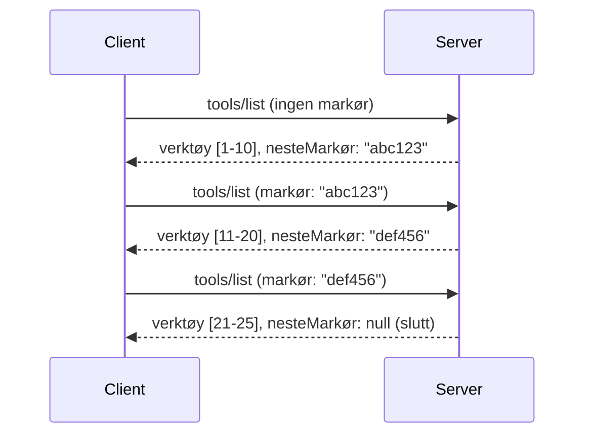

# Paginering og store resultatsamlinger i MCP

Når din MCP-server håndterer store datasett – enten det er tusenvis av filer, databaseoppføringer eller søkeresultater – trenger du paginering for å administrere minnet effektivt og gi responsive brukeropplevelser. Denne guiden dekker hvordan man implementerer og bruker paginering i MCP.

## Hvorfor paginering er viktig

Uten paginering kan store svar forårsake:

- **Minnemangel** – Laste millioner av oppføringer samtidig
- **Sakte responstider** – Brukere må vente mens alle data lastes
- **Timeout-feil** – Forespørsler overskrider tidsgrense
- **Dårlig AI-ytelse** – LLM-er sliter med enorm kontekst

MCP bruker **kursorbasert paginering** for pålitelig og konsistent gjennomgang av resultatsamlinger.

---

## Hvordan MCP-paginering fungerer

### Kursor-konseptet

En **kursor** er en ugjennomsiktig streng som markerer din posisjon i en resultatsamling. Tenk på det som et bokmerke i en lang bok.


### Paginering i MCP-metoder

Disse MCP-metodene støtter paginering:

| Metode | Returnerer | Støtte for kursor |
|--------|------------|-------------------|
| `tools/list` | Verktøydefinisjoner | ✅ |
| `resources/list` | Ressursdefinisjoner | ✅ |
| `prompts/list` | Prompt-definisjoner | ✅ |
| `resources/templates/list` | Ressursmaler | ✅ |

---

## Serverimplementering

### Python (FastMCP)

```python
from mcp.server import Server
from mcp.types import Tool, ListToolsResult
import math

app = Server("paginated-server")

# Simulert stort datasett
ALL_TOOLS = [
    Tool(name=f"tool_{i}", description=f"Tool number {i}", inputSchema={})
    for i in range(100)
]

PAGE_SIZE = 10

@app.list_tools()
async def list_tools(cursor: str | None = None) -> ListToolsResult:
    """List tools with pagination support."""
    
    # Dekod cursor for å få startindeks
    start_index = 0
    if cursor:
        try:
            start_index = int(cursor)
        except ValueError:
            start_index = 0
    
    # Hent side med resultater
    end_index = min(start_index + PAGE_SIZE, len(ALL_TOOLS))
    page_tools = ALL_TOOLS[start_index:end_index]
    
    # Beregn neste cursor
    next_cursor = None
    if end_index < len(ALL_TOOLS):
        next_cursor = str(end_index)
    
    return ListToolsResult(
        tools=page_tools,
        nextCursor=next_cursor
    )
```

### TypeScript

```typescript
import { Server } from "@modelcontextprotocol/sdk/server/index.js";
import { ListToolsResultSchema } from "@modelcontextprotocol/sdk/types.js";

const server = new Server({
  name: "paginated-server",
  version: "1.0.0"
});

// Simulert stort datasett
const ALL_TOOLS = Array.from({ length: 100 }, (_, i) => ({
  name: `tool_${i}`,
  description: `Tool number ${i}`,
  inputSchema: { type: "object", properties: {} }
}));

const PAGE_SIZE = 10;

server.setRequestHandler(ListToolsResultSchema, async (request) => {
  // Dekod pekeren
  let startIndex = 0;
  if (request.params?.cursor) {
    startIndex = parseInt(request.params.cursor, 10) || 0;
  }
  
  // Hent side med resultater
  const endIndex = Math.min(startIndex + PAGE_SIZE, ALL_TOOLS.length);
  const pageTools = ALL_TOOLS.slice(startIndex, endIndex);
  
  // Beregn neste peker
  const nextCursor = endIndex < ALL_TOOLS.length ? String(endIndex) : undefined;
  
  return {
    tools: pageTools,
    nextCursor
  };
});
```

### Java (Spring MCP)

```java
@Service
public class PaginatedToolService {
    
    private static final int PAGE_SIZE = 10;
    private final List<Tool> allTools;
    
    public PaginatedToolService() {
        // Initialiser stort datasett
        this.allTools = IntStream.range(0, 100)
            .mapToObj(i -> new Tool("tool_" + i, "Tool number " + i, Map.of()))
            .collect(Collectors.toList());
    }
    
    @McpMethod("tools/list")
    public ListToolsResult listTools(@Param("cursor") String cursor) {
        // Dekode markør
        int startIndex = 0;
        if (cursor != null && !cursor.isEmpty()) {
            try {
                startIndex = Integer.parseInt(cursor);
            } catch (NumberFormatException e) {
                startIndex = 0;
            }
        }
        
        // Hent side med resultater
        int endIndex = Math.min(startIndex + PAGE_SIZE, allTools.size());
        List<Tool> pageTools = allTools.subList(startIndex, endIndex);
        
        // Beregn neste markør
        String nextCursor = endIndex < allTools.size() ? String.valueOf(endIndex) : null;
        
        return new ListToolsResult(pageTools, nextCursor);
    }
}
```

---

## Klientimplementering

### Python-klient

```python
from mcp import ClientSession

async def get_all_tools(session: ClientSession) -> list:
    """Fetch all tools using pagination."""
    all_tools = []
    cursor = None
    
    while True:
        result = await session.list_tools(cursor=cursor)
        all_tools.extend(result.tools)
        
        if result.nextCursor is None:
            break
        cursor = result.nextCursor
    
    return all_tools

# Bruk
async with client_session as session:
    tools = await get_all_tools(session)
    print(f"Found {len(tools)} tools")
```

### TypeScript-klient

```typescript
import { Client } from "@modelcontextprotocol/sdk/client/index.js";

async function getAllTools(client: Client): Promise<Tool[]> {
  const allTools: Tool[] = [];
  let cursor: string | undefined = undefined;
  
  do {
    const result = await client.listTools({ cursor });
    allTools.push(...result.tools);
    cursor = result.nextCursor;
  } while (cursor);
  
  return allTools;
}

// Bruk
const tools = await getAllTools(client);
console.log(`Found ${tools.length} tools`);
```

### Lazy Loading-mønster

For veldig store datasett, last sider etter behov:

```python
class PaginatedToolIterator:
    """Lazily iterate through paginated tools."""
    
    def __init__(self, session: ClientSession):
        self.session = session
        self.cursor = None
        self.buffer = []
        self.exhausted = False
    
    async def __anext__(self):
        # Returner fra bufferen hvis tilgjengelig
        if self.buffer:
            return self.buffer.pop(0)
        
        # Sjekk om vi har gått gjennom alle sider
        if self.exhausted:
            raise StopAsyncIteration
        
        # Hent neste side
        result = await self.session.list_tools(cursor=self.cursor)
        self.buffer = list(result.tools)
        self.cursor = result.nextCursor
        
        if self.cursor is None:
            self.exhausted = True
        
        if not self.buffer:
            raise StopAsyncIteration
        
        return self.buffer.pop(0)
    
    def __aiter__(self):
        return self

# Bruk - minneeffektiv for store datasett
async for tool in PaginatedToolIterator(session):
    process_tool(tool)
```

---

## Paginering for ressurser

Ressurser trenger ofte paginering for kataloger eller store datasett:

```python
from mcp.server import Server
from mcp.types import Resource, ListResourcesResult
import os

app = Server("file-server")

@app.list_resources()
async def list_resources(cursor: str | None = None) -> ListResourcesResult:
    """List files in directory with pagination."""
    
    directory = "/data/files"
    all_files = sorted(os.listdir(directory))
    
    # Dekode markør (filindeks)
    start_index = int(cursor) if cursor else 0
    page_size = 20
    end_index = min(start_index + page_size, len(all_files))
    
    # Opprett ressursliste for denne siden
    resources = []
    for filename in all_files[start_index:end_index]:
        filepath = os.path.join(directory, filename)
        resources.append(Resource(
            uri=f"file://{filepath}",
            name=filename,
            mimeType="application/octet-stream"
        ))
    
    # Beregn neste markør
    next_cursor = str(end_index) if end_index < len(all_files) else None
    
    return ListResourcesResult(
        resources=resources,
        nextCursor=next_cursor
    )
```

---

## Kursor designstrategier

### Strategi 1: Indeksbasert (Enkel)

```python
# Markøren er bare indeksen
cursor = "50"  # Start ved element 50
```

**Fordeler:** Enkel, stateless  
**Ulemper:** Resultater kan skifte hvis elementer legges til/fjernes

### Strategi 2: ID-basert (Stabil)

```python
# Markør er den sist sette ID-en
cursor = "item_abc123"  # Start etter dette elementet
```

**Fordeler:** Stabil selv om elementer endres  
**Ulemper:** Krever ordnede ID-er

### Strategi 3: Kodet tilstand (Kompleks)

```python
import base64
import json

def encode_cursor(state: dict) -> str:
    return base64.b64encode(json.dumps(state).encode()).decode()

def decode_cursor(cursor: str) -> dict:
    return json.loads(base64.b64decode(cursor).decode())

# Markøren inneholder flere tilstands felt
cursor = encode_cursor({
    "offset": 50,
    "filter": "active",
    "sort": "name"
})
```

**Fordeler:** Kan kode kompleks tilstand  
**Ulemper:** Mer kompleks, større kursorstrenger

---

## Beste praksis

### 1. Velg passende sidestørrelser

```python
# Vurder datastørrelsen
PAGE_SIZE_SMALL_ITEMS = 100   # Enkel metadata
PAGE_SIZE_MEDIUM_ITEMS = 20   # Rikere objekter
PAGE_SIZE_LARGE_ITEMS = 5     # Komplekst innhold
```

### 2. Håndter ugyldige kursorer grasiøst

```python
@app.list_tools()
async def list_tools(cursor: str | None = None) -> ListToolsResult:
    try:
        start_index = int(cursor) if cursor else 0
        if start_index < 0 or start_index >= len(ALL_TOOLS):
            start_index = 0  # Tilbakestill til begynnelsen
    except (ValueError, TypeError):
        start_index = 0  # Ugyldig markør, start på nytt
    # ...
```

### 3. Inkluder totalantall (valgfritt)

```python
return ListToolsResult(
    tools=page_tools,
    nextCursor=next_cursor,
    # Noen implementasjoner inkluderer total for UI-fremdrift
    _meta={"total": len(ALL_TOOLS)}
)
```

### 4. Test nykkepunkter

```python
async def test_pagination():
    # Tomt resultatssett
    result = await session.list_tools()
    assert result.tools == []
    assert result.nextCursor is None
    
    # Enkel side
    result = await session.list_tools()
    assert len(result.tools) <= PAGE_SIZE
    
    # Ugyldig peker
    result = await session.list_tools(cursor="invalid")
    assert result.tools  # Skal returnere første side
```

---

## Vanlige feller

### ❌ Returnere alle resultater og så paginere på klienten

```python
# DÅRLIG: Laster alt inn i minnet
@app.list_tools()
async def list_tools() -> ListToolsResult:
    all_tools = load_all_tools()  # 1 million verktøy!
    return ListToolsResult(tools=all_tools)
```

### ✅ Paginere ved datakilden

```python
# BRA: Laster kun det som trengs
@app.list_tools()
async def list_tools(cursor: str | None = None) -> ListToolsResult:
    offset = int(cursor) if cursor else 0
    tools = await db.query_tools(offset=offset, limit=PAGE_SIZE)
    return ListToolsResult(tools=tools, nextCursor=...)
```

---

## Hva er neste

- [Modul 5.14 - Kontekst Engineering](../../05-AdvancedTopics/mcp-contextengineering/README.md)  
- [Modul 8 - Beste praksiser](../../08-BestPractices/README.md)  
- [3.8 - Teste din MCP-server](../../03-GettingStarted/08-testing/README.md)  

---

## Ekstra ressurser

- [MCP-spesifikasjon - Paginering](https://spec.modelcontextprotocol.io/specification/2025-11-25/)  
- [Kursorbasert paginering forklart](https://slack.engineering/evolving-api-pagination-at-slack/)  
- [Python SDK paginerings tester](https://github.com/modelcontextprotocol/python-sdk/blob/main/tests/client/test_list_methods_cursor.py)

---

<!-- CO-OP TRANSLATOR DISCLAIMER START -->
**Ansvarsfraskrivelse**:
Dette dokumentet er oversatt ved hjelp av AI-oversettelsestjenesten [Co-op Translator](https://github.com/Azure/co-op-translator). Selv om vi streber etter nøyaktighet, vennligst vær oppmerksom på at automatiserte oversettelser kan inneholde feil eller unøyaktigheter. Det opprinnelige dokumentet på sitt originale språk skal anses som den autoritative kilden. For kritisk informasjon anbefales profesjonell menneskelig oversettelse. Vi er ikke ansvarlige for misforståelser eller feiltolkninger som oppstår ved bruk av denne oversettelsen.
<!-- CO-OP TRANSLATOR DISCLAIMER END -->