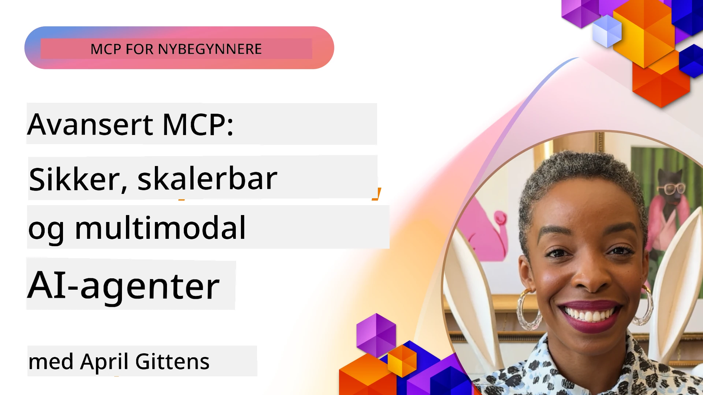

# Avanserte emner i MCP

_(Klikk på bildet over for å se video av denne leksjonen)_

Dette kapittelet dekker en rekke avanserte emner i implementering av Model Context Protocol (MCP), inkludert multimodal integrasjon, skalerbarhet, sikkerhets beste praksis, og bedriftsintegrasjon. Disse temaene er avgjørende for å bygge robuste og produksjonsklare MCP-applikasjoner som kan møte kravene til moderne AI-systemer.

## Oversikt

Denne leksjonen utforsker avanserte konsepter i implementering av Model Context Protocol, med fokus på multimodal integrasjon, skalerbarhet, sikkerhets beste praksis, og bedriftsintegrasjon. Disse temaene er viktige for å bygge produksjonsmodne MCP-applikasjoner som kan håndtere komplekse krav i bedriftsmiljøer.

## Læringsmål

Innen slutten av denne leksjonen vil du kunne:

- Implementere multimodale funksjoner innenfor MCP-rammeverk
- Designe skalerbare MCP-arkitekturer for høyt belastede scenarioer
- Anvende sikkerhets beste praksis i samsvar med MCPs sikkerhetsprinsipper
- Integrere MCP med bedrifts-AI-systemer og rammeverk
- Optimalisere ytelse og pålitelighet i produksjonsmiljøer

## Leksjoner og eksempelprosjekter

| Lenke | Tittel | Beskrivelse |
|------|-------|-------------|
| [5.1 Integrasjon med Azure](./mcp-integration/README.md) | Integrasjon med Azure | Lær hvordan du integrerer MCP Serveren din på Azure |
| [5.2 Multimodal eksempel](./mcp-multi-modality/README.md) | MCP multimodale eksempler | Eksempler for lyd, bilde og multimodale svar |
| [5.3 MCP OAuth2-eksempel](../../../05-AdvancedTopics/mcp-oauth2-demo) | MCP OAuth2-demo | Minimal Spring Boot-app som viser OAuth2 med MCP, både som autorisasjons- og ressursserver. Demonstrerer sikker tokenutstedelse, beskyttede endepunkter, Azure Container Apps-distribusjon og API Management-integrasjon. |
| [5.4 Rotkontekster](./mcp-root-contexts/README.md) | Rotkontekster | Lær mer om rotkontekst og hvordan du implementerer dem |
| [5.5 Rutestyring](./mcp-routing/README.md) | Rutestyring | Lær om forskjellige typer rutestyring |
| [5.6 Prøvetaking](./mcp-sampling/README.md) | Prøvetaking | Lær å arbeide med prøvetaking |
| [5.7 Skalering](./mcp-scaling/README.md) | Skalering | Lær om skalering |
| [5.8 Sikkerhet](./mcp-security/README.md) | Sikkerhet | Sikre MCP Serveren din |
| [5.9 Nett-søk MCP](./web-search-mcp/README.md) | Nett-søk MCP | Python MCP-server og klient som integrerer med SerpAPI for sanntidssøk på web, nyheter, produkter og Q&A. Demonstrerer flerverktøysorkestrering, ekstern API-integrasjon og robust feilbehandling. |
| [5.10 Sanntidsstrømming](./mcp-realtimestreaming/README.md) | Strømming | Sanntids data strømning har blitt essensielt i dagens datadrevne verden, der bedrifter og applikasjoner krever umiddelbar tilgang til informasjon for å ta tidsriktige beslutninger. |
| [5.11 Sanntids web-søk](./mcp-realtimesearch/README.md) | Web-søk | Sanntids nett-søk: hvordan MCP transformerer sanntids web-søk ved å tilby en standardisert tilnærming til kontekststyring på tvers av AI-modeller, søkemotorer og applikasjoner. |
| [5.12 Entra ID-autentisering for Model Context Protocol-servere](./mcp-security-entra/README.md) | Entra ID-autentisering | Microsoft Entra ID tilbyr en robust skybasert identitets- og tilgangsstyringsløsning som hjelper med å sikre at bare autoriserte brukere og applikasjoner kan kommunisere med MCP-serveren din. |
| [5.13 Azure AI Foundry-agentintegrasjon](./mcp-foundry-agent-integration/README.md) | Azure AI Foundry-integrasjon | Lær hvordan du integrerer Model Context Protocol-servere med Azure AI Foundry-agenter, noe som muliggjør kraftig verktøysorkestrering og bedrifts-AI-funksjoner med standardiserte tilkoblinger til eksterne datakilder. |
| [5.14 Konsteknikk](./mcp-contextengineering/README.md) | Konsteknikk | Fremtidige muligheter innen konsteknikk for MCP-servere, inkludert kontekstoptimalisering, dynamisk kontekststyring, og strategier for effektiv prompt engineering innen MCP-rammeverk. |
| [5.15 Egendefinert transport](./mcp-transport/README.md) | Egendefinert transport | Lær hvordan du implementerer egendefinerte transportmekanismer for spesialiserte MCP-kommunikasjonsscenarier. |
| [5.16 Dypdykk i protokollfunksjoner](./mcp-protocol-features/README.md) | Protokollfunksjoner | Mestre avanserte protokollfunksjoner inkludert fremdriftsvarsler, avbrytelse av forespørsler, ressursmaler og feilhåndteringsmønstre. |

> **Ny i MCP-spesifikasjonen 2025-11-25**: Spesifikasjonen inkluderer nå eksperimentell støtte for **Tasks** (langvarige operasjoner med fremdriftssporing), **Tool Annotations** (metadata om verktøyatferd for sikkerhet), **URL Mode Elicitation** (forespørsel om spesifikt URL-innhold fra klienter) og forbedrede **Roots** (for arbeidsområde-kontekststyring). Se [MCP-spesifikasjonens endringslogg](https://spec.modelcontextprotocol.io/) for fullstendige detaljer.

## Ytterligere referanser

For den mest oppdaterte informasjonen om avanserte MCP-emner, se:
- [MCP-dokumentasjon](https://modelcontextprotocol.io/)
- [MCP-spesifikasjon (2025-11-25)](https://spec.modelcontextprotocol.io/specification/2025-11-25/)
- [GitHub-repository](https://github.com/modelcontextprotocol)
- [OWASP MCP top 10](https://microsoft.github.io/mcp-azure-security-guide/mcp/) - sikkerhetsrisikoer og tiltak
- [MCP Security Summit Workshop (Sherpa)](https://azure-samples.github.io/sherpa/) - praktisk sikkerhetstrening

## Viktige poenger

- Multimodale MCP-implementeringer utvider AI-funksjonalitet utover tekstbehandling
- Skalerbarhet er avgjørende for bedriftsdistribusjoner og kan adresseres gjennom horisontal og vertikal skalering
- Omfattende sikkerhetstiltak beskytter data og sikrer riktig tilgangskontroll
- Bedriftsintegrasjon med plattformer som Azure OpenAI og Microsoft AI Foundry forbedrer MCP-funksjonalitet
- Avanserte MCP-implementeringer drar nytte av optimaliserte arkitekturer og nøye ressursforvaltning

## Øvelse

Design en bedriftsmoden MCP-implementering for en spesifikk brukstilfelle:

1. Identifiser multimodale krav for ditt brukstilfelle
2. Skisser sikkerhetskontroller som trengs for å beskytte sensitiv data
3. Design en skalerbar arkitektur som kan håndtere varierende belastning
4. Planlegg integrasjonspunkter med bedrifts-AI-systemer
5. Dokumenter potensielle ytelsesflaskehalser og tiltak for å redusere dem

## Tilleggsressurser

- [Azure OpenAI-dokumentasjon](https://learn.microsoft.com/en-us/azure/ai-services/openai/)
- [Microsoft AI Foundry-dokumentasjon](https://learn.microsoft.com/en-us/ai-services/)

---

## Hva er neste

Utforsk leksjonene i denne modulen med start: [5.1 MCP integrasjon](./mcp-integration/README.md)

Når du har fullført denne modulen, fortsett til: [Modul 6: Fellesskapsbidrag](../06-CommunityContributions/README.md)

---

<!-- CO-OP TRANSLATOR DISCLAIMER START -->
**Ansvarsfraskrivelse**:
Dette dokumentet har blitt oversatt ved hjelp av AI-oversettelsestjenesten [Co-op Translator](https://github.com/Azure/co-op-translator). Selv om vi streber etter nøyaktighet, vennligst vær oppmerksom på at automatiske oversettelser kan inneholde feil eller unøyaktigheter. Det originale dokumentet på det opprinnelige språket skal anses som den autoritative kilden. For kritisk informasjon anbefales profesjonell menneskelig oversettelse. Vi er ikke ansvarlige for misforståelser eller feiltolkninger som oppstår fra bruk av denne oversettelsen.
<!-- CO-OP TRANSLATOR DISCLAIMER END -->