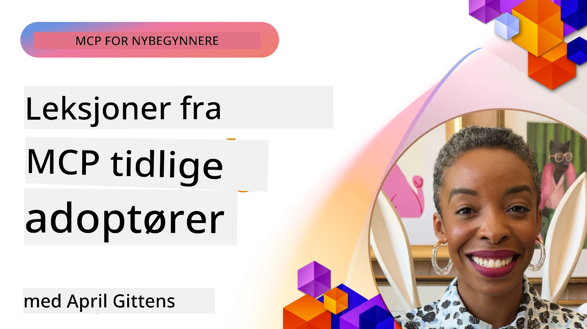

# 🌟 Lærdommer fra tidlige brukere

[](https://youtu.be/jds7dSmNptE)

_(Klikk på bildet over for å se video av denne leksjonen)_

## 🎯 Hva denne modulen dekker

Denne modulen utforsker hvordan ekte organisasjoner og utviklere utnytter Model Context Protocol (MCP) for å løse faktiske utfordringer og drive innovasjon. Gjennom detaljerte casestudier, praktiske prosjekter og praktiske eksempler vil du oppdage hvordan MCP muliggjør sikker, skalerbar AI-integrasjon som kobler til språkmodeller, verktøy og bedriftsdata.

### 📚 Se MCP i praksis

Vil du se disse prinsippene i bruk i produksjonsklare verktøy? Sjekk ut våre [**10 Microsoft MCP-servere som transformerer utviklerproduktivitet**](microsoft-mcp-servers.md), som viser ekte Microsoft MCP-servere du kan bruke i dag.

## Oversikt

Denne leksjonen utforsker hvordan tidlige brukere har utnyttet Model Context Protocol (MCP) for å løse virkelige utfordringer og drive innovasjon på tvers av industrier. Gjennom detaljerte casestudier og praktiske prosjekter vil du se hvordan MCP muliggjør standardisert, sikker og skalerbar AI-integrasjon—som kobler store språkmodeller, verktøy og bedriftsdata i ett samlet rammeverk. Du får praktisk erfaring med å designe og bygge MCP-baserte løsninger, lære av gjennomprøvde implementeringsmønstre, og oppdage beste praksis for å distribuere MCP i produksjonsmiljøer. Leksjonen fremhever også nye trender, fremtidige retninger og open-source ressurser som hjelper deg å holde deg i front på MCP-teknologi og dets stadig utviklende økosystem.

## Læringsmål

- Analysere virkelige MCP-implementeringer på tvers av ulike industrier  
- Designe og bygge komplette MCP-baserte applikasjoner  
- Utforske nye trender og fremtidige retninger innen MCP-teknologi  
- Anvende beste praksis i faktiske utviklingsscenarier  

## Virkelige MCP-implementeringer

### Case Study 1: Automatisering av kundestøtte for bedrifter

Et multinasjonalt selskap implementerte en MCP-basert løsning for å standardisere AI-interaksjoner på tvers av sine kundestøttesystemer. Dette gjorde dem i stand til å:

- Skape et samlet grensesnitt for flere LLM-leverandører  
- Opprettholde konsistent prompt-håndtering på tvers av avdelinger  
- Implementere robuste sikkerhets- og samsvarskontroller  
- Enkelt bytte mellom ulike AI-modeller basert på spesifikke behov  

**Teknisk implementering:**

```python
# Python MCP server implementasjon for kundestøtte
import logging
import asyncio
from modelcontextprotocol import create_server, ServerConfig
from modelcontextprotocol.server import MCPServer
from modelcontextprotocol.transports import create_http_transport
from modelcontextprotocol.resources import ResourceDefinition
from modelcontextprotocol.prompts import PromptDefinition
from modelcontextprotocol.tool import ToolDefinition

# Konfigurer logging
logging.basicConfig(level=logging.INFO)

async def main():
    # Opprett serverkonfigurasjon
    config = ServerConfig(
        name="Enterprise Customer Support Server",
        version="1.0.0",
        description="MCP server for handling customer support inquiries"
    )
    
    # Initialiser MCP server
    server = create_server(config)
    
    # Registrer kunnskapsbase ressurser
    server.resources.register(
        ResourceDefinition(
            name="customer_kb",
            description="Customer knowledge base documentation"
        ),
        lambda params: get_customer_documentation(params)
    )
    
    # Registrer prompt maler
    server.prompts.register(
        PromptDefinition(
            name="support_template",
            description="Templates for customer support responses"
        ),
        lambda params: get_support_templates(params)
    )
    
    # Registrer støtteredskaper
    server.tools.register(
        ToolDefinition(
            name="ticketing",
            description="Create and update support tickets"
        ),
        handle_ticketing_operations
    )
    
    # Start server med HTTP transport
    transport = create_http_transport(port=8080)
    await server.run(transport)

if __name__ == "__main__":
    asyncio.run(main())
```
  
**Resultater:** 30 % reduksjon i modellkostnader, 45 % forbedring i responskonsistens, og forbedret samsvar på tvers av globale operasjoner.

### Case Study 2: Diagnostisk assistent for helsesektoren

En helsetjenesteleverandør utviklet en MCP-infrastruktur for å integrere flere spesialiserte medisinske AI-modeller samtidig som sensitive pasientdata ble beskyttet:

- Sømløst bytte mellom generelle og spesialiserte medisinske modeller  
- Strenge personvernkontroller og revisjonsspor  
- Integrasjon med eksisterende elektroniske pasientjournaler (EHR-systemer)  
- Konsistent prompt-engineering for medisinsk terminologi  

**Teknisk implementering:**

```csharp
// C# MCP host application implementation in healthcare application
using Microsoft.Extensions.DependencyInjection;
using ModelContextProtocol.SDK.Client;
using ModelContextProtocol.SDK.Security;
using ModelContextProtocol.SDK.Resources;

public class DiagnosticAssistant
{
    private readonly MCPHostClient _mcpClient;
    private readonly PatientContext _patientContext;
    
    public DiagnosticAssistant(PatientContext patientContext)
    {
        _patientContext = patientContext;
        
        // Configure MCP client with healthcare-specific settings
        var clientOptions = new ClientOptions
        {
            Name = "Healthcare Diagnostic Assistant",
            Version = "1.0.0",
            Security = new SecurityOptions
            {
                Encryption = EncryptionLevel.Medical,
                AuditEnabled = true
            }
        };
        
        _mcpClient = new MCPHostClientBuilder()
            .WithOptions(clientOptions)
            .WithTransport(new HttpTransport("https://healthcare-mcp.example.org"))
            .WithAuthentication(new HIPAACompliantAuthProvider())
            .Build();
    }
    
    public async Task<DiagnosticSuggestion> GetDiagnosticAssistance(
        string symptoms, string patientHistory)
    {
        // Create request with appropriate resources and tool access
        var resourceRequest = new ResourceRequest
        {
            Name = "patient_records",
            Parameters = new Dictionary<string, object>
            {
                ["patientId"] = _patientContext.PatientId,
                ["requestingProvider"] = _patientContext.ProviderId
            }
        };
        
        // Request diagnostic assistance using appropriate prompt
        var response = await _mcpClient.SendPromptRequestAsync(
            promptName: "diagnostic_assistance",
            parameters: new Dictionary<string, object>
            {
                ["symptoms"] = symptoms,
                patientHistory = patientHistory,
                relevantGuidelines = _patientContext.GetRelevantGuidelines()
            });
            
        return DiagnosticSuggestion.FromMCPResponse(response);
    }
}
```
  
**Resultater:** Forbedrede diagnostiske forslag for leger samtidig som full HIPAA-samsvar ble opprettholdt, og betydelig reduksjon i kontekstbytte mellom systemer.

### Case Study 3: Risikoanalyse for finansielle tjenester

En finansinstitusjon implementerte MCP for å standardisere sine risikoanalyser på tvers av ulike avdelinger:

- Opprettet et samlet grensesnitt for modeller for kreditt-, svindel- og investeringsrisiko  
- Implementerte strenge tilgangskontroller og modellversjonering  
- Sikret revisjonsmuligheter for alle AI-anbefalinger  
- Opprettholdt konsistent dataformatering på tvers av forskjellige systemer  

**Teknisk implementering:**

```java
// Java MCP-server for finansiell risikovurdering
import org.mcp.server.*;
import org.mcp.security.*;

public class FinancialRiskMCPServer {
    public static void main(String[] args) {
        // Opprett MCP-server med funksjoner for finansiell overholdelse
        MCPServer server = new MCPServerBuilder()
            .withModelProviders(
                new ModelProvider("risk-assessment-primary", new AzureOpenAIProvider()),
                new ModelProvider("risk-assessment-audit", new LocalLlamaProvider())
            )
            .withPromptTemplateDirectory("./compliance/templates")
            .withAccessControls(new SOCCompliantAccessControl())
            .withDataEncryption(EncryptionStandard.FINANCIAL_GRADE)
            .withVersionControl(true)
            .withAuditLogging(new DatabaseAuditLogger())
            .build();
            
        server.addRequestValidator(new FinancialDataValidator());
        server.addResponseFilter(new PII_RedactionFilter());
        
        server.start(9000);
        
        System.out.println("Financial Risk MCP Server running on port 9000");
    }
}
```
  
**Resultater:** Forbedret regulatorisk samsvar, 40 % raskere modellutrullingssykluser, og bedre konsistens i risikovurdering på tvers av avdelinger.

### Case Study 4: Microsoft Playwright MCP-server for nettleserautomatisering

Microsoft utviklet [Playwright MCP-serveren](https://github.com/microsoft/playwright-mcp) for å muliggjøre sikker, standardisert nettleserautomatisering via Model Context Protocol. Denne produksjonsklare serveren lar AI-agenter og LLM-er interagere med nettlesere på en kontrollert, revisjonssikker og utvidbar måte—med brukstilfeller som automatisert webtesting, datauttrekk og ende-til-ende arbeidsflyter.

> **🎯 Produksjonsklart verktøy**  
>  
> Denne casestudien viser en ekte MCP-server du kan bruke i dag! Lær mer om Playwright MCP Server og 9 andre produksjonsklare Microsoft MCP-servere i vår [**Microsoft MCP Servers Guide**](microsoft-mcp-servers.md#8--playwright-mcp-server).

**Nøkkelfunksjoner:**  
- Eksponerer nettleserautomatiseringsmuligheter (navigasjon, utfylling av skjema, skjermbildeopptak osv.) som MCP-verktøy  
- Implementerer strenge tilgangskontroller og sandkassemiljø for å forhindre uautoriserte handlinger  
- Tilbyr detaljerte revisjonslogger for all nettleserinteraksjon  
- Støtter integrasjon med Azure OpenAI og andre LLM-leverandører for agentdrevet automatisering  
- Driver GitHub Copilots Coding Agent med nettlesingsmuligheter  

**Teknisk implementering:**

```typescript
// TypeScript: Registrerer Playwright nettleserautomatiseringsverktøy i en MCP-server
import { createServer, ToolDefinition } from 'modelcontextprotocol';
import { launch } from 'playwright';

const server = createServer({
  name: 'Playwright MCP Server',
  version: '1.0.0',
  description: 'MCP server for browser automation using Playwright'
});

// Registrer et verktøy for å navigere til en URL og ta et skjermbilde
server.tools.register(
  new ToolDefinition({
    name: 'navigate_and_screenshot',
    description: 'Navigate to a URL and capture a screenshot',
    parameters: {
      url: { type: 'string', description: 'The URL to visit' }
    }
  }),
  async ({ url }) => {
    const browser = await launch();
    const page = await browser.newPage();
    await page.goto(url);
    const screenshot = await page.screenshot();
    await browser.close();
    return { screenshot };
  }
);

// Start MCP-serveren
server.listen(8080);
```
  
**Resultater:**

- Muliggjort sikker, programmert nettleserautomatisering for AI-agenter og LLM-er  
- Redusert manuelt testarbeid og forbedret testdekning for webapplikasjoner  
- Tilbyr et gjenbrukbart, utvidbart rammeverk for nettleserbasert verktøyintegrasjon i bedriftsmiljøer  
- Driver GitHub Copilots nettlesingskapasiteter  

**Referanser:**  
- [Playwright MCP Server GitHub Repository](https://github.com/microsoft/playwright-mcp)  
- [Microsoft AI and Automation Solutions](https://azure.microsoft.com/en-us/products/ai-services/)

### Case Study 5: Azure MCP – Bedriftsgradert Model Context Protocol som tjeneste

Azure MCP Server ([https://aka.ms/azmcp](https://aka.ms/azmcp)) er Microsofts administrerte, bedriftsgradert implementering av Model Context Protocol, designet for å tilby skalerbare, sikre og samsvarende MCP-serverkapasiteter som en skytjeneste. Azure MCP gjør det mulig for organisasjoner å raskt distribuere, administrere og integrere MCP-servere med Azure AI, data og sikkerhetstjenester, og reduserer driftskostnader samtidig som AI-adopsjonen akselereres.

> **🎯 Produksjonsklart verktøy**  
>  
> Dette er en ekte MCP-server du kan bruke i dag! Lær mer om Azure AI Foundry MCP Server i vår [**Microsoft MCP Servers Guide**](microsoft-mcp-servers.md).

- Fullt administrert MCP-serverhosting med innebygd skalering, overvåking og sikkerhet  
- Native integrasjon med Azure OpenAI, Azure AI Search og andre Azure-tjenester  
- Bedriftsautentisering og -autorisering via Microsoft Entra ID  
- Støtte for tilpassede verktøy, prompt-maler og ressursforbindelser  
- Overholdelse av bedriftskrav til sikkerhet og regulering  

**Teknisk implementering:**

```yaml
# Example: Azure MCP server deployment configuration (YAML)
apiVersion: mcp.microsoft.com/v1
kind: McpServer
metadata:
  name: enterprise-mcp-server
spec:
  modelProviders:
    - name: azure-openai
      type: AzureOpenAI
      endpoint: https://<your-openai-resource>.openai.azure.com/
      apiKeySecret: <your-azure-keyvault-secret>
  tools:
    - name: document_search
      type: AzureAISearch
      endpoint: https://<your-search-resource>.search.windows.net/
      apiKeySecret: <your-azure-keyvault-secret>
  authentication:
    type: EntraID
    tenantId: <your-tenant-id>
  monitoring:
    enabled: true
    logAnalyticsWorkspace: <your-log-analytics-id>
```
  
**Resultater:**  
- Redusert tid til verdi for bedrifts-AI-prosjekter ved å tilby en klar-til-bruk, samsvarende MCP-serverplattform  
- Forenklet integrasjon av LLM-er, verktøy og bedriftsdatasystemer  
- Forsterket sikkerhet, observabilitet og driftseffektivitet for MCP-arbeidsmengder  
- Forbedret kodekvalitet med Azure SDK beste praksis og moderne autentiseringsmønstre  

**Referanser:**  
- [Azure MCP-dokumentasjon](https://aka.ms/azmcp)  
- [Azure MCP Server GitHub Repository](https://github.com/Azure/azure-mcp)  
- [Azure AI-tjenester](https://azure.microsoft.com/en-us/products/ai-services/)  
- [Microsoft MCP-senter](https://mcp.azure.com)

## Case Study 6: NLWeb  
MCP (Model Context Protocol) er en ny protokoll for Chatbots og AI-assistenter til å samhandle med verktøy. Hver NLWeb-instans er også en MCP-server, som støtter én kjernefunksjon, ask, som brukes for å stille et spørsmål til et nettsted på naturlig språk. Det returnerte svaret utnytter schema.org, et mye brukt vokabular for beskrivelse av webdata. Løsaktig kan man si at MCP er til NLWeb som Http er til HTML. NLWeb kombinerer protokoller, Schema.org-formater og eksempelcode for å hjelpe nettsteder raskt å lage disse endepunktene, til nytte både for mennesker via samtalegrensesnitt og maskiner via naturlig agent-til-agent-interaksjon.

NLWeb har to distinkte komponenter:  
- En protokoll, svært enkel i begynnelsen, for å grensesnitt med et nettsted på naturlig språk og et format som utnytter json og schema.org for svaret. Se dokumentasjonen for REST API for flere detaljer.  
- En enkel implementering av (1) som utnytter eksisterende merking for nettsteder som kan abstraktes som lister over elementer (produkter, oppskrifter, attraksjoner, anmeldelser osv.). Sammen med et sett brukergrensesnitt-widgets kan nettsteder enkelt tilby samtalegrensesnitt til innholdet sitt. Se dokumentasjonen om Life of a chat query for flere detaljer om hvordan dette fungerer.

**Referanser:**  
- [Azure MCP-dokumentasjon](https://aka.ms/azmcp)  
- [NLWeb](https://github.com/microsoft/NlWeb)

### Case Study 7: Azure AI Foundry MCP Server – Integrasjon av bedrifts-AI-agenter

Azure AI Foundry MCP-servere demonstrerer hvordan MCP kan brukes for å orkestrere og administrere AI-agenter og arbeidsflyter i bedriftsmiljøer. Ved å integrere MCP med Azure AI Foundry kan organisasjoner standardisere agentinteraksjoner, utnytte Foundrys arbeidsflytbehandling og sikre sikre, skalerbare distribusjoner.

> **🎯 Produksjonsklart verktøy**  
>  
> Dette er en ekte MCP-server du kan bruke i dag! Lær mer om Azure AI Foundry MCP Server i vår [**Microsoft MCP Servers Guide**](microsoft-mcp-servers.md#9--azure-ai-foundry-mcp-server).

**Nøkkelfunksjoner:**  
- Omfattende tilgang til Azures AI-økosystem, inkludert modellkataloger og distribusjonsstyring  
- Kunnskapsindeksering med Azure AI Search for RAG-applikasjoner  
- Evaluering av AI-modellers ytelse og kvalitetssikring  
- Integrasjon med Azure AI Foundry Catalog og Labs for banebrytende forskningsmodeller  
- Agentadministrasjon og evalueringsmuligheter for produksjonsscenarier  

**Resultater:**  
- Rask prototyping og robust overvåking av AI-agent arbeidsflyter  
- Sømløs integrasjon med Azure AI-tjenester for avanserte scenarioer  
- Enhetlig grensesnitt for bygging, distribusjon og overvåking av agentrørledninger  
- Forbedret sikkerhet, samsvar og driftseffektivitet for bedrifter  
- Akselerert AI-adopsjon samtidig som kontroll opprettholdes over komplekse agentdrevne prosesser  

**Referanser:**  
- [Azure AI Foundry MCP Server GitHub Repository](https://github.com/azure-ai-foundry/mcp-foundry)  
- [Integrering av Azure AI Agents med MCP (Microsoft Foundry Blog)](https://devblogs.microsoft.com/foundry/integrating-azure-ai-agents-mcp/)

### Case Study 8: Foundry MCP Playground – Eksperimentering og prototyping

Foundry MCP Playground tilbyr et klart-til-bruk-miljø for å eksperimentere med MCP-servere og Azure AI Foundry-integrasjoner. Utviklere kan raskt prototype, teste og evaluere AI-modeller og agentarbeidsflyter ved å bruke ressurser fra Azure AI Foundry Catalog og Labs. Playgrounden forenkler oppsett, tilbyr eksempelprosjekter og støtter samarbeidende utvikling, noe som gjør det enkelt å utforske beste praksis og nye scenarier med minimal innsats. Det er spesielt nyttig for team som ønsker å validere ideer, dele eksperimenter og akselerere læring uten behov for kompleks infrastruktur. Ved å senke inngangsbarrieren hjelper playgrounden å fremme innovasjon og fellesskapsbidrag i MCP- og Azure AI Foundry-økosystemet.

**Referanser:**  

- [Foundry MCP Playground GitHub Repository](https://github.com/azure-ai-foundry/foundry-mcp-playground)

### Case Study 9: Microsoft Learn Docs MCP Server – AI-drevet dokumentasjonstilgang

Microsoft Learn Docs MCP Server er en skyhostet tjeneste som gir AI-assistenter sanntidstilgang til offisiell Microsoft-dokumentasjon via Model Context Protocol. Denne produksjonsklare serveren kobler til det omfattende Microsoft Learn-økosystemet og muliggjør semantisk søk på tvers av alle offisielle Microsoft-kilder.

> **🎯 Produksjonsklart verktøy**  
>  
> Dette er en ekte MCP-server du kan bruke i dag! Lær mer om Microsoft Learn Docs MCP Server i vår [**Microsoft MCP Servers Guide**](microsoft-mcp-servers.md#1--microsoft-learn-docs-mcp-server).

**Nøkkelfunksjoner:**  
- Sanntidstilgang til offisiell Microsoft-dokumentasjon, Azure-dokumenter og Microsoft 365-dokumentasjon  
- Avanserte semantiske søkefunksjoner som forstår kontekst og intensjon  
- Alltid oppdatert informasjon etter hvert som Microsoft Learn-innhold publiseres  
- Omfattende dekning over Microsoft Learn, Azure-dokumentasjon og Microsoft 365-kilder  
- Returnerer opptil 10 høykvalitets innholdsbiter med artikkeltitler og URLer  

**Hvorfor det er kritisk:**  
- Løser problemet med "utdatert AI-kunnskap" for Microsoft-teknologier  
- Sikrer at AI-assistenter har tilgang til siste nytt om .NET, C#, Azure og Microsoft 365-funksjoner  
- Gir autoritativ, førstepartsinformasjon for nøyaktig kodegenerering  
- Essensielt for utviklere som jobber med raskt utviklende Microsoft-teknologier  

**Resultater:**  
- Dramatisk forbedret nøyaktighet i AI-generert kode for Microsoft-teknologier  
- Redusert tid brukt på å søke etter oppdatert dokumentasjon og beste praksis  
- Forbedret utviklerproduktivitet med kontekstbevisst dokumentasjonsinnhenting  
- Sømløs integrasjon med utviklingsarbeidsflyter uten å forlate IDE  

**Referanser:**  
- [Microsoft Learn Docs MCP Server GitHub Repository](https://github.com/MicrosoftDocs/mcp)  
- [Microsoft Learn Documentation](https://learn.microsoft.com/)

## Praktiske prosjekter

### Prosjekt 1: Bygg en MCP-server med flere leverandører

**Mål:** Opprette en MCP-server som kan rute forespørsler til flere AI-modellleverandører basert på spesifikke kriterier.

**Krav:**

- Støtte minst tre forskjellige modellleverandører (f.eks. OpenAI, Anthropic, lokale modeller)  
- Implementere en rute-mekanisme basert på metadata i forespørselen  
- Lage et konfigurasjonssystem for å håndtere leverandør-legitimasjon  
- Legge til caching for å optimalisere ytelse og kostnader  
- Bygge et enkelt dashboard for overvåking av bruk  

**Implementeringstrinn:**

1. Sett opp grunnleggende MCP-serverinfrastruktur  
2. Implementer adaptere for hver AI-modelltjeneste  
3. Lag rute-logikk basert på forespørselsattributter  
4. Legg til caching-mekanismer for hyppige forespørsler  
5. Utvikle overvåkingsdashboard  
6. Test med ulike forespørselsmønstre  

**Teknologier:** Velg mellom Python (.NET/Java/Python basert på preferanse), Redis for caching, og et enkelt web-rammeverk for dashboard.

### Prosjekt 2: Bedrifts-system for prompt-administrasjon
**Mål:** Utvikle et MCP-basert system for å administrere, versjonere og distribuere promptmaler på tvers av en organisasjon.

**Krav:**

- Opprette et sentralisert depot for promptmaler
- Implementere versjonering og godkjenningsflyter
- Bygge testmuligheter for maler med eksempelinput
- Utvikle rollebaserte tilgangskontroller
- Lage et API for henting og distribusjon av maler

**Implementeringstrinn:**

1. Design databasskjema for lagring av maler
2. Lag kjerne-API for CRUD-operasjoner på maler
3. Implementer versjoneringssystemet
4. Bygg godkjenningsflyten
5. Utvikle test-rammeverket
6. Opprett et enkelt webgrensesnitt for administrasjon
7. Integrer med en MCP-server

**Teknologier:** Valg av backend-rammeverk, SQL- eller NoSQL-database og et frontend-rammeverk for administrasjonsgrensesnittet.

### Prosjekt 3: MCP-basert plattform for innholdsgenerering

**Mål:** Bygge en plattform for innholdsgenerering som utnytter MCP for å levere konsistente resultater på tvers av ulike innholdstyper.

**Krav:**

- Støtte flere innholdsformater (blogginnlegg, sosiale medier, markedsføringskopi)
- Implementere malbasert generering med tilpasningsmuligheter
- Opprette et innholdsrevurderings- og tilbakemeldingssystem
- Spore ytelsesmetrikker for innhold
- Støtte versjonering og iterasjon av innhold

**Implementeringstrinn:**

1. Sett opp MCP-klientinfrastruktur
2. Lag maler for ulike innholdstyper
3. Bygg innholdsgenereringspipeline
4. Implementer vurderingssystemet
5. Utvikle system for sporing av metrikker
6. Lag brukergrensesnitt for maladministrasjon og innholdsgenerering

**Teknologier:** Valgt programmeringsspråk, webrammeverk og databasesystem.

## Fremtidige retninger for MCP-teknologi

### Fremvoksende trender

1. **Multi-modalt MCP**
   - Utvidelse av MCP for å standardisere interaksjoner med bilde-, lyd- og videomodeller
   - Utvikling av tverr-modale resonnementsevner
   - Standardiserte promptformater for ulike modaliteter

2. **Federert MCP-infrastruktur**
   - Distribuerte MCP-nettverk som kan dele ressurser på tvers av organisasjoner
   - Standardiserte protokoller for sikker deling av modeller
   - Personvernbevarende beregningsteknikker

3. **MCP-markedsplasser**
   - Økosystemer for deling og kommersialisering av MCP-maler og plugins
   - Kvalitetssikring og sertifiseringsprosesser
   - Integrasjon med markedsplasser for modeller

4. **MCP for edge computing**
   - Tilpasning av MCP-standarder for ressursbegrensede edge-enheter
   - Optimaliserte protokoller for miljøer med lav båndbredde
   - Spesialiserte MCP-implementeringer for IoT-økosystemer

5. **Regulatoriske rammeverk**
   - Utvikling av MCP-utvidelser for regulatorisk samsvar
   - Standardiserte revisjonsspor og forklarbarhetsgrensesnitt
   - Integrering med fremvoksende AI-styringsrammeverk

### MCP-løsninger fra Microsoft

Microsoft og Azure har utviklet flere åpen kildekode-depoter for å hjelpe utviklere med å implementere MCP i ulike scenarioer:

#### Microsoft-organisasjonen

1. [playwright-mcp](https://github.com/microsoft/playwright-mcp) - En Playwright MCP-server for nettleserautomatikk og testing
2. [files-mcp-server](https://github.com/microsoft/files-mcp-server) - En OneDrive MCP-serverimplementasjon for lokal testing og fellesskapsbidrag
3. [NLWeb](https://github.com/microsoft/NlWeb) - NLWeb er en samling av åpne protokoller og tilhørende åpen kildekodeverktøy. Hovedfokuset er å etablere et grunnleggende lag for AI-webben

#### Azure-Samples-organisasjonen

1. [mcp](https://github.com/Azure-Samples/mcp) - Lenker til eksempler, verktøy og ressurser for å bygge og integrere MCP-servere på Azure med flere språk
2. [mcp-auth-servers](https://github.com/Azure-Samples/mcp-auth-servers) - Referanse-MCP-servere som demonstrerer autentisering med gjeldende Model Context Protocol-spesifikasjon
3. [remote-mcp-functions](https://github.com/Azure-Samples/remote-mcp-functions) - Landingsside for Remote MCP Server-implementasjoner i Azure Functions med lenker til språkspesifikke repoer
4. [remote-mcp-functions-python](https://github.com/Azure-Samples/remote-mcp-functions-python) - Hurtigstartmal for bygging og utrulling av tilpassede Remote MCP-servere med Azure Functions i Python
5. [remote-mcp-functions-dotnet](https://github.com/Azure-Samples/remote-mcp-functions-dotnet) - Hurtigstartmal for bygging og utrulling av tilpassede Remote MCP-servere med Azure Functions i .NET/C#
6. [remote-mcp-functions-typescript](https://github.com/Azure-Samples/remote-mcp-functions-typescript) - Hurtigstartmal for bygging og utrulling av tilpassede Remote MCP-servere med Azure Functions i TypeScript
7. [remote-mcp-apim-functions-python](https://github.com/Azure-Samples/remote-mcp-apim-functions-python) - Azure API Management som AI-gateway til Remote MCP-servere med Python
8. [AI-Gateway](https://github.com/Azure-Samples/AI-Gateway) - APIM ❤️ AI-eksperimenter inkludert MCP-funksjonalitet, integrert med Azure OpenAI og AI Foundry

Disse depotene tilbyr ulike implementeringer, maler og ressurser for arbeid med Model Context Protocol på tvers av forskjellige programmeringsspråk og Azure-tjenester. De dekker et bredt spekter av brukstilfeller fra grunnleggende serverimplementeringer til autentisering, skydistribusjon og bedriftsintegrasjon.

#### MCP Resources Directory

[MCP Resources-katalogen](https://github.com/microsoft/mcp/tree/main/Resources) i den offisielle Microsoft MCP-repoen tilbyr en kuratert samling av eksempelkilder, promptmaler og verktøydefinisjoner for bruk med Model Context Protocol-servere. Denne katalogen er laget for å hjelpe utviklere med å komme raskt i gang med MCP ved å tilby gjenbrukbare byggeklosser og best-practice-eksempler for:

- **Promptmaler:** Ferdige promptmaler for vanlige AI-oppgaver og scenarioer som kan tilpasses egne MCP-serverimplementeringer.
- **Verktøydefinisjoner:** Eksempelskjemaer og metadata for å standardisere verktøyintegrasjon og -kall på tvers av MCP-servere.
- **Ressursprøver:** Eksempelskildedefinisjoner for tilkobling til datakilder, API-er og eksterne tjenester innenfor MCP-rammeverket.
- **Referanseimplementasjoner:** Praktiske eksempler som demonstrerer hvordan man strukturerer og organiserer ressurser, prompt og verktøy i virkelige MCP-prosjekter.

Disse ressursene akselererer utvikling, fremmer standardisering og bidrar til beste praksis ved bygging og distribuering av MCP-baserte løsninger.

#### MCP Resources Directory

- [MCP-resurser (Sample Prompts, Tools, and Resource Definitions)](https://github.com/microsoft/mcp/tree/main/Resources)

### Forskningsmuligheter

- Effektive teknikker for promptoptimalisering innen MCP-rammeverk
- Sikkerhetsmodeller for multi-tenant MCP-distribusjoner
- Ytelsesmålinger på tvers av ulike MCP-implementasjoner
- Formelle verifikasjonsmetoder for MCP-servere

## Konklusjon

Model Context Protocol (MCP) former raskt fremtiden for standardisert, sikker og interoperabel AI-integrasjon på tvers av bransjer. Gjennom casestudier og praktiske prosjekter i denne leksjonen har du sett hvordan tidlige brukere—inkludert Microsoft og Azure—utnytter MCP for å løse virkelige utfordringer, akselerere AI-adopsjon, og sikre samsvar, sikkerhet og skalerbarhet. MCPs modulære tilnærming gjør det mulig for organisasjoner å koble sammen store språkmodeller, verktøy og bedriftsdata i et samlet, reviderbart rammeverk. Etter hvert som MCP fortsetter å utvikle seg, vil det være viktig å forbli engasjert i fellesskapet, utforske open source-ressurser og anvende beste praksis for å bygge robuste, fremtidssikre AI-løsninger.

## Ytterligere ressurser

- [MCP Foundry GitHub Repository](https://github.com/azure-ai-foundry/mcp-foundry)
- [Foundry MCP Playground](https://github.com/azure-ai-foundry/foundry-mcp-playground)
- [Integrating Azure AI Agents with MCP (Microsoft Foundry Blog)](https://devblogs.microsoft.com/foundry/integrating-azure-ai-agents-mcp/)
- [MCP GitHub Repository (Microsoft)](https://github.com/microsoft/mcp)
- [MCP Resources Directory (Sample Prompts, Tools, and Resource Definitions)](https://github.com/microsoft/mcp/tree/main/Resources)
- [MCP Community & Documentation](https://modelcontextprotocol.io/introduction)
- [MCP Specification (2025-11-25)](https://spec.modelcontextprotocol.io/specification/2025-11-25/)
- [Azure MCP Documentation](https://aka.ms/azmcp)
- [OWASP MCP Top 10](https://microsoft.github.io/mcp-azure-security-guide/mcp/) - Sikkerhetsbeste praksis
- [Playwright MCP Server GitHub Repository](https://github.com/microsoft/playwright-mcp)
- [Files MCP Server (OneDrive)](https://github.com/microsoft/files-mcp-server)
- [Azure-Samples MCP](https://github.com/Azure-Samples/mcp)
- [MCP Auth Servers (Azure-Samples)](https://github.com/Azure-Samples/mcp-auth-servers)
- [Remote MCP Functions (Azure-Samples)](https://github.com/Azure-Samples/remote-mcp-functions)
- [Remote MCP Functions Python (Azure-Samples)](https://github.com/Azure-Samples/remote-mcp-functions-python)
- [Remote MCP Functions .NET (Azure-Samples)](https://github.com/Azure-Samples/remote-mcp-functions-dotnet)
- [Remote MCP Functions TypeScript (Azure-Samples)](https://github.com/Azure-Samples/remote-mcp-functions-typescript)
- [Remote MCP APIM Functions Python (Azure-Samples)](https://github.com/Azure-Samples/remote-mcp-apim-functions-python)
- [AI-Gateway (Azure-Samples)](https://github.com/Azure-Samples/AI-Gateway)
- [Microsoft AI and Automation Solutions](https://azure.microsoft.com/en-us/products/ai-services/)

## Øvelser

1. Analyser en av casestudiene og foreslå en alternativ implementeringsmetode.
2. Velg ett av prosjektideene og lag en detaljert teknisk spesifikasjon.
3. Undersøk en bransje som ikke er dekket i casestudiene, og skisser hvordan MCP kan adressere dens spesifikke utfordringer.
4. Utforsk en av fremtidsretningene og lag et konsept for en ny MCP-utvidelse for å støtte den.

## Hva er neste

Utforsk mer: [Microsoft MCP Servers](./microsoft-mcp-servers.md)

Fortsett til: [Modul 8: Beste praksis](../08-BestPractices/README.md)

---

<!-- CO-OP TRANSLATOR DISCLAIMER START -->
**Ansvarsfraskrivelse**:
Dette dokumentet er oversatt ved bruk av AI-oversettelsestjenesten [Co-op Translator](https://github.com/Azure/co-op-translator). Selv om vi streber etter nøyaktighet, vennligst vær oppmerksom på at automatiserte oversettelser kan inneholde feil eller unøyaktigheter. Det originale dokumentet på dets opprinnelige språk bør betraktes som den autoritative kilden. For kritisk informasjon anbefales profesjonell menneskelig oversettelse. Vi er ikke ansvarlige for eventuelle misforståelser eller feiltolkninger som oppstår fra bruk av denne oversettelsen.
<!-- CO-OP TRANSLATOR DISCLAIMER END -->