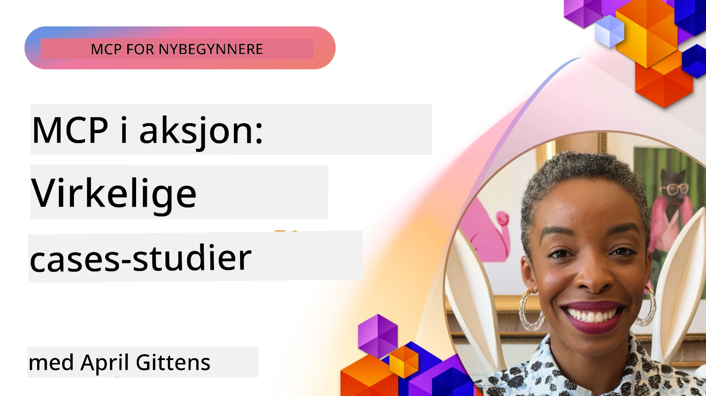

# MCP i praksis: Virkelige casestudier

_(Klikk på bildet ovenfor for å se video av denne leksjonen)_

Model Context Protocol (MCP) transformerer hvordan AI-applikasjoner samhandler med data, verktøy og tjenester. Denne seksjonen presenterer virkelige casestudier som demonstrerer praktiske anvendelser av MCP i ulike virksomhetsscenarier.

## Oversikt

Denne seksjonen viser konkrete eksempler på MCP-implementasjoner, med fokus på hvordan organisasjoner utnytter denne protokollen for å løse komplekse forretningsutfordringer. Ved å undersøke disse casestudiene vil du få innsikt i allsidigheten, skalerbarheten og de praktiske fordelene ved MCP i virkelige situasjoner.

## Viktige læringsmål

Ved å utforske disse casestudiene vil du:

- Forstå hvordan MCP kan brukes til å løse spesifikke forretningsproblemer
- Lære om forskjellige integrasjonsmønstre og arkitekturelle tilnærminger
- Gjenkjenne beste praksis for implementering av MCP i virksomhetsmiljøer
- Få innsikt i utfordringer og løsninger som oppstår i virkelige implementasjoner
- Identifisere muligheter for å anvende lignende mønstre i dine egne prosjekter

## Utvalgte casestudier

### 1. [Azure AI Travel Agents – Referanseimplementasjon](./travelagentsample.md)

Denne casestudien undersøker Microsofts omfattende referanseløsning som viser hvordan man bygger en multi-agent, AI-drevet reiseplanleggingsapplikasjon ved bruk av MCP, Azure OpenAI og Azure AI Search. Prosjektet viser:

- Multi-agent orkestrering via MCP
- Virksomhetsdataintegrasjon med Azure AI Search
- Sikker, skalerbar arkitektur ved hjelp av Azure-tjenester
- Utvidbart verktøy med gjenbrukbare MCP-komponenter
- Konversasjonell brukeropplevelse drevet av Azure OpenAI

Arkitekturen og implementasjonsdetaljene gir verdifull innsikt i å bygge komplekse multi-agent systemer med MCP som koordineringslag.

### 2. [Oppdatering av Azure DevOps-elementer fra YouTube-data](./UpdateADOItemsFromYT.md)

Denne casestudien viser en praktisk anvendelse av MCP for automatisering av arbeidsflytprosesser. Den viser hvordan MCP-verktøy kan brukes til å:

- Hente data fra nettplattformer (YouTube)
- Oppdatere arbeidsoppgaver i Azure DevOps-systemer
- Lage repeterbare automatiseringsarbeidsflyter
- Integrere data på tvers av forskjellige systemer

Eksemplet illustrerer hvordan selv relativt enkle MCP-implementasjoner kan gi betydelige effektivitetsgevinster ved å automatisere rutineoppgaver og forbedre datakonsekvens på tvers av systemer.

### 3. [Sanntids dokumentasjonsinnhenting med MCP](./docs-mcp/README.md)

Denne casestudien guider deg gjennom hvordan du kobler en Python-konsollklient til en Model Context Protocol (MCP)-server for å hente og logge sanntids, kontekstbevisst Microsoft-dokumentasjon. Du lærer hvordan du:

- Kobler til en MCP-server ved bruk av en Python-klient og den offisielle MCP SDK-en
- Bruker strømmende HTTP-klienter for effektiv, sanntids datainnhenting
- Kaller dokumentasjonsverktøy på serveren og logger svar direkte til konsollen
- Integrerer oppdatert Microsoft-dokumentasjon i arbeidsflyten din uten å forlate terminalen

Kapittelet inkluderer en praktisk oppgave, et minimalistisk fungerende kodeeksempel, og lenker til ressurser for dypere læring. Se full gjennomgang og kode i det lenkede kapittelet for å forstå hvordan MCP kan transformere dokumentasjonstilgang og utviklerproduktivitet i konsollbaserte miljøer.

### 4. [Interaktiv webapp for studieplan-generator med MCP](./docs-mcp/README.md)

Denne casestudien viser hvordan man bygger en interaktiv webapplikasjon ved bruk av Chainlit og Model Context Protocol (MCP) for å generere personaliserte studieplaner for ethvert emne. Brukere kan angi et fag (som "AI-900 sertifisering") og studietid (f.eks. 8 uker), og appen gir en uke-for-uke oversikt over anbefalt innhold. Chainlit muliggjør en konversasjonell chattegrensesnitt, som gjør opplevelsen engasjerende og tilpasningsdyktig.

- Konversasjonell webapp drevet av Chainlit
- Brukerstyrte prompt for emne og varighet
- Uke-for-uke innholds-anbefalinger ved bruk av MCP
- Sanntids, adaptive svar i chattegrensesnitt

Prosjektet illustrerer hvordan konversasjonell AI og MCP kan kombineres for å skape dynamiske, brukerstyrte utdanningsverktøy i et moderne webmiljø.

### 5. [Dokumentasjon i editor med MCP-server i VS Code](./docs-mcp/README.md)

Denne casestudien viser hvordan du kan hente Microsoft Learn Docs direkte inn i VS Code-miljøet ditt ved hjelp av MCP-serveren — ikke mer bytting mellom nettleserfaner! Du vil se hvordan man kan:

- Søke og lese dokumentasjon umiddelbart inne i VS Code ved hjelp av MCP-panelet eller kommandopaletten
- Referere dokumentasjon og sette inn lenker direkte i README eller kursmarkedfilene dine
- Bruke GitHub Copilot og MCP sammen for sømløse, AI-drevne dokumentasjons- og kodearbeidsflyter
- Validere og forbedre dokumentasjonen med sanntids tilbakemelding og Microsoft-kildet nøyaktighet
- Integrere MCP med GitHub-arbeidsflyter for kontinuerlig dokumentasjonsvalidering

Implementasjonen inkluderer:

- Eksempel på `.vscode/mcp.json`-konfigurasjon for enkel oppsett
- Skjermbildebaserte gjennomganger av opplevelsen i editoren
- Tips for å kombinere Copilot og MCP for maksimal produktivitet

Dette scenarioet er ideelt for kursforfattere, dokumentasjonsskrivere og utviklere som ønsker å holde fokus i sin editor mens de jobber med docs, Copilot og valideringsverktøy – alle drevet av MCP.

### 6. [Opprettelse av APIM MCP-server](./apimsample.md)

Denne casestudien gir en trinnvis veiledning om hvordan du oppretter en MCP-server ved bruk av Azure API Management (APIM). Den dekker:

- Oppsett av en MCP-server i Azure API Management
- Eksponering av API-operasjoner som MCP-verktøy
- Konfigurering av policyer for ratelimiting og sikkerhet
- Testing av MCP-serveren ved bruk av Visual Studio Code og GitHub Copilot

Dette eksemplet illustrerer hvordan man kan utnytte Azures kapasiteter til å lage en robust MCP-server som kan brukes i ulike applikasjoner, og forbedrer integrasjonen av AI-systemer med virksomhets-APIer.

### 7. [GitHub MCP Registry — Akselererende agentisk integrasjon](https://github.com/mcp)

Denne casestudien undersøker hvordan GitHubs MCP Registry, lansert i september 2025, adresserer en kritisk utfordring i AI-økosystemet: den fragmenterte oppdagelsen og utrullingen av Model Context Protocol (MCP)-servere.

#### Oversikt
**MCP Registry** løser den økende utfordringen med spredte MCP-servere på tvers av lagre og registre, som tidligere gjorde integrasjon treg og feilutsatt. Disse serverne muliggjør at AI-agenter kan interagere med eksterne systemer som APIer, databaser og dokumentasjonskilder.

#### Problemstilling
Utviklere som bygger agentiske arbeidsflyter møtte flere utfordringer:
- **Dårlig oppdagbarhet** av MCP-servere på tvers av forskjellige plattformer
- **Redundante oppsettspørsmål** spredt over forum og dokumentasjon
- **Sikkerhetsrisiko** fra uverifiserte og upålitelige kilder
- **Manglende standardisering** i serverkvalitet og kompatibilitet

#### Løsningsarkitektur
GitHubs MCP Registry sentraliserer betrodde MCP-servere med nøkkelfunksjoner:
- **Én-klikk installasjon** via VS Code for strømlinjeformet oppsett
- **Sortering med signal-over-støy** basert på stjerner, aktivitet og fellesskapsvalidering
- **Direkte integrasjon** med GitHub Copilot og andre MCP-kompatible verktøy
- **Åpen bidragsmodell** som gjør det mulig for både fellesskap og virksomhetspartnere å bidra

#### Forretningspåvirkning
Registeret har levert målbare forbedringer:
- **Raskere onboarding** for utviklere som bruker verktøy som Microsoft Learn MCP Server, som strømmer offisiell dokumentasjon direkte inn i agenter
- **Økt produktivitet** via spesialiserte servere som `github-mcp-server`, som muliggjør naturlig språk GitHub-automatisering (PR-opprettelse, CI-reruns, kodeskanning)
- **Styrket økosystemtillit** gjennom kuraterte oppføringer og transparente konfigurasjonsstandarder

#### Strategisk verdi
For praktikere som spesialiserer seg på agent livssyklusstyring og reproduserbare arbeidsflyter tilbyr MCP Registry:
- **Modulær agentdistribusjon** med standardiserte komponenter
- **Registerbaserte evalueringspipeliner** for konsistent testing og validering
- **Tverrverktøy interoperabilitet** som muliggjør sømløs integrasjon på tvers av forskjellige AI-plattformer

Denne casestudien demonstrerer at MCP Registry er mer enn bare en katalog — det er en grunnleggende plattform for skalerbar, virkelighetsnær modellintegrasjon og agentisk systemutrulling.

## Konklusjon

Disse syv omfattende casestudiene demonstrerer den bemerkelsesverdige allsidigheten og de praktiske anvendelsene av Model Context Protocol på tvers av forskjellige virkelige scenarier. Fra komplekse multi-agent reiseplanleggingssystemer og virksomhets-API-styring til strømlinjeformede dokumentasjonsarbeidsflyter og det revolusjonerende GitHub MCP Registry, viser disse eksemplene hvordan MCP tilbyr en standardisert, skalerbar måte å koble AI-systemer med verktøyene, dataene og tjenestene de trenger for å levere eksepsjonell verdi.

Casestudiene dekker flere dimensjoner av MCP-implementering:
- **Virksomhetsintegrasjon**: Azure API Management og Azure DevOps-automatisering
- **Multi-agent orkestrering**: Reiseplanlegging med koordinerte AI-agenter
- **Utviklerproduktivitet**: VS Code-integrasjon og sanntids dokumentasjonstilgang
- **Økosystemutvikling**: GitHub MCP Registry som grunnleggende plattform
- **Utdanningsapplikasjoner**: Interaktive studieplugeneratorer og konversasjonelle grensesnitt

Ved å studere disse implementeringene får du kritisk innsikt i:
- **Arkitekturmønstre** for ulike skalaer og brukstilfeller
- **Implementeringsstrategier** som balanserer funksjonalitet med vedlikeholdbarhet
- **Sikkerhets- og skalerbarhetshensyn** for produksjonsutrulling
- **Beste praksis** for MCP-serverutvikling og klientintegrasjon
- **Økosystemtenkning** for bygging av sammenkoblede AI-drevne løsninger

Disse eksemplene demonstrerer samlet at MCP ikke bare er et teoretisk rammeverk, men en moden, produksjonsklar protokoll som muliggjør praktiske løsninger på komplekse forretningsutfordringer. Enten du bygger enkle automatiseringsverktøy eller sofistikerte multi-agent systemer, gir de mønstrene og tilnærmingene som er illustrert her et solid grunnlag for dine egne MCP-prosjekter.

## Tilleggsressurser

- [Azure AI Travel Agents GitHub Repository](https://github.com/Azure-Samples/azure-ai-travel-agents)
- [Azure DevOps MCP Tool](https://github.com/microsoft/azure-devops-mcp)
- [Playwright MCP Tool](https://github.com/microsoft/playwright-mcp)
- [Microsoft Docs MCP Server](https://github.com/MicrosoftDocs/mcp)
- [GitHub MCP Registry — Akselererende agentisk integrasjon](https://github.com/mcp)
- [MCP Community Examples](https://github.com/microsoft/mcp)

## Hva skjer videre

- Forrige: [Modul 8: Beste praksis](../08-BestPractices/README.md)
- Neste: [Modul 10: Effektivisering av AI-arbeidsflyter: Bygge en MCP-server med AI Toolkit](../10-StreamliningAIWorkflowsBuildingAnMCPServerWithAIToolkit/README.md)

---

<!-- CO-OP TRANSLATOR DISCLAIMER START -->
**Ansvarsfraskrivelse**:  
Dette dokumentet er oversatt ved hjelp av AI-oversettelsestjenesten [Co-op Translator](https://github.com/Azure/co-op-translator). Selv om vi streber etter nøyaktighet, vennligst vær oppmerksom på at automatiske oversettelser kan inneholde feil eller unøyaktigheter. Det opprinnelige dokumentet på det opprinnelige språket bør betraktes som den autoritative kilden. For kritisk informasjon anbefales profesjonell menneskelig oversettelse. Vi er ikke ansvarlige for eventuelle misforståelser eller feiltolkninger som oppstår ved bruk av denne oversettelsen.
<!-- CO-OP TRANSLATOR DISCLAIMER END -->