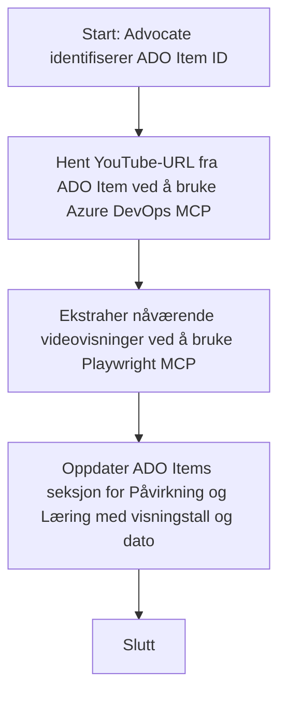

# Case Study: Oppdatering av Azure DevOps-artikler med YouTube-data ved hjelp av MCP

> **Ansvarsfraskrivelse:** Det finnes eksisterende nettbaserte verktøy og rapporter som kan automatisere prosessen med å oppdatere Azure DevOps-artikler med data fra plattformer som YouTube. Følgende scenario gis kun som et eksempel på brukstilfelle for å illustrere hvordan MCP-verktøy kan brukes til automatisering og integrasjonsoppgaver.

## Oversikt

Denne casestudien demonstrerer ett eksempel på hvordan Model Context Protocol (MCP) og dets verktøy kan brukes til å automatisere prosessen med å oppdatere Azure DevOps (ADO) arbeidsartikler med informasjon hentet fra nettplattformer, som YouTube. Det beskrevne scenarioet er bare en illustrasjon av de bredere mulighetene til disse verktøyene, som kan tilpasses mange lignende automatiseringsbehov.

I dette eksemplet følger en Advocate opp nettbaserte sesjoner ved hjelp av ADO-artikler, der hver artikkel inneholder en YouTube-video-URL. Ved å bruke MCP-verktøy kan Advocaten holde ADO-artiklene oppdatert med de siste videomålingene, som antall visninger, på en repeterbar og automatisert måte. Denne tilnærmingen kan generaliseres til andre brukstilfeller der informasjon fra nettbaserte kilder må integreres i ADO eller andre systemer.

## Scenario

En Advocate er ansvarlig for å følge opp virkningen av nettbaserte sesjoner og fellesskapsengasjement. Hver sesjon logges som en ADO-arbeidsartikkel i prosjektet 'DevRel', og arbeidsartikkelen inneholder et felt for YouTube-videoens URL. For å rapportere sesjonens rekkevidde nøyaktig, må Advocaten oppdatere ADO-artikkelen med det nåværende antallet videovisninger og datoen for når denne informasjonen ble hentet.

## Verktøy brukt

- [Azure DevOps MCP](https://github.com/microsoft/azure-devops-mcp): Gjør det mulig å programmere tilgang til og oppdatering av ADO-arbeidsartikler via MCP.
- [Playwright MCP](https://github.com/microsoft/playwright-mcp): Automatiserer nettleserhandlinger for å hente sanntidsdata fra nettsider, som YouTube-videostatistikk.

## Steg-for-steg arbeidsflyt

1. **Identifiser ADO-artikkelen**: Start med ADO-arbeidsartikkel-ID (f.eks. 1234) i prosjektet 'DevRel'.
2. **Hent YouTube-URL**: Bruk Azure DevOps MCP-verktøy for å hente YouTube-URL-en fra arbeidsartikkelen.
3. **Hent videovisninger**: Bruk Playwright MCP-verktøy for å navigere til YouTube-URL-en og hente det nåværende antallet visninger.
4. **Oppdater ADO-artikkelen**: Skriv inn det siste visningstallet og datoen for innhenting i delen 'Impact and Learnings' i ADO-arbeidsartikkelen ved hjelp av Azure DevOps MCP-verktøyet.

## Eksempelprompt

```bash
- Work with the ADO Item ID: 1234
- The project is '2025-Awesome'
- Get the YouTube URL for the ADO item
- Use Playwright to get the current views from the YouTube video
- Update the ADO item with the current video views and the updated date of the information
```

## Mermaid Flytskjema


## Teknisk implementering

- **MCP-orkestrering**: Arbeidsflyten orkestreres av en MCP-server som koordinerer bruken av både Azure DevOps MCP og Playwright MCP-verktøyene.
- **Automatisering**: Prosessen kan utløses manuelt eller settes opp til å kjøre regelmessig for å holde ADO-artiklene oppdatert.
- **Utvidbarhet**: Samme mønster kan utvides til å oppdatere ADO-artikler med andre nettbaserte målinger (f.eks. likerklikk, kommentarer) eller fra andre plattformer.

## Resultater og påvirkning

- **Effektivitet**: Reduserer manuelt arbeid for Advocates ved å automatisere innhenting og oppdatering av videomålinger.
- **Nøyaktighet**: Sikrer at ADO-artikler reflekterer de mest oppdaterte dataene tilgjengelig fra nettbaserte kilder.
- **Repeterbarhet**: Gir en gjenbrukbar arbeidsflyt for lignende scenarioer som involverer andre datakilder eller målinger.

## Referanser

- [Azure DevOps MCP](https://github.com/microsoft/azure-devops-mcp)
- [Playwright MCP](https://github.com/microsoft/playwright-mcp)
- [Model Context Protocol (MCP)](https://modelcontextprotocol.io/)

## Hva skjer videre

- Tilbake til: [Case Studies Overview](./README.md)
- Neste: [Real-Time Documentation Retrieval with MCP](./docs-mcp/README.md)

---

<!-- CO-OP TRANSLATOR DISCLAIMER START -->
**Ansvarsfraskrivelse**:
Dette dokumentet er oversatt ved hjelp av AI-oversettelsestjenesten [Co-op Translator](https://github.com/Azure/co-op-translator). Selv om vi streber etter nøyaktighet, vær oppmerksom på at automatiske oversettelser kan inneholde feil eller unøyaktigheter. Det originale dokumentet på originalspråket skal anses som den autoritative kilden. For kritisk informasjon anbefales profesjonell menneskelig oversettelse. Vi er ikke ansvarlige for eventuelle misforståelser eller feiltolkninger som oppstår ved bruk av denne oversettelsen.
<!-- CO-OP TRANSLATOR DISCLAIMER END -->