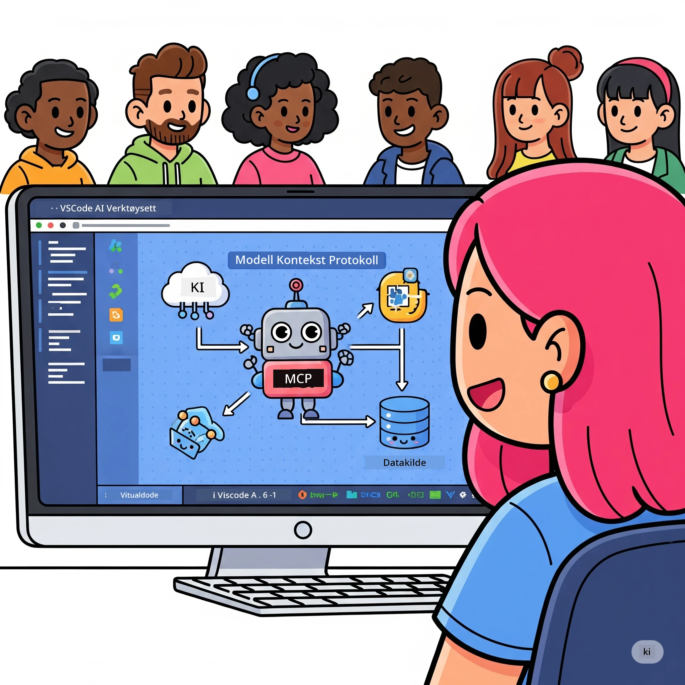
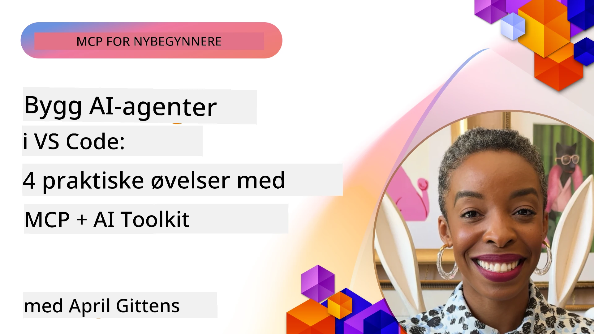

# Effektivisering av AI-arbeidsflyter: Bygging av en MCP-server med AI Toolkit

## 🎯  Oversikt

_(Klikk på bildet over for å se video av denne leksjonen)_

Velkommen til **Model Context Protocol (MCP) Workshop**! Denne omfattende praktiske workshopen kombinerer to banebrytende teknologier for å revolusjonere utviklingen av AI-applikasjoner:

- **🔗 Model Context Protocol (MCP)**: En åpen standard for sømløs AI-verktøyintegrasjon
- **🛠️ AI Toolkit for Visual Studio Code (AITK)**: Microsofts kraftige AI-utviklingsutvidelse

### 🎓 Hva du vil lære

Ved slutten av denne workshopen vil du mestre kunsten å bygge intelligente applikasjoner som kobler AI-modeller med virkelige verktøy og tjenester. Fra automatisert testing til tilpassede API-integrasjoner vil du få praktiske ferdigheter for å løse komplekse forretningsutfordringer.

## 🏗️ Teknologistabel

### 🔌 Model Context Protocol (MCP)

MCP er **"USB-C for AI"** – en universell standard som kobler AI-modeller til eksterne verktøy og datakilder.

**✨ Viktige funksjoner:**

- 🔄 **Standardisert integrasjon**: Universelt grensesnitt for AI-verktøykoblinger
- 🏛️ **Fleksibel arkitektur**: Lokale og eksterne servere via stdio/SSE transport
- 🧰 **Rik økosystem**: Verktøy, prompts og ressurser i én protokoll
- 🔒 **Klar for bedriftsbruk**: Innebygd sikkerhet og pålitelighet

**🎯 Hvorfor MCP er viktig:**
Akkurat som USB-C eliminerte kabelkaos, fjerner MCP kompleksiteten ved AI-integrasjoner. Én protokoll, uendelige muligheter.

### 🤖 AI Toolkit for Visual Studio Code (AITK)

Microsofts flaggskip for AI-utviklingsutvidelser som forvandler VS Code til en AI-kraftpakke.

**🚀 Kjernemuligheter:**

- 📦 **Modellkatalog**: Tilgang til modeller fra Azure AI, GitHub, Hugging Face, Ollama
- ⚡ **Lokal inferens**: ONNX-optimalisert CPU/GPU/NPU kjøring
- 🏗️ **Agent Builder**: Visuell AI-agentutvikling med MCP-integrasjon
- 🎭 **Multimodal**: Støtte for tekst, syn og strukturert output

**💡 Utviklingsfordeler:**

- Null-konfigurasjon for modellutrulling
- Visuell prompt-engineering
- Sanntids testmiljø
- Sømløs MCP-serverintegrasjon

## 📚 Læringsreise

### [🚀 Modul 1: AI Toolkit Grunnleggende](./lab1/README.md)

**Varighet**: 15 minutter

- 🛠️ Installer og konfigurer AI Toolkit for VS Code
- 🗂️ Utforsk Modellkatalogen (100+ modeller fra GitHub, ONNX, OpenAI, Anthropic, Google)
- 🎮 Mestre det Interaktive lekeområdet for sanntidstest av modeller
- 🤖 Bygg din første AI-agent med Agent Builder
- 📊 Evaluer modellens ytelse med innebygde målinger (F1, relevans, likhet, koherens)
- ⚡ Lær batchprosessering og multimodal støtte

**🎯 Læringsutbytte**: Lage en funksjonell AI-agent med fullstendig forståelse av AITK-funksjonene

### [🌐 Modul 2: MCP med AI Toolkit Grunnleggende](./lab2/README.md)

**Varighet**: 20 minutter

- 🧠 Mestre Model Context Protocol (MCP) arkitektur og konsepter
- 🌐 Utforsk Microsofts MCP-serverøkosystem
- 🤖 Bygg en nettleserautomatiseringsagent ved hjelp av Playwright MCP-server
- 🔧 Integrer MCP-servere med AI Toolkit Agent Builder
- 📊 Konfigurer og test MCP-verktøy i agentene dine
- 🚀 Eksporter og distribuer MCP-drevne agenter til produksjon

**🎯 Læringsutbytte**: Distribuer en AI-agent superladet med eksterne verktøy via MCP

### [🔧 Modul 3: Avansert MCP-utvikling med AI Toolkit](./lab3/README.md)

**Varighet**: 20 minutter

- 💻 Lag tilpassede MCP-servere med AI Toolkit
- 🐍 Konfigurer og bruk nyeste MCP Python SDK (v1.9.3)
- 🔍 Sett opp og bruk MCP Inspector for feilsøking
- 🛠️ Bygg en Weather MCP Server med profesjonelle feilsøkingsarbeidsflyter
- 🧪 Feilsøk MCP-servere i både Agent Builder og Inspector-miljøer

**🎯 Læringsutbytte**: Utvikle og feilsøke tilpassede MCP-servere med moderne verktøy

### [🐙 Modul 4: Praktisk MCP-utvikling - Tilpasset GitHub Clone Server](./lab4/README.md)

**Varighet**: 30 minutter

- 🏗️ Bygg en ekte GitHub Clone MCP Server for utviklingsarbeidsflyter
- 🔄 Implementer smart repository-kloning med validering og feilhåndtering
- 📁 Lag intelligent kataloghåndtering og VS Code-integrasjon
- 🤖 Bruk GitHub Copilot Agent Mode med tilpassede MCP-verktøy
- 🛡️ Implementer produksjonsklar pålitelighet og flerplattformkompatibilitet

**🎯 Læringsutbytte**: Distribuer en produksjonsklar MCP-server som effektiviserer ekte utviklingsarbeidsflyter

## 💡 Virkelige bruksområder og effekter

### 🏢 Bedriftsbrukstilfeller

#### 🔄 DevOps-automatisering

Forvandle utviklingsflyten din med intelligent automatisering:

- **Smart Repository-håndtering**: AI-drevet kodegjennomgang og sammenslåingsbeslutninger
- **Intelligent CI/CD**: Automatisert pipeline-optimalisering basert på kodeendringer
- **Issue-triage**: Automatisk feilklassifisering og tildeling

#### 🧪 Kvalitetssikringens revolusjon

Hev testingen med AI-drevet automatisering:

- **Intelligent testgenerering**: Lag omfattende testsuiter automatisk
- **Visuell regresjonstesting**: AI-drevet UI-endringsdeteksjon
- **Ytelsesovervåkning**: Proaktiv identifisering og løsning av problemer

#### 📊 Data Pipeline-intelligens

Bygg smartere databehandlingsarbeidsflyter:

- **Adaptive ETL-prosesser**: Selvoptimaliserende datatransformasjoner
- **Anomali-deteksjon**: Sanntids overvåkning av datakvalitet
- **Intelligent ruting**: Smart styring av dataflyt

#### 🎧 Forbedring av kundeopplevelse

Skap eksepsjonelle kundeinteraksjoner:

- **Kontekstbevisst støtte**: AI-agenter med tilgang til kundehistorikk
- **Proaktiv feilløsning**: Forutsigende kundeservice
- **Multi-kanal integrasjon**: Enhetlig AI-opplevelse på tvers av plattformer

## 🛠️ Forutsetninger og oppsett

### 💻 Systemkrav

| Komponent | Krav | Notater |
|-----------|-------|---------|
| **Operativsystem** | Windows 10+, macOS 10.15+, Linux | Enhver moderne OS |
| **Visual Studio Code** | Nyeste stabile versjon | Nødvendig for AITK |
| **Node.js** | v18.0+ og npm | For MCP-serverutvikling |
| **Python** | 3.10+ | Valgfritt for Python MCP-servere |
| **Minne** | Minst 8GB RAM | 16GB anbefales for lokale modeller |

### 🔧 Utviklingsmiljø

#### Anbefalte VS Code-utvidelser

- **AI Toolkit** (ms-windows-ai-studio.windows-ai-studio)
- **Python** (ms-python.python)
- **Python Debugger** (ms-python.debugpy)
- **GitHub Copilot** (GitHub.copilot) - Valgfritt, men nyttig

#### Valgfrie verktøy

- **uv**: Moderne Python-pakkebehandler
- **MCP Inspector**: Visuelt feilsøkingsverktøy for MCP-servere
- **Playwright**: For eksempler på webautomatisering

## 🎖️ Læringsutbytte og sertifiseringsvei

### 🏆 Ferdighetsmasteringsliste

Ved å fullføre denne workshopen oppnår du mestring innen:

#### 🎯 Kjernetilganger

- [ ] **MCP Protokollmestring**: Dyp forståelse av arkitektur og implementeringsmønstre
- [ ] **AITK Ferdigheter**: Ekspertbruk av AI Toolkit for rask utvikling
- [ ] **Tilpasset serverutvikling**: Bygg, distribuer og vedlikehold MCP-servere i produksjon
- [ ] **Verktøyintegrasjonsekspertise**: Sømløs kobling av AI med eksisterende utviklingsflyter
- [ ] **Problemløsningsanvendelse**: Bruk lærte ferdigheter på ekte forretningsutfordringer

#### 🔧 Tekniske ferdigheter

- [ ] Sett opp og konfigurer AI Toolkit i VS Code
- [ ] Design og implementer egne MCP-servere
- [ ] Integrer GitHub-modeller med MCP-arkitektur
- [ ] Bygg automatiserte testarbeidsflyter med Playwright
- [ ] Distribuer AI-agenter for produksjonsbruk
- [ ] Feilsøk og optimaliser MCP-serverytelse

#### 🚀 Avanserte kapasiteter

- [ ] Arkitekter AI-integrasjoner i bedriftsklasse
- [ ] Implementer sikkerhetsbeste praksis for AI-applikasjoner
- [ ] Design skalerbare MCP-serverarkitekturer
- [ ] Lag tilpassede verktøykjeder for spesifikke domener
- [ ] Veilede andre i AI-native utvikling

## 📖 Ekstra ressurser

- [MCP Spesifikasjon (2025-11-25)](https://spec.modelcontextprotocol.io/specification/2025-11-25/)
- [AI Toolkit GitHub Repository](https://github.com/microsoft/vscode-ai-toolkit)
- [Sample MCP Servers Collection](https://github.com/modelcontextprotocol/servers)
- [Best Practices Guide](https://modelcontextprotocol.io/docs/best-practices)
- [OWASP MCP Top 10](https://microsoft.github.io/mcp-azure-security-guide/mcp/) - Sikkerhetsbeste praksis

---

**🚀 Klar til å revolusjonere AI-utviklingsflyten din?**

La oss bygge fremtiden for intelligente applikasjoner sammen med MCP og AI Toolkit!

## Hva er neste steg

Fortsett til: [Modul 11: MCP Server Hands-On Labs](../11-MCPServerHandsOnLabs/README.md)

---

<!-- CO-OP TRANSLATOR DISCLAIMER START -->
**Ansvarsfraskrivelse**:
Dette dokumentet er oversatt ved hjelp av AI-oversettelsestjenesten [Co-op Translator](https://github.com/Azure/co-op-translator). Selv om vi streber etter nøyaktighet, vennligst vær oppmerksom på at automatiserte oversettelser kan inneholde feil eller unøyaktigheter. Det originale dokumentet på dets opprinnelige språk skal anses som den autoritative kilden. For kritisk informasjon anbefales profesjonell menneskelig oversettelse. Vi er ikke ansvarlige for eventuelle misforståelser eller feiltolkninger som oppstår ved bruk av denne oversettelsen.
<!-- CO-OP TRANSLATOR DISCLAIMER END -->