# 🌐 Modul 2: MCP med AI Toolkit Grunnleggende

[]()
[]()
[]()

## 📋 Læringsmål

Innen slutten av denne modulen vil du kunne:
- ✅ Forstå Model Context Protocol (MCP) arkitektur og fordeler
- ✅ Utforske Microsofts MCP-serverøkosystem
- ✅ Integrere MCP-servere med AI Toolkit Agent Builder
- ✅ Bygge en funksjonell nettleserautomatiseringsagent med Playwright MCP
- ✅ Konfigurere og teste MCP-verktøy i agentene dine
- ✅ Eksportere og distribuere MCP-drevne agenter for produksjonsbruk

## 🎯 Bygger videre på Modul 1

I Modul 1 mestret vi AI Toolkit-grunnleggende og laget vår første Python-agent. Nå skal vi **gi agentene dine ekstra kraft** ved å koble dem til eksterne verktøy og tjenester gjennom den revolusjonerende **Model Context Protocol (MCP)**.

Tenk på dette som en oppgradering fra en enkel kalkulator til en fullverdig datamaskin – AI-agentene dine får muligheten til å:
- 🌐 Surfe og samhandle med nettsider
- 📁 Få tilgang til og manipulere filer
- 🔧 Integrere med bedriftsystemer
- 📊 Behandle sanntidsdata fra API-er

## 🧠 Forstå Model Context Protocol (MCP)

### 🔍 Hva er MCP?

Model Context Protocol (MCP) er **"USB-C for AI-applikasjoner"** – en revolusjonerende åpen standard som kobler store språkmodeller (LLMs) til eksterne verktøy, datakilder og tjenester. Akkurat som USB-C fjernet kabelkaos ved å tilby én universell kontakt, fjerner MCP kompleksiteten ved AI-integrasjon med én standardisert protokoll.

### 🎯 Problemet MCP løser

**Før MCP:**
- 🔧 Skreddersydde integrasjoner for hvert verktøy
- 🔄 Leverandørlås med proprietære løsninger  
- 🔒 Sikkerhetssårbarheter fra ad-hoc-tilkoblinger
- ⏱️ Måneder med utvikling for grunnleggende integrasjoner

**Med MCP:**
- ⚡ Plug-and-play verktøysintegrasjon
- 🔄 Leverandøruavhengig arkitektur
- 🛡️ Innebygde sikkerhetsrutiner
- 🚀 Minutter for å legge til nye funksjoner

### 🏗️ MCP-arkitektur i detalj

MCP følger en **klient-server-arkitektur** som skaper et sikkert og skalerbart økosystem:

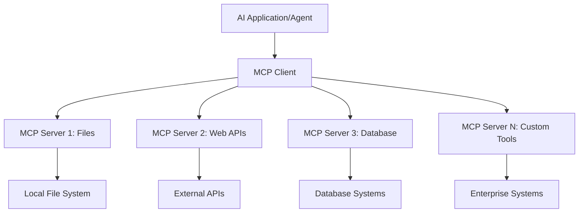

**🔧 Kjernekomponenter:**

| Komponent | Rolle | Eksempler |
|-----------|-------|-----------|
| **MCP Hosts** | Applikasjoner som bruker MCP-tjenester | Claude Desktop, VS Code, AI Toolkit |
| **MCP Clients** | Protokollhåndterere (1:1 med servere) | Innebygd i host-applikasjoner |
| **MCP Servers** | Eksponerer funksjonalitet via standard protokoll | Playwright, Files, Azure, GitHub |
| **Transport Layer** | Kommunikasjonsmetoder | stdio, HTTP, WebSockets |


## 🏢 Microsofts MCP-serverøkosystem

Microsoft leder MCP-økosystemet med en omfattende pakke av bedriftsservere som dekker reelle forretningsbehov.

### 🌟 Utvalgte Microsoft MCP-servere

#### 1. ☁️ Azure MCP Server
**🔗 Repository**: [azure/azure-mcp](https://github.com/azure/azure-mcp)  
**🎯 Formål**: Omfattende Azure-ressursstyring med AI-integrasjon

**✨ Nøkkelfunksjoner:**
- Deklarativ infrastrukturprovisjonering
- Sanntidsovervåking av ressurser
- Anbefalinger for kostnadsoptimalisering
- Sikkerhetsoverholdelse

**🚀 Bruksområder:**
- Infrastruktur som kode med AI-assistanse
- Automatisk ressurs-skalering
- Optimalisering av skylagringskostnader
- Automatisering av DevOps-arbeidsflyt

#### 2. 📊 Microsoft Dataverse MCP
**📚 Dokumentasjon**: [Microsoft Dataverse Integration](https://go.microsoft.com/fwlink/?linkid=2320176)  
**🎯 Formål**: Naturlig språkgrensesnitt for forretningsdata

**✨ Nøkkelfunksjoner:**
- Naturlige språkspørringer mot databaser
- Forståelse av forretningskontekst
- Tilpassede prompt-maler
- Bedriftsdatastyring

**🚀 Bruksområder:**
- Forretningsintelligensrapportering
- Analyse av kundedata
- Innsikt i salgspipeline
- Spørringer for samsvarsdokumentasjon

#### 3. 🌐 Playwright MCP Server
**🔗 Repository**: [microsoft/playwright-mcp](https://github.com/microsoft/playwright-mcp)  
**🎯 Formål**: Nettleserautomatisering og webinteraksjon

**✨ Nøkkelfunksjoner:**
- Kryss-nettleserautomatisering (Chrome, Firefox, Safari)
- Intelligent elementgjenkjenning
- Skjermbilder og PDF-generering
- Nettverksovervåking

**🚀 Bruksområder:**
- Automatiserte testarbeidsflyter
- Webskraping og datauttrekk
- UI/UX-overvåking
- Automatisert konkurranseanalyse

#### 4. 📁 Files MCP Server
**🔗 Repository**: [microsoft/files-mcp-server](https://github.com/microsoft/files-mcp-server)  
**🎯 Formål**: Intelligente filsystemoperasjoner

**✨ Nøkkelfunksjoner:**
- Deklarativ filhåndtering
- Innholdssynkronisering
- Versjonskontrollintegrasjon
- Metadatauttrekk

**🚀 Bruksområder:**
- Dokumentasjonsstyring
- Organisering av kodearkiv
- Arbeidsflyt for innholdspublisering
- Filhåndtering i datapipelines

#### 5. 📝 MarkItDown MCP Server
**🔗 Repository**: [microsoft/markitdown](https://github.com/microsoft/markitdown)  
**🎯 Formål**: Avansert Markdown-behandling og manipulering

**✨ Nøkkelfunksjoner:**
- Omfattende Markdown-parsing
- Formatkonvertering (MD ↔ HTML ↔ PDF)
- Analyse av innholdsstruktur
- Malbehandling

**🚀 Bruksområder:**
- Arbeidsflyt for teknisk dokumentasjon
- Innholdsstyringssystemer
- Rapportgenerering
- Automatisering av kunnskapsbaser

#### 6. 📈 Clarity MCP Server
**📦 Pakke**: [@microsoft/clarity-mcp-server](https://www.npmjs.com/package/@microsoft/clarity-mcp-server)  
**🎯 Formål**: Webanalyse og innsikt i brukeradferd

**✨ Nøkkelfunksjoner:**
- Analyse av heatmaps
- Opptak av brukersesjoner
- Ytelsesmetrikker
- Analyse av konverteringstrakter

**🚀 Bruksområder:**
- Optimalisering av nettsider
- Brukeropplevelsesforskning
- A/B-testing
- Dashboards for forretningsintelligens

### 🌍 Fellesskapsøkosystem

I tillegg til Microsofts servere inkluderer MCP-økosystemet:
- **🐙 GitHub MCP**: Repository-håndtering og kodeanalyse
- **🗄️ Database MCP-er**: Integrasjoner for PostgreSQL, MySQL, MongoDB
- **☁️ Cloud Provider MCP-er**: Verktøy for AWS, GCP, Digital Ocean
- **📧 Kommunikasjons MCP-er**: Slack, Teams, e-postintegrasjoner

## 🛠️ Praktisk lab: Bygg en nettleserautomatiseringsagent

**🎯 Prosjektmål**: Lag en intelligent nettleserautomatiseringsagent med Playwright MCP-server som kan navigere på nettsider, hente informasjon og utføre komplekse webinteraksjoner.

### 🚀 Fase 1: Oppsett av agentgrunnlag

#### Steg 1: Initialiser agenten din
1. **Åpne AI Toolkit Agent Builder**  
2. **Opprett ny agent** med følgende konfigurasjon:  
   - **Navn**: `BrowserAgent`  
   - **Modell**: Velg GPT-4o  

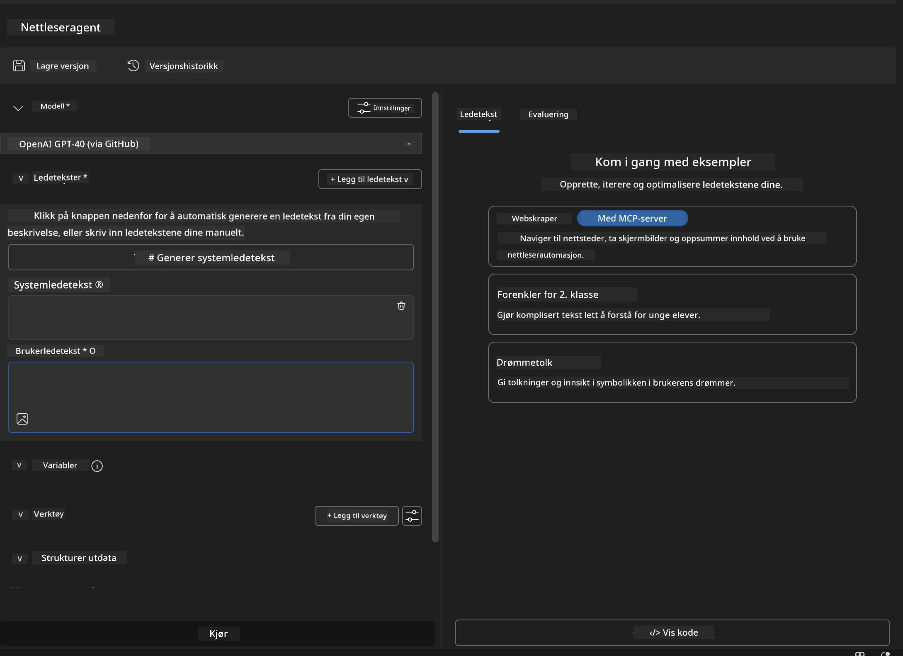


### 🔧 Fase 2: MCP-integrasjonsarbeidsflyt

#### Steg 3: Legg til MCP-serverintegrasjon
1. **Gå til Verktøy-seksjonen** i Agent Builder  
2. **Klikk "Add Tool"** for å åpne integrasjonsmenyen  
3. **Velg "MCP Server"** fra tilgjengelige alternativer  

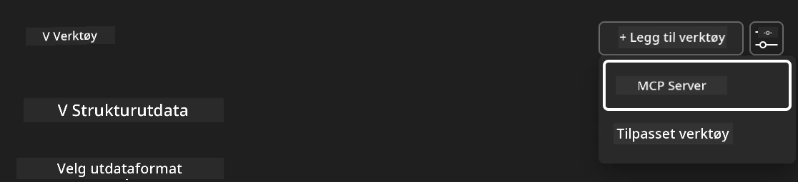

**🔍 Forstå verktøytyper:**  
- **Innebygde verktøy**: Ferdigkonfigurerte AI Toolkit-funksjoner  
- **MCP-servere**: Eksterne tjenesteintegrasjoner  
- **Egendefinerte API-er**: Egne tjenendepunkter  
- **Funksjonskall**: Direkte tilgang til modellfunksjoner  

#### Steg 4: Velg MCP-server
1. **Velg "MCP Server"** for å fortsette  
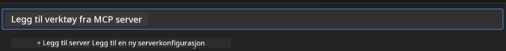

2. **Utforsk MCP-katalogen** for å se tilgjengelige integrasjoner  
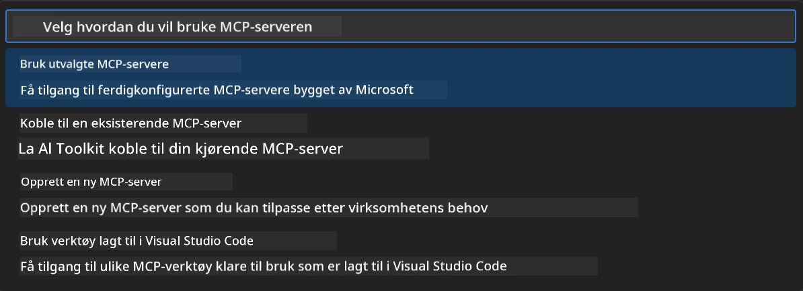


### 🎮 Fase 3: Konfigurasjon av Playwright MCP

#### Steg 5: Velg og konfigurer Playwright
1. **Klikk "Use Featured MCP Servers"** for å få tilgang til Microsofts verifiserte servere  
2. **Velg "Playwright"** fra listen over utvalgte  
3. **Godta standard MCP ID** eller tilpass for ditt miljø  

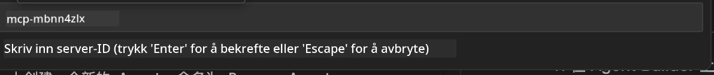

#### Steg 6: Aktiver Playwright-funksjoner
**🔑 Kritisk steg**: Velg **ALLE** tilgjengelige Playwright-metoder for maksimal funksjonalitet  

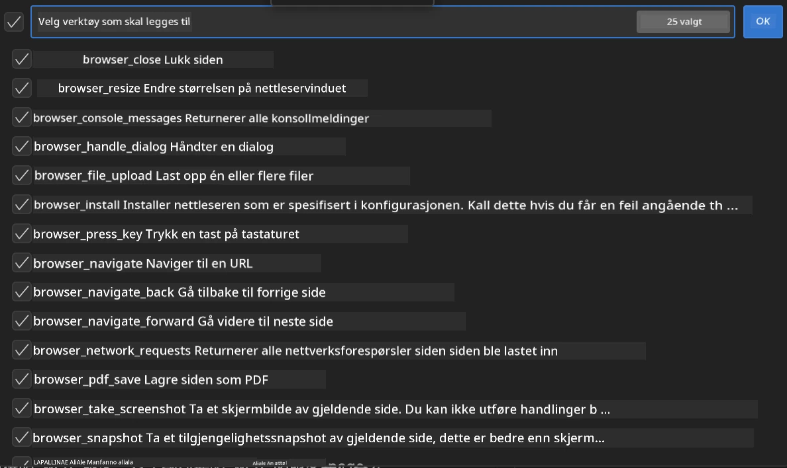

**🛠️ Viktige Playwright-verktøy:**  
- **Navigasjon**: `goto`, `goBack`, `goForward`, `reload`  
- **Interaksjon**: `click`, `fill`, `press`, `hover`, `drag`  
- **Uttrekk**: `textContent`, `innerHTML`, `getAttribute`  
- **Validering**: `isVisible`, `isEnabled`, `waitForSelector`  
- **Fangst**: `screenshot`, `pdf`, `video`  
- **Nettverk**: `setExtraHTTPHeaders`, `route`, `waitForResponse`  

#### Steg 7: Verifiser vellykket integrasjon
**✅ Suksessindikatorer:**  
- Alle verktøy vises i Agent Builder-grensesnittet  
- Ingen feilmeldinger i integrasjonspanelet  
- Playwright-serverstatus viser "Connected"  

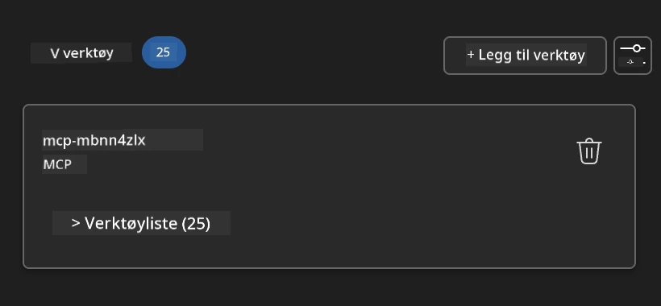

**🔧 Vanlige feilsøkingspunkter:**  
- **Tilkobling mislyktes**: Sjekk internett og brannmurinnstillinger  
- **Manglende verktøy**: Sørg for at alle funksjoner ble valgt under oppsett  
- **Tillatelsesfeil**: Bekreft at VS Code har nødvendige systemtillatelser  

### 🎯 Fase 4: Avansert promptdesign

#### Steg 8: Design intelligente systemprompter
Lag avanserte prompter som utnytter Playwrights fulle funksjonalitet:

```markdown
# Web Automation Expert System Prompt

## Core Identity
You are an advanced web automation specialist with deep expertise in browser automation, web scraping, and user experience analysis. You have access to Playwright tools for comprehensive browser control.

## Capabilities & Approach
### Navigation Strategy
- Always start with screenshots to understand page layout
- Use semantic selectors (text content, labels) when possible
- Implement wait strategies for dynamic content
- Handle single-page applications (SPAs) effectively

### Error Handling
- Retry failed operations with exponential backoff
- Provide clear error descriptions and solutions
- Suggest alternative approaches when primary methods fail
- Always capture diagnostic screenshots on errors

### Data Extraction
- Extract structured data in JSON format when possible
- Provide confidence scores for extracted information
- Validate data completeness and accuracy
- Handle pagination and infinite scroll scenarios

### Reporting
- Include step-by-step execution logs
- Provide before/after screenshots for verification
- Suggest optimizations and alternative approaches
- Document any limitations or edge cases encountered

## Ethical Guidelines
- Respect robots.txt and rate limiting
- Avoid overloading target servers
- Only extract publicly available information
- Follow website terms of service
```

#### Steg 9: Lag dynamiske brukerprompter
Design prompter som demonstrerer ulike funksjoner:

**🌐 Eksempel på webanalyse:**  
```markdown
Navigate to github.com/kinfey and provide a comprehensive analysis including:
1. Repository structure and organization
2. Recent activity and contribution patterns  
3. Documentation quality assessment
4. Technology stack identification
5. Community engagement metrics
6. Notable projects and their purposes

Include screenshots at key steps and provide actionable insights.
```

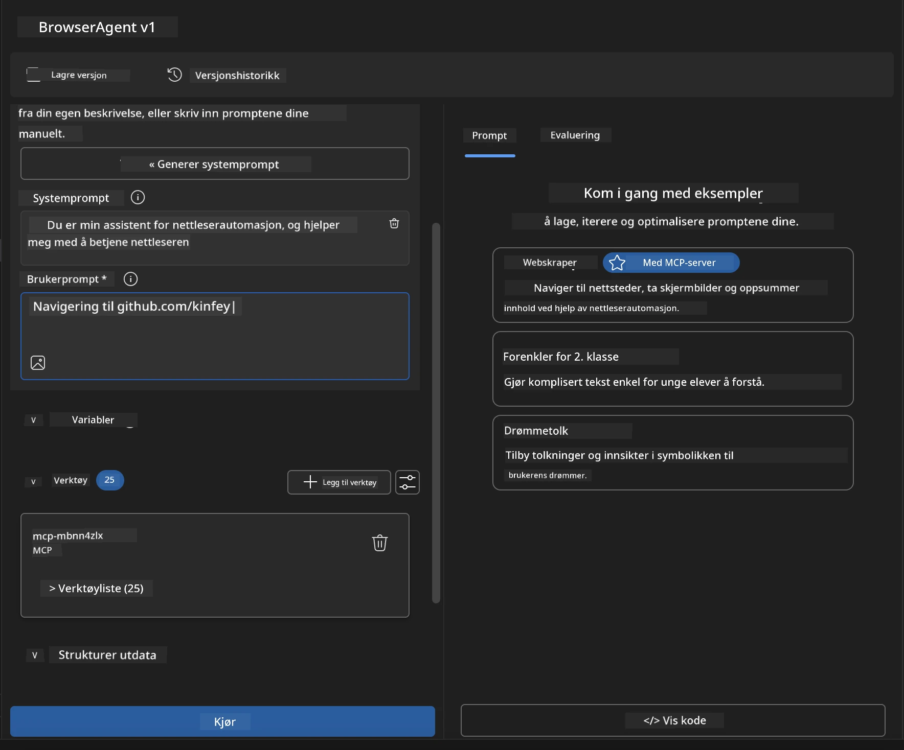

### 🚀 Fase 5: Kjøring og testing

#### Steg 10: Kjør din første automatisering
1. **Klikk "Run"** for å starte automatiseringssekvensen  
2. **Følg sanntidskjøringen**:  
   - Chrome-nettleser åpnes automatisk  
   - Agenten navigerer til mål-nettside  
   - Skjermbilder tas av hvert hovedsteg  
   - Analyse-resultater strømmer i sanntid  

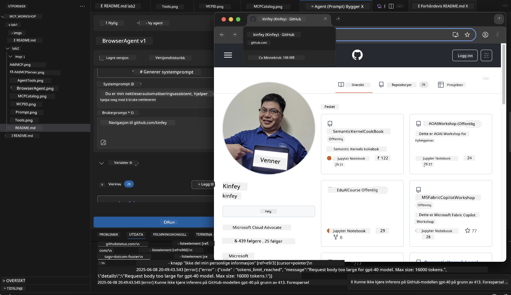

#### Steg 11: Analyser resultater og innsikt
Se gjennom omfattende analyser i Agent Builder-grensesnittet:

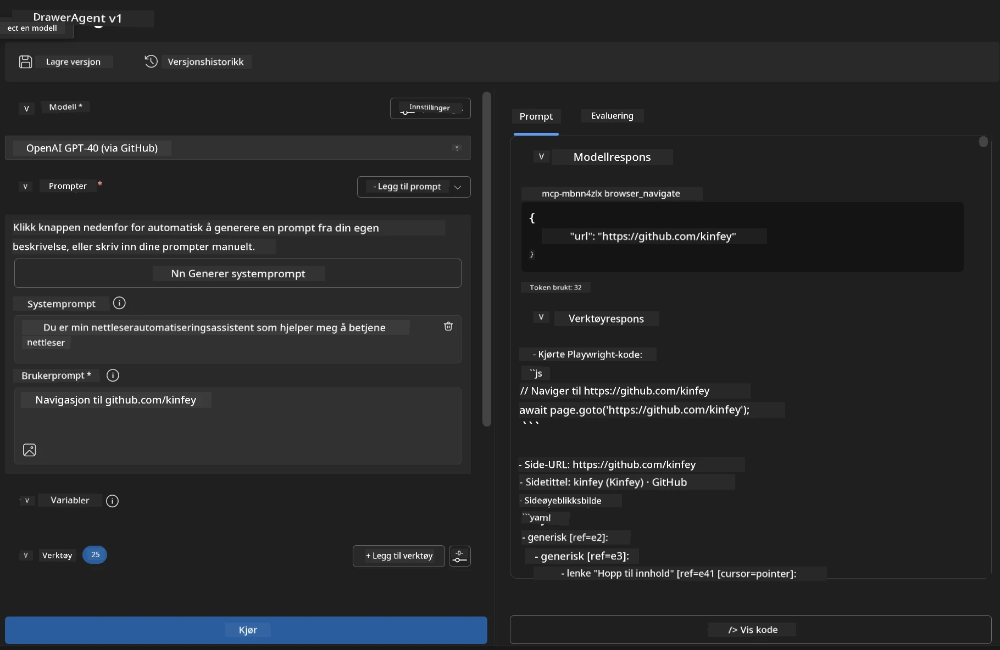

### 🌟 Fase 6: Avanserte funksjoner og distribusjon

#### Steg 12: Eksporter og distribuer i produksjon
Agent Builder støtter flere distribusjonsalternativer:

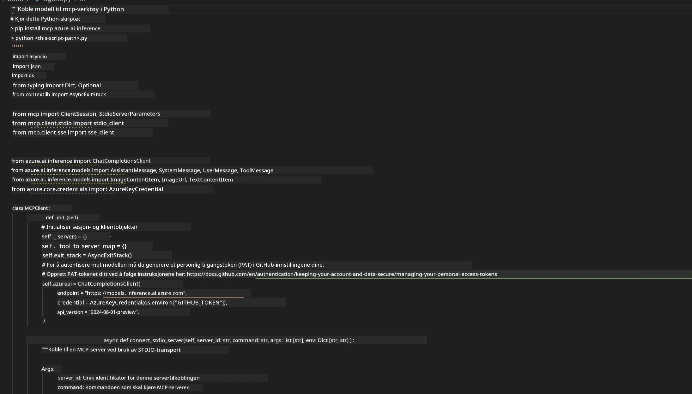

## 🎓 Modul 2 Oppsummering & Neste steg

### 🏆 Oppnåelse låst opp: MCP-integrasjonsmester

**✅ Ferdigheter mestret:**  
- [ ] Forstå MCP-arkitektur og fordeler  
- [ ] Navigere Microsofts MCP-serverøkosystem  
- [ ] Integrere Playwright MCP med AI Toolkit  
- [ ] Bygge avanserte nettleserautomatiseringsagenter  
- [ ] Avansert promptdesign for webautomatisering  

### 📚 Ekstra ressurser

- **🔗 MCP-spesifikasjon**: [Offisiell protokoll-dokumentasjon](https://modelcontextprotocol.io/)  
- **🛠️ Playwright API**: [Fullstendig metodeoversikt](https://playwright.dev/docs/api/class-playwright)  
- **🏢 Microsoft MCP-servere**: [Enterprise Integrasjonsguide](https://github.com/microsoft/mcp-servers)  
- **🌍 Fellesskapseksempler**: [MCP Server Gallery](https://github.com/modelcontextprotocol/servers)  

**🎉 Gratulerer!** Du har nå mestret MCP-integrasjon og kan bygge produksjonsklare AI-agenter med eksterne verktøy!

### 🔜 Fortsett til neste modul

Klar for å ta MCP-ferdighetene dine til neste nivå? Gå videre til **[Modul 3: Avansert MCP-utvikling med AI Toolkit](../lab3/README.md)** hvor du vil lære å:  
- Lage dine egne egendefinerte MCP-servere  
- Konfigurere og bruke den nyeste MCP Python SDK  
- Sette opp MCP Inspector for feilsøking  
- Mestre avanserte arbeidsflyter for MCP-serverutvikling
- Bygg en Weather MCP-server fra bunnen av

**Ansvarsfraskrivelse**:  
Dette dokumentet er oversatt ved hjelp av AI-oversettelsestjenesten [Co-op Translator](https://github.com/Azure/co-op-translator). Selv om vi streber etter nøyaktighet, vennligst vær oppmerksom på at automatiske oversettelser kan inneholde feil eller unøyaktigheter. Det opprinnelige dokumentet på originalspråket skal anses som den autoritative kilden. For kritisk informasjon anbefales profesjonell menneskelig oversettelse. Vi er ikke ansvarlige for eventuelle misforståelser eller feiltolkninger som oppstår ved bruk av denne oversettelsen.