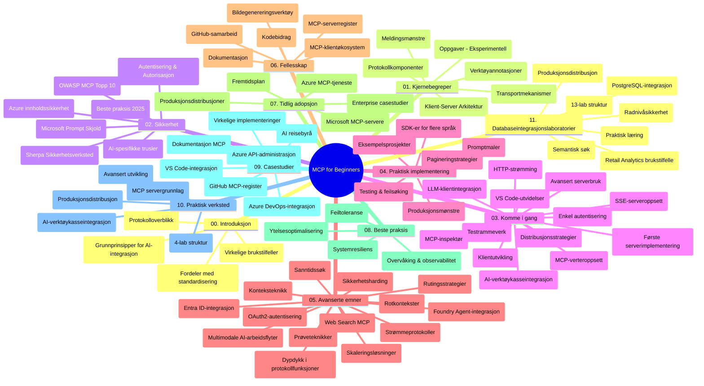

# Model Context Protocol (MCP) for Begynnere - Studieveiledning

Denne studieveiledningen gir en oversikt over mappestrukturen og innholdet i "Model Context Protocol (MCP) for Begynnere"-læreplanen. Bruk denne veiledningen for å navigere i depotet effektivt og få mest mulig ut av de tilgjengelige ressursene.

## Oversikt over depotet

Model Context Protocol (MCP) er en standardisert rammeverk for interaksjoner mellom AI-modeller og klientapplikasjoner. Opprinnelig laget av Anthropic, vedlikeholdes MCP nå av et bredere MCP-fellesskap gjennom den offisielle GitHub-organisasjonen. Dette depotet tilbyr en omfattende læreplan med praktiske kodeeksempler i C#, Java, JavaScript, Python og TypeScript, utviklet for AI-utviklere, systemarkitekter og programvareingeniører.

## Visuell læreplankart

## Struktur i depotet

Depotet er organisert i elleve hovedseksjoner, hver med fokus på ulike aspekter av MCP:

1. **Introduksjon (00-Introduction/)**
   - Oversikt over Model Context Protocol
   - Hvorfor standardisering er viktig i AI-pipelines
   - Praktiske bruksområder og fordeler

2. **Kjernebegreper (01-CoreConcepts/)**
   - Klient-server-arkitektur
   - Nøkkelkomponenter i protokollen
   - Meldingsmønstre i MCP

3. **Sikkerhet (02-Security/)**
   - Trusler mot sikkerheten i systemer basert på MCP
   - Beste praksis for å sikre implementasjoner
   - Autentiserings- og autorisasjonsstrategier
   - **Omfattende sikkerhetsdokumentasjon**:
     - MCP Security Best Practices 2025
     - Azure Content Safety Implementeringsveiledning
     - MCP Sikkerhetskontroller og teknikker
     - MCP Best Practices Hurtigreferanse
   - **Nøkkeltemaer innen sikkerhet**:
     - Prompt injection og verktøyforgiftningangrep
     - Sesjonskapring og confused deputy-problemer
     - Sårbarheter ved token-gjennompassing
     - Overdrevne tillatelser og tilgangskontroll
     - Forsyningskjede-sikkerhet for AI-komponenter
     - Microsoft Prompt Shields-integrasjon

4. **Kom i gang (03-GettingStarted/)**
   - Miljøoppsett og konfigurasjon
   - Lage grunnleggende MCP-servere og klienter
   - Integrasjon med eksisterende applikasjoner
   - Inkluderer seksjoner for:
     - Første serverimplementering
     - Klientutvikling
     - LLM-klientintegrasjon
     - VS Code-integrasjon
     - Server-Sent Events (SSE) server
     - Avansert serverbruk
     - HTTP-strømming
     - AI Toolkit-integrasjon
     - Teststrategier
     - Distribusjonsretningslinjer

5. **Praktisk implementering (04-PracticalImplementation/)**
   - Bruke SDK-er på ulike programmeringsspråk
   - Feilsøking, testing og valideringsmetoder
   - Lage gjenbrukbare promptmaler og arbeidsflyter
   - Eksempeltprosjekter med implementeringseksempler

6. **Avanserte emner (05-AdvancedTopics/)**
   - Kontekst-teknikker
   - Foundry-agentintegrasjon
   - Multimodale AI-arbeidsflyter
   - OAuth2-autentisering demonstrasjoner
   - Sanntidssøk-funksjonalitet
   - Sanntidsstrømming
   - Root contexts-implementering
   - Rutingstrategier
   - Sampling-teknikker
   - Skaleringsmetoder
   - Sikkerhetshensyn
   - Entra ID sikkerhetsintegrasjon
   - Web-søk integrasjon

7. **Bidrag fra fellesskapet (06-CommunityContributions/)**
   - Hvordan bidra med kode og dokumentasjon
   - Samarbeid via GitHub
   - Fellesskapdrevne forbedringer og tilbakemeldinger
   - Bruke ulike MCP-klienter (Claude Desktop, Cline, VSCode)
   - Jobbe med populære MCP-servere inkludert bildegenerering

8. **Erfaringer fra tidlig adopsjon (07-LessonsfromEarlyAdoption/)**
   - Virkelige implementeringer og suksesshistorier
   - Bygge og distribuere MCP-baserte løsninger
   - Trender og fremtidig veikart
   - **Microsoft MCP Servers Guide**: Omfattende guide til 10 produksjonsklare Microsoft MCP-servere, inkludert:
     - Microsoft Learn Docs MCP Server
     - Azure MCP Server (15+ spesialiserte konnektorer)
     - GitHub MCP Server
     - Azure DevOps MCP Server
     - MarkItDown MCP Server
     - SQL Server MCP Server
     - Playwright MCP Server
     - Dev Box MCP Server
     - Azure AI Foundry MCP Server
     - Microsoft 365 Agents Toolkit MCP Server

9. **Beste praksis (08-BestPractices/)**
   - Ytelsestuning og optimalisering
   - Designe feiltolerante MCP-systemer
   - Test- og resiliensstrategier

10. **Case-studier (09-CaseStudy/)**
    - **Sju omfattende case-studier** som demonstrerer MCPs allsidighet på tvers av ulike scenarier:
    - **Azure AI Travel Agents**: Multi-agent orkestrering med Azure OpenAI og AI Search
    - **Azure DevOps-integrasjon**: Automatisering av arbeidsflytprosesser med YouTube-dataoppdateringer
    - **Sanntidsdokumenthenting**: Python-konsollklient med streaming HTTP
    - **Interaktiv studieplansgenerator**: Chainlit webapp med konversasjons-AI
    - **Dokumentasjon i editor**: VS Code-integrasjon med GitHub Copilot-arbeidsflyter
    - **Azure API Management**: Enterprise API-integrasjon med MCP-serveropprettelse
    - **GitHub MCP Registry**: Økosystemutvikling og agentisk integrasjonsplattform
    - Implementeringseksempler innen enterprise-integrasjon, utviklerproduktivitet og økosystemutvikling

11. **Praktisk workshop (10-StreamliningAIWorkflowsBuildingAnMCPServerWithAIToolkit/)**
    - Omfattende praktisk workshop som kombinerer MCP med AI Toolkit
    - Bygge intelligente applikasjoner som kobler AI-modeller med virkelige verktøy
    - Praktiske moduler som dekker grunnleggende, tilpasset serverutvikling og produksjonsdistribusjonsstrategier
    - **Labstruktur**:
      - Lab 1: MCP server-grunnprinsipper
      - Lab 2: Avansert MCP serverutvikling
      - Lab 3: AI Toolkit-integrasjon
      - Lab 4: Produksjonsdistribusjon og skalering
    - Lab-basert læring med trinnvise instruksjoner

12. **MCP Server Databaseintegrasjonslaboratorier (11-MCPServerHandsOnLabs/)**
    - **Omfattende 13-lab læringssti** for å bygge produksjonsklare MCP-servere med PostgreSQL-integrasjon
    - **Virkelighetsnær detaljhandelanalyse-implementering** med Zava Retail use case
    - **Enterprise-mønstre** inklusive Row Level Security (RLS), semantisk søk og multi-tenant datatilgang
    - **Fullstendig labstruktur**:
      - **Labs 00-03: Grunnlag** – Introduksjon, arkitektur, sikkerhet, miljøoppsett
      - **Labs 04-06: Bygge MCP-server** – Databasearkitektur, MCP server-implementering, verktøyutvikling
      - **Labs 07-09: Avanserte funksjoner** – Semantisk søk, testing & feilsøking, VS Code-integrasjon
      - **Labs 10-12: Produksjon & beste praksis** – Distribusjon, overvåking, optimalisering
    - **Teknologier som dekkes**: FastMCP-rammeverk, PostgreSQL, Azure OpenAI, Azure Container Apps, Application Insights
    - **Læringsmål**: Produksjonsklare MCP-servere, databaseintegrasjonsmønstre, AI-drevet analyse, enterprise-sikkerhet

## Tilleggsressurser

Depotet inkluderer støtteressurser:

- **Bilder-mappe**: Inneholder diagrammer og illustrasjoner brukt gjennom læreplanen
- **Oversettelser**: Flerspråklig støtte med automatiserte oversettelser av dokumentasjon
- **Offisielle MCP-ressurser**:
  - [MCP Documentation](https://modelcontextprotocol.io/)
  - [MCP Specification](https://spec.modelcontextprotocol.io/)
  - [MCP GitHub Repository](https://github.com/modelcontextprotocol)

## Hvordan bruke dette depotet

1. **Sekvensiell læring**: Følg kapitlene i rekkefølge (00 til 11) for en strukturert læringsopplevelse.
2. **Språkspesifikt fokus**: Hvis du er interessert i et bestemt programmeringsspråk, utforsk eksempelkatalogene for implementasjoner i ditt foretrukne språk.
3. **Praktisk implementering**: Start med «Getting Started»-seksjonen for å sette opp miljøet og lage din første MCP-server og klient.
4. **Avansert utforskning**: Når du er komfortabel med det grunnleggende, dykk ned i de avanserte emnene for å utvide kunnskapen din.
5. **Fellesskapsengasjement**: Bli med i MCP-fellesskapet gjennom GitHub-diskusjoner og Discord-kanaler for å koble til eksperter og andre utviklere.

## MCP-klienter og verktøy

Læreplanen dekker ulike MCP-klienter og verktøy:

1. **Offisielle klienter**:
   - Visual Studio Code
   - MCP i Visual Studio Code
   - Claude Desktop
   - Claude i VSCode
   - Claude API

2. **Fellesskapsklienter**:
   - Cline (terminalbasert)
   - Cursor (kodeeditor)
   - ChatMCP
   - Windsurf

3. **MCP-administrasjonsverktøy**:
   - MCP CLI
   - MCP Manager
   - MCP Linker
   - MCP Router

## Populære MCP-servere

Depotet introduserer ulike MCP-servere, inkludert:

1. **Offisielle Microsoft MCP-servere**:
   - Microsoft Learn Docs MCP Server
   - Azure MCP Server (15+ spesialiserte konnektorer)
   - GitHub MCP Server
   - Azure DevOps MCP Server
   - MarkItDown MCP Server
   - SQL Server MCP Server
   - Playwright MCP Server
   - Dev Box MCP Server
   - Azure AI Foundry MCP Server
   - Microsoft 365 Agents Toolkit MCP Server

2. **Offisielle referanseservere**:
   - Filesystem
   - Fetch
   - Memory
   - Sequential Thinking

3. **Bildegenerering**:
   - Azure OpenAI DALL-E 3
   - Stable Diffusion WebUI
   - Replicate

4. **Utviklingsverktøy**:
   - Git MCP
   - Terminal Control
   - Code Assistant

5. **Spesialiserte servere**:
   - Salesforce
   - Microsoft Teams
   - Jira & Confluence

## Bidra

Dette depotet ønsker bidrag fra fellesskapet velkommen. Se seksjonen for bidrag fra fellesskapet for veiledning om hvordan du effektivt kan bidra til MCP-økosystemet.

----

*Denne studieveiledningen ble sist oppdatert 5. februar 2026, og gjenspeiler den nyeste MCP Specification 2025-11-25 og gir en oversikt over depotet per denne datoen. Innholdet i depotet kan oppdateres etter denne datoen.*

---

<!-- CO-OP TRANSLATOR DISCLAIMER START -->
**Ansvarsfraskrivelse**:
Dette dokumentet er oversatt ved hjelp av AI-oversettelsestjenesten [Co-op Translator](https://github.com/Azure/co-op-translator). Selv om vi streber etter nøyaktighet, vennligst vær oppmerksom på at automatiserte oversettelser kan inneholde feil eller unøyaktigheter. Det opprinnelige dokumentet på originalspråket skal anses som den autoritative kilden. For kritisk informasjon anbefales profesjonell menneskelig oversettelse. Vi er ikke ansvarlige for eventuelle misforståelser eller feiltolkninger som oppstår fra bruk av denne oversettelsen.
<!-- CO-OP TRANSLATOR DISCLAIMER END -->