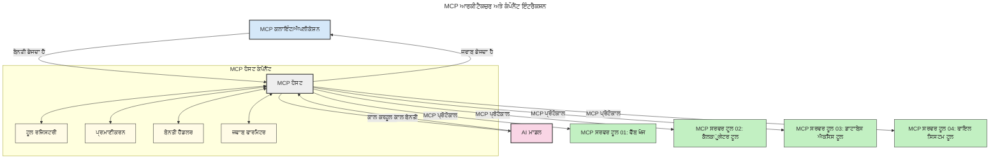

# ਮਾਡਲ ਕਾਂਟੈਕਸਟ ਪ੍ਰੋਟੋਕੋਲ (MCP) ਦੀ ਪਰਿਚਯ: ਸਕੇਲਬਲ AI ਐਪਲੀਕੇਸ਼ਨਾਂ ਲਈ ਕਿਉਂ ਮਹੱਤਵਪੂਰਣ ਹੈ

[](https://youtu.be/agBbdiOPLQA)

_(ਇਸ ਪਾਠ ਦਾ ਵੀਡੀਓ ਵੇਖਣ ਲਈ ਉਪਰ ਦੀ ਤਸਵੀਰ 'ਤੇ ਕਲਿੱਕ ਕਰੋ)_

ਜਨਰੇਟਿਵ AI ਐਪਲੀਕੇਸ਼ਨ ਇੱਕ ਵੱਡਾ ਕਦਮ ਅੱਗੇ ਹਨ ਕਿਉਂਕਿ ਉਹ ਅਕਸਰ ਉਪਭੋਗਤਾ ਨੂੰ ਪ੍ਰਾਕ੍ਰਿਤਿਕ ਭਾਸ਼ਾ ਦੀ ਵਰਤੋਂ ਕਰਕੇ ਐਪ ਨਾਲ ਇੰਟਰੈਕਟ ਕਰਨ ਦਾ ਮੌਕਾ ਦਿੰਦੇ ਹਨ। ਪਰ ਜਿਵੇਂ-जਿਵੇਂ ਇਸ ਤਰ੍ਹਾਂ ਦੇ ਐਪ ਵਿੱਚ ਵਧੇਰੇ ਸਮਾਂ ਅਤੇ ਸਰੋਤ ਲਗਾਏ ਜਾਂਦੇ ਹਨ, ਤੁਸੀਂ ਇਹ ਯਕੀਨੀ ਬਣਾਉਣਾ ਚਾਹੁੰਦੇ ਹੋ ਕਿ ਤੁਸੀਂ ਫੰਕਸ਼ਨਲਿਟੀ ਅਤੇ ਸਰੋਤਾਂ ਨੂੰ ਢੰਗ ਨਾਲ ਇੰਟਿਗਰੇਟ ਕਰ ਸਕਦੇ ਹੋ ਜੋ ਆਸਾਨੀ ਨਾਲ ਵਧਾਇਆ ਜਾ ਸਕੇ, ਤੁਹਾਡਾ ਐਪ ਕਈ ਮਾਡਲਾਂ ਨਾਲ ਕੰਮ ਕਰ ਸਕੇ, ਅਤੇ ਵੱਖ-ਵੱਖ ਮਾਡਲ ਦੀਆਂ ਵਿਸ਼ੇਸ਼ਤਾਵਾਂ ਨੂੰ ਸੰਭਾਲ ਸਕੇ। ਸਾਰ ਵਿੱਚ, ਜਨਰੇਟਿਵ AI ਐਪ ਬਣਾਉਣਾ ਸ਼ੁਰੂਆਤ ਵਿੱਚ ਆਸਾਨ ਹੈ, ਪਰ ਜਿਵੇਂ ਇਹ ਵੱਧਦੇ ਅਤੇ ਜਟਿਲ ਹੁੰਦੇ ਹਨ, ਤੁਹਾਨੂੰ ਇੱਕ ਆਰਕੀਟੈਕਚਰ ਪਰਿਭਾਸ਼ਿਤ ਕਰਨੀ ਪੈਂਦੀ ਹੈ ਅਤੇ ਸਾਭਾਵਿਕ ਹੈ ਕਿ ਤੁਸੀਂ ਕਿਸੇ ਮਿਆਰ 'ਤੇ ਨਿਰਭਰ ਹੋਵੋਗੇ ਤਾਂ ਜੋ ਤੁਹਾਡੇ ਐਪ ਸਾਰੀ ਤਰ੍ਹਾਂ ਸੰਗਠਿਤ ਤਰੀਕੇ ਨਾਲ ਬਣੇ ਰਹਿਣ। ਇਹੀ ਥਾਂ MCP ਮੌਜੂਦ ਹੁੰਦਾ ਹੈ ਤਾਂ ਜੋ ਸਾਰੀਆਂ ਗੱਲਾਂ ਨੂੰ ਸੰਗਠਿਤ ਕਰਕੇ ਇੱਕ ਮਿਆਰ ਪ੍ਰਦਾਨ ਕੀਤੀ ਜਾ ਸਕੇ।

---

## **🔍 ਮਾਡਲ ਕਾਂਟੈਕਸਟ ਪ੍ਰੋਟੋਕੋਲ (MCP) ਕੀ ਹੈ?**

**ਮਾਡਲ ਕਾਂਟੈਕਸਟ ਪ੍ਰੋਟੋਕੋਲ (MCP)** ਇੱਕ **ਖੁੱਲ੍ਹਾ, ਮਿਆਰੀਕ੍ਰਿਤ ਇੰਟਰਫੇਸ** ਹੈ ਜੋ ਵੱਡੇ ਭਾਸ਼ਾ ਮਾਡਲਾਂ (LLMs) ਨੂੰ ਬਾਹਰੀ ਟੂਲਾਂ, APIਆਂ ਅਤੇ ਡੇਟਾ ਸਰੋਤਾਂ ਨਾਲ ਬਿਨਾਂ ਰੁਕਾਵਟਾਂ ਦੇ ਇੰਟਰੈਕਟ ਕਰਨ ਦੀ ਆਗਿਆ ਦਿੰਦਾ ਹੈ। ਇਹ ਇੱਕ ਸਥਿਰ ਆਰਕੀਟੈਕਚਰ ਮੁਹੱਈਆ ਕਰਵਾਉਂਦਾ ਹੈ ਜਿਸ ਨਾਲ AI ਮਾਡਲ ਦੀ ਕਾਰਗੁਜ਼ਾਰੀ ਉਨ੍ਹਾਂ ਦੇ ਟ੍ਰੇਨਿੰਗ ਡੇਟਾ ਤੋਂ ਅੱਗੇ ਵਧਦੀ ਹੈ, ਅਤੇ ਸਮਾਰਟ, ਸਕੇਲਬਲ ਅਤੇ ਜ਼ਿਆਦਾ ਜਵਾਬਦੇਹ AI ਪ੍ਰਣਾਲੀਆਂ ਬਣਾਉਂਦਾ ਹੈ।

---

## **🎯 AI ਵਿੱਚ ਮਿਆਰਬੰਦੀ ਕਿਉਂ ਜ਼ਰੂਰੀ ਹੈ**

ਜਿਵੇਂ ਜਨਰੇਟਿਵ AI ਐਪਲੀਕੇਸ਼ਨ ਵਧੇਰੇ ਜਟਿਲ ਹੁੰਦੀਆਂ ਹਨ, ਇਹ ਅਹਮ ਹੁੰਦਾ ਹੈ ਕਿ ਤੁਸੀਂ ਐਸੀਆਂ ਮਿਆਰਾਂ ਨੂੰ ਅਪਣਾਓ ਜੋ **ਸਕੇਲਬਿਲਿਟੀ, ਵਧਾਊ ਯੋਗਤਾ, ਰਖ-ਰਖਾਅ ਯੋਗਤਾ,** ਅਤੇ **ਵੈਂਡਰ ਲਾਕ-ਇਨ ਤੋਂ ਬਚਾਅ** ਦਾ ਭਰੋਸਾ ਦਿੰਦੇ ਹਨ। MCP ਇਹਨਾਂ ਜ਼ਰੂਰਤਾਂ ਨੂੰ ਹੱਲ ਕਰਦਾ ਹੈ:

- ਮਾਡਲ-ਟੂਲ ਇੰਟਿਗ੍ਰੇਸ਼ਨਾਂ ਨੂੰ ਇਕਜੁਟ ਕਰਨਾ
- ਪੁਰਾਣੇ, ਇਕ-ਵਾਰੀ ਖਾਸ ਹੱਲਾਂ ਨੂੰ ਘਟਾਉਣਾ
- ਵੱਖ-ਵੱਖ ਵੈਂਡਰਾਂ ਦੇ ਕਈ ਮਾਡਲਾਂ ਨੂੰ ਇੱਕ ਇਕੋ ਤੰਤਰ ਵਿੱਚ ਲਿਆਉਣਾ

**ਨੋਟ:** MCP ਆਪਣੇ ਆਪ ਨੂੰ ਇੱਕ ਖੁੱਲ੍ਹਾ ਮਿਆਰ ਵੱਜੋਂ ਮੁਹੱਈਆ ਕਰਵਾਉਂਦਾ ਹੈ, ਪਰ ਇਸ ਨੂੰ IEEE, IETF, W3C, ISO ਜਾਂ ਕਿਸੇ ਹੋਰ ਮਿਆਰੀ ਸੰਸਥਾ ਰਾਹੀਂ ਮਿਆਰਬੱਧ ਕਰਨ ਦਾ ਕੋਈ ਯੋਜਨਾ ਨਹੀਂ ਹੈ। 

---

## **📚 ਸਿੱਖਣ ਦੇ ਉਦੇਸ਼**

ਇਸ ਲੇਖ ਦੇ ਅੰਤ ਤੱਕ, ਤੁਸੀਂ ਇਹ ਸਮਝ ਸਕੋਗੇ ਕਿ:

- **ਮਾਡਲ ਕਾਂਟੈਕਸਟ ਪ੍ਰੋਟੋਕੋਲ (MCP)** ਕੀ ਹੈ ਅਤੇ ਇਸ ਦੇ ਉਪਯੋਗ
- MCP ਮਾਡਲ-ਟੂਲ ਸੰਚਾਰ ਨੂੰ ਕਿਵੇਂ ਮਿਆਰਬੱਧ ਕਰਦਾ ਹੈ
- MCP ਆਰਕੀਟੈਕਚਰ ਦੇ ਮੁੱਖ ਹਿੱਸੇ ਕਿਹੜੇ ਹਨ
- ਉਦਯੋਗ ਅਤੇ ਵਿਕਾਸ ਦੇ ਸੰਦਰਭ ਵਿੱਚ MCP ਦੇ ਅਸਲੀ ਵਰਤੋਂ ਦੇ ਮਾਮਲੇ

---

## **💡 ਮਾਡਲ ਕਾਂਟੈਕਸਟ ਪ੍ਰੋਟੋਕੋਲ (MCP) ਕਿਉਂ ਖੇਡ ਬਦਲਣ ਵਾਲਾ ਹੈ**

### **🔗 MCP AI ਇੰਟਰੈਕਸ਼ਨਾਂ ਵਿੱਚ ਟੁਕੜੇ ਟੁਕੜੇ ਹੋਣ ਦੀ ਸਮੱਸਿਆ ਹੱਲ ਕਰਦਾ ਹੈ**

MCP ਤੋਂ ਪਹਿਲਾਂ, ਮਾਡਲਾਂ ਨੂੰ ਟੂਲਾਂ ਨਾਲ ਜੋੜਨਾ ਲੋੜੀਂਦਾ ਸੀ:

- ਹਰ ਟੂਲ-ਮਾਡਲ ਜੋੜ ਲਈ ਖਾਸ ਕੋਡ
- ਹਰ ਵੈਂਡਰ ਲਈ ਗੈਰ-ਮਿਆਰੀ API
- ਅਕਸਰ ਅਪਡੇਟਾਂ ਦੇ ਸਮੇਂ ਤੋੜਫੋੜ
- ਵਧਣ ਵਾਲੇ ਟੂਲਾਂ ਨਾਲ ਚੰਗੀ ਸਕੇਲਬਿਲਿਟੀ ਨਾ ਹੋਣਾ

### **✅ MCP ਮਿਆਰਬੰਦੀ ਦੇ ਫਾਇਦੇ**

| **ਫਾਇਦਾ**               | **ਵੇਰਵਾ**                                                                     |
|--------------------------|-------------------------------------------------------------------------------|
| ਇੰਟਰਆਪਰੇਬਿਲਿਟੀ        | ਵੱਖ-ਵੱਖ ਵੈਂਡਰਾਂ ਦੇ ਟੂਲਾਂ ਨਾਲ ਵੱਡੇ ਭਾਸ਼ਾ ਮਾਡਲ ਅਸਾਨੀ ਨਾਲ ਕੰਮ ਕਰਦੇ ਹਨ          |
| ਇਕਸਾਰਤਾ                 | ਪਲੇਟਫਾਰਮਾਂ ਅਤੇ ਟੂਲਾਂ ਵਿੱਚ ਸਮਾਨ ਵਿਵਹਾਰ                                  |
| ਦੁਬਾਰਾ ਵਰਤੋਂਯੋਗਤਾ       | ਇਕ ਵਾਰੀ ਬਣਾਏ ਗਏ ਟੂਲ ਪ੍ਰੋਜੈਕਟਾਂ ਅਤੇ ਸਿਸਟਮਾਂ ਵਿੱਚ ਵਾਰ-ਵਾਰ ਵਰਤੇ ਜਾ ਸਕਦੇ ਹਨ      |
| ਵਿਕਾਸ ਤੇਜ਼ੀ             | ਮਿਆਰੀਕ੍ਰਿਤ, ਪਲੱਗ-ਅ্যান্ড-ਪਲੇਅ ਇੰਟਰਫੇਸਾਂ ਨਾਲ ਵਿਕਾਸ ਸਮਾਂ ਕੱਟੋ                  |

---

## **🧱 ਉੱਚ-ਸਤਰੀ MCP ਆਰਕੀਟੈਕਚਰ ਦਾ ਝਲਕ**

MCP **ਕਲਾਇੰਟ-ਸਰਵਰ ਮਾਡਲ** ਤੇ ਆਧਾਰਤ ਹੈ, ਜਿੱਥੇ:

- **MCP ਹੋਸਟ** AI ਮਾਡਲ ਚਲਾਉਂਦੇ ਹਨ
- **MCP ਕਲਾਇੰਟ** ਬੇਨਤੀਆਂ ਕਰਦੇ ਹਨ
- **MCP ਸਰਵਰ** ਸੰਦਰਭ, ਟੂਲਾਂ ਅਤੇ ਸਮਰਥਾਵਾਂ ਪ੍ਰਦਾਨ ਕਰਦੇ ਹਨ

### **ਮੁੱਖ ਹਿੱਸੇ:**

- **ਸਰੋਤ** – ਮਾਡਲ ਲਈ ਸਥਿਰ ਜਾਂ ਢੁਕਵੀਂ ਜਾਣਕਾਰੀ  
- **ਪ੍ਰੋਂਪਟ** – ਨਿਰਧਾਰਤ ਵਰਕਫਲੋ ਜਿਸ ਨਾਲ ਮਾਡਲ ਨੂੰ ਦਿਸ਼ਾ ਮਿਲਦੀ ਹੈ  
- **ਟੂਲ** – ਵਰਤੋਂਯੋਗ ਫੰਕਸ਼ਨ ਜਿਵੇਂ ਖੋਜ, ਗਣਨਾ  
- **ਸੈਂਪਲਿੰਗ** – recursive ਇੰਟਰੈਕਸ਼ਨਾਂ ਨਾਲ ਏਜੰਟ ਬਿਹੇਵਿਅਰ
- **ਇਲਿਸੀਟੇਸ਼ਨ** – ਸਰਵਰ ਵੱਲੋਂ ਉਪਭੋਗਤਾ ਵੱਲੋਂ ਇਨਪੁੱਟ ਮੰਗਣਾ
- **ਰੂਟਸ** – ਸਰਵਰ ਦੀ ਪਹੁੰਚ ਲਈ ਫਾਈਲਸਿਸਟਮ ਸੀਮਾਵਾਂ

### **ਪ੍ਰੋਟੋਕੋਲ ਆਰਕੀਟੈਕਚਰ:**

MCP ਦੋ-ਲੇਅਰ ਆਰਕੀਟੈਕਚਰ ਵਰਤਦਾ ਹੈ:
- **ਡੇਟਾ ਲੇਅਰ**: JSON-RPC 2.0 ਤੇ ਆਧਾਰਿਤ ਸੰਚਾਰ ਜਿਸ ਵਿੱਚ ਲਾਈਫਸਾਈਕਲ ਪ੍ਰਬੰਧਨ ਅਤੇ ਪ੍ਰਿੰਮਿਟਿਵ ਹਨ  
- **ਟ੍ਰਾਂਸਪੋਰਟ ਲੇਅਰ**: STDIO (ਲੋਕਲ) ਅਤੇ Streamable HTTP ਨਾਲ SSE (ਦੂਰੀ) ਕਮਿਊਨੀਕੇਸ਼ਨ ਚੈਨਲ

---

## MCP ਸਰਵਰ ਕਿਵੇਂ ਕੰਮ ਕਰਦੇ ਹਨ

MCP ਸਰਵਰ ਹੇਠ ਲਿਖੇ ਤਰੀਕੇ ਨਾਲ ਕੰਮ ਕਰਦੇ ਹਨ:

- **ਬੇਨਤੀ ਪ੍ਰਵਾਹ**:
    1. ਬੇਨਤੀ ਕਿਸੇ ਅੰਤ-ਉਪਭੋਗਤਾ ਜਾਂ ਸਾਫਟਵੇਅਰ ਵੱਲੋਂ ਸ਼ੁਰੂ ਕੀਤੀ ਜਾਂਦੀ ਹੈ।
    2. **MCP ਕਲਾਇੰਟ** ਇਹ ਬੇਨਤੀ ਇੱਕ **MCP ਹੋਸਟ** ਨੂੰ ਭੇਜਦਾ ਹੈ, ਜੋ AI ਮਾਡਲ ਦੇ ਰਨਟਾਈਮ ਦਾ ਪ੍ਰਬੰਧਨ ਕਰਦਾ ਹੈ।
    3. **AI ਮਾਡਲ** ਉਪਭੋਗਤਾ ਦੇ ਪ੍ਰੋਂਪਟ ਨੂੰ ਪ੍ਰਾਪਤ ਕਰਦਾ ਹੈ ਅਤੇ ਵੱਖ-ਵੱਖ ਟੂਲ ਕਾਲਾਂ ਰਾਹੀਂ ਬਾਹਰੀ ਟੂਲਾਂ ਜਾਂ ਡੇਟਾ ਪਹੁੰਚ ਦੀ ਬੇਨਤੀ ਕਰ ਸਕਦਾ ਹੈ।
    4. **MCP ਹੋਸਟ, ਸਿੱਧਾ ਮਾਡਲ ਨਹੀਂ,** ਸਟੈਂਡਰਡ ਪ੍ਰੋਟੋਕੋਲ ਦੀ ਵਰਤੋਂ ਕਰਦੇ ਹੋਏ ਇੱਕ ਜਾਂ ਵੱਧ **MCP ਸਰਵਰ(ਜ਼)** ਨਾਲ ਸੰਚਾਰ ਕਰਦਾ ਹੈ।
- **MCP ਹੋਸਟ ਦੀ ਕਾਰਗੁਜ਼ਾਰੀ**:
    - **ਟੂਲ ਰਜਿਸਟਰੀ**: ਉਪਲਬਧ ਟੂਲਾਂ ਅਤੇ ਉਨ੍ਹਾਂ ਦੀਆਂ ਸਮਰਥਾਵਾਂ ਦੀ ਸੂਚੀ ਨੂੰ ਬਰਕਰਾਰ ਰੱਖਦਾ ਹੈ।
    - **ਪ੍ਰਮਾਣਿਕਤਾ**: ਟੂਲ ਪਹੁੰਚ ਲਈ ਅਧਿਕਾਰਾਂ ਦੀ ਪੁਸ਼ਟੀ ਕਰਦਾ ਹੈ।
    - **ਬੇਨਤੀ ਹੈਂਡਲਰ**: ਮਾਡਲ ਵੱਲੋਂ ਆਉਂਦੀਆਂ ਟੂਲ ਬੇਨਤੀਆਂ ਨੂੰ ਪ੍ਰੋਸੈਸ ਕਰਦਾ ਹੈ।
    - **ਪ੍ਰਤੀਕਿਰਿਆ ਫਾਰਮੈਟਰ**: ਟੂਲ ਦੇ ਨਤੀਜੇ ਐਸੇ ਗਠਿਤ ਕਰਦਾ ਹੈ ਜੋ ਮਾਡਲ ਸਮਝ ਸਕਦਾ ਹੈ।
- **MCP ਸਰਵਰ ਕਾਰਵਾਈ**:
    - **MCP ਹੋਸਟ** ਇੱਕ ਜਾਂ ਕਈ ειδικοποιημένοι **MCP ਸਰਵਰਾਂ** ਨੂੰ ਟੂਲ ਕਾਲਾਂ ਰਸਤਾ ਦਿੰਦਾ ਹੈ, ਜਿਹੜੇ ਖੋਜ, ਗਣਨਾ, ਡਾਟਾਬੇਸ ਪੁੱਛਗਿੱਛ ਵਰਗੇ ਖਾਸ ਕੰਮ ਕਰਦੇ ਹਨ।
    - **MCP ਸਰਵਰ** ਆਪਣਾ ਕੰਮ ਕਰਕੇ ਨਤੀਜੇ ਸਥਿਰ ਫਾਰਮੈਟ ਵਿੱਚ MCP ਹੋਸਟ ਨੂੰ ਵਾਪਸ ਭੇਜਦੇ ਹਨ।
    - **MCP ਹੋਸਟ** ਇਹ ਨਤੀਜੇ ਸੰਭਾਲ ਕੇ AI ਮਾਡਲ ਨੂੰ ਭੇਜਦਾ ਹੈ।
- **ਪ੍ਰਤੀਕਿਰਿਆ ਪੂਰੀ ਹੋਣਾ**:
    - **AI ਮਾਡਲ** ਟੂਲ ਉਤਪਾਦਨ ਨੂੰ ਆਖਰੀ ਜਵਾਬ ਵਿੱਚ ਸ਼ਾਮਿਲ ਕਰਦਾ ਹੈ।
    - **MCP ਹੋਸਟ** ਇਹ ਜਵਾਬ ਮੁੜ ਤੋਂ **MCP ਕਲਾਇੰਟ** ਨੂੰ ਭੇਜਦਾ ਹੈ, ਜੋ ਅੰਤ-ਉਪਭੋਗਤਾ ਜਾਂ ਕਾਲਿੰਗ ਸਾਫਟਵੇਅਰ ਨੂੰ ਸੌਂਪਦਾ ਹੈ।
    


## 👨‍💻 MCP ਸਰਵਰ ਕਿਵੇਂ ਬਣਾਇਆ ਜਾਵੇ (ਉਦਾਹਰਣਾਂ ਸਮੇਤ)

MCP ਸਰਵਰ ਤੁਹਾਡੇ ਵੱਡੇ ਭਾਸ਼ਾ ਮਾਡਲਾਂ ਦੀ ਸਮਰਥਾ ਵਧਾਉਂਦੇ ਹਨ, ਡੇਟਾ ਅਤੇ ਫੰਕਸ਼ਨਲਿਟੀ ਮੁਹੱਈਆ ਕਰਕੇ। 

ਇਸਨੂੰ ਅਜ਼ਮਾਉਣ ਲਈ ਤਈਆਰ ਹੋ? ਹੇਠਾਂ ਕੁਝ ਭਾਸ਼ਾਵਾਂ ਅਤੇ ਸਟੈਕ-ਖਾਸ SDKs ਹਨ, ਜਿਨ੍ਹਾਂ ਵਿੱਚ ਵੱਖਰੇ ਭਾਸ਼ਾਵਾਂ/ਸਟੈਕਜ਼ ਵਿੱਚ ਸਧਾਰਣ MCP ਸਰਵਰ ਬਣਾਉਣ ਦੇ ਉਦਾਹਰਣ ਹਨ:

- **Python SDK**: https://github.com/modelcontextprotocol/python-sdk

- **TypeScript SDK**: https://github.com/modelcontextprotocol/typescript-sdk

- **Java SDK**: https://github.com/modelcontextprotocol/java-sdk

- **C#/.NET SDK**: https://github.com/modelcontextprotocol/csharp-sdk


## 🌍 MCP ਦੇ ਅਸਲੀ ਵਰਤੋਂ ਦੇ ਮਾਮਲੇ

MCP ਵਿਆਪਕ ਐਪਲੀਕੇਸ਼ਨਾਂ ਨੂੰ ਸੰਭਵ ਬਣਾਉਂਦਾ ਹੈ AI ਸਮਰਥਾਵਾਂ ਨੂੰ ਵਧਾ ਕੇ:

| **ਐਪਲੀਕੇਸ਼ਨ**              | **ਵੇਰਵਾ**                                                                       |
|------------------------------|--------------------------------------------------------------------------------|
| ਉਦਯੋਗਕ ਡੇਟਾ ਇੰਟਿਗ੍ਰੇਸ਼ਨ    | LLMs ਨੂੰ ਡਾਟਾਬੇਸ, CRMs ਜਾਂ ਅੰਦਰੂਨੀ ਟੂਲਾਂ ਨਾਲ ਜੁੜਨ ਦਿੰਦਾ ਹੈ                    |
| ਏਜੰਟਿਕ AI ਸਿਸਟਮ             | ਟੂਲ ਪਹੁੰਚ ਅਤੇ ਫੈਸਲਾ-ਲੇਣ ਵਾਲੇ ਵਰਕਫਲੋ ਨਾਲ ਸਵੈ-ਸੰਚਾਲਿਤ ਏਜੰਟ ਨੂੰ ਸਮਰਥਿਤ ਕਰਦਾ ਹੈ    |
| ਬਹੁ-ਮੋਡਲ ਐਪਲੀਕੇਸ਼ਨ          | ਲਿਖਤੀ, ਚਿੱਤਰ ਅਤੇ ਆਡੀਓ ਟੂਲਾਂ ਨੂੰ ਇੱਕ ਇਕਾਈ AI ਐਪ ਵਿੱਚ ਮਿਲਾਉਂਦਾ ਹੈ                 |
| ਰੀਅਲ-ਟਾਈਮ ਡੇਟਾ ਇੰਟਿਗ੍ਰੇਸ਼ਨ | AI ਇੰਟਰੈਕਸ਼ਨਾਂ ਵਿੱਚ ਤਾਜ਼ਾ ਡੇਟਾ ਲਿਆਉਂਦਾ ਹੈ ਜੋ ਨਤੀਜਿਆਂ ਨੂੰ ਜ਼ਿਆਦਾ ਜਾਂਚਯੋਗ ਬਨਾਉਂਦਾ ਹੈ |

### 🧠 MCP = AI ਇੰਟਰੈਕਸ਼ਨਾਂ ਲਈ ਯੂਨੀਵਰਸਲ ਮਿਆਰ

ਮਾਡਲ ਕਾਂਟੈਕਸਟ ਪ੍ਰੋਟੋਕੋਲ (MCP) AI ਇੰਟਰੈਕਸ਼ਨਾਂ ਲਈ ਇੱਕ ਯੂਨੀਵਰਸਲ ਮਿਆਰ ਵੱਜੋਂ ਕੰਮ ਕਰਦਾ ਹੈ, ਬਿਲਕੁਲ ਤਰ੍ਹਾਂ ਜਿਵੇਂ USB-C ਨੇ ਜੰਤਰਾਂ ਲਈ ਸਰੀਰਕ ਕਨੈਕਸ਼ਨਾਂ ਨੂੰ ਮਿਆਰਬੱਧ ਕੀਤਾ। AI ਦੀ ਦੁਨੀਆ ਵਿੱਚ, MCP ਇੱਕ ਸਥਿਰ ਇੰਟਰਫੇਸ ਪ੍ਰਦਾਨ ਕਰਦਾ ਹੈ, ਜੋ ਮਾਡਲਾਂ (ਕਲਾਇੰਟਾਂ) ਨੂੰ ਬਾਹਰੀ ਟੂਲਾਂ ਅਤੇ ਡੇਟਾ ਪ੍ਰਦਾਤਿਆਂ (ਸਰਵਰਾਂ) ਨਾਲ ਆਸਾਨੀ ਨਾਲ ਜੁੜਨ ਦਿੰਦਾ ਹੈ। ਇਸ ਨਾਲ ਹਰ API ਜਾਂ ਡੇਟਾ ਸਰੋਤ ਲਈ ਵੱਖ-ਵੱਖ ਖਾਸ ਪ੍ਰੋਟੋਕੋਲ ਦੀ ਲੋੜ ਖਤਮ ਹੋ ਜਾਂਦੀ ਹੈ।

MCP ਅਨੁਕੂਲ ਟੂਲ (ਜਿਹੜਾ MCP ਸਰਵਰ ਕਹਾਵੇ) ਇੱਕ ਇਕਤੇ ਮਿਆਰ ਦੀ ਪਾਲਣਾ ਕਰਦਾ ਹੈ। ਇਹ ਸਰਵਰ ਉਹ ਟੂਲ ਜਾਂ ਕਾਰਵਾਈਆਂ ਦਿਖਾਉਂਦੇ ਹਨ ਜੋ ਉਹ ਪੇਸ਼ ਕਰਦੇ ਹਨ ਅਤੇ ਜਦੋ AI ਏਜੰਟ ਇਹਨਾਂ ਦੀ ਮੰਗ ਕਰਦਾ ਹੈ ਤਾਂ ਉਹਨਾਂ ਨੂੰ ਚਲਾਉਂਦੇ ਹਨ। MCP ਨੂੰ ਸਮਰਥਨ ਦੇਣ ਵਾਲੇ AI ਏਜੰਟ ਪਲੇਟਫਾਰਮ ਸਰਵਰਾਂ ਤੋਂ ਉਪਲਬਧ ਟੂਲਾਂ ਦੀ ਖੋਜ ਕਰ ਸਕਦੇ ਹਨ ਅਤੇ ਇਸ ਸਟੈਂਡਰਡ ਪ੍ਰੋਟੋਕੋਲ ਰਾਹੀਂ ਉਨ੍ਹਾਂ ਨੂੰ ਕਾਲ ਕਰ ਸਕਦੇ ਹਨ।

### 💡 ਗਿਆਨ ਤੱਕ ਪਹੁੰਚ ਸੌਖੀ ਬਣਾਈ

ਟੂਲਾਂ ਦੇ ਪੇਸ਼ਕਸ਼ ਤੋਂ ਇਲਾਵਾ, MCP ਗਿਆਨ ਤੱਕ ਪਹੁੰਚ ਨੂੰ ਵੀ ਆਸਾਨ ਬਣਾਉਂਦਾ ਹੈ। ਇਹ ਐਪਲੀਕੇਸ਼ਨਾਂ ਨੂੰ ਵੱਡੇ ਭਾਸ਼ਾ ਮਾਡਲਾਂ ਨੂੰ ਸੰਦਰਭ ਸਮੱਗਰੀ ਪ੍ਰਦਾਨ ਕਰਨ ਯੋਗ ਬਣਾਉਂਦਾ ਹੈ, ਜਿਵੇਂ ਕਿ ਵੱਖ-ਵੱਖ ਡੇਟਾ ਸਰੋਤਾਂ ਨਾਲ ਜੋੜ ਕੇ। ਉਦਾਹਰਣ ਵਜੋਂ, ਇੱਕ MCP ਸਰਵਰ ਕੰਪਨੀ ਦੇ ਦਸਤਾਵੇਜ਼ ਰਿਪੋਜ਼ਿਟਰੀ ਦੀ نمائندگی ਕਰ ਸਕਦਾ ਹੈ, ਜਿਸ ਨਾਲ ਏਜੰਟ ਲੋੜ ਅਨੁਸਾਰ ਸਬੰਧਿਤ ਜਾਣਕਾਰੀ ਪ੍ਰਾਪਤ ਕਰ ਸਕਦੇ ਹਨ। ਦੂਜਾ ਸਰਵਰ ਮੁਕੱਦਮਾ ਜਿਵੇਂ ਈਮੇਲ ਭੇਜਣਾ ਜਾਂ ਰਿਕਾਰਡ ਅਪਡੇਟ ਕਰਨਾ ਵਰਗੇ ਖਾਸ ਕੰਮ ਕਰ ਸਕਦਾ ਹੈ। ਏਜੰਟ ਦੇ ਨਜ਼ਰੀਏ ਤੋਂ ਇਹ ਸਿਰਫ਼ ਟੂਲ ਹਨ ਜੋ ਉਹ ਵਰਤ ਸਕਦਾ ਹੈ—ਕੁਝ ਟੂਲ ਡੇਟਾ (ਗਿਆਨ ਸੰਦਰਭ) ਦੇਂਦੇ ਹਨ ਜਦਕਿ ਕੁਝ ਕਾਰਵਾਈ ਕਰਦੇ ਹਨ। MCP ਇਨ੍ਹਾਂ ਦੋਹਾਂ ਨੂੰ ਕੁਸ਼ਲਤਾਪੂਰਵਕ ਸੰਚਾਲਿਤ ਕਰਦਾ ਹੈ।

ਇੱਕ ਏਜੰਟ ਜਿਸ ਦਫੇ MCP ਸਰਵਰ ਨਾਲ ਜੁੜਦਾ ਹੈ, ਉਹ ਆਟੋਮੈਟਿਕਲੀ ਸਰਵਰ ਦੀ ਉਪਲਬਧ ਸਮਰਥਾਵਾਂ ਅਤੇ ਪਹੁੰਚ ਯੋਗ ਡੇਟਾ ਲਰਨ ਕਰ ਲੈਂਦਾ ਹੈ, ਇੱਕ ਸਟੈਂਡਰਡ ਫਾਰਮੈਟ ਰਾਹੀਂ। ਇਹ ਮਿਆਰੀਕ੍ਰਿਤ ਕਰਦਾ ਹੈ ਕਿ ਟੂਲ ਸਕੂਲਤਾਪੂਰਵਕ ਉਪਲਬਧ ਹੋ ਸਕਦੇ ਹਨ। ਉਦਾਹਰਣ ਵੱਜੋਂ, ਇੱਕ ਨਵਾਂ MCP ਸਰਵਰ ਏਜੰਟ ਸਿਸਟਮ ਵਿੱਚ ਸ਼ਾਮਲ ਕਰਨ ਨਾਲ ਇਸਦੇ ਫੰਕਸ਼ਨਾਂ ਨੂੰ ਬਿਨਾਂ ਵਾਧੂ ਕਸਟਮਾਈਜ਼ੇਸ਼ਨ ਦੇ ਵਰਤਣਾ ਸਿੱਧਾ ਹੋ ਜਾਂਦਾ ਹੈ।

ਇਹ ਸੁਗਮ ਇੰਟਿਗ੍ਰੇਸ਼ਨ ਉਪਰ ਦਿੱਤੇ ਗਏ ਚਿੱਤਰ ਵਿੱਚ ਵੀਜ਼ੂਅਲ ਹਨ, ਜਿੱਥੇ ਸਰਵਰ ਦੋਹਾਂ ਟੂਲ ਅਤੇ ਗਿਆਨ ਦਿੰਦੇ ਹਨ, ਜਿਸ ਨਾਲ ਸਿਸਟਮਾਂ ਵਿਚਾਲੇ ਨਿਰੰਤਰ ਸਹਿਯੋਗ ਯਕੀਨੀ ਬਣਾਉਂਦਾ ਹੈ।

### 👉 ਉਦਾਹਰਣ: ਸਕੇਲਬਲ ਏਜੰਟ ਹੱਲ

```mermaid
---
title: MCP ਨਾਲ ਸਕੇਲ ਕਰਨ ਯੋਗ ਏਜੰਟ ਹੱਲ
description: ਇੱਕ ਡਾਇਗ੍ਰਾਮ ਜੋ ਦਰਸਾਉਂਦਾ ਹੈ ਕਿ ਇੱਕ ਯੂਜ਼ਰ ਕਿਸ ਤਰ੍ਹਾਂ ਇੱਕ LLM ਨਾਲ ਇੰਟਰੈਕਟ ਕਰਦਾ ਹੈ ਜੋ ਕਈ MCP ਸਰਵਰਾਂ ਨਾਲ ਜੁੜਦਾ ਹੈ, ਜਿਸ ਵਿੱਚ ਹਰ ਸਰਵਰ ਗਿਆਨ ਅਤੇ ਉਪਕਰਣ ਦਿੰਦਾ ਹੈ, ਇੱਕ ਸਕੇਲ ਕਰਨ ਯੋਗ AI ਸਿਸਟਮ ਆਰਕੀਟੈਕਚਰ ਬਣਾਉਂਦਾ ਹੈ
---
graph TD
    User -->|Prompt| LLM
    LLM -->|Response| User
    LLM -->|MCP| ServerA
    LLM -->|MCP| ServerB
    ServerA -->|Universal connector| ServerB
    ServerA --> KnowledgeA
    ServerA --> ToolsA
    ServerB --> KnowledgeB
    ServerB --> ToolsB

    subgraph Server A
        KnowledgeA[ਗਿਆਨ]
        ToolsA[ਉਪਕਰਣ]
    end

    subgraph Server B
        KnowledgeB[ਗਿਆਨ]
        ToolsB[ਉਪਕਰਣ]
    end
```ਯੂਨੀਵਰਸਲ ਕਨੈਕਟਰ MCP ਸਰਵਰਾਂ ਨੂੰ ਇਕ ਦੂਜੇ ਨਾਲ ਸੰਚਾਰ ਕਰਨ ਅਤੇ ਸਮਰਥਾਵਾਂ ਸਾਂਝਾ ਕਰਨ ਦਿੰਦਾ ਹੈ, ਜਿਸ ਨਾਲ ServerA ਆਪਣਾ ਕੰਮ ServerB ਨੂੰ ਸੌਂਪ ਸਕਦਾ ਹੈ ਜਾਂ ਉਸਦੇ ਟੂਲਾਂ ਅਤੇ ਗਿਆਨ ਤੱਕ ਪਹੁੰਚ ਕਰ ਸਕਦਾ ਹੈ। ਇਹ ਢਾਂਚਾ ਟੂਲਾਂ ਅਤੇ ਡੇਟਾ ਦਾ ਫੈਡਰੇਸ਼ਨ ਕਰਦਾ ਹੈ, ਜੋ ਸਕੇਲਬਲ ਅਤੇ ਮੋਡਯੂਲਰ ਏਜੰਟ ਆਰਕੀਟੈਕਚਰਾਂ ਲਈ ਸਹਾਇਕ ਹੈ। ਕਿਉਂਕਿ MCP ਟੂਲਾਂ ਦੀ ਪੇਸ਼ਕਸ਼ ਨੂੰ ਮਿਆਰਬੱਧ ਕਰਦਾ ਹੈ, ਏਜੰਟ ਸਰਵਰਾਂ ਵਿਚਕਾਰ ਬੇਨਤੀਆਂ ਦੀ ਖੋਜ ਅਤੇ ਰੂਟਿੰਗ ਕਰ ਸਕਦੇ ਹਨ ਬਿਨਾਂ ਕਠੋਰ ਕੋਡਿੰਗ ਦੇ।

ਟੂਲਾਂ ਅਤੇ ਗਿਆਨ ਦਾ ਫੈਡਰੇਸ਼ਨ: ਸਰਵਰਾਂ ਵਿਚਕਾਰ ਟੂਲਾਂ ਅਤੇ ਡੇਟਾ ਦੀ ਪਹੁੰਚ, ਵਧੀਆ ਸਕੇਲਬਲ ਅਤੇ ਮੋਡਯੂਲਰ ਏਜੰਟਿਕ ਧਾਂਚਿਆਂ ਲਈ ਸਹਾਇਕ।

### 🔄 ਕਲਾਇੰਟ-ਸਾਈਡ LLM ਇੰਟਿਗ੍ਰੇਸ਼ਨ ਵਾਲੇ ਉੱਨਤ MCP ਸਿਚੁਏਸ਼ਨਾਂ

ਆਮ MCP ਆਰਕੀਟੈਕਚਰ ਤੋਂ ਬਾਹਰ, ਕੁਝ ਉੱਚ-ਸਤਰ ਦੇ ਦ੍ਰਿਸ਼ ਸਮੇਤ ਹਨ ਜਿੱਥੇ ਦੋਹਾਂ ਕਲਾਇੰਟ ਅਤੇ ਸਰਵਰ ਵਿੱਚ LLM ਹੁੰਦੇ ਹਨ, ਜਿਸ ਨਾਲ ਹੋਰ ਜਟਿਲ ਇੰਟਰੈਕਸ਼ਨ ਸੰਭਵ ਹੁੰਦੇ ਹਨ। ਹੇਠਾਂ ਦਿੱਤੇ ਚਿੱਤਰ ਵਿੱਚ, **ਕਲਾਇੰਟ ਐਪ** ਇੱਕ IDE ਹੋ ਸਕਦਾ ਹੈ ਜਿਸ ਵਿੱਚ ਕਈ MCP ਟੂਲ ਉਪਲਬਧ ਹਨ ਜੋ LLM ਵੱਲੋਂ ਵਰਤੋਂ ਲਈ ਹਨ:

```mermaid
---
title: ਕਲਾਇੰਟ-ਸਰਵਰ LLM ਇੰਟੀਗ੍ਰੇਸ਼ਨ ਨਾਲ ਉੱਨਤ MCP ਪਰੀਪੇਖ
description: ਇੱਕ ਕ੍ਰਮ ਚਿੱਤਰ ਜੋ ਉਪਭੋਗਤਾ, ਕਲਾਇੰਟ ਐਪਲੀਕੇਸ਼ਨ, ਕਲਾਇੰਟ LLM, ਕਈ MCP ਸਰਵਰਾਂ ਅਤੇ ਸਰਵਰ LLM ਵਿਚਕਾਰ ਵਿਸਥਾਰਤ ਅੰਤਰਕਿਰਿਆ ਦਾ ਪ੍ਰਵਾਹ ਦਿਖਾਉਂਦਾ ਹੈ, ਜੋ ਟੂਲ ਖੋਜ, ਉਪਭੋਗਤਾ ਅੰਤਰਕਿਰਿਆ, ਸਿੱਧਾ ਟੂਲ ਕਾਲ ਅਤੇ ਫੀਚਰ ਕੇਵਾਲੀ ਪੜਾਅ ਦਰਸਾਉਂਦਾ ਹੈ
---
sequenceDiagram
    autonumber
    actor User as 👤 ਉਪਭੋਗਤਾ
    participant ClientApp as 🖥️ ਕਲਾਇੰਟ ਐਪ
    participant ClientLLM as 🧠 ਕਲਾਇੰਟ LLM
    participant Server1 as 🔧 MCP ਸਰਵਰ 1
    participant Server2 as 📚 MCP ਸਰਵਰ 2
    participant ServerLLM as 🤖 ਸਰਵਰ LLM
    
    %% Discovery Phase
    rect rgb(220, 240, 255)
        Note over ClientApp, Server2: ਟੂਲ ਖੋਜ ਪੜਾਅ
        ClientApp->>+Server1: ਉਪਲੱਬਧ ਟੂਲ/ਸੰਸਾਧਨਾਂ ਦੀ ਬੇਨਤੀ
        Server1-->>-ClientApp: ਟੂਲ ਸੂਚੀ ਵਾਪਸ ਕਰੋ (JSON)
        ClientApp->>+Server2: ਉਪਲੱਬਧ ਟੂਲ/ਸੰਸਾਧਨਾਂ ਦੀ ਬੇਨਤੀ
        Server2-->>-ClientApp: ਟੂਲ ਸੂਚੀ ਵਾਪਸ ਕਰੋ (JSON)
        Note right of ClientApp: ਮਿਲੀ ਜੁਲੀ ਟੂਲ<br/>ਕੈਟਾਲੌਗ ਸਥਾਨਕ ਸਟੋਰ ਕਰੋ
    end
    
    %% User Interaction
    rect rgb(255, 240, 220)
        Note over User, ClientLLM: ਉਪਭੋਗਤਾ ਅੰਤਰਕਿਰਿਆ ਪੜਾਅ
        User->>+ClientApp: ਕੁਦਰਤੀ ਭਾਸ਼ਾ ਪ੍ਰੋੰਪਟ ਦਰਜ ਕਰੋ
        ClientApp->>+ClientLLM: ਪ੍ਰੋੰਪਟ + ਟੂਲ ਕੈਟਾਲੌਗ ਅੱਗੇ ਭੇਜੋ
        ClientLLM->>-ClientLLM: ਪ੍ਰੋੰਪਟ ਦਾ ਵਿਸ਼ਲੇਸ਼ਣ ਕਰੋ ਅਤੇ ਟੂਲ ਚੁਣੋ
    end
    
    %% Scenario A: Direct Tool Calling
    alt ਸਿੱਧਾ ਟੂਲ ਕਾਲਿੰਗ
        rect rgb(220, 255, 220)
            Note over ClientApp, Server1: ਪਰੀਪੇਖ A: ਸਿੱਧਾ ਟੂਲ ਕਾਲਿੰਗ
            ClientLLM->>+ClientApp: ਟੂਲ ਚਲਾਉਣ ਲਈ ਬੇਨਤੀ
            ClientApp->>+Server1: ਵਿਸ਼ੇਸ਼ ਟੂਲ ਚਲਾਓ
            Server1-->>-ClientApp: ਨਤੀਜੇ ਵਾਪਸ ਕਰੋ
            ClientApp->>+ClientLLM: ਨਤੀਜੇ ਸੰਭਾਲੋ
            ClientLLM-->>-ClientApp: ਜਵਾਬ ਤਿਆਰ ਕਰੋ
            ClientApp-->>-User: ਆਖਰੀ ਜਵਾਬ ਦਿਖਾਓ
        end
    
    %% Scenario B: Feature Negotiation (VS Code style)
    else ਫੀਚਰ ਕੇਵਾਲੀ (VS ਕੋਡ ਸ਼ੈਲੀ)
        rect rgb(255, 220, 220)
            Note over ClientApp, ServerLLM: ਪਰੀਪੇਖ B: ਫੀਚਰ ਕੇਵਾਲੀ
            ClientLLM->>+ClientApp: ਜ਼ਰੂਰੀ ਸਮਰੱਥਾਵਾਂ ਦੀ ਪਛਾਣ ਕਰੋ
            ClientApp->>+Server2: ਫੀਚਰ/ਸਮਰੱਥਾਵਾਂ ਬਾਰੇ ਕਿਰਏ ਕੀਤੇ ਜਾ ਰਹੇ ਹਨ
            Server2->>+ServerLLM: ਵਾਧੂ ਪ੍ਰਸੰਗ ਦੀ ਬੇਨਤੀ
            ServerLLM-->>-Server2: ਪ੍ਰਸੰਗ ਮੁਹੱਈਆ ਕਰੋ
            Server2-->>-ClientApp: ਉਪਲਬਧ ਫੀਚਰ ਵਾਪਸ ਕਰੋ
            ClientApp->>+Server2: ਮੇਲ-ਜੋਲ ਵਾਲੇ ਟੂਲ ਕਾਲ ਕਰੋ
            Server2-->>-ClientApp: ਨਤੀਜੇ ਵਾਪਸ ਕਰੋ
            ClientApp->>+ClientLLM: ਨਤੀਜੇ ਸੰਜੋ ਕਰੋ
            ClientLLM-->>-ClientApp: ਜਵਾਬ ਤਿਆਰ ਕਰੋ
            ClientApp-->>-User: ਆਖਰੀ ਜਵਾਬ ਦਿਖਾਓ
        end
    end
```
## 🔐 MCP ਦੇ ਵਿਆਵਹਾਰਿਕ ਫਾਇਦੇ

MCP ਵਰਤਣ ਦੇ ਵਿਆਵਹਾਰਿਕ ਫਾਇਦੇ ਇਥੇ ਹਨ:

- **ਤਾਜਗੀ**: ਮਾਡਲ ਆਪਣੇ ਟ੍ਰੇਨਿੰਗ ਡੇਟਾ ਤੋਂ ਬਾਹਰ ਤਾਜ਼ਾ ਜਾਣਕਾਰੀ ਤੱਕ ਪਹੁੰਚ ਸਕਦੇ ਹਨ
- **ਸਮਰਥਾ ਵਧਾਉਣਾ**: ਮਾਡਲ ਵਿਸ਼ੇਸ਼ ਟੂਲਾਂ ਦੀ ਵਰਤੋਂ ਕਰ ਸਕਦੇ ਹਨ ਜਿਨ੍ਹਾਂ ਲਈ ਉਹ ਟ੍ਰੇਨ ਨਹੀਂ ਕੀਤੇ ਗਏ
- **ਘਟੀਆਂ ਹਲੂਸੀਨੇਸ਼ਨ**: ਬਾਹਰੀ ਡੇਟਾ ਸਰੋਤ ਵਾਸਤਵਿਕ ਨਿਭਰਤਾ ਮੁਹੱਈਆ ਕਰਵਾਉਂਦੇ ਹਨ
- **ਪ੍ਰਾਈਵੇਸੀ**: ਸੰਵੇਦਨਸ਼ੀਲ ਜਾਣਕਾਰੀ ਸੁਰੱਖਿਅਤ ਵਾਤਾਵਰਣਾਂ ਵਿੱਚ ਹੋ ਸਕਦੀ ਹੈ ਨਾ ਕਿ ਪ੍ਰੋਂਪਟਜ਼ ਵਿੱਚ ਸ਼ਾਮਿਲ ਹੋਵੇ

## 📌 ਮੁੱਖ ਗੱਲਾਂ

MCP ਵਰਤਣ ਲਈ ਮੁੱਖ ਗੱਲਾਂ:

- **MCP** AI ਮਾਡਲਾਂ ਨੂੰ ਟੂਲ ਅਤੇ ਡੇਟਾ ਨਾਲ ਇੰਟਰੈਕਟ ਕਰਨ ਦੇ ਤਰੀਕੇ ਨੂੰ ਮਿਆਰੀਕ੍ਰਿਤ ਕਰਦਾ ਹੈ
- **ਵਧਾਊਯੋਗਤਾ, ਇਕਸਾਰਤਾ, ਅਤੇ ਇੰਟਰਆਪਰੇਬਿਲਿਟੀ** ਨੂੰ ਉਤਸ਼ਾਹਿਤ ਕਰਦਾ ਹੈ
- MCP ਵਿਕਾਸ ਸਮਾਂ ਘਟਾਉਂਦਾ ਹੈ, ਭਰੋਸੇਯੋਗਤਾ ਸੁਧਾਰਦਾ ਹੈ ਅਤੇ ਮਾਡਲ ਸਮਰਥਾਵਾਂ ਵਧਾਉਂਦਾ ਹੈ
- ਕਲਾਇੰਟ-ਸਰਵਰ ਆਰਕੀਟੈਕਚਰ ਲਚਕੀਲੇ ਅਤੇ ਵਧਾਊਯੋਗ AI ਐਪਲੀਕੇਸ਼ਨਾਂ ਨੂੰ ਯੋਗ ਬਣਾਉਂਦਾ ਹੈ

## 🧠 ਅਭਿਆਸ

ਆਪਣੇ ਮਨ ਵਿਚ ਇਹ ਸੋਚੋ ਕਿ ਤੁਸੀਂ ਕਿਸ AI ਐਪਲੀਕੇਸ਼ਨ ਨੂੰ ਬਣਾਉਣ ਵਿੱਚ ਦਿਲਚਸਪੀ ਰੱਖਦੇ ਹੋ।

- ਕਿਹੜੇ **ਬਾਹਰੀ ਟੂਲ ਜਾਂ ਡੇਟਾ** ਉਸ ਦੀ ਸਮਰਥਾ ਵਧਾ ਸਕਦੇ ਹਨ?
- MCP ਇੰਟਿਗ੍ਰੇਸ਼ਨ ਨੂੰ ਕਿਵੇਂ **ਸਧਾਰਨ ਅਤੇ ਭਰੋਸੇਯੋਗ** ਬਣਾ ਸਕਦਾ ਹੈ?

## ਵਾਧੂ ਸਰੋਤ

- [MCP GitHub Repository](https://github.com/modelcontextprotocol)


## ਅੱਗੇ ਕੀ ਹੈ

ਅਗਲਾ: [ਅਧਿਆਇ 1: ਮੁੱਖ ਧਾਰਨਾਵਾਂ](../01-CoreConcepts/README.md)

---

<!-- CO-OP TRANSLATOR DISCLAIMER START -->
**ਅਸਵੀਕਾਰੋਪੱਤਰ**:  
ਇਸ ਦਸਤਾਵੇਜ਼ ਦਾ ਅਨuvad AI ਅਨuvad ਸੇਵਾ [Co-op Translator](https://github.com/Azure/co-op-translator) ਦੀ ਵਰਤੋਂ ਨਾਲ ਕੀਤਾ ਗਿਆ ਹੈ। ਜਦੋਂ ਕਿ ਅਸੀਂ ਸਹੀਤਾ ਲਈ ਪ੍ਰਯਾਸ ਕਰਦੇ ਹਾਂ, ਕਿਰਪਾ ਕਰਕੇ ਧਿਆਨ ਰੱਖੋ ਕਿ ਸਵੈਚਾਲਿਤ ਅਨuvad ਵਿੱਚ ਤਰੁੱਟੀਆਂ ਜਾਂ ਅਣਸਹੀ ਹੁਣਾ ਸੰਭਾਵਨਾ ਹੈ। ਮੂਲ ਦਸਤਾਵੇਜ਼ ਆਪਣੇ ਮੂਲ ਭਾਸ਼ਾ ਵਿੱਚ ਹੀ ਪ੍ਰਮਾਣਿਕ ਸਰੋਤ ਮੰਨਿਆ ਜਾਣਾ ਚਾਹੀਦਾ ਹੈ। ਮਹੱਤਵਪੂਰਣ ਜਾਣਕਾਰੀ ਲਈ, ਪੇਸ਼ੇਵਰ ਮਾਨਵ ਅਨuvad ਦੀ ਸਿਫਾਰਸ਼ ਕੀਤੀ ਜਾਂਦੀ ਹੈ। ਅਸੀਂ ਇਸ ਅਨuvad ਦੀ ਵਰਤੋਂ ਵਲੋਂ ਉਪਜਣ ਵਾਲੀਆਂ ਕੋਈ ਭੀ ਗਲਤਫਹਿਮੀਆਂ ਜਾਂ ਗਲਤ ਅਰਥ ਲੱਗਣ ਲਈ ਜ਼ਿੰਮੇਵਾਰ ਨਹੀਂ ਹਾਂ।
<!-- CO-OP TRANSLATOR DISCLAIMER END -->