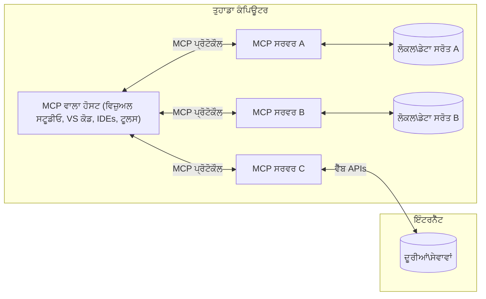

# MCP ਕੋਰ ਸੰਕਲਪ: AI ਇੰਟਿਗ੍ਰੇਸ਼ਨ ਲਈ ਮਾਡਲ ਸੰਦਰਭ ਪ੍ਰੋਟੋਕੋਲ ਵਿੱਚ ਪਾਰੰਗਤਤਾ

[](https://youtu.be/earDzWGtE84)

_(ਇਸ ਪਾਠ ਦਾ ਵੀਡੀਓ ਦੇਖਣ ਲਈ ਉਪਰੋਕਤ ਚਿੱਤਰ 'ਤੇ ਕਲਿੱਕ ਕਰੋ)_

[Model Context Protocol (MCP)](https://github.com/modelcontextprotocol) ਇੱਕ ਸ਼ਕਤੀਸ਼ਾਲੀ, ਮਿਆਰੀਕ੍ਰਿਤ ਫਰੇਮਵਰਕ ਹੈ ਜੋ ਵੱਡੇ ਭਾਸ਼ਾ ਮਾਡਲਾਂ (LLMs) ਅਤੇ ਬਾਹਰੀ ਟੂਲਾਂ, ਐਪਲੀਕੇਸ਼ਨਾਂ ਅਤੇ ਡਾਟਾ ਸਰੋਤਾਂ ਵਿਚਕਾਰ ਸੰਚਾਰ ਨੂੰ ਅਨੁਕੂਲ ਬਣਾਉਂਦਾ ਹੈ।  
ਇਹ ਗਾਈਡ ਤੁਹਾਨੂੰ MCP ਦੇ ਮੁੱਖ ਸੰਕਲਪਾਂ ਨਾਲ ਪਰੀਚਿਤ ਕਰਾਵੇਗੀ। ਤੁਸੀਂ ਇਸਦੀ ਕਲਾਇੰਟ-ਸਰਵਰ ਵਾਸ਼ਟਰਕਲਾ, ਜਰੂਰੀ ਹਿੱਸਿਆਂ, ਸੰਚਾਰ ਮਕੈਨਿਕਸ, ਅਤੇ ਲਾਗੂ ਕਰਨ ਦੇ ਵਧੀਆ ਅਭਿਆਸਾਂ ਬਾਰੇ ਜਾਣੋਗੇ।

- **ਸਪਸ਼ਟ ਉਪਭੋਗਤਾ ਸਹਿਮਤੀ**: ਸਾਰੇ ਡਾਟਾ ਐਕਸੈਸ ਅਤੇ ਕਾਰਵਾਈਆਂ ਨੂੰ ਕਾਰਜਾਂਵਿਤ ਕਰਨ ਤੋਂ ਪਹਿਲਾਂ ਸਪਸ਼ਟ ਉਪਭੋਗਤਾ ਮਨਜ਼ੂਰੀ ਦੀ ਲੋੜ ਹੁੰਦੀ ਹੈ। ਉਪਭੋਗਤਾਵਾਂ ਨੂੰ ਇਹ ਸਪਸ਼ਟ ਸਮਝਣਾ ਚਾਹੀਦਾ ਹੈ ਕਿ ਕਿਹੜਾ ਡਾਟਾ ਪ੍ਰਾਪਤ ਕੀਤਾ ਜਾਵੇਗਾ ਅਤੇ ਕਿੜੀਆਂ ਕਾਰਵਾਈਆਂ ਕੀਤੀਆਂ ਜਾਣਗੀਆਂ, ਜਿਸ ਨਾਲ ਸੁਸਪਸ਼ਟ ਅਧਿਕਾਰਾਂ ਅਤੇ ਆਗਿਆਕ੍ਰਿਤੀਆਂ 'ਤੇ ਕਾਬੂ ਮਿਲਦਾ ਹੈ।

- **ਡਾਟਾ ਪਰਦੇਦਾਰੀ ਦੀ ਸੁਰੱਖਿਆ**: ਉਪਭੋਗਤਾ ਡਾਟਾ ਸਿਰਫ ਸਪਸ਼ਟ ਸਹਿਮਤੀ ਨਾਲ ਹੀ ਪ੍ਰਗਟ ਕੀਤਾ ਜਾਂਦਾ ਹੈ ਅਤੇ ਸੰਪੂਰਨ ਸੰਪਰਕ ਜੀਵਨਚੱਕਰ ਦੌਰਾਨ ਮਜ਼ਬੂਤ ਐਕਸੈਸ ਕੰਟ੍ਰੋਲਾਂ ਨਾਲ ਸੁਰੱਖਿਅਤ ਹੋਣਾ ਚਾਹੀਦਾ ਹੈ। ਲਾਗੂ ਕਰਨ ਵਾਲੇ ਗੈਰ-ਅਧਿਕਾਰਤ ਡਾਟਾ ਪ੍ਰਸਾਰਣ ਨੂੰ ਰੋਕਣ ਅਤੇ ਕਟੋਰ ਪਰਦੇਦਾਰੀ ਸੀਮਾਵਾਂ ਦਾ ਪਾਲਣ ਕਰਨਾ ਜ਼ਰੂਰੀ ਹੈ।

- **ਟੂਲ ਕਾਰਜਕਾਰੀ ਸੁਰੱਖਿਆ**: ਹਰ ਇੱਕ ਟੂਲ ਕਾਲ ਲਈ ਉਪਭੋਗਤਾ ਦੀ ਸਪਸ਼ਟ ਸਹਿਮਤੀ ਜ਼ਰੂਰੀ ਹੈ ਜਿਸ ਨਾਲ ਟੂਲ ਦੀ ਕਾਰਜਸ਼ੀਲਤਾ, ਪੈਰਾਮੀਟਰ ਅਤੇ ਸੰਭਾਵਿਤ ਪ੍ਰਭਾਵ ਦੀ ਸਹੀ ਸਮਝ ਵਿੱਚ ਆਉਂਦਾ ਹੈ। ਮਜ਼ਬੂਤ ਸੁਰੱਖਿਆ ਸੀਮਾਵਾਂ ਗੈਰ-ਇਚਛਿਤ, ਅਨਸੁਧਾਰਤ ਜਾਂ ਮਾਲਿਸ਼ੀਅਸ ਟੂਲ ਕਾਰਜ ਨੂੰ ਰੋਕਦੀਆਂ ਹਨ।

- **ਟ੍ਰਾਂਸਪੋਰਟ ਲੇਅਰ ਸੁਰੱਖਿਆ**: ਸਾਰੇ ਸੰਚਾਰ ਚੈਨਲਾਂ ਵਿੱਚ ਯੋਜਨਾਬੱਧ ਇਨਕ੍ਰਿਪਸ਼ਨ ਅਤੇ ਪ੍ਰਮਾਣੀਕਰਨ ਤੰਤਰ ਵਰਤੇ ਜਾਣੇ ਚਾਹੀਦੇ ਹਨ। ਰਿਮੋਟ ਕਨੈਕਸ਼ਨਾਂ ਲਈ ਸੁਰੱਖਿਅਤ ਟ੍ਰਾਂਸਪੋਰਟ ਪ੍ਰੋਟੋਕੋਲਾਂ ਅਤੇ ਠੀਕ ਕ੍ਰੈਡੈਂਸ਼ੀਅਲ ਪ੍ਰਬੰਧਨ ਲਾਗੂ ਕਰਨੇ ਚਾਹੀਦੇ ਹਨ।

#### ਲਾਗੂ ਕਰਨ ਲਈ ਦਿਸ਼ਾ-ਨਿਰਦੇਸ਼:

- **ਅਧਿਕਾਰ ਪ੍ਰਬੰਧਨ**: ਸੁਤੰਤਰ ਅਤੇ ਵਿਸਤ੍ਰਿਤ ਅਧਿਕਾਰ ਸਿਸਟਮ ਕਾਇਮ ਕਰੋ ਜੋ ਉਪਭੋਗਤਾਵਾਂ ਨੂੰ ਇਸ ਗੱਲ ਦਾ ਨਿਯੰਤਰਣ ਦਿੰਦਾ ਹੈ ਕਿ ਕਿਹੜੇ ਸਰਵਰ, ਟੂਲ ਅਤੇ ਸਰੋਤ ਉਪਲਬਧ ਹਨ  
- **ਪ੍ਰਮਾਣੀਕਰਨ ਅਤੇ ਅਥਾਰਟੀਜ਼ੇਸ਼ਨ**: ਸੁਰੱਖਿਅਤ ਪ੍ਰਮਾਣੀਕਰਨ ਵਿਧੀਆਂ (OAuth, API ਚਾਬੀਆਂ) ਦਾ ਉਚਿਤ ਟੋਕਨ ਪ੍ਰਬੰਧਨ ਅਤੇ ਮਿਆਦ ਦਿੱਤੀ ਜਾਵੇ  
- **ਇਨਪੁੱਟ ਪ੍ਰਮਾਣਤਾ**: ਪਹਿਲੋਂ ਨਿਰਧਾਰਤ ਸਕੀਮਾਂ ਅਨੁਸਾਰ ਸਾਰੇ ਪੈਰਾਮੀਟਰ ਅਤੇ ਡਾਟਾ ਇਨਪੁੱਟ ਦੀ ਜਾਂਚ ਕਰੋ ਤਾਂ ਜੋ ਇੰਜੈਕਸ਼ਨ ਹਮਲਿਆਂ ਨੂੰ ਰੋਕਿਆ ਜਾ ਸਕੇ  
- **ਆਡਿਟ ਲਾਗਿੰਗ**: ਸੁਰੱਖਿਆ ਨਿਗਰਾਨੀ ਅਤੇ ਸਮਰਥਨ ਲਈ ਸਾਰੇ ਕਾਰਜਾਂ ਦੀ ਵਿਸਥਾਰਪੂਰਕ ਲਾਗ ਰੱਖੋ

## ਝਲਕ

ਇਸ ਪਾਠ ਵਿੱਚ ਅਸੀਂ Model Context Protocol (MCP) ਪਰਿਵਾਰ ਦਾ ਬੁਨਿਆਦੀ ਵਾਸ਼ਤਰਕਲਾ ਅਤੇ ਹਿੱਸਿਆਂ ਦਾ ਅਧਿਐਨ ਕਰਾਂਗੇ। ਤੁਸੀਂ ਕਲਾਇੰਟ-ਸਰਵਰ ਸੰਰਚਨਾ, ਮਹੱਤਵਪੂਰਣ ਹਿੱਸਿਆਂ ਅਤੇ MCP ਇੰਟਰੈਕਸ਼ਨਾਂ ਨੂੰ ਚਲਾਉਣ ਵਾਲੀਆਂ ਸੰਚਾਰ ਰਣਨੀਤੀਆਂ ਬਾਰੇ ਜਾਣੋਗੇ।

## ਮੁੱਖ ਸਿੱਖਣ ਦੇ ਉਦੇਸ਼

ਇਸ ਪਾਠ ਦੇ ਅੰਤ ਵਿੱਚ, ਤੁਸੀਂ:

- MCP ਕਲਾਇੰਟ-ਸਰਵਰ ਵਾਸ਼ਤਰਕਲਾ ਨੂੰ ਸਮਝੋਗੇ।  
- ਹੋਸਟ, ਕਲਾਇੰਟ ਅਤੇ ਸਰਵਰ ਦੀਆਂ ਭੂਮਿਕਾਵਾਂ ਅਤੇ ਜ਼ਿੰਮੇਵਾਰੀਆਂ ਨੂੰ ਪਛਾਣੋਗੇ।  
- MCP ਨੂੰ ਲਚਕੀਲੇ ਇੰਟਿਗ੍ਰੇਸ਼ਨ ਪੱਧਰ ਬਣਾਉਣ ਵਾਲੀ ਕੋਰ ਵਿਸ਼ੇਸ਼ਤਾਵਾਂ ਦਾ ਵਿਸ਼ਲੇਸ਼ਣ ਕਰੋਂਗੇ।  
- MCP ਪਰਿਵਾਰ ਵਿੱਚ ਜਾਣਕਾਰੀ ਕਿਸ ਤਰ੍ਹਾਂ ਬਹਿੰਦੀ ਹੈ, ਇਸਦਾ ਪਤਾ ਲਗਾਵੋਗੇ।  
- .NET, ਜਾਵਾ, ਪਾਇਥਨ ਅਤੇ ਜਾਵਾਸਕ੍ਰਿਪਟ ਦੇ ਕੋਡ ਉਦਾਹਰਨਾਂ ਰਾਹੀਂ ਪ੍ਰਯੋਗਿਕ ਗਿਆਨ ਪ੍ਰਾਪਤ ਕਰੋਂਗੇ।

## MCP ਵਾਸ਼ਤਰਕਲਾ: ਇਕ ਗਹਿਰਾ ਨਜ਼ਰੀਆ

MCP ਪਰਿਵਾਰ ਕਲਾਇੰਟ-ਸਰਵਰ ਮਾਡਲ 'ਤੇ ਆਧਾਰਿਤ ਹੈ। ਇਹ ਮੋਡਿਊਲਰ ਢਾਂਚਾ AI ਐਪਲੀਕੇਸ਼ਨਾਂ ਨੂੰ ਟੂਲਾਂ, ਡਾਟਾਬੇਸ, API, ਅਤੇ ਸੰਦਰਭਿਕ ਸਰੋਤਾਂ ਨਾਲ ਪ੍ਰਭਾਵਸ਼ালী ਤਰੀਕੇ ਨਾਲ ਸੰਚਾਰ ਕਰਨ ਦੀ ਆਗਿਆ ਦਿੰਦਾ ਹੈ। ਆਓ ਇਸ ਵਾਸ਼ਤਰਕਲਾ ਨੂੰ ਇਸਦੇ ਮੁੱਖ ਹਿੱਸਿਆਂ ਵਿੱਚ ਤੋੜੀਏ।

ਇਸਦਾ ਕਲ ਸਿਧਾਂਤ ਹੈ ਕਿ MCP ਇੱਕ ਕਲਾਇੰਟ-ਸਰਵਰ ਵਾਸ਼ਤਰਕਲਾ ਨੂੰ ਅਨੁਸਰਨ ਕਰਦਾ ਹੈ ਜਿੱਥੇ ਇੱਕ ਹੋਸਟ ਐਪਲੀਕੇਸ਼ਨ ਕਈ ਸਰਵਰਾਂ ਨਾਲ ਜੁੜ ਸਕਦਾ ਹੈ:


- **MCP ਹੋਸਟਸ**: ਐਸੇ ਪ੍ਰੋਗ੍ਰਾਮ ਜਿਵੇਂ VSCode, Claude Desktop, IDEs ਜਾਂ AI ਟੂਲ ਜੋ MCP ਰਾਹੀਂ ਡਾਟਾ ਪ੍ਰਾਪਤ ਕਰਨਾ ਚਾਹੁੰਦੇ ਹਨ  
- **MCP ਕਲਾਇੰਟਸ**: ਪ੍ਰੋਟੋਕੋਲ ਕਲਾਇੰਟ ਜੋ ਸਰਵਰਾਂ ਨਾਲ 1:1 ਸੰਪਰਕ ਬਣਾਏ ਰੱਖਦੇ ਹਨ  
- **MCP ਸਰਵਰ**: ਹਲਕੇ-ਫੁਲਕੇ ਪ੍ਰੋਗ੍ਰਾਮ ਜੋ ਪ੍ਰਤੀ MCP ਦੇ ਮਿਆਰੀਕ੍ਰਿਤ Model Context Protocol ਰਾਹੀਂ ਖਾਸ ਸਮਰੱਥਾਵਾਂ ਪ੍ਰਗਟ ਕਰਦੇ ਹਨ  
- **ਲੋਕਲ ਡਾਟਾ ਸਰੋਤ**: ਤੁਹਾਡੇ ਕੰਪਿਊਟਰ ਦੀਆਂ ਫਾਈਲਾਂ, ਡਾਟਾਬੇਸ ਅਤੇ ਸੇਵਾਵਾਂ ਜਿਨ੍ਹਾਂ ਤੱਕ MCP ਸਰਵਰ ਸੁਰੱਖਿਅਤ ਪਹੁੰਚ ਰੱਖ ਸਕਦਾ ਹੈ  
- **ਰਿਮੋਟ ਸੇਵਾਵਾਂ**: ਇੰਟਰਨੈੱਟ ਉੱਪਰ ਉਪਲਬਧ ਬਾਹਰੀ ਪ੍ਰਣਾਲੀਆਂ ਜੋ MCP ਸਰਵਰ API ਰਾਹੀਂ ਜੁੜ ਸਕਦੇ ਹਨ।

MCP ਪ੍ਰੋਟੋਕੋਲ ਇੱਕ ਵਿਕਾਸਸ਼ੀਲ ਮਿਆਰੀ ਬਰਤਾਓ ਹੈ ਜੋ ਤਾਰੀਖ-ਆਧਾਰਿਤ ਵਰਜ਼ਨਿੰਗ (YYYY-MM-DD ਫਾਰਮੈਟ) ਵਰਤਦਾ ਹੈ। ਮੌਜੂਦਾ ਪ੍ਰੋਟੋਕੋਲ ਵਰਜ਼ਨ ਹੈ **2025-11-25**। ਤੁਸੀਂ [ਪ੍ਰੋਟੋਕੋਲ ਵਿਸ਼ੇਸ਼ਤਾ](https://modelcontextprotocol.io/specification/2025-11-25/) ਵਿੱਚ ਆਖਰੀ ਅੱਪਡੇਟ ਵੇਖ ਸਕਦੇ ਹੋ।

### 1. ਹੋਸਟਸ

Model Context Protocol (MCP) ਵਿੱਚ, **ਹੋਸਟਸ** ਉਹ AI ਐਪਲੀਕੇਸ਼ਨਾਂ ਹਨ ਜੋ ਮੁੱਖ ਇੰਟਰਫੇਸ ਵਜੋਂ ਕੰਮ ਕਰਦੀਆਂ ਹਨ ਜਿਹਨੂੰ ਉਪਭੋਗਤਾ ਪ੍ਰੋਟੋਕੋਲ ਨਾਲ ਸੰवाद ਲਈ ਵਰਤਦੇ ਹਨ। ਹੋਸਟਜ਼ ਕਈ MCP ਸਰਵਰਾਂ ਨਾਲ ਜੋੜ ਬਣਾਉਣ ਲਈ ਹਰੇਕ ਸਰਵਰ ਕਨੈਕਸ਼ਨ ਲਈ ਸਮਰਪਿਤ MCP ਕਲਾਇੰਟ ਬਣਾਉਂਦੇ ਹਨ। ਹੋਸਟਸ ਦੇ ਉਦਾਹਰਣ ਹਨ:

- **AI ਐਪਲੀਕੇਸ਼ਨ**: Claude Desktop, Visual Studio Code, Claude Code  
- **ਡਿਵੈਲਪਮੈਂਟ ਵਾਤਾਵਰਨ**: IDEs ਅਤੇ ਕੋਡ ਐਡੀਟਰ MCP ਇੰਟਿਗ੍ਰੇਸ਼ਨ ਨਾਲ  
- **ਕਸਟਮ ਐਪਲੀਕੇਸ਼ਨ**: ਮਕਸਦ-ਬਣੇ AI ਏਜੰਟ ਅਤੇ ਟੂਲ

**ਹੋਸਟਸ** ਐਪਲੀਕੇਸ਼ਨ ਹਨ ਜੋ AI ਮਾਡਲ ਇੰਟਰੈਕਸ਼ਨਾਂ ਨੂੰ ਕੋਆਰਡੀਨੇਟ ਕਰਦੇ ਹਨ। ਇਹ:

- **AI ਮਾਡਲਾਂ ਦਾ ਓਰਕੇਸਟਰ ਹੁੰਦੇ ਹਨ**: LLMs ਨਾਲ ਇੰਟਰੈਕਟ ਕਰਨਾ ਜਾਂ ਕਾਰਵਾਈਆਂ ਕਰਨ ਲਈ  
- **ਕਲਾਇੰਟ ਸੰਪਰਕ ਸੰਭਾਲਦੇ ਹਨ**: ਹਰ MCP ਸਰਵਰ ਕਨੈਕਸ਼ਨ ਲਈ ਇੱਕ MCP ਕਲਾਇੰਟ ਬਣਾਉਂਦੇ ਅਤੇ ਬਰਕਰਾਰ ਰੱਖਦੇ ਹਨ  
- **ਉਪਭੋਗਤਾ ਇੰਟਰਫੇਸ ਨੂੰ ਕੰਟਰੋਲ ਕਰਦੇ ਹਨ**: ਗੱਲਬਾਤ ਦਾ ਪ੍ਰਬੰਧਨ, ਉਪਭੋਗਤਾ ਇੰਟਰੈਕਸ਼ਨ ਅਤੇ ਜਵਾਬ ਪ੍ਰਦਰਸ਼ਨ  
- **ਸੁਰੱਖਿਆ ਲਾਗੂ ਕਰਦੇ ਹਨ**: ਅਧਿਕਾਰ, ਸੁਰੱਖਿਆ ਸੀਮਾਵਾਂ ਅਤੇ ਪ੍ਰਮਾਣੀਕਰਨ ਨੂੰ ਨਿਯੰਤਰਿਤ ਕਰਦੇ ਹਨ  
- **ਉਪਭੋਗਤਾ ਸਹਿਮਤੀ ਦਾ ਪ੍ਰਬੰਧ ਕਰਦੇ ਹਨ**: ਡਾਟਾ ਸਾਂਝਾ ਕਰਨ ਅਤੇ ਟੂਲ ਕਾਰਜ ਲਈ ਮਨਜ਼ੂਰੀ ਸੰਗ੍ਰਹਿ ਕਰਦੇ ਹਨ

### 2. ਕਲਾਇੰਟਸ

**ਕਲਾਇੰਟਸ** ਇਹ ਜਰੂਰੀ ਹਿੱਸੇ ਹਨ ਜੋ MCP ਸਰਵਰਾਂ ਅਤੇ ਹੋਸਟ ਵਿੱਚ ਵਫ਼ਾਦਾਰ ਵਨ-ਟੂ-ਵਨ ਸੰਪਰਕ ਨੂੰ ਜਾਰੀ ਰੱਖਦੇ ਹਨ। ਹਰ MCP ਕਲਾਇੰਟ ਹੋਸਟ ਵੱਲੋਂ ਬਣਾਇਆ ਜਾਂਦਾ ਹੈ ਤਾਂ ਜੋ ਇੱਕ ਖਾਸ MCP ਸਰਵਰ ਨਾਲ ਜੁੜੇ ਰਹੇ, ਜਿਸ ਨਾਲ ਸੁਗਠਿਤ ਅਤੇ ਸੁਰੱਖਿਅਤ ਸੰਚਾਰ ਚੈਨਲ ਬਣਦਾ ਹੈ। ਇੱਕ ਤੋਂ ਵੱਧ ਕਲਾਇੰਟਸ ਹੋਸਟ ਨੂੰ ਕਈ ਸਰਵਰਾਂ ਨਾਲ ਇੱਕ ਸਮੇਂ ਜੁੜਨ ਦਾ ਮੌਕਾ ਦਿੰਦੇ ਹਨ।

**ਕਲਾਇੰਟਸ** ਹੋਸਟ ਐਪਲੀਕੇਸ਼ਨ ਦੇ ਕਨੈਕਟਰ ਹਿੱਸੇ ਹਨ। ਇਹ:

- **ਪ੍ਰੋਟੋਕੋਲ ਸੰਚਾਰ**: ਸਰਵਰਾਂ ਨੂੰ JSON-RPC 2.0 ਬੇਨਤੀਆਂ ਭੇਜਦੇ ਹਨ ਜਿਸ ਵਿੱਚ ਪ੍ਰੌਮਪਟ ਅਤੇ ਨਿਰਦੇਸ਼ ਹੁੰਦੇ ਹਨ  
- **ਸਮਰੱਥਾ ਮੋਲ-ਭੇਦ**: ਸ਼ੁਰੂਆਤ ਦੌਰਾਨ ਸਰਵਰਾਂ ਨਾਲ ਸਮਰੱਥਾਵਾਂ ਅਤੇ ਵਰਜ਼ਨਾਂ 'ਤੇ ਗੱਲਬਾਤ ਕਰਦੇ ਹਨ  
- **ਟੂਲ ਕਾਰਜਕਾਰੀ**: ਮਾਡਲ ਵੱਲੋਂ ਟੂਲ ਕਾਰਜ ਦੀਆਂ ਬੇਨਤੀਆਂ ਨੂੰ ਸੰਭਾਲਦੇ ਹਨ ਅਤੇ ਨੇੜੇ ਜਵਾਬ ਪ੍ਰੋਸੈਸ ਕਰਦੇ ਹਨ  
- **ਰੀਅਲ-ਟਾਈਮ ਅਪਡੇਟ**: ਸਰਵਰਾਂ ਵੱਲੋਂ ਨੋਟੀਫਿਕੇਸ਼ਨ ਅਤੇ ਰੀਅਲ-ਟਾਈਮ ਅਪਡੇਟ ਸੰਭਾਲਦੇ ਹਨ  
- **ਜਵਾਬ ਪ੍ਰਕਿਰਿਆ**: ਉਪਭੋਗਤਾਵਾਂ ਲਈ ਸਰਵਰ ਜਵਾਬ ਪ੍ਰਦਰਸ਼ਿਤ ਕਰਨ ਲਈ ਅਕਾਰ ਦਿੱਤਾ ਹੈ

### 3. ਸਰਵਰ

**ਸਰਵਰ** ਉਹ ਪ੍ਰੋਗ੍ਰਾਮ ਹਨ ਜੋ MCP ਕਲਾਇੰਟਸ ਨੂੰ ਪ੍ਰਸੰਗ, ਟੂਲ ਅਤੇ ਸਮਰੱਥਾਵਾਂ ਮੁਹੱਈਆ ਕਰਵਾਉਂਦੇ ਹਨ। ਇਹ ਤੁਹਾਡੇ ਸਥਾਨਕ ਮਸ਼ੀਨ 'ਤੇ (ਜਿੱਥੇ ਹੋਸਟ ਚੱਲਦਾ ਹੈ) ਚੱਲ ਸਕਦੇ ਹਨ ਜਾਂ ਬਾਹਰੀ ਪਲੇਟਫਾਰਮਾਂ ਤੇ ਦੂਰੇ ਤੌਰ 'ਤੇ ਵਿਵਸਥਿਤ ਹੋ ਸਕਦੇ ਹਨ, ਅਤੇ ਕਲਾਇੰਟ ਬੇਨਤੀਆਂ ਸੰਭਾਲਣ ਅਤੇ ਸੁਚੱਜੇ ਜਵਾਬ ਪ੍ਰਦਾਨ ਕਰਨ ਦੇ ਜ਼ਿੰਮੇਵਾਰ ਹਨ। ਸਰਵਰ ਮਿਆਰੀਕ੍ਰਿਤ Model Context Protocol ਰਾਹੀਂ ਵਿਸ਼ੇਸ਼ ਕਾਰਜਸ਼ੀਲਤਾ ਪੇਸ਼ ਕਰਦੇ ਹਨ।

**ਸਰਵਰ** ਸੇਵਾਵਾਂ ਹਨ ਜੋ ਪ੍ਰਸੰਗ ਅਤੇ ਸਮਰੱਥਾਵਾਂ ਦੇਂਦੀਆਂ ਹਨ। ਇਹ:

- **ਵਿਸ਼ੇਸ਼ਤਾਵਾਂ ਦਰਜ ਕਰਦੇ ਹਨ**: ਉਪਲਬਧ ਪ੍ਰਾਇਮਿਟਿਵ (ਸਰੋਤ, ਪ੍ਰੌਮਪਟ, ਟੂਲ) ਕਲਾਇੰਟਸ ਲਈ ਖੋਲ੍ਹਦੇ ਹਨ  
- **ਬੇਨਤੀਆਂ ਸੰਭਾਲਦੇ ਹਨ**: ਟੂਲ ਕਾਲ, ਸਰੋਤ ਬੇਨਤੀ, ਅਤੇ ਪ੍ਰੌਮਪਟ ਬੇਨਤੀਆਂ ਪ੍ਰਾਪਤ ਅਤੇ ਚਲਾਉਂਦੇ ਹਨ  
- **ਪ੍ਰਸੰਗਿਕ ਜਾਣਕਾਰੀ ਪ੍ਰਦਾਨ ਕਰਦੇ ਹਨ**: ਮਾਡਲ ਜਵਾਬਾਂ ਨੂੰ ਪ੍ਰਭਾਵਸ਼ਾਲੀ ਬਣਾਉਣ ਲਈ ਪਰਿਸ਼ਰ ਜਾਣਕਾਰੀ  
- **ਸਟੇਟ ਪ੍ਰਬੰਧਨ ਕਰਦੇ ਹਨ**: ਜ਼ਰੂਰਤ 'ਤੇ ਸੈਸ਼ਨ ਸਥਿਤੀ ਅਤੇ ਸਥਿਤੀ-ਭਰਪੂਰ ਸੰਵਾਦਾਂ ਨੂੰ ਸੰਭਾਲਦੇ ਹਨ  
- **ਰੀਅਲ-ਟਾਈਮ ਨੋਟੀਫਿਕੇਸ਼ਨ ਭੇਜਦੇ ਹਨ**: ਸਮਰੱਥਾ ਬਦਲਾਵਾਂ ਅਤੇ ਅਪਡੇਟਾਂ ਬਾਰੇ ਨੋਟੀਫਿਕੇਸ਼ਨ ਸਬੰਧਿਤ ਕਲਾਇੰਟਸ ਨੂੰ ਭੇਜਦੇ ਹਨ

ਕੋਈ ਵੀ ਵਿਅਕਤੀ ਮਾਡਲ ਸਮਰੱਥਾਵਾਂ ਨੂੰ ਵਿਸ਼ੇਸ਼ਤ ਫੰਕਸ਼ਨਲਿਟੀ ਨਾਲ ਵਧਾਉਣ ਲਈ ਸਰਵਰ ਦਾ ਵਿਕਾਸ ਕਰ ਸਕਦਾ ਹੈ ਅਤੇ ਇਨ੍ਹਾਂ ਦਾ ਸਥਾਨਕ ਅਤੇ ਰਿਮੋਟ ਦੋਹਾਂ ਤਰ੍ਹਾਂ ਤਾਇਨਾਤੀ ਨਾਲ ਸਹਿਯੋਗ ਹੈ।

### 4. ਸਰਵਰ ਪ੍ਰਾਇਮਿਟਿਵ

Model Context Protocol (MCP) ਵਿੱਚ ਸਰਵਰ ਤਿੰਨ ਮੁੱਖ **ਪ੍ਰਾਇਮਿਟਿਵ** ਮੁਹੱਈਆ ਕਰਦੇ ਹਨ ਜੋ ਕਲਾਇੰਟਸ, ਹੋਸਟਾਂ ਅਤੇ ਭਾਸ਼ਾ ਮਾਡਲਾ ਵਿਚਕਾਰ ਸੰਵਾਦ ਲਈ ਮੂਲ ਭੂਤਾਂ ਦੀ ਪਰਿਭਾਸ਼ਾ ਕਰਦੇ ਹਨ। ਇਹ ਪ੍ਰਾਇਮਿਟਿਵ ਸੰਚਾਰਿਤ ਜਾਣਕਾਰੀ ਅਤੇ ਉਪਲੱਬਧ ਕਾਰਵਾਈਆਂ ਦੀ ਕਿਸਮ ਨੂੰ ਦਰਸਾਉਂਦੇ ਹਨ।

MCP ਸਰਵਰ ਹੇਠਾਂ ਦਿੱਤੀ ਤਿੰਨ ਮੁੱਖ ਪ੍ਰਾਇਮਿਟਿਵ ਵਿੱਚੋਂ ਕਿਸੇ ਵੀ ਸੰਯੋਜਨ ਨੂੰ ਪ੍ਰਗਟ ਕਰ ਸਕਦੇ ਹਨ:

#### ਸਰੋਤ

**ਸਰੋਤ** ਉਹ ਡਾਟਾ ਸਰੋਤ ਹਨ ਜੋ AI ਐਪਲੀਕੇਸ਼ਨਾਂ ਨੂੰ ਪ੍ਰਸੰਗਿਕ ਜਾਣਕਾਰੀ ਮੁਹੱਈਆ ਕਰਵਾਉਂਦੇ ਹਨ। ਇਹ ਥੰਮੜੀ ਜਾਂ ਗਤੀਸ਼ੀਲ ਸਮੱਗਰੀ ਦੇ ਨਿਰੂਪਕ ਹੁੰਦੇ ਹਨ ਜੋ ਮਾਡਲ ਦੀ ਸੂਝ-ਬੂਝ ਅਤੇ ਫੈਸਲਾ ਕਰਨ ਦੀ ਸਮਰੱਥਾ ਨੂੰ ਬਹਾਲ ਕਰ ਸਕਦੇ ਹਨ:

- **ਸੰਦਰਭਿਕ ਡਾਟਾ**: AI ਮਾਡਲ ਦੀ ਖਪਤ ਲਈ ਸੰਰਚਿਤ ਜਾਣਕਾਰੀ ਅਤੇ ਸੰਦਰਭ  
- **ਗਿਆਨ ਅਧਾਰ**: ਦਸਤਾਵੇਜ਼ ਸੰਜਯੋਗ, ਲੇਖ, ਮੈਨੂਅਲ ਅਤੇ ਖੋਜ ਪੱਤਰ  
- **ਲੋਕਲ ਡਾਟਾ ਸਰੋਤ**: ਫਾਈਲਾਂ, ਡਾਟਾਬੇਸ ਅਤੇ ਸਥਾਨਕ ਪ੍ਰਣਾਲੀ ਜਾਣਕਾਰੀ  
- **ਬਾਹਰੀ ਡਾਟਾ**: API ਜਵਾਬ, ਵੈੱਬ ਸੇਵਾਵਾਂ, ਅਤੇ ਦੂਰੀ ਪ੍ਰਣਾਲੀਆਂ ਦਾ ਡਾਟਾ  
- **ਗਤੀਸ਼ੀਲ ਸਮੱਗਰੀ**: ਬਾਹਰੀ ਹਾਲਾਤਾਂ ਦੇ ਅਧਾਰ 'ਤੇ ਅਪਡੇਟ ਹੁੰਦਾ ਰੀਅਲ-ਟੀਮ ਡਾਟਾ

ਸਰੋਤ URIs ਨਾਲ ਪਛਾਣੇ ਜਾਂਦੇ ਹਨ ਅਤੇ ਇਹ `resources/list` ਰਾਹੀਂ ਖੋਜੇ ਜਾ ਸਕਦੇ ਹਨ ਤੇ `resources/read` ਰਾਹੀਂ ਪ੍ਰਾਪਤ ਕੀਤੇ ਜਾ ਸਕਦੇ ਹਨ:

```text
file://documents/project-spec.md
database://production/users/schema
api://weather/current
```
  
#### ਪ੍ਰੌਮਪਟਸ

**ਪ੍ਰੌਮਪਟਸ** ਮੁੜ ਵਰਤੋਂਯੋਗ ਟੈਂਪਲੇਟ ਹਨ ਜੋ ਭਾਸ਼ਾ ਮਾਡਲਾਂ ਨਾਲ ਸੰਵਾਦਾਂ ਨੂੰ ਬਣਾਉਣ ਵਿੱਚ ਸਹਾਇਤਾ ਕਰਦੇ ਹਨ। ਇਹ ਸਾਂਝੇ ਤਰੀਕੇ ਅਤੇ ਨਮੂਨਿਆਂ ਵਾਲੇ ਵਰਕਫਲੋਜ਼ ਦਿੰਦੇ ਹਨ:

- **ਟੈਂਪਲੇਟ-ਆਧਾਰਿਤ ਸੰਵਾਦ**: ਪਹਿਲਾਂ ਤਿਆਰ ਕੀਤੇ ਸੁਨੇਹੇ ਅਤੇ ਗੱਲਬਾਤ ਸ਼ੁਰੂ ਕਰਨ ਵਾਲੇ  
- **ਵਰਕਫਲੋ ਟੈਂਪਲੇਟਸ**: ਆਮ ਅਮਲਾਂ ਅਤੇ ਇੰਟਰਐਕਸ਼ਨਾਂ ਲਈ ਮਿਆਰੀ ਕ੍ਰਮ  
- **ਥੋੜ੍ਹੇ-ਥੋੜ੍ਹੇ ਉਦਾਹਰਣ**: ਮਾਡਲ ਨੂੰ ਨਿਰਦੇਸ਼ ਦੇਣ ਲਈ ਉਦਾਹਰਨਾਂ ਦੇ ਆਧਾਰ ਤੇ ਟੈਂਪਲੇਟ  
- **ਸਿਸਟਮ ਪ੍ਰੌਮਪਟਸ**: ਮਾਡਲ ਦੇ ਬਿਹੈਵਿਅਰ ਅਤੇ ਸੰਦਰਭ ਨੂੰ ਪਰਿਭਾਸ਼ਿਤ ਕਰਨ ਵਾਲੇ ਮੂਲ ਪ੍ਰੌਮਪਟ  
- **ਡਾਇਨਾਮਿਕ ਟੈਂਪਲੇਟਸ**: ਵਿਸ਼ੇਸ ਸੰਦਰਭਾਂ ਦੇ ਅਨੁਕੂਲ ਪੈਰਾਮੀਟਰ ਵਾਲੇ ਪ੍ਰੌਮਪਟਸ

ਪ੍ਰੌਮਪਟਸ ਵਰਿਆਬਲ ਬਦਲਾਅ ਨੂੰ ਸਮਰਥਨ ਕਰਦੇ ਹਨ ਅਤੇ `prompts/list` ਤੋਂ ਖੋਜੇ ਜਾ ਸਕਦੇ ਹਨ ਅਤੇ `prompts/get` ਨਾਲ ਪ੍ਰਾਪਤ ਕੀਤੇ ਜਾਂਦੇ ਹਨ:

```markdown
Generate a {{task_type}} for {{product}} targeting {{audience}} with the following requirements: {{requirements}}
```
  
#### ਟੂਲਜ਼

**ਟੂਲਜ਼** ਐਸੇ ਕਾਰਜਸ਼ੀਲ ਫੰਕਸ਼ਨ ਹਨ ਜਿਨ੍ਹਾਂ ਨੂੰ AI ਮਾਡਲ ਖਾਸ ਕਾਰਵਾਈ ਕਰਨ ਲਈ ਕਾਲ ਕਰ ਸਕਦੇ ਹਨ। ਇਹ MCP ਪਰਿਵਾਰ ਦੀਆਂ "ਕਿਰਿਆਵਾਂ" ਹਨ, ਜੋ ਮਾਡਲਾਂ ਨੂੰ ਬਾਹਰੀ ਪ੍ਰਣਾਲੀਆਂ ਨਾਲ ਇੰਟਰੈਕਟ ਕਰਨ ਦੇ ਯੋਗ ਬਣਾਉਂਦੇ ਹਨ:

- **ਕਾਰਜਸ਼ੀਲ ਫੰਕਸ਼ਨ**: ਸੁਤੰਤਰ ਕਾਰਵਾਈਆਂ ਜਿਨ੍ਹਾਂ ਨੂੰ ਮਾਡਲ ਖਾਸ ਪੈਰਾਮੀਟਰਾਂ ਨਾਲ ਕਾਲ ਕਰ ਸਕਦਾ ਹੈ  
- **ਬਾਹਰੀ ਪ੍ਰਣਾਲੀ ਏਕਤਾ**: API ਕਾਲ, ਡਾਟਾਬੇਸ ਕਵੈਰੀ, ਫਾਈਲ ਕਾਰਵਾਈਆਂ, ਹਿਸਾਬ ਕਿਤਾਬ  
- **ਵਿਲੱਖਣ ਪਹਚਾਣ**: ਹਰ ਟੂਲ ਦਾ ਇੱਕ ਅਲੱਗ ਨਾਮ, ਵੇਰਵਾ, ਅਤੇ ਪੈਰਾਮੀਟਰ ਸਕੀਮਾ ਹੁੰਦਾ ਹੈ  
- **ਸੰਰਚਿਤ I/O**: ਟੂਲ ਪ੍ਰਮਾਣਿਤ ਪੈਰਾਮੀਟਰ ਸਵੀਕਾਰਦੇ ਹਨ ਅਤੇ ਸੰਰਚਿਤ, ਪ੍ਰਕਾਰਬੱਧ ਜਵਾਬ ਦਿੰਦੇ ਹਨ  
- **ਕਿਰਿਆ ਸਮਰੱਥਾਵਾਂ**: ਮਾਡਲ ਨੂੰ ਜਿੰਦਗੀ ਦੇ ਕਾਰਜ ਕਰਨ ਅਤੇ ਲਾਈਵ ਡਾਟਾ ਪ੍ਰਾਪਤ ਕਰਨ ਯੋਗ ਬਣਾਉਂਦੇ ਹਨ

ਟੂਲਜਾਂ ਨੂੰ ਪੈਰਾਮੀਟਰ ਪ੍ਰਮਾਣਤਾ ਲਈ JSON ਸਕੀਮਾ ਦੇ ਨਾਲ ਵਿਆਖਿਆਤ ਕੀਤਾ ਜਾਂਦਾ ਹੈ ਅਤੇ ਇਹ `tools/list` ਰਾਹੀਂ ਖੋਜੇ ਜਾਂਦੇ ਹਨ ਅਤੇ `tools/call` ਰਾਹੀਂ ਚਲਾਏ ਜਾਂਦੇ ਹਨ। ਬਿਹਤਰ UI ਪ੍ਰਸਤੁਤੀ ਲਈ ਟੂਲਜ਼ ਵਿੱਚ **ਆਈਕਨ** ਵੀ ਸ਼ਾਮਲ ਹੋ ਸਕਦੇ ਹਨ।

**ਟੂਲ ਟਿੱਪਣੀਆਂ**: ਟੂਲਜ਼ ਵਿਹਾਰਕ ਟਿੱਪਣੀਆਂ ਨੂੰ ਸਹਾਇਤਾ ਕਰਦੇ ਹਨ (ਜਿਵੇਂ `readOnlyHint`, `destructiveHint`) ਜੋ ਇਹ ਵੇਖਾਉਂਦੀਆਂ ਹਨ ਕਿ ਟੂਲ ਪੜ੍ਹਨ ਵਾਲਾ ਹੈ ਜਾਂ ਹਾਨਿਕਾਰਕ, ਜਿਸ ਨਾਲ ਕਲਾਇੰਟ ਟੂਲ ਕਾਰਜ ਬਾਰੇ ਸੂਚਿਤ ਫੈਸਲੇ ਕਰ ਸਕਦਾ ਹੈ।

ਟੂਲ ਪਰਿਭਾਸ਼ਾ ਉਦਾਹਰਣ:

```typescript
server.tool(
  "search_products", 
  {
    query: z.string().describe("Search query for products"),
    category: z.string().optional().describe("Product category filter"),
    max_results: z.number().default(10).describe("Maximum results to return")
  }, 
  async (params) => {
    // ਖੋਜ ਚਲਾਓ ਅਤੇ ਸੰਗਠਿਤ ਨਤੀਜੇ ਵਾਪਸ ਕਰੋ
    return await productService.search(params);
  }
);
```
  
## ਕਲਾਇੰਟ ਪ੍ਰਾਇਮਿਟਿਵ

Model Context Protocol (MCP) ਵਿੱਚ, **ਕਲਾਇੰਟਸ** ਐਸੇ ਪ੍ਰਾਇਮਿਟਿਵ ਪ੍ਰਗਟ ਕਰ ਸਕਦੇ ਹਨ ਜਿਹੜੇ ਸਰਵਰਾਂ ਨੂੰ ਹੋਸਟ ਐਪਲੀਕੇਸ਼ਨ ਤੋਂ ਵਾਧੂ ਸਮਰੱਥਾਵਾਂ ਦੀ ਬੇਨਤੀ ਕਰਨ ਦਿੰਦੇ ਹਨ। ਇਹ ਕਲਾਇਂਟ-ਪਾਸੇ ਪ੍ਰਾਇਮਿਟਿਵ ਰਿਚ, ਵਧੇਰੇ ਇੰਟਰਐਕਟਿਵ ਸਰਵਰ ਲਾਗੂ ਕਰਨਯੋਗ ਬਣਾਉਂਦੇ ਹਨ ਜੋ AI ਮਾਡਲ ਸਮਰੱਥਾਵਾਂ ਅਤੇ ਉਪਭੋਗਤਾ ਇੰਟਰਐਕਸ਼ਨਾਂ ਤੱਕ ਪਹੁੰਚ ਰੱਖਦੇ ਹਨ।

### ਸਮਪਲਿੰਗ

**ਸਮਪਲਿੰਗ** ਸਰਵਰਾਂ ਨੂੰ ਕਲਾਇਂਟ ਦੇ AI ਐਪਲੀਕੇਸ਼ਨ ਤੋਂ ਭਾਸ਼ਾ ਮਾਡਲ ਦੀ ਪੂਰੀ ਪੁਰੀ ਕਰਨ ਦੀ ਬੇਨਤੀ ਕਰਨ ਦੀ ਆਗਿਆ ਦਿੰਦੀ ਹੈ। ਇਹ ਪ੍ਰਾਇਮਿਟਿਵ ਸਰਵਰਾਂ ਨੂੰ ਆਪਣੇ ਮਾਡਲ ਨਿਰਭਰਤਾ ਬਿਨਾਂ LLM ਸਮਰੱਥਾਵਾਂ ਤੱਕ ਪਹੁੰਚ ਮੁਹੱਈਆ ਕਰਵਾਉਂਦਾ ਹੈ:

- **ਮਾਡਲ-ਆਜ਼ਾਦ ਪਹੁੰਚ**: ਸਰਵਰ LLM SDK ਸ਼ਾਮਲ ਕੀਤੇ ਬਿਨਾਂ ਪੂਰੀਆਂ ਦੀ ਬੇਨਤੀ ਕਰ ਸਕਦੇ ਹਨ  
- **ਸਰਵਰ-ਅਰੰਭਿਤ AI**: ਸਰਵਰ ਆਪਣੇ ਆਪ ਗਾਹਕੀਦਾ ਸਮੱਗਰੀ ਤਿਆਰ ਕਰ ਸਕਦੇ ਹਨ ਕਲਾਇਂਟ ਦੇ AI ਮਾਡਲ ਦੀ ਵਰਤੋਂ ਕਰਕੇ  
- **ਪੁਨਰਾਵਰਤੀ LLM ਇੰਟਰਐਕਸ਼ਨ**: ਉਹ ਜਟਿਲ ਸਥਿਤੀਆਂ ਜੋ AI ਸਹਾਇਤਾ ਨਾਲ ਸੰਸાધਨ ਦੀ ਜ਼ੋਰਦਾਰ تਕਨੀਕੀ ਸਹਾਇਤਾ ਲੋੜੀਂਦੀਆਂ ਹਨ  
- **ਡਾਇਨਾਮਿਕ ਸਮੱਗਰੀ ਬਣਾਉਣਾ**: ਸਰਵਰ ਹੋਸਟ ਮਾਡਲ ਦੀ ਵਰਤੋਂ ਕਰਕੇ ਪ੍ਰਸੰਗਿਕ ਜਵਾਬ ਤਿਆਰ ਕਰ ਸਕਦੇ ਹਨ  
- **ਟੂਲ ਕਾਲ ਸਮਰਥਨ**: ਸਰਵਰ `tools` ਅਤੇ `toolChoice` ਪੈਰਾਮੀਟਰ ਸ਼ਾਮਲ ਕਰ ਸਕਦੇ ਹਨ ਤਾਂ ਜੋ ਕਲਾਇੰਟ ਦਾ ਮਾਡਲ ਸਮਪਲਿੰਗ ਦੌਰਾਨ ਟੂਲ ਕਾਲ ਕਰ ਸਕੇ

ਸਮਪਲਿੰਗ `sampling/complete` ਮੈਥਡ ਰਾਹੀਂ ਸ਼ੁਰੂ ਹੁੰਦੀ ਹੈ, ਜਿੱਥੇ ਸਰਵਰ ਕਲਾਇੰਟ ਨੂੰ ਪੂਰੀਆਂ ਦੀ ਬੇਨਤੀ ਭੇਜਦੇ ਹਨ।

### ਰੂਟਸ

**ਰੂਟਸ** ਸੈਸਟਮ ਫਾਇਲਸਿਸਟਮ ਹੱਦਾਂ ਨੂੰ ਸਰਵਰਾਂ ਉੱਪਰ ਖੋਲ੍ਹਣ ਲਈ ਕਲਾਇੰਟਸ ਲਈ ਮਿਆਰੀ ਢੰਗ ਮੁਹੱਈਆ ਕਰਵਾਉਂਦੇ ਹਨ, ਜਿਸ ਨਾਲ ਸਰਵਰ ਇਹ ਸਮਝ ਸਕਦੇ ਹਨ ਕਿ ਉਹ ਕਿਸ ਫੋਲਡਰਾਂ ਅਤੇ ਫਾਈਲਾਂ ਤੱਕ ਪਹੁੰਚ ਰੱਖਦੇ ਹਨ:

- **ਫਾਇਲਸਿਸਟਮ ਹੱਦਾਂ**: ਜਿੱਥੇ ਸਰਵਰ ਕੰਮ ਕਰ ਸਕਦੇ ਹਨ, ਉਸਦੀ ਹੱਦਾਂ ਪਰਿਭਾਸ਼ਿਤ ਕਰਨਾ  
- **ਐਕਸੈਸ ਕੰਟਰੋਲ**: ਸਰਵਰ ਨੂੰ ਇਹ ਸਮਝਣ ਵਿੱਚ ਮਦਦ ਕਰਨਾ ਕਿ ਉਹ ਕਿੜੇ ਡਾਇਰੈਕਟਰੀਆਂ ਅਤੇ ਫਾਈਲਾਂ ਤੱਕ ਐਕਸੈਸ ਕਰ ਸਕਦੇ ਹਨ  
- **ਡਾਇਨਾਮਿਕ ਅਪਡੇਟਸ**: ਕਲਾਇੰਟ ਸਰਵਰ ਨੂੰ ਨੋਟੀਫਾਈ ਕਰ ਸਕਦੇ ਹਨ ਜਦੋਂ ਰੂਟਸ ਦੀ ਸੂਚੀ ਬਦਲ ਜਾਂਦੀ ਹੈ  
- **URI-ਆਧਾਰਿਤ ਪਹਿਚਾਣ**: ਰੂਟ `file://` URIਜ਼ ਦੀ ਵਰਤੋਂ ਕਰ ਕੇ ਪਛਾਣੇ ਜਾਂਦੇ ਹਨ

ਰੂਟਾਂ ਨੂੰ `roots/list` ਮੈਥਡ ਰਾਹੀਂ ਖੋਜਿਆ ਜਾਂਦਾ ਹੈ, ਜਦਕਿ ਕਲਾਇਂਟ `notifications/roots/list_changed` ਭੇਜਦੇ ਹਨ ਜਦੋਂ ਰੂਟ ਜ਼ਰੀਏ ਬਦਲ ਹੁੰਦੇ ਹਨ।

### ਅਰਜ਼ੀ

**ਅਰਜ਼ੀ** ਸਰਵਰਾਂ ਨੂੰ ਕਲਾਇੰਟ ਇੰਟਰਫੇਸ ਰਾਹੀਂ ਉਪਭੋਗਤਾਵਾਂ ਤੋਂ ਵਾਧੂ ਜਾਣਕਾਰੀ ਜਾਂ ਪੁਸ਼ਟੀ ਮੰਗਣ ਦੀ ਆਗਿਆ ਦਿੰਦਾ ਹੈ:

- **ਉਪਭੋਗਤਾ ਇਨਪੁੱਟ ਬੇਨਤੀ**: ਜਦ ਕੋਈ ਟੂਲ ਕਾਰਜ ਲਈ ਵਾਧੂ ਜਾਣਕਾਰੀ ਦੀ ਲੋੜ ਹੋਵੇ, ਸਰਵਰ ਪੁੱਛਦਾ ਹੈ  
- **ਪੁਸ਼ਟੀ ਸੰਵਾਦ**: ਸੰਵੇਦਨਸ਼ੀਲ ਜਾਂ ਪ੍ਰਭਾਵਸ਼ਾਲੀ ਕਾਰਵਾਈਆਂ ਲਈ ਉਪਭੋਗਤਾ ਮਨਜ਼ੂਰੀ ਦੀ ਮੰਗ  
- **ਇੰਟਰਐਕਟਿਵ ਵਰਕਫਲੋਜ਼**: ਸਰਵਰ ਨੂੰ ਕਦਮ-ਬਦ-ਕਦਮ ਉਪਭੋਗਤਾ ਇੰਟਰੈਕਸ਼ਨ ਬਣਾਉਣ ਦਿੰਦਾ ਹੈ  
- **ਡਾਇਨਾਮਿਕ ਪੈਰਾਮੀਟਰ ਸੰਗ੍ਰਹਿ**: ਟੂਲ ਚਲਾਉਣ ਦੌਰਾਨ ਗੁੰਮ ਜਾਂ ਵਿਕਲਪਿਕ ਪੈਰਾਮੀਟਰ ਇਕੱਠੇ ਕਰਨ ਦੀ ਯੋਜਨਾ

ਅਰਜ਼ੀ ਦੀਆਂ ਬੇਨਤੀਆਂ `elicitation/request` ਮੈਥਡ ਰਾਹੀਂ ਕੀਤੀਆਂ ਜਾਂਦੀਆਂ ਹਨ ਤਾਂ ਜੋ ਕਲਾਇੰਟ ਇੰਟਰਫੇਸ ਰਾਹੀਂ ਉਪਭੋਗਤਾ ਇਨਪੁੱਟ ਮਿਲ ਸਕੇ।

**URL ਮੋਡ ਅਰਜ਼ੀ**: ਸਰਵਰ URL-ਆਧਾਰਿਤ ਉਪਭੋਗਤਾ ਇੰਟਰਐਕਸ਼ਨ ਦੀ ਮੰਗ ਵੀ ਕਰ ਸਕਦੇ ਹਨ, ਜਿਸ ਨਾਲ ਉਪਭੋਗਤਾ ਨੂੰ ਪ੍ਰਮਾਣੀਕਰਨ, ਪੁਸ਼ਟੀ ਜਾਂ ਡਾਟਾ ਦਰਜ ਕਰਨ ਲਈ ਬਾਹਰੀ ਵੈੱਬ ਪੰਨਿਆਂ ਵੱਲ ਰੀਡਾਇਰੈਕਟ ਕੀਤਾ ਜਾ ਸਕਦਾ ਹੈ।

### ਲਾਗਿੰਗ

**ਲਾਗਿੰਗ** ਸਰਵਰਾਂ ਨੂੰ ਕਲਾਇੰਟਸ ਨੂੰ ਤਰਤੀਬਵਾਰ ਲਾਗ ਸੁਨੇਹੇ ਭੇਜਣ ਦੀ ਆਗਿਆ ਦਿੰਦਾ ਹੈ ਜੋ ਡੀਬੱਗਿੰਗ, ਨਿਗਰਾਨੀ ਅਤੇ ਕਾਰਜਕਾਰੀ ਦ੍ਰਸ਼ਟੀਵਾਨਤਾ ਲਈ ਹੁੰਦੇ ਹਨ:

- **ਡੀਬੱਗਿੰਗ ਸਮਰਥਨ**: ਸਮੱਸਿਆ ਲੋਕਾਟ ਕਰਨ ਲਈ ਵਿਸਥਾਰਪੂਰਕ ਕਾਰਜ ਲਾਗ ਮੁਹੱਈਆ  
- **ਕਾਰਜਕਾਰੀ ਨਿਗਰਾਨੀ**: ਸਥਿਤੀ ਅਪਡੇਟ ਅਤੇ ਪ੍ਰਦਰਸ਼ਨ ਮੈਟ੍ਰਿਕਸ ਵੀ ਕਲਾਇੰਟ ਨੂੰ ਭੇجے ਜਾਂਦੇ ਹਨ  
- **ਗਲਤੀ ਦਾਇਰਾਕਨ**: ਵਿਸਥਾਰਪੂਰਕ ਗਲਤੀ ਸੰਦਰਭ ਅਤੇ ਤਕਨੀਕੀ ਜਾਣਕਾਰੀ ਪ੍ਰਦਾਨ ਕਰਨਾ  
- **ਆਡਿਟ ਟ੍ਰੇਲ**: ਸਰਵਰ ਕਾਰਵਾਈਆਂ ਅਤੇ ਫੈਸਲਿਆਂ ਦੀ ਪੂਰੀ ਲਾਗ ਬਣਾ ਕੇ ਰੱਖਣਾ

ਲਾਗਿੰਗ ਸੁਨੇਹੇ ਸਰਵਰ ਕਾਰਵਾਈਆਂ ਵਿੱਚ ਪਾਰਦਰਸ਼ਤਾ ਵਧਾਉਣ ਅਤੇ ਡੀਬੱਗ ਕਰਨ ਵਿੱਚ ਸਹਾਇਕ ਹੁੰਦੇ ਹਨ।

## MCP ਵਿੱਚ ਜਾਣਕਾਰੀ ਦਾ ਪ੍ਰਵਾਹ

Model Context Protocol (MCP) ਹੋਸਟਸ, ਕਲਾਇੰਟਸ, ਸਰਵਰਾਂ, ਅਤੇ ਮਾਡਲਾਂ ਵੱਚਕਾਰ ਸੰਰਚਿਤ ਜਾਣਕਾਰੀ ਪ੍ਰਵਾਹ ਨੂੰ ਪਰਿਭਾਸ਼ਿਤ ਕਰਦਾ ਹੈ। ਇਹ ਪ੍ਰਵਾਹ ਸਮਝਣਾ ਇਸ ਗੱਲ ਨੂੰ ਸਪਸ਼ਟ ਕਰਦਾ ਹੈ ਕਿ ਉਪਭੋਗਤਾ ਦੀਆਂ ਬੇਨਤੀਆਂ ਕਿਸ ਤਰ੍ਹਾਂ ਪ੍ਰੋਸੈਸ ਹੁੰਦੀਆਂ ਹਨ ਅਤੇ ਕਿਵੇਂ ਬਾਹਰੀ ਟੂਲ ਅਤੇ ਡਾਟਾ ਮਾਡਲ ਜਵਾਬਾਂ ਵਿੱਚ ਸ਼ਾਮਲ ਹੁੰਦੇ ਹਨ।

- **ਹੋਸਟ ਕਨੈਕਸ਼ਨ ਸ਼ੁਰੂ ਕਰਦਾ ਹੈ**  
  ਹੋਸਟ ਐਪਲੀਕੇਸ਼ਨ (ਜਿਵੇਂ IDE ਜਾਂ ਚੈਟ ਇੰਟਰਫੇਸ) MCP ਸਰਵਰ ਨਾਲ ਕਨੈਕਸ਼ਨ ਸਥਾਪਿਤ ਕਰਦਾ ਹੈ, ਆਮ ਤੌਰ 'ਤੇ STDIO, WebSocket ਜਾਂ ਹੋਰ ਸਮਰਥਿਤ ਟ੍ਰਾਂਸਪੋਰਟ ਰਾਹੀਂ।  

- **ਸਮਰੱਥਾ ਮੋਲ-ਭੇਦ**  
  ਕਲਾਇੰਟ (ਹੋਸਟ ਵਿੱਚ सम्मਿਲਿਤ) ਅਤੇ ਸਰਵਰ ਆਪਣੇ ਸਮਰਥਿਤ ਵਿਸ਼ੇਸ਼ਤਾਵਾਂ, ਟੂਲ, ਸਰੋਤ ਅਤੇ ਪ੍ਰੋਟੋਕੋਲ ਵਰਜ਼ਨਾਂ ਬਾਰੇ ਜਾਣਕਾਰੀ ਵਟਾਂਦਰੇ ਕਰਦੇ ਹਨ। ਇਸ ਨਾਲ ਦੋਹਾਂ ਪੱਖ ਸਮਝ ਪਾ ਜਾਂਦੇ ਹਨ ਕਿ ਸੈਸ਼ਨ ਲਈ ਕਿਹੜੀਆਂ ਸਮਰੱਥਾਵਾਂ ਉਪਲੱਬਧ ਹਨ।  

- **ਉਪਭੋਗਤਾ ਬੇਨਤੀ**  
  ਉਪਭੋਗਤਾ ਹੋਸਟ ਨਾਲ ਇੰਟਰਐਕਟ ਕਰਦਾ ਹੈ (ਜਿਵੇਂ ਪ੍ਰੌਮਪਟ ਜਾਂ ਕਮਾਂਡ ਦਿੰਦਾ ਹੈ)। ਹੋਸਟ ਇਸ ਇਨਪੁੱਟ ਨੂੰ ਸੰਕਲਿਤ ਕਰਦਾ ਹੈ ਅਤੇ ਪ੍ਰੋਸੈਸਿੰਗ ਲਈ ਕਲਾਇੰਟ ਵੱਲ ਭੇਜਦਾ ਹੈ।  

- **ਸਰੋਤ ਜਾਂ ਟੂਲ ਦੀ ਵਰਤੋਂ**  
  - ਕਲਾਇੰਟ ਮਾਡਲ ਦੀ ਸੂਝ-ਬੂਝ ਵਧਾਉਣ ਲਈ ਸਰਵਰ ਤੋਂ ਹੋਰ ਸੰਦਰਭ ਜਾਂ ਸਰੋਤ ਬੇਨਤੀ ਕਰ ਸਕਦਾ ਹੈ (ਜਿਵੇਂ ਫਾਈਲਾਂ, ਡਾਟਾਬੇਸ ਦਾਖਲੇ, ਜਾਂ ਗਿਆਨ ਅਧਾਰ ਲੇਖ)।  
  - ਜੇ ਮਾਡਲ ਨੂੰ ਟੂਲ ਦੀ ਲੋੜ ਪੈਂਦੀ ਹੈ (ਜਿਵੇਂ ਡਾਟਾ ਲੈਣਾ, ਹਿਸਾਬ ਕਰਨਾ, ਜਾਂ API ਕਾਲ ਕਰਨੀ), ਕਲਾਇੰਟ ਸਰਵਰ ਨੂੰ ਟੂਲ ਕਾਲ ਬੇਨਤੀ ਭੇਜਦਾ ਹੈ, ਜਿਸ ਵਿੱਚ ਟੂਲ ਦਾ ਨਾਮ ਅਤੇ ਪੈਰਾਮੀਟਰ ਸ਼ਾਮਲ ਹੁੰਦੇ ਹਨ।

- **ਸਰਵਰ ਕਾਰਜਕਾਰੀ**  

ਸਰਵਰ ਸਰੋਤ ਜਾਂ ਟੂਲ ਰਿਕਵੇਸਟ ਪ੍ਰਾਪਤ ਕਰਦਾ ਹੈ, ਜਰੂਰੀ ਓਪਰੇਸ਼ਨ (ਜਿਵੇਂ ਕਿ ਫੰਕਸ਼ਨ ਚਲਾਉਣਾ, ਡੇਟਾਬੇਸ ਨੂੰ ਕ੍ਵੈਰੀ ਕਰਨਾ ਜਾਂ ਫਾਇਲ ਪ੍ਰਾਪਤ ਕਰਨਾ) ਨਿਭਾਉਂਦਾ ਹੈ, ਅਤੇ ਨਤੀਜੇ ਨੂੰ ਸੰਰਚਿਤ ਫਾਰਮੈਟ ਵਿੱਚ ਕਲਾਇੰਟ ਨੂੰ ਵਾਪਸ ਕਰਦਾ ਹੈ।

- **ਜਵਾਬ ਤਿਆਰ ਕਰਨਾ**  
  ਕਲਾਇੰਟ ਸਰਵਰ ਦੇ ਜਵਾਬਾਂ (ਸਰੋਤ ਡੇਟਾ, ਟੂਲ ਆਉਟਪੁੱਟ ਆਦਿ) ਨੂੰ ਚਲ ਰਹੀ ਮਾਡਲ ਇੰਟਰੈਕਸ਼ਨ ਵਿੱਚ ਜੋੜਦਾ ਹੈ। ਮਾਡਲ ਇਸ ਜਾਣਕਾਰੀ ਨੂੰ ਵਰਤਦਿਆਂ ਇੱਕ ਵਿਸਥਾਰਿਤ ਅਤੇ ਸੰਦਰਭ-ਅਨੁਕੂਲ ਜਵਾਬ ਤਿਆਰ ਕਰਦਾ ਹੈ।

- **ਨਤੀਜੇ ਪ੍ਰਸਤੁਤੀ**  
  ਹੋਸਟ ਕਲਾਇੰਟ ਵੱਲੋਂ ਆਖਰੀ ਆਉਟਪੁੱਟ ਪ੍ਰਾਪਤ ਕਰਦਾ ਹੈ ਅਤੇ ਇਸਨੂੰ ਉਪਭੋਗਤਾ ਨੂੰ ਪੇਸ਼ ਕਰਦਾ ਹੈ, ਅਕਸਰ ਮਾਡਲ ਦੇ ਬਣਾਏ ਟੈਕਸਟ ਅਤੇ ਟੂਲ ਚਲਾਣ ਦੇ ਨਤੀਜੇ ਜਾਂ ਸਰੋਤ ਲੁਕਅਪ ਦੇ ਨਤੀਜੇ ਦੋਹਾਂ ਨੂੰ ਸ਼ਾਮਲ ਕਰਦਾ ਹੈ।

ਇਹ ਪ੍ਰਕਿਰਿਆ MCP ਨੂੰ ਉन्नਤ, ਇੰਟਰਐਕਟਿਵ ਅਤੇ ਸੰਦਰਭ-ਜਾਣੂ AI ਐਪਲੀਕੇਸ਼ਨਾਂ ਲਈ ਸਹਾਇਕ ਬਣਾਉਂਦੀ ਹੈ ਜੋ ਬਿਨਾ ਰੁਕਾਵਟ ਮਾਡਲਜ਼ ਨੂੰ ਬਾਹਰੀ ਟੂਲਾਂ ਅਤੇ ਡੇਟਾ ਸਰੋਤਾਂ ਨਾਲ ਜੋੜਦੀ ਹੈ।

## ਪ੍ਰੋਟੋਕਾਲ ਆਰਕੀਟੈਕਚਰ ਅਤੇ ਪਰਤਾਂ

MCP ਵਿੱਚ ਦੋ ਵੱਖਰੇ ਆਰਕੀਟੈਕਚਰਲ ਪਰਤਾਂ ਹਨ ਜੋ ਮਿਲ ਕੇ ਇਕ ਪੂਰਾ ਕਮਿਊਨਿਕੇਸ਼ਨ ਫ੍ਰੇਮਵਰਕ ਪ੍ਰਦਾਨ ਕਰਦੀਆਂ ਹਨ:

### ਡੇਟਾ ਪਰਤ

**ਡੇਟਾ ਪਰਤ** MCP ਪ੍ਰੋਟੋਕਾਲ ਦਾ ਮੁੱਖ ਅੰਸ਼ JSON-RPC 2.0 ਨੂੰ ਆਧਾਰ ਬਣਾਕੇ ਨਿਭਾਉਂਦੀ ਹੈ। ਇਹ ਪਰਤ ਸੁਨੇਹੇ ਦੀ ਸੰਰਚਨਾ, ਅਰਥ, ਅਤੇ ਇੰਟਰਐਕਸ਼ਨ ਪੈਟਰਨ ਪਰਿਭਾਸ਼ਿਤ ਕਰਦੀ ਹੈ:

#### ਮੁੱਖ ਘਟਕ:

- **JSON-RPC 2.0 ਪ੍ਰੋਟੋਕਾਲ**: ਸਾਰਾ ਸੰਚਾਰ ਮੈਥਡ ਕਾਲਾਂ, ਜਵਾਬਾਂ, ਅਤੇ ਸੂਚਨਾਵਾਂ ਲਈ ਮਿਆਰੀਕ੍ਰਿਤ JSON-RPC 2.0 ਸੁਨੇਹਾ ਫਾਰਮੈਟ ਦੀ ਵਰਤੋਂ ਕਰਦਾ ਹੈ
- **ਲਾਈਫਸਾਈਕਲ ਮੈਨੇਜਮੈਂਟ**: ਕਲਾਇੰਟ ਅਤੇ ਸਰਵਰ ਦਰਮਿਆਨ ਕਨੈਕਸ਼ਨ ਸ਼ੁਰੂਆਤ, ਸਮਰੱਥਾ ਸਹਿਮਤੀ ਅਤੇ ਸੈਸ਼ਨ ਅੰਤ ਸੰਭਾਲਦਾ ਹੈ
- **ਸਰਵਰ ਮੁਢਲੀ ਯੋਗਤਾਵਾਂ**: ਟੂਲਾਂ, ਸਰੋਤਾਂ ਅਤੇ ਪ੍ਰੌਮਪਟਾਂ ਰਾਹੀਂ ਕੋਰ ਫੰਕਸ਼ਨਾਲਿਟੀ ਪ੍ਰਦਾਨ ਕਰਨਾ ਯੋਗ ਬਣਾਉਂਦਾ ਹੈ
- **ਕਲਾਇੰਟ ਮੁਢਲੀ ਯੋਗਤਾਵਾਂ**: LLM ਤੋਂ ਸੈਂਪਲਿੰਗ ਲੈਣਾ, ਉਪਭੋਗਤਾ ਇਨਪੁੱਟ ਬੁਲਾਉਣਾ, ਅਤੇ ਲੌਗ ਮੈਸੇਜ ਭੇਜਣਾ ਯੋਗ ਬਣਾਉਂਦਾ ਹੈ
- **ਰੀਅਲ-ਟਾਈਮ ਸੂਚਨਾਵਾਂ**: ਪੋਲਿੰਗ ਦੇ ਬਿਨ੍ਹਾਂ ਗਤੀਸ਼ੀਲ ਅਪਡੇਟਸ ਲਈ ਅਸਮਮਿਤ ਸੂਚਨਾਵਾਂ ਦਾ ਸਮਰਥਨ ਕਰਦਾ ਹੈ

#### ਮੁੱਖ ਖਾਸੀਅਤਾਂ:

- **ਪ੍ਰੋਟੋਕਾਲ ਵਰਜਨ ਸਹਿਮਤੀ**: ਤਾਰੀਖ-ਅਧਾਰਤ ਵਰਜਨਿੰਗ (YYYY-MM-DD) ਵਰਤ ਕਰ ਅਨੁਕੂਲਤਾ ਯਕੀਨੀ ਬਣਾਉਂਦਾ ਹੈ
- **ਸਮਰੱਥਾ ਖੋਜ**: ਸ਼ੁਰੂਆਤ ਦੌਰਾਨ ਕਲਾਇੰਟ ਅਤੇ ਸਰਵਰ ਸਮਰਥਿਤ ਫੀਚਰ ਜਾਣਕਾਰੀ ਸਾਂਝੀ ਕਰਦੇ ਹਨ
- **ਸਟੇਟਫੁਲ ਸੈਸ਼ਨ**: ਸੰਦਰਭ ਕਾਇਮ ਰੱਖਣ ਲਈ ਕਈ ਇੰਟਰੈਕਸ਼ਨਾਂ ਵਿੱਚ ਕਨੈਕਸ਼ਨ ਸਥਿਤੀ ਸਾਂਭਦਾ ਹੈ

### ਟ੍ਰਾਂਸਪੋਰਟ ਪਰਤ

**ਟ੍ਰਾਂਸਪੋਰਟ ਪਰਤ** MCP ਭਾਗੀਦਾਰਾਂ ਵਿੱਚ ਸੰਚਾਰ ਚੈਨਲ, ਸੁਨੇਹਾ ਫਰੇਮਿੰਗ ਅਤੇ ਪ੍ਰਮਾਣੀਕਰਨ ਦਾ ਪ੍ਰਬੰਧ ਕਰਦੀ ਹੈ:

#### ਸਮਰਥਿਤ ਟ੍ਰਾਂਸਪੋਰਟ ਤਰੀਕੇ:

1. **STDIO ਟ੍ਰਾਂਸਪੋਰਟ**:  
   - ਡਾਇਰੈਕਟ ਪ੍ਰੋਸੈਸ ਸੰਚਾਰ ਲਈ ਸਟੈਂਡਰਡ ਇਨਪੁੱਟ/ਆਉਟਪੁੱਟ ਸਟ੍ਰੀਮ ਵਰਤਦਾ ਹੈ  
   - ਇਕੋ ਮਸ਼ੀਨ 'ਤੇ ਸਥਾਨਕ ਪ੍ਰੋਸੈਸ ਲਈ ਉੱਤਮ ਅਤੇ ਕੋਈ ਨੈੱਟਵਰਕ ਖਰਚਾ ਨਹੀਂ  
   - ਲੋਕਾਰ MCP ਸਰਵਰ ਇੰਪਲੀਮੈਂਟੇਸ਼ਨਾਂ ਲਈ ਆਮ

2. **ਸਟ੍ਰੀਮਬਲ HTTP ਟ੍ਰਾਂਸਪੋਰਟ**:  
   - ਕਲਾਇੰਟ ਤੋਂ ਸਰਵਰ ਸੁਨੇਹਿਆਂ ਲਈ HTTP POST ਵਰਤਦਾ ਹੈ  
   - ਸੈਰਵਰ-ਟੂ-ਕਲਾਇੰਟ ਸਟ੍ਰੀਮਿੰਗ ਲਈ ਵਿਕਲਪਿਕ ਸਰਵਰ-ਸੇਂਟ ਐਵੇਂਟਸ (SSE)  
   - ਨੈੱਟਵਰਕਾਂ 'ਤੇ ਰਿਮੋਟ ਸਰਵਰ ਨਾਲ ਸੰਚਾਰ ਸੰਭਵ  
   - ਮਿਆਰੀ HTTP ਪ੍ਰਮਾਣੀਕਰਨ ਦਾ ਸਮਰਥਨ (ਬੀਅਰਰ ਟੋਕਨ, API ਕੀਜ਼, ਕਸਟਮ ਹੈਡਰ)  
   - MCP ਸੁਰੱਖਿਆ ਵਾਲੇ ਟੋਕਨ-ਅਧਾਰਤ ਪ੍ਰਮਾਣੀਕਰਨ ਲਈ OAuth ਦੀ ਸਿਫਾਰਸ਼ ਕਰਦਾ ਹੈ

#### ਟ੍ਰਾਂਸਪੋਰਟ ਐਬਸਟ੍ਰੈਕਸ਼ਨ:

ਟ੍ਰਾਂਸਪੋਰਟ ਪਰਤ ਡੇਟਾ ਪਰਤ ਤੋਂ ਸੰਚਾਰ ਵਿਵਰਣਾਂ ਨੂੰ ਅਲੱਗ ਕਰਦੀ ਹੈ, ਜਿਸ ਨਾਲ ਸਾਰੇ ਟ੍ਰਾਂਸਪੋਰਟ ਤਰੀਕਿਆਂ ਵਿੱਚ ਇੱਕੋ JSON-RPC 2.0 ਸੁਨੇਹਾ ਫਾਰਮੈਟ ਵਰਤਣਾ ਸੰਭਵ ਹੁੰਦਾ ਹੈ। ਇਹ ਐਬਸਟ੍ਰੈਕਸ਼ਨ ਐਪਲੀਕੇਸ਼ਨਾਂ ਨੂੰ ਸਥਾਨਕ ਅਤੇ ਰਿਮੋਟ ਸਰਵਰਾਂ ਵਿਚਕਾਰ ਬਿਨਾਂ ਕਿਸੇ ਰੁਕਾਵਟ ਦੇ ਬਦਲਣ ਯੋਗ ਬਣਾਉਂਦੀ ਹੈ।

### ਸੁਰੱਖਿਆ ਵਿਚਾਰ

MCP ਨਿਭਾਅ ਮਕਸਦ ਸੁਰੱਖਿਅਤ, ਭਰੋਸੇਯੋਗ ਅਤੇ ਸੁਰੱਖਿਅਤ ਇੰਟਰੈਕਸ਼ਨਾਂ ਨੂੰ ਯਕੀਨੀ ਬਣਾਉਣ ਲਈ ਕਈ ਜਰੂਰੀ ਸੁਰੱਖਿਅਤ ਸਿਧਾਂਤਾਂ ਦੀ ਪਾਲਣਾ ਕਰਨ ਦੀ ਲੋੜ ਹੈ:

- **ਉਪਭੋਗਤਾ ਦੀ ਮਨਜੂਰੀ ਅਤੇ ਨਿਯੰਤਰਣ**: ਕਿਸੇ ਵੀ ਡੇਟਾ ਦੀ ਪਹੁੰਚ ਜਾਂ ਓਪਰੇਸ਼ਨ ਤੋਂ ਪਹਿਲਾਂ ਸਪੱਸ਼ਟ ਮਨਜੂਰੀ ਲੈਣਾ ਲਾਜ਼ਮੀ ਹੈ। ਉਪਭੋਗਤਾਵਾਂ ਕੋਲ ਸਹੀ ਨਿਯੰਤਰਣ ਹੋਣਾ ਚਾਹੀਦਾ ਹੈ ਕਿ ਕਿਹੜਾ ਡੇਟਾ ਸਾਂਝਾ ਕੀਤਾ ਜਾ ਰਿਹਾ ਹੈ ਅਤੇ ਕਿਹੜੇ ਕਾਰਜ ਮਨਜ਼ੂਰ ਹਨ, ਜਿਸ ਲਈ ਸਰਲ ਯੂਆਈ ਪ੍ਰਦਾਨ ਕੀਤੀ ਹੋਵੇ ਜੋ ਸਰਗਰਮੀਆਂ ਨੂੰ ਰਿਵਿਊ ਅਤੇ ਮਨਜ਼ੂਰੀ ਦੇਣ ਵਿੱਚ ਸਹਾਇਕ ਹੋਵੇ।

- **ਡੇਟਾ ਪ੍ਰਾਈਵੇਸੀ**: ਉਪਭੋਗਤਾ ਡੇਟਾ ਸਿਰਫ ਸਪੱਸ਼ਟ ਮਨਜੂਰੀ ਨਾਲ ਹੀ ਵਰਤਿਆ ਜਾਣਾ ਚਾਹੀਦਾ ਹੈ ਅਤੇ сәйкес ਪਹੁੰਚ ਨਿਯੰਤਰਣਾਂ ਨਾਲ ਸੁਰੱਖਿਅਤ ਹੋਣਾ ਚਾਹੀਦਾ ਹੈ। MCP ਸੁਰੱਖਿਆ ਲਈ ਲੁਕਵੇਂ ਡੇਟਾ ਦੇ ਪ੍ਰਸਾਰਣ ਤੋਂ ਬਚਾਅ ਅਤੇ ਸਾਰੇ ਇੰਟਰੈਕਸ਼ਨਾਂ ਦੌਰਾਨ ਪ੍ਰਾਈਵੇਸੀ ਦੀ ਰੱਖਿਆ ਕਰਦਾ ਹੈ।

- **ਟੂਲ ਸੁਰੱਖਿਆ**: ਕਿਸੇ ਵੀ ਟੂਲ ਨੂੰ ਬੁਲਾਉਣ ਤੋਂ ਪਹਿਲਾਂ ਸਪੱਸ਼ਟ ਉਪਭੋਗਤਾ ਮਨਜੂਰੀ ਲਾਜ਼ਮੀ ਹੈ। ਉਪਭੋਗਤਾਵਾਂ ਨੂੰ ਹਰ ਟੂਲ ਦੀ ਕਾਰਗੁਜ਼ਾਰੀ ਦੀ ਸਪੱਸ਼ਟ ਸਮਝ ਹੋਣੀ ਚਾਹੀਦੀ ਹੈ, ਅਤੇ ਅਣਚਾਹੇ ਜਾਂ ਅਸੁਰੱਖਿਅਤ ਟੂਲ ਚਲਾਉਣ ਤੋਂ ਬਚਾਅ ਲਈ ਮਜ਼ਬੂਤ ਸੁਰੱਖਿਆ ਸੀਮਾਵਾਂ ਲਾਗੂ ਹੋਣੀਆਂ ਚਾਹੀਦੀਆਂ ਹਨ।

ਇਹ ਸੁਰੱਖਿਆ ਸਿਧਾਂਤਾਂ ਦੀ ਪਾਲਣਾ ਕਰਕੇ MCP ਉਪਭੋਗਤਾ ਭਰੋਸਾ, ਪ੍ਰਾਈਵੇਸੀ ਅਤੇ ਸੁਰੱਖਿਅਤ ਵਰਤੋਂ ਨੂੰ ਯਕੀਨੀ ਬਣਾਉਂਦਾ ਹੈ ਜਦੋਂ ਕਿ ਪਾਵਰਫੁਲ AI ਇੱਕਤਾ ਨੂੰ ਸਮਰਥਿਤ ਕਰਦਾ ਹੈ।

## ਕੋਡ ਉਦਾਹਰਨ: ਮੁੱਖ ਘਟਕ

ਹੇਠਾਂ ਕੁਝ ਲੋਕਪ੍ਰਿਯ ਪ੍ਰੋਗ੍ਰਾਮਿੰਗ ਭਾਸ਼ਾਵਾਂ ਵਿੱਚ MCP ਸਰਵਰ ਮੁੱਖ ਤੱਤਾਂ ਅਤੇ ਟੂਲਾਂ ਨੂੰ ਕਿਵੇਂ ਨਿਭਾਉਣਾ ਹੈ ਇਸ ਦੀਆਂ ਕੋਡ ਉਦਾਹਰਨ ਦਿੱਤੀਆਂ ਗਈਆਂ ਹਨ।

### .NET ਉਦਾਹਰਨ: ਟੂਲਾਂ ਨਾਲ ਸਿੰਪਲ MCP ਸਰਵਰ ਬਣਾਉਣਾ

ਇਹ ਇਕ ਵਿਹਾਰਕ .NET ਕੋਡ ਉਦਾਹਰਨ ਹੈ ਜੋ ਕਸਟਮ ਟੂਲਾਂ ਨਾਲ ਸਾਦਾ MCP ਸਰਵਰ ਬਣਾਉਣ ਦਿਖਾਉਂਦਾ ਹੈ। ਇਸ ਵਿੱਚ ਟੂਲਾਂ ਨੂੰ ਡਿਫ਼ਾਈਨ ਅਤੇ ਰਜਿਸਟਰ ਕਰਨ, ਬੇਨਤੀਆਂ ਸੰਜੋਣ ਅਤੇ ਮਾਡਲ ਕੰਟੈਕਸਟ ਪ੍ਰੋਟੋਕਾਲ ਨਾਲ ਸਰਵਰ ਨੂੰ ਜੋੜਨ ਦੀ ਵਿਵਸਥਾ ਦਿਖਾਈ ਗਈ ਹੈ।

```csharp
using System;
using System.Threading.Tasks;
using ModelContextProtocol.Server;
using ModelContextProtocol.Server.Transport;
using ModelContextProtocol.Server.Tools;

public class WeatherServer
{
    public static async Task Main(string[] args)
    {
        // Create an MCP server
        var server = new McpServer(
            name: "Weather MCP Server",
            version: "1.0.0"
        );
        
        // Register our custom weather tool
        server.AddTool<string, WeatherData>("weatherTool", 
            description: "Gets current weather for a location",
            execute: async (location) => {
                // Call weather API (simplified)
                var weatherData = await GetWeatherDataAsync(location);
                return weatherData;
            });
        
        // Connect the server using stdio transport
        var transport = new StdioServerTransport();
        await server.ConnectAsync(transport);
        
        Console.WriteLine("Weather MCP Server started");
        
        // Keep the server running until process is terminated
        await Task.Delay(-1);
    }
    
    private static async Task<WeatherData> GetWeatherDataAsync(string location)
    {
        // This would normally call a weather API
        // Simplified for demonstration
        await Task.Delay(100); // Simulate API call
        return new WeatherData { 
            Temperature = 72.5,
            Conditions = "Sunny",
            Location = location
        };
    }
}

public class WeatherData
{
    public double Temperature { get; set; }
    public string Conditions { get; set; }
    public string Location { get; set; }
}
```

### ਜਾਵਾ ਉਦਾਹਰਨ: MCP ਸਰਵਰ ਘਟਕ

ਇਹ ਉਦਾਹਰਨ ਉਪਰੋਕਤ .NET ਉਦਾਹਰਨ ਵਾਂਗ MCP ਸਰਵਰ ਅਤੇ ਟੂਲ ਰਜਿਸਟ੍ਰੇਸ਼ਨ ਨੂੰ ਜਾਵਾ ਵਿੱਚ ਲਾਗੂ ਕਰਦੀ ਹੈ।

```java
import io.modelcontextprotocol.server.McpServer;
import io.modelcontextprotocol.server.McpToolDefinition;
import io.modelcontextprotocol.server.transport.StdioServerTransport;
import io.modelcontextprotocol.server.tool.ToolExecutionContext;
import io.modelcontextprotocol.server.tool.ToolResponse;

public class WeatherMcpServer {
    public static void main(String[] args) throws Exception {
        // ਇੱਕ MCP ਸਰਵਰ ਬਣਾਓ
        McpServer server = McpServer.builder()
            .name("Weather MCP Server")
            .version("1.0.0")
            .build();
            
        // ਇੱਕ ਮੌਸਮ ਸੰਦ ਰਜਿਸਟਰ ਕਰੋ
        server.registerTool(McpToolDefinition.builder("weatherTool")
            .description("Gets current weather for a location")
            .parameter("location", String.class)
            .execute((ToolExecutionContext ctx) -> {
                String location = ctx.getParameter("location", String.class);
                
                // ਮੌਸਮ ਦਾ ਡੇਟਾ ਪ੍ਰਾਪਤ ਕਰੋ (ਸਰਲ ਕੀਤਾ)
                WeatherData data = getWeatherData(location);
                
                // ਫਾਰਮੈਟ ਕੀਤਾ ਜਵਾਬ ਵਾਪਸ ਕਰੋ
                return ToolResponse.content(
                    String.format("Temperature: %.1f°F, Conditions: %s, Location: %s", 
                    data.getTemperature(), 
                    data.getConditions(), 
                    data.getLocation())
                );
            })
            .build());
        
        // ਸਰਵਰ ਨੂੰ stdio ਟ੍ਰਾਂਸਪੋਰਟ ਦੁਆਰਾ ਕਨੈਕਟ ਕਰੋ
        try (StdioServerTransport transport = new StdioServerTransport()) {
            server.connect(transport);
            System.out.println("Weather MCP Server started");
            // ਪ੍ਰਕਿਰਿਆ ਖਤਮ ਹੋਣ ਤੱਕ ਸਰਵਰ ਚਲਾਉਂਦੇ ਰਹੋ
            Thread.currentThread().join();
        }
    }
    
    private static WeatherData getWeatherData(String location) {
        // ਲਾਗੂ ਕਰਨ ਵਿੱਚ ਮੌਸਮ API ਨੂੰ ਕਾਲ ਕੀਤਾ ਜਾਵੇਗਾ
        // ਉਦਾਹਰਣ ਲਈ ਸਰਲ ਕੀਤਾ ਗਿਆ
        return new WeatherData(72.5, "Sunny", location);
    }
}

class WeatherData {
    private double temperature;
    private String conditions;
    private String location;
    
    public WeatherData(double temperature, String conditions, String location) {
        this.temperature = temperature;
        this.conditions = conditions;
        this.location = location;
    }
    
    public double getTemperature() {
        return temperature;
    }
    
    public String getConditions() {
        return conditions;
    }
    
    public String getLocation() {
        return location;
    }
}
```

### ਪਾਇਥਨ ਉਦਾਹਰਨ: MCP ਸਰਵਰ ਬਣਾਉਣਾ

ਇਸ ਉਦਾਹਰਨ ਵਿੱਚ fastmcp ਵਰਤੀ ਗਈ ਹੈ, ਕਿਰਪਾ ਕਰਕੇ ਪਹਿਲਾਂ ਇਸ ਨੂੰ ਇੰਸਟਾਲ ਕਰ ਲਵੋ:

```python
pip install fastmcp
```
 ਕੋਡ ਨਮੂਨਾ:

```python
#!/usr/bin/env python3
import asyncio
from fastmcp import FastMCP
from fastmcp.transports.stdio import serve_stdio

# ਇੱਕ ਫਾਸਟਐਮਸੀਪੀ ਸਰਵਰ ਬਣਾਓ
mcp = FastMCP(
    name="Weather MCP Server",
    version="1.0.0"
)

@mcp.tool()
def get_weather(location: str) -> dict:
    """Gets current weather for a location."""
    return {
        "temperature": 72.5,
        "conditions": "Sunny",
        "location": location
    }

# ਕਲਾਸ ਦੀ ਵਰਤੋਂ ਕਰਦਿਆਂ ਵਿਕਲਪਿਕ ਤਰੀਕਾ
class WeatherTools:
    @mcp.tool()
    def forecast(self, location: str, days: int = 1) -> dict:
        """Gets weather forecast for a location for the specified number of days."""
        return {
            "location": location,
            "forecast": [
                {"day": i+1, "temperature": 70 + i, "conditions": "Partly Cloudy"}
                for i in range(days)
            ]
        }

# ਕਲਾਸ ਟੂਲਜ਼ ਨੂੰ ਰਜਿਸਟਰ ਕਰੋ
weather_tools = WeatherTools()

# ਸਰਵਰ ਸ਼ੁਰੂ ਕਰੋ
if __name__ == "__main__":
    asyncio.run(serve_stdio(mcp))
```

### ਜਾਵਾਸਕ੍ਰਿਪਟ ਉਦਾਹਰਨ: MCP ਸਰਵਰ ਬਣਾਉਣਾ

ਇਹ ਉਦਾਹਰਨ ਜਾਵਾਸਕ੍ਰਿਪਟ ਵਿੱਚ MCP ਸਰਵਰ ਬਣਾਉਣ ਅਤੇ ਦੋ ਹਵਾਈ ਮੌਸਮ ਸੰਬੰਧੀ ਟੂਲਾਂ ਨੂੰ ਰਜਿਸਟਰ ਕਰਨ ਦਿਖਾਉਂਦਾ ਹੈ।

```javascript
// ਸਰਕਾਰੀ ਮਾਡਲ ਸੰਦਰਭ ਪ੍ਰੋਟੋਕੋਲ SDK ਦਾ ਉਪਯੋਗ ਕਰਨਾ
import { McpServer } from "@modelcontextprotocol/sdk/server/mcp.js";
import { StdioServerTransport } from "@modelcontextprotocol/sdk/server/stdio.js";
import { z } from "zod"; // ਪੈਰਾਮੀਟਰ ਜਾਂਚ ਲਈ

// ਇੱਕ MCP ਸਰਵਰ ਬਣਾਓ
const server = new McpServer({
  name: "Weather MCP Server",
  version: "1.0.0"
});

// ਇੱਕ ਮੌਸਮ ਟੂਲ ਪਰਿਭਾਸ਼ਿਤ ਕਰੋ
server.tool(
  "weatherTool",
  {
    location: z.string().describe("The location to get weather for")
  },
  async ({ location }) => {
    // ਇਹ ਆਮ ਤੌਰ 'ਤੇ ਮੌਸਮ API ਨੂੰ ਕਾਲ ਕਰੇਗਾ
    // ਪ੍ਰਦਰਸ਼ਨ ਲਈ ਸਧਾਰਣ ਕੀਤਾ ਗਿਆ
    const weatherData = await getWeatherData(location);
    
    return {
      content: [
        { 
          type: "text", 
          text: `Temperature: ${weatherData.temperature}°F, Conditions: ${weatherData.conditions}, Location: ${weatherData.location}` 
        }
      ]
    };
  }
);

// ਇੱਕ ਅਗਰਵਾਣੀ ਟੂਲ ਪਰਿਭਾਸ਼ਿਤ ਕਰੋ
server.tool(
  "forecastTool",
  {
    location: z.string(),
    days: z.number().default(3).describe("Number of days for forecast")
  },
  async ({ location, days }) => {
    // ਇਹ ਆਮ ਤੌਰ 'ਤੇ ਮੌਸਮ API ਨੂੰ ਕਾਲ ਕਰੇਗਾ
    // ਪ੍ਰਦਰਸ਼ਨ ਲਈ ਸਧਾਰਣ ਕੀਤਾ ਗਿਆ
    const forecast = await getForecastData(location, days);
    
    return {
      content: [
        { 
          type: "text", 
          text: `${days}-day forecast for ${location}: ${JSON.stringify(forecast)}` 
        }
      ]
    };
  }
);

// ਸਹਾਇਕ ਫੰਕਸ਼ਨ
async function getWeatherData(location) {
  // API ਕਾਲ ਦਾ ਅਨੁਕਰਨ ਕਰੋ
  return {
    temperature: 72.5,
    conditions: "Sunny",
    location: location
  };
}

async function getForecastData(location, days) {
  // API ਕਾਲ ਦਾ ਅਨੁਕਰਨ ਕਰੋ
  return Array.from({ length: days }, (_, i) => ({
    day: i + 1,
    temperature: 70 + Math.floor(Math.random() * 10),
    conditions: i % 2 === 0 ? "Sunny" : "Partly Cloudy"
  }));
}

// stdio ਟ੍ਰਾਂਸਪੋਰਟ ਦੀ ਵਰਤੋਂ ਕਰਕੇ ਸਰਵਰ ਨਾਲ ਜੁੜੋ
const transport = new StdioServerTransport();
server.connect(transport).catch(console.error);

console.log("Weather MCP Server started");
```
  
ਇਹ ਜਾਵਾਸਕ੍ਰਿਪਟ ਉਦਾਹਰਨ ਦਿਖਾਉਂਦੀ ਹੈ ਕਿ ਕਿਵੇਂ MCP ਕਲਾਇੰਟ ਨੂੰ ਸਰਵਰ ਨਾਲ ਜੋੜ ਕੇ ਪ੍ਰੌਮਪਟ ਭੇਜਿਆ ਜਾਂਦਾ ਹੈ ਅਤੇ ਟੂਲ ਕਾਲਾਂ ਸਮੇਤ ਕਿਸੇ ਵੀ ਜਵਾਬ ਨੂੰ ਪ੍ਰਕਿਰਿਆ ਕੀਤਾ ਜਾਂਦਾ ਹੈ।

## ਸੁਰੱਖਿਆ ਅਤੇ ਅਧਿਕਾਰ

MCP ਪ੍ਰੋਟੋਕਾਲ ਵਿੱਚ ਸੁਰੱਖਿਆ ਅਤੇ ਅਧਿਕਾਰ ਪ੍ਰਬੰਧਨ ਲਈ ਕਈ ਢਾਂਚਾਗਤ ਬਿਉਰਿਆਂ ਅਤੇ ਯੰਤਰਾਂ ਨੂੰ ਸ਼ਾਮਲ ਕੀਤਾ ਗਿਆ ਹੈ:

1. **ਟੂਲ ਅਧਿਕਾਰ ਨਿਯੰਤਰਣ**:  
   ਕਲਾਇੰਟ ਆਧਾਰਿਤ ਸੈਸ਼ਨ ਦੌਰਾਨ ਕਿਸ ਟੂਲਾਂ ਦਾ ਮਾਡਲ ਵਰਤ ਸਕਦਾ ਹੈ ਇਹ ਨਿਰਧਾਰਿਤ ਕਰ ਸਕਦਾ ਹੈ। ਇਸ ਨਾਲ ਸਿਰਫ਼ ਸਪੱਸ਼ਟ ਮਨਜ਼ੂਰ ਸ਼ੁਦਾ ਟੂਲਾਂ ਨੂੰ ਪਹੁੰਚ ਮਿਲਦੀ ਹੈ, ਜਿਸ ਨਾਲ ਅਣਚਾਹੇ ਜਾਂ ਅਸੁਰੱਖਿਅਤ ਕਰਵਾਈਆਂ ਦੀ ਸੰਭਾਵਨਾ ਘਟਦੀ ਹੈ। ਅਧਿਕਾਰ ਨੂੰ ਉਪਭੋਗਤਾ ਦੀ ਪਸੰਦ, ਸੰਗਠਨੀ ਨੀਤੀਆਂ ਜਾਂ ਇੰਟਰੈਕਸ਼ਨ ਸੰਦਰਭ ਅਨੁਸਾਰ ਗਤੀਸ਼ੀਲ ਤੌਰ 'ਤੇ ਸੈੱਟ ਕੀਤਾ ਜਾ ਸਕਦਾ ਹੈ।

2. **ਪ੍ਰਮਾਣੀਕਰਨ**:  
   ਸਰਵਰ ਟੂਲਾਂ, ਸਰੋਤਾਂ ਜਾਂ ਸੰਵੇਦਨਸ਼ੀਲ ਕਾਰਜਾਂ ਦਾ ਪਹੁੰਚ ਦੇਣ ਤੋਂ ਪਹਿਲਾਂ ਪ੍ਰਮਾਣੀਕਰਨ ਲਾਜ਼ਮੀ ਕਰ ਸਕਦੇ ਹਨ। ਇਸ ਵਿੱਚ API ਕੰਜੀਆਂ, OAuth ਟੋਕਨ ਜਾਂ ਹੋਰ ਪ੍ਰਮਾਣੀਕਰਨ ਸਕੀਮਾਂ ਸ਼ਾਮਿਲ ਹੋ ਸਕਦੀਆਂ ਹਨ। ਸਹੀ ਪ੍ਰਮਾਣੀਕਰਨ ਇਹ ਯਕੀਨੀ ਬਣਾਉਂਦਾ ਹੈ ਕਿ ਸਿਰਫ਼ ਭਰੋਸਮੰਦ ਕਲਾਇੰਟ ਅਤੇ ਉਪਭੋਗਤਾ ਹੀ ਸਰਵਰ-ਪਾਸੇ ਯੋਗਤਾਵਾਂ ਬੁਲਾ ਸਕਦੇ ਹਨ।

3. **ਵੈਧਤਾ ਪਰਖ**:  
   ਸਾਰੇ ਟੂਲ ਕਾਲਾਂ ਲਈ ਪੈਰਾਮੀਟਰ ਵੈਧਤਾ ਲਾਜ਼ਮੀ ਹੁੰਦੀ ਹੈ। ਹਰ ਟੂਲ ਆਪਣੇ ਪੈਰਾਮੀਟਰਾਂ ਲਈ ਅਪੇਕਸ਼ਿਤ ਕਿਸਮਾਂ, ਫਾਰਮੈਟ ਅਤੇ ਸੀਮਾਵਾਂ ਨੂੰ ਨਿਰਧਾਰਿਤ ਕਰਦਾ ਹੈ, ਅਤੇ ਸਰਵਰ ਆਉਣ ਵਾਲੀ ਬੇਨਤੀ ਨੂੰ ਇਸ ਅਨੁਸਾਰ ਜਾਂਚਦਾ ਹੈ। ਇਸ ਨਾਲ ਗਲਤ ਜਾਂ ਮਾਲੀਸ਼ਿਅਸ ਇਨਪੁਟ ਤੋਂ ਟੂਲ ਨਿਭਾਣ ਵਿਚ ਰੂਕਾਵਟ ਅਤੇ ਓਪਰੇਸ਼ਨਾਂ ਦੀ ਸੱਚਾਈ ਕਾਇਮ ਰਹਿੰਦੀ ਹੈ।

4. **ਰੇਟ ਸੀਮਾ**:  
   ਸਰਵਰ ਸਰੋਤਾਂ ਦੀ ਨ੍ਹੰਉ ਉਪਯੋਗਤਾ ਅਤੇ ਟੂਲ ਕਾਲਾਂ ਦੀ ਬਰਾਬਰ ਵਰਤੋਂ ਯਕੀਨੀ ਬਣਾਉਣ ਲਈ MCP ਸਰਵਰ ਰੇਟ ਲਿਮਿਟਿੰਗ ਲਾਗੂ ਕਰ ਸਕਦੇ ਹਨ। ਰੇਟ ਲਿਮਿਟ ਹਰੇਕ ਉਪਭੋਗਤਾ, ਸੈਸ਼ਨ ਜਾਂ ਦੁਨੀਆਂ ਭਰ ਵਿੱਚ ਲਾਗੂ ਕੀਤੇ ਜਾ ਸਕਦੇ ਹਨ ਅਤੇ ਡਿਨਾਇਅਲ-ਅਫ-ਸਰਵਿਸ ਹਮਲਿਆਂ ਜਾਂ ਸਾਧਨ ਵੱਧਣ ਤੋਂ ਬਚਾਅ ਲਈ ਸਹਾਇਕ ਹਨ।

ਇਨਾਂ ਯੰਤਰਾਂ ਨੂੰ ਜੋੜ ਕੇ MCP ਬਾਹਰੀ ਟੂਲਾਂ ਅਤੇ ਡੇਟਾ ਸਰੋਤਾਂ ਨਾਲ ਭਾਸ਼ਾ ਮਾਡਲ ਇਕੀਕਰਨ ਲਈ ਇੱਕ ਸੁਰੱਖਿਅਤ ਮੁੱਲ ਪ੍ਰਦਾਨ ਕਰਦਾ ਹੈ, ਜਦੋਂ ਕਿ ਉਪਭੋਗਤਾ ਅਤੇ ਵਿਕਾਸਕਾਰਾਂ ਨੂੰ ਪਹੁੰਚ ਅਤੇ ਉਪਯੋਗ 'ਤੇ ਨਜ਼ਰ ਰੱਖਣ ਦਾ ਵਿਸਥਾਰਿਤ ਨਿਯੰਤਰਣ ਦਿੱਤਾ ਜਾਂਦਾ ਹੈ।

## ਪ੍ਰੋਟੋਕਾਲ ਸੁਨੇਹੇ ਅਤੇ ਸੰਚਾਰ ਪ੍ਰਵਾਹ

MCP ਸੰਚਾਰ ਸਾਫ਼ ਅਤੇ ਭਰੋਸੇਯੋਗ ਇੰਟਰੈਕਸ਼ਨਾਂ ਲਈ ਸੰਰਚਿਤ **JSON-RPC 2.0** ਸੁਨੇਹਿਆਂ ਦੀ ਵਰਤੋਂ ਕਰਦਾ ਹੈ ਜੋ ਹੋਸਟਾਂ, ਕਲਾਇੰਟਾਂ, ਅਤੇ ਸਰਵਰਾਂ ਦਰਮਿਆਨ ਹੋਂਦੀਆਂ ਹਨ। ਪ੍ਰੋਟੋਕਾਲ ਵੱਖ-ਵੱਖ ਓਪਰੇਸ਼ਨਾਂ ਲਈ ਖਾਸ ਸੁਨੇਹਾ ਪੈਟਰਨ ਪਰਿਭਾਸ਼ਿਤ ਕਰਦਾ ਹੈ:

### ਮੁੱਖ ਸੁਨੇਹਾ ਪ੍ਰਕਾਰ:

#### **ਆਰੰਭਿਕ ਸੁਨੇਹੇ**
- **`initialize` ਬੇਨਤੀ**: ਕਨੈਕਸ਼ਨ ਪੱਕਾ ਕਰਦਾ ਹੈ ਅਤੇ ਪ੍ਰੋਟੋਕਾਲ ਵਰਜਨ ਤੇ ਸਮਰੱਥਾ ਸਹਿਮਤੀ ਕਰਦਾ ਹੈ  
- **`initialize` ਜਵਾਬ**: ਸਹਿਯੋਗਤ ਫੀਚਰਾਂ ਅਤੇ ਸਰਵਰ ਜਾਣਕਾਰੀ ਦੀ ਪੁਸ਼ਟੀ ਕਰਦਾ ਹੈ  
- **`notifications/initialized`**: ਸੂਚਿਤ ਕਰਦਾ ਹੈ ਕਿ ਸ਼ੁਰੂਆਤ ਮੁਕੰਮਲ ਹੋ ਗਈ ਹੈ ਅਤੇ ਸੈਸ਼ਨ ਤਿਆਰ ਹੈ

#### **ਖੋਜ ਸੁਨੇਹੇ**
- **`tools/list` ਬੇਨਤੀ**: ਸਰਵਰ ਤੋਂ ਉਪਲਬਧ ਟੂਲ ਖੋਜਦਾ ਹੈ  
- **`resources/list` ਬੇਨਤੀ**: ਉਪਲਬਧ ਸਰੋਤਾਂ ਦੀ ਸੂਚੀ ਲੈਂਦਾ ਹੈ  
- **`prompts/list` ਬੇਨਤੀ**: ਉਪਲਬਧ ਪ੍ਰੌਮਪਟ ਟੈਮਪਲੇਟ ਪ੍ਰਾਪਤ ਕਰਦਾ ਹੈ

#### **ਕਿਰਿਆਵਲੀ ਸੁਨੇਹੇ**  
- **`tools/call` ਬੇਨਤੀ**: ਦਿੱਤੇ ਪੈਰਾਮੀਟਰਾਂ ਨਾਲ ਕਿਸੇ ਟੂਲ ਨੂੰ ਚਲਾਉਂਦਾ ਹੈ  
- **`resources/read` ਬੇਨਤੀ**: ਕਿਸੇ ਖ਼ਾਸ ਸਰੋਤ ਤੋਂ ਸਮੱਗਰੀ ਪ੍ਰਾਪਤ ਕਰਦਾ ਹੈ  
- **`prompts/get` ਬੇਨਤੀ**: ਵਿਕਲਪਿਕ ਪੈਰਾਮੀਟਰਾਂ ਨਾਲ ਪ੍ਰੌਮਪਟ ਟੈਮਪਲੇਟ ਲੈਂਦਾ ਹੈ

#### **ਕਲਾਇੰਟ-ਪਾਸੇ ਸੁਨੇਹੇ**
- **`sampling/complete` ਬੇਨਤੀ**: ਸਰਵਰ ਕਲਾਇੰਟ ਤੋਂ LLM ਪੂਰਕ ਮੰਗਦਾ ਹੈ  
- **`elicitation/request`**: ਕਲਾਇੰਟ ਇੰਟਰਫੇਸ ਰਾਹੀਂ ਉਪਭੋਗਤਾ ਇਨਪੁੱਟ ਮੰਗਦਾ ਹੈ  
- **ਲੌਗਿੰਗ ਸੁਨੇਹੇ**: ਸਰਵਰ ਕਲਾਇੰਟ ਨੂੰ ਸੰਰਚਿਤ ਲੌਗ ਸੁਨੇਹੇ ਭੇਜਦਾ ਹੈ

#### **ਸੂਚਨਾ ਸੁਨੇਹੇ**
- **`notifications/tools/list_changed`**: ਟੂਲ ਬਦਲਾਅ ਸਬੰਧੀ ਕਲਾਇੰਟ ਨੂੰ ਸੂਚਿਤ ਕਰਦਾ ਹੈ  
- **`notifications/resources/list_changed`**: ਸਰੋਤ ਬਦਲਾਅ ਸਬੰਧੀ ਕਲਾਇੰਟ ਨੂੰ ਸੂਚਿਤ ਕਰਦਾ ਹੈ  
- **`notifications/prompts/list_changed`**: ਪ੍ਰੌਮਪਟ ਬਦਲਾਅ ਸਬੰਧੀ ਕਲਾਇੰਟ ਨੂੰ ਸੂਚਿਤ ਕਰਦਾ ਹੈ

### ਸੁਨੇਹਾ ਸੰਰਚਨਾ:

ਸਾਰੇ MCP ਸੁਨੇਹੇ JSON-RPC 2.0 ਫਾਰਮੈਟ ਦੀ ਪਾਲਣਾ ਕਰਦੇ ਹਨ:
- **ਬੇਨਤੀ ਸੁਨੇਹੇ**: `id`, `method`, ਅਤੇ ਵਿਕਲਪਿਕ `params` ਸ਼ਾਮਲ ਕਰਨਗੇ
- **ਜਵਾਬ ਸੁਨੇਹੇ**: `id` ਅਤੇ ਜਾਂ ਤਾਂ `result` ਜਾਂ `error` ਸ਼ਾਮਲ ਕਰਨਗੇ  
- **ਸੂਚਨਾ ਸੁਨੇਹੇ**: `method` ਅਤੇ ਵਿਕਲਪਿਕ `params` (ਕੋਈ `id` ਨਹੀਂ ਤੇ ਕੋਈ ਜਵਾਬ ਓੁਮੀਦ ਨਹੀਂ)

ਇਹ ਸੰਰਚਿਤ ਸੰਚਾਰ ਭਰੋਸੇਯੋਗ, ਟਰੇਸ ਕਰਨਯੋਗ ਅਤੇ ਵਾਧੂਯੋਗ ਇੰਟਰੈਕਸ਼ਨਾਂ ਨੂੰ ਯਕੀਨੀ ਬਣਾਉਂਦਾ ਹੈ, ਜੋ ਉੱਨਤ ਦਰਜੇ ਦੀਆਂ ਸਥਿਤੀਆਂ ਜਿਵੇਂ ਰੀਅਲ-ਟਾਈਮ ਅਪਡੇਟ, ਟੂਲ ਚੇਨਿੰਗ ਅਤੇ ਮਜ਼ਬੂਤ ਗਲਤੀ ਸੰਭਾਲ ਸਮਰਥਨ ਕਰਦਾ ਹੈ।

### ਟਾਸਕ (ਪ੍ਰਯੋਗਾਤਮਕ)

**ਟਾਸਕ** ਇੱਕ ਪ੍ਰਯੋਗਾਤਮਕ ਫੀਚਰ ਹਨ ਜੋ MCP ਬੇਨਤੀਆਂ ਲਈ ਟਿਕਾਊ ਐਕਜ਼ੈਕਿਊਸ਼ਨ ਰੈੱਪਰ ਪ੍ਰਦਾਨ ਕਰਦੇ ਹਨ ਜੋ ਨਤੀਜੇ ਦੀ ਰੀਟਰਾਈਵਲ ਅਤੇ ਹਾਲਤ ਟ੍ਰੈਕਿੰਗ ਨੂੰ ਸੰਭਵ ਬਣਾਉਂਦੇ ਹਨ:

- **ਲੰਬੇ ਸਮੇਂ ਚੱਲਣ ਵਾਲੇ ਕਾਰਜ**: ਮਹਿੰਗੀ ਗਣਨਾਵਾਂ, ਵਰਕਫਲੋ ਆਟੋਮੇਸ਼ਨ ਅਤੇ ਬੈਚ ਪ੍ਰੋਸੈਸਿੰਗ ਨੂੰ ਟ੍ਰੈਕ ਕਰਦੇ ਹਨ  
- **ਟਾਲੀਯਤ ਨਤੀਜੇ**: ਕਾਰਜ ਦੀ ਹਾਲਤ ਲਈ ਪੋਲਿੰਗ ਕਰਨੀ ਅਤੇ ਜਦੋਂ ਓਪਰੇਸ਼ਨ ਖਤਮ ਹੋ ਜਾਣ ਤਾਂ ਨਤੀਜੇ ਪ੍ਰਾਪਤ ਕਰਨਗੇ  
- **ਹਾਲਤ ਟ੍ਰੈਕਿੰਗ**: ਨਿਰਧਾਰਿਤ ਜੀਵਨ-ਚਕ੍ਰ ਸਥਿਤੀਆਂ ਰਾਹੀਂ ਟਾਸਕ ਦੀ ਤਰੱਕੀ ਤੇ ਨਜ਼ਰ ਰੱਖਣਾ  
- **ਬਹੁ-ਕਦਮੀ ਓਪਰੇਸ਼ਨ**: ਜਟਿਲ ਵਰਕਫਲੋਜ਼ ਲਈ ਸਹਾਇਤਾ ਜੋ ਕਈ ਇੰਟਰੈਕਸ਼ਨਾਂ ਵਿਚ ਫੈਲਦੇ ਹਨ

ਟਾਸਕ MCP ਬੇਨਤੀਆਂ ਨੂੰ ਅਸਮਮਿਤ ਐਕਜ਼ੈਕਿਊਸ਼ਨ ਪੈਟਰਨ ਲਈ ਰੈੱਪ ਕਰਦੇ ਹਨ ਜਿਹੜੇ ਤੁਰੰਤ ਮੁਕੰਮਲ ਨਹੀਂ ਹੋ ਸਕਦੇ।

## ਮੁੱਖ ਸਿੱਖਣ ਵਾਲੀਆਂ ਗੱਲਾਂ

- **ਆਰਕੀਟੈਕਚਰ**: MCP ਇੱਕ ਕਲਾਇੰਟ-ਸਰਵਰ ਆਰਕੀਟੈਕਚਰ ਵਰਤਦਾ ਹੈ ਜਿੱਥੇ ਹੋਸਟ ਕਈ ਕਲਾਇੰਟ ਕਨੈਕਸ਼ਨਾਂ ਨੂੰ ਸਰਵਰਾਂ ਨਾਲ ਸੰਭਾਲਦੇ ਹਨ  
- **ਭਾਗੀਦਾਰ**: ਪ੍ਰਣਾਲੀ ਵਿੱਚ ਹੋਸਟ (AI ਐਪਲੀਕੇਸ਼ਨ), ਕਲਾਇੰਟ (ਪ੍ਰੋਟੋਕਾਲ ਕਨੈਕਟਰ), ਅਤੇ ਸਰਵਰ (ਸਮਰੱਥਾ ਪ੍ਰਦਾਤਾ) ਸ਼ਾਮਿਲ ਹਨ  
- **ਟਰਾਂਸਪੋਰਟ ਤਕਨੀਕਾਂ**: STDIO (ਸਥਾਨਕ) ਅਤੇ ਸਟ੍ਰੀਮਬਲ HTTP ਨਾਲ ਵਿਕਲਪਿਕ SSE (ਰਿਮੋਟ) ਸਮਰਥਨ  
- **ਮੁੱਖ ਮੁਢਲਾ ਅಂਸ਼**: ਸਰਵਰ ਟੂਲ (ਚੱਲਣਯੋਗ ਫੰਕਸ਼ਨ), ਸਰੋਤ (ਡੇਟਾ ਸਰੋਤ), ਅਤੇ ਪ੍ਰੌਮਪਟ (ਟੈਮਪਲੇਟ) ਉਪਲਬਧ ਕਰਵਾਉਂਦੇ ਹਨ  
- **ਕਲਾਇੰਟ ਮੁਢਲੇ ਤੱਤ**: ਸਰਵਰ LLM ਸੈਂਪਲਿੰਗ (ਟੂਲ ਕਾਲਿੰਗ ਸਮਰਥਿਤ), ਉਪਭੋਗਤਾ ਇਲਾਸਟਿਕਸ਼ਨ (ਜਿਸ ਵਿੱਚ URL ਮੋਡ ਵੀ ਸ਼ਾਮਿਲ ਹੈ), ਰੂਟ (ਫਾਇਲ ਸਿਸਟਮ ਬਾੁਂਡਰੀਆਂ) ਅਤੇ ਲੌਗਿੰਗ ਲਈ ਬੇਨਤੀਆਂ ਕਰ ਸਕਦਾ ਹੈ  
- **ਪ੍ਰਯੋਗਾਤਮਕ ਫੀਚਰ**: ਟਾਸਕ ਲੰਬੇ ਸਮੇਂ ਚੱਲਣ ਵਾਲੇ ਓਪਰੇਸ਼ਨਾਂ ਲਈ ਟਿਕਾਊ ਐਕਜ਼ੈਕਿਊਸ਼ਨ ਰੈੱਪਰ ਪ੍ਰਦਾਨ ਕਰਦੇ ਹਨ  
- **ਪ੍ਰੋਟੋਕਾਲ ਆਧਾਰ**: JSON-RPC 2.0 ਤੇ ਤਾਰੀਖ-ਅਧਾਰਿਤ ਵਰਜਨਿੰਗ (ਮੌਜੂਦਾ: 2025-11-25)  
- **ਰੀਅਲ-ਟਾਈਮ ਯੋਗਤਾਵਾਂ**: ਗਤੀਸ਼ੀਲ ਅਪਡੇਟਸ ਅਤੇ ਸਿੰਕ੍ਰੋਨਾਈਕੇਸ਼ਨ ਲਈ ਸੂਚਨਾ ਸਮਰਥਨ  
- **ਸੁਰੱਖਿਆ ਉਪ੍ਰਾਂਤ**: ਸਪੱਸ਼ਟ ਉਪਭੋਗਤਾ ਮਨਜੂਰੀ, ਡੇਟਾ ਪ੍ਰਾਈਵੇਸੀ ਅਤੇ ਸੁਰੱਖਿਅਤ ਟ੍ਰਾਂਸਪੋਰਟ ਮੁੱਖ ਮੰਗਾਂ ਹਨ

## ਅਭਿਆਸ

ਆਪਣੇ ਖੇਤਰ ਵਿੱਚ ਕਾਮ ਆਉਣ ਵਾਲਾ ਇਕ ਸਾਦਾ MCP ਟੂਲ ਡਿਜ਼ਾਈਨ ਕਰੋ। ਪਰਿਭਾਸ਼ਤ ਕਰੋ:
1. ਟੂਲ ਦਾ ਨਾਮ ਕੀ ਹੋਵੇਗਾ
2. ਕਿਹੜੇ ਪੈਰਾਮੀਟਰ ਇਹ ਸਵੀਕਾਰ ਕਰੇਗਾ
3. ਕੀ ਨਤੀਜਾ ਵਾਪਸ ਕਰੇਗਾ
4. ਮਾਡਲ ਇਸ ਟੂਲ ਨੂੰ ਕਿਵੇਂ ਵਰਤ ਕੇ ਉਪਭੋਗਤਾ ਦੀਆਂ ਸਮੱਸਿਆਵਾਂ ਹੱਲ ਕਰੇਗਾ


---

## ਅਗਲਾ ਕੀ ਹੈ

ਅਗਲਾ: [ਅਧਿਆਇ 2: ਸੁਰੱਖਿਆ](../02-Security/README.md)

---

<!-- CO-OP TRANSLATOR DISCLAIMER START -->
**ਅਸਵੀਕਾਰੋਪੱਤਰ**:  
ਇਹ ਦਸਤਾਵੇਜ਼ AI ਅਨੁਵਾਦ ਸੇਵਾ [Co-op Translator](https://github.com/Azure/co-op-translator) ਦੀ ਵਰਤੋਂ ਕਰਕੇ ਅਨੁਵਾਦ ਕੀਤਾ ਗਿਆ ਹੈ। ਜਦੋਂ ਕਿ ਅਸੀਂ ਸਹੀਤਾ ਲਈ ਕੋਸ਼ਿਸ਼ ਕਰਦੇ ਹਾਂ, ਕਿਰਪਾ ਕਰਕੇ ਸੂਚਿਤ ਰਹੋ ਕਿ ਸੁਚਾਲਤ ਅਨੁਵਾਦਾਂ ਵਿੱਚ ਗਲਤੀਆਂ ਜਾਂ ਅਸੰਭਾਵਨਾਵਾਂ ਹੋ ਸਕਦੀਆਂ ਹਨ। ਮੂਲ ਦਸਤਾਵੇਜ਼ ਆਪਣੀ ਮੂਲ ਭਾਸ਼ਾ ਵਿੱਚ ਅਧਿਕਾਰਕ ਸਰੋਤ ਮੰਨਿਆ ਜਾਣਾ ਚਾਹੀਦਾ ਹੈ। ਮਹੱਤਵਪੂਰਨ ਜਾਣਕਾਰੀ ਲਈ, ਵਫ਼ਾਦਾਰ ਮਨੁੱਖੀ ਅਨੁਵਾਦ ਸਿਫਾਰਸ਼ੀ ਹੈ। ਇਸ ਅਨੁਵਾਦ ਦੀ ਵਰਤੋਂ ਨਾਲ ਪੈਦਾ ਹੋਣ ਵਾਲੀਆਂ ਕਿਸੇ ਵੀ ਗਲਤਫਹਮੀਆਂ ਜਾਂ ਮੁਲਾਂਕਣਾਂ ਲਈ ਅਸੀਂ ਜ਼ਿੰਮੇਵਾਰ ਨਹੀਂ ਹਾਂ।
<!-- CO-OP TRANSLATOR DISCLAIMER END -->