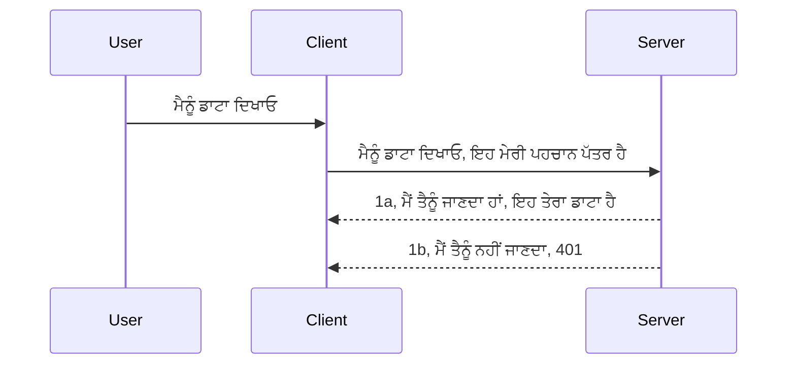

# Simple auth

MCP SDKs OAuth 2.1 ਦੀ ਵਰਤੋਂ ਦਾ ਸਮਰਥਨ ਕਰਦੇ ਹਨ ਜੋ ਕਿ ਇਕ ਕਾਫੀ ਜਟਿਲ ਪ੍ਰਕਿਰਿਆ ਹੈ ਜਿਸ ਵਿੱਚ auth ਸਰਵਰ, resource ਸਰਵਰ, credentials ਪੋਸਟ ਕਰਨਾ, ਕੋਡ ਪ੍ਰਾਪਤ ਕਰਨਾ, ਤੇ ਕੋਡ ਨੂੰ bearer ਟੋਕਨ ਵਾਸਤੇ ਬਦਲਣਾ ਸ਼ਾਮਿਲ ਹੈ ਜਦੋਂ ਕਿ ਤੁਸੀਂ ਆਖ਼ਿਰਕਾਰ ਆਪਣਾ resource ਡਾਟਾ ਪ੍ਰਾਪਤ ਕਰ ਸਕਦੇ ਹੋ। ਜੇ ਤੁਸੀਂ OAuth ਦੇ ਆਦਤ ਨਹੀਂ ਹੋ ਜੋ ਲਾਗੂ ਕਰਨ ਲਈ ਇੱਕ ਵਧੀਆ ਚੀਜ਼ ਹੈ, ਤਾਂ ਇਹ ਇਕ ਵਧੀਆ ਵਿਚਾਰ ਹੈ ਕਿ ਤੁਸੀਂ ਕਿਸੇ ਬੁਨਿਆਦੀ ਪੱਧਰ ਦੇ auth ਨਾਲ ਸ਼ੁਰੂ ਕਰੋ ਅਤੇ ਫਿਰ ਵਧੀਆ ਅਤੇ ਵਧੀਆ ਸੁਰੱਖਿਆ ਵੱਲ ਬ ਧੋ। ਇਸੇ ਕਰਕੇ ਇਹ ਅਧਿਆਇ ਮੌਜੂਦ ਹੈ, ਤਾਂ ਜੋ ਤੁਹਾਨੂੰ ਵਧੇਰੇ ਅਡਵਾਂਸ ਆਥ ਵਿੱਚ ਤਿਆਰ ਕੀਤਾ ਜਾ ਸਕੇ।

## Auth, ਅਸੀਂ ਕੀ ਮਤਲਬ ਲੈਂਦੇ ਹਾਂ?

Auth ਦੇ ਲਿਫਾਫੇ ਵਿੱਚ authentication ਅਤੇ authorization ਸ਼ਾਮਿਲ ਹੁੰਦੇ ਹਨ। ਵਿਚਾਰ ਇਹ ਹੈ ਕਿ ਸਾਨੂੰ ਦੋ ਚੀਜ਼ਾਂ ਕਰਣੀਆਂ ਹੋਣਗੀਆਂ:

- **Authentication**, ਜਿਸਦਾ ਪ੍ਰਕਿਰਿਆ ਇਹ ਪਤਾ ਲਗਾਉਣ ਦੀ ਹੁੰਦੀ ਹੈ ਕਿ ਕਿਸੇ ਵਿਅਕਤੀ ਨੂੰ ਸਾਡੀ ਘਰ ਵਿੱਚ ਪਰਵਾਨਗੀ ਦੇਣ ਦੀ ਇਜਾਜ਼ਤ ਹੈ ਜਾਂ ਨਹੀਂ, ਉਹ ਇਥੇ "ਹੈ" ਇਸ ਦਾ ਅਰਥ ਹੈ ਕਿ ਉਹ ਸਾਡਾ resource ਸਰਵਰ ਵਰਤ ਸਕਦਾ ਹੈ ਜਿਥੇ ਸਾਡੇ MCP ਸਰਵਰ ਦੇ ਫੀਚਰ ਹਨ।
- **Authorization**, ਇਸ ਦਾ ਮਤਲਬ ਇਹ ਪਤਾ ਲਗਾਉਣਾ ਹੈ ਕਿ ਕਿਸੇ ਵਰਤੋਂਕਾਰ ਨੂੰ ਉਹ ਸਪੈਸ਼ਲ resource ਜਿਨ੍ਹਾਂ ਲਈ ਉਹ ਮੁੰਗ ਰਹੇ ਹਨ, ਜਿਵੇਂ ਕਿਹੜੇ ਆਰਡਰ ਜਾਂ ਉਤਪਾਦ, ਹੋਣ ਦੀ ਇਜਾਜ਼ਤ ਹੈ ਜਾਂ ਨਹੀਂ, ਜਾਂ ਉਹ ਸਮੱਗਰੀ ਨੂੰ ਕਿਵੇਂ ਪੜ੍ਹ ਸਕਦੇ ਹਨ ਪਰ ਮਿਟਾ ਨਹੀਂ ਸਕਦੇ, ਜਿਵੇਂ ਹੋਰ ਉਦਾਹਰਨ।

## Credentials: ਅਸੀਂ ਸਿਸਟਮ ਨੂੰ ਕਿਵੇਂ ਦੱਸਦੇ ਹਾਂ ਕਿ ਅਸੀਂ ਕੌਣ ਹਾਂ

ਜ਼ਿਆਦਾਤਰ ਵੈੱਬ ਡਿਵੈਲਪਰਜ਼ ਆਪਣੇ ਸਿਰ ਤੇ ਇਹ ਸੋਚਦੇ ਹਨ ਕਿ ਸਰਵਰ ਨੂੰ ਇੱਕ credential ਪ੍ਰਦਾਨ ਕਰਨਾ, ਆਮ ਤੌਰ 'ਤੇ ਇੱਕ ਸੈਕਰੇਟ, ਜੋ ਦੱਸਦਾ ਹੈ ਕਿ ਉਹ ਇੱਥੇ "Authentication" ਲਈ ਆਇਆ ਹੈ ਜਾਂ ਨਹੀਂ, ਦੀ ਜ਼ਰੂਰਤ ਹੈ। ਇਹ credential ਆਮ ਤੌਰ 'ਤੇ username ਅਤੇ password ਦਾ base64 encode ਕੀਤਾ version ਜਾਂ ਇੱਕ API key ਹੁੰਦੀ ਹੈ ਜੋ ਕਿਸੇ ਖ਼ਾਸ ਯੂਜ਼ਰ ਨੂੰ ਪਹਚਾਨਦੀ ਹੈ।

ਇਸਨੂੰ "Authorization" ਨਾਮਕ header ਰਾਹੀਂ ਭੇਜਿਆ ਜਾਂਦਾ ਹੈ:

```json
{ "Authorization": "secret123" }
```
  
ਇਸਨੂੰ ਆਮ ਤੌਰ 'ਤੇ basic authentication ਕਿਹਾ ਜਾਂਦਾ ਹੈ। ਸਮੂਹਿਕ ਪ੍ਰਕਿਰਿਆ ਕਿਸ ਤਰ੍ਹਾਂ ਕੰਮ ਕਰਦੀ ਹੈ ਇਸ ਤਰ੍ਹਾਂ ਹੈ:


ਹੁਣ ਜਦ ਤੁਸੀਂ ਸਮਝ ਲਿਆ ਕਿ ਇਹ ਕਿਵੇਂ ਕੰਮ ਕਰਦਾ ਹੈ, ਤਾਂ ਇਸਨੂੰ ਕਿਵੇਂ ਅਮਲ ਵਿੱਚ ਲਿਆਇਆ ਜਾਵੇ? ਜ਼ਿਆਦਾਤਰ ਵੈੱਬ ਸਰਵਰਾਂ ਕੋਲ middleware ਦਾ ਇੱਕ ਕੰਸੈਪਟ ਹੁੰਦਾ ਹੈ, ਜੋ ਇਕ ਕੋਡ ਦਾ ਹਿੱਸਾ ਹੁੰਦਾ ਹੈ ਜੋ request ਦਾ ਇੱਕ ਹਿੱਸਾ ਹੋ ਕੇ credentials ਨੂੰ ਜਾਂਚ ਸਕਦਾ ਹੈ ਅਤੇ ਜੇ credentials ਸਹੀ ਹਨ ਤਾਂ request ਨੂੰ ਆਗੇ ਬਹਾਦਰ ਦਿੰਦਾ ਹੈ। ਜੇ request ਵਿੱਚ credentials ਸਹੀ ਨਹੀਂ ਹਨ ਤਾਂ ਤੁਸੀਂ auth error ਮਿਲਦੀ ਹੈ। ਆਓ ਵੇਖੀਏ ਇਹ ਕਿਵੇਂ ਲਾਗੂ ਕੀਤੀ ਜਾ ਸਕਦੀ ਹੈ:

**Python**

```python
class AuthMiddleware(BaseHTTPMiddleware):
    async def dispatch(self, request, call_next):

        has_header = request.headers.get("Authorization")
        if not has_header:
            print("-> Missing Authorization header!")
            return Response(status_code=401, content="Unauthorized")

        if not valid_token(has_header):
            print("-> Invalid token!")
            return Response(status_code=403, content="Forbidden")

        print("Valid token, proceeding...")
       
        response = await call_next(request)
        # ਕੋਈ ਵੀ ਗ੍ਰਾਹਕ ਹੇੱਡਰ ਸ਼ਾਮਲ ਕਰੋ ਜਾਂ ਜਵਾਬ ਵਿੱਚ ਕਿਸੇ ਤਰੀਕੇ ਨਾਲ ਤਬਦੀਲੀ ਕਰੋ
        return response


starlette_app.add_middleware(CustomHeaderMiddleware)
```
  
ਸਾਡੇ ਕੋਲ ਹੈ:

- ਇੱਕ middleware ਬਣਾਇਆ ਗਿਆ ਹੈ ਜਿਸਦਾ ਨਾਮ `AuthMiddleware` ਹੈ ਜਿੱਥੇ ਇਸਦਾ `dispatch` ਮੈਥਡ ਵੈੱਬ ਸਰਵਰ ਵੱਲੋਂ invoke ਕੀਤਾ ਜਾਂਦਾ ਹੈ।  
- middleware ਨੂੰ ਵੈੱਬ ਸਰਵਰ ਵਿੱਚ ਸ਼ਾਮਿਲ ਕੀਤਾ ਗਿਆ:

    ```python
    starlette_app.add_middleware(AuthMiddleware)
    ```
  
- ਇੱਕ validation ਲਾਜਿਕ ਲਿਖੀ ਗਿਆ ਜੋ ਜਾਂਚਦਾ ਹੈ ਕਿ Authorization header ਮੌਜੂਦ ਹੈ ਅਤੇ ਭੇਜਿਆ ਗਿਆ secret ਸਹੀ ਹੈ:

    ```python
    has_header = request.headers.get("Authorization")
    if not has_header:
        print("-> Missing Authorization header!")
        return Response(status_code=401, content="Unauthorized")

    if not valid_token(has_header):
        print("-> Invalid token!")
        return Response(status_code=403, content="Forbidden")
    ```
  
ਜੇ secret ਮੌਜੂਦ ਹੈ ਅਤੇ ਸਹੀ ਹੈ ਤਾਂ ਅਸੀਂ `call_next` ਨੂੰ ਕਾਲ ਕਰਕੇ request ਨੂੰ ਆਗੇ ਜਾੜਦੇ ਹਾਂ ਅਤੇ response ਵਾਪਸ ਕਰਦੇ ਹਾਂ।

    ```python
    response = await call_next(request)
    # ਕਿਸੇ ਵੀ ਗ੍ਰਾਹਕ ਹੈਡਰ ਸ਼ਾਮਲ ਕਰੋ ਜਾਂ ਪ੍ਰਤਿਕ੍ਰਿਆ ਵਿੱਚ ਕਿਸੇ ਤਰ੍ਹਾਂ ਬਦਲਾਅ ਕਰੋ
    return response
    ```
  
ਕਿਸ ਤਰ੍ਹਾਂ ਕੰਮ ਕਰਦਾ ਹੈ ਕਿ ਜੇ ਵੈੱਬ request ਸਰਵਰ ਵੱਲ ਕੀਤੀ ਜਾਂਦੀ ਹੈ ਤਾਂ middleware invoke ਹੋ ਜਾਵੇਗਾ ਅਤੇ ਉਸਦੀ ਲਾਗੂਆਮਲ ਦੇ ਮੂਤਾਬਕ ਉਹ ਜਾਂ ਤਾਂ request ਨੂੰ ਆਗੇ ਜਾਣ ਦੇਵੇਗਾ ਜਾਂ ਐਸਾ error ਵਾਪਸ ਕਰੇਗਾ ਜੋ ਦੱਸਦਾ ਹੈ ਕਿ ਕਲਾਇੰਟ ਨੂੰ ਅੱਗੇ ਵਧਣ ਦੀ ਇਜਾਜ਼ਤ ਨਹੀਂ।

**TypeScript**

ਅਸੀਂ ਇੱਥੇ ਪ੍ਰਸਿੱਧ framework Express ਵਰਤ ਕੇ middleware ਬਣਾਉਂਦੇ ਹਾਂ ਤੇ MCP ਸਰਵਰ ਤੱਕ ਆਉਣ ਵਾਲੀ request ਨੂੰ ਰੋਕਦੇ ਹਾਂ। ਇੱਥੇ ਕੋਡ ਹੈ:

```typescript
function isValid(secret) {
    return secret === "secret123";
}

app.use((req, res, next) => {
    // 1. ਆਥਰਾਈਜੇਸ਼ਨ ਹੈਡਰ ਮੌਜੂਦ ਹੈ?
    if(!req.headers["Authorization"]) {
        res.status(401).send('Unauthorized');
    }
    
    let token = req.headers["Authorization"];

    // 2. ਵੈਧਤਾ ਦੀ ਜਾਂਚ ਕਰੋ।
    if(!isValid(token)) {
        res.status(403).send('Forbidden');
    }

   
    console.log('Middleware executed');
    // 3. ਅਗਲੇ ਕਦਮ ਨੂੰ ਬੇਨਤੀ ਨੂੰ ਪਾਸ ਕਰਦਾ ਹੈ।
    next();
});
```
  
ਇਸ ਕੋਡ ਵਿੱਚ ਅਸੀਂ:

1. ਜਾਂਚ ਕਰਦੇ ਹਾਂ ਕਿ Authorization header ਮੌਜੂਦ ਹੈ ਜਾਂ ਨਹੀਂ, ਜੇ ਨਹੀਂ ਤਾਂ 401 error ਭੇਜਦੇ ਹਾਂ।  
2. credential/token ਦੀ ਜਾਂਚ ਕਰਦੇ ਹਾਂ ਕਿ ਪੂਰੀ ਤਰ੍ਹਾਂ ਸਹੀ ਹੈ ਜਾਂ ਨਹੀਂ, ਜੇ ਨਹੀਂ ਤਾਂ 403 error ਭੇਜਦੇ ਹਾਂ।  
3. ਆਖ਼ਿਰਕਾਰ request ਨੂੰ request pipeline ਵਿੱਚ ਅਗੇ ਵਧਾਉਂਦੇ ਹਾਂ ਅਤੇ ਮੰਗੇ ਗਏ resource ਨੂੰ ਰਿਟਰਨ ਕਰਦੇ ਹਾਂ।

## Exercise: Authentication ਅਮਲ ਵਿੱਚ ਲਿਆਉਣਾ

ਆਓ ਆਪਣੀ ਜਾਣਕਾਰੀ ਲਈ ਕੋਸ਼ਿਸ਼ ਕਰੀਏ। ਇਹ ਯੋਜਨਾ ਹੈ:

ਸਰਵਰ

- ਇੱਕ ਵੈੱਬ ਸਰਵਰ ਅਤੇ MCP ਇੰਸਟੈਂਸ ਬਣਾਓ।  
- ਸਰਵਰ ਲਈ middleware ਲਾਗੂ ਕਰੋ।

ਕਲਾਇੰਟ

- ਵਰਦੇ premium ਹੇਠਾਂ header ਰਾਹੀਂ request ਭੇਜੋ।  

### -1- ਵੈੱਬ ਸਰਵਰ ਅਤੇ MCP ਇੰਸਟੈਂਸ ਬਣਾਓ

ਸਾਡੇ ਪਹਿਲੇ ਕਦਮ ਵਿੱਚ, ਸਾਨੂੰ ਵੈੱਬ ਸਰਵਰ ਇੰਸਟੈਂਸ ਅਤੇ MCP ਸਰਵਰ ਬਣਾਉਣਾ ਹੈ।

**Python**

ਅਸੀਂ ਇੱਥੇ MCP ਸਰਵਰ ਦਾ ਇੰਸਟੈਂਸ ਬਣਾਉਂਦੇ ਹਾਂ, starlette ਵੈੱਬ ਐਪ ਬਣਾਉਂਦੇ ਹਾਂ ਅਤੇ ਉਸਨੂੰ uvicorn ਨਾਲ host ਕਰਦੇ ਹਾਂ।

```python
# MCP ਸਰਵਰ ਬਣਾ ਰਿਹਾ ਹੈ

app = FastMCP(
    name="MCP Resource Server",
    instructions="Resource Server that validates tokens via Authorization Server introspection",
    host=settings["host"],
    port=settings["port"],
    debug=True
)

# starlette ਵੈੱਬ ਐਪ ਬਣਾਈ ਜਾ ਰਹੀ ਹੈ
starlette_app = app.streamable_http_app()

# uvicorn ਰਾਹੀਂ ਐਪ ਸਰਵ ਕਰ ਰਿਹਾ ਹੈ
async def run(starlette_app):
    import uvicorn
    config = uvicorn.Config(
            starlette_app,
            host=app.settings.host,
            port=app.settings.port,
            log_level=app.settings.log_level.lower(),
        )
    server = uvicorn.Server(config)
    await server.serve()

run(starlette_app)
```
  
ਇਸ ਕੋਡ ਵਿੱਚ ਅਸੀਂ:

- MCP ਸਰਵਰ ਬਣਾਇਆ।  
- MCP ਸਰਵਰ ਤੋ starlette ਵੈੱਬ ਐਪ ਬਣਾਇਆ, `app.streamable_http_app()`।  
- uvicorn ਨਾਲ ਵੈੱਬ ਐਪ ਨੂੰ host ਅਤੇ serve ਕੀਤਾ `server.serve()`।

**TypeScript**

ਅਸੀਂ ਇੱਥੇ MCP ਸਰਵਰ ਇੰਸਟੈਂਸ ਬਣਾਉਂਦੇ ਹਾਂ।

```typescript
const server = new McpServer({
      name: "example-server",
      version: "1.0.0"
    });

    // ... ਸਰਵਰ ਸਰੋਤ, ਸੰਦ ਅਤੇ ਪ੍ਰੋਂਪਟ ਸੈੱਟ ਕਰੋ ...
```
  
ਇਹ MCP ਸਰਵਰ ਬਣਾਉਣਾ ਸਾਡੇ POST /mcp ਰੂਟ ਡਿਫਨੀਸ਼ਨ ਵਿੱਚ ਹੋਣਾ ਚਾਹੀਦਾ ਹੈ, ਇਸ ਲਈ ਆਉਂਦੇ ਹਾਂ ਇਸ ਕੋਡ ਨੂੰ ਇਸ ਤਰ੍ਹਾਂ ਲਿਆਂਦੇ ਹਾਂ:

```typescript
import express from "express";
import { randomUUID } from "node:crypto";
import { McpServer } from "@modelcontextprotocol/sdk/server/mcp.js";
import { StreamableHTTPServerTransport } from "@modelcontextprotocol/sdk/server/streamableHttp.js";
import { isInitializeRequest } from "@modelcontextprotocol/sdk/types.js"

const app = express();
app.use(express.json());

// ਸੈਸ਼ਨ ID ਦੁਆਰਾ ਟ੍ਰਾਂਸਪੋਰਟ ਸਟੋਰ ਕਰਨ ਲਈ ਨਕਸ਼ਾ
const transports: { [sessionId: string]: StreamableHTTPServerTransport } = {};

// ਕਲਾਇੰਟ-ਤੋਂ-ਸਰਵਰ ਸੰਚਾਰ ਲਈ POST ਬੇਨਤੀ ਸੰਭਾਲੋ
app.post('/mcp', async (req, res) => {
  // ਮੌਜੂਦਾ ਸੈਸ਼ਨ ID ਦੀ ਜਾਂਚ ਕਰੋ
  const sessionId = req.headers['mcp-session-id'] as string | undefined;
  let transport: StreamableHTTPServerTransport;

  if (sessionId && transports[sessionId]) {
    // ਮੌਜੂਦਾ ਟ੍ਰਾਂਸਪੋਰਟ ਨੂੰ ਦੁਬਾਰਾ ਵਰਤੋਂ
    transport = transports[sessionId];
  } else if (!sessionId && isInitializeRequest(req.body)) {
    // ਨਵੀਂ ਸ਼ੁਰੂਆਤੀ ਬੇਨਤੀ
    transport = new StreamableHTTPServerTransport({
      sessionIdGenerator: () => randomUUID(),
      onsessioninitialized: (sessionId) => {
        // ਸੈਸ਼ਨ ID ਦੁਆਰਾ ਟ੍ਰਾਂਸਪੋਰਟ ਸਟੋਰ ਕਰੋ
        transports[sessionId] = transport;
      },
      // DNS ਰੀਬਾਈਂਡਿੰਗ ਸੁਰੱਖਿਆ ਡਿਫਾਲਟ ਦੌਰ 'ਤੇ ਪਿਛਲੇ ਸਮਰੱਥਾ ਲਈ ਬੰਦ ਹੈ। ਜੇ ਤੁਸੀਂ ਇਸ ਸਰਵਰ ਨੂੰ
      // ਸਥਾਨਕ ਤੌਰ 'ਤੇ ਚਲਾ ਰਹੇ ਹੋ, ਤਾਂ ਇਹ ਸੈੱਟ ਕਰਨ ਦੀ ਯਕੀਨ ਦਿਵਾਓ:
      // enableDnsRebindingProtection: true,
      // allowedHosts: ['127.0.0.1'],
    });

    // ਬੰਦ ਹੋਣ 'ਤੇ ਟ੍ਰਾਂਸਪੋਰਟ ਸਾਫ ਕਰੋ
    transport.onclose = () => {
      if (transport.sessionId) {
        delete transports[transport.sessionId];
      }
    };
    const server = new McpServer({
      name: "example-server",
      version: "1.0.0"
    });

    // ... ਸਰਵਰ ਸਰੋਤ, ਟੂਲ ਅਤੇ ਪ੍ਰੰਪਟ ਸੈੱਟ ਕਰੋ ...

    // MCP ਸਰਵਰ ਨਾਲ ਜੁੜੋ
    await server.connect(transport);
  } else {
    // ਅਮਾਨਯ ਬੇਨਤੀ
    res.status(400).json({
      jsonrpc: '2.0',
      error: {
        code: -32000,
        message: 'Bad Request: No valid session ID provided',
      },
      id: null,
    });
    return;
  }

  // ਬੇਨਤੀ ਨੂੰ ਸੰਭਾਲੋ
  await transport.handleRequest(req, res, req.body);
});

// GET ਅਤੇ DELETE ਬੇਨਤੀਆਂ ਲਈ ਦੁਹਰਾਏ ਜਾ ਸਕਦੇ ਹੈਂਡਲਰ
const handleSessionRequest = async (req: express.Request, res: express.Response) => {
  const sessionId = req.headers['mcp-session-id'] as string | undefined;
  if (!sessionId || !transports[sessionId]) {
    res.status(400).send('Invalid or missing session ID');
    return;
  }
  
  const transport = transports[sessionId];
  await transport.handleRequest(req, res);
};

// SSE ਰਾਹੀਂ ਸਰਵਰ-ਤੋਂ-ਕਲਾਇੰਟ ਨੋਟੀਫਿਕੇਸ਼ਨ ਲਈ GET ਬੇਨਤੀ ਸੰਭਾਲੋ
app.get('/mcp', handleSessionRequest);

// ਸੈਸ਼ਨ ਖ਼ਤਮ ਕਰਨ ਲਈ DELETE ਬੇਨਤੀ ਸੰਭਾਲੋ
app.delete('/mcp', handleSessionRequest);

app.listen(3000);
```
  
ਹੁਣ ਤੂੰ ਵੇਖ ਸਕਦਾ ਹੈ ਕਿ MCP ਸਰਵਰ ਬਣਾਉਣਾ `app.post("/mcp")` ਦੇ ਅੰਦਰ ਲਿਆ ਗਿਆ ਹੈ।

ਹੁਣ middleware ਬਣਾਉਣ ਦੇ ਅਗਲੇ ਕਦਮ ਵੱਲ ਚਲਦਾ ਹਾਂ ਤਾਂ ਜੋ ਅਸੀਂ ਆਉਣ ਵਾਲੇ credentials ਨੂੰ ਵੈਰੀਫਾਈ ਕਰ ਸਕੀਏ।  

### -2- ਸਰਵਰ ਲਈ middleware ਲਾਗੂ ਕਰੋ

ਹੁਣ middleware ਵਿਚਾਰ ਵਿੱਚ ਚੱਲੀਏ। ਇੱਥੇ ਅਸੀਂ ਇੱਕ middleware ਬਣਾਵਾਂਗੇ ਜੋ `Authorization` header ਵਿੱਚ credential ਤਲਾਸ਼ੇਗਾ ਅਤੇ ਉਸਦੀ ਜਾਂਚ ਕਰੇਗਾ। ਜੇ ਮਨਜ਼ੂਰਯੋਗ ਹੈ ਤਾਂ request ਅੱਗੇ ਜਾਵੇਗੀ ਜਿਵੇਂ ਕਿ ਟੂਲਾਂ ਦੀ ਲਿਸਟ, ਕਿਸੇ resource ਦੌੜਾਨਾ ਜਾਂ ਕੁਝ MCP ਫੰਕਸ਼ਨਲਿਟੀ ਜਿਵੇਂ ਕਲਾਇੰਟ ਮੰਗ ਰਿਹਾ ਸੀ।

**Python**

middleware ਬਣਾਉਣ ਲਈ ਸਾਨੂੰ `BaseHTTPMiddleware` ਤੋਂ ਵਾਰਸਾ ਲੈਣ ਵਾਲੀ ਅਦਕਲਾਸ ਬਣਾਉਣੀ ਪਵੇਗੀ। ਦੋ ਸੁਆਦਿਲ ਅੰਸਰ ਹਨ:

- `request` ਜੋ ਸਾਡੇ ਕੋਲ header ਜਾਣਕਾਰੀ ਲਈ ਹੈ।  
- `call_next` ਜੋ callback ਹੈ ਜਿਸਨੂੰ ਅਸੀਂ invoke ਕਰਦੇ ਹਾਂ ਜੇ ਕਲਾਇੰਟ ਵੱਲੋਂ ਲਿਆ ਗਿਆ credential ਸਹੀ ਹੈ।

ਪਹਿਲਾਂ ਅਸੀਂ ਜਾਂਚ ਕਰੀਏ ਕਿ `Authorization` header ਮੌਜੂਦ ਹੈ ਜਾਂ ਨਹੀਂ:

```python
has_header = request.headers.get("Authorization")

# ਕੋਈ ਹੈਡਰ ਮੌਜੂਦ ਨਹੀਂ, 401 ਨਾਲ ਅਸਫਲ, ਨਹੀਂ ਤਾਂ ਅੱਗੇ ਵਧੋ।
if not has_header:
    print("-> Missing Authorization header!")
    return Response(status_code=401, content="Unauthorized")
```
  
ਇੱਥੇ ਅਸੀਂ 401 unauthorized ਸੁਨੇਹਾ ਭੇਜਦੇ ਹਾਂ ਕਿਉਂਕਿ ਕਲਾਇੰਟ failed authentication ਦੇ ਵਿੱਚ ਹੈ।

ਅੱਗੇ, ਜੇ credential ਦਿੱਤਾ ਗਿਆ ਸੀ ਤਾਂ ਅਸੀਂ ਉਸਦੀ ਸਹੀਤਾ ਵੇਖੀਏ:

```python
 if not valid_token(has_header):
    print("-> Invalid token!")
    return Response(status_code=403, content="Forbidden")
```
  
ਉੱਪਰ ਅਸੀਂ 403 forbidden ਸੁਨੇਹਾ ਭੇਜਿਆ ਹੈ। ਪੂਰਾ middleware ਇਹ ਰਹੀ ਹੈ ਜੋ ਸਾਰੇ ਕਮੈਂਟ ਲਾਗੂ ਕਰਦਾ ਹੈ:

```python
class AuthMiddleware(BaseHTTPMiddleware):
    async def dispatch(self, request, call_next):

        has_header = request.headers.get("Authorization")
        if not has_header:
            print("-> Missing Authorization header!")
            return Response(status_code=401, content="Unauthorized")

        if not valid_token(has_header):
            print("-> Invalid token!")
            return Response(status_code=403, content="Forbidden")

        print("Valid token, proceeding...")
        print(f"-> Received {request.method} {request.url}")
        response = await call_next(request)
        response.headers['Custom'] = 'Example'
        return response

```
  
ਵਧੀਆ ਹੈ, ਪਰ `valid_token` ਫੰਕਸ਼ਨ ਕਿਸ ਤਰ੍ਹਾਂ ਹੈ? ਇਹ ਹੈ:

```python
# ਉਤਪਾਦਨ ਲਈ ਇਸਦਾ ਇਸਤੇਮਾਲ ਨਾ ਕਰੋ - ਇਸਨੂੰ ਸੁਧਾਰੋ !!
def valid_token(token: str) -> bool:
    # "Bearer " ਪ੍ਰਿਫਿਕਸ ਨੂੰ ਹਟਾਓ
    if token.startswith("Bearer "):
        token = token[7:]
        return token == "secret-token"
    return False
```
  
ਇਹ ਸੁਧਾਰ ਲੜੀ ਦੇ ਲਾਇਕ ਹੋਣਾ ਚਾਹੀਦਾ ਹੈ।  

IMPORTANT: ਤੁਹਾਡੇ ਕੋਡ ਵਿੱਚ ਅਜਿਹੇ secrets ਕਦੇ ਵੀ ਨਹੀਂ ਹੋਣੇ ਚਾਹੀਦੇ। ਇਹਦਾ ਮੂੱਲ ਸਹੀ ਤਰ੍ਹਾਂ ਕਿਸੇ ਡਾਟਾ ਸਰੋਤ ਜਾਂ IDP (ਇਡੈਂਟੀਟੀ ਸਰਵਿਸ ਪ੍ਰਦਾਤਾ) ਤੋਂ ਲੈਣਾ ਚਾਹੀਦਾ ਹੈ ਜਾਂ ਵਧੀਆ ਹੋਵੇ ਤਾਂ IDP ਹੀ validation ਕਰੇ।  

**TypeScript**

Express ਨਾਲ ਇਹ ਅਮਲ ਕਰਨ ਲਈ ਸਾਨੂੰ `use` ਮੈਥਡ ਕਾਲ ਕਰਨੀ ਪੈਂਦੀ ਹੈ ਜੋ middleware functions ਲੈਂਦੀ ਹੈ।

ਸਾਨੂੰ:

- request variable ਨਾਲ ਸੰਚਾਰ ਕਰਕੇ Authorization ਪ੍ਰਾਪਰਟੀ ਵਿੱਚ ਦਿੱਤਾ credential ਵੇਖਣਾ ਹੈ।  
- credential ਦੀ ਜਾਂਚ ਕਰਨੀ ਹੈ ਅਤੇ ਜੇ ਸਹੀ ਹੈ ਤਾਂ request ਚਲਾਉਣਾ ਹੈ ਅਤੇ MCP ਰੀਕਵੇਸਟ ਸਹੀ ਤਰ੍ਹਾਂ ਚੱਲੀ ਜਾਏ (ਟੂਲਾਂ ਦੀ ਲਿਸਟ, resource ਪੜ੍ਹਨਾ ਜਾਂ ਕਿਸੇ ਹੋਰ MCP ਸੰਬੰਧੀ ਕੰਮ)।

ਅਸੀਂ ਵੇਖ ਰਹੇ ਹਾਂ ਕਿ Authorization header ਮੌਜੂਦ ਹੈ ਜਾਂ ਨਹੀਂ ਅਤੇ ਜੇ ਨਹੀਂ ਤਾਂ request ਨੂੰ ਅੱਗੇ ਜਾਣ ਤੋਂ ਰੋਕੇ:

```typescript
if(!req.headers["authorization"]) {
    res.status(401).send('Unauthorized');
    return;
}
```
  
ਜੇ header ਪਹਿਲਾਂ ਭੇਜਿਆ ਨਹੀਂ ਗਿਆ, ਤਾਂ 401 ਮਿਲਦਾ ਹੈ।

ਅੱਗੇ, ਅਸੀਂ credential ਦੀ ਸਹੀਤਾ ਜਾਂਚ ਕਰਦੇ ਹਾਂ ਜੇ ਸਹੀ ਨਹੀਂ ਹੈ ਤਾਂ ਮੁੜ request ਰੋਕੇ ਪਰ ਵੱਖਰੇ ਸੁਨੇਹੇ ਨਾਲ:

```typescript
if(!isValid(token)) {
    res.status(403).send('Forbidden');
    return;
} 
```
  
ਹੁਣ 403 error ਮਿਲਦਾ ਹੈ।

ਇੱਥੇ ਪੂਰਾ ਕੋਡ:

```typescript
app.use((req, res, next) => {
    console.log('Request received:', req.method, req.url, req.headers);
    console.log('Headers:', req.headers["authorization"]);
    if(!req.headers["authorization"]) {
        res.status(401).send('Unauthorized');
        return;
    }
    
    let token = req.headers["authorization"];

    if(!isValid(token)) {
        res.status(403).send('Forbidden');
        return;
    }  

    console.log('Middleware executed');
    next();
});
```
  
ਅਸੀਂ ਵੈੱਬ ਸਰਵਰ ਨੂੰ middleware ਲਈ ਸੈੱਟ ਕੀਤਾ ਹੈ ਜੋ ਕਲਾਇੰਟ ਵੱਲੋਂ ਭੇਜੇ credential ਨੂੰ ਜਾਂਚਦਾ ਹੈ। ਕਲਾਇੰਟ ਦੇ ਬਾਰੇ ਕੀ?

### -3- ਸੀ Headers ਰਾਹੀਂ credential ਅਤੇ request ਭੇਜੋ

ਅਸੀਂ ਯਕੀਨੀ ਬਣਾਉਣਾ ਹੈ ਕਿ ਕਲਾਇੰਟ header ਰਾਹੀਂ credential ਭੇਜ ਰਿਹਾ ਹੈ। ਕਿਉਂਕਿ ਅਸੀਂ MCP ਕਲਾਇੰਟ ਵਰਤਾਂਗੇ ਇਸ ਲਈ ਦੇਖੀਏ ਇਹ ਕਿਵੇਂ ਕੀਤਾ ਜਾਂਦਾ ਹੈ।

**Python**

ਕਲਾਇੰਟ ਲਈ ਅਸੀਂ header ਵਿੱਚ credential ਇਸ ਤਰ੍ਹਾਂ ਭੇਜਦੇ ਹਾਂ:

```python
# ਮੁੱਲ ਨੂੰ ਸਖਤੀ ਨਾਲ ਕੋਡ ਵਿੱਚ ਨਾ ਲਿਖੋ, ਇਸ ਨੂੰ ਘੱਟੋ ਘੱਟ ਕਿਸੇ ਐਨਵਾਇਰਨਮੈਂਟ ਵੈਰੀਏਬਲ ਜਾਂ ਹੋਰ ਸੁਰੱਖਿਅਤ ਸਟੋਰੇਜ ਵਿੱਚ ਰੱਖੋ
token = "secret-token"

async with streamablehttp_client(
        url = f"http://localhost:{port}/mcp",
        headers = {"Authorization": f"Bearer {token}"}
    ) as (
        read_stream,
        write_stream,
        session_callback,
    ):
        async with ClientSession(
            read_stream,
            write_stream
        ) as session:
            await session.initialize()
      
            # TODO, ਤੁਸੀਂ ਕਲਾਇੱਟ ਵਿੱਚ ਕੀ ਕਰਵਾਉਣਾ ਚਾਹੁੰਦੇ ਹੋ, ਜਿਵੇਂ ਕਿ ਟੂਲਜ਼ ਦੀ ਸੂਚੀ ਬਣਾਉਣਾ, ਟੂਲਜ਼ ਨੂੰ ਕਾਲ ਕਰਨਾ ਆਦਿ।
```
  
ਤੁਸੀਂ ਦੇਖ ਸਕਦੇ ਹੋ ਕਿ ਕਿਵੇਂ headers ਪ੍ਰਾਪਰਟੀ ਭਰੀ ਜਾਂਦੀ ਹੈ ` headers = {"Authorization": f"Bearer {token}"}`।

**TypeScript**

ਇਹ ਦੋ ਕਦਮਾਂ ਵਿੱਚ ਕੀਤਾ ਜਾ ਸਕਦਾ ਹੈ:

1. config object ਵਿੱਚ credential ਪਾਓ।  
2. transport ਨੂੰ config object ਦਿਓ।

```typescript

// ਇਥੇ ਦਿਖਾਈ ਦੇ ਰਹੀ ਮੁੱਲ ਨੂੰ ਸਖਤੀ ਨਾਲ ਕੋਡ ਵਿੱਚ ਨਾ ਲਿਖੋ। ਘੱਟੋ ਘੱਟ ਇਸਨੂੰ ਇੱਕ ਇਨਵਾਇਰਨਮੈਂਟ ਵੈਰੀਏਬਲ ਵਜੋਂ ਰੱਖੋ ਅਤੇ ਕੁਝ dotenv ਵਰਗਾ ਕੁਝ ਵਰਤੋ (ਡਿਵ ਮੋਡ ਵਿੱਚ)।
let token = "secret123"

// ਇੱਕ ਕਲਾਇੰਟ ਟਰਾਂਸਪੋਰਟ ਵਿਕਲਪ ਑ਬਜੈਕਟ ਨੂੰ ਪਰਿਭਾਸ਼ਿਤ ਕਰੋ
let options: StreamableHTTPClientTransportOptions = {
  sessionId: sessionId,
  requestInit: {
    headers: {
      "Authorization": "secret123"
    }
  }
};

// ਟਰਾਂਸਪੋਰਟ ਨੂੰ ਑ਪਸ਼ਨ ਑ਬਜੈਕਟ ਪਾਸ ਕਰੋ
async function main() {
   const transport = new StreamableHTTPClientTransport(
      new URL(serverUrl),
      options
   );
```
  
ਇੱਥੇ ਤੁਸੀਂ ਦੇਖਦੇ ਹੋ ਕਿ ਕਿਵੇਂ ਅਸੀਂ `options` ਬਣਾਈ ਹੈ ਅਤੇ headers `requestInit` ਪ੍ਰਾਪਰਟੀ ਦੇ ਤਹਿਤ ਰੱਖਿਆ ਹੈ।

IMPORTANT: ਇਹਨੂੰ ਸੁਧਾਰਨ ਲਈ ਕੀ ਕਰਨਾ ਚਾਹੀਦਾ? ਇਸ implementation ਵਿੱਚ ਕੁਝ ਸਮੱਸਿਆਵਾਂ ਹਨ। ਸਭ ਤੋਂ ਪਹਿਲਾਂ, ਇਹ credential ਭੇਜਣਾ ਕਾਫੀ ਖਤਰਨਾਕ ਹੈ ਜੇ ਤੁਸੀਂ ਘੱਟ ਤੋਂ ਘੱਟ HTTPS ਨਹੀਂ ਵਰਤ ਰਹੇ। ਫਿਰ ਭੀ credential ਚੋਰੀ ਹੋ ਸਕਦਾ ਹੈ, ਇਸ ਲਈ ਤੁਸੀਂ ਐਸਾ ਪ੍ਰਣਾਲੀ ਬਣਾਨਾ ਚਾਹੀਦਾ ਹੈ ਜਿੱਥੇ token ਨੂੰ ਆਸਾਨੀ ਨਾਲ ਰੱਦ ਕੀਤਾ ਜਾ ਸਕੇ ਅਤੇ ਹੋਰ ਡਿੱਗ੍ਰੀਆਂ ਵੇਖਣ ਲਈ ਕਿ ਇਹ ਕਿੱਥੋਂ ਆ ਰਿਹਾ ਹੈ ਵਗੈਰਾ। ਕੁੱਲ ਮਿਲਾ ਕੇ ਕਈ ਗੱਲਾਂ ਹਨ।  

ਫਿਰ ਵੀ ਇਹ ਕਿਹਾ ਜਾ ਸਕਦਾ ਹੈ ਕਿ ਬਹੁਤ ਹੀ ਸਧਾਰਨ APIs ਲਈ ਜਿੱਥੇ ਤੁਸੀਂ ਨਹੀਂ ਚਾਹੁੰਦੇ ਕਿ ਕਿਸੇ ਨੂੰ ਤੁਸੀਂ ਵੱਡਾ calls ਕੀਤੇ ਬਿਨਾ authenticate ਕੀਤੇ ਬਿਨਾ ਕਰਦਾ ਹੈ, ਇਹ ਇੱਕ ਵਧੀਆ ਸ਼ੁਰੂਆਤ ਹੈ।

ਇਸ ਸਾਰਿਆਂ ਦੇ ਨਾਲ, ਆਓ JSON Web Token ਵਰਗੇ ਇੱਕ ਮਿਆਰੀਕ੍ਰਿਤ ਫਾਰਮੈਟ ਵਰਤ ਕੇ ਸੁਰੱਖਿਆ ਨੂੰ ਕਿਡਣੀ ਦਰਜੀ ਯਥਾਰਥ ਕਰੋ।

## JSON Web Tokens, JWT

ਤਾਂ, ਅਸੀਂ ਬਹੁਤ ਸਧਾਰਨ credentials ਭੇਜਣ ਤੋਂ ਕੰਮ ਸੁਧਾਰਨ ਦਾ ਯਤਨ ਕਰ ਰਹੇ ਹਾਂ। JWT ਸਵੀਕਾਰਨ ਨਾਲ ਤੁਰੰਤ ਸੁਧਾਰ ਕੀ ਹਨ?

- **ਸੁਰੱਖਿਆ ਵਿੱਚ ਸੁਧਾਰ**। basic auth ਵਿੱਚ, ਤੁਸੀਂ username ਅਤੇ password ਨੂੰ base64 encode ਕਰਕੇ (ਜਾਂ API key) ਵਾਰ ਵਾਰ ਭੇਜਦੇ ਹੋ ਜੋ ਖਤਰੇ ਨੂੰ ਵਧਾਉਂਦਾ ਹੈ। JWT ਵਿੱਚ, ਤੁਸੀਂ username ਅਤੇ password ਭੇਜਦੇ ਹੋ ਅਤੇ token ਪ੍ਰਾਪਤ ਕਰਦੇ ਹੋ ਜੋ ਕਿ ਸਮੇਂ-ਅਧਾਰਤ ਹੁੰਦਾ ਹੈ ਜਿੰਨਾ ਕਿ ਇਸਦੀ ਮਿਆਦ ਖ਼ਤਮ ਹੋਣ ਵਾਲੀ ਹੁੰਦੀ ਹੈ। JWT, roles, scopes ਅਤੇ permissions ਵਰਗੇ ਬਰੀਕੀ-ਵਾਲੇ access control ਲਈ ਆਸਾਨੀ ਦਿੰਦਾ ਹੈ।  
- **Statelessness ਅਤੇ scalability**। JWT self-contained ਹੁੰਦੇ ਹਨ, ਉਹ ਸਾਰਾ user info ਆਪਣੇ ਵਿੱਚ ਰੱਖਦੇ ਹਨ ਅਤੇ ਸਰਵਰ-ਪਾਸੇ ਸੈਸ਼ਨ ਸਟੋਰੇਜ਼ ਦੀ ਲੋੜ ਨਹੀਂ ਰਹਿੰਦੀ। ਟੋਕਨ ਨੂੰ ਲੋਕਲੀ ਵੈਰੀਫਾਈ ਵੀ ਕੀਤਾ ਜਾ ਸਕਦਾ ਹੈ।  
- **Interoperability ਅਤੇ federation**। JWT Open ID Connect ਦਾ ਕੇਂਦਰ ਹੈ ਅਤੇ ਜੰਨੀ ਮਾਨਤਾ ਪ੍ਰਦਾਤਾ ਵਰਗੇ Entra ID, Google Identity ਅਤੇ Auth0 ਨਾਲ ਵਰਤਿਆ ਜਾਂਦਾ ਹੈ। ਇਹ ਇੱਕਲਾਪ ਸਾਈਨ-ਆਨ ਅਤੇ ਹੋਰ ਕਈ ਫੀਚਰ ਬਣਾਉ ਖਾਸ ਕਰਦਾ ਹੈ, ਜੋ ਇਸਨੂੰ ਏਂਟਰਪ੍ਰਾਈਜ਼ ਗ੍ਰੇਡ ਬਣਾਉਂਦਾ ਹੈ।  
- **Modularity ਅਤੇ flexibility**। JWT API Gateways ਜਿਵੇਂ Azure API Management, NGINX ਆਦਿ ਨਾਲ ਵੀ ਵਰਤੇ ਜਾ ਸਕਦੇ ਹਨ। ਇਹ authentication ਸਿਨਾਰਿਓ ਅਤੇ ਸਰਵਰ-ਟੂ-ਸਰਵਰ ਕਮਿਊਨੀਕੇਸ਼ਨ (ਜਿਵੇਂ impersonation ਅਤੇ delegation ਸਥਿਤੀਆਂ) ਨੂੰ ਸਮਰਥਨ ਕਰਦੇ ਹਨ।  
- **Performance ਅਤੇ caching**। JWT ਨੂੰ decode ਕਰਨ ਦੇ ਬਾਅਦ ਕੈਸ਼ ਕੀਤਾ ਜਾ ਸਕਦਾ ਹੈ, ਜਿਸ ਨਾਲ parsing ਦੀ ਲੋੜ ਘੱਟ ਹੁੰਦੀ ਹੈ। ਇਹ ਖਾਸ ਤੌਰ 'ਤੇ ਵੱਡੇ ਟ੍ਰੈਫਿਕ ਵਾਲੀਆਂ ਐਪਲੀਕੇਸ਼ਨਾਂ ਵਿੱਚ throughput ਨੂ ਵਧਾਉਂਦਾ ਹੈ ਅਤੇ infrastructure 'ਤੇ ਲੋਡ ਨੂੰ ਘਟਾਉਂਦਾ ਹੈ।  
- **Advanced ਫੀਚਰ**। ਇਹ introspection (server ਤੇ validity ਚੈੱਕ ਕਰਨਾ) ਅਤੇ revocation (token ਨੂੰ ਅਵੈਧ ਬਣਾਉਣਾ) ਦਾ ਵੀ ਸਮਰਥਨ ਕਰਦਾ ਹੈ।

ਇਹ ਸਾਰੇ ਫਾਇਦੇ ਨਾਲ, ਆਓ ਵੇਖੀਏ ਕਿ ਅਸੀਂ ਆਪਣੀ ਲਾਗੂਆਮਲ ਨੂੰ ਕਿਵੇਂ ਅਗਲੇ ਪੱਧਰ ਤੇ ਲਿਆ ਸਕਦੇ ਹਾਂ।

## Basic auth ਨੂੰ JWT ਵਿੱਚ ਬਦਲਣਾ

ਤਾਂ, ਉੱਚ-ਸਤਹ ਤੇ ਜਿਨ੍ਹਾਂ ਤਬਦੀਲੀਆਂ ਕਰਨੀਆਂ ਹਨ ਉਹ ਹਨ:

- **JWT token ਬਣਾਉਣਾ** ਅਤੇ ਇਹ client ਤੋਂ server ਨੂੰ ਭੇਜਣ ਲਈ ਤਿਆਰ ਕਰਨਾ।  
- **JWT token ਨੂੰ ਵੈਰੀਫਾਈ ਕਰਨਾ**, ਜੇ ਉਹ ਸਹੀ ਹੋਵੇ ਤਾਂ client ਨੂੰ access ਦੇਣਾ।  
- **ਟੋਕਨ ਸੁਰੱਖਿਆ ਵਾਲੀ ਸਟੋਰੇਜ਼**। ਇਹ टोكن ਕਿਵੇਂ ਸਟੋਰ ਕਰਦੇ ਹਾਂ।  
- **ਰਸਤੇ ਸੁਰੱਖਿਆ**। ਸਾਡੇ ਕੇਸ ਵਿੱਚ ਸਾਡੇ MCP ਫੀਚਰਾਂ ਅਤੇ ਰਸਤੇ ਸੁਰੱਖਿਅਤ ਕਰਨੇ ਹਨ।  
- **refresh tokens ਸ਼ਾਮਿਲ ਕਰਨਾ**। ਇਹ ਸਿਰਫ ਟੋਕਨ ਛੋਟੀ ਮਿਆਦ ਵਾਲੇ ਬਣਾਉਣੇ ਹਨ ਪਰ refresh tokens ਦੁੱਗੀ ਮਿਆਦ ਵਾਲੇ ਜੋ expired ਟੋਕਨ ਲਈ ਨਵੇਂ ਟੋਕਨ ਲੈ ਸਕਦੇ ਹਨ। ਇਸ ਲਈ refresh endpoint ਅਤੇ rotation strategy ਵੀ ਲਾਜ਼ਮੀ ਹੈ।

### -1- JWT token ਬਣਾਉਣਾ

ਸਭ ਤੋਂ ਪਹਿਲਾਂ, JWT ਟੋਕਨ ਵਿੱਚ ਹੇਠ ਲਿਖੇ ਹਿੱਸੇ ਹੁੰਦੇ ਹਨ:

- **header**, algorithm ਜੋ ਵਰਤੀ ਜਾਂਦੀ ਹੈ ਅਤੇ token ਦੀ ਕਿਸਮ।  
- **payload**, ਜਿਵੇਂ sub (ਉਹ ਵਿਅਕਤੀ ਜਾਂ entity ਜਿਸਦਾ ਟੋਕਨ ਹੈ, auth ਸਥਿਤੀ ਵਿੱਚ ਅਕਸਰ user id ਹੁੰਦਾ ਹੈ), exp (ਕਦੋਂ expire ਹੋਵੇਗਾ), role (ਕਿਰਦਾਰ)।  
- **signature**, ਜੋ secret ਜਾਂ private key ਨਾਲ signed ਹੁੰਦਾ ਹੈ।

ਇਸ ਲਈ ਅਸੀਂ header, payload ਅਤੇ encode ਕੀਤਾ ਟੋਕਨ ਬਣਾਉਣਗੇ।

**Python**

```python

import jwt
import jwt
from jwt.exceptions import ExpiredSignatureError, InvalidTokenError
import datetime

# JWT 'ਤੇ ਦਸਤਖ਼ਤ ਕਰਨ ਲਈ ਗੁਪਤ ਕੁੰਜੀ
secret_key = 'your-secret-key'

header = {
    "alg": "HS256",
    "typ": "JWT"
}

# ਯੂਜ਼ਰ ਜਾਣਕਾਰੀ ਅਤੇ ਇਸ ਦੇ ਦਾਵੇ ਅਤੇ ਸਮਾਪਤੀ ਸਮਾਂ
payload = {
    "sub": "1234567890",               # ਵਿਸ਼ਾ (ਯੂਜ਼ਰ ID)
    "name": "User Userson",                # ਕਸਟਮ ਦਾਅਵਾ
    "admin": True,                     # ਕਸਟਮ ਦਾਅਵਾ
    "iat": datetime.datetime.utcnow(),# ਜਾਰੀ ਕੀਤਾ ਗਿਆ
    "exp": datetime.datetime.utcnow() + datetime.timedelta(hours=1)  # ਸਮਾਪਤੀ
}

# ਇਸ ਨੂੰ ਕੋਡ ਕਰੋ
encoded_jwt = jwt.encode(payload, secret_key, algorithm="HS256", headers=header)
```
  
ਉੱਪਰ ਦਿੱਤੇ ਕੋਡ ਵਿੱਚ ਸਾਡੇ ਕੋਲ:

- HS256 algorithm ਅਤੇ JWT ਕਿਸਮ ਦੇ ਨਾਲ header ਡਿਫਾਈਨ ਕੀਤਾ।  
- payload ਬਣਾਇਆ ਹੈ ਜਿਸ ਵਿੱਚ sub ਜਾਂ user id, username, role, ਕਦੋਂ ਜਾਰੀ ਕੀਤਾ ਗਿਆ ਅਤੇ ਕਦੋਂ expire ਹੋਵੇਗਾ ਇਹ ਸਾਰੇ claims ਹਨ ਜੋ ਸਮੇਂ ਦੀ ਸੀਮਾ ਦਰਸਾਉਂਦੇ ਹਨ।

**TypeScript**

ਇੱਥੇ ਕੁਝ dependencies ਚਾਹੀਦੇ ਹਨ ਜੋ JWT token ਬਣਾਉਣ ਵਿੱਚ ਸਹਾਇਤਾ ਕਰਨਗੇ।

Dependencies

```sh

npm install jsonwebtoken
npm install --save-dev @types/jsonwebtoken
```
  
ਹੁਣ ਸਾਡੇ ਕੋਲ ਇਹ ਹਨ, ਆਓ header, payload ਬਣਾਈਏ ਅਤੇ ਟੋਕਨ encode ਕਰੀਏ।

```typescript
import jwt from 'jsonwebtoken';

const secretKey = 'your-secret-key'; // ਉਤਪਾਦਨ ਵਿੱਚ env vars ਦੀ ਵਰਤੋਂ ਕਰੋ

// ਪੇਲੋਡ ਨੂੰ ਪਰਿਭਾਸ਼ਿਤ ਕਰੋ
const payload = {
  sub: '1234567890',
  name: 'User usersson',
  admin: true,
  iat: Math.floor(Date.now() / 1000), // ਜਾਰੀ ਕੀਤਾ ਗਿਆ
  exp: Math.floor(Date.now() / 1000) + 60 * 60 // 1 ਘੰਟੇ ਵਿੱਚ ਮਾਪਣ ਬੰਦ
};

// ਹੈਡਰ ਨੂੰ ਪਰਿਭਾਸ਼ਿਤ ਕਰੋ (ਵਿਕਲਪਿਕ, jsonwebtoken ਮੂਲ ਤੌਰ 'ਤੇ ਸੈੱਟ ਕਰਦਾ ਹੈ)
const header = {
  alg: 'HS256',
  typ: 'JWT'
};

// ਟੋਕਨ ਬਣਾਓ
const token = jwt.sign(payload, secretKey, {
  algorithm: 'HS256',
  header: header
});

console.log('JWT:', token);
```
  
ਇਹ ਟੋਕਨ:

HS256 ਨਾਲ signed,  
1 ਘੰਟੇ ਲਈ ਕਾਮਯਾਬ,  
ਜਿਸ ਵਿੱਚ claims ਹਨ sub, name, admin, iat ਅਤੇ exp।

### -2- Token ਨੂੰ ਵੈਰੀਫਾਈ ਕਰਨਾ

ਸਾਨੂੰ token ਨੂੰ ਵੈਰੀਫਾਈ ਵੀ ਕਰਨਾ ਪਵੇਗਾ ਜੋ ਕਿ ਸਰਵਰ ਵੱਲੋਂ ਕੀਤਾ ਜਾਣਾ ਚਾਹੀਦਾ ਹੈ ਤਾਂ ਜੋ ਇਹ ਯਕੀਨੀ ਬਣ ਸਕੇ ਕਿ client ਵੱਲੋਂ ਭੇਜਿਆ ਗਿਆ token ਸਹੀ ਹੈ। ਇੱਥੇ ਕਈ ਚੈੱਕ ਹੋਣੇ ਚਾਹੀਦੇ ਹਨ ਜਿਵੇਂ ਕਿ ਇਸ ਦੀ ਬਣਤਰ ਤੇ validity ਦੀ ਜਾਂਚ। ਤੁਹਾਡੇ ਲਈ ਹੋਰ ਵੀ ਚੈੱਕ ਕਰਨ ਦੀ ਸਿਫਾਰਸ਼ ਕੀਤੀ ਜਾਂਦੀ ਹੈ ਜਿਵੇਂ ਕਿ token ਕਿਸ user ਲਈ ਹੈ ਅਤੇ ਉਹ ਯੂਜ਼ਰ ਸਾਡੇ ਸਿਸਟਮ ਵਿੱਚ ਮੌਜੂਦ ਹੈ ਜਾਂ ਨਹੀਂ।

Token ਵੈਰੀਫਾਈ ਕਰਨ ਲਈ ਇਸਨੂੰ decode ਕਰਦੇ ਹਾਂ ਤਾਂ ਜੋ ਇਨ੍ਹਾਂ ਨੂੰ ਪੜ੍ਹ ਸਕੀਏ ਅਤੇ validity ਦੀ ਚਾਹਣਾ ਕਰ ਸਕੀਏ:

**Python**

```python

# JWT ਨੂੰ ਡੀਕੋਡ ਅਤੇ ਵੈਰੀਫਾਈ ਕਰੋ
try:
    decoded = jwt.decode(token, secret_key, algorithms=["HS256"])
    print("✅ Token is valid.")
    print("Decoded claims:")
    for key, value in decoded.items():
        print(f"  {key}: {value}")
except ExpiredSignatureError:
    print("❌ Token has expired.")
except InvalidTokenError as e:
    print(f"❌ Invalid token: {e}")

```
  
ਇਸ ਕੋਡ ਵਿੱਚ ਅਸੀਂ `jwt.decode` ਕਾਲ ਕਰਦੇ ਹਾਂ ਟੋਕਨ, secret key ਅਤੇ algorithm ਨੂੰ ਦੇ ਕੇ। ਸੁਣੋ ਕਿ ਅਸੀਂ try-catch ਬਲਾਕ ਵਰਤਿਆ ਹੈ ਕਿਉਂਕਿ failed validation ਵਿੱਚ error ਆ ਸਕਦੀ ਹੈ।

**TypeScript**

ਇੱਥੇ ਅਸੀਂ `jwt.verify` ਕਾਲ ਕਰਦੇ ਹਾਂ ਤਾਂ ਜੋ decode ਟੋਕਨ ਪ੍ਰਾਪਤ ਹੋ ਸਕੇ ਜੋ ਅਸੀਂ ਅੱਗੇ ਜਾਂਚ ਸਕੀਏ। ਜੇ ਇਹ ਕਾਲ fail ਕਰਦੀ ਹੈ ਤਾਂ ਇਸਦਾ ਮਤਲਬ ਹੈ ਕਿ ਟੋਕਨ ਦੀ ਬਣਤਰ ਗਲਤ ਹੈ ਜਾਂ ਇਹ ਹੋਰ ਸਹੀ ਨਹੀਂ ਰਹੀ।

```typescript

try {
  const decoded = jwt.verify(token, secretKey);
  console.log('Decoded Payload:', decoded);
} catch (err) {
  console.error('Token verification failed:', err);
}
```
  
NOTE: ਜਿਵੇਂ ਪਹਿਲਾਂ ਦੱਸਿਆ ਗਿਆ, ਅਸੀਂ ਹੋਰ ਚੈੱਕ ਕਰਨੇ ਚਾਹੀਦੇ ਹਾਂ ਯਕੀਨੀ ਬਣਾਉਣ ਲਈ ਕਿ ਇਹ token ਸਾਡੇ ਸਿਸਟਮ ਵਿੱਚ ਕਿਸੇ ਯੂਜ਼ਰ ਨੂੰ ਦਰਸਾਉਂਦਾ ਹੈ ਅਤੇ ਉਹ ਯੂਜ਼ਰ ਆਪਣੇ ਦਾਅਵਿਆਂ 'ਤੇ ਹੱਕਦਾਰ ਹੈ।
ਅਗਲੇ, ਆਓ ਰੋਲ ਅਧਾਰਿਤ ਐਕਸੈਸ ਕੰਟਰੋਲ ਵਿੱਚ ਵੇਖੀਏ, ਜਿਸਨੂੰ RBAC ਵੀ ਕਿਹਾ ਜਾਂਦਾ ਹੈ।

## ਰੋਲ ਅਧਾਰਿਤ ਐਕਸੈਸ ਕੰਟਰੋਲ ਸ਼ਾਮਲ ਕਰਨਾ

ਆਇਡੀਆ ਇਹ ਹੈ ਕਿ ਅਸੀਂ ਦਰਸਾਉਣਾ ਚਾਹੁੰਦੇ ਹਾਂ ਕਿ ਵੱਖ-ਵੱਖ ਰੋਲਾਂ ਕੋਲ ਵੱਖ-ਵੱਖ ਪਰਮਿਸ਼ਨਾਂ ਹਨ। ਉਦਾਹਰਨ ਵਜੋਂ, ਅਸੀਂ ਮੰਨਦੇ ਹਾਂ ਕਿ ਇੱਕ ਐਡਮਿਨ ਸਾਰਾ ਕੁਝ ਕਰ ਸਕਦਾ ਹੈ ਅਤੇ ਇੱਕ ਆਮ ਯੂਜ਼ਰ ਪੜ੍ਹਨਾ/ਲਿਖਣਾ ਕਰ ਸਕਦਾ ਹੈ ਅਤੇ ਇੱਕ ਮਹਿਮਾਨ ਸਿਰਫ ਪੜ੍ਹ ਸਕਦਾ ਹੈ। ਇਸ ਲਈ, ਇੱਥੇ ਕੁਝ ਸੰਭਾਵਿਤ ਪਰਮਿਸ਼ਨ ਲੈਵਲ ਦਿੱਤੇ ਗਏ ਹਨ:

- Admin.Write  
- User.Read  
- Guest.Read  

ਆਓ ਵੇਖੀਏ ਕਿ ਅਸੀਂ ਮਿਡਲਵੇਅਰ ਦੇ ਨਾਲ ਇਸ ਤਰ੍ਹਾਂ ਦੇ ਕੰਟਰੋਲ ਨੂੰ ਕਿਵੇਂ ਲਾਗੂ ਕਰ ਸਕਦੇ ਹਾਂ। ਮਿਡਲਵੇਅਰ ਨੂੰ ਹਰ ਇੱਕ ਰੂਟ ਲਈ ਜਾਂ ਸਾਰੇ ਰੂਟਾਂ ਲਈ ਸ਼ਾਮਲ ਕੀਤਾ ਜਾ ਸਕਦਾ ਹੈ।

**Python**

```python
from starlette.middleware.base import BaseHTTPMiddleware
from starlette.responses import JSONResponse
import jwt

# ਕੋਡ ਵਿੱਚ ਸਿਕਰੇਟ ਨਾ ਰੱਖੋ, ਇਹ ਕੇਵਲ ਡੈਮੋਨਸਟ੍ਰੇਸ਼ਨ ਲਈ ਹੈ। ਇਸਨੂੰ ਇੱਕ ਸੁਰੱਖਿਅਤ ਜਗ੍ਹਾ ਤੋਂ ਪੜ੍ਹੋ।
SECRET_KEY = "your-secret-key" # ਇਸਨੂੰ(env) ਵਾਤਾਵਰਨ variable ਵਿੱਚ ਪਾਓ।
REQUIRED_PERMISSION = "User.Read"

class JWTPermissionMiddleware(BaseHTTPMiddleware):
    async def dispatch(self, request, call_next):
        auth_header = request.headers.get("Authorization")
        if not auth_header or not auth_header.startswith("Bearer "):
            return JSONResponse({"error": "Missing or invalid Authorization header"}, status_code=401)

        token = auth_header.split(" ")[1]
        try:
            decoded = jwt.decode(token, SECRET_KEY, algorithms=["HS256"])
        except jwt.ExpiredSignatureError:
            return JSONResponse({"error": "Token expired"}, status_code=401)
        except jwt.InvalidTokenError:
            return JSONResponse({"error": "Invalid token"}, status_code=401)

        permissions = decoded.get("permissions", [])
        if REQUIRED_PERMISSION not in permissions:
            return JSONResponse({"error": "Permission denied"}, status_code=403)

        request.state.user = decoded
        return await call_next(request)


```
  
ਹੇਠਾਂ ਦਿੱਤੇ ਤਰੀਕਿਆਂ ਵਿੱਚੋਂ ਕੁਝ ਹੀ ਹਨ ਜਿਹੜੇ ਅਸੀਂ ਮਿਡਲਵੇਅਰ ਨੂੰ ਜੋੜ ਸਕਦੇ ਹਾਂ:

```python

# ਵਿਕਲਪ 1: ਸਟਾਰਲੇਟ ਐਪ ਬਣਾਉਂਦੇ ਸਮੇਂ ਮਿਡਲਵੇਅਰ ਸ਼ਾਮਲ ਕਰੋ
middleware = [
    Middleware(JWTPermissionMiddleware)
]

app = Starlette(routes=routes, middleware=middleware)

# ਵਿਕਲਪ 2: ਸਟਾਰਲੇਟ ਐਪ ਪਹਿਲਾਂ ਹੀ ਬਣ ਚੁੱਕਾ ਹੋਣ 'ਤੇ ਮਿਡਲਵੇਅਰ ਸ਼ਾਮਲ ਕਰੋ
starlette_app.add_middleware(JWTPermissionMiddleware)

# ਵਿਕਲਪ 3: ਹਰ ਰਾਹ ਲਈ ਮਿਡਲਵੇਅਰ ਸ਼ਾਮਲ ਕਰੋ
routes = [
    Route(
        "/mcp",
        endpoint=..., # ਹੈਂਡਲਰ
        middleware=[Middleware(JWTPermissionMiddleware)]
    )
]
```
  
**TypeScript**

ਅਸੀਂ `app.use` ਅਤੇ ਇੱਕ ਮਿਡਲਵੇਅਰ ਵਰਤ ਸਕਦੇ ਹਾਂ ਜੋ ਸਾਰੇ ਰਿਕਵੇਸਟਾਂ ਲਈ ਚਲੇਗਾ।

```typescript
app.use((req, res, next) => {
    console.log('Request received:', req.method, req.url, req.headers);
    console.log('Headers:', req.headers["authorization"]);

    // 1. ਜਾਂਚੋ ਕਿ ਕੀ ਅਧਿਕਾਰ ਹਨੇਰੇ ਭੇਜੇ ਗਏ ਹਨ

    if(!req.headers["authorization"]) {
        res.status(401).send('Unauthorized');
        return;
    }
    
    let token = req.headers["authorization"];

    // 2. ਜਾਂਚੋ ਕਿ ਟੋਕਨ ਵੈਧ ਹੈ ਜਾਂ ਨਹੀਂ
    if(!isValid(token)) {
        res.status(403).send('Forbidden');
        return;
    }  

    // 3. ਜਾਂਚੋ ਕਿ ਟੋਕਨ ਯੂਜ਼ਰ ਸਾਡੇ ਪ੍ਰਣਾਲੀ ਵਿੱਚ ਮੌਜੂਦ ਹੈ ਜਾਂ ਨਹੀਂ
    if(!isExistingUser(token)) {
        res.status(403).send('Forbidden');
        console.log("User does not exist");
        return;
    }
    console.log("User exists");

    // 4. ਪੁਸ਼ਟੀ ਕਰੋ ਕਿ ਟੋਕਨ ਕੋਲ ਸਹੀ ਅਧਿਕਾਰ ਹਨ
    if(!hasScopes(token, ["User.Read"])){
        res.status(403).send('Forbidden - insufficient scopes');
    }

    console.log("User has required scopes");

    console.log('Middleware executed');
    next();
});

```
  
ਕਈ ਗੱਲਾਂ ਹਨ ਜੋ ਅਸੀਂ ਆਪਣੇ ਮਿਡਲਵੇਅਰ ਨੂੰ ਕਰਨ ਦੇ ਸਕਦੇ ਹਾਂ ਅਤੇ ਮਿਡਲਵੇਅਰ ਨੂੰ ਇਹ ਗੱਲਾਂ ਕਰਨੀ ਚਾਹੀਦੀ ਹਨ, ਜਿਵੇਂ:

1. ਚੈੱਕ ਕਰੋ ਕਿ ਅਥਾਰਾਈਜੇਸ਼ਨ ਹੈਡਰ ਮੌਜੂਦ ਹੈ ਜਾਂ ਨਹੀਂ  
2. ਜਾਂਚ ਕਰੋ ਕਿ ਟੋਕਨ ਵੈਧ ਹੈ, ਅਸੀਂ `isValid` ਕਾਲ ਕਰਦੇ ਹਾਂ ਜੋ ਇੱਕ ਮੈਥਡ ਹੈ ਜੋ ਅਸੀਂ ਲਿਖਿਆ ਹੈ ਜੋ JWT ਟੋਕਨ ਦੀ ਇੰਟੀਗ੍ਰਿਟੀ ਅਤੇ ਵੈਧਤਾ ਦੀ ਜਾਂਚ ਕਰਦਾ ਹੈ।  
3. ਯੂਜ਼ਰ ਦੀ ਸਿਸਟਮ ਵਿੱਚ ਮੌਜੂਦਗੀ ਨੂੰ ਸਾਬਤ ਕਰੋ, ਸਾਨੂੰ ਇਹ ਜਾਂਚ ਕਰਨੀ ਚਾਹੀਦੀ ਹੈ।

   ```typescript
    // ਡੀਬੀ ਵਿੱਚ ਉਪਭੋਗਤਾ
   const users = [
     "user1",
     "User usersson",
   ]

   function isExistingUser(token) {
     let decodedToken = verifyToken(token);

     // ਅਮਲ ਕਰਨ ਲਈ, ਜਾਂਚੋ ਕਿ ਉਪਭੋਗਤਾ ਡੀਬੀ ਵਿੱਚ ਮੌਜੂਦ ਹੈ ਕਿ ਨਹੀਂ
     return users.includes(decodedToken?.name || "");
   }
   ```
  
   ਉੱਪਰ, ਅਸੀਂ ਇਕ ਬਹੁਤ ਸਧਾਰਣ `users` ਸੂਚੀ ਬਣਾਈ ਹੈ, ਜੋ ਸਪਸ਼ਟ ਤੌਰ 'ਤੇ ਡੇਟਾ ਬੇਸ ਵਿੱਚ ਹੋਣੀ ਚਾਹੀਦੀ ਹੈ।

4. ਅਤਿਰਿਕਤ ਤੌਰ 'ਤੇ ਸਾਨੂੰ ਇਹ ਵੀ ਜਾਂਚਣਾ ਚਾਹੀਦਾ ਹੈ ਕਿ ਟੋਕਨ ਕੋਲ ਢਕਣ ਵਾਲੀਆਂ ਸਹੀ ਪਰਮਿਸ਼ਨਾਂ ਹਨ।

   ```typescript
   if(!hasScopes(token, ["User.Read"])){
        res.status(403).send('Forbidden - insufficient scopes');
   }
   ```
  
   ਇਸ ਕੋਡ ਵਿਚੋਂ, ਅਸੀਂ ਜਾਂਚਦੇ ਹਾਂ ਕਿ ਟੋਕਨ ਕੋਲ User.Read ਪਰਮਿਸ਼ਨ ਹੈ, ਜੇ ਨਹੀਂ ਤਾਂ ਅਸੀਂ 403 ਐਰਰ ਭੇਜਦੇ ਹਾਂ। ਹੇਠਾਂ `hasScopes` ਸਹਾਇਕ ਮੈਥਡ ਹੈ।

   ```typescript
   function hasScopes(scope: string, requiredScopes: string[]) {
     let decodedToken = verifyToken(scope);
    return requiredScopes.every(scope => decodedToken?.scopes.includes(scope));
  }  
   ```

Have a think which additional checks you should be doing, but these are the absolute minimum of checks you should be doing.

Using Express as a web framework is a common choice. There are helpers library when you use JWT so you can write less code.

- `express-jwt`, helper library that provides a middleware that helps decode your token.
- `express-jwt-permissions`, this provides a middleware `guard` that helps check if a certain permission is on the token.

Here's what these libraries can look like when used:

```typescript
const express = require('express');
const jwt = require('express-jwt');
const guard = require('express-jwt-permissions')();

const app = express();
const secretKey = 'your-secret-key'; // put this in env variable

// Decode JWT and attach to req.user
app.use(jwt({ secret: secretKey, algorithms: ['HS256'] }));

// Check for User.Read permission
app.use(guard.check('User.Read'));

// multiple permissions
// app.use(guard.check(['User.Read', 'Admin.Access']));

app.get('/protected', (req, res) => {
  res.json({ message: `Welcome ${req.user.name}` });
});

// Error handler
app.use((err, req, res, next) => {
  if (err.code === 'permission_denied') {
    return res.status(403).send('Forbidden');
  }
  next(err);
});

```
  
ਹੁਣ ਤੁਸੀਂ ਵੇਖ ਲਿਆ ਕਿ ਮਿਡਲਵੇਅਰ ਦੀ ਵਰਤੋਂ ਕਿਵੇਂ ਦੋਹਾਂ - ਪ੍ਰਮਾਣਿਕਤਾ ਅਤੇ ਅਥਾਰਾਈਜੇਸ਼ਨ ਲਈ ਕੀਤੀ ਜਾ ਸਕਦੀ ਹੈ, ਪਰ MCP ਬਾਰੇ ਕੀ? ਕੀ ਇਹ ਅਥਾਰਟੀ ਸਿਸਟਮ ਨੂੰ ਬਦਲਦਾ ਹੈ? ਆਓ ਅਗਲੇ ਸੈਕਸ਼ਨ ਵਿੱਚ ਜਾਣਦੇ ਹਾਂ।

### -3- MCP ਵਿੱਚ RBAC ਸ਼ਾਮਲ ਕਰੋ

ਤੁਸੀਂ ਹੁਣ ਤੱਕ ਵੇਖ ਲਿਆ ਕਿ ਤੁਸੀਂ RBAC ਮਿਡਲਵੇਅਰ ਰਾਹੀਂ ਕਿਵੇਂ ਸ਼ਾਮਲ ਕਰ ਸਕਦੇ ਹੋ, ਪਰ MCP ਲਈ ਹਰ MCP ਫੀਚਰ ਲਈ ਸੌਖਾ RBAC ਸ਼ਾਮਲ ਕਰਨ ਦਾ ਕੋਈ ਆਸਾਨ ਤਰੀਕਾ ਨਹੀਂ ਹੈ, ਤਾਂ ਫਿਰ ਕੀ ਕਰੀਏ? ਚੰਗਾ, ਸਾਨੂੰ ਇਸ ਤਰ੍ਹਾਂ ਕੋਡ ਸ਼ਾਮਲ ਕਰਨਾ ਹੋਵੇਗਾ ਜੋ ਇਸ ਕੇਸ ਵਿੱਚ ਜਾਂਚ ਕਰਦਾ ਹੈ ਕਿ ਕਲਾਇੰਟ ਕੋਲ ਕਿਸੇ ਵਿਸ਼ੇਸ਼ ਯੰਤਰ ਨੂੰ ਕਾਲ ਕਰਨ ਦਾ ਹੱਕ ਹੈ ਜਾਂ ਨਹੀਂ:

ਤੁਹਾਡੇ ਕੋਲ ਹਰ ਫੀਚਰ RBAC ਪੂਰਾ ਕਰਨ ਲਈ ਕੁਝ ਵੱਖ-ਵੱਖ ਚੋਣਾਂ ਹਨ, ਇੱਥੇ ਕੁਝ ਹਨ:

- ਹਰ ਟੂਲ, ਸਰੋਤ, ਪ੍ਰੋਂਪਟ ਲਈ ਇੱਕ ਜਾਂਚ ਜੋੜੋ ਜਿੱਥੇ ਤੁਹਾਨੂੰ ਪਰਮਿਸ਼ਨ ਲੈਵਲ ਜਾਂਚਣਾ ਲੋੜੀਂਦਾ ਹੈ।

   **python**

   ```python
   @tool()
   def delete_product(id: int):
      try:
          check_permissions(role="Admin.Write", request)
      catch:
        pass # ਕਲਾਇੰਟ ਅਧਿਕਾਰ ਪ੍ਰਮਾਣਿਕਤਾ ਵਿੱਚ ਅਸਫਲ, ਅਧਿਕਾਰਿਤ ਤਰੁੱਟੀ ਉਠਾਓ
   ```
  
   **typescript**

   ```typescript
   server.registerTool(
    "delete-product",
    {
      title: Delete a product",
      description: "Deletes a product",
      inputSchema: { id: z.number() }
    },
    async ({ id }) => {
      
      try {
        checkPermissions("Admin.Write", request);
        // TODO, productService ਅਤੇ remote entry ਨੂੰ id ਭੇਜੋ
      } catch(Exception e) {
        console.log("Authorization error, you're not allowed");  
      }

      return {
        content: [{ type: "text", text: `Deletected product with id ${id}` }]
      };
    }
   );
   ```


- ਐਡਵਾਂਸਡ ਸਰਵਰ ਅਪ੍ਰੋਚ ਅਤੇ ਬੇਨਤੀ ਹੈਂਡਲਰ ਵਰਤੋ ਤਾਂ ਜੋ ਤੁਸੀਂ ਇਹ ਜਾਂਚ ਕਿੰਨੀ ਥਾਵਾਂ 'ਤੇ ਕਰਨੀ ਹੈ ਘਟਾ ਸਕੋ।

   **Python**

   ```python
   
   tool_permission = {
      "create_product": ["User.Write", "Admin.Write"],
      "delete_product": ["Admin.Write"]
   }

   def has_permission(user_permissions, required_permissions) -> bool:
      # user_permissions: ਉਪਭੋਗਤਾ ਕੋਲ ਮੌਜੂਦ ਅਧਿਕਾਰਾਂ ਦੀ ਸੂਚੀ
      # required_permissions: ਟੂਲ ਲਈ ਲੋੜੀਂਦੇ ਅਧਿਕਾਰਾਂ ਦੀ ਸੂਚੀ
      return any(perm in user_permissions for perm in required_permissions)

   @server.call_tool()
   async def handle_call_tool(
     name: str, arguments: dict[str, str] | None
   ) -> list[types.TextContent]:
    # ਧਾਰਨਾ ਕਰੋ ਕਿ request.user.permissions ਉਪਭੋਗਤਾ ਲਈ ਅਧਿਕਾਰਾਂ ਦੀ ਸੂਚੀ ਹੈ
     user_permissions = request.user.permissions
     required_permissions = tool_permission.get(name, [])
     if not has_permission(user_permissions, required_permissions):
        # ਤਰੁਟਿ ਫੈਲਾਓ "ਤੁਹਾਡੇ ਕੋਲ ਟੂਲ {name} ਨੂੰ ਕਾਲ ਕਰਨ ਦਾ ਅਧਿਕਾਰ ਨਹੀਂ ਹੈ"
        raise Exception(f"You don't have permission to call tool {name}")
     # ਜਾਰੀ ਰੱਖੋ ਅਤੇ ਟੂਲ ਕਾਲ ਕਰੋ
     # ...
   ```   
    

   **TypeScript**

   ```typescript
   function hasPermission(userPermissions: string[], requiredPermissions: string[]): boolean {
       if (!Array.isArray(userPermissions) || !Array.isArray(requiredPermissions)) return false;
       // ਜੇ ਉਪਭੋਗਤਾ ਕੋਲ ਘੱਟੋ ਘੱਟ ਇੱਕ ਜ਼ਰੂਰੀ ਅਨੁਮਤੀ ਹੈ ਤਾਂ ਸੱਚਾ ਵਾਪਸ ਕਰੋ
       
       return requiredPermissions.some(perm => userPermissions.includes(perm));
   }
  
   server.setRequestHandler(CallToolRequestSchema, async (request) => {
      const { params: { name } } = request;
  
      let permissions = request.user.permissions;
  
      if (!hasPermission(permissions, toolPermissions[name])) {
         return new Error(`You don't have permission to call ${name}`);
      }
  
      // ਜਾਰੀ ਰੱਖੋ..
   });
   ```
  
   ਧਿਆਨ ਦਿਓ, ਤੁਸੀਂ ਯਕੀਨੀ ਬਣਾਉਣਾ ਹੋਵੇਗਾ ਕਿ ਤੁਹਾਡੇ ਮਿਡਲਵੇਅਰ ਨੇ ਡੀਕੋਡ ਕੀਤੇ ਟੋਕਨ ਨੂੰ ਬੇਨਤੀ ਦੇ ਯੂਜ਼ਰ ਪ੍ਰਾਪਰਟੀ 'ਚ ਅਸਾਈਨ ਕੀਤਾ ਹੈ ਤਾਂ ਜੋ ਉਪਰੋਕਤ ਕੋਡ ਸਧਾਰਣ ਬਣੇ।

### ਸੰਖੇਪ

ਹੁਣ ਜਦੋਂ ਅਸੀਂ ਆਮ ਤੌਰ 'ਤੇ RBAC ਅਤੇ ਖਾਸ ਤੌਰ 'ਤੇ MCP ਲਈ ਇਸਨੂੰ ਸ਼ਾਮਲ ਕਰਨ ਦੀ ਗੱਲ ਕੀਤੀ ਹੈ, ਤਾਂ ਇਹ ਸਮਾਂ ਆ ਗਿਆ ਹੈ ਕਿ ਤੁਸੀਂ ਸੁਰੱਖਿਆ ਨੂੰ ਆਪਣੇ ਆਪ ਲਾਗੂ ਕਰਨ ਦੀ ਕੋਸ਼ਿਸ਼ ਕਰੋ ਤਾਂ ਜੋ ਇਹ ਸੁਨਿਸ਼ਚਿਤ ਕਰ ਸਕੋ ਕਿ ਤੁਸੀਂ ਉਪਰੋਕਤ ਵਿਚਾਰਧਾਰਾਵਾਂ ਨੂੰ ਸਮਝ ਲਿਆ ਹੈ।

## ਅਸਾਈਨਮੈਂਟ 1: ਆਧਾਰਭੂਤ ਪ੍ਰਮਾਣੀਕਰਨ ਨਾਲ mcp ਸਰਵਰ ਅਤੇ mcp ਕਲਾਇੰਟ ਬਣਾਓ

ਇੱਥੇ ਤੁਸੀਂ ਹੈਡਰਾਂ ਰਾਹੀਂ ਕ੍ਰੈਡੈਂਸ਼ਲ ਭੇਜਣ ਦਾ ਜੋ ਕੁਝ ਸਿੱਖਿਆ ਹੈ, ਉਹ ਲਾਗੂ ਕਰੋਗੇ।

## ਸਮਾਧਾਨ 1

[Solution 1](./code/basic/README.md)

## ਅਸਾਈਨਮੈਂਟ 2: ਅਸਾਈਨਮੈਂਟ 1 ਤੋਂ ਸਮਾਧਾਨ ਨੂੰ JWT ਵਰਤ ਕੇ ਅੱਪਗਰੇਡ ਕਰੋ

ਪਹਿਲੇ ਸਮਾਧਾਨ ਨੂੰ ਲਓ ਪਰ ਇਸ ਵਾਰੀ ਅਸੀਂ ਇਸਨੂੰ ਬਿਹਤਰ ਬਣਾਈਏ।

ਆਧਾਰਭੂਤ ਆਥ ਵਰਤੇ ਬਜਾਏ, ਅਸੀਂ JWT ਵਰਤਾਂਗੇ।

## ਸਮਾਧਾਨ 2

[Solution 2](./solution/jwt-solution/README.md)

## ਚੈਲੇਂਜ

ਉਹ ਟੂਲ ਪ੍ਰਤੀ RBAC ਸ਼ਾਮਲ ਕਰੋ ਜੋ ਅਸੀਂ ਸੈਕਸ਼ਨ "Add RBAC to MCP" ਵਿੱਚ ਵਰਣਨ ਕੀਤਾ ਹੈ।

## ਸੰਖੇਪ

ਤੁਸੀਂ ਉਮੀਦ ਕਰਦੇ ਹੋ ਕਿ ਇਸ ਅਧਿਆਇ ਵਿੱਚ ਬਹੁਤ ਕੁਝ ਸਿੱਖਿਆ ਹੈ, ਬਿਨਾਂ ਕਿਸੇ ਸੁਰੱਖਿਆ ਤੋਂ ਲੈ ਕੇ ਮੂਲ ਸੁਰੱਖਿਆ ਤੱਕ, JWT ਅਤੇ ਇਸਨੂੰ MCP ਵਿੱਚ ਕਿਵੇਂ ਸ਼ਾਮਲ ਕੀਤਾ ਜਾ ਸਕਦਾ ਹੈ।

ਅਸੀਂ ਕਸਟਮ JWT ਨਾਲ ਇੱਕ ਮਜ਼ਬੂਤ ਬੁਨਿਆਦ ਤਿਆਰ ਕੀਤੀ ਹੈ, ਪਰ ਜਿਵੇਂ ਜਿਵੇਂ ਅਸੀਂ ਪੈਮਾਨਾ ਵਧਾ ਰਹੇ ਹਾਂ, ਅਸੀਂ ਇੱਕ ਮਿਆਰੀਆਧਾਰਿਤ ਪਹਚਾਣ ਮਾਡਲ ਵੱਲ ਵਧ ਰਹੇ ਹਾਂ। Entra ਜਾਂ Keycloak ਵਰਗੀ IdP ਅਪਣਾਉਣ ਨਾਲ ਅਸੀਂ ਟੋਕਨ ਜਾਰੀ ਕਰਨ, ਵੈਧਤਾ ਅਤੇ ਜੀਵਨ ਚਕ੍ਰ ਨੂੰ ਇੱਕ ਭਰੋਸੇਮੰਦ ਪਲੇਟਫਾਰਮ ਨੂੰ ਸੌਂਪ ਸਕਦੇ ਹਾਂ — ਜਿਸ ਨਾਲ ਅਸੀਂ ਐਪ ਲాజਿਕ ਅਤੇ ਯੂਜ਼ਰ ਅਨੁਭਵ 'ਤੇ ਧਿਆਨ ਕੇਂਦ੍ਰਿਤ ਕਰ ਸਕਦੇ ਹਾਂ।

ਇਸ ਲਈ, ਸਾਡੇ ਕੋਲ ਇੱਕ ਹੋਰ [ਐਡਵਾਂਸਡ ਅਧਿਆਇ Entra ਬਾਰੇ](../../05-AdvancedTopics/mcp-security-entra/README.md) ਹੈ।

## ਅੱਗੇ ਕੀ ਹੈ

- ਅਗਲੇ: [MCP ਹੋਸਟਾਂ ਦੀ ਸੈਟਿੰਗ](../12-mcp-hosts/README.md)

---

<!-- CO-OP TRANSLATOR DISCLAIMER START -->
**ਇਨਕਾਰ**:  
ਇਸ ਦਸਤਾਵੇਜ਼ ਦਾ ਅਨੁਵਾਦ ਏਆਈ ਅਨੁਵਾਦ ਸੇਵਾ [Co-op Translator](https://github.com/Azure/co-op-translator) ਦੀ ਵਰਤੋਂ ਕਰਕੇ ਕੀਤਾ ਗਿਆ ਹੈ। ਅਸੀਂ ਸਹੀਤਾ ਲਈ ਯਤਨਸ਼ੀਲ ਹਾਂ, ਪਰ ਕਿਰਪਾ ਕਰਕੇ ਧਿਆਨ ਦਿਓ ਕਿ ਸਵੈਚਾਲਿਤ ਅਨੁਵਾਦਾਂ ਵਿੱਚ ਗਲਤੀਆਂ ਜਾਂ ਅਸਪਸ਼ਟਤਾਵਾਂ ਹੋ ਸਕਦੀਆਂ ਹਨ। ਮੂਲ ਦਸਤਾਵੇਜ਼ ਆਪਣੇ ਮੂਲ ਭਾਸ਼ਾ ਵਿੱਚ ਪ੍ਰਮਾਣਿਕ ਸਰੋਤ ਮੰਨਿਆ ਜਾਣਾ ਚਾਹੀਦਾ ਹੈ। ਸੰਵੇਦਨਸ਼ੀਲ ਜਾਣਕਾਰੀ ਲਈ, ਪ੍ਰੋਫੈਸ਼ਨਲ ਮਨੁੱਖੀ ਅਨੁਵਾਦ ਦੀ ਸਿਫਾਰਿਸ਼ ਕੀਤੀ ਜਾਂਦੀ ਹੈ। ਇਸ ਅਨੁਵਾਦ ਦੀ ਵਰਤੋਂ ਨਾਲ ਹੋਣ ਵਾਲੀਆਂ ਕਿਸੇ ਵੀ ਗਲਤ ਫਹਿਮੀਆਂ ਜਾਂ ਗਲਤ ਵਿਆਖਿਆਵਾਂ ਲਈ ਅਸੀਂ ਜ਼ਿੰਮੇਵਰ ਨਹੀਂ ਹਾਂ।
<!-- CO-OP TRANSLATOR DISCLAIMER END -->