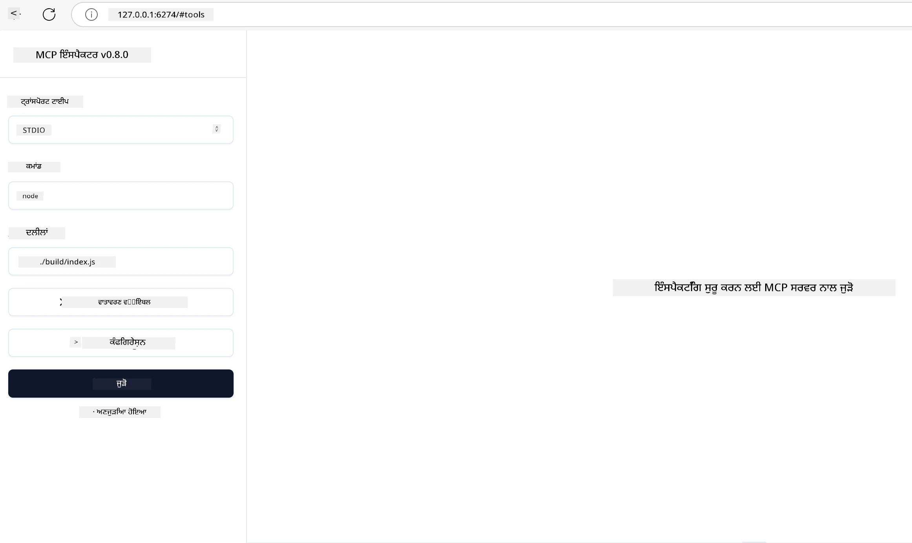

# ਪ੍ਰੈਕਟਿਕਲ ਇੰਪਲੀਮੇਂਟੇਸ਼ਨ

[](https://youtu.be/vCN9-mKBDfQ)

_(ਉਪਰ ਦਿੱਤੀ ਤਸਵੀਰ 'ਤੇ ਕਲਿੱਕ ਕਰਕੇ ਇਸ ਪਾਠ ਦਾ ਵੀਡੀਓ ਵੇਖੋ)_

ਪ੍ਰੈਕਟਿਕਲ ਇੰਪਲੀਮੇਂਟੇਸ਼ਨ ਉਹ ਥਾਂ ਹੈ ਜਿੱਥੇ ਮਾਡਲ ਸੰਦੇਸ਼ ਪ੍ਰੋਟੋਕੋਲ (MCP) ਦੀ ਤਾਕਤ ਸਪਸ਼ਟ ਹੋ ਜਾਂਦੀ ਹੈ। ਜਦੋਂ ਕਿ MCP ਦੇ ਪਿੱਛੇ ਸਿਧਾਂਤ ਅਤੇ ਆਰਕੀਟੈਕਚਰ ਨੂੰ ਸਮਝਣਾ ਮਹੱਤਵਪੂਰਨ ਹੈ, ਅਸਲ ਮੁੱਲ ਉਸ ਵੇਲੇ ਉਭਰਦਾ ਹੈ ਜਦੋਂ ਤੁਸੀਂ ਇਹ ਅਸੂਲ ਵਰਤਕੇ ਹਕੀਕਤੀ ਸਮੱਸਿਆਵਾਂ ਦਾ ਹੱਲ ਕਰਨ ਵਾਲੇ ਸੁਝਾਅ ਤਿਆਰ, ਟੈਸਟ ਅਤੇ ਡਿਪਲੌਇ ਕਰਦੇ ਹੋ। ਇਹ ਅਧਿਆਇ ਭਾਵਾਤਮਕ ਗਿਆਨ ਅਤੇ ਹੱਥੋਂ-ਹੱਥ ਵਿਕਾਸ ਦੇ ਦਰਮਿਆਨ ਪੱਲ ਬਣਾਉਂਦਾ ਹੈ, ਜਿਸ ਵਿਚੋਂ ਤੁਸੀਂ MCP ਆਧਾਰਿਤ ਐਪਲੀਕੇਸ਼ਨਾਂ ਨੂੰ ਜੀਵਤ ਕਰਨ ਦੀ ਪ੍ਰਕਿਰਿਆ ਸਿੱਖਦੇ ਹੋ।

ਚਾਹੇ ਤੁਸੀਂ ਬੁੱਧਿਮਾਨ ਸਹਾਇਕ ਵਿਕਸਿਤ ਕਰ ਰਹੇ ਹੋ, ਵਪਾਰਕ ਵਰਕਫਲੋਜ਼ ਵਿੱਚ AI ਨੂੰ ਜੋੜ ਰਹੇ ਹੋ, ਜਾਂ ਡੇਟਾ ਪ੍ਰੋਸੈਸਿੰਗ ਲਈ ਮੈਨੂਅਲ ਟੂਲ ਬਣਾਉਂਦੇ ਹੋ, MCP ਇੱਕ ਲਚਕੀਲਾ ਨਿਰਮਾਣ ਮਾਂਚ ਪ੍ਰਦਾਨ ਕਰਦਾ ਹੈ। ਇਸਦਾ ਭਾਸ਼ਾ-ਅਗਨੋਸਟਿਕ ਡਿਜ਼ਾਇਨ ਅਤੇ ਪ੍ਰਸਿੱਧ ਪ੍ਰੋਗ੍ਰਾਮਿੰਗ ਭਾਸ਼ਾਵਾਂ ਲਈ ਅਧਿਕਾਰਤ SDKs ਇਸਨੂੰ ਵੱਡੇ ਵਿਕਾਸਕਾਰ ਪਰਿਵਾਰ ਲਈ ਪਹੁੰਚਯੋਗ ਬਣਾਉਂਦੇ ਹਨ। ਇਹ SDKs ਦੀ ਵਰਤੋਂ ਕਰਕੇ, ਤੁਸੀਂ ਤੇਜ਼ੀ ਨਾਲ ਪ੍ਰੋਟੋਟਾਈਪ ਬਣਾ ਸਕਦੇ ਹੋ, ਉਦਯੋਗ ਕਰ ਸਕਦੇ ਹੋ ਅਤੇ ਵੱਖ-ਵੱਖ ਪਲੇਟਫਾਰਮਾਂ ਅਤੇ ਵਾਤਾਵਰਣਾਂ 'ਤੇ ਆਪਣੇ ਹੱਲਾਂ ਨੂੰ ਸਕੇਲ ਕਰ ਸਕਦੇ ਹੋ।

ਅਗਲੇ ਭਾਗਾਂ ਵਿੱਚ, ਤੁਸੀਂ ਪ੍ਰੈਕਟਿਕਲ ਉਦਾਹਰਨਾਂ, ਸੈਂਪਲ ਕੋਡ, ਅਤੇ ਡਿਪਲੌਇਮੈਂਟ ਰਣਨੀਤੀਆਂ ਪਾਉਗੇ ਜੋ ਦਿਖਾਉਂਦੀਆਂ ਹਨ ਕਿ MCP ਨੂੰ C#, ਜਾਵਾ ਸਪ੍ਰਿੰਗ, ਟਾਇਪਸਕ੍ਰਿਪਟ, ਜਾਵਾਸਕ੍ਰਿਪਟ ਅਤੇ ਪਾਇਥਨ ਵਿੱਚ ਕਿਵੇਂ ਲਾਗੂ ਕਰਨਾ ਹੈ। ਤੁਸੀਂ ਇਹ ਵੀ ਸਿੱਖੋਗੇ ਕਿ MCP ਸਰਵਰਾਂ ਨੂੰ ਕਿਵੇਂ ਡੀਬੱਗ ਅਤੇ ਟੈਸਟ ਕਰਨਾ ਹੈ, API ਦਾ ਪ੍ਰਬੰਧਨ ਕਰਨਾ ਹੈ, ਅਤੇ Azure ਦੀ ਵਰਤੋਂ ਕਰਕੇ ਕਲਾਉਡ 'ਤੇ ਹੱਲਾਂ ਨੂੰ ਡਿਪਲੌਇ ਕਰਨਾ ਹੈ। ਇਹ ਹੱਥ-ਵੀਂਹਲੇ ਸਾਂਝੇ ਸਰੋਤ ਤੁਹਾਡੇ ਸਿੱਖਣ ਨੂੰ ਤੇਜ਼ ਕਰਨ ਅਤੇ ਤੁਹਾਨੂੰ ਭਰੋਸੇਯੋਗ ਅਤੇ ਉਤਪਾਦਨ ਤਿਆਰ MCP ਐਪਲੀਕੇਸ਼ਨਾਂ ਨੂੰ ਬਲਡ ਕਰਨ ਵਿੱਚ ਮਦਦ ਕਰਨ ਲਈ ਬਣਾਏ ਗਏ ਹਨ।

## ਓਵਰਵਿਊ

ਇਹ ਪਾਠ MCP ਇੰਪਲੀਮੇਂਟੇਸ਼ਨ ਦੇ ਪ੍ਰਾਇਮਿਕ ਪੱਖਾਂ 'ਤੇ ਧਿਆਨ ਕੇਂਦਰਿਤ ਕਰਦਾ ਹੈ ਜੋ ਕਈ ਪ੍ਰੋਗ੍ਰਾਮਿੰਗ ਭਾਸ਼ਾਵਾਂ ਵਿੱਚ ਫੈਲਿਆ ਹੈ। ਅਸੀਂ ਦੇਖਾਂਗੇ ਕਿ C#, ਜਾਵਾ ਸਪ੍ਰਿੰਗ, ਟਾਇਪਸਕ੍ਰਿਪਟ, ਜਾਵਾਸਕ੍ਰਿਪਟ, ਅਤੇ ਪਾਇਥਨ ਵਿੱਚ MCP SDKs ਦੀ ਵਰਤੋਂ ਕਰਕੇ ਮਜ਼ਬੂਤ ਐਪਲੀਕੇਸ਼ਨ ਕਿਵੇਂ ਬਣਾਈਆਂ ਜਾਂਦੀਆਂ ਹਨ, MCP ਸਰਵਰਾਂ ਨੂੰ ਕਿਵੇਂ ਡੀਬੱਗ ਅਤੇ ਟੈਸਟ ਕੀਤਾ ਜਾਂਦਾ ਹੈ, ਅਤੇ ਕਿਵੇਂ ਰੀਯੂਜ਼ੇਬਲ ਸਰੋਤ, ਪ੍ਰਾਂਪਟਸ, ਅਤੇ ਟੂਲ ਬਣਾਏ ਜਾਂਦੇ ਹਨ।

## ਸਿੱਖਣ ਦੇ ਉਦੇਸ਼

ਇਸ ਪਾਠ ਦੇ ਅੰਤ ਤੱਕ, ਤੁਸੀਂ ਸਮਰੱਥ ਹੋਵੋਗੇ:

- ਵੱਖ-ਵੱਖ ਪ੍ਰੋਗ੍ਰਾਮਿੰਗ ਭਾਸ਼ਾਵਾਂ ਵਿੱਚ ਅਧਿਕਾਰਤ SDKs ਦੀ ਵਰਤੋਂ ਕਰਕੇ MCP ਹੱਲ ਲਾਗੂ ਕਰਨਾ
- MCP ਸਰਵਰਾਂ ਨੂੰ ਵਿਧਾਨੂਕੂਲ ਤਰੀਕੇ ਨਾਲ ਡੀਬੱਗ ਅਤੇ ਟੈਸਟ ਕਰਨਾ
- ਸਰਵਰ ਫੀਚਰਾਂ (ਸਰੋਤ, ਪ੍ਰਾਂਪਟਸ ਅਤੇ ਟੂਲ) ਬਣਾਉਣਾ ਅਤੇ ਵਰਤਣਾ
- ਜਟਿਲ ਕਾਰਜਾਂ ਲਈ ਪ੍ਰਭਾਵਸ਼ਾਲੀ MCP ਵਰਕਫਲੋਜ਼ ਡਿਜ਼ਾਇਨ ਕਰਨਾ
- ਪ੍ਰਦਰਸ਼ਨ ਅਤੇ ਭਰੋਸਯੋਗਤਾ ਲਈ MCP ਇੰਪਲੀਮੇਂਟੇਸ਼ਨ ਨੂੰ ਅਡਜਸਟ ਕਰਨਾ

## ਅਧਿਕਾਰਤ SDK ਸਰੋਤ

ਮਾਡਲ ਸੰਦੇਸ਼ ਪ੍ਰੋਟੋਕੋਲ ਕਈ ਭਾਸ਼ਾਵਾਂ ਲਈ ਅਧਿਕਾਰਤ SDKs ਪ੍ਰਦਾਨ ਕਰਦਾ ਹੈ (ਜੋ [MCP ਵਿਸ਼ੇਸ਼ਤਾ 2025-11-25](https://spec.modelcontextprotocol.io/specification/2025-11-25/) ਨਾਲ ਸੰਗਤ ਹੈ):

- [C# SDK](https://github.com/modelcontextprotocol/csharp-sdk)
- [ਜਾਵਾ ਸਪ੍ਰਿੰਗ ਨਾਲ SDK](https://github.com/modelcontextprotocol/java-sdk) **ਨੋਟ:** ਇਸਨੂੰ [Project Reactor](https://projectreactor.io) 'ਤੇ ਡਿਪੈਂਡੈਂਸੀ ਦੀ ਲੋੜ ਹੈ। (ਦੇਖੋ [ਚਰਚਾ ਮਾਮਲਾ 246](https://github.com/orgs/modelcontextprotocol/discussions/246).)
- [ਟਾਇਪਸਕ੍ਰਿਪਟ SDK](https://github.com/modelcontextprotocol/typescript-sdk)
- [ਪਾਇਥਨ SDK](https://github.com/modelcontextprotocol/python-sdk)
- [ਕੋਟਲਿਨ SDK](https://github.com/modelcontextprotocol/kotlin-sdk)
- [ਗੋ SDK](https://github.com/modelcontextprotocol/go-sdk)

## MCP SDKs ਨਾਲ ਕੰਮ ਕਰਨਾ

ਇਹ ਭਾਗ MCP ਨੂੰ ਕਈ ਪ੍ਰੋਗ੍ਰਾਮਿੰਗ ਭਾਸ਼ਾਵਾਂ ਵਿੱਚ ਲਾਗੂ ਕਰਨ ਦੀਆਂ ਪ੍ਰੈਕਟਿਕਲ ਉਦਾਹਰਨਾਂ ਦਿੰਦਾ ਹੈ। ਤੁਸੀਂ `samples` ਡਾਇਰੈਕਟਰੀ ਵਿੱਚ ਭਾਸ਼ਾ ਅਨੁਸਾਰ ਸੈਂਪਲ ਕੋਡ ਲੱਭ ਸਕਦੇ ਹੋ।

### ਉਪਲਬਧ ਸੈਂਪਲ

ਰੇਪੋ ਵਿੱਚ [ਸੈਂਪਲ ਇੰਪਲੀਮੇਂਟੇਸ਼ਨਾਂ](../../../04-PracticalImplementation/samples) ਹੇਠਲੀਆਂ ਭਾਸ਼ਾਵਾਂ ਵਿੱਚ ਸ਼ਾਮਲ ਹਨ:

- [C#](./samples/csharp/README.md)
- [ਜਾਵਾ ਸਪ੍ਰਿੰਗ ਨਾਲ](./samples/java/containerapp/README.md)
- [ਟਾਇਪਸਕ੍ਰਿਪਟ](./samples/typescript/README.md)
- [ਜਾਵਾਸਕ੍ਰਿਪਟ](./samples/javascript/README.md)
- [ਪਾਇਥਨ](./samples/python/README.md)

ਹਰ ਸੈਂਪਲ ਉਸ ਖਾਸ ਭਾਸ਼ਾ ਅਤੇ ਪਰਿਰਚਨਾ ਲਈ MCP ਦੀਆਂ ਮੁੱਖ ਸਿਧਾਂਤਾਂ ਅਤੇ ਇੰਪਲੀਮੇਂਟੇਸ਼ਨ ਪੈਟਰਨ ਇਸਤੇਮਾਲ ਕਰਦਾ ਹੈ।

### ਪ੍ਰੈਕਟਿਕਲ ਗਾਈਡਜ਼

ਪ੍ਰੈਕਟਿਕਲ MCP ਇੰਪਲੀਮੇਂਟੇਸ਼ਨ ਲਈ ਵਾਧੂ ਗਾਈਡਜ਼:

- [ਪੇਜੀਨੇਸ਼ਨ ਅਤੇ ਵੱਡੇ ਨਤੀਜਿਆਂ ਦੇ ਸੈਟਸ](./pagination/README.md) - ਟੂਲਾਂ, ਸਰੋਤਾਂ ਅਤੇ ਵੱਡੇ ਡੇਟਾ ਸੈਟਸ ਲਈ ਕਰਸਰ-ਆਧਾਰਿਤ ਪੇਜੀਨੇਸ਼ਨ ਸਮਭਾਲੋ

## ਕੋਰ ਸਰਵਰ ਫੀਚਰ

MCP ਸਰਵਰ ਇਹਨਾਂ ਵਿੱਚੋਂ ਕਿਸੇ ਵੀ ਫੀਚਰ ਸੰਯੋਗ ਨੂੰ ਲਾਗੂ ਕਰ ਸਕਦੇ ਹਨ:

### ਸਰੋਤ

ਸਰੋਤ ਉਪਭੋਗਤਾ ਜਾਂ AI ਮਾਡਲ ਲਈ ਸੰਦਰਭ ਅਤੇ ਡੇਟਾ ਮੁਹੱਈਆ ਕਰਦੇ ਹਨ:

- ਦਸਤਾਵੇਜ਼ ਸੰਗ੍ਰਹਿ
- ਜ਼ਾਨकारी ਢੇਰ
- ਸੰਰਚਿਤ ਡੇਟਾ ਸਰੋਤ
- ਫਾਈਲ ਪ੍ਰਣਾਲੀਆਂ

### ਪ੍ਰਾਂਪਟਸ

ਪ੍ਰਾਂਪਟਸ ਉਪਭੋਗਤਾਵਾਂ ਲਈ ਨਮੂਨਾ ਬਣਾਏ ਗਏ ਸੁਨੇਹੇ ਅਤੇ ਵਰਕਫਲੋਜ਼ ਹਨ:

- ਪਹਿਲਾਂ ਤਿਆਰ ਕੀਤੇ ਗਏ ਗੱਲਬਾਤ ਨਮੂਨੇ
- ਮਾਰਗਦਰਸ਼ਿਤ ਪਰਸਪਰ-ਕਿਰਿਆ ਦੇ ਪੈਟਰਨ
- ਵਿਸ਼ੇਸ਼ ਕੀਤੇ ਗਏ ਸੰਵਾਦ ਧਾਂਚੇ

### ਟੂਲ

ਟੂਲ AI ਮਾਡਲ ਲਈ ਕਿਰਿਆਸ਼ੀਲ ਫੰਕਸ਼ਨਾਂ ਹਨ:

- ਡੇਟਾ ਪ੍ਰੋਸੈਸਿੰਗ ਯੂਟਿਲਿਟੀਜ਼
- ਬਾਹਰੀ API ਇੰਟੀਗਰੇਸ਼ਨ
- ਗਣਨਾਤਮਕ ਸਮਰੱਥਾਵਾਂ
- ਖੋਜ ਕਾਰਜਸ਼ੀਲਤਾ

## ਸੈਂਪਲ ਇੰਪਲੀਮੇਂਟੇਸ਼ਨ: C# ਇੰਪਲੀਮੇਂਟੇਸ਼ਨ

ਅਧਿਕਾਰਤ C# SDK ਰੇਪੋ ਵਿੱਚ MCP ਦੇ ਵੱਖਰੇ ਪੱਖ ਦਿਖਾਉਂਦੇ ਕਈ ਸੈਂਪਲ ਇੰਪਲੀਮੇਂਟੇਸ਼ਨਾਂ ਹਨ:

- **ਮੁਲ MCP ਕਲਾਇੰਟ**: MCP ਕਲਾਇੰਟ ਬਣਾਉਣ ਅਤੇ ਟੂਲ ਕਾਲ ਕਰਨ ਦਾ ਸਾਦਾ ਉਦਾਹਰਨ
- **ਮੁਲ MCP ਸਰਵਰ**: ਬੇਸਿਕ ਟੂਲ ਰਜਿਸਟ੍ਰੇਸ਼ਨ ਨਾਲ ਘੱਟੋ-ਘੱਟ ਸਰਵਰ ਇੰਪਲੀਮੇਂਟੇਸ਼ਨ
- **ਉੱਨਤ MCP ਸਰਵਰ**: ਭਰਪੂਰ ਫੀਚਰ ਸਰਵਰ ਟੂਲ ਰਜਿਸਟ੍ਰੇਸ਼ਨ, ਪ੍ਰਮਾਣਿਕਤਾ ਅਤੇ ਗਲਤੀ ਸੰਭਾਲ ਕਿਰੀਆ ਨਾਲ
- **ASP.NET ਇੰਟੀਗਰੇਸ਼ਨ**: ASP.NET ਕੋਰ ਨਾਲ ਇੰਟੀਗਰੇਸ਼ਨ ਦਿਖਾਉਂਦੇ ਉਦਾਹਰਨ
- **ਟੂਲ ਇੰਪਲੀਮੇਂਟੇਸ਼ਨ ਪੈਟਰਨ**: ਵੱਖਰੇ ਜਟਿਲਤਾ ਪੱਧਰਾਂ ਵਾਲੇ ਟੂਲ ਲਾਗੂ ਕਰਨ ਲਈ ਵੱਖ-ਵੱਖ ਪੈਟਰਨ

MCP C# SDK ਪ੍ਰੀਵਿਊ ਵਿੱਚ ਹੈ ਅਤੇ APIs ਬਦਲ ਸਕਦੇ ਹਨ। ਜਿਵੇਂ SDK ਵਧਦਾ ਹੈ, ਅਸੀਂ ਸਮੇਂ-ਸਮੇਂ 'ਤੇ ਇਸ ਬਲੌਗ ਨੂੰ ਅਪਡੇਟ ਕਰਾਂਗੇ।

### ਮੁੱਖ ਫੀਚਰ

- [C# MCP Nuget ModelContextProtocol](https://www.nuget.org/packages/ModelContextProtocol)
- ਆਪਣਾ [ਪਹਿਲਾ MCP ਸਰਵਰ ਬਣਾਉਣਾ](https://devblogs.microsoft.com/dotnet/build-a-model-context-protocol-mcp-server-in-csharp/).

ਪੂਰਨ C# ਇੰਪਲੀਮੇਂਟੇਸ਼ਨ ਸੈਂਪਲ ਲਈ, [ਅਧਿਕਾਰਤ C# SDK ਸੈਂਪਲ ਰੇਪੋ](https://github.com/modelcontextprotocol/csharp-sdk) ਵੇਖੋ

## ਸੈਂਪਲ ਇੰਪਲੀਮੇਂਟੇਸ਼ਨ: ਜਾਵਾ ਸਪ੍ਰਿੰਗ ਨਾਲ ਇੰਪਲੀਮੇਂਟੇਸ਼ਨ

ਜਾਵਾ ਸਪ੍ਰਿੰਗ SDK ਵਿਉਂਤਮੀ MCP ਇੰਪਲੀਮੇਂਟੇਸ਼ਨ ਵਿਕਲਪ ਮੁਹੱਈਆ ਕਰਵਾਉਂਦਾ ਹੈ ਜੋ ਕਾਰੋਬਾਰੀ-ਮਾਪ ਸੰਭਾਲਾਂ ਵਾਲੇ ਫੀਚਰਾਂ ਨਾਲ ਲੈਸ ਹੈ।

### ਮੁੱਖ ਫੀਚਰ

- ਸਪ੍ਰਿੰਗ ਫ੍ਰੇਮਵਰਕ ਇੰਟੀਗਰੇਸ਼ਨ
- ਮਜ਼ਬੂਤ ਟਾਈਪ ਸੁਰੱਖਿਆ
- ਪ੍ਰਤੀਕ੍ਰਿਆਸ਼ੀਲ ਪ੍ਰੋਗ੍ਰਾਮਿੰਗ ਸਹਾਇਤਾ
- ਵਿਸਥਾਰਤ ਗਲਤੀ ਸੰਭਾਲ

ਪੂਰਨ ਜਾਵਾ ਸਪ੍ਰਿੰਗ ਇੰਪਲੀਮੇਂਟੇਸ਼ਨ ਸੈਂਪਲ ਲਈ, ਸੈਂਪਲ ਡਾਇਰੈਕਟਰੀ ਵਿੱਚ [ਜਾਵਾ ਸਪ੍ਰਿੰਗ ਸੈਂਪਲ](samples/java/containerapp/README.md) ਵੇਖੋ।

## ਸੈਂਪਲ ਇੰਪਲੀਮੇਂਟੇਸ਼ਨ: ਜਾਵਾਸਕ੍ਰਿਪਟ ਇੰਪਲੀਮੇਂਟੇਸ਼ਨ

ਜਾਵਾਸਕ੍ਰਿਪਟ SDK MCP ਇੰਪਲੀਮੇਂਟੇਸ਼ਨ ਲਈ ਹਲਕਾ ਅਤੇ ਲਚਕੀਲਾ ਤਰੀਕਾ ਪ੍ਰਦਾਨ ਕਰਦਾ ਹੈ।

### ਮੁੱਖ ਫੀਚਰ

- Node.js ਅਤੇ ਬ੍ਰਾਉਜ਼ਰ ਸਹਾਇਤਾ
- ਪ੍ਰੋਮਿਸ-ਅਧਾਰਿਤ API
- Express ਅਤੇ ਹੋਰ ਫ੍ਰੇਮਵਰਕਾਂ ਨਾਲ ਆਸਾਨ ਇੰਟੀਗਰੇਸ਼ਨ
- ਸਟ੍ਰੀਮਿੰਗ ਲਈ WebSocket ਸਹਾਇਤਾ

ਪੂਰਨ ਜਾਵਾਸਕ੍ਰਿਪਟ ਇੰਪਲੀਮੇਂਟੇਸ਼ਨ ਸੈਂਪਲ ਲਈ, ਸੈਂਪਲ ਡਾਇਰੈਕਟਰੀ ਵਿੱਚ [ਜਾਵਾਸਕ੍ਰਿਪਟ ਸੈਂਪਲ](samples/javascript/README.md) ਵੇਖੋ।

## ਸੈਂਪਲ ਇੰਪਲੀਮੇਂਟੇਸ਼ਨ: ਪਾਇਥਨ ਇੰਪਲੀਮੇਂਟੇਸ਼ਨ

ਪਾਇਥਨ SDK MCP ਇੰਪਲੀਮੇਂਟੇਸ਼ਨ ਲਈ Python-ਮੁੱਖ ਤਰੀਕਾ ਮੁਹੱਈਆ ਕਰਦਾ ਹੈ ਜੋ ਸ਼ਾਨਦਾਰ ML ਫ੍ਰੇਮਵਰਕ ਇੰਟੀਗਰੇਸ਼ਨਾਂ ਨਾਲ ਜੁੜਿਆ ਹੁੰਦਾ ਹੈ।

### ਮੁੱਖ ਫੀਚਰ

- asyncio ਨਾਲ async/await ਸਹਾਇਤਾ
- FastAPI ਇਂਟੀਗਰੇਸ਼ਨ``
- ਸਰਲ ਟੂਲ ਰਜਿਸਟ੍ਰੇਸ਼ਨ
- ਪ੍ਰਸਿੱਧ ML ਲਾਇਬ੍ਰੇਰੀਆਂ ਨਾਲ ਮੁਢਲਾ ਇੰਟੀਗਰੇਸ਼ਨ

ਪੂਰਾ ਪਾਇਥਨ ਇੰਪਲੀਮੇਂਟੇਸ਼ਨ ਸੈਂਪਲ ਲਈ, ਸੈਂਪਲ ਡਾਇਰੈਕਟਰੀ ਵਿੱਚ [ਪਾਇਥਨ ਸੈਂਪਲ](samples/python/README.md) ਵੇਖੋ।

## API ਪ੍ਰਬੰਧਨ

Azure API ਪ੍ਰਬੰਧਨ ਇਹ ਵਧੀਆ ਜਵਾਬ ਹੈ ਕਿ ਅਸੀਂ MCP ਸਰਵਰਾਂ ਨੂੰ ਕਿਵੇਂ ਸੁਰੱਖਿਅਤ ਕਰ ਸਕਦੇ ਹਾਂ। ਵਿਚਾਰ ਇਹ ਹੈ ਕਿ ਤੁਸੀਂ ਆਪਣੀ MCP ਸਰਵਰ ਦੇ ਸਾਹਮਣੇ ਇੱਕ Azure API ਪ੍ਰਬੰਧਨ ਨਕਲ ਰੱਖੋ ਅਤੇ ਇਹ ਤੁਹਾਡੇ ਚਾਹੁਣ ਵਾਲੇ ਫੀਚਰ ਜਿਵੇਂ:

- ਦਰ ਸੀਮਾ ਲਗਾਉਣਾ
- ਟੋਕਨ ਪ੍ਰਬੰਧਨ
- ਨਿਗਰਾਨੀ
- ਲੋਡ ਬੈਲੈਂਸਿੰਗ
- ਸੁਰੱਖਿਆ

ਇਨ੍ਹਾਂ ਨੂੰ ਸੰਭਾਲੇ।

### Azure ਸੈਂਪਲ

ਇੱਥੇ ਇੱਕ Azure ਸੈਂਪਲ ਹੈ ਜੋ ਇਹ ਕਰਦਾ ਹੈ, ਮਤਲਬ [MCP ਸਰਵਰ ਬਣਾਉਣਾ ਅਤੇ ਇਸnu Azure API Management ਨਾਲ ਸੁਰੱਖਿਅਤ ਕਰਨਾ](https://github.com/Azure-Samples/remote-mcp-apim-functions-python).

ਹੇਠਾਂ ਦਿੱਤੀ ਤਸਵੀਰ ਵਿੱਚ ਪ੍ਰਮਾਣਿਕਤਾ ਪ੍ਰਵਾਹ ਮਹਿਸੂਸ ਕਰੋ:


ਉਪਰੋਕਤ ਤਸਵੀਰ ਵਿੱਚ, ਨਿਮਨਲਿਖਿਤ ਘਟਨਾਵਾਂ ਘਟਦੀਆਂ ਹਨ:

- ਪ੍ਰਮਾਣਿਕਤਾ/ਅਧਿਕਾਰਣ ਮਾਈਕ੍ਰੋਸੌਫਟ ਐਂਟਰਾ ਦੇ ਜਰੀਏ ਹੁੰਦਾ ਹੈ।
- Azure API Management ਇੱਕ ਗੇਟਵੇ ਵਜੋਂ ਕੰਮ ਕਰਦਾ ਹੈ ਅਤੇ ਟ੍ਰੈਫਿਕ ਨਿਰਦੇਸ਼ਿਤ ਕਰਨ ਅਤੇ ਪ੍ਰਬੰਧਨ ਕਰਨ ਲਈ ਨੀਤੀਆਂ ਦੀ ਵਰਤੋਂ ਕਰਦਾ ਹੈ।
- Azure ਮਾਨੀਟਰ ਸਭ ਬੇਨਤੀ ਲੋਗ ਬਨਾਉਂਦਾ ਹੈ ਹੋਰ ਵਿਸ਼ਲੇਸ਼ਣ ਲਈ।

#### ਅਧਿਕਾਰਣ ਪ੍ਰਵਾਹ

ਆਓ ਅਧਿਕਾਰਣ ਪ੍ਰਵਾਹ ਨੂੰ ਵਧੂ ਵਿਸਥਾਰ ਨਾਲ ਵੇਖੀਏ:


#### MCP ਅਧਿਕਾਰਣ ਵਿਸ਼ੇਸ਼ਤਾ

[MCP ਅਧਿਕਾਰਣ ਵਿਸ਼ੇਸ਼ਤਾ](https://spec.modelcontextprotocol.io/specification/2025-11-25/basic/authorization/) ਬਾਰੇ ਹੋਰ ਜਾਨੋ

## ਰਿਮੋਟ MCP ਸਰਵਰ ਨੂੰ Azure 'ਤੇ ਡਿਪਲੌਇ ਕਰੋ

ਆਓ ਵੇਖੀਏ ਕਿ ਅਸੀਂ ਪਹਿਲਾਂ ਵਿਚਾਰਿਆ ਸੀ ਉਹ ਸੈਂਪਲ ਡਿਪਲੌਇ ਕਰ ਸਕਦੇ ਹਾਂ ਜਾਂ ਨਹੀਂ:

1. ਰੇਪੋ ਕਲੋਨ ਕਰੋ

    ```bash
    git clone https://github.com/Azure-Samples/remote-mcp-apim-functions-python.git
    cd remote-mcp-apim-functions-python
    ```

1. `Microsoft.App` ਸਰੋਤ ਪ੍ਰਭਾਵਕਦਾਤਾ ਨੂੰ ਰਜਿਸਟਰ ਕਰੋ।

   - ਜੇ ਤੁਸੀਂ Azure CLI ਦੀ ਵਰਤੋਂ ਕਰ ਰਹੇ ਹੋ, ਤਾਂ `az provider register --namespace Microsoft.App --wait` ਚਲਾਓ।
   - ਜੇ ਤੁਸੀਂ Azure PowerShell ਦੀ ਵਰਤੋਂ ਕਰ ਰਹੇ ਹੋ, ਤਾਂ `Register-AzResourceProvider -ProviderNamespace Microsoft.App` ਚਲਾਓ। ਫਿਰ ਕੁਝ ਸਮਾਂ ਬਾਅਦ `(Get-AzResourceProvider -ProviderNamespace Microsoft.App).RegistrationState` ਚਲਾਕੇ ਜਾਂਚੋ ਕਿ ਰਜਿਸਟ੍ਰੇਸ਼ਨ ਪੂਰਾ ਹੋਇਆ ਹੈ ਜਾਂ ਨਹੀਂ।

1. ਇਸ [azd](https://aka.ms/azd) ਕਮਾਂਡ ਨੂੰ ਚਲਾਓ ਜੋ API ਪ੍ਰਬੰਧਨ ਸੇਵਾ, ਫੰਕਸ਼ਨ ਐਪ (ਕੋਡ ਸਮੇਤ) ਅਤੇ ਸਾਰੇ ਹੋਰ ਜ਼ਰੂਰੀ Azure ਸਰੋਤਾਂ ਨੂੰ ਪ੍ਰੋਵੀਜ਼ਨ ਕਰੇਗਾ

    ```shell
    azd up
    ```

    ਇਹ ਕਮਾਂਡ Azure 'ਤੇ ਸਾਰੇ ਕਲਾਉਡ ਸਰੋਤ ਡਿਪਲੌਇ ਕਰਾਨੀ ਚਾਹੀਦੀ ਹੈ

### MCP ਇੰਸਪੈਕਟਰ ਨਾਲ ਆਪਣੇ ਸਰਵਰ ਦੀ ਟੈਸਟਿੰਗ

1. ਇੱਕ **ਨਵੀਂ ਟਰਮੀਨਲ ਵਿੰਡੋ** ਵਿੱਚ MCP ਇੰਸਪੈਕਟਰ ਇੰਸਟਾਲ ਅਤੇ ਚਲਾਓ

    ```shell
    npx @modelcontextprotocol/inspector
    ```

    ਤੁਹਾਨੂੰ ਇੱਕ ਇਸ ਤਰ੍ਹਾਂ ਦਾ ਇੰਟਰਫੇਸ ਵੇਖਣਾ ਚਾਹੀਦਾ ਹੈ:

    

1. CTRL ਕਲਿੱਕ ਕਰਕੇ MCP ਇੰਸਪੈਕਟਰ ਵੈੱਬ ਐਪ ਨੂੰ ਐਪ ਦੁਆਰਾ ਦਿਖਾਏ URL ਤੋਂ ਲੋਡ ਕਰੋ (ਜਿਵੇਂ ਕਿ [http://127.0.0.1:6274/#resources](http://127.0.0.1:6274/#resources))
1. ਟਰਾਂਸਪੋਰਟ ਕਿਸਮ `SSE` 'ਤੇ ਸੈੱਟ ਕਰੋ
1. URL ਨੂੰ ਤੁਹਾਡੇ ਚੱਲ ਰਹੇ API ਪ੍ਰਬੰਧਨ SSE ਐਂਡਪੋਇੰਟ ਤੇ ਸੈੱਟ ਕਰੋ ਜੋ `azd up` ਤੋਂ ਬਾਅਦ ਦਿਖਾਈ ਦਿੰਦਾ ਹੈ, ਫਿਰ **ਕੰਨੈਕਟ** ਕਰੋ:

    ```shell
    https://<apim-servicename-from-azd-output>.azure-api.net/mcp/sse
    ```

1. **ਟੂਲਜ਼ ਦੀ ਸੂਚੀ ਬਣਾਓ**। ਕਿਸੇ ਟੂਲ 'ਤੇ ਕਲਿੱਕ ਕਰੋ ਅਤੇ **ਟੂਲ ਚਲਾਓ**।

ਜੇ ਸਾਰੇ ਕਦਮ ਸਹੀ ਹੋਏ, ਤਾਂ ਤੁਹਾਡੀ MCP ਸਰਵਰ ਨਾਲ ਕੁਨੈਕਸ਼ਨ ਹੋ ਗਈ ਹੋਵੇਗੀ ਅਤੇ ਤੁਸੀਂ ਇੱਕ ਟੂਲ ਕਾਲ ਕਰਨ ਵਿੱਚ ਸਮਰੱਥ ਹੋਵੋਗੇ।

## Azure ਲਈ MCP ਸਰਵਰ

[Remote-mcp-functions](https://github.com/Azure-Samples/remote-mcp-functions-dotnet): ਇਹ ਰੇਪੋਸਟਰੀਜ਼ ਜਲਦੀ ਸ਼ੁਰੂਆਤ ਲਈ ਟੈਂਪਲੇਟ ਹਨ ਜੋ Azure Functions ਦੇ ਨਾਲ Python, C# .NET ਜਾਂ Node/TypeScript ਦੀ ਵਰਤੋਂ ਕਰਕੇ ਕਸਟਮ ਰਿਮੋਟ MCP (ਮਾਡਲ ਸੰਦੇਸ਼ ਪ੍ਰੋਟੋਕੋਲ) ਸਰਵਰਾਂ ਨੂੰ ਬਣਾਉਣ ਅਤੇ ਡਿਪਲੌਇ ਕਰਨ ਲਈ।

ਸੈਂਪਲਾਂ ਸੰਪੂਰਨ ਹੱਲ ਪ੍ਰਦਾਨ ਕਰਦੇ ਹਨ ਜੋ ਵਿਕਾਸਕਾਰਾਂ ਨੂੰ ਸਹੂਲਤ ਦਿੰਦਾ ਹੈ:

- ਸਥਾਨਕ ਤੌਰ 'ਤੇ ਬਣਾਓ ਅਤੇ ਚਲਾਓ: ਲੋਕਲ ਮਸ਼ੀਨ ਤੇ MCP ਸਰਵਰ ਬਣਾਓ ਅਤੇ ਡੀਬੱਗ ਕਰੋ
- Azure 'ਤੇ ਡਿਪਲੌਇ ਕਰੋ: azd up ਕਮਾਂਡ ਨਾਲ ਆਸਾਨੀ ਨਾਲ ਕਲਾਉਡ 'ਤੇ ਡਿਪਲੌਇ ਕਰੋ
- ਕਲਾਇੰਟਾਂ ਤੋਂ ਕੁਨੈਕਟ ਕਰੋ: ਵੱਖ-ਵੱਖ ਕਲਾਇਂਟਾਂ ਵੱਲੋਂ MCP ਸਰਵਰ ਨਾਲ ਜੁੜੋ ਜਿਵੇਂ VS ਕੋਡ ਦੇ کوਪਾਇਲਟ ਏਜੰਟ ਮੋਡ ਅਤੇ MCP ਇੰਸਪੈਕਟਰ ਟੂਲ

### ਮੁੱਖ ਫੁਚਰ

- ਡਿਜ਼ਾਇਨ ਦੇ ਨਾਲ ਸੁਰੱਖਿਆ: MCP ਸਰਵਰ ਕੁੰਜੀਆਂ ਅਤੇ HTTPS ਦੀ ਵਰਤੋਂ ਨਾਲ ਸੁਰੱਖਿਅਤ ਹੈ
- ਪ੍ਰਮਾਣਿਕਤਾ ਵਿਕਲਪ: ਬਿਲਟ-ਇਨ ਆਥ ਅਤੇ/ਜਾਂ API ਪ੍ਰਬੰਧਨ ਨਾਲ OAuth ਨੂੰ ਸਮਰਥਨ ਕਰਦਾ ਹੈ
- ਨੈੱਟਵਰਕ ਇਜ਼ੋਲੇਸ਼ਨ: Azure ਵਿਰਚੁਅਲ ਨੈੱਟਵਰਕਜ਼ (VNET) ਦੀ ਵਰਤੋਂ ਕਰਕੇ ਨੈੱਟਵਰਕ ਇਜ਼ੋਲੇਸ਼ਨ ਦੀ ਆਗਿਆ ਦਿੰਦਾ ਹੈ
- ਸਰਵਰਲੈੱਸ ਆਰਕੀਟੈਕਚਰ: ਮਾਪਯੋਗ, ਇਵੈਂਟ-ਚਲਿਤ ਕਾਰਜਾਂ ਲਈ Azure Functions ਦੀ ਵਰਤੋਂ ਕਰਦਾ ਹੈ
- ਸਥਾਨਕ ਵਿਕਾਸ: ਵਿਆਪਕ ਸਥਾਨਕ ਵਿਕਾਸ ਅਤੇ ਡੀਬੱਗ ਮਦਦ
- ਸਧਾਰਨ ਡਿਪਲੌਇਮੈਂਟ: Azure 'ਤੇ ਡਿਪਲੌਇ ਕਰਨ ਦੀ ਸੁਗਮੀ ਪ੍ਰਕਿਰਿਆ

ਰੇਪੋਸਟਰੀ ਵਿੱਚ ਸਾਰੇ ਜ਼ਰੂਰੀ ਸੰਰਚਨਾ ਫਾਈਲ, ਸਰੋਤ ਕੋਡ ਅਤੇ ਢਾਂਚਾ ਪਰਿਭਾਸ਼ਾਵਾਂ ਸ਼ਾਮਲ ਹਨ ਤਾਂ ਜੋ ਤੁਰੰਤ ਪ੍ਰੋਡਕਸ਼ਨ ਯੋਗ MCP ਸਰਵਰ ਇੰਪਲੀਮੇਂਟੇਸ਼ਨ ਸ਼ੁਰੂ ਕੀਤੀ ਜਾ ਸਕੇ।

- [Azure Remote MCP Functions Python](https://github.com/Azure-Samples/remote-mcp-functions-python) - Python ਨਾਲ Azure Functions ਦੀ ਵਰਤੋਂ ਕਰਕੇ MCP ਦਾ ਸੈਂਪਲ ਇੰਪਲੀਮੇਂਟੇਸ਼ਨ

- [Azure Remote MCP Functions .NET](https://github.com/Azure-Samples/remote-mcp-functions-dotnet) - C# .NET ਨਾਲ Azure Functions ਦੀ ਵਰਤੋਂ ਕਰਕੇ MCP ਦਾ ਸੈਂਪਲ ਇੰਪਲੀਮੇਂਟੇਸ਼ਨ

- [Azure Remote MCP Functions Node/Typescript](https://github.com/Azure-Samples/remote-mcp-functions-typescript) - Node/TypeScript ਨਾਲ Azure Functions ਦੀ ਵਰਤੋਂ ਕਰਕੇ MCP ਦਾ ਸੈਂਪਲ ਇੰਪਲੀਮੇਂਟੇਸ਼ਨ।

## ਮੁੱਖ ਸਿੱਖਣ ਵਾਲੀਆਂ ਗੱਲਾਂ

- MCP SDKs ਭਾਸ਼ਾ-ਵਿਸ਼ੇਸ਼ ਟੂਲ ਪ੍ਰਦਾਨ ਕਰਦੇ ਹਨ ਜੋ ਮਜ਼ਬੂਤ MCP ਹੱਲ ਲਾਗੂ ਕਰਨ ਵਿੱਚ ਸਹਾਇਕ ਹਨ
- ਡੀਬੱਗ ਅਤੇ ਟੈਸਟਿੰਗ ਪ੍ਰਕਿਰਿਆ ਭਰੋਸੇਯੋਗ MCP ਐਪਲੀਕੇਸ਼ਨਾਂ ਲਈ ਅਹੰਕਾਰਪੂਰਕ ਹੈ
- ਰੀਯੂਜ਼ੇਬਲ ਪ੍ਰਾਂਪਟ ਟੈਂਪਲੇਟ AI ਸੰਵਾਦਾਂ ਲਈ ਪ੍ਰਮਾਣਿਤਤਾ ਯੋਗ ਬਣਾਉਂਦੇ ਹਨ
- ਚੰਗੀ ਤਰ੍ਹਾਂ ਡਿਜ਼ਾਇਨ ਕੀਤੇ ਵਰਕਫਲੋਜ਼ ਬਹੁ-ਟੂਲ ਕਾਰਜਾਂ ਨੂੰ ਸੁਚੱਜੀ ਤਰ੍ਹਾਂ ਮੈਨੇਜ ਕਰ ਸਕਦੇ ਹਨ
- MCP ਹੱਲਾਂ ਨੂੰ ਲਾਗੂ ਕਰਨ ਵਿੱਚ ਸੁਰੱਖਿਆ, ਪ੍ਰਦਰਸ਼ਨ, ਅਤੇ ਗਲਤੀ ਸੰਭਾਲ ਨੂੰ ਧਿਆਨ ਵਿੱਚ ਰੱਖਣਾ ਲਾਜ਼ਮੀ ਹੈ

## ਅਭਿਆਸ

ਆਪਣੇ ਖੇਤਰ ਵਿੱਚ ਇੱਕ ਅਸਲ ਸੰਸਾਰ ਦੀ ਸਮੱਸਿਆ ਨੂੰ ਹੱਲ ਕਰਨ ਵਾਲਾ ਪ੍ਰੈਕਟਿਕਲ MCP ਵਰਕਫਲੋ ਬਣਾਉ:

1. 3-4 ਟੂਲ ਪਛਾਣੋ ਜੋ ਇਸ ਸਮੱਸਿਆ ਦਾ ਹੱਲ ਕਰਨ ਲਈ ਉਪਯੋਗੀ ਹੋਣ
2. ਵਰਕਫਲੋ ਡਾਇਗ੍ਰਾਮ ਬਣਾਓ ਜੋ ਦਿਖਾਂਦਾ ਹੈ ਕਿ ਇਹ ਟੂਲ ਕਿਵੇਂ ਇੰਟਰਐਕਟ ਕਰਦੇ ਹਨ
3. ਆਪਣੀ ਪਸੰਦੀਦਾ ਭਾਸ਼ਾ ਦੀ ਵਰਤੋਂ ਕਰਕੇ ਕੋਈ ਇੱਕ ਟੂਲ ਦਾ ਅਸਲ ਸਾਰ ਵਰਜਨ ਬਣਾਓ
4. ਇੱਕ ਪ੍ਰਾਂਪਟ ਟੈਂਪਲੇਟ ਬਣਾਓ ਜੋ ਮਾਡਲ ਨੂੰ ਤੁਹਾਡੇ ਟੂਲ ਨੂੰ ਪ੍ਰਭਾਵਸ਼ਾਲੀ ਤਰੀਕੇ ਨਾਲ ਵਰਤਣ ਵਿੱਚ ਮਦਦ ਕਰੇ

## ਵਾਧੂ ਸਰੋਤ

---

## ਅਗਲਾ ਕੀ

ਅਗਲਾ: [ਉੱਚਸਤਰੀय ਵਿਸ਼ੇ](../05-AdvancedTopics/README.md)

---

<!-- CO-OP TRANSLATOR DISCLAIMER START -->
**ਜ਼ਿੰਮੇਵਾਰੀ ਤੋਂ ਮੁਕਤ**:  
ਇਸ ਦਸਤਾਵੇਜ਼ ਦਾ ਅਨੁਵਾਦ AI ਅਨੁਵਾਦ ਸੇਵਾ [Co-op Translator](https://github.com/Azure/co-op-translator) ਦੀ ਵਰਤੋਂ ਕਰਕੇ ਕੀਤਾ ਗਿਆ ਹੈ। ਜਦੋਂ ਕਿ ਅਸੀਂ ਸਹੀਤਾ ਲਈ ਯਤਨ ਕਰਦੇ ਹਾਂ, ਕਿਰਪਾ ਕਰਕੇ ਧਿਆਨ ਦਿਓ ਕਿ ਸਵੈਚਾਲਿਤ ਅਨੁਵਾਦ ਵਿੱਚ ਗਲਤੀਆਂ ਜਾਂ ਅਸਮਰਥਤਾਵਾਂ ਹੋ ਸਕਦੀਆਂ ਹਨ। ਮੂਲ ਦਸਤਾਵੇਜ਼ ਨੂੰ ਇਸਦੀ ਮੂਲ ਭਾਸ਼ਾ ਵਿੱਚ ਅਧਿਕਾਰਕ ਸਰੋਤ ਮੰਨਣਾ ਚਾਹੀਦਾ ਹੈ। ਅਹੰਕਾਰਪੂਰਕ ਜਾਣਕਾਰੀ ਲਈ, ਪੇਸ਼ੇਵਰ ਮਾਨਵੀ ਅਨੁਵਾਦ ਸਿਫਾਰਸ਼ੀ ਹੈ। ਅਸੀਂ ਇਸ ਅਨੁਵਾਦ ਦੀ ਵਰਤੋਂ ਤੋਂ ਪੈਦਾ ਹੋਣ ਵਾਲੀਆਂ ਕਿਸੇ ਵੀ ਗਲਤਫਹਮੀਆਂ ਜਾਂ ਭ੍ਰਮਾਂ ਲਈ ਜ਼ਿੰਮੇਵਾਰ ਨਹੀਂ ਹਾਂ।
<!-- CO-OP TRANSLATOR DISCLAIMER END -->