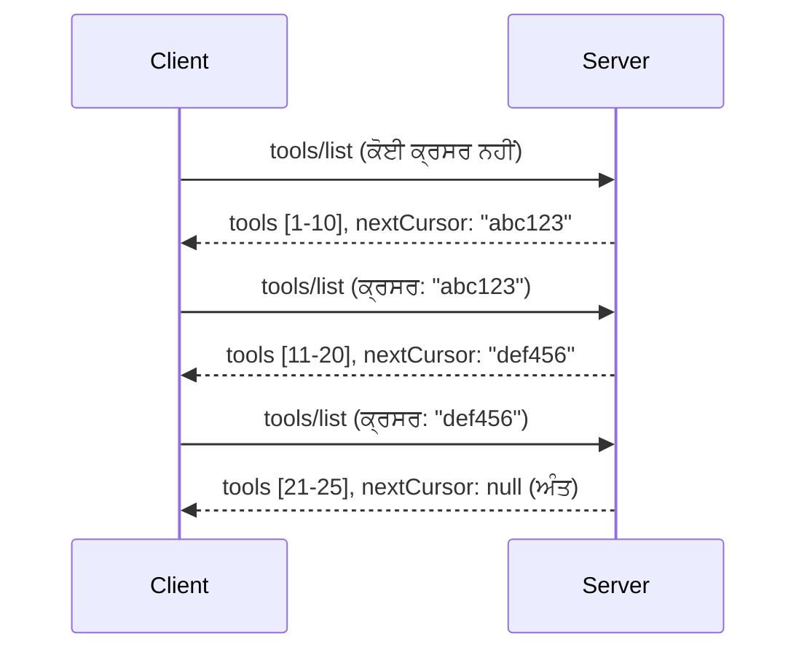

# MCP ਵਿੱਚ ਪੇਜੀਨੇਸ਼ਨ ਅਤੇ ਵੱਡੇ ਨਤੀਜਾ ਸੈੱਟ

ਜਦੋਂ ਤੁਹਾਡਾ MCP ਸਰਵਰ ਵੱਡੇ ਡੇਟਾਸੇਟਸ ਨੂੰ ਹੈਂਡਲ ਕਰਦਾ ਹੈ - ਚਾਹੇ ਹਜ਼ਾਰਾਂ ਫਾਈਲਾਂ, ਡੇਟਾਬੇਸ ਰਿਕਾਰਡ, ਜਾਂ ਖੋਜ ਨਤੀਜੇ - ਤੁਹਾਨੂੰ ਮੈਮੋਰੀ ਨੂੰ ਪ੍ਰਭਾਵਸ਼ਾਲੀ ਢੰਗ ਨਾਲ ਪ੍ਰਬੰਧਿਤ ਕਰਨ ਅਤੇ ਤੇਜ਼ ਉਪਭੋਗੀ ਅਨੁਭਵ ਪ੍ਰਦਾਨ ਕਰਨ ਲਈ ਪੇਜਿਨੇਸ਼ਨ ਦੀ ਲੋੜ ਹੁੰਦੀ ਹੈ। ਇਹ ਮਾਰਗਦਰਸ਼ਕ ਇਹ ਦੱਸਦਾ ਹੈ ਕਿ MCP ਵਿੱਚ ਪੇਜੀਨੇਸ਼ਨ ਕਿਵੇਂ ਲਾਗੂ ਅਤੇ ਵਰਤੀ ਜਾ ਸਕਦੀ ਹੈ।

## ਪੇਜੀਨੇਸ਼ਨ ਕਿਉਂ ਮਹੱਤਵਪੂਰਨ ਹੈ

ਪੇਜੀਨੇਸ਼ਨ ਬਿਨਾਂ, ਵੱਡੀਆਂ ਪ੍ਰਤੀਕਿਰਿਆਵਾਂ ਇਹ ਕਾਰਨ ਬਣ ਸਕਦੀਆਂ ਹਨ:

- **ਮੈਮੋਰੀ ਖ਼ਤਮ ਹੋ ਜਾਣਾ** - ਇੱਕ ਵਾਰ ਵਿੱਚ ਲੱਖਾਂ ਰਿਕਾਰਡ ਲੋਡ ਹੋਣ
- **ਧੀਮੇ ਜਵਾਬ ਦੇਣ ਦਾ ਸਮਾਂ** - ਯੂਜ਼ਰ ਸਾਰੀ ਡੇਟਾ ਲੋਡ ਹੋਣ ਲਈ ਉਡੀਕਦੇ ਹਨ
- **ਟਾਈਮਆਊਟ ਗਲਤੀਆਂ** - ਬੇਨਤੀਆਂ ਟਾਈਮਆਊਟ ਸੀਮਾਵਾਂ ਤੋਂ ਵੱਧ ਜਾਂਦੀਆਂ ਹਨ
- **ਖ਼ਰਾਬ AI ਪ੍ਰਦਰਸ਼ਨ** - LLMs ਵੱਡੇ ਸੰਦੇਸ਼ ਸੰਦਰਭ ਨਾਲ ਸੰਘਰਸ਼ ਕਰਦੇ ਹਨ

MCP ਭਰੋਸੇਯੋਗ ਅਤੇ ਸਥਿਰ ਪੇਜਿੰਗ ਲਈ **ਕਰਸਰ-ਅਧਾਰਿਤ ਪੇਜੀਨੇਸ਼ਨ** ਵਰਤਦਾ ਹੈ।

---

## MCP ਪੇਜੀਨੇਸ਼ਨ ਕਿਵੇਂ ਕੰਮ ਕਰਦਾ ਹੈ

### ਕਰਸਰ ਸੰਕਲਪ

ਇੱਕ **ਕਰਸਰ** ਇੱਕ ਅਜਾਣ ਸਤਰ ਹੈ ਜੋ ਨਤੀਜਾ ਸੈੱਟ ਵਿੱਚ ਤੁਹਾਡੇ ਸਥਾਨ ਨੂੰ ਚਿੰਨ੍ਹਿਤ ਕਰਦਾ ਹੈ। ਇਸਨੂੰ ਲੰਮੀ ਕਿਤਾਬ ਵਿੱਚ ਇੱਕ पुस्तਕ ਚਿੰਨ੍ਹ ਵਜੋਂ ਸੋਚੋ।


### MCP ਵਿਧੀਆਂ ਵਿੱਚ ਪੇਜੀਨੇਸ਼ਨ

ਇਹ MCP ਵਿਧੀਆਂ ਪੇਜੀਨੇਸ਼ਨ ਦਾ ਸਮਰਥਨ ਕਰਦੀਆਂ ਹਨ:

| ਵਿਧੀ | ਰਿਟਰਨ ਕਰਦਾ ਹੈ | ਕਰਸਰ ਸਮਰਥਨ |
|--------|---------|----------------|
| `tools/list` | ਟੂਲ ਪਰਿਭਾਸ਼ਾ | ✅ |
| `resources/list` | ਸਰੋਤ ਪਰਿਭਾਸ਼ਾ | ✅ |
| `prompts/list` | ਪ੍ਰਾਂਪਟ ਪਰਿਭਾਸ਼ਾ | ✅ |
| `resources/templates/list` | ਸਰੋਤ ਟੈਮਪਲੇਟ | ✅ |

---

## ਸਰਵਰ ਲਾਗੂ ਕਰਨ

### ਪਾਇਥਨ (FastMCP)

```python
from mcp.server import Server
from mcp.types import Tool, ListToolsResult
import math

app = Server("paginated-server")

# ਨਕਲੀ ਵੱਡਾ ਡਾਟਾ ਸੈੱਟ
ALL_TOOLS = [
    Tool(name=f"tool_{i}", description=f"Tool number {i}", inputSchema={})
    for i in range(100)
]

PAGE_SIZE = 10

@app.list_tools()
async def list_tools(cursor: str | None = None) -> ListToolsResult:
    """List tools with pagination support."""
    
    # ਸ਼ੁਰੂਆਤੀ ਇੰਡੈਕਸ ਪ੍ਰਾਪਤ ਕਰਨ ਲਈ ਕਰਸਰ ਡੀਕੋਡ ਕਰੋ
    start_index = 0
    if cursor:
        try:
            start_index = int(cursor)
        except ValueError:
            start_index = 0
    
    # ਨਤੀਜਿਆਂ ਦਾ ਪੰਨਾ ਪ੍ਰਾਪਤ ਕਰੋ
    end_index = min(start_index + PAGE_SIZE, len(ALL_TOOLS))
    page_tools = ALL_TOOLS[start_index:end_index]
    
    # ਅਗਲਾ ਕਰਸਰ ਗਣਨਾ ਕਰੋ
    next_cursor = None
    if end_index < len(ALL_TOOLS):
        next_cursor = str(end_index)
    
    return ListToolsResult(
        tools=page_tools,
        nextCursor=next_cursor
    )
```

### ਟਾਈਪਸਕ੍ਰਿਪਟ

```typescript
import { Server } from "@modelcontextprotocol/sdk/server/index.js";
import { ListToolsResultSchema } from "@modelcontextprotocol/sdk/types.js";

const server = new Server({
  name: "paginated-server",
  version: "1.0.0"
});

// ਨਕਲਿਤ ਵੱਡਾ ਡੇਟਾਸੈੱਟ
const ALL_TOOLS = Array.from({ length: 100 }, (_, i) => ({
  name: `tool_${i}`,
  description: `Tool number ${i}`,
  inputSchema: { type: "object", properties: {} }
}));

const PAGE_SIZE = 10;

server.setRequestHandler(ListToolsResultSchema, async (request) => {
  // ਕਰਸਰ ਡੀਕੋਡ ਕਰੋ
  let startIndex = 0;
  if (request.params?.cursor) {
    startIndex = parseInt(request.params.cursor, 10) || 0;
  }
  
  // ਨਤੀਜਿਆਂ ਦਾ ਪੰਨਾ ਲਓ
  const endIndex = Math.min(startIndex + PAGE_SIZE, ALL_TOOLS.length);
  const pageTools = ALL_TOOLS.slice(startIndex, endIndex);
  
  // ਅਗਲਾ ਕਰਸਰ ਗਿਣਤੀ ਕਰੋ
  const nextCursor = endIndex < ALL_TOOLS.length ? String(endIndex) : undefined;
  
  return {
    tools: pageTools,
    nextCursor
  };
});
```

### ਜਾਵਾ (Spring MCP)

```java
@Service
public class PaginatedToolService {
    
    private static final int PAGE_SIZE = 10;
    private final List<Tool> allTools;
    
    public PaginatedToolService() {
        // ਵੱਡੇ ਡਾਟਾਸੈੱਟ ਨੂੰ ਸ਼ੁਰੂ ਕਰੋ
        this.allTools = IntStream.range(0, 100)
            .mapToObj(i -> new Tool("tool_" + i, "Tool number " + i, Map.of()))
            .collect(Collectors.toList());
    }
    
    @McpMethod("tools/list")
    public ListToolsResult listTools(@Param("cursor") String cursor) {
        // ਕਰਸਰ ਨੂੰ ਡੀਕੋਡ ਕਰੋ
        int startIndex = 0;
        if (cursor != null && !cursor.isEmpty()) {
            try {
                startIndex = Integer.parseInt(cursor);
            } catch (NumberFormatException e) {
                startIndex = 0;
            }
        }
        
        // ਨਤੀਜਿਆਂ ਦਾ ਪੰਨਾ ਪ੍ਰਾਪਤ ਕਰੋ
        int endIndex = Math.min(startIndex + PAGE_SIZE, allTools.size());
        List<Tool> pageTools = allTools.subList(startIndex, endIndex);
        
        // ਅਗਲਾ ਕਰਸਰ ਗਣਨਾ ਕਰੋ
        String nextCursor = endIndex < allTools.size() ? String.valueOf(endIndex) : null;
        
        return new ListToolsResult(pageTools, nextCursor);
    }
}
```

---

## ਕਲਾਇੰਟ ਲਾਗੂ ਕਰਨ

### ਪਾਇਥਨ ਕਲਾਇੰਟ

```python
from mcp import ClientSession

async def get_all_tools(session: ClientSession) -> list:
    """Fetch all tools using pagination."""
    all_tools = []
    cursor = None
    
    while True:
        result = await session.list_tools(cursor=cursor)
        all_tools.extend(result.tools)
        
        if result.nextCursor is None:
            break
        cursor = result.nextCursor
    
    return all_tools

# ਵਰਤੋਂ
async with client_session as session:
    tools = await get_all_tools(session)
    print(f"Found {len(tools)} tools")
```

### ਟਾਈਪਸਕ੍ਰਿਪਟ ਕਲਾਇੰਟ

```typescript
import { Client } from "@modelcontextprotocol/sdk/client/index.js";

async function getAllTools(client: Client): Promise<Tool[]> {
  const allTools: Tool[] = [];
  let cursor: string | undefined = undefined;
  
  do {
    const result = await client.listTools({ cursor });
    allTools.push(...result.tools);
    cursor = result.nextCursor;
  } while (cursor);
  
  return allTools;
}

// ਵਰਤੋਂ
const tools = await getAllTools(client);
console.log(`Found ${tools.length} tools`);
```

### ਆਲਸੀ ਲੋਡਿੰਗ ਪੈਟਰਨ

ਬਹੁਤ ਵੱਡੇ ਡੇਟਾਸੇਟ ਲਈ, ਡਿਮਾਂਡ ਤੇ ਪੰਨਿਆਂ ਨੂੰ ਲੋਡ ਕਰੋ:

```python
class PaginatedToolIterator:
    """Lazily iterate through paginated tools."""
    
    def __init__(self, session: ClientSession):
        self.session = session
        self.cursor = None
        self.buffer = []
        self.exhausted = False
    
    async def __anext__(self):
        # ਜੇ ਉਪਲਬਧ ਹੋਵੇ ਤਾਂ ਬਫਰ ਤੋਂ ਵਾਪਸ ਕਰੋ
        if self.buffer:
            return self.buffer.pop(0)
        
        # ਜਾਂਚ ਕਰੋ ਕਿ ਸਾਰੇ ਪੰਨੇ ਖਤਮ ਹੋ ਗਏ ਹਨ
        if self.exhausted:
            raise StopAsyncIteration
        
        # ਅਗਲਾ ਪੰਨਾ ਲਵੋ
        result = await self.session.list_tools(cursor=self.cursor)
        self.buffer = list(result.tools)
        self.cursor = result.nextCursor
        
        if self.cursor is None:
            self.exhausted = True
        
        if not self.buffer:
            raise StopAsyncIteration
        
        return self.buffer.pop(0)
    
    def __aiter__(self):
        return self

# ਵਰਤੋਂ - ਵੱਡੇ ਡੇਟਾ ਸੈੱਟਾਂ ਲਈ ਮੈਮੋਰੀ ਕਾਫ਼ੀ ਹੈ
async for tool in PaginatedToolIterator(session):
    process_tool(tool)
```

---

## ਸਰੋਤਾਂ ਲਈ ਪੇਜੀਨੇਸ਼ਨ

ਸਰੋਤਾਂ ਨੂੰ ਅਕਸਰ ਡਾਇਰੈਕਟਰੀਜ਼ ਜਾਂ ਵੱਡੇ ਡੇਟਾਸੇਟ ਲਈ ਪੇਜੀਨੇਸ਼ਨ ਦੀ ਲੋੜ ਹੁੰਦੀ ਹੈ:

```python
from mcp.server import Server
from mcp.types import Resource, ListResourcesResult
import os

app = Server("file-server")

@app.list_resources()
async def list_resources(cursor: str | None = None) -> ListResourcesResult:
    """List files in directory with pagination."""
    
    directory = "/data/files"
    all_files = sorted(os.listdir(directory))
    
    # ਕ੍ਰਸਰ ਨੂੰ ਡੀਕੋਡ ਕਰੋ (ਫਾਈਲ ਇੰਡੈਕਸ)
    start_index = int(cursor) if cursor else 0
    page_size = 20
    end_index = min(start_index + page_size, len(all_files))
    
    # ਇਸ ਪੰਨੇ ਲਈ ਸਰੋਤ ਸੂਚੀ ਬਣਾਓ
    resources = []
    for filename in all_files[start_index:end_index]:
        filepath = os.path.join(directory, filename)
        resources.append(Resource(
            uri=f"file://{filepath}",
            name=filename,
            mimeType="application/octet-stream"
        ))
    
    # ਅਗਲਾ ਕ੍ਰਸਰ ਗਣਨਾ ਕਰੋ
    next_cursor = str(end_index) if end_index < len(all_files) else None
    
    return ListResourcesResult(
        resources=resources,
        nextCursor=next_cursor
    )
```

---

## ਕਰਸਰ ਡਿਜ਼ਾਈਨ ਰਣਨੀਤੀਆਂ

### ਰਣਨੀਤੀ 1: ਇੰਡੈਕਸ-ਅਧਾਰਿਤ (ਸਰਲ)

```python
# ਕਰਸਰ ਸਿਰਫ਼ ਇੰਡੈਕਸ ਹੈ
cursor = "50"  # ਆਈਟਮ 50 ਤੋਂ ਸ਼ੁਰੂ ਕਰੋ
```

**ਲਾਭ:** ਸਰਲ, ਬਿਨਾਂ ਸੂਚਕ ਅਵਸਥਾ ਵਾਲਾ  
**ਨੁਕਸਾਨ:** ਜੇ ਆਈਟਮ ਸ਼ਾਮਲ ਜਾਂ ਹਟਾਏ ਜਾਂਦੇ ਹਨ ਤਾਂ ਨਤੀਜੇ ਹਿੱਲ ਸਕਦੇ ਹਨ

### ਰਣਨੀਤੀ 2: ID-ਅਧਾਰਿਤ (ਸਥਿਰ)

```python
# ਕਰਸਰ ਆਖਰੀ ਵੇਖੀ ਗਈ ID ਹੈ
cursor = "item_abc123"  # ਇਸ ਆਈਟਮ ਤੋਂ ਬਾਅਦ ਸ਼ੁਰੂ ਕਰੋ
```

**ਲਾਭ:** ਜੇ ਆਈਟਮ ਬਦਲਦੇ ਹਨ ਵੀ ਸਥਿਰ ਰਹਿੰਦਾ ਹੈ  
**ਨੁਕਸਾਨ:** ਆਰਡਰ ਵਾਲੇ ID ਦੀ ਲੋੜ ਹੁੰਦੀ ਹੈ

### ਰਣਨੀਤੀ 3: ਕੋਡਿਟ ਸਥਿਤੀ (ਜਟਿਲ)

```python
import base64
import json

def encode_cursor(state: dict) -> str:
    return base64.b64encode(json.dumps(state).encode()).decode()

def decode_cursor(cursor: str) -> dict:
    return json.loads(base64.b64decode(cursor).decode())

# ਕਰਸਰ ਵਿੱਚ ਕਈ ਸਥਿਤੀ ਖੇਤਰ ਹਨ
cursor = encode_cursor({
    "offset": 50,
    "filter": "active",
    "sort": "name"
})
```

**ਲਾਭ:** ਜਟਿਲ ਸਥਿਤੀ ਨੂੰ ਕੋਡ ਕੀਤਾ ਜਾ ਸਕਦਾ ਹੈ  
**ਨੁਕਸਾਨ:** ਵੱਧ ਜਟਿਲ, ਵੱਡੇ ਕਰਸਰ ਸਤਰ

---

## ਸਭ ਤੋਂ ਵਧੀਆ ਅਭਿਆਸ

### 1. ਉਚਿਤ ਪੰਨਾ ਆਕਾਰ ਚੁਣੋ

```python
# ਡਾਟਾ ਆਕਾਰ ਤੇ ਵਿਚਾਰ ਕਰੋ
PAGE_SIZE_SMALL_ITEMS = 100   # ਸਧਾਰਣ ਮੈਟਾਡੇਟਾ
PAGE_SIZE_MEDIUM_ITEMS = 20   # ਵਧੀਆ ਵਿਸਥਾਰ ਵਾਲੇ ਔਬਜੈਕਟ
PAGE_SIZE_LARGE_ITEMS = 5     # ਜਟਿਲ ਸਮੱਗਰੀ
```

### 2. ਗਲਤ ਕਰਸਰਾਂ ਦਾ ਸੌਖਾ ਹੱਲ ਕਰੋ

```python
@app.list_tools()
async def list_tools(cursor: str | None = None) -> ListToolsResult:
    try:
        start_index = int(cursor) if cursor else 0
        if start_index < 0 or start_index >= len(ALL_TOOLS):
            start_index = 0  # ਸ਼ੁਰੂ ਵਿੱਚ ਰੀਸੈੱਟ ਕਰੋ
    except (ValueError, TypeError):
        start_index = 0  # ਗਲਤ ਕਰਸਰ, ਨਵਾਂ ਅਰੰਭ ਕਰੋ
    # ...
```

### 3. ਕੁੱਲ ਗਿਣਤੀ ਸ਼ਾਮਿਲ ਕਰੋ (ਚੋਣਾਤਮਕ)

```python
return ListToolsResult(
    tools=page_tools,
    nextCursor=next_cursor,
    # ਕੁਝ ਅਮਲਾਂ ਵਿੱਚ UI ਪ੍ਰਗਤੀ ਲਈ ਕੁੱਲ ਸ਼ਾਮਲ ਹੁੰਦਾ ਹੈ
    _meta={"total": len(ALL_TOOLS)}
)
```

### 4. ਕਿਨਾਰੀ ਮਾਮਲਿਆਂ ਦੀ ਜਾਂਚ ਕਰੋ

```python
async def test_pagination():
    # ਖਾਲੀ ਨਤੀਜੇ ਸੈੱਟ
    result = await session.list_tools()
    assert result.tools == []
    assert result.nextCursor is None
    
    # ਇਕੱਲਾ ਪੰਨਾ
    result = await session.list_tools()
    assert len(result.tools) <= PAGE_SIZE
    
    # ਗਲਤ ਕ੍ਰਸਰ
    result = await session.list_tools(cursor="invalid")
    assert result.tools  # ਪਹਿਲਾ ਪੰਨਾ ਵਾਪਸ ਕਰਨਾ ਚਾਹੀਦਾ ਹੈ
```

---

## ਆਮ ਗਲਤੀਆਂ

### ❌ ਸਾਰੇ ਨਤੀਜੇ ਵਾਪਸ ਕਰਕੇ ਫਿਰ ਕਲਾਇੰਟ-ਸਾਈਡ ਤੇ ਪੇਜੀਨੇਸ਼ਨ ਕਰਨਾ

```python
# ਬੁਰਾ: ਸਾਰਾ ਡਾਟਾ ਮੈਮੋਰੀ ਵਿੱਚ ਲੋਡ ਕਰਦਾ ਹੈ
@app.list_tools()
async def list_tools() -> ListToolsResult:
    all_tools = load_all_tools()  # 1 ਮਿਲੀਅਨ ਟੂਲ!
    return ListToolsResult(tools=all_tools)
```

### ✅ ਡੇਟਾ ਸਰੋਤ ਤੇ ਪੇਜੀਨੇਸ਼ਨ ਕਰੋ

```python
# ਚੰਗਾ: ਸਿਰਫ ਉਹੀ ਚੀਜ਼ ਲੋਡ ਕਰਦਾ ਹੈ ਜੋ ਲੋੜੀਂਦੀ ਹੈ
@app.list_tools()
async def list_tools(cursor: str | None = None) -> ListToolsResult:
    offset = int(cursor) if cursor else 0
    tools = await db.query_tools(offset=offset, limit=PAGE_SIZE)
    return ListToolsResult(tools=tools, nextCursor=...)
```

---

## ਅੱਗੇ ਕੀ ਹੈ

- [Module 5.14 - Context Engineering](../../05-AdvancedTopics/mcp-contextengineering/README.md)
- [Module 8 - Best Practices](../../08-BestPractices/README.md)
- [3.8 - Your MCP ਸਰਵਰ ਦੀ ਪੁਸ਼ਟੀ](../../03-GettingStarted/08-testing/README.md)

---

## ਵਾਧੂ ਸਾਧਨ

- [MCP Specification - Pagination](https://spec.modelcontextprotocol.io/specification/2025-11-25/)
- [ਕਰਸਰ ਅਧਾਰਿਤ ਪੇਜੀਨੇਸ਼ਨ ਦੀ ਵਿਆਖਿਆ](https://slack.engineering/evolving-api-pagination-at-slack/)
- [ਪਾਇਥਨ SDK ਪੇਜੀਨੇਸ਼ਨ ਟੈਸਟ](https://github.com/modelcontextprotocol/python-sdk/blob/main/tests/client/test_list_methods_cursor.py)

---

<!-- CO-OP TRANSLATOR DISCLAIMER START -->
**ਅਸਵੀਕਾਰੋक्ति**:
ਇਹ ਦਸਤਾਵੇਜ਼ AI ਅਨੁਵਾਦ ਸੇਵਾ [Co-op Translator](https://github.com/Azure/co-op-translator) ਦੀ ਵਰਤੋਂ ਕਰਕੇ ਅਨੁਵਾਦ ਕੀਤਾ ਗਿਆ ਹੈ। ਜਦੋਂ ਕਿ ਅਸੀਂ ਸਹੀ ਤਰਤੀਬ ਦੀ ਕੋਸ਼ਿਸ਼ ਕਰਦੇ ਹਾਂ, ਕਿਰਪਾ ਕਰਕੇ ਧਿਆਨ ਵਿੱਚ ਰੱਖੋ ਕਿ ਸਵਚਾਲਿਤ ਅਨੁਵਾਦ ਵਿੱਚ ਗਲਤੀਆਂ ਜਾਂ ਅਸਪੱਸ਼ਟਤਾਵਾਂ ਹੋ ਸਕਦੀਆਂ ਹਨ। ਇਸ ਦੀ ਮੂਲ ਭਾਸ਼ਾ ਵਿੱਚ ਦਸਤਾਵੇਜ਼ ਹੀ ਪ੍ਰਮੁੱਖ ਸਰੋਤ ਮੰਨਿਆ ਜਾਣਾ ਚਾਹੀਦਾ ਹੈ। ਜਰੂਰੀ ਜਾਣਕਾਰੀ ਲਈ, ਪੇਸ਼ੇਵਰ ਮਨੁੱਖੀ ਅਨੁਵਾਦ ਦੀ ਸਿਫ਼ਾਰਸ਼ ਕੀਤੀ ਜਾਂਦੀ ਹੈ। ਅਸੀਂ ਇਸ ਅਨੁਵਾਦ ਦੇ ਇਸਤੇਮਾਲ ਤੋਂ ਉਤਪੰਨ ਕਿਸੇ ਵੀ ਗਲਤਫਹਿਮੀ ਜਾਂ ਤੁਹਮ ਲਈ ਜ਼ਿੰਮੇਵਾਰ ਨਹੀਂ ਹਾਂ।
<!-- CO-OP TRANSLATOR DISCLAIMER END -->