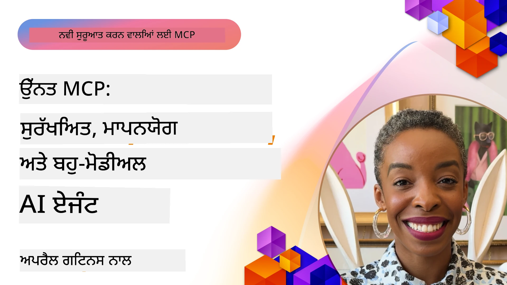

# MCP ਵਿੱਚ ਅੱਗੇ ਦੀਆਂ ਵਿਸ਼ੇਸ਼ੀਆਂ

_(ਇਸ ਪਾਠ ਦਾ ਵੀਡੀਓ ਵੇਖਣ ਲਈ ਉੱਪਰ ਦਿੱਤੀ ਤਸਵੀਰ 'ਤੇ ਕਲਿੱਕ ਕਰੋ)_

ਇਹ ਅਧਿਆਇ ਮਾਡਲ ਕੰਟੈਕਸਟ ਪ੍ਰੋਟੋਕੋਲ (MCP) ਕੰਮ ਵਿੱਚ ਅੱਗੇ ਦੀਆਂ ਵਿਸ਼ੇਸ਼ੀਆਂ ਨੂੰ ਕਵਰ ਕਰਦਾ ਹੈ, ਜਿਸ ਵਿੱਚ ਬਹੁ-ਮੋਡਲ ਇੰਟੀਗ੍ਰੇਸ਼ਨ, ਸਕੇਲਬਿਲਿਟੀ, ਸੁਰੱਖਿਆ ਦੀਆਂ ਸ਼੍ਰੇਸ਼ਠ ਪ੍ਰਥਾਵਾਂ, ਅਤੇ ਐਂਟਰਪ੍ਰਾਈਜ਼ ਇੰਟੀਗ੍ਰੇਸ਼ਨ ਸ਼ਾਮਿਲ ਹਨ। ਇਹ ਵਿਸ਼ੇ ਅਜਿਹੇ MCP ਐਪਲੀਕੇਸ਼ਨਾਂ ਨੂੰ ਬਣਾਉਣ ਲਈ ਲਾਜ਼ਮੀ ਹਨ ਜੋ ਆਧੁਨਿਕ AI ਪ੍ਰਣਾਲੀਆਂ ਦੀਆਂ ਮੰਗਾਂ ਨੂੰ ਪੂਰਾ ਕਰਨ ਦੇ ਯੋਗ ਹੋਣ।

## ਓਵਰਵਿਊ

ਇਹ ਪਾਠ MCP ਕਾਰਜਾਨਵਏਸ਼ ਵਿੱਚ ਅੱਗੇ ਦੇ ਸੰਕਲਪਾਂ ਦੀ ਪੜਚੋਲ ਕਰਦਾ ਹੈ, ਜ਼ੋਰ ਬਹੁ-ਮੋਡਲ ਇੰਟੀਗ੍ਰੇਸ਼ਨ, ਸਕੇਲਬਿਲਿਟੀ, ਸੁਰੱਖਿਆ ਦੀਆਂ ਸ਼੍ਰੇਸ਼ਠ ਪ੍ਰਥਾਵਾਂ, ਅਤੇ ਐਂਟਰਪ੍ਰਾਈਜ਼ ਇੰਟੀਗ੍ਰੇਸ਼ਨ ਉੱਤੇ ਹੈ। ਇਹ ਵਿਸ਼ੇ ਉਤਪਾਦਨ-ਗਰੇਡ MCP ਐਪਲੀਕੇਸ਼ਨਾਂ ਲਈ ਬਹੁਤ ਜ਼ਰੂਰੀ ਹਨ ਜੋ ਐਂਟਰਪ੍ਰਾਈਜ਼ ਵਾਤਾਵਰਣ ਵਿੱਚ ਜਟਿਲ ਮੰਗਾਂ ਨੂੰ ਸੰਭਾਲ ਸਕਣ।

## ਸਿੱਖਣ ਦੇ ਉਦੇਸ਼

ਇਸ ਪਾਠ ਦੇ ਅੰਤ ਤੱਕ, ਤੁਸੀਂ ਸਮਰੱਥ ਹੋਵੋਗੇ:

- MCP ਫ੍ਰੇਮਵਰਕ ਵਿੱਚ ਬਹੁ-ਮੋਡਲ ਸਮਰੱਥਾਵਾਂ ਲਾਗੂ ਕਰਨ ਲਈ
- ਉੱਚ ਮੰਗ ਵਾਲੇ ਹਾਲਾਤਾਂ ਲਈ ਸਕੇਲਬਲ MCP ਆਰਕੀਟੈਕਚਰ ਡਿਜ਼ਾਈਨ ਕਰਨ ਲਈ
- MCP ਦੀ ਸੁਰੱਖਿਆ ਨੀਤੀਆਂ ਦੇ ਅਨੁਕੂਲ ਸੁਰੱਖਿਆ ਦੀਆਂ ਸ਼੍ਰੇਸ਼ਠ ਪ੍ਰਥਾਵਾਂ ਲਾਗੂ ਕਰਨ ਲਈ
- MCP ਨੂੰ ਐਂਟਰਪ੍ਰਾਈਜ਼ AI ਪ੍ਰਣਾਲੀਆਂ ਅਤੇ ਫ੍ਰੇਮਵਰਕਾਂ ਨਾਲ ਜੋੜਨ ਲਈ
- ਉਤਪਾਦਨ ਵਾਤਾਵਰਣਾਂ ਵਿੱਚ ਕਾਰਗੁਜ਼ਾਰੀ ਅਤੇ ਭਰੋਸੇਯੋਗਤਾ ਨੂੰ ਢੰਗ ਨਾਲ ਸੁਧਾਰਨ ਲਈ

## ਪਾਠ ਅਤੇ ਨਮੂਨਾ ਪ੍ਰਾਜੈਕਟ

| ਲਿੰਕ | ਸਿਰਲੇਖ | ਵੇਰਵਾ |
|------|-------|-------------|
| [5.1 Integration with Azure](./mcp-integration/README.md) | Azure ਨਾਲ ਇੰਟੀਗ੍ਰੇਟ ਕਰੋ | ਆਪਣੇ MCP ਸਰਵਰ ਨੂੰ Azure ਤੇ ਇੰਟੀਗ੍ਰੇਟ ਕਰਨ ਬਾਰੇ ਸੀਖੋ |
| [5.2 Multi modal sample](./mcp-multi-modality/README.md) | MCP ਬਹੁ-ਮੋਡਲ ਨਮੂਨੇ | ਆਡੀਓ, ਚਿੱਤਰ ਅਤੇ ਬਹੁ-ਮੋਡਲ ਉੱਤਰਾਂ ਦੇ ਨਮੂਨੇ |
| [5.3 MCP OAuth2 sample](../../../05-AdvancedTopics/mcp-oauth2-demo) | MCP OAuth2 ਡੈਮੋ | ਘੱਟੋ-ਘੱਟ ਸਪ੍ਰਿੰਗ ਬੂਟ ਐਪ ਜੋ MCP ਦੇ OAuth2 ਨੂੰ ਦਿਖਾਉਂਦਾ ਹੈ, ਦੋਹਾਂ ਕਿਸੇ ਤਰ੍ਹਾਂ ਪ੍ਰਮਾਣਿਕਤਾ ਅਤੇ ਸਰੋਤ ਸਰਵਰ ਦੇ ਤੌਰ ਤੇ। ਸੁਰੱਖਿਅਤ ਟੋਕਨ ਜਾਰੀਕਰਨ, ਸੁਰੱਖਿਅਤ ਏਂਡਪੋਇੰਟ, ਐਜ਼ੂਰ ਕੰਟੇਨਰ ਐਪਸ ਡਿਪਲੌਇਮੈਂਟ ਅਤੇ API ਮੈਨੇਜਮੈਂਟ ਇੰਟੀਗ੍ਰੇਸ਼ਨ ਦਰਸਾਉਂਦਾ ਹੈ। |
| [5.4 Root Contexts](./mcp-root-contexts/README.md) | ਰੂਟ ਕਾਂਟੈਕਸਟ | ਰੂਟ ਕਾਂਟੈਕਸਟ ਬਾਰੇ ਵਧੇਰੇ ਜਾਣੋ ਅਤੇ ਇਹਨੂੰ ਕਿਵੇਂ ਲਾਗੂ ਕੀਤਾ ਜਾ ਸਕਦਾ ਹੈ |
| [5.5 Routing](./mcp-routing/README.md) | ਰਾਊਟਿੰਗ | ਵੱਖ-ਵੱਖ ਪ੍ਰਕਾਰ ਦੀਆਂ ਰਾਊਟਿੰਗ ਸਿੱਖੋ |
| [5.6 Sampling](./mcp-sampling/README.md) | ਸੈਂਪਲਿੰਗ | ਸੈਂਪਲਿੰਗ ਨਾਲ ਕੰਮ ਕਰਨ ਦਾ ਤਰੀਕਾ ਸਿੱਖੋ |
| [5.7 Scaling](./mcp-scaling/README.md) | ਸਕੇਲਿੰਗ  | ਸਕੇਲਿੰਗ ਬਾਰੇ ਜਾਣੋ |
| [5.8 Security](./mcp-security/README.md) | ਸੁਰੱਖਿਆ  | ਆਪਣੇ MCP ਸਰਵਰ ਦੀ ਸੁਰੱਖਿਆ ਕਰੋ |
| [5.9 Web Search sample](./web-search-mcp/README.md) | ਵੱਬ ਸર્ચ MCP | Python MCP ਸਰਵਰ ਅਤੇ ਕਲਾਇੰਟ ਜੋ SerpAPI ਨਾਲ ਰੀਅਲ-ਟਾਈਮ ਵੈੱਬ, ਸਮਾਚਾਰ, ਉਦਯੋਗ ਸੇਵਾਵਾਂ ਅਤੇ ਪ੍ਰਸ਼ਨ-ਉੱਤਰ ਲਈ ਇੰਟੀਗ੍ਰੇਟ ਹੁੰਦੇ ਹਨ। ਬਹੁ-ਟੂਲ ਸਮਰੂਪਤਾ, ਬਾਹਰੀ API ਇੰਟੀਗ੍ਰੇਸ਼ਨ ਅਤੇ ਮਜ਼ਬੂਤ ਗਲਤੀ ਸੰਭਾਲ ਸਿੱਖਾਉਂਦਾ ਹੈ। |
| [5.10 Realtime Streaming](./mcp-realtimestreaming/README.md) | ਸਟ੍ਰੀਮਿੰਗ  | ਰੀਅਲ-ਟਾਈਮ ਡੇਟਾ ਸਟ੍ਰੀਮਿੰਗ ਅੱਜ ਦੇ ਡੇਟਾ-ਚਲਿਤ ਦੁਨੀਆਂ ਵਿੱਚ ਜ਼ਰੂਰੀ ਹੋ ਗਿਆ ਹੈ, ਜਿੱਥੇ ਕਾਰੋਬਾਰ ਅਤੇ ਐਪਲੀਕੇਸ਼ਨਾਂ ਨੂੰ ਸਮੇਂ ਸਿਰ ਫੈਸਲੇ ਲੈਣ ਲਈ ਤੁਰੰਤ ਜਾਣਕਾਰੀ ਦੀ ਲੋੜ ਹੁੰਦੀ ਹੈ।|
| [5.11 Realtime Web Search](./mcp-realtimesearch/README.md) | ਵੈੱਬ ਸર્ચ | ਰੀਅਲ-ਟਾਈਮ ਵੈੱਬ ਖੋਜ ਜਿਥੇ MCP ਨਿਰਧਾਰਿਤ ਢੰਗ ਨਾਲ ਸੰਦਰਭ ਪ੍ਰਬੰਧਨ ਮੁਹੱਈਆ ਕਰਵਾਉਂਦਾ ਹੈ AI ਮਾਡਲਾਂ, ਖੋਜ ਇੰਜਨਾਂ ਅਤੇ ਐਪਲੀਕੇਸ਼ਨਾਂ ਵਿੱਚ।| 
| [5.12  Entra ID Authentication for Model Context Protocol Servers](./mcp-security-entra/README.md) | Entra ID ਪ੍ਰਮਾਣਿਕਤਾ | ਮਾਇਕ੍ਰੋਸੋਫਟ Entra ID ਇਕ ਮਜ਼ਬੂਤ ਕਲਾਉਡ-ਆਧਾਰਿਤ ਪਛਾਣ ਅਤੇ ਪਹੁੰਚ ਪ੍ਰਬੰਧਨ ਹੱਲ ਮੁਹੱਈਆ ਕਰਦਾ ਹੈ, ਜੋ ਇਹ ਯਕੀਨੀ ਬਣਾਉਂਦਾ ਹੈ ਕਿ ਸਿਰਫ ਪ੍ਰਮਾਣਿਤ ਉਪਭੋਗਤਾ ਅਤੇ ਐਪਲੀਕੇਸ਼ਨ ਹੀ MCP ਸਰਵਰ ਨਾਲ ਸੰਚਾਰ ਕਰ ਸਕਣ।|
| [5.13 Azure AI Foundry Agent Integration](./mcp-foundry-agent-integration/README.md) | Azure AI Foundry ਇੰਟੀਗ੍ਰੇਸ਼ਨ | ਮਾਡਲ ਕੰਟੈਕਸਟ ਪ੍ਰੋਟੋਕੋਲ ਸਰਵਰਾਂ ਨੂੰ Azure AI Foundry ਏਜੰਟਾਂ ਨਾਲ ਇੰਟੀਗ੍ਰੇਟ ਕਰਨ ਦਾ ਤਰੀਕਾ ਸਿੱਖੋ, ਜਿਸ ਨਾਲ ਸ਼ਕਤੀਸ਼ਾਲੀ ਟੂਲ ਸਮਰੂਪਤਾ ਅਤੇ ਐਂਟਰਪ੍ਰਾਈਜ਼ AI ਸਮਰੱਥਾਵਾਂ ਪ੍ਰਦਾਨ ਹੁੰਦੀਆਂ ਹਨ।|
| [5.14 Context Engineering](./mcp-contextengineering/README.md) | ਕੰਟੈਕਸਟ ਇੰਜੀਨੀਅਰਿੰਗ | MCP ਸਰਵਰਾਂ ਲਈ ਭਵਿੱਖ ਦੀ ਸੰਭਾਵਨਾ ਸੰਪਰਦਾਇਕ ਇੰਜੀਨੀਅਰਿੰਗ ਤਕਨੀਕਾਂ ਦੀ, ਜਿਸ ਵਿੱਚ ਕੰਟੈਕਸਟ ਸੁਧਾਰ, ਗਤੀਸ਼ੀਲ ਕੰਟੈਕਸਟ ਪਰਬੰਧਨ, ਅਤੇ MCP ਫ੍ਰੇਮਵਰਕਾਂ ਵਿੱਚ ਪ੍ਰਭਾਵਸ਼ਾਲੀ ਪ੍ਰੌਂਪਟ ਇੰਜੀਨੀਅਰਿੰਗ ਲਈ ਯੁਕਤੀਆਂ ਸ਼ਾਮਿਲ ਹਨ।|
| [5.15 MCP Custom Transport](./mcp-transport/README.md) | ਕਸਟਮ ਟ੍ਰਾਂਸਪੋਰਟ | ਵਿਸ਼ੇਸ਼ MCP ਸੰਚਾਰ ਦ੍ਰਿਸ਼ਟੀਕੋਣਾਂ ਲਈ ਕਸਟਮ ਟ੍ਰਾਂਸਪੋਰਟ ਯੰਤਰਾਂ ਨੂੰ ਲਾਗੂ ਕਰਨ ਦਾ ਤਰੀਕਾ ਸਿੱਖੋ।|
| [5.16 Protocol Features Deep Dive](./mcp-protocol-features/README.md) | ਪ੍ਰੋਟੋਕੋਲ ਫੀਚਰ | ਪ੍ਰਗਤੀ ਸੂਚਨਾਵਾਂ, ਬੇਨਤੀ ਰੱਦ ਕਰਨਾ, ਸਰੋਤ ਟੈਮਪਲੇਟ, ਅਤੇ ਗਲਤੀ ਸੰਭਾਲ ਪੈਟਰਨ ਸਮੇਤ ਉਨ੍ਨਤ ਪ੍ਰੋਟੋਕੋਲ ਫੀਚਰਾਂ ਵਿੱਚ ਨਿਪੁੰਨ ਹੋਵੋ।|

> **MCP ਵਿਸ਼ੇਸ਼ਤਾ ਵਿੱਚ ਨਵੀਂ (2025-11-25)**: ਹੁਣ ਵਿਸ਼ੇਸ਼ਤਾ 'ਚ ਪ੍ਰਯੋਗਾਤਮਕ ਸਹਾਇਤਾ ਸ਼ਾਮਿਲ ਹੈ **ਟਰਾਸਕਸ** (ਲੰਬੇ ਚੱਲਣ ਵਾਲੇ ਕਾਰਜ ਜਿਨ੍ਹਾਂ ਦੀ ਪ੍ਰਗਤੀ ਟ੍ਰੈਕ ਕੀਤੀ ਜਾਂਦੀ ਹੈ), **ਟੂਲ 注释** (ਆਧਾਰ ਸੁਰੱਖਿਆ ਲਈ ਸਾਫਟਵੇਅਰ ਵਾਵਰਨਾ ਬਾਰੇ ਮੈਟਾਡੇਟਾ), **URL ਮੋਡ ਇਲਿਸਿਟੇਸ਼ਨ** (ਕਲਾਇੰਟਾਂ ਤੋਂ ਖਾਸ URL ਸਮੱਗਰੀ ਦੀ ਮੰਗ), ਅਤੇ ਸ਼ਕਤੀਸ਼ਾਲੀ **ਰੂਟਸ** (ਵਰਕਸਪੇਸ ਕੰਟੈਕਸਟ ਪ੍ਰਬੰਧਨ ਲਈ)। ਪੂਰੀ ਜਾਣਕਾਰੀ ਲਈ [MCP ਵਿਸ਼ੇਸ਼ਤਾ ਚੇਂਜਲੌਗ](https://spec.modelcontextprotocol.io/) ਵੇਖੋ।

## ਵਾਧੂ ਹਵਾਲੇ

ਅੱਗੇ ਦੇ MCP ਵਿਸ਼ਿਆਂ ਬਾਰੇ ਸਭ ਤੋਂ ਅੱਪ-ਟੂ-ਡੇਟ ਜਾਣਕਾਰੀ ਲਈ:
- [MCP ਦਸਤਾਵੇਜ਼](https://modelcontextprotocol.io/)
- [MCP ਵਿਸ਼ੇਸ਼ਤਾ (2025-11-25)](https://spec.modelcontextprotocol.io/specification/2025-11-25/)
- [GitHub ਰਿਪੋਜ਼ਟਰੀ](https://github.com/modelcontextprotocol)
- [OWASP MCP ਟੌਪ 10](https://microsoft.github.io/mcp-azure-security-guide/mcp/) - ਸੁਰੱਖਿਆ ਖਤਰਿਆਂ ਅਤੇ ਉਪਾਅ
- [MCP ਸੁਰੱਖਿਆ ਸਮੀਟ ਵਰਕਸ਼ਾਪ (ਸ਼ੇਰਪਾ)](https://azure-samples.github.io/sherpa/) - ਹੈਂਡਸ-ਆਨ ਸੁਰੱਖਿਆ ਟ੍ਰੇਨਿੰਗ

## ਮੁੱਖ ਸਿੱਖਣ ਵਾਲੀਆਂ ਗੱਲਾਂ

- ਬਹੁ-ਮੋਡਲ MCP ਲਾਗੂਅੰਦਾਜ਼ AI ਸਮਰੱਥਾਵਾਂ ਨੂੰ ਲਿਖਤੀ ਪ੍ਰਕਿਰਿਆ ਤੋਂ ਬਾਹਰ ਲੈ ਜਾਂਦਾ ਹੈ
- ਸਕੇਲਬਿਲਿਟੀ ਐਂਟਰਪ੍ਰਾਈਜ਼ ਤੈਨਾਤੀਆਂ ਲਈ ਜ਼ਰੂਰੀ ਹੈ ਅਤੇ ਇਹ ਹੌਰਿਜ਼ਾਂਟਲ ਅਤੇ ਵਰਟੀਕਲ ਦੋਨੋਂ ਤਰ੍ਹਾਂ ਸੰਭਾਲਿਆ ਜਾ ਸਕਦਾ ਹੈ
- ਵਿਆਪਕ ਸੁਰੱਖਿਆ ਉਪਾਅ ਡੇਟਾ ਦੀ ਰੱਖਿਆ ਕਰਦੇ ਹਨ ਅਤੇ ਢੰਗ ਨਾਲ ਪਹੁੰਚ ਨਿਯੰਤਰਣ ਯਕੀਨੀ ਬਣਾਉਂਦੇ ਹਨ
- ਐਂਟਰਪ੍ਰਾਈਜ਼ ਇੰਟੀਗ੍ਰੇਸ਼ਨ ਜਿਵੇਂ ਕਿ Azure OpenAI ਅਤੇ Microsoft AI Foundry ਨਾਲ MCP ਸਮਰੱਥਾਵਾਂ ਨੂੰ ਵਧਾਉਂਦਾ ਹੈ
- ਅੱਗੇ ਵਧੀਆ MCP ਲਾਗੂਅੰਦਾਜ਼ ਸੁਧਾਰਤ ਆਰਕੀਟੈਕਚਰ ਅਤੇ ਧਿਆਨ ਨਾਲ ਸਰੋਤ ਪ੍ਰਬੰਧਨ ਤੋਂ ਲਾਭ ਪ੍ਰਾਪਤ ਹੁੰਦੇ ਹਨ

## ਅਭਿਆਸ

ਕਿਸੇ ਖਾਸ ਵਰਤੋਂ ਮਾਮਲੇ ਲਈ ਐਂਟਰਪ੍ਰਾਈਜ਼-ਗਰੇਡ MCP ਲਾਗੂਅੰਦਾਜ਼ ਡਿਜ਼ਾਈਨ ਕਰੋ:

1. ਆਪਣੇ ਵਰਤੋਂ ਮਾਮਲੇ ਲਈ ਬਹੁ-ਮੋਡਲ ਮੰਗਾਂ ਦੀ ਪਹਿਚਾਣ ਕਰੋ
2. ਸੰਵੇਦਨਸ਼ੀਲ ਡੇਟਾ ਦੀ ਸੁਰੱਖਿਆ ਲਈ ਲੋੜੀਂਦੇ ਸੁਰੱਖਿਆ ਨਿਯੰਤਰਣ ਰੂਪਰੇਖਾ ਤਿਆਰ ਕਰੋ
3. ਬਦਲਦੇ ਬੋਝ ਨਾਲ ਨਿਬਟਣ ਲਈ ਸਕੇਲਏਬਲ ਆਰਕੀਟੈਕਚਰ ਡਿਜ਼ਾਈਨ ਕਰੋ
4. ਐਂਟਰਪ੍ਰਾਈਜ਼ AI ਪ੍ਰਣਾਲੀਆਂ ਨਾਲ ਇੰਟੀਗ੍ਰੇਸ਼ਨ ਬਿੰਦੂਆਂ ਦੀ ਯੋਜਨਾ ਬਣਾਓ
5. ਸਮਭਾਵੀ ਕਾਰਗੁਜ਼ਾਰੀ ਭੱਜਾਵਾਂ ਅਤੇ ਉਪਚਾਰ ਯੁਕਤੀਆਂ ਦਸਤਾਵੇਜ਼ ਕਰੋ

## ਵਾਧੂ ਸਰੋਤ

- [Azure OpenAI ਦਸਤਾਵੇਜ਼](https://learn.microsoft.com/en-us/azure/ai-services/openai/)
- [Microsoft AI Foundry ਦਸਤਾਵੇਜ਼](https://learn.microsoft.com/en-us/ai-services/)

---

## ਅਗਲਾ ਕੀ ਹੈ

ਇਸ ਮੋਡੀਊਲ ਦੇ ਪਾਠਾਂ ਦੀ ਪੜਚੋਲ ਸ਼ੁਰੂ ਕਰੋ: [5.1 MCP ਇੰਟੀਗ੍ਰੇਸ਼ਨ](./mcp-integration/README.md)

ਇਹ ਮੋਡੀਊਲ ਪੂਰਾ ਕਰਨ ਤੋਂ ਬਾਅਦ, جاري ਰੱਖੋ: [ਮੋਡੀਊਲ 6: ਕਮੇਊਨਿਟੀ ਯੋਗਦਾਨ](../06-CommunityContributions/README.md)

---

<!-- CO-OP TRANSLATOR DISCLAIMER START -->
**ਅਸਵੀਕਾਰੋक्ति**:  
ਇਹ ਦਸਤਾਵੇਜ਼ AI ਅਨੁਵਾਦ ਸੇਵਾ [Co-op Translator](https://github.com/Azure/co-op-translator) ਦੀ ਵਰਤੋਂ ਨਾਲ ਅਨੁਵਾਦਿਤ ਕੀਤਾ ਗਿਆ ਹੈ। ਜਦੋਂ ਕਿ ਅਸੀਂ ਸ਼ੁੱਧਤਾ ਲਈ ਕੋਸ਼ਿਸ਼ ਕਰਦੇ ਹਾਂ, ਕਿਰਪਾ ਕਰਕੇ ਧਿਆਨ ਦਿਉ ਕਿ ਸਵੈਚਾਲਿਤ ਅਨੁਵਾਦਾਂ ਵਿੱਚ ਗਲਤੀਆਂ ਜਾਂ ਅਸੂਚਨਾਵਾਂ ਹੋ ਸਕਦੀਆਂ ਹਨ। ਮੂਲ ਦਸਤਾਵੇਜ਼ ਆਪਣੀ ਮੂਲ ਭਾਸ਼ਾ ਵਿੱਚ ਪ੍ਰਮਾਣਿਕ ਸਰੋਤ ਵਜੋਂ ਮੰਨਿਆ ਜਾਣਾ ਚਾਹੀਦਾ ਹੈ। ਜਰੂਰੀ ਜਾਣਕਾਰੀ ਲਈ, ਪੇਸ਼ੇਵਰ ਮਨੁੱਖੀ ਅਨੁਵਾਦ ਦੀ ਸਿਫਾਰਿਸ਼ ਕੀਤੀ ਜਾਂਦੀ ਹੈ। ਅਸੀਂ ਇਸ ਅਨੁਵਾਦ ਦੀ ਵਰਤੋਂ ਨਾਲ ਪੈਦਾ ਹੋਣ ਵਾਲੀਆਂ ਕਿਸੇ ਵੀ ਗਲਤਫਹਿਮੀਆਂ ਜਾਂ ਗਲਤ ਵਿਆਖਿਆਵਾਂ ਲਈ ਜ਼ਿੰਮੇਵਾਰ ਨਹੀਂ ਹਾਂ।
<!-- CO-OP TRANSLATOR DISCLAIMER END -->