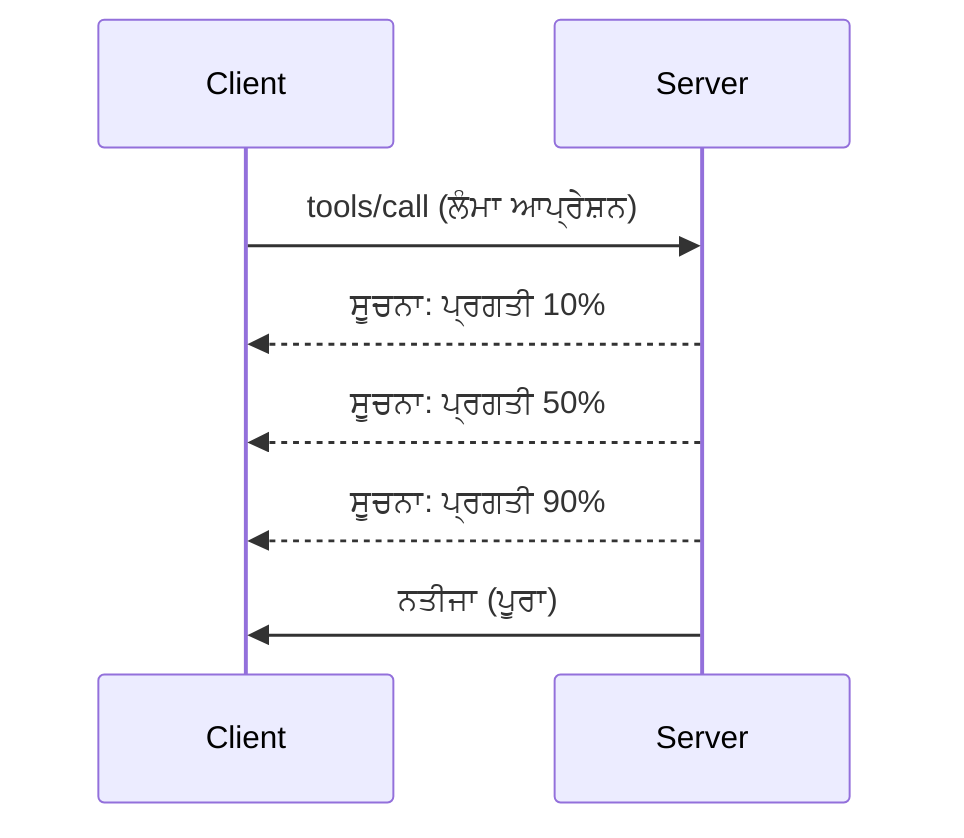

# MCP ਪ੍ਰੋਟੋਕੋਲ ਫੀਚਰ ਡੂੰਘਾਈ ਨਾਲ ਸਮਝਣਾ

ਇਹ ਗਾਈਡ ਬੁਨਿਆਦੀ ਟੂਲ ਅਤੇ ਸਾਧਨ ਸੰਭਾਲ ਤੋਂ ਅੱਗੇ ਜਾਣ ਵਾਲੇ ਉन्नਤ MCP ਪ੍ਰੋਟੋਕੋਲ ਫੀਚਰਾਂ ਦੀ ਜਾਂਚ ਕਰਦੀ ਹੈ। ਇਹ ਫੀਚਰ ਸਮਝਨਾ ਤੁਹਾਨੂੰ ਹੋਰ ਮਜ਼ਬੂਤ, ਉਪਭੋਗਤਾ-ਮਿੱਤਰ ਅਤੇ ਉਤਪਾਦਨ-ਤਿਆਰ MCP ਸਰਵਰ ਬਣਾਉਣ ਵਿੱਚ ਮਦਦ ਕਰਦਾ ਹੈ।

## ਫੀਚਰ ਕਵਰ ਕੀਤੇ ਗਏ

1. **ਪ੍ਰੋਗਰੈੱਸ ਸੂਚਨਾਵਾਂ** - ਲੰਬੇ ਸਮੇਂ ਚੱਲ ਰਹੀਆਂ ਕਾਰਵਾਈਆਂ ਲਈ ਪ੍ਰਗਤੀ ਦੀ ਸੂਚਨਾ ਦਿਓ
2. **ਬੇਨਤੀ ਰੱਦਗੀ** - ਕਲਾਇੰਟਾਂ ਨੂੰ ਚੱਲ ਰਹੀਆਂ ਬੇਨਤੀਆਂ ਰੱਦ ਕਰਨ ਦੀ ਆਗਿਆ ਦਿਓ
3. **ਸਾਧਨ ਟੈਮਪਲੇਟਸ** - ਪੈਰਾਮੀਟਰਾਂ ਨਾਲ ਗਤੀਸ਼ੀਲ ਸਾਧਨ URI
4. **ਸਰਵਰ ਲਾਈਫਸਾਈਕਲ ਇਵੈਂਟਸ** - ਢੰਗ ਨਾਲ ਸ਼ੁਰੂਅਾਤ ਅਤੇ ਬੰਦ ਕਰੋ
5. **ਲੌਗਿੰਗ ਕੰਟਰੋਲ** - ਸਰਵਰ-ਪਾਸੇ ਲੌਗਿੰਗ ਸੰਰਚਨਾ
6. **ਗਲਤੀ ਸੰਭਾਲਣ ਦੇ ਨਮੂਨੇ** - ਇਕਸਾਰ ਗਲਤੀ ਜਵਾਬ

---

## 1. ਪ੍ਰੋਗਰੈੱਸ ਸੂਚਨਾਵਾਂ

ਜੇਕਰ ਕਾਰਵਾਈਆਂ ਵਿੱਚ ਸਮਾਂ ਲੱਗਦਾ ਹੈ (ਡਾਟਾ ਪ੍ਰੋਸੈਸਿੰਗ, ਫਾਇਲ ਡਾਊਨਲੋਡ, API ਕਾਲ), ਤਾਂ ਪ੍ਰੋਗਰੈੱਸ ਸੂਚਨਾਵਾਂ ਉਪਭੋਗਤਾਵਾਂ ਨੂੰ ਜਾਣੂ ਰੱਖਦੀਆਂ ਹਨ।

### ਇਹ ਕਿਵੇਂ ਕੰਮ ਕਰਦਾ ਹੈ


### Python ਇੰਪਲੀਮੈਂਟੇਸ਼ਨ

```python
from mcp.server import Server, NotificationOptions
from mcp.types import ProgressNotification
import asyncio

app = Server("progress-server")

@app.tool()
async def process_large_file(file_path: str, ctx) -> str:
    """Process a large file with progress updates."""
    
    # ਪ੍ਰਗਤੀ ਗਣਨਾ ਲਈ ਫਾਇਲ ਦਾ ਆਕਾਰ ਪ੍ਰਾਪਤ ਕਰੋ
    file_size = os.path.getsize(file_path)
    processed = 0
    
    with open(file_path, 'rb') as f:
        while chunk := f.read(8192):
            # ਚੰਕ ਨੂੰ ਪ੍ਰਕਿਰਿਆ ਕਰੋ
            await process_chunk(chunk)
            processed += len(chunk)
            
            # ਪ੍ਰਗਤੀ ਸੂਚਨਾ ਭੇਜੋ
            progress = (processed / file_size) * 100
            await ctx.send_notification(
                ProgressNotification(
                    progressToken=ctx.request_id,
                    progress=progress,
                    total=100,
                    message=f"Processing: {progress:.1f}%"
                )
            )
    
    return f"Processed {file_size} bytes"

@app.tool()
async def batch_operation(items: list[str], ctx) -> str:
    """Process multiple items with progress."""
    
    results = []
    total = len(items)
    
    for i, item in enumerate(items):
        result = await process_item(item)
        results.append(result)
        
        # ਹਰ ਇਕ ਆਈਟਮ ਤੋਂ ਬਾਅਦ ਪ੍ਰਗਤੀ ਦੀ ਰਿਪੋਰਟ ਕਰੋ
        await ctx.send_notification(
            ProgressNotification(
                progressToken=ctx.request_id,
                progress=i + 1,
                total=total,
                message=f"Processed {i + 1}/{total}: {item}"
            )
        )
    
    return f"Completed {total} items"
```

### TypeScript ਇੰਪਲੀਮੈਂਟੇਸ਼ਨ

```typescript
import { Server } from "@modelcontextprotocol/sdk/server/index.js";

server.setRequestHandler(CallToolSchema, async (request, extra) => {
  const { name, arguments: args } = request.params;
  
  if (name === "process_data") {
    const items = args.items as string[];
    const results = [];
    
    for (let i = 0; i < items.length; i++) {
      const result = await processItem(items[i]);
      results.push(result);
      
      // ਪ੍ਰਗਤੀ ਸੂਚਨਾ ਭੇਜੋ
      await extra.sendNotification({
        method: "notifications/progress",
        params: {
          progressToken: request.id,
          progress: i + 1,
          total: items.length,
          message: `Processing item ${i + 1}/${items.length}`
        }
      });
    }
    
    return { content: [{ type: "text", text: JSON.stringify(results) }] };
  }
});
```

### ਕਲਾਇੰਟ ਸੰਭਾਲ (Python)

```python
async def handle_progress(notification):
    """Handle progress notifications from server."""
    params = notification.params
    print(f"Progress: {params.progress}/{params.total} - {params.message}")

# ਹੈਂਡਲਰ ਰਜਿਸਟਰ ਕਰੋ
session.on_notification("notifications/progress", handle_progress)

# ਟੂਲ ਕਾਲ ਕਰੋ (ਪ੍ਰਗਤੀ ਅਪਡੇਟ ਹਨਡਲਰ ਰਾਹੀਂ ਆਈਂਗੇ)
result = await session.call_tool("process_large_file", {"file_path": "/data/large.csv"})
```

---

## 2. ਬੇਨਤੀ ਰੱਦਗੀ

ਕਲਾਇੰਟਾਂ ਨੂੰ ਉਹਨਾਂ ਬੇਨਤੀਆਂ ਨੂੰ ਰੱਦ ਕਰਨ ਦਿਓ ਜੋ ਹੁਣ ਲੋੜੀਂਦੀਆਂ ਨਹੀਂ ਜਾਂ ਜ਼ਿਆਦਾ ਸਮਾਂ ਲੈ ਰਹੀਆਂ ਹਨ।

### Python ਇੰਪਲੀਮੈਂਟੇਸ਼ਨ

```python
from mcp.server import Server
from mcp.types import CancelledError
import asyncio

app = Server("cancellable-server")

@app.tool()
async def long_running_search(query: str, ctx) -> str:
    """Search that can be cancelled."""
    
    results = []
    
    try:
        for page in range(100):  # ਬਹੁਤ ਸਾਰੀਆਂ ਪੰਨਿਆਂ ਵਿੱਚ ਖੋਜ ਕਰੋ
            # ਜਾਂਚੋ ਕਿ ਰੱਦ ਕਰਨ ਦੀ ਬੇਨਤੀ ਕੀਤੀ ਗਈ ਸੀ ਜਾਂ ਨਹੀਂ
            if ctx.is_cancelled:
                raise CancelledError("Search cancelled by user")
            
            # ਪੰਨਾ ਖੋਜ ਦਾ ਨਕਲ ਬਣਾ ਕੇ ਦਿਖਾਓ
            page_results = await search_page(query, page)
            results.extend(page_results)
            
            # ਛੋਟਾ ਦੇਰੀ ਰੱਦ ਕਰਨ ਦੀ ਜਾਂਚ ਕਰਨ ਦੀ ਆਗਿਆ ਦਿੰਦੀ ਹੈ
            await asyncio.sleep(0.1)
            
    except CancelledError:
        # ਅਧੂਰੇ ਨਤੀਜੇ ਵਾਪਸ ਕਰੋ
        return f"Cancelled. Found {len(results)} results before cancellation."
    
    return f"Found {len(results)} total results"

@app.tool()
async def download_file(url: str, ctx) -> str:
    """Download with cancellation support."""
    
    async with aiohttp.ClientSession() as session:
        async with session.get(url) as response:
            total_size = int(response.headers.get('content-length', 0))
            downloaded = 0
            chunks = []
            
            async for chunk in response.content.iter_chunked(8192):
                if ctx.is_cancelled:
                    return f"Download cancelled at {downloaded}/{total_size} bytes"
                
                chunks.append(chunk)
                downloaded += len(chunk)
            
            return f"Downloaded {downloaded} bytes"
```

### ਰੱਦਗੀ ਸੰਦਰਭ ਲਾਗੂ ਕਰਨਾ

```python
class CancellableContext:
    """Context object that tracks cancellation state."""
    
    def __init__(self, request_id: str):
        self.request_id = request_id
        self._cancelled = asyncio.Event()
        self._cancel_reason = None
    
    @property
    def is_cancelled(self) -> bool:
        return self._cancelled.is_set()
    
    def cancel(self, reason: str = "Cancelled"):
        self._cancel_reason = reason
        self._cancelled.set()
    
    async def check_cancelled(self):
        """Raise if cancelled, otherwise continue."""
        if self.is_cancelled:
            raise CancelledError(self._cancel_reason)
    
    async def sleep_or_cancel(self, seconds: float):
        """Sleep that can be interrupted by cancellation."""
        try:
            await asyncio.wait_for(
                self._cancelled.wait(),
                timeout=seconds
            )
            raise CancelledError(self._cancel_reason)
        except asyncio.TimeoutError:
            pass  # ਸਧਾਰਣ ਸਮਿਆਂਤਮਿਕਤਾ, ਜਾਰੀ ਰੱਖੋ
```

### ਕਲਾਇੰਟ-ਪਾਸੇ ਰੱਦਗੀ

```python
import asyncio

async def search_with_timeout(session, query, timeout=30):
    """Search with automatic cancellation on timeout."""
    
    task = asyncio.create_task(
        session.call_tool("long_running_search", {"query": query})
    )
    
    try:
        result = await asyncio.wait_for(task, timeout=timeout)
        return result
    except asyncio.TimeoutError:
        # ਬੇਨਤੀ ਰੱਦ ਕਰੋ
        await session.send_notification({
            "method": "notifications/cancelled",
            "params": {"requestId": task.request_id, "reason": "Timeout"}
        })
        return "Search timed out"
```

---

## 3. ਸਾਧਨ ਟੈਮਪਲੇਟਸ

ਸਾਧਨ ਟੈਮਪਲੇਟਸ ਪੈਰਾਮੀਟਰਾਂ ਨਾਲ ਗਤੀਸ਼ੀਲ URI ਬਣਾਉਣ ਦੀ ਆਗਿਆ ਦਿੰਦੀਆਂ ਹਨ, ਜੋ API ਅਤੇ ਡੇਟਾਬੇਸ ਲਈ ਲਾਭਦਾਇਕ ਹੈ।

### ਟੈਮਪਲੇਟ ਪਰਿਭਾਸ਼ਿਤ ਕਰਨਾ

```python
from mcp.server import Server
from mcp.types import ResourceTemplate

app = Server("template-server")

@app.list_resource_templates()
async def list_templates() -> list[ResourceTemplate]:
    """Return available resource templates."""
    return [
        ResourceTemplate(
            uriTemplate="db://users/{user_id}",
            name="User Profile",
            description="Fetch user profile by ID",
            mimeType="application/json"
        ),
        ResourceTemplate(
            uriTemplate="api://weather/{city}/{date}",
            name="Weather Data",
            description="Historical weather for city and date",
            mimeType="application/json"
        ),
        ResourceTemplate(
            uriTemplate="file://{path}",
            name="File Content",
            description="Read file at given path",
            mimeType="text/plain"
        )
    ]

@app.read_resource()
async def read_resource(uri: str) -> str:
    """Read resource, expanding template parameters."""
    
    # ਪੈਰਾਮੀਟਰਾਂ ਨੂੰ ਕੱਢਣ ਲਈ URI ਨੂੰ ਵਿਸ਼ਲੇਸ਼ਣ ਕਰੋ
    if uri.startswith("db://users/"):
        user_id = uri.split("/")[-1]
        return await fetch_user(user_id)
    
    elif uri.startswith("api://weather/"):
        parts = uri.replace("api://weather/", "").split("/")
        city, date = parts[0], parts[1]
        return await fetch_weather(city, date)
    
    elif uri.startswith("file://"):
        path = uri.replace("file://", "")
        return await read_file(path)
    
    raise ValueError(f"Unknown resource URI: {uri}")
```

### TypeScript ਇੰਪਲੀਮੈਂਟੇਸ਼ਨ

```typescript
server.setRequestHandler(ListResourceTemplatesSchema, async () => {
  return {
    resourceTemplates: [
      {
        uriTemplate: "github://repos/{owner}/{repo}/issues/{issue_number}",
        name: "GitHub Issue",
        description: "Fetch a specific GitHub issue",
        mimeType: "application/json"
      },
      {
        uriTemplate: "db://tables/{table}/rows/{id}",
        name: "Database Row",
        description: "Fetch a row from a database table",
        mimeType: "application/json"
      }
    ]
  };
});

server.setRequestHandler(ReadResourceSchema, async (request) => {
  const uri = request.params.uri;
  
  // GitHub ਇਸ਼ੂ URI ਨੂੰ ਵਿਸ਼ਲੇਸ਼ਣ ਕਰੋ
  const githubMatch = uri.match(/^github:\/\/repos\/([^/]+)\/([^/]+)\/issues\/(\d+)$/);
  if (githubMatch) {
    const [_, owner, repo, issueNumber] = githubMatch;
    const issue = await fetchGitHubIssue(owner, repo, parseInt(issueNumber));
    return {
      contents: [{
        uri,
        mimeType: "application/json",
        text: JSON.stringify(issue, null, 2)
      }]
    };
  }
  
  throw new Error(`Unknown resource URI: ${uri}`);
});
```

---

## 4. ਸਰਵਰ ਲਾਈਫਸਾਈਕਲ ਇਵੈਂਟਸ

ਢੰਗ ਨਾਲ ਸ਼ੁਰੂਅਾਤ ਅਤੇ ਬੰਦ ਕਰਨ ਨਾਲ ਸਾਫ਼-ਸੁਥਰਾ ਸਾਧਨ ਪ੍ਰਬੰਧਨ ਨਿਸ਼ਚਿਤ ਹੁੰਦਾ ਹੈ।

### Python ਲਾਈਫਸਾਈਕਲ ਪ੍ਰਬੰਧਨ

```python
from mcp.server import Server
from contextlib import asynccontextmanager

app = Server("lifecycle-server")

# ਸਾਂਝੀ ਸਥਿਤੀ
db_connection = None
cache = None

@asynccontextmanager
async def lifespan(server: Server):
    """Manage server lifecycle."""
    global db_connection, cache
    
    # ਸ਼ੁਰੂਆਤ
    print("🚀 Server starting...")
    db_connection = await create_database_connection()
    cache = await create_cache_client()
    print("✅ Resources initialized")
    
    yield  # ਸਰਵਰ ਇੱਥੇ ਚੱਲਦਾ ਹੈ
    
    # ਬੰਦ ਕਰਨਾ
    print("🛑 Server shutting down...")
    await db_connection.close()
    await cache.close()
    print("✅ Resources cleaned up")

app = Server("lifecycle-server", lifespan=lifespan)

@app.tool()
async def query_database(sql: str) -> str:
    """Use the shared database connection."""
    result = await db_connection.execute(sql)
    return str(result)
```

### TypeScript ਲਾਈਫਸਾਈਕਲ

```typescript
import { Server } from "@modelcontextprotocol/sdk/server/index.js";

class ManagedServer {
  private server: Server;
  private dbConnection: DatabaseConnection | null = null;
  
  constructor() {
    this.server = new Server({
      name: "lifecycle-server",
      version: "1.0.0"
    });
    
    this.setupHandlers();
  }
  
  async start() {
    // ਸਾਧਨਾਂ ਨੂੰ ਸ਼ੁਰੂ ਕਰੋ
    console.log("🚀 Server starting...");
    this.dbConnection = await createDatabaseConnection();
    console.log("✅ Database connected");
    
    // ਸਰਵਰ ਸ਼ੁਰੂ ਕਰੋ
    await this.server.connect(transport);
  }
  
  async stop() {
    // ਸਾਧਨਾਂ ਨੂੰ ਸਾਫ ਕਰੋ
    console.log("🛑 Server shutting down...");
    if (this.dbConnection) {
      await this.dbConnection.close();
    }
    await this.server.close();
    console.log("✅ Cleanup complete");
  }
  
  private setupHandlers() {
    this.server.setRequestHandler(CallToolSchema, async (request) => {
      // ਇਹ.dbConnection ਨੂੰ ਸੁਰੱਖਿਅਤ ਤੌਰ 'ਤੇ ਵਰਤੋ
      // ...
    });
  }
}

// ਨਰਮ ਬੰਦ ਕਰਨ ਨਾਲ ਵਰਤੋਂ
const server = new ManagedServer();

process.on('SIGINT', async () => {
  await server.stop();
  process.exit(0);
});

await server.start();
```

---

## 5. ਲੌਗਿੰਗ ਕੰਟਰੋਲ

MCP ਸਰਵਰ-ਪਾਸੇ ਲੌਗਿੰਗ ਲੈਵਲ ਨਾਲ ਸਹਿਯੋਗ ਦਿੰਦਾ ਹੈ ਜਿਹੜੇ ਕਲਾਇੰਟਾਂ ਦੁਆਰਾ ਨਿਯੰਤਰਿਤ ਕੀਤੇ ਜਾ ਸਕਦੇ ਹਨ।

### ਲੌਗਿੰਗ ਲੈਵਲ ਲਾਗੂ ਕਰਨਾ

```python
from mcp.server import Server
from mcp.types import LoggingLevel
import logging

app = Server("logging-server")

# MCP ਲੈਵਲਾਂ ਨੂੰ ਪਾਇਥਨ ਲੌਗਿੰਗ ਲੈਵਲਾਂ ਨਾਲ ਮੇਪ ਕਰੋ
LEVEL_MAP = {
    LoggingLevel.DEBUG: logging.DEBUG,
    LoggingLevel.INFO: logging.INFO,
    LoggingLevel.WARNING: logging.WARNING,
    LoggingLevel.ERROR: logging.ERROR,
}

logger = logging.getLogger("mcp-server")

@app.set_logging_level()
async def set_logging_level(level: LoggingLevel) -> None:
    """Handle client request to change logging level."""
    python_level = LEVEL_MAP.get(level, logging.INFO)
    logger.setLevel(python_level)
    logger.info(f"Logging level set to {level}")

@app.tool()
async def debug_operation(data: str) -> str:
    """Tool with various logging levels."""
    logger.debug(f"Processing data: {data}")
    
    try:
        result = process(data)
        logger.info(f"Successfully processed: {result}")
        return result
    except Exception as e:
        logger.error(f"Processing failed: {e}")
        raise
```

### ਕਲਾਇੰਟ ਨੂੰ ਲੌਗ ਸੁਨੇਹੇ ਭੇਜਣਾ

```python
@app.tool()
async def complex_operation(input: str, ctx) -> str:
    """Operation that logs to client."""
    
    # ਲੋਗ ਸੂਚਨਾ ਗ੍ਰਾਹਕ ਨੂੰ ਭੇਜੋ
    await ctx.send_log(
        level="info",
        message=f"Starting complex operation with input: {input}"
    )
    
    # ਕੰਮ ਕਰੋ...
    result = await do_work(input)
    
    await ctx.send_log(
        level="debug",
        message=f"Operation complete, result size: {len(result)}"
    )
    
    return result
```

---

## 6. ਗਲਤੀ ਸੰਭਾਲਣ ਦੇ ਨਮੂਨੇ

ਇਕਸਾਰ ਗਲਤੀ ਸੰਭਾਲਣ ਡੀਬੱਗਿੰਗ ਅਤੇ ਉਪਭੋਗਤਾ ਅਨੁਭਵ ਸੁਧਾਰਦਾ ਹੈ।

### MCP ਗਲਤੀ ਕੋਡ

```python
from mcp.types import McpError, ErrorCode

class ToolError(McpError):
    """Base class for tool errors."""
    pass

class ValidationError(ToolError):
    """Invalid input parameters."""
    def __init__(self, message: str):
        super().__init__(ErrorCode.INVALID_PARAMS, message)

class NotFoundError(ToolError):
    """Requested resource not found."""
    def __init__(self, resource: str):
        super().__init__(ErrorCode.INVALID_REQUEST, f"Not found: {resource}")

class PermissionError(ToolError):
    """Access denied."""
    def __init__(self, action: str):
        super().__init__(ErrorCode.INVALID_REQUEST, f"Permission denied: {action}")

class InternalError(ToolError):
    """Internal server error."""
    def __init__(self, message: str):
        super().__init__(ErrorCode.INTERNAL_ERROR, message)
```

### ਸੰਰਚਿਤ ਗਲਤੀ ਜਵਾਬ

```python
@app.tool()
async def safe_operation(input: str) -> str:
    """Tool with comprehensive error handling."""
    
    # ਇਨਪੁਟ ਨੂੰ ਵੈਧ ਕਰੋ
    if not input:
        raise ValidationError("Input cannot be empty")
    
    if len(input) > 10000:
        raise ValidationError(f"Input too large: {len(input)} chars (max 10000)")
    
    try:
        # ਅਧਿਕਾਰਾਂ ਦੀ ਜਾਂਚ ਕਰੋ
        if not await check_permission(input):
            raise PermissionError(f"read {input}")
        
        # ਕਾਰਵਾਈ ਕਰੋ
        result = await perform_operation(input)
        
        if result is None:
            raise NotFoundError(input)
        
        return result
        
    except ConnectionError as e:
        raise InternalError(f"Database connection failed: {e}")
    except TimeoutError as e:
        raise InternalError(f"Operation timed out: {e}")
    except Exception as e:
        # ਅਣਪੇਖੇ ਤਰੁਟੀਆਂ ਨੂੰ ਲੌਗ ਕਰੋ
        logger.exception(f"Unexpected error in safe_operation")
        raise InternalError(f"Unexpected error: {type(e).__name__}")
```

### TypeScript ਵਿੱਚ ਗਲਤੀ ਸੰਭਾਲਣ

```typescript
import { McpError, ErrorCode } from "@modelcontextprotocol/sdk/types.js";

function validateInput(data: unknown): asserts data is ValidInput {
  if (typeof data !== "object" || data === null) {
    throw new McpError(
      ErrorCode.InvalidParams,
      "Input must be an object"
    );
  }
  // ਹੋਰ ਪ੍ਰਮਾਣਿਕਤਾ...
}

server.setRequestHandler(CallToolSchema, async (request) => {
  try {
    validateInput(request.params.arguments);
    
    const result = await performOperation(request.params.arguments);
    
    return {
      content: [{ type: "text", text: JSON.stringify(result) }]
    };
    
  } catch (error) {
    if (error instanceof McpError) {
      throw error;  // ਪਹਿਲਾਂ ਹੀ ਇੱਕ ਐਮਸੀਪੀ ਗਲਤੀ
    }
    
    // ਹੋਰ ਗਲਤੀਆਂ ਬਦਲੋ
    if (error instanceof NotFoundError) {
      throw new McpError(ErrorCode.InvalidRequest, error.message);
    }
    
    // ਅਣਜਾਣ ਗਲਤੀ
    console.error("Unexpected error:", error);
    throw new McpError(
      ErrorCode.InternalError,
      "An unexpected error occurred"
    );
  }
});
```

---

## ਪ੍ਰਯੋਗਤਮਕ ਫੀਚਰ (MCP 2025-11-25)

ਇਹ ਫੀਚਰ ਵਿਸ਼ੇਸ਼ਤਾਵਾਂ ਵਿੱਚ ਪ੍ਰਯੋਗਤਮਕ ਵਜੋਂ ਨਿਸ਼ਾਨਦੇਹ ਹਨ:

### ਕਾਰਜ (ਲੰਬੇ ਸਮੇਂ ਚੱਲ ਰਹੀਆਂ ਕਾਰਵਾਈਆਂ)

```python
# ਟਾਸਕ ਰਾਜ ਨਾਲ ਲੰਮੇ ਸਮੇਂ ਚੱਲ ਰਹੀਆਂ ਕਾਰਵਾਈਆਂ ਦਾ ਟ੍ਰੈਕਿੰਗ ਕਰਨ ਦੀ ਆਗਿਆ ਦਿੰਦੇ ਹਨ
@app.task()
async def training_task(model_id: str, data_path: str, ctx) -> str:
    """Long-running ML training task."""
    
    # ਟਾਸਕ ਸ਼ੁਰੂ ਹੋਇਆ ਦੀ ਰਿਪੋਰਟ ਕਰੋ
    await ctx.report_status("running", "Initializing training...")
    
    # ਸਿਖਲਾਈ ਲੂਪ
    for epoch in range(100):
        await train_epoch(model_id, data_path, epoch)
        await ctx.report_status(
            "running",
            f"Training epoch {epoch + 1}/100",
            progress=epoch + 1,
            total=100
        )
    
    await ctx.report_status("completed", "Training finished")
    return f"Model {model_id} trained successfully"
```

### ਟੂਲ ਟਿੱਪਣੀਆਂ

```python
# ਟੂਲ ਦੇ ਵਿਹਾਰ ਬਾਰੇ ਮੈਟਾਡੇਟਾ ਦਿੰਦੇ ਹਨ
@app.tool(
    annotations={
        "destructive": False,      # ਡੇਟਾ ਨੂੰ ਬਦਲਦਾ ਨਹੀਂ
        "idempotent": True,        # ਦੁਬਾਰਾ ਕੋਸ਼ਿਸ਼ ਕਰਨ ਲਈ ਸੁਰੱਖਿਅਤ
        "timeout_seconds": 30,     # ਉਮੀਦ ਕੀਤੀ ਜਾ ਰਹੀ ਵੱਧ ਤੋਂ ਵੱਧ ਮਿਆਦ
        "requires_approval": False # ਕਿਸੇ ਉਪਭੋਗਤਾ ਦੀ ਮਨਜ਼ੂਰੀ ਦੀ ਲੋੜ ਨਹੀਂ
    }
)
async def safe_query(query: str) -> str:
    """A read-only database query tool."""
    return await execute_read_query(query)
```

---

## ਅਗਲਾ ਕੀ ਹੈ

- [Module 8 - ਸਭ ਤੋਂ ਵਧੀਆ ਤਰੀਕੇ](../../08-BestPractices/README.md)
- [5.14 - ਮਕਾਮ ਇੰਜੀਨੀਅਰਿੰਗ](../mcp-contextengineering/README.md)
- [MCP ਵਿਸ਼ੇਸ਼ਤਾ ਬਦਲਾਅ ਲਿਸਟ](https://spec.modelcontextprotocol.io/)

---

## ਵਾਧੂ ਸਾਧਨ

- [MCP ਵਿਸ਼ੇਸ਼ਤਾ 2025-11-25](https://spec.modelcontextprotocol.io/specification/2025-11-25/)
- [JSON-RPC 2.0 ਗਲਤੀ ਕੋਡ](https://www.jsonrpc.org/specification#error_object)
- [Python SDK ਉਦਾਹਰਨਾਂ](https://github.com/modelcontextprotocol/python-sdk/tree/main/examples)
- [TypeScript SDK ਉਦਾਹਰਨਾਂ](https://github.com/modelcontextprotocol/typescript-sdk/tree/main/examples)

---

<!-- CO-OP TRANSLATOR DISCLAIMER START -->
**ਅਸਵੀਕਾਰੋਕਤ**:  
ਇਹ ਦਸਤਾਵੇਜ਼ AI ਅਨੁਵਾਦ ਸੇਵਾ [Co-op Translator](https://github.com/Azure/co-op-translator) ਦੀ ਵਰਤੋਂ ਕਰਕੇ ਅਨੁਵਾਦ ਕੀਤਾ ਗਿਆ ਹੈ। ਜਦੋਂ ਕਿ ਅਸੀਂ ਸਹੀਅਤਾ ਲਈ ਯਤਨਸ਼ੀਲ ਹਾਂ, ਕਿਰਪਾ ਕਰਕੇ ਧਿਆਨ ਵਿੱਚ ਰੱਖੋ ਕਿ ਆਟੋਮੈਟਿਕ ਅਨੁਵਾਦ ਵਿੱਚ ਗਲਤੀਆਂ ਜਾਂ ਅਸਥਿਰਤਾਵਾਂ ਹੋ ਸਕਦੀਆਂ ਹਨ। ਮੂਲ ਦਸਤਾਵੇਜ਼ ਨੂੰ ਇਸ ਦੀ ਮੂਲ ਭਾਸ਼ਾ ਵਿੱਚ ਹੀ ਪ੍ਰਮਾਣਿਕ ਸਰੋਤ ਮੰਨਣਾ ਚਾਹੀਦਾ ਹੈ। ਮਹੱਤਵਪੂਰਨ ਜਾਣਕਾਰੀ ਲਈ, ਪੇਸ਼ੇਵਰ ਮਨੁੱਖੀ ਅਨੁਵਾਦ ਦੀ ਸਿਫਾਰਸ਼ ਕੀਤੀ ਜਾਂਦੀ ਹੈ। ਅਸੀਂ ਇਸ ਅਨੁਵਾਦ ਦੀ ਵਰਤੋਂ ਤੋਂ ਉਤਪੰਨ ਕਿਸੇ ਵੀ ਭੁੱਲ-ਭੁਲਾਈ ਜਾਂ ਗਲਤ ਸਿਸਿਆ ਨੂੰ ਜ਼ਿੰਮੇਵਾਰ ਨਹੀਂ ਮੰਨਦੇ।
<!-- CO-OP TRANSLATOR DISCLAIMER END -->