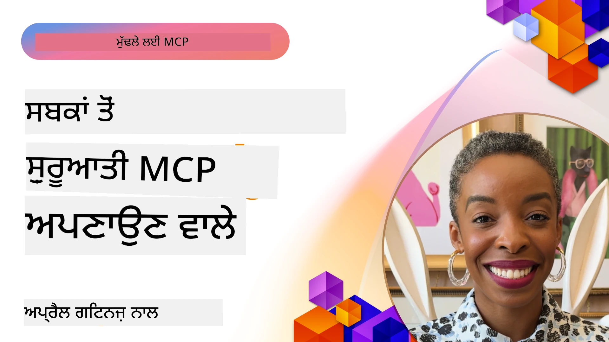

# 🌟 ਮੁੱਢਲੇ ਗ੍ਰਾਹਕਾਂ ਤੋਂ ਸਬਕ

[](https://youtu.be/jds7dSmNptE)

_(ਉਪਰ ਦਿੱਤੀ ਗਈ ਚਿੱਤਰ ਨੂੰ ਕਲਿੱਕ ਕਰਕੇ ਇਸ ਪਾਠ ਦਾ ਵੀਡੀਓ ਵੇਖੋ)_

## 🎯 ਇਹ ਮਾਡਿਊਲ ਕੀ ਕਵਰ ਕਰਦਾ ਹੈ

ਇਹ ਮਾਡਿਊਲ ਵਾਸਤਵਿਕ ਸੰਸਥਾਵਾਂ ਅਤੇ ਵਿਕਾਸਕਰਤਿਆਂ ਵੱਲੋਂ ਮਾਡਲ ਸੰਦਰਭ ਪ੍ਰੋਟੋਕੋਲ (MCP) ਦੇ ਵਰਤੋਂ ਨਾਲ ਅਸਲੀ ਮੁਸ਼ਕਿਲਾਂ ਨੂੰ ਕਿਵੇਂ ਹੱਲ ਕੀਤਾ ਜਾ ਰਿਹਾ ਹੈ ਅਤੇ ਨਵੀਂ ਸੋਚ ਨੂੰ ਕਿਵੇਂ ਪ੍ਰੇਰਿਤ ਕੀਤਾ ਜਾ ਰਿਹਾ ਹੈ, ਇਸਦਾ ਅਧਿਐਨ ਕਰਦਾ ਹੈ। ਵਿਸਥਾਰਪੂਰਕ ਕੇਸ ਅਧਿਐਨਾਂ, ਹੱਥ-ਅੰਦਾਜ਼ੇ ਪ੍ਰੋਜੈਕਟਾਂ ਅਤੇ ਅਮਲੀ ਉਦਾਹਰਣਾਂ ਰਾਹੀਂ, ਤੁਸੀਂ ਪਤਾ ਲਗਾਵੋਗੇ ਕਿ MCP ਕਿਵੇਂ ਭਰੋਸੇਮੰਦ, ਸਕੇਲ ਕਰਨ ਯੋਗ ਏਆਈ ਇਕੱਠ ਦੇਣ ਲਈ ਭਾਸ਼ਾ ਮਾਡਲਾਂ, ਟੂਲਾਂ ਅਤੇ ਉਦਯੋਗਕ ਡੇਟਾ ਨੂੰ ਜੋੜਦਾ ਹੈ।

### 📚 MCP ਨੂੰ ਕਾਰਗਰ ਰੂਪ ਵਿੱਚ ਵੇਖੋ

ਕੀ ਤੁਸੀਂ ਇਹ ਸਿਧਾਂਤ ਉਤਪਾਦਨ-ਤਿਆਰ ਟੂਲਾਂ ਵਿਚ ਲਾਗੂ ਕਰਦੇ ਦੇਖਣਾ ਚਾਹੁੰਦੇ ਹੋ? ਸਾਡੇ [**10 Microsoft MCP Servers That Are Transforming Developer Productivity**](microsoft-mcp-servers.md) ਨੂ ਵੇਖੋ, ਜੋ ਅਸਲੀ Microsoft MCP ਸਰਵਰ ਦਿਖਾਊਂਦਾ ਹੈ ਜੋ ਤੁਸੀਂ ਅੱਜ ਵਰਤ ਸਕਦੇ ਹੋ।

## ਓਵਰਵਿਊ

ਇਹ ਪਾਠ ਵੇਖਦਾ ਹੈ ਕਿ ਮੁੱਢਲੇ ਗ੍ਰਾਹਕਾਂ ਨੇ ਮਾਡਲ ਸੰਦਰਭ ਪ੍ਰੋਟੋਕੋਲ (MCP) ਦਾ ਕਿਵੇਂ ਲੈ ਕੇ ਅਸਲੀ ਦੁਨੀਆ ਦੀਆਂ ਮੁਸ਼ਕਿਲਾਂ ਹੱਲ ਕੀਤੀਆਂ ਅਤੇ ਉਦਯੋਗਾਂ ਵਿਚ ਨਵੀਂ ਸੋਚ ਨੂੰ ਲਾਗੂ ਕੀਤਾ। ਵਿਸਥਾਰਪੂਰਕ ਕੇਸ ਅਧਿਐਨਾਂ ਅਤੇ ਹੱਥਾਂ-ਨਾਲ ਪ੍ਰੋਜੈਕਟਾਂ ਰਾਹੀਂ, ਤੁਸੀਂ ਵੇਖੋਗੇ ਕਿ MCP ਕਿਵੇਂ ਇੱਕਰੀਤ, ਸੁਰੱਖਿਅਤ ਅਤੇ ਸਕੇਲ ਕਰਨ ਯੋਗ ਏਆਈ ਇਕੱਠ ਨੂੰ ਯਕੀਨੀ ਬਣਾਂਦਾ ਹੈ—ਵੱਡੇ ਭਾਸ਼ਾ ਮਾਡਲਾਂ, ਟੂਲਾਂ ਅਤੇ ਉਦਯੋਗ ਡੇਟਾ ਨੂੰ ਇੱਕ ਇਕਾਈ ਢਾਂਚੇ ਵਿੱਚ ਜੋੜਦਾ ਹੈ। ਤੁਸੀਂ MCP-ਆਧਾਰਤ ਹੱਲ ਡਿਜ਼ਾਈਨ ਅਤੇ ਤਿਆਰ ਕਰਨ ਦਾ ਅਮਲੀ ਤਜਰਬਾ ਪ੍ਰਾਪਤ ਕਰੋਗੇ, ਸਾਬਤ ਹੋਏ ਲਾਗੂ ਕਰਨ ਵਾਲੇ ਪੈਟਰਨਾਂ ਦੀ ਸਿੱਖਿਆ ਕਰੋਗੇ, ਅਤੇ ਉਤਪਾਦਨ ਵਾਤਾਵਰਣਾਂ ਵਿੱਚ MCP ਦੀ ਤਾਇਨਾਤੀ ਲਈ ਸਾਰਥਕ ਸਰਵੋਤਮ ਪ੍ਰਥਾਵਾਂ ਨੂੰ ਜਾਣੋਗੇ। ਇਸ ਪਾਠ ਵਿਚ ਨਵੀਂ ਲਹਿਰਾਂ, ਭਵਿੱਖ ਦੇ ਰੁਝਾਨ ਅਤੇ ਖੁਲੇ ਸਰੋਤ ਸੰਸਾਧਨਾਂ ਨੂੰ ਵੀ ਦਰਸਾਇਆ ਗਿਆ ਹੈ, ਜੋ ਤੁਹਾਨੂੰ MCP ਤਕਨੀਕ ਅਤੇ ਇਸਦੇ ਵਿਕਾਸਸ਼ੀਲ ਪਰਿਪੇਖ ਵਿੱਚ ਅਗਵਾਈ ਤੇ ਬਣਾਉਂਦੇ ਹਨ।

## ਸਿੱਖਣ ਦੇ ਲਕੜੀ

- ਵੱਖ-ਵੱਖ ਉਦਯੋਗਾਂ ਵਿਚ ਅਸਲੀ ਦੁਨੀਆ MCP ਲਾਗੂਕਰਨ ਦਾ ਵਿਸ਼ਲੇਸ਼ਣ ਕਰੋ
- MCP-ਆਧਾਰਤ ਸੰਪੂਰਨ ਐਪਲੀਕੇਸ਼ਨਾਂ ਦਾ ਡਿਜ਼ਾਈਨ ਅਤੇ ਨਿਰਮਾਣ ਕਰੋ
- MCP ਤਕਨੀਕ ਵਿੱਚ ਨਵੀਂ ਲਹਿਰਾਂ ਅਤੇ ਭਵਿੱਖ ਦੇ ਰੁਝਾਨਾਂ ਦਾ ਪਤਾ ਲਗਾਓ
- ਅਸਲੀ ਵਿਕਾਸ ਦੇ ਪਰਿਦ੍ਰਿਸ਼ਾਂ ਵਿੱਚ ਸਰਵੋਤਮ ਅਭਿਆਸ ਲਾਗੂ ਕਰੋ

## ਅਸਲੀ ਦੁਨੀਆ MCP ਲਾਗੂਕਰਨ

### ਕੇਸ ਅਧਿਐਨ 1: ਉਦਯੋਗ ਗਾਹਕ ਸਹਾਇਤਾ ਆਟੋਮੇਸ਼ਨ

ਇੱਕ ਬਹੁ-ਰਾਸ਼ਟਰ ਕੰਪਨੀ ਨੇ MCP-ਆਧਾਰਤ ਹੱਲ ਲਾਗੂ ਕੀਤਾ ਤਾਂ ਜੋ ਉਹਨਾਂ ਦੇ ਗਾਹਕ ਸਹਾਇਤਾ ਪ੍ਰਣਾਲੀਆਂ ਵਿੱਚ ਏਆਈ ਇੰਟਰੈਕਸ਼ਨਾਂ ਨੂੰ ਇੱਕਸਾਰ ਕਰ ਸਕੇ। ਇਸ ਨਾਲ ਉਹਨਾਂ ਨੂੰ ਇਹ ਸਮਰੱਥਾ ਮਿਲੀ:

- ਇਕੱਠੇ ਕਈ LLM ਪ੍ਰਦਾਤਿਆਂ ਲਈ ਇਕਜੁਟ ਇੰਟਰਫੇਸ ਬਣਾਉਣਾ
- ਵਿਭਾਗਾਂ ਵਿਚ ਸਥਿਰ ਪ੍ਰੰਪਟ ਪ੍ਰਬੰਧਨ ਨੂੰ ਬਣਾਈ ਰੱਖਣਾ
- ਮਜ਼ਬੂਤ ਸੁਰੱਖਿਆ ਅਤੇ ਪਾਲਣਾ ਨਿਯੰਤਰਣ ਲਾਗੂ ਕਰਨਾ
- ਵਿਸ਼ੇਸ਼ ਲੋੜਾਂ ਦੇ ਅਧਾਰ 'ਤੇ ਵੱਖ-ਵੱਖ ਏਆਈ ਮਾਡਲਾਂ ਵਿਚ ਆਸਾਨੀ ਨਾਲ ਬਦਲਣਾ

**ਤਕਨੀਕੀ ਲਾਗੂਕਰਨ:**

```python
# ਗ੍ਰਾਹਕ ਸਹਿਯੋਗ ਲਈ ਪਾਇਥਨ MCP ਸੇਵਾ ਅਮਲ ਕਿਰਿਆ
import logging
import asyncio
from modelcontextprotocol import create_server, ServerConfig
from modelcontextprotocol.server import MCPServer
from modelcontextprotocol.transports import create_http_transport
from modelcontextprotocol.resources import ResourceDefinition
from modelcontextprotocol.prompts import PromptDefinition
from modelcontextprotocol.tool import ToolDefinition

# ਲਾਗਿੰਗ ਸੰਰਚਿਤ ਕਰੋ
logging.basicConfig(level=logging.INFO)

async def main():
    # ਸੇਵਾ ਸੰਰਚਨਾ ਬਣਾਓ
    config = ServerConfig(
        name="Enterprise Customer Support Server",
        version="1.0.0",
        description="MCP server for handling customer support inquiries"
    )
    
    # MCP ਸੇਵਾ ਸ਼ੁਰੂ ਕਰੋ
    server = create_server(config)
    
    # ਗਿਆਨ ਅਧਾਰ ਸਰੋਤ ਰਜਿਸਟਰ ਕਰੋ
    server.resources.register(
        ResourceDefinition(
            name="customer_kb",
            description="Customer knowledge base documentation"
        ),
        lambda params: get_customer_documentation(params)
    )
    
    # ਪ੍ਰੋੰਪਟ ਟੈਂਪਲੇਟਾਂ ਰਜਿਸਟਰ ਕਰੋ
    server.prompts.register(
        PromptDefinition(
            name="support_template",
            description="Templates for customer support responses"
        ),
        lambda params: get_support_templates(params)
    )
    
    # ਸਹਿਯੋਗ ਸੰਦ ਰਜਿਸਟਰ ਕਰੋ
    server.tools.register(
        ToolDefinition(
            name="ticketing",
            description="Create and update support tickets"
        ),
        handle_ticketing_operations
    )
    
    # HTTP ਟ੍ਰਾਂਸਪੋਰਟ ਨਾਲ ਸੇਵਾ ਸ਼ੁਰੂ ਕਰੋ
    transport = create_http_transport(port=8080)
    await server.run(transport)

if __name__ == "__main__":
    asyncio.run(main())
```
  
**ਨਤੀਜੇ:** ਮਾਡਲ ਲਾਗਤਾਂ ਵਿੱਚ 30% ਘਟਾਓ, ਜਵਾਬ ਦੀ ਸਥਿਰਤਾ ਵਿੱਚ 45% ਸੁਧਾਰ, ਅਤੇ ਵਿਸ਼ਵ ਪੱਧਰ ਤੇ ਪਾਲਣਾ ਵਿੱਚ ਵਿਸ਼ੇਸ਼ ਤਰੱਕੀ।

### ਕੇਸ ਅਧਿਐਨ 2: ਸਿਹਤ ਸੇਵਾ ਤਸ਼ਖੀਸੀ ਸਹਾਇਕ

ਇੱਕ ਸਿਹਤ ਸੇਵਾ ਪ੍ਰਦਾਤਾ ਨੇ ਕੰਪਲੈਕਸ ਮੈਡੀਕਲ ਏਆਈ ਮਾਡਲਾਂ ਨੂੰ ਇਕੱਤਰ ਕਰਨ ਲਈ MCP ਢਾਂਚਾ ਵਿਕਸਤ ਕੀਤਾ, ਜਿਸ ਨਾਲ ਸੰਵੇਦਨਸ਼ੀਲ ਮਰੀਜ਼ਾਂ ਦੇ ਡੇਟਾ ਦੀ ਸੁਰੱਖਿਆ ਯਕੀਨੀ ਬਣੀ:

- ਆਮ ਅਤੇ ਵਿਸ਼ੇਸ਼ ਮੈਡੀਕਲ ਮਾਡਲਾਂ ਵਿਚ ਆਸਾਨੀ ਨਾਲ ਸਵਿੱਚ ਕਰਨਾ
- ਸੀਮਤ ਪਰਾਈਵੇਟ ਨਿਯੰਤਰਣ ਅਤੇ ਆਡੀਟ ਟਰੇਲਜ਼
- ਮੌਜੂਦਾ ਇਲੈਕਟ੍ਰਾਨਿਕ ਹੈਲਥ ਰਿਕਾਰਡ (EHR) ਪ੍ਰਣਾਲੀਆਂ ਨਾਲ ਇੰਟੀਗਰੇਸ਼ਨ
- ਮੈਡੀਕਲ ਟਰਮੀਨੋਲੋਜੀ ਲਈ ਇੱਕਸਾਰ ਪ੍ਰੰਪਟ ਇੰਜੀਨੀਅਰਿੰਗ

**ਤਕਨੀਕੀ ਲਾਗੂਕਰਨ:**

```csharp
// C# MCP host application implementation in healthcare application
using Microsoft.Extensions.DependencyInjection;
using ModelContextProtocol.SDK.Client;
using ModelContextProtocol.SDK.Security;
using ModelContextProtocol.SDK.Resources;

public class DiagnosticAssistant
{
    private readonly MCPHostClient _mcpClient;
    private readonly PatientContext _patientContext;
    
    public DiagnosticAssistant(PatientContext patientContext)
    {
        _patientContext = patientContext;
        
        // Configure MCP client with healthcare-specific settings
        var clientOptions = new ClientOptions
        {
            Name = "Healthcare Diagnostic Assistant",
            Version = "1.0.0",
            Security = new SecurityOptions
            {
                Encryption = EncryptionLevel.Medical,
                AuditEnabled = true
            }
        };
        
        _mcpClient = new MCPHostClientBuilder()
            .WithOptions(clientOptions)
            .WithTransport(new HttpTransport("https://healthcare-mcp.example.org"))
            .WithAuthentication(new HIPAACompliantAuthProvider())
            .Build();
    }
    
    public async Task<DiagnosticSuggestion> GetDiagnosticAssistance(
        string symptoms, string patientHistory)
    {
        // Create request with appropriate resources and tool access
        var resourceRequest = new ResourceRequest
        {
            Name = "patient_records",
            Parameters = new Dictionary<string, object>
            {
                ["patientId"] = _patientContext.PatientId,
                ["requestingProvider"] = _patientContext.ProviderId
            }
        };
        
        // Request diagnostic assistance using appropriate prompt
        var response = await _mcpClient.SendPromptRequestAsync(
            promptName: "diagnostic_assistance",
            parameters: new Dictionary<string, object>
            {
                ["symptoms"] = symptoms,
                patientHistory = patientHistory,
                relevantGuidelines = _patientContext.GetRelevantGuidelines()
            });
            
        return DiagnosticSuggestion.FromMCPResponse(response);
    }
}
```
  
**ਨਤੀਜੇ:** ਡਾਕਟਰਾਂ ਲਈ ਬਿਹਤਰ ਤਸ਼ਖੀਸ ਸੁਝਾਵ, ਸਪੂਰਨ HIPAA ਪਾਲਣਾ ਨਾਲ, ਅਤੇ ਪ੍ਰਣਾਲੀਆਂ ਵਿੱਚ ਕਾਂਟੈਕਸਟ-ਸਵਿੱਚਿੰਗ ਵਿੱਚ ਮਹੱਤਵਪੂਰਨ ਕਮੀ।

### ਕੇਸ ਅਧਿਐਨ 3: ਵਿੱਤ ਸੇਵਾਵਾਂ ਵਿੱਚ ਖ਼ਤਰੇ ਦਾ ਵਿਸ਼ਲੇਸ਼ਣ

ਇੱਕ ਵਿੱਤੀ ਸਹਿਮਤ ਸੰਸਥਾ ਨੇ ਆਪਣੇ ਵਿ-ਭਾਗੀ ਖ਼ਤਰੇ ਦੀ ਵਿਸ਼ਲੇਸ਼ਣ ਪ੍ਰਕਿਰਿਆਵਾਂ ਨੂੰ ਇੱਕਸਾਰ ਕਰਨ ਲਈ MCP ਲਾਗੂ ਕੀਤਾ:

- ਕਰੈਡਿਟ ਰਿਸਕ, ਧੋਖਾਧੜੀ ਪਛਾਣ ਅਤੇ ਨਿਵੇਸ਼ ਖ਼ਤਰੇ ਮਾਡਲਾਂ ਲਈ ਇਕੱਠਾ ਇੰਟਰਫੇਸ ਬਣਾਇਆ
- ਸਖ਼ਤ ਪ੍ਰਵੇਸ਼ ਨਿਯੰਤਰਣ ਅਤੇ ਮਾਡਲ ਵੈਸ਼ਨਿੰਗ ਲਾਗੂ ਕੀਤਾ
- ਸਾਰੇ ਏਆਈ ਸਿਫਾਰਸ਼ਾਂ ਦੀ ਆਡੀਟ ਕਰਨਯੋਗਤਾ ਯਕੀਨੀ ਬਣਾਈ
- ਵੱਖ-ਵੱਖ ਪ੍ਰਣਾਲੀਆਂ ਵਿੱਚ ਜਾਣਕਾਰੀ ਫਾਰਮੈਟਿੰਗ ਨੂੰ ਇਕਸਾਰ ਬਣਾਇਆ

**ਤਕਨੀਕੀ ਲਾਗੂਕਰਨ:**

```java
// ਵਿੱਤੀ ਖਤਰੇ ਦੇ ਮੁਲਿਆੰਕਣ ਲਈ ਜਾਵਾ MCP ਸਰਵਰ
import org.mcp.server.*;
import org.mcp.security.*;

public class FinancialRiskMCPServer {
    public static void main(String[] args) {
        // ਵਿੱਤੀ ਅਨੁਕੂਲਤਾ ਵਿਸ਼ੇਸ਼ਤਾਵਾਂ ਨਾਲ MCP ਸਰਵਰ ਬਣਾਓ
        MCPServer server = new MCPServerBuilder()
            .withModelProviders(
                new ModelProvider("risk-assessment-primary", new AzureOpenAIProvider()),
                new ModelProvider("risk-assessment-audit", new LocalLlamaProvider())
            )
            .withPromptTemplateDirectory("./compliance/templates")
            .withAccessControls(new SOCCompliantAccessControl())
            .withDataEncryption(EncryptionStandard.FINANCIAL_GRADE)
            .withVersionControl(true)
            .withAuditLogging(new DatabaseAuditLogger())
            .build();
            
        server.addRequestValidator(new FinancialDataValidator());
        server.addResponseFilter(new PII_RedactionFilter());
        
        server.start(9000);
        
        System.out.println("Financial Risk MCP Server running on port 9000");
    }
}
```
  
**ਨਤੀਜੇ:** ਨਿਯਮਕ ਪਾਲਣਾ ਵਿੱਚ ਸੁਧਾਰ, ਮਾਡਲ ਤਾਇਨਾਤੀ ਚੱਕਰ 40% ਤੇਜ਼, ਅਤੇ ਵਿਭਾਗਾਂ ਵਿਚ ਖ਼ਤਰੇ ਦੀ ਅੰਕੜਣਾ ਵਿੱਚ ਸਹੀਅਤ।

### ਕੇਸ ਅਧਿਐਨ 4: Microsoft Playwright MCP ਸਰਵਰ ਬ੍ਰਾੁਜ਼ਰ ਆਟੋਮੇਸ਼ਨ ਲਈ

Microsoft ਨੇ [Playwright MCP ਸਰਵਰ](https://github.com/microsoft/playwright-mcp) ਨੂੰ ਵਿਕਸਤ ਕੀਤਾ, ਜੋ ਮਾਡਲ ਸੰਦਰਭ ਪ੍ਰੋਟੋਕੋਲ ਰਾਹੀਂ ਸੁਰੱਖਿਅਤ, ਇੱਕਸਾਰ ਬ੍ਰਾੁਜ਼ਰ ਆਟੋਮੇਸ਼ਨ ਦੇਣ ਵਾਲਾ ਹੈ। ਇਹ ਉਤਪਾਦਨ-ਤਿਆਰ ਸਰਵਰ ਏਆਈ ਏਜੰਟ ਅਤੇ LLMs ਨੂੰ ਵੈੱਬ ਬ੍ਰਾੁਜ਼ਰਾਂ ਨਾਲ ਨਿਯੰਤਰਿਤ, ਆਡੀਟ ਕਰਨਯੋਗ ਅਤੇ ਵਿਸਤਾਰਯੋਗ ਢੰਗ ਨਾਲ ਇੰਟਰੈਕਟ ਕਰਨ ਦੀ ਆਗਿਆ ਦਿੰਦਾ ਹੈ—ਜਿਵੇਂ ਕਿ ਆਟੋਮੇਟਿਕ ਵੈੱਬ ਟੈਸਟਿੰਗ, ਡੇਟਾ ਨਿਕਾਸੀ ਅਤੇ ਐਂਡ-ਟੂ-ਐਂਡ ਵਰਕਫਲੋਜ਼।

> **🎯 ਉਤਪਾਦਨ ਤਿਆਰ ਟੂਲ**  
>   
> ਇਹ ਕੇਸ ਅਧਿਐਨ ਤੁਹਾਨੂੰ ਅਸਲੀ MCP ਸਰਵਰ ਦਿਖਾਉਂਦਾ ਹੈ ਜੋ ਤੁਸੀਂ आज ਵਰਤ ਸਕਦੇ ਹੋ! ਸਾਡੇ [**Microsoft MCP Servers Guide**](microsoft-mcp-servers.md#8--playwright-mcp-server) ਵਿਖੇ Playwright MCP Server ਅਤੇ ਹੋਰ 9 ਉਤਪਾਦਨ-ਤਿਆਰ Microsoft MCP ਸਰਵਰ ਬਾਰੇ ਜਾਣੋ।

**ਮੁੱਖ ਵਿਸ਼ੇਸ਼ਤਾਵਾਂ:**  
- MCP ਟੂਲਾਂ ਵਜੋਂ ਬ੍ਰਾੁਜ਼ਰ ਆਟੋਮੇਸ਼ਨ ਯੋਗਤਾਵਾਂ (ਨੈਵੀਗੇਸ਼ਨ, ਫਾਰਮ ਭਰਨਾ, ਸਕ੍ਰੀਨਸ਼ਾਟ ਕੈਪਚਰ ਆਦਿ) ਦਾ ਪ੍ਰਦਰਸ਼ਨ  
- ਬਿਨਾਂ ਅਧਿਕਾਰ ਦੇ ਕਾਰਵਾਈਆਂ ਨੂੰ ਰੋਕਣ ਲਈ ਸਖ਼ਤ ਐਕਸੈਸ ਨਿਯੰਤਰਣ ਅਤੇ ਸੈਂਡਬਾਕਸਿੰਗ ਲਾਗੂ ਕਰਦਾ ਹੈ  
- ਸਾਰੇ ਬ੍ਰਾੁਜ਼ਰ ਇੰਟਰੈਕਸ਼ਨਾਂ ਲਈ ਵਿਸਥਾਰਪੂਰਕ ਆਡੀਟ ਲੌਗ ਪ੍ਰਦਾਨ ਕਰਦਾ ਹੈ  
- ਏਜੰਟ-ਪ੍ਰਚਾਲਿਤ ਆਟੋਮੇਸ਼ਨ ਲਈ Azure OpenAI ਅਤੇ ਹੋਰ LLM ਪ੍ਰਦਾਤਾਂ ਨਾਲ ਇੰਟੀਗਰੇਸ਼ਨ ਦਾ ਸਮਰਥਨ  
- GitHub Copilot ਦੇ ਕੋਡਿੰਗ ਏਜੰਟ ਨੂੰ ਵੈੱਬ ਬ੍ਰਾੁਜ਼ਿੰਗ ਯੋਗਤਾਵਾਂ ਨਾਲ ਸ਼ਕਤੀਸ਼ਾਲੀ ਬਣਾਉਂਦਾ ਹੈ

**ਤਕਨੀਕੀ ਲਾਗੂਕਰਨ:**

```typescript
// ਟਾਈਪਸਕ੍ਰਿਪਟ: MCP ਸਰਵਰ ਵਿੱਚ Playwright ਬ੍ਰਾਉਜ਼ਰ ਆਟੋਮੇਸ਼ਨ ਟੂਲਜ਼ ਨੂੰ ਰਜਿਸਟਰ ਕਰਨਾ
import { createServer, ToolDefinition } from 'modelcontextprotocol';
import { launch } from 'playwright';

const server = createServer({
  name: 'Playwright MCP Server',
  version: '1.0.0',
  description: 'MCP server for browser automation using Playwright'
});

// ਇੱਕ ਟੂਲ ਰਜਿਸਟਰ ਕਰੋ ਜੋ URL ਤੇ ਜਾ ਕੇ ਸਕ੍ਰੀਨਸ਼ਾਟ ਲਵੇ
server.tools.register(
  new ToolDefinition({
    name: 'navigate_and_screenshot',
    description: 'Navigate to a URL and capture a screenshot',
    parameters: {
      url: { type: 'string', description: 'The URL to visit' }
    }
  }),
  async ({ url }) => {
    const browser = await launch();
    const page = await browser.newPage();
    await page.goto(url);
    const screenshot = await page.screenshot();
    await browser.close();
    return { screenshot };
  }
);

// MCP ਸਰਵਰ ਸ਼ੁਰੂ ਕਰੋ
server.listen(8080);
```
  
**ਨਤੀਜੇ:**  
- ਏਆਈ ਏਜੰਟ ਅਤੇ LLMs ਲਈ ਸੁਰੱਖਿਅਤ, ਪਰੋਗ੍ਰਾਮੈਟਿਕ ਬ੍ਰਾੁਜ਼ਰ ਆਟੋਮੇਸ਼ਨ ਯੋਗਤਾਵਾਂ ਪ੍ਰਦਾਨ ਕੀਤੀਆਂ  
- ਮੈਨੁਅਲ ਟੈਸਟਿੰਗ کوششਾਂ ਵਿੱਚ ਕਮੀ ਅਤੇ ਵੈੱਬ ਐਪਲੀਕੇਸ਼ਨਾਂ ਲਈ ਟੈਸਟ ਕਵਰੇਜ ਵਿੱਚ ਸੁਧਾਰ  
- ਉਦਯੋਗਕ ਵਾਤਾਵਰਣਾਂ ਵਿੱਚ ਬ੍ਰਾੁਜ਼ਰ-ਆਧਾਰਿਤ ਟੂਲ ਇੰਟੀਗਰੇਸ਼ਨ ਲਈ ਦੁਬਾਰਾ ਵਰਤਣਯੋਗ ਅਤੇ ਵਿਸਤਾਰਯੋਗ ਫਰੇਮਵਰਕ ਪ੍ਰਦਾਨ ਕੀਤਾ  
- GitHub Copilot ਦੇ ਵੈੱਬ ਬ੍ਰਾੁਜ਼ਿੰਗ ਯੋਗਤਾਵਾਂ ਨੂੰ ਸ਼ਕਤੀਸ਼ਾਲੀ ਬਣਾਉਂਦਾ ਹੈ

**ਹਵਾਲੇ:**  
- [Playwright MCP Server GitHub Repository](https://github.com/microsoft/playwright-mcp)  
- [Microsoft AI and Automation Solutions](https://azure.microsoft.com/en-us/products/ai-services/)

### ਕੇਸ ਅਧਿਐਨ 5: Azure MCP – ਇੰਟਰਨੈਟ-ਗਰੇਡ ਮਾਡਲ ਸੰਦਰਭ ਪ੍ਰੋਟੋਕੋਲ ਸੇਵਾ ਵਜੋਂ

Azure MCP Server ([https://aka.ms/azmcp](https://aka.ms/azmcp)) Microsoft ਦਾ ਪ੍ਰਬੰਧਿਤ, ਉਦਯੋਗ-ਗਰੇਡ ਮਾਡਲ ਸੰਦਰਭ ਪ੍ਰੋਟੋਕੋਲ ਲਾਗੂ ਕਰਨ ਵਾਲਾ ਸਰਵਰ ਹੈ, ਜੋ ਸਕੇਲਯੋਗ, ਸੁਰੱਖਿਅਤ ਅਤੇ ਪਾਲਣਾ ਯੋਗ MCP ਸਰਵਰ ਸਮਰੱਥਾਵਾਂ ਪ੍ਰਦਾਨ ਕਰਦਾ ਹੈ। Azure MCP ਸੰਸਥਾਵਾਂ ਨੂੰ MCP ਸਰਵਰਾਂ ਨੂੰ ਤੇਜ਼ੀ ਨਾਲ ਤਾਇਨਾਤ, ਪ੍ਰਬੰਧਿਤ ਅਤੇ Azure AI, ਡੇਟਾ ਅਤੇ ਸੁਰੱਖਿਆ ਸੇਵਾਂ ਨਾਲ ਇੱਕਸਾਰ ਕਰਨ ਵਿੱਚ ਮਦਦ ਕਰਦਾ ਹੈ, ਚਾਲੂ ਕਰਯਾ ਨੂੰ ਘਟਾਉਂਦਾ ਅਤੇ ਏਆਈ ਅਪਣਾਓ ਨੂੰ ਤੇਜ਼ ਕਰਦਾ ਹੈ।

> **🎯 ਉਤਪਾਦਨ ਤਿਆਰ ਟੂਲ**  
>   
> ਇਹ ਅਸਲੀ MCP ਸਰਵਰ ਹੈ ਜੋ ਤੁਸੀਂ ਅੱਜ ਵਰਤ ਸਕਦੇ ਹੋ! ਸਾਡੇ [**Microsoft MCP Servers Guide**](microsoft-mcp-servers.md) ਵਿੱਚ Azure AI Foundry MCP Server ਬਾਰੇ ਹੋਰ ਜਾਣੋ।

- ਪੂਰੀ ਤਰ੍ਹਾਂ ਪ੍ਰਬੰਧਿਤ MCP ਸਰਵਰ ਹੋਸਟਿੰਗ ਸਹਿਤ ਅੰਦਰੂਨੀ ਮਾਪ, ਨਿਗਰਾਨੀ, ਅਤੇ ਸੁਰੱਖਿਆ  
- Azure OpenAI, Azure AI Search ਅਤੇ ਹੋਰ Azure ਸੇਵਾਵਾਂ ਨਾਲ ਮੂਲ ਸੰમਿਲਨ  
- Microsoft Entra ID ਦੁਆਰਾ ਉਦਯੋਗਕ ਪ੍ਰਮਾਣਿਕਤਾ ਅਤੇ ਅਧਿਕਾਰ  
- ਕਸਟਮ ਟੂਲ, ਪ੍ਰੰਪਟ ਟੈਂਪਲੇਟ ਅਤੇ ਰਿਸੋਰਸ ਕੁਨੈਕਟਰਾਂ ਦਾ ਸਮਰਥਨ  
- ਉਦਯੋਗਕ ਸੁਰੱਖਿਆ ਅਤੇ ਨਿਯਮਕਤਾ ਦੀਆਂ ਲੋੜਾਂ ਦੇ ਨਾਲ ਪਾਲਣਾ

**ਤਕਨੀਕੀ ਲਾਗੂਕਰਨ:**

```yaml
# Example: Azure MCP server deployment configuration (YAML)
apiVersion: mcp.microsoft.com/v1
kind: McpServer
metadata:
  name: enterprise-mcp-server
spec:
  modelProviders:
    - name: azure-openai
      type: AzureOpenAI
      endpoint: https://<your-openai-resource>.openai.azure.com/
      apiKeySecret: <your-azure-keyvault-secret>
  tools:
    - name: document_search
      type: AzureAISearch
      endpoint: https://<your-search-resource>.search.windows.net/
      apiKeySecret: <your-azure-keyvault-secret>
  authentication:
    type: EntraID
    tenantId: <your-tenant-id>
  monitoring:
    enabled: true
    logAnalyticsWorkspace: <your-log-analytics-id>
```
  
**ਨਤੀਜੇ:**  
- ਤੇਜ਼ ਤਾਇਨಾತੀ ਲਈ ਤਿਆਰ, ਪਾਲਣਾ ਯੋਗ MCP ਸਰਵਰ ਪਲੇਟਫਾਰਮ ਪ੍ਰਦਾਨ ਕਰਕੇ ਉਦਯੋਗਕ ਏਆਈ ਪ੍ਰੋਜੈਕਟਾਂ ਲਈ ਸਮੇਂ ਨੂੰ ਘਟਾਉਣਾ  
- LLMs, ਟੂਲਾਂ, ਅਤੇ ਉਦਯੋਗਕ ਡੇਟਾ ਸਰੋਤਾਂ ਦੇ ਸਦ ਸਹਿਜ ਇੰਟੀਗਰੇਸ਼ਨ  
- MCP ਕੰਮਬੋਲੇਅਡਾਂ ਲਈ ਸੁਰੱਖਿਆ, ਨਿਰੀਖਣਯੋਗਤਾ ਅਤੇ ਕਾਰਜਕੁਸ਼ਲਤਾ ਵਿੱਚ ਸੁਧਾਰ  
- Azure SDK ਸਰਵੋਤਮ ਅਭਿਆਸ ਅਤੇ ਮੌਜੂਦਾ ਪ੍ਰਮਾਣਿਕਤਾ ਪੈਟਰਨਾਂ ਨਾਲ ਕੋਡ ਗੁਣਵੱਤਾ ਵਿੱਚ ਸੁਧਾਰ

**ਹਵਾਲੇ:**  
- [Azure MCP Documentation](https://aka.ms/azmcp)  
- [Azure MCP Server GitHub Repository](https://github.com/Azure/azure-mcp)  
- [Azure AI Services](https://azure.microsoft.com/en-us/products/ai-services/)  
- [Microsoft MCP Center](https://mcp.azure.com)

## ਕੇਸ ਅਧਿਐਨ 6: NLWeb  
MCP (Model Context Protocol) ਚੈਟਬੋਟ ਅਤੇ ਏਆਈ ਸਹਾਇਕਾਂ ਲਈ ਟੂਲਾਂ ਨਾਲ ਇੰਟਰੈਕਟ ਕਰਨ ਦਾ ਉभरਦਾ ਹੋਇਆ ਪ੍ਰੋਟੋਕੋਲ ਹੈ। ਹਰੇਕ NLWeb ਜੱਥਾ ਵੀ ਇੱਕ MCP ਸਰਵਰ ਹੈ, ਜੋ ਇੱਕ ਮੁੱਖ ਮੈਥਡ, ask ਨੂੰ ਸਹਿਯੋਗ ਦਿੰਦਾ ਹੈ, ਜੋ ਕਿ ਇੱਕ ਵੈੱਬਸਾਈਟ ਤੋਂ ਕੁਦਰਤੀ ਭਾਸ਼ਾ ਵਿੱਚ ਸਵਾਲ ਪੁੱਛਨ ਲਈ ਵਰਤੀ ਜਾਂਦੀ ਹੈ। ਮਿਲੀ ਜੁਲੀ ਪ੍ਰਤਿਕ੍ਰਿਆ schema.org ਨੂੰ ਵਰਤਦੀ ਹੈ, ਜੋ ਵੈੱਬ ਡੇਟਾ ਵਰਣਨ ਲਈ ਇੱਕ ਵਿਆਪਕ ਸ਼ਬਦਾਵਲੀ ਹੈ। ਆਮ ਤੌਰ 'ਤੇ ਕਿਹਾ ਜਾਵੇ ਤਾਂ MCP, NLWeb ਨੂੰ Http ਦੇ HTML ਵਰਗਾ ਹੈ। NLWeb ਪ੍ਰੋਟੋਕੋਲ, Schema.org ਫਾਰਮੈਟ, ਅਤੇ ਨਮੂਨਾ ਕੋਡ ਨੂੰ ਜੋੜਦਾ ਹੈ ਤਾਂ ਜੋ ਵੈੱਬਸਾਈਟਾਂ ਇਨ੍ਹਾਂ ਐਂਡਪੌਇੰਟਾਂ ਨੂੰ ਤੇਜ਼ੀ ਨਾਲ ਤਿਆਰ ਕਰ ਸਕਣ, ਜੋ ਮਨੁੱਖਾਂ ਨੂੰ ਗੱਲਬਾਤੀ ਇੰਟਰਫੇਸਾਂ ਤੇ ਅਤੇ ਮਸ਼ੀਨਾਂ ਨੂੰ ਕੁਦਰਤੀ ਏਜੰਟ-ਟੂ-ਏਜੰਟ ਇੰਟਰੈਕਸ਼ਨ ਦੁਆਰਾ ਲਾਭਦੇਹ ਬਣਾਉਂਦਾ ਹੈ।

NLWeb ਦੇ ਦੋ ਮੁੱਖ ਹਿੱਸੇ ਹਨ।  
- ਇੱਕ ਪ੍ਰੋਟੋਕੋਲ, ਜੋ ਬਹੁਤ ਸਧਾਰਣ ਹੈ, ਕਿਸੇ ਸਾਈਟ ਨਾਲ ਕੁਦਰਤੀ ਭਾਸ਼ਾ ਵਿੱਚ ਗੱਲਬਾਤ ਕਰਨ ਲਈ ਅਤੇ ਇੱਕ ਫਾਰਮੈਟ, ਜੋ json ਅਤੇ schema.org ਦਾ ਲਾਭ ਲੈਂਦਾ ਹੈ, ਦਿੱਤੇ ਗਏ ਜਵਾਬ ਲਈ। ਹੋਰ ਵੇਰਵੇ ਲਈ REST API ਦੀ ਦਸਤਾਵੇਜ਼ੀ ਦੇਖੋ।  
- (1) ਦੀ ਇੱਕ ਸਿੱਧੀ ਕਾਰਗેਰੀ ਜੋ ਮੌਜੂਦਾ ਮਾਰਕਅਪ ਦਾ ਲਾਹਾ ਲੈਂਦੀ ਹੈ, ਉਨ੍ਹਾਂ ਸਾਈਟਾਂ ਲਈ ਜੋ ਆਈਟਮਾਂ ਦੀ ਸੂਚੀ ਵਜੋਂ ਸੰਖੇਪ ਕੀਤੀਆਂ ਜਾ ਸਕਦੀਆਂ ਹਨ (ਉਤਪਾਦ, ਵਿਧੀਆਂ, ਆਕਰਸ਼ਣ, ਸਮੀਖਿਆਵਾਂ ਆਦਿ)। ਵਰਤੋਂਕਾਰ ਇੰਟਰਫੇਸ ਵਿਜੇਟਾਂ ਨਾਲ, ਸਾਈਟਸ ਆਪਣੀ ਸਮੱਗਰੀ ਲਈ ਗੱਲਬਾਤੀ ਇੰਟਰਫੇਸ ਸੌਖੀ ਨਾਲ ਪ੍ਰਦਾਨ ਕਰ ਸਕਦੀਆਂ ਹਨ। ਇਸਦਾ ਕਾਰਜਕੁਸ਼ਲਤਾ ਕਿਵੇਂ ਹੈ, ਇਸ ਲਈ Life of a chat query ਦੀ ਦਸਤਾਵੇਜ਼ੀ ਵੇਖੋ।  

**ਹਵਾਲੇ:**  
- [Azure MCP Documentation](https://aka.ms/azmcp)  
- [NLWeb](https://github.com/microsoft/NlWeb)

### ਕੇਸ ਅਧਿਐਨ 7: Azure AI Foundry MCP Server – ਉਦਯੋਗਕ ਏਆਈ ਏਜੰਟ ਇੰਟੀਗਰੇਸ਼ਨ

Azure AI Foundry MCP ਸਰਵਰ ਦਿਖਾਉਂਦੇ ਹਨ ਕਿ MCP ਉਦਯੋਗਕ ਵਾਤਾਵਰਣਾਂ ਵਿੱਚ ਏਆਈ ਏਜੰਟਾਂ ਅਤੇ ਵਰਕਫਲੋਜ਼ ਨੂੰ ਕਿਵੇਂ ਯੋਜਨਾ ਅਤੇ ਪ੍ਰਬੰਧਿਤ ਕਰਦਾ ਹੈ। MCP ਨੂੰ Azure AI Foundry ਨਾਲ ਜੋੜਕੇ, ਸੰਸਥਾਵਾਂ ਏਜੰਟ ਇੰਟਰਐਕਸ਼ਨਾਂ ਨੂੰ ਇੱਕਸਾਰ ਕਰ ਸਕਦੀਆਂ ਹਨ, Foundry ਦੇ ਵਰਕਫਲੋ ਮੈਨੇਜਮੈਂਟ ਨੂੰ ਵਰਤ ਸਕਦੀਆਂ ਹਨ, ਅਤੇ ਸੁਰੱਖਿਅਤ, ਸਕੇਲਯੋਗ ਤਾਇਨਾਤੀ ਯਕੀਨੀ ਬਣਾਉਂਦੀਆਂ ਹਨ।

> **🎯 ਉਤਪਾਦਨ ਤਿਆਰ ਟੂਲ**  
>   
> ਇਹ MCP ਸਰਵਰ ਅਸਲੀ ਹੈ ਜੋ ਤੁਸੀਂ ਅੱਜ ਵਰਤ ਸਕਦੇ ਹੋ! ਸਾਡੇ [**Microsoft MCP Servers Guide**](microsoft-mcp-servers.md#9--azure-ai-foundry-mcp-server) ਵਿੱਚ Azure AI Foundry MCP Server ਬਾਰੇ ਹੋਰ ਜਾਣੋ।

**ਮੁੱਖ ਵਿਸ਼ੇਸ਼ਤਾਵਾਂ:**  
- ਮਾਡਲ ਕੈਟਲਾਗ ਅਤੇ ਤਾਇਨਾਤੀ ਪ੍ਰਬੰਧਨ ਸਮੇਤ Azure ਏਆਈ ਪਰੀਬਾਸ ਦਾ ਵਿਆਪਕ ਪ੍ਰਵੇਸ਼  
- RAG ਐਪਲੀਕੇਸ਼ਨਾਂ ਲਈ Azure AI Search ਨਾਲ ਗਿਆਨ ਸੂਚੀਕਰਨ  
- ਏਆਈ ਮਾਡਲ ਕਾਰਗੁਜ਼ਾਰੀ ਅਤੇ ਗੁਣਵੱਤਾ ਅਸ਼ੁਰਤਾ ਲਈ ਮੂਲਾਂਕਣ ਟੂਲ  
- Azure AI Foundry ਕੈਟਲਾਗ ਅਤੇ ਲੈਬਜ਼ ਨਾਲ ਇੰਟੀਗਰੇਸ਼ਨ ਜੋ ਅੱਗੇ ਵਧੀਆਂ ਖੋਜ ਮਾਡਲਾਂ ਲਈ  
- ਉਤਪਾਦਨ ਸੰਦਰਭਾਂ ਲਈ ਏਜੰਟ ਪ੍ਰਬੰਧਨ ਅਤੇ ਮੂਲਾਂਕਣ ਸਮਰਥਾ  

**ਨਤੀਜੇ:**  
- ਏਆਈ ਏਜੰਟ ਵਰਕਫਲੋਜ਼ ਦੀ ਤੇਜ਼ ਪਾਇਲਟਿੰਗ ਅਤੇ ਮਜ਼ਬੂਤ ਨਿਯੰਤਰਣ  
- ਅਗੇਤਰ ਸੰਦਰਭਾਂ ਲਈ Azure ਏਆਈ ਸੇਵਾਵਾਂ ਨਾਲ ਬਿਨਾਂ ਰੁਕਾਵਟ ਇੰਟੀਗਰੇਸ਼ਨ  
- ਏਜੰਟ ਪਾਈਪਲਾਈਨਾਂ ਦਾ ਨਿਰਮਾਣ, ਤਾਇਨਾਤੀ ਅਤੇ ਨਿਗਰਾਨੀ ਲਈ ਇੱਕਜੁਟ ਇੰਟਰਫੇਸ  
- ਸੰਸਥਾਵਾਂ ਲਈ ਸੁਧਾਰਿਆ ਹੋਇਆ ਸੁਰੱਖਿਆ, ਪਾਲਣਾ ਅਤੇ ਕਾਰਜਕੁਸ਼ਲਤਾ  
- ਜਟਿਲ ਏਜੰਟ-ਚਲਿਤ ਕਾਰਜ ਨੂੰ ਕੰਟਰੋਲ ਕਰਦੇ ਹੋਏ ਏਆਈ ਅਪਣਾਓ ਵਿੱਚ ਤੇਜ਼ੀ

**ਹਵਾਲੇ:**  
- [Azure AI Foundry MCP Server GitHub Repository](https://github.com/azure-ai-foundry/mcp-foundry)  
- [Integrating Azure AI Agents with MCP (Microsoft Foundry Blog)](https://devblogs.microsoft.com/foundry/integrating-azure-ai-agents-mcp/)

### ਕੇਸ ਅਧਿਐਨ 8: Foundry MCP Playground – ਪ੍ਰਯੋਗ ਅਤੇ ਪ੍ਰੋਟੋਟਾਈਪਿੰਗ

Foundry MCP Playground ਇੱਕ ਤਿਆਰ-ਵਰਤੋਂ ਵਾਲਾ ਮਾਹੌਲ ਉਪਲਬਧ ਕਰਵਾਉਂਦਾ ਹੈ MCP ਸਰਵਰਾਂ ਅਤੇ Azure AI Foundry ਇੰਟੀਗਰੇਸ਼ਨਾਂ ਨਾਲ ਪ੍ਰਯੋਗ ਕਰਨ ਲਈ। ਡਿਵੈਲਪਰ ਜਲਦੀ ਆਪਣੀਆਂ ਏਆਈ ਮਾਡਲਾਂ ਅਤੇ ਏਜੰਟ ਵਰਕਫਲੋਜ਼ ਦੀ ਪਰਖ, ਟੈਸਟ ਅਤੇ ਮੂਲਾਂਕਣ ਕਰ ਸਕਦੇ ਹਨ Azure AI Foundry ਕੈਟਲਾਗ ਅਤੇ ਲੈਬਜ਼ ਤੋਂ ਸੰਸਾਧਨਾਂ ਦੀ ਵਰਤੋਂ ਕਰਕੇ। ਇਹ ਪਲੇਗ੍ਰਾਊਂਡ ਸੈਟਅੱਪ ਨੂੰ ਸੌਖਾ ਬਣਾਉਂਦਾ ਹੈ, ਨਮੂਨਾ ਪ੍ਰੋਜੈਕਟ ਪ੍ਰਦਾਨ ਕਰਦਾ ਹੈ, ਅਤੇ ਸਹਿਯੋਗੀ ਵਿਕਾਸ ਦਾ ਸਮਰਥਨ ਕਰਦਾ ਹੈ, ਜਿਸ ਨਾਲ ਘੱਟੋ-ਘੱਟ ਝੰਝਟਾਂ ਨਾਲ ਸਰਵੋਤਮ ਅਭਿਆਸਾਂ ਅਤੇ ਨਵੇਂ ਸੰਦਰਭਾਂ ਦੀ ਖੋਜ ਇਸਾਨ ਬਣੀ ਹੈ। ਇਹ ਖਾਸਕਰ ਉਹ ਟੀਮਾਂ ਲਈ ਲਾਭਦਾਇਕ ਹੈ ਜੋ ਵਿਚਾਰਾਂ ਨੂੰ ਪ੍ਰਮਾਣਿਤ ਕਰਨ, ਪ੍ਰਯੋਗ ਸਾਂਝੇ ਕਰਨ ਅਤੇ ਜਟਿਲ ਢਾਂਚਾ-ਹੈਰਿਤ ਮਾਹੌਲ ਬਗੈਰ ਸਿੱਖਣ ਵਿਚ ਤੇਜ਼ੀ ਲਿਆਉਣ ਦੀ ਕੋਸ਼ਿਸ਼ ਕਰ ਰਹੀਆਂ ਹਨ। ਘੱਟ ਪ੍ਰਵੇਸ਼ ਰੁਕਾਵਟ ਨਾਲ, ਖੇਡਾਅ MCP ਅਤੇ Azure AI Foundry ਪਰਿਸਰ ਵਿੱਚ ਨਵੀਂ ਸੋਚ ਅਤੇ ਸਮੁਦਾਇਕ ਯੋਗਦਾਨ ਫੈਲਾਉਂਦਾ ਹੈ।

**ਹਵਾਲੇ:**

- [Foundry MCP Playground GitHub Repository](https://github.com/azure-ai-foundry/foundry-mcp-playground)

### ਕੇਸ ਅਧਿਐਨ 9: Microsoft Learn Docs MCP Server – ਏਆਈ ਚਲਿਤ ਦਸਤਾਵੇਜ਼ੀ ਪਹੁੰਚ

Microsoft Learn Docs MCP Server ਇੱਕ ਕਲਾਉਡ-ਮੇਜ਼ਬਾਨ ਸੇਵਾ ਹੈ ਜੋ ਏਆਈ ਸਹਾਇਕਾਂ ਨੂੰ ਮਾਡਲ ਸੰਦਰਭ ਪ੍ਰੋਟੋਕੋਲ ਰਾਹੀਂ Microsoft ਦੀ ਅਧਿਕਾਰਤ ਦਸਤਾਵੇਜ਼ੀ ਤਰਲ ਰੂਪ ਵਿੱਚ ਪਹੁੰਚ ਦਿੰਦੀ ਹੈ। ਇਹ ਉਤਪਾਦਨ-ਤਿਆਰ ਸਰਵਰ Microsoft Learn ਦੇ ਵਿਸਥਾਰਪੂਰਣ ਜਾਲਵਿਯੁਕਤ ਸੰਦਰਭ ਨਾਲ ਜੁੜਦਾ ਹੈ ਅਤੇ ਸਾਰੇ ਅਧਿਕਾਰਤ Microsoft ਸਰੋਤਾਂ 'ਚ ਸੈਂਮਾਂਟਿਕ ਖੋਜ ਯੋਗਤਾ ਮੁਹੱਈਆ ਕਰਵਾਉਂਦਾ ਹੈ।

> **🎯 ਉਤਪਾਦਨ ਤਿਆਰ ਟੂਲ**  
>   
> ਇਹ ਅਸਲੀ MCP ਸਰਵਰ ਹੈ ਜੋ ਤੁਸੀਂ ਅੱਜ ਵਰਤ ਸਕਦੇ ਹੋ! ਸਾਡੇ [**Microsoft MCP Servers Guide**](microsoft-mcp-servers.md#1--microsoft-learn-docs-mcp-server) ਵਿੱਚ Microsoft Learn Docs MCP Server ਬਾਰੇ ਹੋਰ ਜਾਣੋ।

**ਮੁੱਖ ਵਿਸ਼ੇਸ਼ਤਾਵਾਂ:**  
- ਅਧਿਕਾਰਤ Microsoft ਦਸਤਾਵੇਜ਼ੀ, Azure ਡੌਕਸ ਅਤੇ Microsoft 365 ਦਸਤਾਵੇਜ਼ੀ ਜਾਂਚ ਦੀ ਤਰਲ ਪਹੁੰਚ  
- ਪ੍ਰਸੰਗ ਅਤੇ ਉਦੇਸ਼ ਨੂੰ ਸਮਝਣ ਵਾਲੀ ਉੱਨਤ ਸੈਂਮਾਂਟਿਕ ਖੋਜ ਯੋਗਤਾ  
- ਜਿਵੇਂ Microsoft Learn ਸਮੱਗਰੀ ਪ੍ਰਕਾਸ਼ਿਤ ਹੁੰਦੀ ਹੈ, ਹਮੇਸ਼ਾ ਅਪ-ਟੂ-ਡੇਟ ਜਾਣਕਾਰੀ  
- Microsoft Learn, Azure ਦਸਤਾਵੇਜ਼ੀ ਅਤੇ Microsoft 365 ਸਰੋਤਾਂ 'ਚ ਵਿਸਥਾਰਪੂਰਣ ਕਵਰੇਜ  
- ਲੇਖਾਂ ਦੇ ਸਿਰਲੇਖਾਂ ਅਤੇ URLs ਦੇ ਨਾਲ 10 ਉੱਚ-ਗੁਣਵੱਤਾ ਵਾਲੇ ਸਮੱਗਰੀ ਭਾਗ ਪਰਤਾਉਂਦਾ ਹੈ

**ਇਸਦੀ ਮਹੱਤਤਾ ਕਿਉਂ ਹੈ:**  
- Microsoft ਤਕਨੀਕੀ ਲਈ "ਪੁਰਾਣਾ ਏਆਈ ਗਿਆਨ" ਸਮੱਸਿਆ ਹੱਲ ਕਰਦਾ ਹੈ  
- ਏਆਈ ਸਹਾਇਕਾਂ ਨੂੰ ਨਵੇਂ .NET, C#, Azure, ਅਤੇ Microsoft 365 ਫੀਚਰਾਂ ਦੀ ਪਹੁੰਚ ਦਿੰਦਾ ਹੈ  
- ਸਹੀ ਕੋਡ ਜਨਰੇਸ਼ਨ ਲਈ ਅਧਿਕਾਰਿਕ, ਪ੍ਰഥਮ-ਪਾਰਟੀ ਜਾਣਕਾਰੀ ਪ੍ਰਦਾਨ ਕਰਦਾ ਹੈ  
- ਤੇਜ਼ੀ ਨਾਲ ਬਦਲ ਰਹੀਆਂ Microsoft ਤਕਨੀਕਾਂ ਨਾਲ ਕੰਮ ਕਰਨ ਵਾਲੇ ਵਿਕਾਸਕਰਤਿਆਂ ਲਈ ਅਤੀ ਜਰੂਰੀ

**ਨਤੀਜੇ:**  
- Microsoft ਤਕਨੀਕਾਂ ਲਈ ਏਆਈ-ਜਨਰੇਟਡ ਕੋਡ ਦੀ ਨਿਰਵਚਨਾਤਮਕ ਸਹੀਤਾ ਵਿੱਚ ਪ੍ਰਚੰਡ ਸੁਧਾਰ  
- ਮੌਜੂਦਾ ਦਸਤਾਵੇਜ਼ੀ ਅਤੇ ਸਰਵੋਤਮ ਅਭਿਆਸਾਂ ਦੀ ਭਾਲ ਵਿਚ ਘਟਾਇਆ ਸਮਾਂ  
- ਸੰਦਰਭ-ਸੂਚਕੀ ਦਸਤਾਵੇਜ਼ੀ ਪ੍ਰਾਪਤੀ ਨਾਲ ਵਿਕਾਸਕਰਤਾ ਪ੍ਰੋਡਕਟੀਵਿਟੀ ਵਿਚ ਸੁਧਾਰ  
- IDE ਤੋਂ ਬਾਹਰ ਜਾਏ ਬਿਨਾਂ ਵਿਕਾਸ ਵਹਾਵਾਂ ਨਾਲ ਸੁਗਮ ਇੰਟੀਗਰੇਸ਼ਨ

**ਹਵਾਲੇ:**  
- [Microsoft Learn Docs MCP Server GitHub Repository](https://github.com/MicrosoftDocs/mcp)  
- [Microsoft Learn Documentation](https://learn.microsoft.com/)

## ਹੱਥ-ਅੰਦਾਜ਼ੇ ਪ੍ਰੋਜੈਕਟ

### ਪ੍ਰੋਜੈਕਟ 1: ਮੁਲਟੀ-ਪ੍ਰਦਾਤਾ MCP ਸਰਵਰ ਬਣਾਓ

**ਉਦੇਸ਼:** ਐਸਾ MCP ਸਰਵਰ ਬਣਾਉ ਜੋ ਖਾਸ ਮਾਪਦੰਡਾਂ ਦੇ ਅਧਾਰ 'ਤੇ ਕਈ ਏਆਈ ਮਾਡਲ ਪ੍ਰਦਾਤਿਆਂ ਵੱਲ ਬੇਨਤੀ ਭੇਜ ਸਕੇ।

**ਲੋੜਾਂ:**

- ਘੱਟੋ-ਘੱਟ ਤਿੰਨ ਵੱਖ-ਵੱਖ ਮਾਡਲ ਪ੍ਰਦਾਤੇ (ਜਿਵੇਂ ਕਿ OpenAI, Anthropic, ਸਥਾਨਕ ਮਾਡਲ) ਲਈ ਸਮਰਥਨ  
- ਬੇਨਤੀ ਮੈਟਾਡੇਟਾ ਦੇ ਅਧਾਰ 'ਤੇ ਸਵਾਲ ਭੇਜਣ ਦੀ ਵਿਧੀ ਲਾਗੂ ਕਰੋ  
- ਪ੍ਰਦਾਤਾ ਦੀਆਂ ਪ੍ਰਮਾਣਿਕ ਜਾਣਕਾਰੀਆਂ ਦੇ ਪ੍ਰਬੰਧ ਲਈ ਸੰਰਚਨਾ ਪ੍ਰਣਾਲੀ ਬਣਾਉ  
- ਪ੍ਰਦਰਸ਼ਨ ਅਤੇ ਲਾਗਤਾਂ ਨੂੰ ਬਿਹਤਰ ਕਰਨ ਲਈ ਕੇਸ਼ਿੰਗ ਸ਼ਾਮਲ ਕਰੋ  
- ਉਪਯੋਗਤਾ ਦੀ ਨਿਗਰਾਨੀ ਲਈ ਇੱਕ ਸਰਲ ਡੈਸ਼বোರ್ಡ ਬਣਾਉ

**ਲਾਗੂ ਕਰਨ ਦੇ ਕਦਮ:**

1. ਮੁਲ ਭੂਤ MCP ਸਰਵਰ ਢਾਂਚਾ ਸੈੱਟ ਕਰੋ  
2. ਹਰ ਏਆਈ ਮਾਡਲ ਸੇਵਾ ਲਈ ਪ੍ਰਦਾਤਾ ਐਡਾਪਟਰ ਲਾਗੂ ਕਰੋ  
3. ਬੇਨਤੀਆਂ ਦੇ ਗੁਣਾਂ ਦੇ ਅਧਾਰ 'ਤੇ ਰਾਉਟਿੰਗ ਲਾਜਿਕ ਬਣਾਓ  
4. ਪੰਜਾਬੇਵਾਰ ਬੇਨਤੀਆਂ ਲਈ ਕੇਸ਼ਿੰਗ ਮਕੈਨਿਜਮ ਸ਼ਾਮਲ ਕਰੋ  
5. ਨਿਗਰਾਨੀ ਲਈ ਡੈਸ਼বোర్డ ਤਿਆਰ ਕਰੋ  
6. ਵੱਖ-ਵੱਖ ਬੇਨਤੀ ਪੈਟਰਨਾਂ ਨਾਲ ਟੈਸਟ ਕਰੋ

**ਤਕਨੀਕੀ:** Python (.NET/Java/Python ਆਪਣੇ ਪਸੰਦ ਅਨੁਸਾਰ), Redis ਕੇਸ਼ਿੰਗ ਲਈ, ਅਤੇ ਡੈਸ਼ਬੋਰਡ ਲਈ ਇੱਕ ਸਧਾਰਣ ਵੈੱਬ ਫਰੇਮਵਰਕ ਚੁਣੋ।

### ਪ੍ਰੋਜੈਕਟ 2: ਉਦਯੋਗ ਪ੍ਰੰਪਟ ਪ੍ਰਬੰਧਨ ਪ੍ਰਣਾਲੀ
**ਉਦੇਸ਼:** ਇਕ MCP-ਆਧਾਰਿਤ ਪ੍ਰਣਾਲੀ ਵਿਕਸਤ ਕਰੋ ਜੋ ਸੰਗਠਨ ਵਿੱਚ ਪ੍ਰਾਂਪਟ ਟੈਮਪਲੇਟਾਂ ਦੇ ਪ੍ਰਬੰਧਨ, ਵਰਜਨਿੰਗ ਅਤੇ ਤੈਨਾਤੀ ਲਈ ਹੋਵੇ।

**ਤਲਬੀਆਂ:**

- ਪ੍ਰਾਂਪਟ ਟੈਮਪਲੇਟਾਂ ਲਈ ਕੇਂਦਰੀਕ੍ਰਿਤ ਰਿਪੋਜ਼ਟਰੀ ਬਣਾਓ
- ਵਰਜਨਿੰਗ ਅਤੇ ਮੰਜੂਰੀ ਵਰਕਫਲੋਜ਼ ਲਾਗੂ ਕਰੋ
- ਨਮੂਨਾ ਇੰਪੁੱਟਾਂ ਨਾਲ ਟੈਮਪਲੇਟ ਟੈਸਟਿੰਗ ਸਮਰੱਥਾਵਾਂ ਬਣਾਓ
- ਰੋਲ-ਅਧਾਰਤ ਪਹੁੰਚ ਨਿਯੰਤਰਣ ਵਿਕਸਤ ਕਰੋ
- ਟੈਮਪਲੇਟ ਪ੍ਰਾਪਤੀ ਅਤੇ ਤੈਨਾਤੀ ਲਈ ਏਪੀਆਈ ਬਣਾਓ

**ਇੰਪਲੀਮੈਂਟੇਸ਼ਨ ਕਦਮ:**

1. ਟੈਮਪਲੇਟ ਸਟੋਰੇਜ ਲਈ ਡੇਟਾਬੇਸ ਸਕੀਮਾ ਡਿਜ਼ਾਈਨ ਕਰੋ  
2. ਟੈਮਪਲੇਟ CRUD ਓਪਰੇਸ਼ਨਾਂ ਲਈ ਕੋਰ ਏਪੀਆਈ ਬਣਾਓ  
3. ਵਰਜਨਿੰਗ ਪ੍ਰਣਾਲੀ ਲਾਗੂ ਕਰੋ  
4. ਮੰਜੂਰੀ ਵਰਕਫਲੋ ਬਣਾਓ  
5. ਟੈਸਟਿੰਗ ਫਰੇਮਵਰਕ ਵਿਕਸਤ ਕਰੋ  
6. ਪ੍ਰਬੰਧਨ ਲਈ ਸਾਦਾ ਵੈੱਬ ਇੰਟਰਫੇਸ ਬਣਾਓ  
7. MCP ਸਰਵਰ ਨਾਲ ਇੰਟੀਗ੍ਰੇਟ ਕਰੋ  

**ਟੈਕਨੋਲੋਜੀਆਂ:** ਤੁਹਾਡੇ ਚੋਣ ਦਾ ਬੈਕਐਂਡ ਫਰੇਮਵਰਕ, SQL ਜਾਂ NoSQL ਡੇਟਾਬੇਸ, ਅਤੇ ਪ੍ਰਬੰਧਨ ਇੰਟਰਫੇਸ ਲਈ ਫਰੰਟਐਂਡ ਫਰੇਮਵਰਕ।

### ਪ੍ਰੋਜੈਕਟ 3: MCP-ਆਧਾਰਿਤ ਸਮੱਗਰੀ ਪੈਦਾਵਾਰ ਪਲੇਟਫਾਰਮ

**ਉਦੇਸ਼:** ਇੱਕ ਸਮੱਗਰੀ ਪੈਦਾਵਾਰ ਪਲੇਟਫਾਰਮ ਬਣਾਓ ਜੋ MCP ਦੀ ਵਰਤੋਂ ਕਰਕੇ ਵੱਖ-ਵੱਖ ਸਮੱਗਰੀ ਪ੍ਰਕਾਰਾਂ ਲਈ ਲਗਾਤਾਰ ਨਤੀਜੇ ਪ੍ਰਦਾਨ ਕਰੇ।

**ਤਲਬੀਆਂ:**

- ਕਈ ਸਮੱਗਰੀ ਫਾਰਮੈਟਾਂ (ਬਲੌਗ ਪੋਸਟਾਂ, ਸੋਸ਼ਲ ਮੀਡੀਆ, ਮਾਰਕੀਟਿੰਗ ਕਾਪੀ) ਦਾ ਸਮਰਥਨ  
- ਟੈਮਪਲੇਟ-ਆਧਾਰਿਤ ਪੈਦਾਵਾਰ ਅਤੇ ਕਸਟਮਾਈਜ਼ੇਸ਼ਨ ਵਿਕਲਪਾਂ ਦੀ ਲਾਗੂਆਤੀ  
- ਸਮੱਗਰੀ ਸਮੀਖਿਆ ਅਤੇ ਫੀਡਬੈਕ ਪ੍ਰਣਾਲੀ ਬਣਾਓ  
- ਸਮੱਗਰੀ ਪ੍ਰਦਰਸ਼ਨ ਮੈਟਰਿਕਸ ਟ੍ਰੈਕ ਕਰੋ  
- ਸਮੱਗਰੀ ਵਰਜਨਿੰਗ ਅਤੇ ਇਟਰੇਸ਼ਨ ਦਾ ਸਮਰਥਨ  

**ਇੰਪਲੀਮੈਂਟੇਸ਼ਨ ਕਦਮ:**

1. MCP ਕਲਾਇੰਟ ਇੰਫ੍ਰਾਸਟ੍ਰੱਕਚਰ ਸੈਟਅੱਪ ਕਰੋ  
2. ਵੱਖ-ਵੱਖ ਸਮੱਗਰੀ ਪ੍ਰਕਾਰਾਂ ਲਈ ਟੈਮਪਲੇਟ ਬਣਾਓ  
3. ਸਮੱਗਰੀ ਪੈਦਾਵਾਰ ਪਾਈਪਲਾਈਨ ਬਣਾਓ  
4. ਸਮੀਖਿਆ ਪ੍ਰਣਾਲੀ ਲਾਗੂ ਕਰੋ  
5. ਮੈਟਰਿਕਸ ਟ੍ਰੈਕਿੰਗ ਸਿਸਟਮ ਵਿਕਸਤ ਕਰੋ  
6. ਟੈਮਪਲੇਟ ਪ੍ਰਬੰਧਨ ਅਤੇ ਸਮੱਗਰੀ ਪੈਦਾਵਾਰ ਲਈ ਯੂਜ਼ਰ ਇੰਟਰਫੇਸ ਬਣਾਓ  

**ਟੈਕਨੋਲੋਜੀਆਂ:** ਤੁਹਾਡੀ ਪਸੰਦੀਦਾ ਪ੍ਰੋਗਰਾਮਿੰਗ ਭਾਸ਼ਾ, ਵੈੱਬ ਫਰੇਮਵਰਕ, ਅਤੇ ਡੇਟਾਬੇਸ ਸਿਸਟਮ।

## MCP ਟੈਕਨੋਲੋਜੀ ਲਈ ਭਵਿੱਖ ਦੀਆਂ ਦਿਸ਼ਾਵਾਂ

### ਉਭਰ ਰਹੀਆਂ ਰੁਝਾਨਾਂ

1. **ਮਲਟੀ-ਮੋਡਲ MCP**  
   - ਚਿੱਤਰ, ਆਡੀਓ ਅਤੇ ਵੀਡੀਓ ਮਾਡਲਾਂ ਨਾਲ ਇੰਟਰੈਕਸ਼ਨ ਨੂੰ ਸਟੈਂਡਰਡ ਕਰਕੇ MCP ਦਾ ਵਿਸਤਾਰ  
   - ਕ੍ਰਾਸ-ਮੋਡਲ ਤਰਕਸ਼ੀਲ ਸਮਰੱਥਾਵਾਂ ਦਾ ਵਿਕਾਸ  
   - ਵੱਖ-ਵੱਖ ਮਾਡਾਲਿਟੀਜ਼ ਲਈ ਸਟੈਂਡਰਡ ਪ੍ਰਾਂਪਟ ਫਾਰਮੈਟ

2. **ਫੈਡਰੇਟ MCP ਇੰਫ੍ਰਾਸਟ੍ਰੱਕਚਰ**  
   - ਵੰਡੇ ਹੋਏ MCP ਨੈੱਟਵਰਕ ਜੋ ਸੰਗਠਨਾਂ ਵਿੱਚ ਸਰੋਤ ਸਾਂਝੇ ਕਰ ਸਕਦੇ ਹਨ  
   - ਸੁਰੱਖਿਅਤ ਮਾਡਲ ਸਾਂਝੇਦਾਰੀ ਲਈ ਸਟੈਂਡਰਡ ਪ੍ਰੋਟੋਕਾਲ  
   - ਗੋਪਨੀਯਤਾ-ਰੱਖਣ ਵਾਲੀਆਂ ਕੰਪਿਊਟਿੰਗ ਤਕਨੀਕਾਂ  

3. **MCP ਮਾਰਕੀਟਪਲੇਸ**  
   - MCP ਟੈਮਪਲੇਟਾਂ ਅਤੇ ਪਲੱਗਇਨਾਂ ਦੇ ਸਾਂਝੇ ਕਰਨ ਅਤੇ ਮੋਨਿਟਾਈਜ਼ ਕਰਨ ਲਈ ਇਕੋਸਿਸਟਮ  
   - ਗੁਣਵੱਤਾ ਪੜਚੋਲ ਅਤੇ ਪ੍ਰਮਾਣਿਕਰਨ ਪ੍ਰਕਿਰਿਆਵਾਂ  
   - ਮਾਡਲ ਮਾਰਕੀਟਪਲੇਸ ਨਾਲ ਇੰਟੀਗ੍ਰੇਸ਼ਨ  

4. **ਐਜ ਕੰਪਿਊਟਿੰਗ ਲਈ MCP**  
   - ਸਰੋਤ-ਸੀਮਿਤ ਐਜ ਡਿਵਾਈਸز ਲਈ MCP ਮਿਆਰਾਂ ਦਾ ਅਨੁਕੂਲਣ  
   - ਘੱਟ-ਬੈਂਡਵਿਡਥ ਵਾਤਾਵਰਨ ਲਈ ਅਨੁਕੂਲਿਤ ਪ੍ਰੋਟੋਕਾਲ  
   - IoT ਇਕੋਸਿਸਟਮਾਂ ਲਈ ਵਿਸ਼ੇਸ਼ MCP ਲਾਗੂਆਤਾਂ  

5. **ਨਿਯਮਕ ਢਾਂਚੇ**  
   - ਨਿਯਮਕ ਅਨੁਕੂਲਤਾ ਲਈ MCP ਵਿਸਥਾਰਾਂ ਦਾ ਵਿਕਾਸ  
   - ਸਟੈਂਡਰਡ ਆਡਿਟ ਟ੍ਰੇਲ ਅਤੇ ਸਮਝਾਉਣਯੋਗਤਾ ਇੰਟਰਫੇਸ  
   - ਉਭਰ ਰਹੇ AI ਗਵਰਨੈਂਸ ਫ੍ਰੇਮਵਰਕ ਨਾਲ ਇੰਟੀਗ੍ਰੇਸ਼ਨ  

### ਮਾਇਕ੍ਰੋਸੌਫਟ ਤੋਂ MCP ਹੱਲ

ਮਾਇਕ੍ਰੋਸੌਫਟ ਅਤੇ ਆਜ਼ੁਰ ਨੇ ਕਈ ਓਪਨ-ਸੋਰਸ ਰਿਪੋਜ਼ਟਰੀ ਬਣਾਏ ਹਨ ਜੋ ਵਿਕਾਸਕਾਰਾਂ ਨੂੰ ਵੱਖ-ਵੱਖ ਪਰੀਸਥਿਤੀਆਂ ਵਿੱਚ MCP ਲਾਗੂ ਕਰਨ ਵਿੱਚ ਮਦਦ ਕਰਦੇ ਹਨ:

#### Microsoft ਸੰਗਠਨ

1. [playwright-mcp](https://github.com/microsoft/playwright-mcp) - ਬ੍ਰਾਊਜ਼ਰ ਆਟੋਮੇਸ਼ਨ ਅਤੇ ਟੈਸਟਿੰਗ ਲਈ Playwright MCP ਸਰਵਰ  
2. [files-mcp-server](https://github.com/microsoft/files-mcp-server) - OneDrive MCP ਸਰਵਰ ਲੋਕਲ ਟੈਸਟਿੰਗ ਅਤੇ ਸਮੁਦਾਇ ਹਿੱਸੇਦਾਰੀ ਲਈ  
3. [NLWeb](https://github.com/microsoft/NlWeb) - NLWeb ਖੁੱਲ੍ਹੇ ਪ੍ਰੋਟੋਕਾਲਾਂ ਅਤੇ ਸਮੇਂਜੱਸ ਕੇ ਟੂਲਜ਼ ਦਾ ਸੰਗ੍ਰਹਿ ਹੈ। ਇਸਦਾ ਮੁੱਖ ਧਿਆਨ AI ਵੈੱਬ ਲਈ ਬੁਨਿਆਦੀ ਪਰਤ ਸਥਾਪਿਤ ਕਰਨਾ ਹੈ

#### Azure-Samples ਸੰਗਠਨ

1. [mcp](https://github.com/Azure-Samples/mcp) - ਆਜ਼ੁਰ ਤੇ ਅਨੇਕ ਭਾਸ਼ਾਵਾਂ ਦੀ ਵਰਤੋਂ ਨਾਲ MCP ਸਰਵਰ ਬਣਾਉਣ ਅਤੇ ਇੰਟੀਗ੍ਰੇਟ ਕਰਨ ਲਈ ਨਮੂਨੇ, ਟੂਲ ਅਤੇ ਸਰੋਤ ਲਿੰਕ  
2. [mcp-auth-servers](https://github.com/Azure-Samples/mcp-auth-servers) - ਮੌਜੂਦਾ ਮਾਡਲ ਕਾਂਟੈਕਸਟ ਪ੍ਰੋਟੋਕਾਲ ਨਿਰਦੇਸ਼ਨਾਰੇ ਅਨੁਸਾਰ ਪ੍ਰਮਾਣਿਕਤਾ ਦਰਸਾਉਣ ਵਾਲੇ MCP ਸਰਵਰ ਸੰਦਰਭ  
3. [remote-mcp-functions](https://github.com/Azure-Samples/remote-mcp-functions) - Azure Functions ਵਿੱਚ ਰਿਮੋਟ MCP ਸਰਵਰਾਂ ਦੇ ਲਾਗੂਆਤ ਲਈ ਲੈਂਡਿੰਗ ਪੇਜ਼ ਅਤੇ ਭਾਸ਼ਾ ਵਿਸ਼ੇਸ਼ ਰਿਪੋਜ਼  
4. [remote-mcp-functions-python](https://github.com/Azure-Samples/remote-mcp-functions-python) - Azure Functions ਨਾਲ Python ਵਰਤ ਕੇ ਕਸਟਮ ਰਿਮੋਟ MCP ਸਰਵਰ ਬਣਾਉਣ ਅਤੇ ਤੈਨਾਤੀ ਲਈ ਕ્વਿਕਸਟਾਰਟ ਟੈਮਪਲੇਟ  
5. [remote-mcp-functions-dotnet](https://github.com/Azure-Samples/remote-mcp-functions-dotnet) - Azure Functions ਨਾਲ .NET/C# ਵਰਤ ਕੇ ਕਸਟਮ ਰਿਮੋਟ MCP ਸਰਵਰ ਬਣਾਉਣ ਅਤੇ ਤੈਨਾਤੀ ਲਈ ਕ్వਿਕਸਟਾਰਟ ਟੈਮਪਲੇਟ  
6. [remote-mcp-functions-typescript](https://github.com/Azure-Samples/remote-mcp-functions-typescript) - Azure Functions ਨਾਲ TypeScript ਵਰਤ ਕੇ ਕਸਟਮ ਰਿਮੋਟ MCP ਸਰਵਰ ਬਣਾਉਣ ਅਤੇ ਤੈਨਾਤੀ ਲਈ ਕਵਿਕਸਟਾਰਟ ਟੈਮਪਲੇਟ  
7. [remote-mcp-apim-functions-python](https://github.com/Azure-Samples/remote-mcp-apim-functions-python) - Python ਵਰਤ ਕੇ ਰਿਮੋਟ MCP ਸਰਵਰਾਂ ਲਈ Azure API ਮੈਨੇਜਮੈਂਟ ਏਜ਼ AI ਗੇਟਵੇ  
8. [AI-Gateway](https://github.com/Azure-Samples/AI-Gateway) - APIM ❤️ AI ਪ੍ਰਯੋਗ, MCP ਸਮਰੱਥਾਵਾਂ ਸਮੇਤ, Azure OpenAI ਅਤੇ AI Foundry ਨਾਲ ਇੰਟੀਗ੍ਰੇਸ਼ਨ

ਇਹ ਰਿਪੋਜ਼ ਵੱਖ-ਵੱਖ ਪ੍ਰੋਗਰਾਮਿੰਗ ਭਾਸ਼ਾਵਾਂ ਅਤੇ Azure ਸੇਵਾਵਾਂ 'ਚ Model Context Protocol ਦੇ ਵਰਤੇ ਲਈ ਵੱਖ-ਵੱਖ ਲਾਗੂਆਤਾਂ, ਟੈਮਪਲੇਟਾਂ ਅਤੇ ਸਰੋਤ ਮੁਹੱਈਆ ਕਰਦੇ ਹਨ। ਇਹ ਮੁੱਢਲੀ ਸਰਵਰ ਲਾਗੂਆਤ ਤੋਂ ਲੈ ਕੇ ਪ੍ਰਮਾਣੀਕਰਨ, ਕਲਾਉಡ್ ਤੈਨਾਤੀ ਅਤੇ ਐਂਟਰਪ੍ਰਾਈਜ਼ ਇੰਟੀਗ੍ਰੇਸ਼ਨ ਤੱਕ ਕਈ ਵਰਤੋਂ ਕਵਰ ਕਰਦੇ ਹਨ।

#### MCP ਸਰੋਤ ਡਾਇਰੈਕਟਰੀ

ਪ੍ਰਧਾਨ Microsoft MCP ਰਿਪੋਜ਼ਟਰੀ ਵਿੱਚ [MCP ਸਰੋਤ ਡਾਇਰੈਕਟਰੀ](https://github.com/microsoft/mcp/tree/main/Resources) Model Context Protocol ਸਰਵਰਾਂ ਨਾਲ ਵਰਤੋਂ ਲਈ ਨਮੂਨਾ ਸਰੋਤ, ਪ੍ਰਾਂਪਟ ਟੈਮਪਲੇਟ ਅਤੇ ਟੂਲ ਪਰਿਭਾਸ਼ਾਵਾਂ ਦਾ ਇੱਕ ਸੰਕਲਨ ਮੁਹੱਈਆ ਕਰਦੀ ਹੈ। ਇਹ ਡਾਇਰੈਕਟਰੀ ਵਿਕਾਸਕਾਰਾਂ ਨੂੰ MCP ਨਾਲ ਜਲਦੀ ਸ਼ੁਰੂ ਕਰਨ ਵਿੱਚ ਸਹਾਇਤਾ ਲਈ ਦੁਬਾਰਾ ਵਰਤਣਯੋਗ ਬਣਾਈਆਂ ਇਮਾਰਤੀ ਚੌਕੀ ਅਤੇ ਸੱਭ ਤੋਂ ਵਧੀਆ ਅਭਿਆਸ ਦੇ ਉਦਾਹਰਨ ਦਿੰਦੀ ਹੈ:

- **ਪ੍ਰਾਂਪਟ ਟੈਮਪਲੇਟ:** ਆਮ AI ਕਾਰਜਾਂ ਅਤੇ ਪਰੀਸਥਿਤੀਆਂ ਲਈ ਤਿਆਰ ਪ੍ਰਾਂਪਟ ਟੈਮਪਲੇਟ, ਜੋ ਤੁਹਾਡੇ ਆਪਣੇ MCP ਸਰਵਰ ਲਾਗੂਆਤ ਲਈ ਬਦਲੇ ਜਾ ਸਕਦੇ ਹਨ  
- **ਟੂਲ ਪਰਿਭਾਸ਼ਾਵਾਂ:** ਵੱਖ-ਵੱਖ MCP ਸਰਵਰਾਂ 'ਚ ਟੂਲ ਇੰਟੀਗ੍ਰੇਸ਼ਨ ਅਤੇ ਕਾਲਿੰਗ ਨੂੰ ਸਟੈਂਡਰਡ ਕਰਨ ਲਈ ਨਮੂਨਾ ਟੂਲ ਸਕੀਮਾਂ ਅਤੇ ਮੇਟਾ ਡੇਟਾ  
- **ਸਰੋਤ ਨਮੂਨੇ:** MCP ਫ੍ਰੇਮਵਰਕ ਵਿੱਚ ਡਾਟਾ ਸਰੋਤਾਂ, API ਅਤੇ ਬਾਹਰੀ ਸੇਵਾਵਾਂ ਨਾਲ ਕਨੈਕਸ਼ਨ ਲਈ ਨਮੂਨਾ ਸਰੋਤ ਪਰਿਭਾਸ਼ਾਵਾਂ  
- **ਸੰਦਰਭ ਲਾਗੂਆਤਾਂ:** ਵਿਅਵਹਾਰਕ ਨਮੂਨੇ ਜੋ ਦਰਸਾਉਂਦੇ ਹਨ ਕਿ ਕਿਵੇਂ MCP ਪ੍ਰੋਜੈਕਟਾਂ ਵਿੱਚ ਸਰੋਤ, ਪ੍ਰਾਂਪਟ, ਅਤੇ ਟੂਲ ਸੰਰਚਿਤ ਅਤੇ ਵਿਵਸਥਿਤ ਕੀਤੇ ਜਾਂਦੇ ਹਨ

ਇਹ ਸਰੋਤ ਵਿਕਾਸ ਵਿੱਚ ਗਤੀ ਲਿਆਉਂਦੇ ਹਨ, ਸਟੈਂਡਰਡਾਈਜ਼ੇਸ਼ਨ ਨੂੰ ਬਹਾਲ ਕਰਦੇ ਹਨ ਅਤੇ MCP-ਆਧਾਰਿਤ ਹੱਲਾਂ ਦੇ ਨਿਰਮਾਣ ਅਤੇ ਤੈਨਾਤੀ ਦੌਰਾਨ ਸਭ ਤੋਂ ਵਧੀਆ ਅਭਿਆਸ ਸੁਨਿਸ਼ਚਿਤ ਕਰਦੇ ਹਨ।

#### MCP ਸਰੋਤ ਡਾਇਰੈਕਟਰੀ

- [MCP ਸਰੋਤ (ਨਮੂਨਾ ਪ੍ਰਾਂਪਟ, ਟੂਲ ਅਤੇ ਸਰੋਤ ਪਰਿਭਾਸ਼ਾਵਾਂ)](https://github.com/microsoft/mcp/tree/main/Resources)

### ਖੋਜ ਦੇ ਮੌਕੇ

- MCP ਫ੍ਰੇਮਵਰਕ ਵਿੱਚ ਪ੍ਰਭਾਵਸ਼ਾਲੀ ਪ੍ਰਾਂਪਟ ਅਪਟੀਮਾਈਜ਼ੇਸ਼ਨ ਤਕਨੀਕਾਂ  
- ਬਹੁ-ਕਿਰਾਏ MCP ਤੈਨਾਤੀ ਲਈ ਸੁਰੱਖਿਆ ਮਾਡਲ  
- ਵੱਖ-ਵੱਖ MCP ਲਾਗੂਆਤਾਂ ਵਿਚਕਾਰ ਕਾਰਗੁਜ਼ਾਰੀ ਬੈਂਚਮਾਰਕਿੰਗ  
- MCP ਸਰਵਰਾਂ ਲਈ ਫਾਰਮਲ ਪਰਖਣ ਦੇ ਢੰਗ  

## ਨਤੀਜਾ

Model Context Protocol (MCP) ਤੇਜ਼ੀ ਨਾਲ ਉਦਯੋਗਾਂ ਵਿੱਚ ਸਟੈਂਡਰਡ, ਸੁਰੱਖਿਅਤ ਅਤੇ ਇੰਟਰਓਪਰਏਬਲ AI ਇੰਟੀਗ੍ਰੇਸ਼ਨ ਦੇ ਭਵਿੱਖ ਨੂੰ ਰੂਪ ਦਿੱਤਾ ਜਾ ਰਿਹਾ ਹੈ। ਇਸ ਪਾਠ ਵਿੱਚ ਦਿੱਤੇ ਕੇਸ ਅਧਿਐਨਾਂ ਅਤੇ ਹੱਥ-ਅਨੁਭਵ ਪ੍ਰੋਜੈਕਟਾਂ ਰਾਹੀਂ, ਤੁਸੀਂ ਦੇਖਿਆ ਕਿ ਮਾਇਕ੍ਰੋਸੌਫਟ ਅਤੇ ਆਜ਼ੁਰ ਸਮੇਤ ਸ਼ੁਰੂਆਤੀ ਗ੍ਰਹਿਣਕਾਰ ਅਸਲ ਵਿਸ਼ਵ ਦੇ ਚੁਣੌਤੀਆਂ ਨੂੰ ਸੋਲਝਾਉਣ, AI ਨੂੰ ਤੇਜ਼ੀ ਨਾਲ ਅਪਣਾਉਣ ਅਤੇ ਅਨੁਕੂਲਤਾ, ਸੁਰੱਖਿਆ ਅਤੇ ਸਕੇਲਬਿਲਿਟੀ ਸੁਨਿਸ਼ਚਿਤ ਕਰਨ ਲਈ MCP ਦਾ ਕਿਵੇਂ ਲਾਭ ਉਠਾ ਰਹੇ ਹਨ। MCP ਦੀ ਮਾਡੂਲਰ ਪਹੁੰਚ ਸੰਗਠਨਾਂ ਨੂੰ ਵੱਡੇ ਭਾਸ਼ਾਈ ਮਾਡਲਾਂ, ਟੂਲਜ਼ ਅਤੇ ਐਂਟਰਪ੍ਰਾਈਜ਼ ਡੇਟਾ ਨੂੰ ਇਕ ਮੇਲ-ਜੋਲ, ਆਡੀਟਯੋਗ ਫ੍ਰੇਮਵਰਕ ਵਿੱਚ ਜੁੜਨ ਦੀ ਸਮਰੱਥਾ ਦਿੰਦੀ ਹੈ। ਜਿਵੇਂ ਜਿਵੇਂ MCP ਵਿਕਸਤ ਹੁੰਦਾ ਜਾ ਰਿਹਾ ਹੈ, ਕਮਿਊਨਿਟੀ ਨਾਲ ਜੁੜੇ ਰਹਿਣਾ, ਖੁੱਲ੍ਹੇ ਸਰੋਤ ਸਰੋਤਾਂ ਦੀ ਖੋਜ ਅਤੇ ਸਭ ਤੋਂ ਵਧੀਆ ਅਭਿਆਸਾਂ ਨੂੰ ਲਾਗੂ ਕਰਨਾ ਮਜ਼ਬੂਤ, ਭਵਿੱਖ-ਤਿਆਰ AI ਹੱਲਾਂ ਦੇ ਨਿਰਮਾਣ ਲਈ ਜਰੂਰੀ ਹੁੰਦਾ ਜਾਵੇਗਾ।

## ਵਾਧੂ ਸਰੋਤ

- [MCP Foundry GitHub ਰਿਪੋਜ਼ਟਰੀ](https://github.com/azure-ai-foundry/mcp-foundry)  
- [Foundry MCP Playground](https://github.com/azure-ai-foundry/foundry-mcp-playground)  
- [Azure AI ਏਜੰਟਾਂ ਨੂੰ MCP ਨਾਲ ਇੰਟੀਗ੍ਰੇਟ ਕਰਨਾ (Microsoft Foundry ਬਲੌਗ)](https://devblogs.microsoft.com/foundry/integrating-azure-ai-agents-mcp/)  
- [MCP GitHub ਰਿਪੋਜ਼ਟਰੀ (Microsoft)](https://github.com/microsoft/mcp)  
- [MCP ਸਰੋਤ ਡਾਇਰੈਕਟਰੀ (ਨਮੂਨਾ ਪ੍ਰਾਂਪਟ, ਟੂਲ, ਅਤੇ ਸਰੋත ਪਰਿਭਾਸ਼ਾਵਾਂ)](https://github.com/microsoft/mcp/tree/main/Resources)  
- [MCP ਕਮਿਊਨਿਟੀ ਅਤੇ ਦਸਤਾਵੇਜ਼](https://modelcontextprotocol.io/introduction)  
- [MCP ਵਿਸ਼ੇਸ਼ਤਾ (2025-11-25)](https://spec.modelcontextprotocol.io/specification/2025-11-25/)  
- [ਆਜ਼ੁਰ MCP ਦਸਤਾਵੇਜ਼](https://aka.ms/azmcp)  
- [OWASP MCP ਟੌਪ 10](https://microsoft.github.io/mcp-azure-security-guide/mcp/) - ਸੁਰੱਖਿਆ ਵਧੀਆ ਅਭਿਆਸ  
- [Playwright MCP ਸਰਵਰ GitHub ਰਿਪੋਜ਼ਟਰੀ](https://github.com/microsoft/playwright-mcp)  
- [Files MCP ਸਰਵਰ (OneDrive)](https://github.com/microsoft/files-mcp-server)  
- [Azure-Samples MCP](https://github.com/Azure-Samples/mcp)  
- [MCP Auth Servers (Azure-Samples)](https://github.com/Azure-Samples/mcp-auth-servers)  
- [Remote MCP Functions (Azure-Samples)](https://github.com/Azure-Samples/remote-mcp-functions)  
- [Remote MCP Functions Python (Azure-Samples)](https://github.com/Azure-Samples/remote-mcp-functions-python)  
- [Remote MCP Functions .NET (Azure-Samples)](https://github.com/Azure-Samples/remote-mcp-functions-dotnet)  
- [Remote MCP Functions TypeScript (Azure-Samples)](https://github.com/Azure-Samples/remote-mcp-functions-typescript)  
- [Remote MCP APIM Functions Python (Azure-Samples)](https://github.com/Azure-Samples/remote-mcp-apim-functions-python)  
- [AI-Gateway (Azure-Samples)](https://github.com/Azure-Samples/AI-Gateway)  
- [Microsoft AI ਅਤੇ Automation ਹੱਲ](https://azure.microsoft.com/en-us/products/ai-services/)

## ਅਭਿਆਸ

1. ਇੱਕ ਕੇਸ ਅਧਿਐਨ ਦਾ ਵਿਸ਼ਲੇਸ਼ਣ ਕਰੋ ਅਤੇ ਇੱਕ ਵਿਕਲਪਿਕ ਲਾਗੂਆਤ ਦਾ ਤਰੀਕਾ ਪ੍ਰਸਤਾਵਿਤ ਕਰੋ।  
2. ਇੱਕ ਪ੍ਰੋਜੈਕਟ ਵਿਚਾਰ ਚੁਣੋ ਅਤੇ ਵਿਸਤਰੀਤ ਤਕਨੀਕੀ ਵਿਸ਼ੇਸ਼ਤਾ ਬਣਾਓ।  
3. ਇੱਕ ਉਦਯੋਗ ਦੀ ਖੋਜ ਕਰੋ ਜੋ ਕੇਸ ਅਧਿਐਨਾਂ ਵਿੱਚ ਕਵਰ ਨਹੀਂ ਕੀਤਾ ਗਿਆ ਅਤੇ ਦਰਸਾਓ ਕਿ MCP ਉਸ ਦੀ ਵਿਸ਼ੇਸ਼ ਚੁਣੌਤੀਆਂ ਕਿਵੇਂ ਨਿਪਟਾ ਸਕਦਾ ਹੈ।  
4. ਇੱਕ ਭਵਿੱਖ ਦੀ ਦਿਸ਼ਾ ਦੀ ਖੋਜ ਕਰੋ ਅਤੇ ਇਸਦੇ ਸਮਰਥਨ ਲਈ ਨਵੀਂ MCP ਵਿਸਥਾਰ ਦਾ ਸੰਕਲਪ ਬਣਾਓ।

## ਅੱਗੇ ਕੀ ਹੈ

ਹੋਰ ਖੋਜੋ: [Microsoft MCP ਸਰਵਰ](./microsoft-mcp-servers.md)

ਜਾਰੀ ਰੱਖੋ: [ਮੋਡੀਊਲ 8: ਸਭ ਤੋਂ ਵਧੀਆ ਅਭਿਆਸ](../08-BestPractices/README.md)

---

<!-- CO-OP TRANSLATOR DISCLAIMER START -->
**ਇਨਕਾਰ**:
ਇਹ ਦਸਤਾਵੇਜ਼ ਏਆਈ ਅਨੁਵਾਦ ਸੇਵਾ [Co-op Translator](https://github.com/Azure/co-op-translator) ਦੀ ਵਰਤੋਂ ਕਰਕੇ ਅਨੁਵਾਦਿਤ ਕੀਤਾ ਗਿਆ ਹੈ। ਜਦੋਂ ਕਿ ਅਸੀਂ ਸਹੀਤਾ ਲਈ ਕੋਸ਼ਿਸ਼ ਕਰਦੇ ਹਾਂ, ਕਿਰਪਾ ਕਰਕੇ ਧਿਆਨ ਵਿੱਚ ਰੱਖੋ ਕਿ ਸਵੈਚਲਿਤ ਅਨੁਵਾਦਾਂ ਵਿੱਚ ਗਲਤੀਆਂ ਜਾਂ ਅਸਮਰਥਤਾਵਾਂ ਹੋ ਸਕਦੀਆਂ ਹਨ। ਇਸ ਮੂਲ ਦਸਤਾਵੇਜ਼ ਨੂੰ ਇਸ ਦੀ ਮੂਲ ਭਾਸ਼ਾ ਵਿੱਚ ਪ੍ਰਮਾਣਿਕ ਸਰੋਤ ਮੰਨਿਆ ਜਾਣਾ ਚਾਹੀਦਾ ਹੈ। ਜ਼ਰੂਰੀ ਜਾਣਕਾਰੀ ਲਈ, ਵਿਸ਼ੇਸ਼ਗਿਆਨਕ ਮਨੁੱਖੀ ਅਨੁਵਾਦ ਦੀ ਸਿਫਾਰਸ਼ ਕੀਤੀ ਜਾਂਦੀ ਹੈ। ਅਸੀਂ ਇਸ ਅਨੁਵਾਦ ਦੀ ਵਰਤੋਂ ਨਾਲ ਹੋਣ ਵਾਲੇ ਕਿਸੇ ਵੀ ਗਲਤਫਹਮੀ ਜਾਂ ਗਲਤ ਵਿਵਚਾਰ ਲਈ ਜ਼ਿੰਮੇਵਾਰ ਨਹੀਂ ਹਾਂ।
<!-- CO-OP TRANSLATOR DISCLAIMER END -->