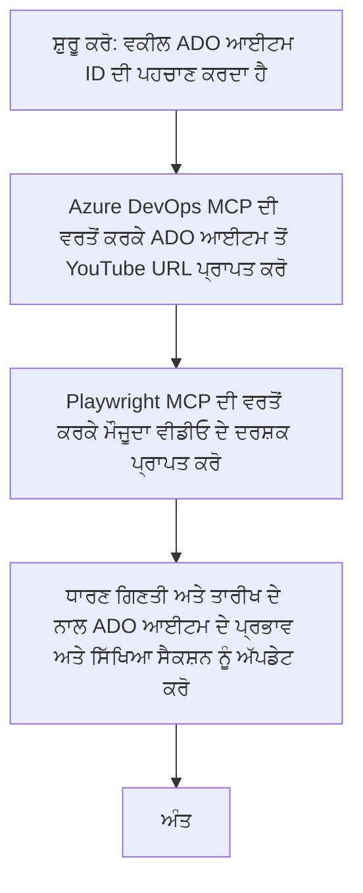

# ਕੇਸ ਅਧਿਐਨ: MCP ਨਾਲ ਯੂਟਿਊਬ ਡੇਟਾ ਤੋਂ Azure DevOps ਆਈਟਮਾਂ ਨੂੰ ਅਪਡੇਟ ਕਰਨਾ

> **ਅਸਤੀਅਤ:** ਮੌਜੂਦਾ ਔਨਲਾਈਨ ਸੰਦ ਤੇ ਰਿਪੋਰਟਾਂ ਮੌਜੂਦ ਹਨ ਜੋ ਯੂਟਿਊਬ ਵਰਗੀਆਂ ਪਲੇਟਫਾਰਮਾਂ ਤੋਂ ਡੇਟਾ ਦੇ ਨਾਲ Azure DevOps ਆਈਟਮਾਂ ਨੂੰ ਅਪਡੇਟ ਕਰਨ ਦੀ ਪ੍ਰਕਿਰਿਆ ਨੂੰ ਆਟੋਮੇਟ ਕਰ ਸਕਦੀਆਂ ਹਨ। ਹੇਠਾਂ ਦਿੱਤਾ ਗਿਆ ਪਰਿਦ੍ਰਿਸ਼ ਸਿਰਫ ਇਕ ਉਦਾਹਰਨ ਦੇ ਤੌਰ 'ਤੇ ਦਿੱਤਾ ਗਿਆ ਹੈ ਕਿ ਕਿਵੇਂ MCP ਸੰਦਾਂ ਨੂੰ ਆਟੋਮੇਸ਼ਨ ਅਤੇ ਇੰਟੀਗਰੇਸ਼ਨ ਟਾਸਕਾਂ ਲਈ ਵਰਤਿਆ ਜਾ ਸਕਦਾ ਹੈ।

## ਵੇਰਵਾ

ਇਸ ਕੇਸ ਅਧਿਐਨ ਵਿੱਚ ਦਿਖਾਇਆ ਗਿਆ ਹੈ ਕਿ ਕਿਵੇਂ ਮਾਡਲ ਕਾਂਟੈਕਸਟ ਪ੍ਰੋਟੋਕੋਲ (MCP) ਅਤੇ ਇਸਦੇ ਸੰਦਾਂ ਨੂੰ ਵਰਤ ਕੇ Azure DevOps (ADO) ਦੇ ਵਰਕ ਆਈਟਮਾਂ ਨੂੰ ਆਨਲਾਈਨ ਪਲੇਟਫਾਰਮਾਂ, ਜਿਵੇਂ ਕਿ ਯੂਟਿਊਬ, ਤੋਂ ਪ੍ਰਾਪਤ ਕੀਤੀ ਜਾਣ ਵਾਲੀ ਜਾਣਕਾਰੀ ਨਾਲ ਅਪਡੇਟ ਕਰਨ ਦੀ ਪ੍ਰਕਿਰਿਆ ਨੂੰ ਆਟੋਮੇਟ ਕੀਤਾ ਜਾ ਸਕਦਾ ਹੈ। ਇਹ ਦੱਸਿਆ ਗਿਆ ਦ੍ਰਿਸ਼ ਸਿਰਫ ਇਹ ਸੰਦਾਂ ਦੀ ਵਿਆਪਕ ਸਮਰੱਥਾਵਾਂ ਵਿਚੋਂ ਇੱਕ ਉਦਾਹਰਨ ਹੈ, ਜੋ ਕਿ ਕਈ ਸਮਾਨ ਆਟੋਮੇਸ਼ਨ ਜਰੂਰਤਾਂ ਲਈ ਅਨੁਕੂਲਿਤ ਕੀਤੇ ਜਾ ਸਕਦੇ ਹਨ।

ਇਸ ਉਦਾਹਰਨ ਵਿੱਚ, ਇਕ ਐਡਵੋਕੇਟ ADO ਆਈਟਮਾਂ ਦੀ ਵਰਤੋਂ ਕਰਕੇ ਆਨਲਾਈਨ ਸੈਸ਼ਨਾਂ ਨੂੰ ਟ੍ਰੈਕ ਕਰਦਾ ਹੈ, ਜਿੱਥੇ ਹਰ ਆਈਟਮ ਵਿੱਚ ਯੂਟਿਊਬ ਵੀਡੀਓ URL ਸ਼ਾਮਲ ਹੁੰਦਾ ਹੈ। MCP ਸੰਦਾਂ ਦੀ ਵਰਤੋਂ ਕਰਕੇ, ਐਡਵੋਕੇਟ ADO ਆਈਟਮਾਂ ਨੂੰ ਤਾਜ਼ਾ ਵੀਡੀਓ ਮੈਟ੍ਰਿਕਸ, ਜਿਵੇਂ ਕਿ ਵੇਖਣ ਦੀ ਗਿਣਤੀ, ਨਾਲ ਅਪਡੇਟ ਕਰ ਸਕਦਾ ਹੈ ਜੋ ਦੁਹਰਾਏ ਜਾਣ ਵਾਲੇ ਅਤੇ ਆਟੋਮੇਟਿਕ ਤਰੀਕੇ ਨਾਲ ਹੁੰਦਾ ਹੈ। ਇਹ ਤਰੀਕਾ ਹੋਰ ਉਪਯੋਗਕਰਤਾਵਾਂ ਲਈ ਵੀ ਸਧਾਰਨ ਕੀਤਾ ਜਾ ਸਕਦਾ ਹੈ ਜਿੱਥੇ ਆਨਲਾਈਨ ਸਰੋਤਾਂ ਤੋਂ ਜਾਣਕਾਰੀ ਨੂੰ ADO ਜਾਂ ਹੋਰ ਪ੍ਰਣਾਲੀਆਂ ਵਿੱਚ ਇਕੱਠਾ ਕਰਨ ਦੀ ਲੋੜ ਹੁੰਦੀ ਹੈ।

## ਦ੍ਰਿਸ਼ਯ

ਇਕ ਐਡਵੋਕੇਟ ਆਨਲਾਈਨ ਸੈਸ਼ਨਾਂ ਅਤੇ ਕਮਿਊਨਿਟੀ ਐੰਗੇਜਮੈਂਟਸ ਦੇ ਪ੍ਰਭਾਵ ਨੂੰ ਟ੍ਰੈਕ ਕਰਨ ਲਈ ਜ਼ਿੰਮੇਵਾਰ ਹੈ। ਹਰ ਸੈਸ਼ਨ ਨੂੰ 'DevRel' ਪ੍ਰੋਜੈਕਟ ਵਿੱਚ ADO ਵਰਕ ਆਈਟਮ ਵਜੋਂ ਲੌਗ ਕੀਤਾ ਜਾਂਦਾ ਹੈ, ਅਤੇ ਵਰਕ ਆਈਟਮ ਵਿੱਚ ਯੂਟਿਊਬ ਵੀਡੀਓ URL ਲਈ ਇਕ ਫੀਲਡ ਹੁੰਦੀ ਹੈ। ਸੈਸ਼ਨ ਦੀ ਪਹੁੰਚ ਦੀ ਸਹੀ ਰਿਪੋਰਟਿੰਗ ਲਈ, ਐਡਵੋਕੇਟ ਨੂੰ ADO ਆਈਟਮ ਨੂੰ ਵੇਖਣ ਦੀ ਮੌਜੂਦਾ ਗਿਣਤੀ ਅਤੇ ਇਸ ਜਾਣਕਾਰੀ ਦੀ ਪ੍ਰਾਪਤੀ ਦੀ ਮਿਤੀ ਨਾਲ ਅਪਡੇਟ ਕਰਨ ਦੀ ਜਰੂਰਤ ਹੁੰਦੀ ਹੈ।

## ਵਰਤੇ ਗਏ ਸੰਦ

- [Azure DevOps MCP](https://github.com/microsoft/azure-devops-mcp): MCP ਰਾਹੀਂ ADO ਵਰਕ ਆਈਟਮਾਂ ਨੂੰ ਕਾਰਜਕਾਰੀ ਪਹੁੰਚ ਅਤੇ ਅਪਡੇਟ ਕਰਨ ਦੀ ਸਹੂਲਤ ਦਿੰਦਾ ਹੈ।
- [Playwright MCP](https://github.com/microsoft/playwright-mcp): ਬ੍ਰਾਊਜ਼ਰ ਕਾਰਵਾਈਆਂ ਨੂੰ ਆਟੋਮੇਟ ਕਰਦੈ ਹੈ ਤਾਂ ਕਿ ਵੈੱਬ ਪੇਜਾਂ ਜਿਵੇਂ ਕਿ ਯੂਟਿਊਬ ਵੀਡੀਓ ਅੰਕੜੇ ਪ੍ਰਾਪਤ ਕੀਤੇ ਜਾ ਸਕਣ।

## ਕਦਮ-ਦਰ-ਕਦਮ ਵਰਕਫਲੋ

1. **ADO ਆਈਟਮ ਦੀ ਪਹਿਚਾਣ ਕਰੋ**: 'DevRel' ਪ੍ਰੋਜੈਕਟ ਵਿੱਚ ADO ਵਰਕ ਆਈਟਮ ID (ਜਿਵੇਂ ਕਿ 1234) ਨਾਲ ਸ਼ੁਰੂ ਕਰੋ।
2. **ਯੂਟਿਊਬ URL ਪ੍ਰਾਪਤ ਕਰੋ**: ADO ਵਰਕ ਆਈਟਮ ਤੋਂ ਯੂਟਿਊਬ URL ਪ੍ਰਾਪਤ ਕਰਨ ਲਈ Azure DevOps MCP ਟੂਲ ਦੀ ਵਰਤੋਂ ਕਰੋ।
3. **ਵੀਡੀਓ ਵੇਖਣਾਂ ਦੀ ਗਿਣਤੀ ਕੱਢੋ**: ਯੂਟਿਊਬ URL 'ਤੇ ਜਾ ਕੇ ਮੌਜੂਦਾ ਵੇਖਣ ਦੀ ਗਿਣਤੀ ਕੱਢਣ ਲਈ Playwright MCP ਟੂਲ ਦੀ ਵਰਤੋਂ ਕਰੋ।
4. **ADO ਆਈਟਮ ਨੂੰ ਅਪਡੇਟ ਕਰੋ**: Azure DevOps MCP ਟੂਲ ਦੀ ਵਰਤੋਂ ਕਰਕੇ ਅਪਡੇਟ ਕੀਤੀ ਗਈ ਵੇਖਣ ਦੀ ਗਿਣਤੀ ਅਤੇ ਪ੍ਰਾਪਤੀ ਦੀ ਮਿਤੀ ਨੂੰ ADO ਵਰਕ ਆਈਟਮ ਦੇ 'Impact and Learnings' ਹਿੱਸੇ ਵਿੱਚ ਲਿਖੋ।

## ਉਦਾਹਰਨ ਪ੍ਰਾਂਪਟ

```bash
- Work with the ADO Item ID: 1234
- The project is '2025-Awesome'
- Get the YouTube URL for the ADO item
- Use Playwright to get the current views from the YouTube video
- Update the ADO item with the current video views and the updated date of the information
```

## Mermaid Flowchart


## ਤਕਨੀਕੀ ਕਿਰਿਆਨਵਯ

- **MCP ਅਰਕੀਟੈਕਚਰ**: ਵਰਕਫਲੋ MCP ਸਰਵਰ ਦੁਆਰਾ ਸੰਗਠਿਤ ਕੀਤਾ ਜਾਂਦਾ ਹੈ, ਜੋ ਕਿ ਦੋਹਾਂ Azure DevOps MCP ਅਤੇ Playwright MCP ਸੰਦਾਂ ਦੀ ਵਰਤੋਂ ਨੂੰ ਸਮਨਵਿਤ ਕਰਦਾ ਹੈ।
- **ਆਟੋਮੇਸ਼ਨ**: ਪ੍ਰਕਿਰਿਆ ਨੂੰ ਮੈਨੂਅਲ ਤੌਰ 'ਤੇ ਚਾਲੂ ਕੀਤਾ ਜਾ ਸਕਦਾ ਹੈ ਜਾਂ ਨਿਯਮਤ ਸਮੇਂ 'ਤੇ ਚਲਾਉਣ ਲਈ ਸ਼ਡਿਊਲ ਕੀਤਾ ਜਾ ਸਕਦਾ ਹੈ ਤਾਂ ਜੋ ADO ਆਈਟਮ ਤਾਜ਼ਾ ਰਹਿਣ।
- **ਵਿਸਤਾਰਯੋਗਤਾ**: ਇਹੀ ਨਮੂਨਾ ਹੋਰ ਆਨਲਾਈਨ ਮੈਟ੍ਰਿਕਸ (ਜਿਵੇਂ ਕਿ ਲਾਈਕ, ਟਿੱਪਣੀਆਂ) ਜਾਂ ਹੋਰ ਪਲੇਟਫਾਰਮਾਂ ਤੋਂ ਡੇਟਾ ਨਾਲ ADO ਆਈਟਮਾਂ ਨੂੰ ਅਪਡੇਟ ਕਰਨ ਲਈ ਵੀ ਵਿਸਤਾਰਿਤ ਕੀਤਾ ਜਾ ਸਕਦਾ ਹੈ।

## ਨਤੀਜੇ ਅਤੇ ਪ੍ਰਭਾਵ

- **ਕੁਸ਼ਲਤਾ**: ਐਡਵੋਕੇਟਾਂ ਲਈ ਵੀਡੀਓ ਮੈਟ੍ਰਿਕਸ ਦੀ ਪ੍ਰਾਪਤੀ ਅਤੇ ਅਪਡੇਟ ਕਰਨ ਵਾਲੀ ਮੈਨੂਅਲ ਮਿਹਨਤ ਨੂੰ ਘਟਾਉਂਦਾ ਹੈ।
- **ਸਹੀਪਨ**: ਯਕੀਨੀ ਬਣਾਉਂਦਾ ਹੈ ਕਿ ADO ਆਈਟਮ ਆਨਲਾਈਨ ਸਰੋਤਾਂ ਤੋਂ ਮਿਲਣ ਵਾਲੇ ਸਭ ਤੋਂ ਤਾਜ਼ਾ ਡੇਟਾ ਨੂੰ ਦਰਸਾਉਂਦੇ ਹਨ।
- **ਦੁਹਰਾਉਣਯੋਗਤਾ**: ਹੋਰ ਸਮਾਨ ਸਥਿਤੀਆਂ ਲਈ ਦੁਹਰਾਏ ਜਾ ਸਕਣ ਵਾਲਾ ਵਰਕਫਲੋ ਮੁਹੱਈਆ ਕਰਦਾ ਹੈ ਜੋ ਹੋਰ ਡੇਟਾ ਸਰੋਤ ਜਾਂ ਮੈਟ੍ਰਿਕਸ ਨਾਲ ਸਬੰਧਿਤ ਹੈ।

## ਹਵਾਲੇ

- [Azure DevOps MCP](https://github.com/microsoft/azure-devops-mcp)
- [Playwright MCP](https://github.com/microsoft/playwright-mcp)
- [Model Context Protocol (MCP)](https://modelcontextprotocol.io/)

## ਅਗਲਾ ਕੀ ਹੈ

- ਵਾਪਸ: [ਕੇਸ ਅਧਿਐਨ ਸਾਰ](./README.md)
- ਅੱਗੇ: [MCP ਨਾਲ ਰੀਅਲ-ਟਾਈਮ ਡੌਕਯੂਮੈਂਟੇਸ਼ਨ ਪ੍ਰਾਪਤੀ](./docs-mcp/README.md)

---

<!-- CO-OP TRANSLATOR DISCLAIMER START -->
**ਅਸਵੀਕਾਰੋਪੱਤਰ**:
ਇਹ ਦਸਤਾਵੇਜ਼ AI ਅਨੁਵਾਦ ਸੇਵਾ [Co-op Translator](https://github.com/Azure/co-op-translator) ਦੀ ਵਰਤੋਂ ਕਰਕੇ ਅਨੁਵਾਦ ਕੀਤਾ ਗਿਆ ਹੈ। ਜਦੋਂ ਕਿ ਅਸੀਂ ਸਹੀਤਾ ਲਈ ਕੋਸ਼ਿਸ਼ ਕਰਦੇ ਹਾਂ, ਕਿਰਪਾ ਕਰਕੇ ਜਾਣੂ ਰਹੋ ਕਿ ਆਟੋਮੇਟਿਕ ਅਨੁਵਾਦ ਵਿੱਚ ਗਲਤੀਆਂ ਜਾਂ ਅਣਸੂਝੀਆਂ ਹੋ ਸਕਦੀਆਂ ਹਨ। ਅਸਲ ਦਸਤਾਵੇਜ਼ ਆਪਣੇ ਮੁਲ਼ ਭਾਸ਼ਾ ਵਿੱਚ ਪ੍ਰਮਾਣਿਕ ਸਰੋਤ ਮੰਨਿਆ ਜਾਣਾ ਚਾਹੀਦਾ ਹੈ। ਮਹੱਤਵਪੂਰਨ ਜਾਣਕਾਰੀ ਲਈ, ਪ੍ਰੋਫੈਸ਼ਨਲ ਮਾਨਵ ਅਨੁਵਾਦ ਸਿਫਾਰਸ਼ੀ ਹੈ। ਇਸ ਅਨੁਵਾਦ ਦੀ ਵਰਤੋਂ ਤੋਂ ਪੈਦਾ ਹੋਈ ਕਿਸੇ ਵੀ ਗਲਤਫਹਿਮੀ ਜਾਂ ਵਿਸ਼ਲੇਖਣ ਲਈ ਅਸੀਂ ਜ਼ਿੰਮੇਵਾਰ ਨਹੀਂ ਹਾਂ।
<!-- CO-OP TRANSLATOR DISCLAIMER END -->