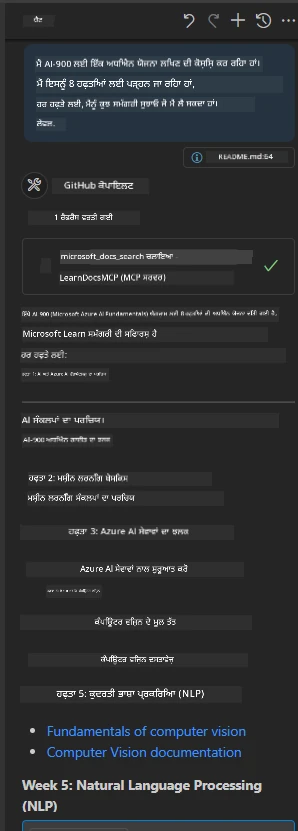

# ਕੇਸ ਅਧਿਐਨ: ਮਾਈਕ੍ਰੋਸੌਫਟ ਲਰਨ ਡੌਕ MCP ਸਰਵਰ ਨਾਲ ਕਲਾਇੰਟ ਤੋਂ ਜੁੜਨਾ

ਕੀ ਤੁਸੀਂ ਕਦੇ ਆਪਣੀ ਕੋਡ ਸਮੱਸਿਆ ਨੂੰ ਸਲਝਾਉਂਦੇ ਸਮੇਂ ਡੌਕਯੂਮੈਂਟੇਸ਼ਨ ਸਾਈਟਾਂ, Stack Overflow ਅਤੇ ਬੇਅੰਤ ਖੋਜ ਇੰਜਣ ਟੈਬਾਂ ਦੇ ਵਿਚਕਾਰ ਜੂਗਲ ਕਰਦੇ ਹੋਏ ਫਸੇ ਹੋਏ ਹੋ? ਸ਼ਾਇਦ ਤੁਹਾਡੇ ਕੋਲ ਡੌਕਸ ਲਈ ਇੱਕ ਦੂਜਾ ਮਾਨੀਟਰ ਹੈ, ਜਾਂ ਤੁਸੀਂ ਬਾਰੰਬਾਰ ਆਪਣੇ IDE ਅਤੇ ਬ੍ਰਾਊਜ਼ਰ ਵਿਚਕਾਰ ਐਲਟ-ਟੈਬ ਕਰਦੇ ਹੋ। ਕੀ ਇਹ ਬਿਹਤਰ ਨਹੀਂ ਹੋਵੇਗਾ ਜੇ ਤੁਸੀਂ ਡੌਕਯੂਮੈਂਟੇਸ਼ਨ ਨੂੰ ਸਿੱਧਾ ਆਪਣੇ ਵਰਕਫਲੋ ਵਿੱਚ ਲਿਆ ਸਕੋ—ਆਪਣੀਆਂ ਐਪਸ, IDE, ਜਾਂ ਆਪਣੇ ਖਾਸ ਉਪਕਰਨਾਂ ਵਿੱਚ ਏਕਤ੍ਰਿਤ? ਇਸ ਕੇਸ ਅਧਿਐਨ ਵਿੱਚ, ਅਸੀਂ ਵੇਖਾਂਗੇ ਕਿ ਇਹ ਕਿਵੇਂ ਕੀਤਾ ਜਾ ਸਕਦਾ ਹੈ ਜਦੋਂ ਤੁਸੀਂ ਆਪਣੇ ਕਲਾਇੰਟ ਐਪਲੀਕੇਸ਼ਨ ਤੋਂ ਸਿੱਧੇ Microsoft Learn Docs MCP ਸਰਵਰ ਨਾਲ ਜੁੜਦੇ ਹੋ।

## ਸਮੀਖਿਆ

ਆਧੁਨਿਕ ਵਿਕਾਸ ਸਿਰਫ ਕੋਡ ਲਿਖਣ ਤੋਂ ਵੱਧ ਹੈ—ਇਹ ਸਹੀ ਸਮੇਂ ਤੇ ਸਹੀ ਜਾਣਕਾਰੀ ਲੱਭਣ ਬਾਰੇ ਹੈ। ਡੌਕਯੂਮੈਂਟੇਸ਼ਨ ਹਰ ਜਗ੍ਹਾ ਹੈ, ਪਰ ਇਹ ਅਕਸਰ ਉਸ ਥਾਂ ਨਹੀਂ ਹੁੰਦੀ ਜਿੱਥੇ ਤੁਹਾਨੂੰ ਸਭ ਤੋਂ ਜ਼ਿਆਦਾ ਲੋੜ ਹੁੰਦੀ ਹੈ: ਆਪਣੇ ਉਪਕਰਨਾਂ ਅਤੇ ਵਰਕਫਲੋ ਦੇ ਅੰਦਰ। ਡੌਕਯੂਮੈਂਟੇਸ਼ਨ ਪ੍ਰਾਪਤੀ ਨੂੰ ਸਿੱਧਾ ਆਪਣੇ ਐਪਲੀਕੇਸ਼ਨਾਂ ਵਿੱਚ ਏਕਤ੍ਰਿਤ ਕਰਕੇ, ਤੁਸੀਂ ਸਮਾਂ ਬਚਾ ਸਕਦੇ ਹੋ, ਸੰਦਰਭ ਬਦਲਾਅ ਘਟਾ ਸਕਦੇ ਹੋ, ਅਤੇ ਉਤਪਾਦਕਤਾ ਵਧਾ ਸਕਦੇ ਹੋ। ਇਸ ਹਿੱਸੇ ਵਿੱਚ, ਅਸੀਂ ਦਿਖਾਵਾਂਗੇ ਕਿ ਕਿਵੇਂ ਕਲਾਇੰਟ ਨੂੰ Microsoft Learn Docs MCP ਸਰਵਰ ਨਾਲ ਜੋੜਣਾ ਹੈ, ਤਾਂ ਜੋ ਤੁਸੀਂ ਆਪਣੇ ਐਪ ਨੂੰ ਕਦੇ ਛੱਡੇ ਬਿਨਾਂ ਰੀਅਲ-ਟਾਈਮ, ਸੰਦਰਭ-ਸੂਚਿਤ ਡੌਕਯੂਮੈਂਟੇਸ਼ਨ ਤੱਕ ਪਹੁੰਚ ਕਰ ਸਕੋ।

ਅਸੀਂ ਇੱਕ ਕਨੈਕਸ਼ਨ ਸਥਾਪਿਤ ਕਰਨ, ਇਕ ਬੇਨਤੀ ਭੇਜਣ ਅਤੇ ਸਟ੍ਰੀਮਿੰਗ ਜਵਾਬਾਂ ਨੂੰ ਪ੍ਰਭਾਵਸ਼ালী ਢੰਗ ਨਾਲ ਸੰਭਾਲਣ ਦੀ ਪ੍ਰਕਿਰਿਆ ਵਿੱਚ ਰਾਹਦਾਰੀ ਕਰਾਂਗੇ। ਇਹ ਤਰੀਕਾ ਸਿਰਫ਼ ਤੁਹਾਡੇ ਵਰਕਫਲੋ ਨੂੰ ਸੁਗਮ ਨਹੀਂ ਬਨਾਉਂਦਾ, ਸਗੋਂ ਹੋਸ਼ਿਆਰ ਅਤੇ ਮਦਦਗਾਰ ਡਿਵੈਲਪਰ ਟੂਲ ਬਣਾਉਣ ਦੇ ਰਾਹ ਖੋਲ੍ਹਦਾ ਹੈ।

## ਸਿੱਖਣ ਦੇ ਲਕੜੇ

ਆਸੀਂ ਇਹ ਕਿਉਂ ਕਰ ਰਹੇ ਹਾਂ? ਕਿਉਂਕਿ ਸਭ ਤੋਂ ਵਧੀਆ ਡਿਵੈਲਪਰ ਅਨੁਭਵ ਉਹ ਹੁੰਦੇ ਹਨ ਜੋ ਰੁਕਾਵਟਾਂ ਨੂੰ ਦੂਰ ਕਰਦੇ ਹਨ। ਸੋਚੋ ਇੱਕ ਦੁਨੀਆ ਜਿਸ ਵਿੱਚ ਤੁਹਾਡਾ ਕੋਡ ਐਡੀਟਰ, ਚੈਟਬੌਟ, ਜਾਂ ਵੈੱਬ ਐਪ Microsoft Learn ਤੋਂ ਨਵੀਨਤਮ ਸਮੱਗਰੀ ਨਾਲ ਤੁਹਾਡੇ ਡੌਕਯੂਮੈਂਟੇਸ਼ਨ ਸਵਾਲਾਂ ਦਾ ਤੁਰੰਤ ਜਵਾਬ ਦੇ ਸਕਦਾ ਹੈ। ਇਸ ਅਧਿਆਇ ਦੇ ਅੰਤ ਤੱਕ, ਤੁਸੀਂ ਜਾਣੋਗੇ ਕਿ ਕਿਵੇਂ:

- MCP ਸਰਵਰ-ਕਲਾਇੰਟ ਸੰਚਾਰ ਦੇ ਮੂਲ ਤੱਤ ਸਮਝੋ
- Microsoft Learn Docs MCP ਸਰਵਰ ਨਾਲ ਜੁੜਨ ਲਈ ਕਨਸੋਲ ਜਾਂ ਵੈੱਬ ਐਪਲੀਕੇਸ਼ਨ ਲਾਗੂ ਕਰੋ
- ਰੀਅਲ-ਟਾਈਮ ਡੌਕਯੂਮੈਂਟੇਸ਼ਨ ਪ੍ਰਾਪਤੀ ਲਈ ਸਟ੍ਰੀਮਿੰਗ HTTP ਕਲਾਇੰਟ ਵਰਤੋ
- ਆਪਣੇ ਐਪ ਵਿੱਚ ਡੌਕਯੂਮੈਂਟੇਸ਼ਨ ਜਵਾਬਾਂ ਦੀ ਲੌਗਿੰਗ ਅਤੇ ਵਿਆਖਿਆ ਕਰੋ

ਤੁਹਾਨੂੰ ਇਹ ਸਮਝ ਆਵੇਗੀ ਕਿ ਇਹ ਹੁਨਰ ਇਸ ਤਰ੍ਹਾਂ ਦੇ ਟੂਲ ਬਣਾਉਣ ਵਿਚ ਕਿਵੇਂ ਮਦਦਗਾਰ ਹੁੰਦੇ ਹਨ ਜੋ ਸਿਰਫ ਪ੍ਰਤੀਕ੍ਰਿਆਸ਼ੀਲ ਹੀ ਨਹੀਂ, ਸਗੋਂ ਸੱਚਮੁੱਚ ਇੰਟਰਐਕਟਿਵ ਅਤੇ ਸੰਦਰਭ-ਸੂਚਿਤ ਹੁੰਦੇ ਹਨ।

## ਪਰਿਸਥਿਤੀ 1 - MCP ਨਾਲ ਰੀਅਲ-ਟਾਈਮ ਡੌਕਯੂਮੈਂਟੇਸ਼ਨ ਪ੍ਰਾਪਤੀ

ਇਸ ਪਰਿਸਥਿਤੀ ਵਿੱਚ, ਅਸੀਂ ਤੁਹਾਨੂੰ ਦਿਖਾਵਾਂਗੇ ਕਿ ਕਿਵੇਂ ਇੱਕ ਕਲਾਇੰਟ Microsoft Learn Docs MCP ਸਰਵਰ ਨਾਲ ਜੁੜਦਾ ਹੈ ਤਾਂ ਜੋ ਤੁਸੀਂ ਆਪਣੇ ਐਪ ਨੂੰ ਕਦੇ ਛੱਡੇ ਬਿਨਾਂ ਰੀਅਲ-ਟਾਈਮ, ਸੰਦਰਭ-ਜਾਣਕਾਰ ਡੌਕਯੂਮੈਂਟੇਸ਼ਨ ਨੂੰ ਪ੍ਰਾਪਤ ਕਰ ਸਕੋ।

ਆਓ ਇਸਨੂੰ ਅਮਲੀ ਜਿਹਤੀ ਬਣਾਈਏ। ਤੁਹਾਡਾ ਕੰਮ ਇੱਕ ਐਪ ਲਿਖਣਾ ਹੈ ਜੋ Microsoft Learn Docs MCP ਸਰਵਰ ਨਾਲ ਜੁੜਦਾ ਹੈ, `microsoft_docs_search` ਟੂਲ ਨੂੰ ਕਾਲ ਕਰਦਾ ਹੈ, ਅਤੇ ਸਟ੍ਰੀਮਿੰਗ ਜਵਾਬ ਨੂੰ ਕਨਸੋਲ 'ਤੇ ਲੌਗ ਕਰਦਾ ਹੈ।

### ਇਹ ਤਰੀਕਾ ਕਿਉਂ?
ਕਿਉਂਕਿ ਇਹ ਹੋਰ ਉੱਚ ਤਕਨਾਲੋਜੀ ਏਕਤ੍ਰਿਤਾਂ ਬਣਾਉਣ ਦਾ ਮੂਲ ਹੈ — ਜੇ ਤੁਸੀਂ ਚੈਟਬੌਟ, IDE ਐਕਸਟੈਂਸ਼ਨ, ਜਾਂ ਵੈੱਬ ਡੈਸ਼ਬੋਰਡ ਬਣਾਉਣਾ ਚਾਹੁੰਦੇ ਹੋ।

ਤੁਸੀਂ ਇਸ ਕੇਸ ਅਧਿਐਨ ਦੇ [`solution`](./solution/README.md) ਫੋਲਡਰ ਵਿੱਚ ਇਸ ਪਰਿਸਥਿਤੀ ਲਈ ਕੋਡ ਅਤੇ ਹਦਾਇਤਾਂ ਪਾਓਗੇ। ਇਸ ਦੇ ਕਦਮ ਤੁਹਾਨੂੰ ਕਨੈਕਸ਼ਨ ਸੈੱਟਅੱਪ ਕੀਤੇ ਜਾਣਗੇ:
- ਅਧਿਕਾਰਕ MCP SDK ਅਤੇ ਸਟ੍ਰੀਮ ਕਰਨ ਵਾਲਾ HTTP ਕਲਾਇੰਟ ਵਰਤੋ
- `microsoft_docs_search` ਟੂਲ ਨੂੰ ਇੱਕ ਕਵੈਰੀ ਪੈਰਾਮੀਟਰ ਦੇ ਨਾਲ ਕੌਲ ਕਰਕੇ ਡੌਕਯੂਮੈਂਟੇਸ਼ਨ ਪ੍ਰਾਪਤ ਕਰੋ
- ਸਮੁਚਿਤ ਲੌਗਿੰਗ ਅਤੇ ਤਰੁੱਟੀ ਸੰਭਾਲ ਲਾਗੂ ਕਰੋ
- ਉਪਭੋਗਤਾਵਾਂ ਨੂੰ ਕਈ ਖੋਜ ਕਵੈਰੀਆਂ ਦਰਜ ਕਰਨ ਦੀ ਆਗਿਆ ਦੇਣ ਲਈ ਇੰਟਰऐਕਟਿਵ ਕਨਸੋਲ ਇੰਟਰਫੇਸ ਬਣਾਓ

ਇਹ ਪਰਿਸਥਿਤੀ ਦਰਸਾਉਂਦੀ ਹੈ ਕਿ ਕਿਵੇਂ:
- Docs MCP ਸਰਵਰ ਨਾਲ ਜੁੜੋ
- ਇੱਕ ਕਵੈਰੀ ਭੇਜੋ
- ਨਤੀਜੇ ਪਾਰਸ ਅਤੇ ਪ੍ਰਿੰਟ ਕਰੋ

ਇਸ ਤਰ੍ਹਾਂ ਹੱਲ ਚਲਾਉਂਦੇ ਵੇਲੇ ਕੀ ਹੋ ਸਕਦਾ ਹੈ:

```
Prompt> What is Azure Key Vault?
Answer> Azure Key Vault is a cloud service for securely storing and accessing secrets. ...
```

ਥੱਲੇ ਇੱਕ ਘੱਟੋ-ਘੱਟ ਨਮੂਨਾ ਹੱਲ ਦਿੱਤਾ ਹੈ। ਪੂਰਾ ਕੋਡ ਅਤੇ ਵਿਵਰਣ ਹੱਲ ਫੋਲਡਰ ਵਿੱਚ ਉਪਲਬਧ ਹਨ।

<details>
<summary>Python</summary>

```python
import asyncio
from mcp.client.streamable_http import streamablehttp_client
from mcp import ClientSession

async def main():
    async with streamablehttp_client("https://learn.microsoft.com/api/mcp") as (read_stream, write_stream, _):
        async with ClientSession(read_stream, write_stream) as session:
            await session.initialize()
            result = await session.call_tool("microsoft_docs_search", {"query": "Azure Functions best practices"})
            print(result.content)

if __name__ == "__main__":
    asyncio.run(main())
```

- ਪੂਰੀ ਲਾਗੂਅਤ ਅਤੇ ਲੌਗਿੰਗ ਲਈ, ਵੇਖੋ [`scenario1.py`](../../../../09-CaseStudy/docs-mcp/solution/python/scenario1.py)।
- ਇੰਸਟਾਲੇਸ਼ਨ ਅਤੇ ਇਸਤੇਮਾਲ ਦੀ ਹਦਾਇਤਾਂ ਲਈ, ਵੇਖੋ [`README.md`](./solution/python/README.md) ਫਾਇਲ ਇਕੋ ਫੋਲਡਰ ਵਿੱਚ।
</details>


## ਪਰਿਸਥਿਤੀ 2 - MCP ਨਾਲ ਇੰਟਰਐਕਟਿਵ ਅਧਿਐਨ ਯੋਜਨਾ ਜਨਰੇਟਰ ਵੈੱਬ ਐਪ

ਇਸ ਪਰਿਸਥਿਤੀ ਵਿੱਚ, ਤੁਸੀਂ ਸਿੱਖੋਗੇ ਕਿ Docs MCP ਨੂੰ ਇਕ ਵੈੱਬ ਵਿਕਾਸ ਪ੍ਰਾਜੈਕਟ ਵਿੱਚ ਕਿਵੇਂ ਏਕਤ੍ਰਿਤ ਕਰਨਾ ਹੈ। ਲਕੜਾ ਇਹ ਹੈ ਕਿ ਉਪਭੋਗਤਾਵਾਂ ਨੂੰ Microsoft Learn ਡੌਕਯੂਮੈਂਟੇਸ਼ਨ ਨੂੰ ਸਿੱਧਾ ਵੈੱਬ ਇੰਟਰਫੇਸ ਤੋਂ ਖੋਜਣ ਲਈ ਸਮਰੱਥ ਬਣਾਇਆ ਜਾਵੇ, ਜਿਸ ਨਾਲ ਡੌਕਯੂਮੈਂਟੇਸ਼ਨ ਤੁਹਾਡੇ ਐਪ ਜਾਂ ਸਾਈਟ ਵਿੱਚ ਤੁਰੰਤ ਸੁਗਮ ਹੋਵੇ।

ਤੁਸੀਂ ਸਿੱਖੋਗੇ ਕਿ:
- ਇਕ ਵੈੱਬ ਐਪ ਸੈਟਅੱਪ ਕਰੋ
- Docs MCP ਸਰਵਰ ਨਾਲ ਜੁੜੋ
- ਉਪਭੋਗਤਾ ਦੀ ਇੰਪੁੱਟ ਸੰਭਾਲੋ ਅਤੇ ਨਤੀਜੇ ਦਰਸਾਓ

ਇਸ ਤਰ੍ਹਾਂ ਹੱਲ ਚਲਾਉਂਦੇ ਵੇਲੇ ਕੀ ਹੋ ਸਕਦਾ ਹੈ:

```
User> I want to learn about AI102 - so suggest the roadmap to get it started from learn for 6 weeks

Assistant> Here’s a detailed 6-week roadmap to start your preparation for the AI-102: Designing and Implementing a Microsoft Azure AI Solution certification, using official Microsoft resources and focusing on exam skills areas:

---
## Week 1: Introduction & Fundamentals
- **Understand the Exam**: Review the [AI-102 exam skills outline](https://learn.microsoft.com/en-us/credentials/certifications/exams/ai-102/).
- **Set up Azure**: Sign up for a free Azure account if you don't have one.
- **Learning Path**: [Introduction to Azure AI services](https://learn.microsoft.com/en-us/training/modules/intro-to-azure-ai/)
- **Focus**: Get familiar with Azure portal, AI capabilities, and necessary tools.

....more weeks of the roadmap...

Let me know if you want module-specific recommendations or need more customized weekly tasks!
```

ਥੱਲੇ ਇੱਕ ਘੱਟੋ-ਘੱਟ ਨਮੂਨਾ ਹੱਲ ਦਿੱਤਾ ਹੈ। ਪੂਰਾ ਕੋਡ ਅਤੇ ਵਿਵਰਣ ਹੱਲ ਫੋਲਡਰ ਵਿੱਚ ਉਪਲਬਧ ਹਨ।


<details>
<summary>Python (Chainlit)</summary>

Chainlit ਸੰਵਾਦਾਤਮਕ AI ਵੈੱਬ ਐਪਸ ਬਣਾਉਣ ਲਈ ਫਰੇਮਵਰਕ ਹੈ। ਇਹ ਇੰਟਰਐਕਟਿਵ ਚੈਟਬੋਟ ਅਤੇ ਅਸਿਸਟੈਂਟ ਬਣਾਉਣਾ ਸੌਖਾ ਕਰਦਾ ਹੈ ਜੋ MCP ਟੂਲਾਂ ਨੂੰ ਕਾਲ ਕਰ ਸਕਦੇ ਹਨ ਅਤੇ ਨਤੀਜੇ ਵਾਲੇ ਸਮੇਂ ਵਿੱਚ ਵਿਖਾ ਸਕਦੇ ਹਨ। ਇਹ ਤੇਜ਼ ਪ੍ਰੋਟੋਟਾਇਪਿੰਗ ਅਤੇ ਉਪਭੋਗਤਾ-ਮਿਤ੍ਰ ਇੰਟਰਫੇਸ ਲਈ ਆਦਰਸ਼ ਹੈ।

```python
import chainlit as cl
import requests

MCP_URL = "https://learn.microsoft.com/api/mcp"

@cl.on_message
def handle_message(message):
    query = {"question": message}
    response = requests.post(MCP_URL, json=query)
    if response.ok:
        result = response.json()
        cl.Message(content=result.get("answer", "No answer found.")).send()
    else:
        cl.Message(content="Error: " + response.text).send()
```

- ਪੂਰੀ ਲਾਗੂਅਤ ਲਈ, ਵੇਖੋ [`scenario2.py`](../../../../09-CaseStudy/docs-mcp/solution/python/scenario2.py)।
- ਸੈਟਅੱਪ ਅਤੇ ਚਲਾਉਣ ਦੀ ਹਦਾਇਤਾਂ ਲਈ, ਵੇਖੋ [`README.md`](./solution/python/README.md)।
</details>


## ਪਰਿਸਥਿਤੀ 3: VS ਕੋਡ ਵਿੱਚ MCP ਸਰਵਰ ਨਾਲ ਇਨ-ਏਡੀਟਰ ਡੌਕਸ

ਜੇ ਤੁਸੀਂ Microsoft Learn Docs ਨੂੰ ਸਿੱਧਾ VS Code ਵਿੱਚ ਪ੍ਰਾਪਤ ਕਰਨਾ ਚਾਹੁੰਦੇ ਹੋ (ਬ੍ਰਾਊਜ਼ਰ ਟੈਬਾਂ ਨੂੰ ਬਦਲਣ ਦੇ ਬਜਾਏ), ਤਾਂ ਤੁਸੀਂ ਆਪਣੇ ਐਡੀਟਰ ਵਿੱਚ MCP ਸਰਵਰ ਵਰਤ ਸਕਦੇ ਹੋ। ਇਸ ਨਾਲ ਤੁਸੀਂ:
- VS Code ਵਿੱਚ ਕੋਡਿੰਗ ਮਾਹੌਲ ਨੂੰ ਛੱਡੇ ਬਿਨਾਂ ਡੌਕਸ ਖੋਜ ਅਤੇ ਪੜ੍ਹ ਸਕਦੇ ਹੋ।
- ਡੌਕਯੂਮੈਂਟੇਸ਼ਨ ਦਾ ਹਵਾਲਾ ਦੇ ਸਕਦੇ ਹੋ ਅਤੇ README ਜਾਂ ਕੋਰਸ ਫਾਇਲਾਂ ਵਿੱਚ ਲਿੰਕ ਸਿੱਧਾ ਦਾਖਲ ਕਰ ਸਕਦੇ ਹੋ।
- GitHub Copilot ਅਤੇ MCP ਨੂੰ ਮਿਲਾ ਕੇ ਇੱਕ ਨਿਖਰਿਆ ਹੋਇਆ, AI-ਸਕਤੀਸ਼ਾਲੀ ਡੌਕਯੂਮੈਂਟੇਸ਼ਨ ਵਰਕਫਲੋ ਤਿਆਰ ਕਰ ਸਕਦੇ ਹੋ।

**ਤੁਸੀਂ ਸਿੱਖੋਗੇ ਕਿ:**
- ਆਪਣੀ ਵਰਕਸਪੇਸ ਰੂਟ ਵਿੱਚ ਇੱਕ ਮਾਨਯੋਗ `.vscode/mcp.json` ਫਾਇਲ ਜੋੜੋ (ਹੇਠਾਂ ਉਦਾਹਰਨ ਦੇਖੋ)।
- VS Code ਵਿੱਚ MCP ਪੈਨਲ ਖੋਲ੍ਹੋ ਜਾਂ ਕਮਾਂਡ ਪੈਲੇਟ ਵਰਤ ਕੇ ਡੌਕਸ ਖੋਜੋ ਅਤੇ ਦਾਖਲ ਕਰੋ।
- ਆਪਣੇ ਮਾਰਕਡਾਊਨ ਫਾਇਲਾਂ ਵਿੱਚ ਕੰਮ ਕਰਦੇ ਸਮੇਂ ਡੌਕਯੂਮੈਂਟੇਸ਼ਨ ਨੂੰ ਸਿੱਧਾ ਹਵਾਲਾ ਦਿਓ।
- ਇਸ ਵਰਕਫਲੋ ਨੂੰ GitHub Copilot ਨਾਲ ਮਿਲਾ ਕੇ ਹੋਰ ਉਤਪਾਦਕਤਾ ਪ੍ਰਾਪਤ ਕਰੋ।

ਇਹ ਰਹੀ MCP ਸਰਵਰ ਨੂੰ VS ਕੋਡ ਵਿੱਚ ਸੈਟਅੱਪ ਕਰਨ ਦੀ ਇਕ ਉਦਾਹਰਨ:

```json
{
  "servers": {
    "LearnDocsMCP": {
      "url": "https://learn.microsoft.com/api/mcp"
    }
  }
}
```

</details>

> ਵੇਰਵੇਦਾਰ ਚੱਲਾਵਟ ਅਤੇ ਕਦਮ-ਦਰ-कਦਮ ਗਾਈਡ ਲਈ, ਵੇਖੋ [`README.md`](./solution/scenario3/README.md)।



ਇਹ ਤਰੀਕਾ ਕਿਸੇ ਵੀ ਵਿਅਕਤੀ ਲਈ ਆਦਰਸ਼ ਹੈ ਜੋ ਤਕਨੀਕੀ ਕੋਰਸ, ਡੌਕਯੂਮੈਂਟੇਸ਼ਨ ਲਿਖਣ ਜਾਂ ਬਾਰੰਬਾਰ ਹਵਾਲਾ ਲੈਣ ਵਾਲੀ ਕੋਡਿੰਗ ਕਰ ਰਿਹਾ ਹੈ।

## ਮੁੱਖ ਗੱਲਾਂ

ਡੌਕਯੂਮੈਂਟੇਸ਼ਨ ਨੂੰ ਸਿੱਧਾ ਤੁਹਾਡੇ ਉਪਕਰਨਾਂ ਵਿੱਚ ਏਕਤ੍ਰਿਤ ਕਰਨਾ ਸਿਰਫ ਸੁਵਿਧਾ ਨਹੀਂ, ਸਗੋਂ ਉਤਪਾਦਕਤਾ ਲਈ ਇੱਕ ਖੇਡ ਬਦਲਣ ਵਾਲਾ ਹੈ। ਆਪਣੇ ਕਲਾਇੰਟ ਤੋਂ Microsoft Learn Docs MCP ਸਰਵਰ ਨਾਲ ਜੁੜ ਕੇ, ਤੁਸੀਂ:

- ਆਪਣੇ ਕੋਡ ਅਤੇ ਡੌਕਯੂਮੈਂਟੇਸ਼ਨ ਵਿੱਚ ਸੰਦਰਭ ਬਦਲਾਅ ਨੂੰ ਖਤਮ ਕਰ ਸਕਦੇ ਹੋ
- ਤੁਰੰਤ, ਸੰਦਰਭ-ਜਾਣਕਾਰ ਡੌਕ ਪ੍ਰਾਪਤ ਕਰ ਸਕਦੇ ਹੋ
- ਤੇਜ਼, ਹੋਸ਼ਿਆਰ ਅਤੇ ਇੰਟਰਐਕਟਿਵ ਡਿਵੈਲਪਰ ਟੂਲ ਤਿਆਰ ਕਰ ਸਕਦੇ ਹੋ

ਇਹ ਹੁਨਰ ਤੁਹਾਨੂੰ ਐਸੇ ਹੱਲ ਬਣਾਉਣ ਵਿੱਚ ਮਦਦ ਕਰਨਗੇ ਜੋ ਨਾ ਸਿਰਫ ਪ੍ਰਭਾਵਸ਼ালী ਹਨ, ਸਗੋਂ ਵਰਤੋਂ ਲਈ ਵੀ ਖੁਸ਼ਗਵਾਰ ਹਨ।

## ਵਾਧੂ ਸਰੋਤ

ਆਪਣੀ ਸਮਝ ਨੂੰ ਹੋਰ ਗਹਿਰਾਈ ਵਿੱਚ ਲਿਜਾਣ ਲਈ, ਇਹ ਅਧਿਕਾਰਕ ਸਰੋਤ ਖੋਜੋ:

- [Microsoft Learn Docs MCP Server (GitHub)](https://github.com/MicrosoftDocs/mcp)
- [Azure MCP Server ਨਾਲ ਸ਼ੁਰੂਆਤ (mcp-python)](https://learn.microsoft.com/en-us/azure/developer/azure-mcp-server/get-started#create-the-python-app)
- [Azure MCP Server ਕੀ ਹੈ?](https://learn.microsoft.com/en-us/azure/developer/azure-mcp-server/)
- [Model Context Protocol (MCP) ਪਰਚਿਆ](https://modelcontextprotocol.io/introduction)
- [MCP ਸਰਵਰ ਤੋਂ ਪਲੱਗਇਨ ਜੋੜੋ (Python)](https://learn.microsoft.com/en-us/semantic-kernel/concepts/plugins/adding-mcp-plugins)

## ਅਗਲਾ ਕੀ ਹੈ

- ਵਾਪਸ ਜਾਓ: [ਕੇਸ ਅਧਿਐਨਾਂ ਦੀ ਸਮੀਖਿਆ](../README.md)
- ਜਾਰੀ ਰੱਖੋ: [ਮੋਡੀਊਲ 10: AI ਟੂਲਕਿਟ ਨਾਲ AI ਵਰਕਫਲੋਜ਼ ਨੂੰ ਸੁਚਾਰੂ ਬਣਾਉਣਾ](../../10-StreamliningAIWorkflowsBuildingAnMCPServerWithAIToolkit/README.md)

---

<!-- CO-OP TRANSLATOR DISCLAIMER START -->
**ਇਸਤੇਫਾ**:  
ਇਹ ਦਸਤਾਵੇਜ਼ AI ਅਨੁਵਾਦ ਸੇਵਾ [Co-op Translator](https://github.com/Azure/co-op-translator) ਦੀ ਵਰਤੋਂ ਕਰਕੇ ਅਨੁਵਾਦ ਕੀਤਾ ਗਿਆ ਹੈ। ਜਦੋਂ ਕਿ ਅਸੀਂ ਸਹੀਅਤਾ ਲਈ ਕੋਸ਼ਿਸ਼ ਕਰਦੇ ਹਾਂ, ਕਿਰਪਾ ਕਰਕੇ ਧਿਆਨ ਵਿੱਚ ਰੱਖੋ ਕਿ ਸਵੈਚਲਿਤ ਅਨੁਵਾਦਾਂ ਵਿੱਚ ਗਲਤੀਆਂ ਜਾਂ ਅਸਟੀਕਤਾਵਾਂ ਹੋ ਸਕਦੀਆਂ ਹਨ। ਮੂਲ ਦਸਤਾਵੇਜ਼ ਆਪਣੇ ਮੂਲ ਭਾਸ਼ਾ ਵਿੱਚ ਅਧਿਕਾਰਿਕ ਸਰੋਤ ਮੰਨਿਆ ਜਾਣਾ ਚਾਹੀਦਾ ਹੈ। ਮਹੱਤਵਪੂਰਨ ਜਾਣਕਾਰੀ ਲਈ ਪੇਸ਼ੇਵਰ ਮਨੁੱਖੀ ਅਨੁਵਾਦ ਦੀ ਸਿਫਾਰਿਸ਼ ਕੀਤੀ ਜਾਂਦੀ ਹੈ। ਅਸੀਂ ਇਸ ਅਨੁਵਾਦ ਦੀ ਵਰਤੋਂ ਤੋਂ ਪੈਦਾ ਹੋਣ ਵਾਲੀਆਂ ਕਿਸੇ ਵੀ ਗਲਤਫਹਿਮੀਆਂ ਜਾਂ ਗਲਤ ਵਿਵਿਆਖਿਆਵਾਂ ਲਈ ਜ਼ਿੰਮੇਵਾਰ ਨਹੀਂ ਹਾਂ।
<!-- CO-OP TRANSLATOR DISCLAIMER END -->