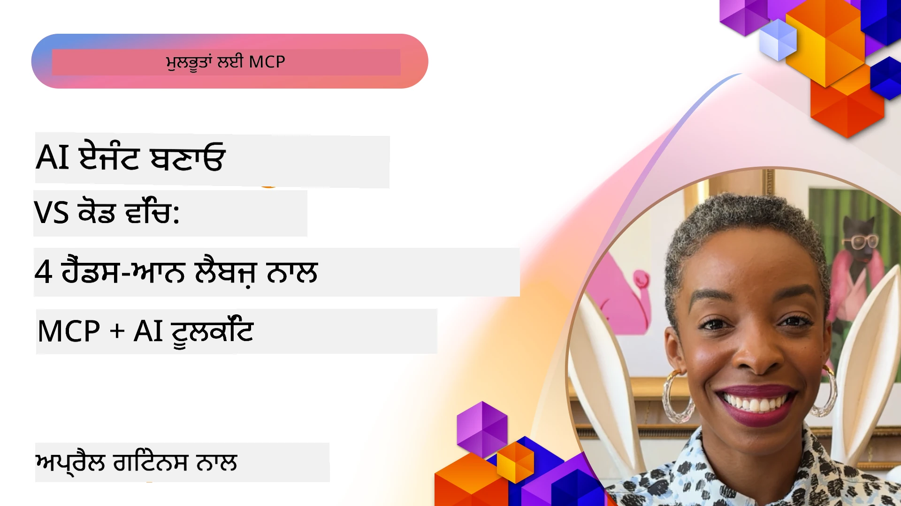

# ਏਆਈ ਵਰਕਫ਼ਲੋਜ਼ ਨੂੰ ਸਧਾਰਨ ਬਣਾਉਣਾ: ਏਆਈ ਟੂਲਕਿਟ ਨਾਲ MCP ਸਰਵਰ ਬਣਾਉਣਾ

## 🎯  ਜਾਇਜ਼ਾ

_(ਇਸ ਪਾਠ ਦਾ ਵੀਡੀਓ ਦੇਖਣ ਲਈ ਉੱਪਰ ਦਿੱਤੀ ਤਸਵੀਰ 'ਤੇ ਕਲਿੱਕ ਕਰੋ)_

ਤੁਹਾਡਾ **ਮਾਡਲ ਕਾਂਟੈਕਸਟ ਪ੍ਰੋਟੋਕਾਲ (MCP) ਵਰਕਸ਼ਾਪ** ਵਿੱਚ ਸਵਾਗਤ ਹੈ! ਇਹ ਵਿਆਪਕ ਹੈਂਡਸ-ਆਨ ਵਰਕਸ਼ਾਪ ਦੋ ਅਗੇਤਕ ਤਕਨੀਕਾਂ ਨੂੰ ਜੋੜਦਾ ਹੈ ਜੋ AI ਐਪਲੀਕੇਸ਼ਨ ਵਿਕਾਸ ਨੂੰ ਬਦਲ ਦੇਣਗੇ:

- **🔗 ਮਾਡਲ ਕਾਂਟੈਕਸਟ ਪ੍ਰੋਟੋਕਾਲ (MCP)**: ਏਆਈ-ਟੂਲ ਇੰਟੀਗ੍ਰੇਸ਼ਨ ਲਈ ਇੱਕ ਖੁਲਾ ਸਟੈਂਡਰਡ
- **🛠️ ਵਿਜ਼ੂਅਲ ਸਟੂਡੀਓ ਕੋਡ ਲਈ AI ਟੂਲਕਿਟ (AITK)**: ਮਾਈਕ੍ਰੋਸੌਫਟ ਦੀ ਸ਼ਕਤੀਸ਼ਾਲੀ ਏਆਈ ਵਿਕਾਸ ਐਕਸਟੈਂਸ਼ਨ

### 🎓 ਤੁਸੀਂ ਕੀ ਸਿੱਖੋਗੇ

ਇਸ ਵਰਕਸ਼ਾਪ ਦੇ ਅੰਤ ਤੱਕ, ਤੁਸੀਂ ਸਮਝਦਾਰ ਐਪਲੀਕੇਸ਼ਨ ਬਣਾਉਣ ਆ ਜਾਵੋਗੇ ਜੋ ਏਆਈ ਮਾਡਲਾਂ ਨੂੰ ਅਸਲੀ ਦੁਨੀਆ ਦੇ ਟੂਲ ਅਤੇ ਸਰਵਿਸਿਜ਼ ਨਾਲ ਜੋੜਦੇ ਹਨ। ਆਟੋਮੈਟਿਕ ਟੈਸਟਿੰਗ ਤੋਂ ਲੈ ਕੇ ਕਸਟਮ ਏਪੀਆਈ ਇੰਟੀਗ੍ਰੇਸ਼ਨਾਂ ਤੱਕ, ਤੁਸੀਂ ਜੱਟਿਲ ਕਾਰੋਬਾਰੀ ਚੁਣੌਤੀਆਂ ਨੂੰ ਹੱਲ ਕਰਨ ਲਈ ਪ੍ਰਯੋਗੀ ਹੁਨਰ ਪ੍ਰਾਪਤ ਕਰੋਗੇ।

## 🏗️ ਤਕਨੀਕੀ ਸਟੈਕ

### 🔌 ਮਾਡਲ ਕਾਂਟੈਕਸਟ ਪ੍ਰੋਟੋਕਾਲ (MCP)

MCP ਏਆਈ ਲਈ **"USB-C"** ਹੈ - ਇੱਕ ਵਿਸ਼ਵ ਵਿਆਪੀ ਸਟੈਂਡਰਡ ਜੋ ਏਆਈ ਮਾਡਲਾਂ ਨੂੰ ਬਾਹਰੀ ਟੂਲ ਅਤੇ ਡੇਟਾ ਸਰੋਤਾਂ ਨਾਲ ਜੁੜਦਾ ਹੈ।

**✨ ਮੁੱਖ ਵਿਸ਼ੇਸ਼ਤਾਵਾਂ:**

- 🔄 **ਮਿਆਰੀਕ੍ਰਿਤ ਇੰਟੀਗ੍ਰੇਸ਼ਨ**: ਏਆਈ-ਟੂਲ ਜੁੜਾਈ ਲਈ ਯੂਨੀਵਰਸਲ ਇੰਟਰਫੇਸ
- 🏛️ **ਲਚਕੀਲਾ ਆਰਕੀਟੈਕਚਰ**: ਸਥਾਨਕ ਅਤੇ ਰਿਮੋਟ ਸਰਵਰ stdio/SSE ਟਰਾਂਸਪੋਰਟ ਰਾਹੀਂ
- 🧰 **ਧਨਵਾਨ ਪਰਿਵੇਸ਼**: ਇੱਕ ਪ੍ਰੋਟੋਕਾਲ ਵਿੱਚ ਟੂਲਜ਼, ਪ੍ਰੋਂਪਟ ਅਤੇ ਸਰੋਤ
- 🔒 **ਐਂਟਰਪ੍ਰਾਈਜ਼-ਰੈਡੀ**: ਬਿਲਟ-ਇਨ ਸੁਰੱਖਿਆ ਅਤੇ ਭਰੋਸੇਯੋਗਤਾ

**🎯 MCP ਮਹੱਤਵ ਕਿਉਂ ਰੱਖਦਾ ਹੈ:**
ਜਿਵੇਂ USB-C ਨੇ ਕੇਬਲ ਹੰਗਾਮਾ ਖਤਮ ਕੀਤਾ, MCP ਏਆਈ ਇੰਟੀਗ੍ਰੇਸ਼ਨਾਂ ਦੀ ਪੇਚੀਦਗੀ ਖਤਮ ਕਰਦਾ ਹੈ। ਇੱਕ ਪ੍ਰੋਟੋਕਾਲ, ਅਨੰਤ ਸੰਭਾਵਨਾਵਾਂ।

### 🤖 ਵਿਜ਼ੂਅਲ ਸਟੂਡੀਓ ਕੋਡ ਲਈ AI ਟੂਲਕਿਟ (AITK)

ਮਾਈਕ੍ਰੋਸੌਫਟ ਦਾ ਪ੍ਰਮੁੱਖ ਏਆਈ ਵਿਕਾਸ ਐਕਸਟੈਂਸ਼ਨ ਜੋ VS ਕੋਡ ਨੂੰ ਏਆਈ ਸ਼ਕਤੀਸ਼ਾਲੀ ਬਣਾਉਂਦਾ ਹੈ।

**🚀 ਮੁੱਖ ਸਮਰੱਥਾਵਾਂ:**

- 📦 **ਮਾਡਲ ਕੈਟਾਲੌਗ**: Azure AI, GitHub, Hugging Face, Ollama ਤੋਂ ਮਾਡਲਾਂ ਦੀ ਪਹੁੰਚ
- ⚡ **ਲੋਕਲ ਸੰਕੇਤਕਰਨ**: ONNX-ਅਨੁਕੂਲ CPU/GPU/NPU ਐਗਜ਼ੀਕਿਊਸ਼ਨ
- 🏗️ **ਏਜੰਟ ਬਿਲਡਰ**: MCP ਇੰਟੀਗ੍ਰੇਸ਼ਨ ਨਾਲ ਵਿਜ਼ੂਅਲ ਏਆਈ ਏਜੰਟ ਵਿਕਾਸ
- 🎭 **ਮਲਟੀ-ਮੋਡਲ**: ਲਿਖਤ, ਵਿਜ਼ਨ, ਅਤੇ ਢਾਂਚਾਬੱਧ ਨਤੀਜਿਆਂ ਦਾ ਸਹਾਰਾ

**💡 ਵਿਕਾਸ ਦੇ ਫਾਇਦੇ:**

- ਜ਼ੀਰੋ-ਕਨਫਿਗ ਮਾਡਲ ਡਿਪਲੌਇਮੈਂਟ
- ਵਿਜ਼ੂਅਲ ਪ੍ਰੋਂਪਟ ਇੰਜੀਨੀਅਰਿੰਗ
- ਰੀਅਲ-ਟਾਈਮ ਟੈਸਟਿੰਗ ਪਲੇਗ੍ਰਾਊਂਡ
- ਨਿਰੰਤਰ MCP ਸਰਵਰ ਇੰਟੀਗ੍ਰੇਸ਼ਨ

## 📚 ਸਿੱਖਣ ਯਾਤਰਾ

### [🚀 ਮੋਡੀਊਲ 1: AI ਟੂਲਕਿਟ ਮੁੱਢਲੇ ਸਿਧਾਂਤਾਂ](./lab1/README.md)

**ਅਵਧੀ**: 15 ਮਿੰਟ

- 🛠️ VS ਕੋਡ ਲਈ AI ਟੂਲਕਿਟ ਇੰਸਟਾਲ ਅਤੇ ਸੰਰਚਿਤ ਕਰੋ
- 🗂️ ਮਾਡਲ ਕੈਟਾਲੌਗ ਦੀ ਖੋਜ ਕਰੋ (GitHub, ONNX, OpenAI, Anthropic, Google ਤੋਂ 100+ ਮਾਡਲ)
- 🎮 ਰੀਅਲ-ਟਾਈਮ ਮਾਡਲ ਟੈਸਟਿੰਗ ਲਈ ਇੰਟਰੈਕਟਿਵ ਪਲੇਗ੍ਰਾਊਂਡ ਵਿੱਚ ਮਾਹਿਰ ਬਣੋ
- 🤖 Agent Builder ਨਾਲ ਆਪਣਾ ਪਹਿਲਾ ਏਆਈ ਏਜੰਟ ਬਣਾਓ
- 📊 ਬਿਲਟ-ਇਨ ਮੈਟ੍ਰਿਕਸ (F1, ਸਬੰਧਤਾ, ਸਮਾਨਤਾ, ਸੰਗਤੀ) ਨਾਲ ਮਾਡਲ ਪ੍ਰਦਰਸ਼ਨ ਦਾ ਮੁਲਾਂਕਣ ਕਰੋ
- ⚡ ਬੈਚ ਪ੍ਰੋਸੈਸਿੰਗ ਅਤੇ ਮਲਟੀ-ਮੋਡਲ ਸਹਾਰਤਾ ਸਮਰੱਥਾਵਾਂ ਸਿੱਖੋ

**🎯 ਸਿੱਖਣ ਦਾ ਨਤੀਜਾ**: AITK ਸਮਰੱਥਾਵਾਂ ਦੀ ਸੰਪੂਰਨ ਸਮਝ ਨਾਲ ਇੱਕ ਕੰਮਯਾਬ ਏਆਈ ਏਜੰਟ ਬਣਾਓ

### [🌐 ਮੋਡੀਊਲ 2: MCP ਨਾਲ AI ਟੂਲਕਿਟ ਮੁੱਢਲੇ ਸਿਧਾਂਤ](./lab2/README.md)

**ਅਵਧੀ**: 20 ਮਿੰਟ

- 🧠 ਮਾਡਲ ਕਾਂਟੈਕਸਟ ਪ੍ਰੋਟੋਕਾਲ (MCP) ਆਰਕੀਟੈਕਚਰ ਅਤੇ ਧਾਰਨਾਵਾਂ ਦਾ ਗਹਿਰਾਈ ਨਾਲ ਅਧਿਐਨ ਕਰੋ
- 🌐 ਮਾਈਕ੍ਰੋਸੌਫਟ ਦੇ MCP ਸਰਵਰ ਪਰਿਵੇਸ਼ ਦੀ ਖੋਜ ਕਰੋ
- 🤖 Playwright MCP ਸਰਵਰ ਦੀ ਵਰਤੋਂ ਕਰਕੇ ਬ੍ਰਾਊਜ਼ਰ ਆਟੋਮੇਸ਼ਨ ਏਜੰਟ ਬਣਾਓ
- 🔧 MCP ਸਰਵਰਾਂ ਨੂੰ AI ਟੂਲਕਿਟ Agent Builder ਨਾਲ ਏਕੀਕ੍ਰਿਤ ਕਰੋ
- 📊 ਆਪਣੇ ਏਜੰਟਾਂ ਵਿੱਚ MCP ਟੂਲਜ਼ ਕਾਂਫਿਗਰ ਅਤੇ ਟੈਸਟ ਕਰੋ
- 🚀 MCP ਸ਼ਕਤਿਵਾਨ ਏਜੰਟਾਂ ਨੂੰ ਪ੍ਰੋਡਕਸ਼ਨ ਉਪਭੋਗ ਲਈ ਨਿਰਯਾਤ ਅਤੇ ਡਿਪਲੌਇ

**🎯 ਸਿੱਖਣ ਦਾ ਨਤੀਜਾ**: ਬਾਹਰੀ ਟੂਲਾਂ ਰਾਹੀਂ MCP ਨਾਲ ਮਿਲੇ ਇੱਕ ਐਆਈ ਏਜੰਟ ਤਿਆਰ ਕਰੋ

### [🔧 ਮੋਡੀਊਲ 3: AI ਟੂਲਕਿਟ ਨਾਲ ਉन्नਤ MCP ਵਿਕਾਸ](./lab3/README.md)

**ਅਵਧੀ**: 20 ਮਿੰਟ

- 💻 AI ਟੂਲਕਿਟ ਦੀ ਵਰਤੋਂ ਕਰਕੇ ਕਸਟਮ MCP ਸਰਵਰ ਬਣਾਓ
- 🐍 ਤਾਜ਼ਾ MCP Python SDK (v1.9.3) ਨੂੰ ਕਾਂਫਿਗਰ ਅਤੇ ਵਰਤੋ
- 🔍 ਡੀਬੱਗਿੰਗ ਲਈ MCP ਇੰਸਪੈਕਟਰ ਸੈੱਟਅਪ ਅਤੇ ਵਰਤੋਂ ਕਰੋ
- 🛠️ ਪੇਸ਼ੇਵਰ ਡੀਬੱਗਿੰਗ ਵਰਕਫਲੋਜ਼ ਨਾਲ ਇੱਕ ਵੈਦਰ MCP ਸਰਵਰ ਬਣਾਓ
- 🧪 Agent Builder ਅਤੇ ਇੰਸਪੈਕਟਰ ਵਾਤਾਵਰਨਾਂ ਵਿੱਚ MCP ਸਰਵਰਾਂ ਨੂੰ ਡੀਬੱਗ ਕਰੋ

**🎯 ਸਿੱਖਣ ਦਾ ਨਤੀਜਾ**: ਆਧੁਨਿਕ ਟੂਲਿੰਗ ਨਾਲ ਕਸਟਮ MCP ਸਰਵਰ ਵਿਕਸਿਤ ਅਤੇ ਡੀਬੱਗ ਕਰੋ

### [🐙 ਮੋਡੀਊਲ 4: ਪ੍ਰਯੋਗਿਕ MCP ਵਿਕਾਸ - ਕਸਟਮ GitHub ਕਲੋਨ ਸਰਵਰ](./lab4/README.md)

**ਅਵਧੀ**: 30 ਮਿੰਟ

- 🏗️ ਵਿਕਾਸ ਵਰਕਫਲੋਜ਼ ਲਈ ਇੱਕ ਅਸਲੀ GitHub ਕਲੋਨ MCP ਸਰਵਰ ਬਣਾਓ
- 🔄 ਸਮਾਰਟ ਰਿਪੋਜ਼ਿਟਰੀ ਕਲੋਨ ਕਰਨ ਦੀ ਯੋਜਨਾ ਬਣਾਓ ਜਿਸ ਵਿੱਚ ਵੈਰੀਫਿਕੇਸ਼ਨ ਅਤੇ ਐਰਰ ਹੈਂਡਲਿੰਗ ਸ਼ਾਮਲ ਹੈ
- 📁 ਸਮਝਦਾਰ ਡਾਇਰੈਕਟਰੀ ਪ੍ਰਬੰਧਨ ਅਤੇ VS ਕੋਡ ਏਕੀਕ੍ਰਿਤ ਕਰੋ
- 🤖 GitHub Copilot Agent ਮੋਡ ਵਿੱਚ ਕਸਟਮ MCP ਟੂਲਜ਼ ਦੀ ਵਰਤੋਂ ਕਰੋ
- 🛡️ ਪ੍ਰੋਡਕਸ਼ਨ-ਤਿਆਰ ਭਰੋਸੇਯੋਗਤਾ ਅਤੇ ਕ੍ਰਾਸ-ਪਲੇਟਫਾਰਮ ਅਨੁਕੂਲਤਾ ਲਾਗੂ ਕਰੋ

**🎯 ਸਿੱਖਣ ਦਾ ਨਤੀਜਾ**: ਇੱਕ ਪ੍ਰੋਡਕਸ਼ਨ ਤਿਆਰ MCP ਸਰਵਰ ਨੂੰ ਤਿਆਰ ਕਰੋ ਜੋ ਅਸਲੀ ਵਿਕਾਸ ਵਰਕਫਲੋਜ਼ ਨੂੰ ਸਧਾਰਨ ਕਰਦਾ ਹੈ

## 💡 ਅਸਲੀ ਦੁਨੀਆ ਦੇ ਐਪਲੀਕੇਸ਼ਨਾਂ ਅਤੇ ਪ੍ਰਭਾਵ

### 🏢 ਐਂਟਰਪ੍ਰਾਈਜ਼ ਵਰਤੋਂ ਦੇ ਕੇਸ

#### 🔄 ਡੈਵਓਪਸ ਆਟੋਮੇਸ਼ਨ

ਆਪਣੇ ਵਿਕਾਸ ਵਰਕਫਲੋ ਨੂੰ ਸਮਝਦਾਰ ਆਟੋਮੇਸ਼ਨ ਨਾਲ ਬਦਲੋ:

- **ਸਮਾਰਟ ਰਿਪੋਜ਼ਿਟਰੀ ਪ੍ਰਬੰਧਨ**: ਏਆਈ-ਚਲਾਇਆ ਕੋਡ ਸਮੀਖਿਆ ਅਤੇ ਮਰਜ ਫੈਸਲੇ
- **ਸਮਝਦਾਰ ਸੀ.ਆਈ./ਸੀ.ਡੀ.**: ਕੋਡ ਬਦਲਾਵਾਂ ਅਧਾਰਤ ਪਾਈਪਲਾਈਨ ਸੁਧਾਰਣਾ
- **ਮਸਲੇ ਦੀ ਵਰਗੀਕਰਨ**: ਸਵੈਚਾਲਿਤ ਬੱਗ ਵਰਗੀਕਰਨ ਅਤੇ ਨਿਯੁਕਤੀ

#### 🧪 ਕੁਆਲੀਟੀ ਯਕੀਨੀਕਰਨ ਇਨਕਲਾਬ

ਏਆਈ-ਸ਼ਕਤੀਸ਼ਾਲੀ ਆਟੋਮੇਸ਼ਨ ਨਾਲ ਟੈਸਟਿੰਗ ਵਿੱਚ ਵਿਕਾਸ:

- **ਸਮਝਦਾਰ ਟੈਸਟ ਬਣਾਉਣਾ**: ਸਵੈਚਾਲਿਤ ਵਿਆਪਕ ਟੈਸਟ ਸੂਟ ਤਿਆਰ ਕਰੋ
- **ਵਿਜ਼ੂਅਲ ਰਿਗਰੈਸ਼ਨ ਟੈਸਟਿੰਗ**: ਏਆਈ ਚਲਾਇਆ UI ਬਦਲਾਵ ਪਛਾਣ
- **ਪਰਫਾਰਮੈਂਸ ਨਿਗਰਾਨੀ**: ਸਮੱਸਿਆਵਾਂ ਦੀ ਪ੍ਰਤੀਕ੍ਰਿਆਤਮਕ ਪਛਾਣ ਅਤੇ ਸੁਧਾਰ

#### 📊 ਡੇਟਾ ਪਾਈਪਲਾਈਨ ਇੰਟੈਲੀਜੈਂਸ

ਸਮਝਦਾਰ ਡੇਟਾ ਪ੍ਰਕਿਰਿਆ ਵਰਕਫਲੋਜ਼ ਬਣਾਓ:

- **ਢਾਲਵਾਨ ETL ਪ੍ਰਕਿਰਿਆਵਾਂ**: ਸਵੈ-ਸੁਧਾਰਤ ਡੇਟਾ ਬਦਲਾਵ
- **ਅਸਧਾਰਣਤਾ ਪਛਾਣ**: ਰੀਅਲ-ਟਾਈਮ ਡੇਟਾ ਕੁਆਲਿਟੀ ਨਿਗਰਾਨੀ
- **ਸਮਝਦਾਰ ਰੂਟਿੰਗ**: ਸਮਾਰਟ ਡੇਟਾ ਫਲੋ ਪ੍ਰਬੰਧਨ

#### 🎧 ਗਾਹਕ ਅਨੁਭਵ ਵਿੱਚ ਸੁਧਾਰ

ਉਤਕ੍ਰਿਸ਼ਟ ਗਾਹਕ ਸੰਵਾਦ ਬਣਾਓ:

- **ਸੰਦਰਭ-ਅਧਾਰਿਤ ਸਹਾਇਤਾ**: ਗਾਹਕ ਇਤਿਹਾਸ ਤੱਕ ਪਹੁੰਚ ਵਾਲੇ ਏਆਈ ਏਜੰਟ
- **ਪ੍ਰਤੀਕ੍ਰਿਆਤਮਕ ਮੁੱਦੇ ਦਾ ਹੱਲ**: ਪੂਰਵ-ਭਵਿੱਖਵਾਣੀ ਗਾਹਕ ਸੇਵਾ
- **ਮਲਟੀ-ਚੈਨਲ ਏਕੀਕ੍ਰੇਸ਼ਨ**: ਵੱਖ-ਵੱਖ ਪਲੇਟਫਾਰਮਾਂ 'ਤੇ ਇਕਠਾ ਏਆਈ ਅਨੁਭਵ

## 🛠️ ਜਰੂਰੀਆਂ ਅਤੇ ਸੈਟਅਪ

### 💻 ਸਿਸਟਮ ਲੋੜਾਂ

| ਘਟਕਾ | ਲੋੜ | ਨੋਟਸ |
|-----------|-------------|-------|
| **ਓਪਰੇਟਿੰਗ ਸਿਸਟਮ** | Windows 10+, macOS 10.15+, Linux | ਕੋਈ ਵੀ ਅਧੁਨਿਕ OS |
| **ਵਿਜ਼ੂਅਲ ਸਟੂਡੀਓ ਕੋਡ** | ਤਾਜ਼ਾ ਸਥਿਰ ਵਰਜ਼ਨ | AITK ਲਈ ਜ਼ਰੂਰੀ |
| **Node.js** | v18.0+ ਅਤੇ npm | MCP ਸਰਵਰ ਵਿਕਾਸ ਲਈ |
| **Python** | 3.10+ | Python MCP ਸਰਵਰਾਂ ਲਈ ਵਿਕਲਪਕ |
| **ਮੈਮੋਰੀ** | ਘੱਟੋ-ਘੱਟ 8GB RAM | ਸਥਾਨਕ ਮਾਡਲਾਂ ਲਈ 16GB ਸਿਫ਼ਾਰਸ਼ੀ |

### 🔧 ਵਿਕਾਸ ਵਾਤਾਵਰਨ

#### ਸਿਫ਼ਾਰਸ਼ੀ VS ਕੋਡ ਐਕਸਟੈਂਸ਼ਨਜ਼

- **AI Toolkit** (ms-windows-ai-studio.windows-ai-studio)
- **Python** (ms-python.python)
- **Python Debugger** (ms-python.debugpy)
- **GitHub Copilot** (GitHub.copilot) - ਵਿਕਲਪਕ ਪਰ ਸਹਾਇਕ

#### ਵਿਕਲਪਕ ਟੂਲਜ਼

- **uv**: ਆਧੁਨਿਕ Python ਪੈਕੇਜ ਮੈਨੇਜਰ
- **MCP Inspector**: MCP ਸਰਵਰਾਂ ਲਈ ਵਿਜ਼ੂਅਲ ਡੀਬੱਗਿੰਗ ਟੂਲ
- **Playwright**: ਵੈੱਬ ਆਟੋਮੇਸ਼ਨ ਉਦਾਹਰਣਾਂ ਲਈ

## 🎖️ ਸਿੱਖਣ ਦੇ ਨਤੀਜੇ ਅਤੇ ਸਰਟੀਫਿਕੇਸ਼ਨ ਮਾਰਗ

### 🏆 ਨਪੁੰਸਕਤਾ ਚੈੱਕਲਿਸਟ

ਇਸ ਵਰਕਸ਼ਾਪ ਨੂੰ ਪੂਰਾ ਕਰਕੇ, ਤੁਸੀਂ ਹਾਸਲ ਕਰੋਗੇ:

#### 🎯 ਮੁੱਖ ਕੌਸ਼ਲ

- [ ] **MCP ਪ੍ਰੋਟੋਕਾਲ ਵਿੱਚ ਮਾਹਿਰ**: ਆਰਕੀਟੈਕਚਰ ਅਤੇ ਲਾਗੂ ਕਰਨਾ ਸਮਝੋ
- [ ] **AITK ਪ੍ਰੋਫਿਸ਼ੀਅਨਸੀ**: ਤੇਜ਼ ਵਿਕਾਸ ਲਈ AI ਟੂਲਕਿਟ ਦਾ ਅੱਤ-ਪ੍ਰਮਾਣੀਕ ਉਪਯੋਗ
- [ ] **ਕਸਟਮ ਸਰਵਰ ਵਿਕਾਸ**: MCP ਸਰਵਰਾਂ ਦਾ ਨਿਰਮਾਣ, ਡਿਪਲੌਇ ਅਤੇ ਰੱਖ-ਰਖਾਵ
- [ ] **ਟੂਲ ਇੰਟੀਗ੍ਰੇਸ਼ਨ ਇੱਜ਼ਤਦਾਰਤਾ**: ਮੌਜੂਦਾ ਵਿਕਾਸ ਵਰਕਫਲੋਜ਼ ਨਾਲ AI ਦਾ ਜੁੜਾਉ
- [ ] **ਮੁੱਦੇ ਹੱਲ ਕਰਨ ਵਾਲਾ ਐਪਲੀਕੇਸ਼ਨ**: ਸਿੱਖੇ ਹੋਏ ਕੌਸ਼ਲ ਕਾਰੋਬਾਰੀ ਸਮੱਸਿਆਵਾਂ ਲਈ ਲਾਗੂ ਕਰੋ

#### 🔧 ਤਕਨੀਕੀ ਹੁਨਰ

- [ ] VS ਕੋਡ ਵਿੱਚ AI ਟੂਲਕਿਟ ਸੈੱਟਅਪ ਅਤੇ ਸੰਰਚਨਾ ਕਰੋ
- [ ] ਕਸਟਮ MCP ਸਰਵਰ ਡਿਜ਼ਾਇਨ ਅਤੇ ਲਾਗੂ ਕਰੋ
- [ ] MCP ਆਰਕੀਟੈਕਚਰ ਨਾਲ GitHub ਮਾਡਲ ਜੁੜਾਓ
- [ ] Playwright ਨਾਲ ਆਟੋਮੈਟਿਕ ਟੈਸਟਿੰਗ ਵਰਕਫਲੋ ਬਣਾਓ
- [ ] ਪ੍ਰੋਡਕਸ਼ਨ ਲਈ ਏਆਈ ਏਜੰਟ ਡਿਪਲੌਇ ਕਰੋ
- [ ] MCP ਸਰਵਰ ਪ੍ਰਦਰਸ਼ਨ ਡੀਬੱਗ ਅਤੇ ਉਦਯੋਗੀਕਰਨ

#### 🚀 ਉੱਚ ਸਮਰੱਥਾਵਾਂ

- [ ] ਐਂਟਰਪ੍ਰਾਈਜ਼-ਪੱਧਰੀ ਏਆਈ ਇੰਟੀਗ੍ਰੇਸ਼ਨਾਂ ਦਾ ਆਰਕੀਟੈਕਚਰ ਬਣਾਓ
- [ ] ਏਆਈ ਐਪਲੀਕੇਸ਼ਨਾਂ ਲਈ ਸੁਰੱਖਿਆ ਦੀਆਂ ਸ੍ਰੇਸ਼ਠ ਪ੍ਰਥਾਵਾਂ ਲਾਗੂ ਕਰੋ
- [ ] MCP ਸਰਵਰ ਆਰਕੀਟੈਕਚਰ ਨੂੰ ਸਕੇਲਬਲ ਡਿਜ਼ਾਇਨ ਕਰੋ
- [ ] ਵਿਸ਼ੇਸ਼ ਖੇਤਰਾਂ ਲਈ ਕਸਟਮ ਟੂਲ ਚੇਨ ਬਣਾਓ
- [ ] ਦੂਜਿਆਂ ਨੂੰ AI ਜਨਮਦਾਤਾ ਵਿਕਾਸ ਵਿੱਚ ਮੋਰਚਾ ਦਿਓ

## 📖 ਵਾਧੂ ਸਰੋਤ

- [MCP ਵਿਸ਼ੇਸ਼ਤਾਵਾਂ (2025-11-25)](https://spec.modelcontextprotocol.io/specification/2025-11-25/)
- [AI Toolkit GitHub ਰਿਪੋਜ਼ਟਰੀ](https://github.com/microsoft/vscode-ai-toolkit)
- [ਨਮੂਨਾ MCP ਸਰਵਰਾਂ ਦਾ ਸੰਗ੍ਰਹਿ](https://github.com/modelcontextprotocol/servers)
- [ਸ਼੍ਰੇਸ਼ਠ ਪ੍ਰਥਾਵਾਂ ਮਾਰਗਦਰਸ਼ਨ](https://modelcontextprotocol.io/docs/best-practices)
- [OWASP MCP ਟੌਪ 10](https://microsoft.github.io/mcp-azure-security-guide/mcp/) - ਸੁਰੱਖਿਆ ਦੇ ਸ੍ਰੇਸ਼ਠ ਤਰੀਕੇ

---

**🚀 ਤਿਆਰ ਹੋ ਕਿ ਆਪਣੇ AI ਵਿਕਾਸ ਵਰਕਫਲੋ ਨੂੰ ਕਾਇਮ ਤੌਰ 'ਤੇ ਬਦਲੋ?**

ਆਓ MCP ਅਤੇ AI ਟੂਲਕਿਟ ਨਾਲ ਸਮਝਦਾਰ ਐਪਲੀਕੇਸ਼ਨਾਂ ਦਾ ਭਵਿੱਖ ਸੰਸਥਾਪਿਤ ਕਰੀਏ!

## ਅੱਗੇ ਕੀ ਹੈ

ਜਾਰੀ ਰੱਖੋ: [ਮੋਡੀਊਲ 11: MCP ਸਰਵਰ ਹੈਂਡਸ-ਆਨ ਲੈਬਜ਼](../11-MCPServerHandsOnLabs/README.md)

---

<!-- CO-OP TRANSLATOR DISCLAIMER START -->
**ਅਸਪਸ਼ਟੀਕਰਨ**:  
ਇਹ ਦਸਤਾਵੇਜ਼ AI ਅਨੁਵਾਦ ਸੇਵਾ [Co-op Translator](https://github.com/Azure/co-op-translator) ਦੀ ਵਰਤੋਂ ਕਰਕੇ ਅਨੁਵਾਦ ਕੀਤਾ ਗਿਆ ਹੈ। ਜਦੋਂ ਕਿ ਅਸੀਂ ਸ਼ੁੱਧਤਾ ਲਈ ਪ੍ਰਯਾਸਸ਼ੀਲ ਹਾਂ, ਕਿਰਪਾ ਕਰਕੇ ਧਿਆਨ ਵਿੱਚ ਰੱਖੋ ਕਿ ਸਵੈਚालित ਅਨੁਵਾਦਾਂ ਵਿੱਚ ਗਲਤੀਆਂ ਜਾਂ ਅਣਸ਼ੁੱਧੀਆਂ ਹੋ ਸਕਦੀਆਂ ਹਨ। ਮੂਲ ਦਸਤਾਵੇਜ਼ ਆਪਣੀ ਮੂਲ ਭਾਸ਼ਾ ਵਿੱਚ ਪ੍ਰਮਾਣਿਕ ਸਰੋਤ ਮੰਨਿਆ ਜਾਣਾ ਚਾਹੀਦਾ ਹੈ। ਮਹੱਤਵਪੂਰਣ ਜਾਣਕਾਰੀ ਲਈ, ਪ੍ਰੋਫੈਸ਼ਨਲ ਮਨੁੱਖੀ ਅਨੁਵਾਦ ਦੀ ਸਿਫਾਰਿਸ਼ ਕੀਤੀ ਜਾਂਦੀ ਹੈ। ਇਸ ਅਨੁਵਾਦ ਦੇ ਉਪਯੋਗ ਤੋਂ ਪੈਦਾ ਹੋਣ ਵਾਲੀਆਂ ਕੋਈ ਵੀ ਗਲਤਫਹਮੀਆਂ ਜਾਂ ਗਲਤ ਵਿਵਖਿਆਵਾਂ ਲਈ ਅਸੀਂ ਜ਼ਿੰਮੇਵਾਰ ਨਹੀਂ ਹਾਂ।
<!-- CO-OP TRANSLATOR DISCLAIMER END -->