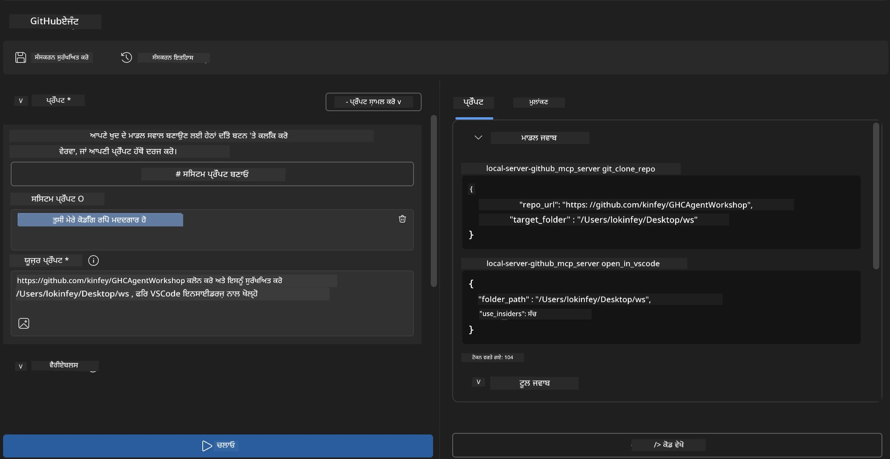

# 🐙 ਮਾਡਿਊਲ 4: ਪ੍ਰੈਕਟਿਕਲ MCP ਡਿਵੈਲਪਮੈਂਟ - ਕਸਟਮ GitHub ਕਲੋਨ ਸਰਵਰ


> **⚡ ਤੁਰੰਤ ਸ਼ੁਰੂਆਤ:** ਉਤਪਾਦਨ-ਤਿਆਰ MCP ਸਰਵਰ ਬਣਾਓ ਜੋ ਸਿਰਫ 30 ਮਿੰਟਾਂ ਵਿੱਚ GitHub ਰਿਪੋਜ਼ਿਟਰੀ ਕਲੋਨ ਕਰਨ ਅਤੇ VS ਕੋਡ ਇੰਟਿਗ੍ਰੇਸ਼ਨ ਨੂੰ ਆਟੋਮੇਟ ਕਰਦਾ ਹੈ!

## 🎯 ਸਿੱਖਣ ਦੇ ਲਕੜੀ-ਰਾਹ

ਇਸ ਲੈਬ ਦੇ ਖਤਮ ਹੋਣ ਤੱਕ, ਤੁਸੀਂ ਸਮਰੱਥ ਹੋ ਜਾਓਗੇ:

- ✅ ਹਕੀਕਤੀ ਵਿਕਾਸ ਵਰਕਫਲੋਜ਼ ਲਈ ਕਸਟਮ MCP ਸਰਵਰ ਬਣਾਉਣਾ
- ✅ MCP ਰਾਹੀਂ GitHub ਰਿਪੋਜ਼ਿਟਰੀ ਕਲੋਨਿੰਗ ਫੰਕਸ਼ਨਾਲਿਟੀ ਨੂੰ ਲਾਗੂ ਕਰਨਾ
- ✅ VS Code ਅਤੇ ਏਜੰਟ ਬਿਲਡਰ ਨਾਲ ਕਸਟਮ MCP ਸਰਵਰਾਂ ਨੂੰ ਇੰਟੀਗਰੇਟ ਕਰਨਾ
- ✅ GitHub Copilot ਏਜੰਟ ਮੋਡ ਨਾਲ ਕਸਟਮ MCP ਟੂਲਾਂ ਦੀ ਵਰਤੋਂ ਕਰਨਾ
- ✅ ਉਤਪਾਦਨ ਵਾਤਾਵਰਣ ਵਿੱਚ ਕਸਟਮ MCP ਸਰਵਰਾਂ ਦਾ ਟੈਸਟ ਅਤੇ ਡਿਪਲੋਯ ਕਰਨਾ

## 📋 ਮੁਥਾਜ

- ਲੈਬ 1-3 (MCP ਮੁੱਢਲਾ ਅਤੇ ਉੰਨਤ ਵਿਕਾਸ) ਦੀ ਪੂਰੀ ਕਰਨਾ
- GitHub Copilot ਸਬਸਕ੍ਰਿਪਸ਼ਨ ([ਮੁਫ਼ਤ ਸਾਈਨਅਪ ਉਪਲਬਧ](https://github.com/github-copilot/signup))
- VS ਕੋਡ ਵਿੱਚ AI ਟੂਲਕਿਟ ਅਤੇ GitHub Copilot ਐਕਸਟੈਨਸ਼ਨਜ਼
- Git CLI ਇੰਸਟਾਲ ਅਤੇ ਸੰਰਚਿਤ

## 🏗️ ਪ੍ਰੋਜੈਕਟ ਦਾ ਜਾਇਜ਼ਾ

### **ਅਸਲੀ ਦੁਨੀਆ ਦਾ ਵਿਕਾਸ ਚੁਣੌਤੀ**
ਡਿਵੈਲਪਰਾਂ ਵਜੋਂ, ਅਸੀਂ ਅਕਸਰ GitHub ਉਤੇ ਰਿਪੋਜ਼ਿਟਰੀਆਂ ਕਲੋਨ ਕਰਦੇ ਹਾਂ ਅਤੇ ਉਨ੍ਹਾਂ ਨੂੰ VS ਕੋਡ ਜਾਂ VS ਕੋਡ ਇੰਸਾਈਡਰਸ ਵਿੱਚ ਖੋਲ੍ਹਦੇ ਹਾਂ। ਇਹ ਹੱਥੀਂ ਕੀਤੀ ਜਾਣ ਵਾਲੀ ਪ੍ਰਕਿਰਿਆ ਵਿੱਚ ਸ਼ਾਮਲ ਹੈ:
1. ਟਰਮੀਨਲ / ਕਮਾਂਡ ਪ੍ਰੰਪਟ ਖੋਲ੍ਹਣਾ
2. ਚਾਹੀਦਾ ਡਾਇਰੈਕਟਰੀ ਵਿੱਚ ਜਾਣਾ
3. `git clone` ਕਮਾਂਡ ਚਲਾਉਣਾ
4. ਕਲੋਨ ਕੀਤੀ ਡਾਇਰੈਕਟਰੀ ਵਿੱਚ VS ਕੋਡ ਖੋਲ੍ਹਣਾ

**ਸਾਡਾ MCP ਹੱਲ ਇਸ ਨੂੰ ਇੱਕ ਸਮਝਦਾਰ ਕਮਾਂਡ ਵਿੱਚ ਬਦਲ ਦਿੰਦਾ ਹੈ!**

### **ਤੁਸੀਂ ਜੋ ਬਣਾਓਗੇ**
ਇੱਕ **GitHub ਕਲੋਨ MCP ਸਰਵਰ** (`git_mcp_server`) ਜੋ ਇਹ ਮੁਹੱਈਆ ਕਰਦਾ ਹੈ:

| ਫੀਚਰ | ਵਰਣਨ | ਲਾਭ |
|---------|-------------|---------|
| 🔄 **ਸਮਾਰਟ ਰਿਪੋਜ਼ਿਟਰੀ ਕਲੋਨਿੰਗ** | GitHub ਰਿਪੋਜ਼ ਕੋ ਵੈਰੀਫਾਇਡ ਕਲੋਨ ਕਰੋ | ਆਟੋਮੈਟਿਕ ਐਰਰ ਚੈਕਿੰਗ |
| 📁 **ਸਮਝਦਾਰ ਡਾਇਰੈਕਟਰੀ ਮੈਨੇਜਮੈਂਟ** | ਡਾਇਰੈਕਟਰੀਆਂ ਸੁਰੱਖਿਅਤ ਤਰੀਕੇ ਨਾਲ ਚੈੱਕ ਅਤੇ ਬਣਾਓ | ਓਵਰਰਾਈਟਿੰਗ ਤੋਂ ਬਚਾਅ |
| 🚀 **ਕ੍ਰਾਸ-ਪਲੇਟਫਾਰਮ VS ਕੋਡ ਇੰਟੀਗ੍ਰੇਸ਼ਨ** | ਪ੍ਰੋਜੈਕਟ VS ਕੋਡ/ਇੰਸਾਈਡਰ ਵਿੱਚ ਖੋਲ੍ਹੋ | ਬਿਨਾ ਰੁਕਾਵਟ ਵਰਕਫਲੋ ਟ੍ਰਾਂਜ਼ਿਸ਼ਨ |
| 🛡️ **ਮਜ਼ਬੂਤ ਐਰਰ ਹੈਂਡਲਿੰਗ** | ਨੈੱਟਵਰਕ, ਪਰਮਿਸ਼ਨ ਅਤੇ ਪਾਥ ਮੁੱਦਿਆਂ ਨੂੰ ਸੰਭਾਲੋ | ਉਤਪਾਦਨ-ਤਿਆਰ ਭਰੋਸੇਯੋਗਤਾ |

---

## 📖 ਕਦਮ-ਦਰ-ਕਦਮ ਅਮਲ

### ਕਦਮ 1: ਏਜੰਟ ਬਿਲਡਰ ਵਿੱਚ GitHub ਏਜੰਟ ਬਣਾਓ

1. AI ਟੂਲਕਿਟ ਐਕਸਟੈਨਸ਼ਨ ਰਾਹੀਂ **ਏਜੰਟ ਬਿਲਡਰ ਸ਼ੁਰੂ ਕਰੋ**
2. ਹੇਠ ਲਿਖੀ ਸੰਰਚਨਾ ਨਾਲ **ਨਵਾਂ ਏਜੰਟ ਬਣਾਓ:**
   ```
   Agent Name: GitHubAgent
   ```

3. **ਕਸਟਮ MCP ਸਰਵਰ ਸ਼ੁਰੂ ਕਰੋ:**
   - **Tools** → **Add Tool** → **MCP Server** 'ਤੇ ਜਾਓ
   - **"Create A new MCP Server"** ਚੁਣੋ
   - ਸਾਰਥਕਤਾ ਲਈ **Python ਟੈਮਪਲੇਟ** ਚੁਣੋ
   - **ਸਰਵਰ ਦਾ ਨਾਮ:** `git_mcp_server`

### ਕਦਮ 2: GitHub Copilot ਏਜੰਟ ਮੋਡ ਨੂੰ ਸੰਰਚਿਤ ਕਰੋ

1. VS ਕੋਡ ਵਿੱਚ **GitHub Copilot ਖੋਲ੍ਹੋ** (Ctrl/Cmd + Shift + P → "GitHub Copilot: Open")
2. Copilot ਇੰਟਰਫੇਸ ਵਿੱਚ **ਏਜੰਟ ਮਾਡਲ ਚੁਣੋ**
3. ਵਧੇਰੇ ਸੋਚ ਸਮਝ ਵਾਲੇ ਲਈ **Claude 3.7 ਮਾਡਲ ਚੁਣੋ**
4. ਟੂਲ ਪਹੁੰਚ ਲਈ **MCP ਇੰਟੀਗ੍ਰੇਸ਼ਨ ਯੋਗ ਕਰੋ**

> **💡 ਪ੍ਰੋ ਟਿਪ:** Claude 3.7 ਵਿਕਾਸ ਵਰਕਫਲੋਜ਼ ਅਤੇ ਐਰਰ ਹੈਂਡਲਿੰਗ ਪੈਟਰਨਜ਼ ਦੀ ਬਿਹਤਰ ਸਮਝ ਪ੍ਰਦਾਨ ਕਰਦਾ ਹੈ।

### ਕਦਮ 3: ਮੁੱਖ MCP ਸਰਵਰ ਫੰਕਸ਼ਨਾਲਿਟੀ ਲਾਗੂ ਕਰੋ

**GitHub Copilot ਏਜੰਟ ਮੋਡ ਨਾਲ ਹੇਠ ਲਿਖੇ ਵਿਸਥਾਰਿਤ ਪ੍ਰਾਂਪਟ ਦੀ ਵਰਤੋਂ ਕਰੋ:**

```
Create two MCP tools with the following comprehensive requirements:

🔧 TOOL A: clone_repository
Requirements:
- Clone any GitHub repository to a specified local folder
- Return the absolute path of the successfully cloned project
- Implement comprehensive validation:
  ✓ Check if target directory already exists (return error if exists)
  ✓ Validate GitHub URL format (https://github.com/user/repo)
  ✓ Verify git command availability (prompt installation if missing)
  ✓ Handle network connectivity issues
  ✓ Provide clear error messages for all failure scenarios

🚀 TOOL B: open_in_vscode
Requirements:
- Open specified folder in VS Code or VS Code Insiders
- Cross-platform compatibility (Windows/Linux/macOS)
- Use direct application launch (not terminal commands)
- Auto-detect available VS Code installations
- Handle cases where VS Code is not installed
- Provide user-friendly error messages

Additional Requirements:
- Follow MCP 1.9.3 best practices
- Include proper type hints and documentation
- Implement logging for debugging purposes
- Add input validation for all parameters
- Include comprehensive error handling
```

### ਕਦਮ 4: ਆਪਣੇ MCP ਸਰਵਰ ਦਾ ਟੈਸਟ ਕਰੋ

#### 4a. ਏਜੰਟ ਬਿਲਡਰ ਵਿੱਚ ਟੈਸਟ

1. ਏਜੰਟ ਬਿਲਡਰ ਲਈ **ਡਿਬੱਗ ਸੰਰਚਨਾ ਚਾਲੂ ਕਰੋ**
2. ਆਪਣੇ ਏਜੰਟ ਨੂੰ ਇਸ ਸਿਸਟਮ ਪ੍ਰਾਂਪਟ ਨਾਲ ਸੰਰਚਿਤ ਕਰੋ:

```
SYSTEM_PROMPT:
You are my intelligent coding repository assistant. You help developers efficiently clone GitHub repositories and set up their development environment. Always provide clear feedback about operations and handle errors gracefully.
```

3. ਹਕੀਕਤੀ ਵਰਤੋਂਕਾਰ ਸਿਨਾਰੀਓ ਨਾਲ ਟੈਸਟ ਕਰੋ:

```
USER_PROMPT EXAMPLES:

Scenario : Basic Clone and Open
"Clone {Your GitHub Repo link such as https://github.com/kinfey/GHCAgentWorkshop
 } and save to {The global path you specify}, then open it with VS Code Insiders"
```



**ਉਮੀਦ ਕੀਤੀ ਨਤੀਜੇ:**
- ✅ ਪਾਥ ਪੁਸ਼ਟੀ ਨਾਲ ਕਲੋਨਿੰਗ ਸਫਲ
- ✅ VS ਕੋਡ ਦਾ ਖੁਦ ਬਖੁਦ ਸ਼ੁਰੂ ਹੋਣਾ
- ✅ ਗਲਤ ਸਥਿਤੀਆਂ ਲਈ ਸਾਫ਼ ਐਰਰ ਸੁਨੇਹੇ
- ✅ ਗੁੰਝਲਦਾਰ ਮਾਮਲਿਆਂ ਦਾ ਸਹੀ ਸੰਭਾਲ

#### 4b. MCP ਇੰਸਪੈਕਟਰ ਵਿੱਚ ਟੈਸਟ


---

**🎉 ਮੁਬਾਰਕਾਂ!** ਤੁਸੀਂ ਹਕੀਕਤੀ ਵਿਕਾਸ ਵਰਕਫਲੋ ਚੁਣੌਤੀਆਂ ਹੱਲ ਕਰਨ ਵਾਲਾ ਪ੍ਰੈਕਟਿਕਲ, ਉਤਪਾਦਨ-ਤਿਆਰ MCP ਸਰਵਰ ਸਫਲਤਾਪੂਰਵਕ ਬਣਾਇਆ ਹੈ। ਤੁਹਾਡਾ ਕਸਟਮ GitHub ਕਲੋਨ ਸਰਵਰ ਡਿਵੈਲਪਰ ਦੀ ਉਤਪਾਦਕਤਾ ਉਤਪਾਦਨ ਅਤੇ ਸੁਧਾਰ ਲਈ MCP ਦੀ ਸ਼ਕਤੀ ਦਰਸਾਉਂਦਾ ਹੈ।

### 🏆 ਪ੍ਰਾਪਤੀ ਲੱਭੀ:
- ✅ **MCP ਡਿਵੈਲਪਰ** - ਕਸਟਮ MCP ਸਰਵਰ ਬਣਾਇਆ
- ✅ **ਵਰਕਫਲੋ ਆਟੋਮੇਟਰ** - ਵਿਕਾਸ ਪ੍ਰਕਿਰਿਆਵਾਂ ਸੀਧੀਆਂ ਕੀਤੀਆਂ
- ✅ **ਇੰਟੀਗ੍ਰੇਸ਼ਨ ਵਿਸ਼ੇਸ਼ਜ ਞ** - ਕਈ ਵਿਕਾਸ ਟੂਲਾਂ ਨਾਲ ਜੁੜੇ
- ✅ **ਉਤਪਾਦਨ ਤਿਆਰ** - ਡਿਪਲੋਯਮੈਂਟ ਜੋਗ ਸੱਲੂਸ਼ਨ ਬਣਾਏ

---

## 🎓 ਵਰਕਸ਼ਾਪ ਪੂਰੀ ਕਰਨ: ਮਾਡਲ ਕਾਂਟੈਕਸਟ ਪ੍ਰੋਟੋਕੋਲ ਨਾਲ ਤੁਹਾਡਾ ਸਫ਼ਰ

**ਪਿਆਰੇ ਵਰਕਸ਼ਾਪ ਹਿੱਸੇਦਾਰ,**

ਮਾਡਲ ਕਾਂਟੈਕਸਟ ਪ੍ਰੋਟੋਕੋਲ ਵਰਕਸ਼ਾਪ ਦੇ ਸਾਰੇ ਚਾਰ ਮਾਡਿਊਲ ਪੂਰੇ ਕਰਨ 'ਤੇ ਤੁਹਾਨੂੰ ਵਧਾਈ! ਬੁਨਿਆਦੀ AI ਟੂਲਕਿਟ ਸੰਕਲਪ ਸਮਝਣ ਤੋਂ ਲੈ ਕੇ ਅਜਿਹੇ ਉਤਪਾਦਨ-ਤਿਆਰ MCP ਸਰਵਰ ਬਣਾਉਣ ਵੱਲ ਤੁਹਾਡੀ ਯਾਤਰਾ ਸਾਹਮਣੇ ਆ ਗਈ ਹੈ ਜੋ ਅਸਲੀ ਵਿਕਾਸ ਚੁਣੌਤੀਆਂ ਹੱਲ ਕਰਦੇ ਹਨ।

### 🚀 ਤੁਹਾਡਾ ਸਿੱਖਣ ਦਾ ਰਸਤਾ:

**[ਮਾਡਿਊਲ 1](../lab1/README.md)**: ਤੁਸੀਂ AI ਟੂਲਕਿਟ ਮੁੱਢਲੀ ਨੁਹਾਰਾਂ, ਮਾਡਲ ਟੈਸਟਿੰਗ, ਅਤੇ ਪਹਿਲਾ AI ਏਜੰਟ ਬਣਾਉਣਾ ਸਿੱਖਿਆ।

**[ਮਾਡਿਊਲ 2](../lab2/README.md)**: MCP ਆਰਕੀਟੈਕਚਰ, Playwright MCP ਇੰਟੀਗ੍ਰੇਸ਼ਨ, ਅਤੇ ਪਹਿਲਾ ਬ੍ਰਾਊਜ਼ਰ ਆਟੋਮੇਸ਼ਨ ਏਜੰਟ ਬਣਾਉਣਾ ਸਿੱਖਿਆ।

**[ਮਾਡਿਊਲ 3](../lab3/README.md)**: Weather MCP ਸਰਵਰ ਨਾਲ ਕਸਟਮ MCP ਸਰਵਰ ਵਿਕਾਸ ਵਿੱਚ ਅੱਗੇ ਵਧੇ ਅਤੇ ਡਿਬੱਗਿੰਗ ਟੂਲਾਂ ਦਾ ਮਾਹਿਰ ਬਣੇ।

**[ਮਾਡਿਊਲ 4](../lab4/README.md)**: ਹੁਣ ਤੁਸੀਂ ਹਕੀਕਤੀ GitHub ਰਿਪੋਜ਼ਿਟਰੀ ਵਰਕਫਲੋ ਆਟੋਮੇਸ਼ਨ ਟੂਲ ਬਣਾਉਣ ਲਈ ਸਾਰਾ ਕੁਝ ਲਾਗੂ ਕੀਤਾ।

### 🌟 ਤੁਸੀਂ ਕੀ ਸਿੱਖਿਆ:

- ✅ **AI ਟੂਲਕਿਟ ਇਕੋਸਿਸਟਮ**: ਮਾਡਲ, ਏਜੰਟ, ਅਤੇ ਇੰਟੀਗ੍ਰੇਸ਼ਨ ਪੈਟਰਨ
- ✅ **MCP ਆਰਕੀਟੈਕਚਰ**: ਕਲਾਇੰਟ-ਸਰਵਰ ਡਿਜ਼ੈਨ, ਟ੍ਰਾਂਸਪੋਰਟ ਪ੍ਰੋਟੋਕੋਲ, ਅਤੇ ਸੁਰੱਖਿਆ
- ✅ **ਡਿਵੈਲਪਰ ਟੂਲਸ**: ਪਲੇਗ੍ਰਾਊਂਡ ਤੋਂ ਇੰਸਪੈਕਟਰ ਤੱਕ ਉਤਪਾਦਨ ਡਿਪਲੋਯਮੈਂਟ
- ✅ **ਕਸਟਮ ਡਿਵੈਲਪਮੈਂਟ**: ਆਪਣਾ MCP ਸਰਵਰ ਬਣਾਉਣਾ, ਟੈਸਟ ਕਰਨਾ ਅਤੇ ਡਿਪਲੋਯ ਕਰਨਾ
- ✅ **ਪ੍ਰੈਕਟਿਕਲ ਐਪਲੀਕੇਸ਼ਨਜ਼**: AI ਨਾਲ ਹਕੀਕਤੀ ਵਰਕਫਲੋਜ਼ ਚੁਣੌਤੀਆਂ ਹੱਲ ਕਰਨਾ

### 🔮 ਤੁਹਾਡੇ ਅਗਲੇ ਕਦਮ:

1. **ਆਪਣਾ MCP ਸਰਵਰ ਬਣਾਓ**: ਆਪਣੀਆਂ ਅਦ੍ਵਿਤੀਯ ਵਰਕਫਲੋਜ਼ ਨੂੰ ਆਟੋਮੇਟ ਕਰਨ ਲਈ ਇਨ੍ਹਾਂ ਹੁਨਰਾਂ ਨੂੰ ਲਾਗੂ ਕਰੋ
2. **MCP ਕਮਿьюਨਿਟੀ ਨਾਲ ਜੁੜੋ**: ਆਪਣੀਆਂ ਰਚਨਾਵਾਂ ਸਾਂਝੀਆਂ ਕਰੋ ਅਤੇ ਹੋਰਾਂ ਤੋਂ ਸਿੱਖੋ
3. **ਉੱਚ ਸਤਰ ਦੀ ਇੰਟੀਗ੍ਰੇਸ਼ਨ ਖੋਜੋ**: MCP ਸਰਵਰਾਂ ਨੂੰ ਉਦਯੋਗਿਕ ਸਿਸਟਮਾਂ ਨਾਲ ਜੋੜੋ
4. **ਓਪਨ ਸੋਰਸ ਵਿੱਚ ਯੋਗਦਾਨ ਦਿਓ**: MCP ਟੂਲਿੰਗ ਅਤੇ ਦਸਤਾਵੇਜ਼ੀਕਰਨ ਨੂੰ ਸੁਧਾਰਨ ਵਿੱਚ ਸਹਾਇਤਾ ਕਰੋ

ਯਾਦ ਰੱਖੋ, ਇਹ ਵਰਕਸ਼ਾਪ ਸਿਰਫ ਸ਼ੁਰੂਆਤ ਹੈ। ਮਾਡਲ ਕਾਂਟੈਕਸਟ ਪ੍ਰੋਟੋਕੋਲ ਇਕੋਸਿਸਟਮ ਤੇਜ਼ੀ ਨਾਲ ਵਿਕਸਤ ਹੋ ਰਿਹਾ ਹੈ, ਅਤੇ ਹੁਣ ਤੁਹਾਡੇ ਕੋਲ AI-ਚਾਲਤ ਵਿਕਾਸ ਟੂਲਾਂ ਦੇ ਅਗਲੇ ਧਾਰੇ ਵਿੱਚ ਹੋਣ ਦਾ ਸਾਜੋ-ਸਮਾਨ ਹੈ।

**ਸਿਖਣ ਲਈ ਤੁਹਾਡੇ ਯੋਗਦਾਨ ਅਤੇ ਸਮਰਪਣ ਦਾ ਧੰਨਵਾਦ!**

ਅਸੀਂ ਆਸ ਕਰਦੇ ਹਾਂ ਕਿ ਇਹ ਵਰਕਸ਼ਾਪ ਤੁਹਾਡੇ ਵਿਚਾਰੇ ਨੂੰ ਉਸ ਸਾਰੇ ਤਰੀਕੇ ਨਾਲ ਪ੍ਰੇਰਿਤ ਕਰੇ ਜੋ ਤੁਸੀਂ AI ਟੂਲਾਂ ਨਾਲ ਆਪਣੇ ਵਿਕਾਸੀ ਸਫਰ ਵਿੱਚ ਬਣਾਉਂਦੇ ਅਤੇ ਸੰਵਾਦ ਕਰਦੇ ਹੋ।

**ਖੁਸ਼ ਕoding!**

---

## ਅਗਲਾ ਕੀ ਹੈ

ਮਾਡਿਊਲ 10 ਦੀਆਂ ਸਾਰੀਆਂ ਲੈਬਾਂ ਪੂਰੀਆਂ ਕਰਨ 'ਤੇ ਵਧਾਈ ਹੋਵੇ!

- ਵਾਪਸ ਜਾਓ: [ਮਾਡਿਊਲ 10 ਜਾਇਜ਼ਾ](../README.md)
- ਜਾਰੀ ਰੱਖੋ: [ਮਾਡਿਊਲ 11: MCP ਸਰਵਰ ਹੈਂਡਸ-ਆਨ ਲੈਬਜ਼](../../11-MCPServerHandsOnLabs/README.md)

---

<!-- CO-OP TRANSLATOR DISCLAIMER START -->
**ਅਸਵੀਕਾਰੋਪੱਤਰ**:  
ਇਸ ਦਸਤਾਵੇਜ਼ ਦਾ ਅਨੁਵਾਦ ਏਆਈ ਅਨੁਵਾਦ ਸੇਵਾ [Co-op Translator](https://github.com/Azure/co-op-translator) ਦੀ ਵਰਤੋਂ ਕਰਕੇ ਕੀਤਾ ਗਿਆ ਹੈ। ਜਦੋਂ ਕਿ ਅਸੀਂ ਸਹੀਤਾ ਲਈ ਯਤਨਸ਼ੀਲ ਹਾਂ, ਕਿਰਪਾ ਕਰਕੇ ਧਿਆਨ ਰੱਖੋ ਕਿ ਸਵਚਲਿਤ ਅਨੁਵਾਦਾਂ ਵਿੱਚ ਗਲਤੀਆਂ ਜਾਂ ਅਸਪਸ਼ਟਤਾਵਾਂ ਹੋ ਸਕਦੀਆਂ ਹਨ। ਮੂਲ ਦਸਤਾਵੇਜ਼ ਆਪਣੇ ਮੂਲ ਭਾਸ਼ਾ ਵਿੱਚ ਹੀ ਪ੍ਰਮਾਣਿਕ ਸਰੋਤ ਮੰਨਿਆ ਜਾਣਾ ਚਾਹੀਦਾ ਹੈ। ਜਰੂਰੀ ਜਾਣਕਾਰੀ ਲਈ ਪੇਸ਼ੇਵਰ ਮਨੁੱਖੀ ਅਨੁਵਾਦ ਦੀ ਸਿਫਾਰਸ਼ ਕੀਤੀ ਜਾਂਦੀ ਹੈ। ਅਸੀਂ ਇਸ ਅਨੁਵਾਦ ਦੀ ਵਰਤੋਂ ਕਰਕੇ ਹੋਣ ਵਾਲੀਆਂ ਕਿਸੇ ਵੀ ਗਲਤਫਹਿਮੀਆਂ ਜਾਂ ਭ੍ਰਮ ਲਈ ਜਵਾਬਦੇਹ ਨਹੀਂ ਹਾਂ।
<!-- CO-OP TRANSLATOR DISCLAIMER END -->