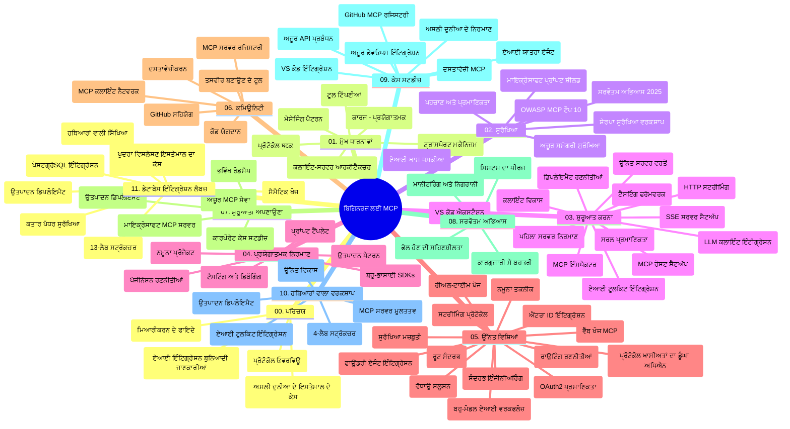

# ਮਾਡਲ ਸੰਦਰਭ ਪ੍ਰੋਟੋਕੋਲ (MCP) ਸ਼ੁਰੂਆਤੀਆਂ ਲਈ - ਅਧਿਐਨ ਮਾਰਗਦਰਸ਼ਿਕਾ

ਇਹ ਅਧਿਐਨ ਮਾਰਗਦਰਸ਼ਿਕਾ "ਮਾਡਲ ਸੰਦਰਭ ਪ੍ਰੋਟੋਕੋਲ (MCP) ਸ਼ੁਰੂਆਤੀਆਂ ਲਈ" ਕੋਰਸ ਲਈ ਗਿਟਹੱਬ ਰਿਪੋਜ਼ਿਟਰੀ ਦੀ ਬਣਤਰ ਅਤੇ ਸਮੱਗਰੀ ਦਾ ਇੱਕ ਝਲਕ ਪ੍ਰਦਾਨ ਕਰਦੀ ਹੈ। ਇਸ ਮਾਰਗਦਰਸ਼ਿਕਾ ਦੀ ਵਰਤੋਂ ਰਿਪੋਜ਼ਿਟਰੀ ਵਿੱਚ ਮਿਲਣ ਵਾਲੇ ਸਰੋਤਾਂ ਨੂੰ ਪ੍ਰਭਾਵਸ਼ਾਲੀ ਤਰੀਕੇ ਨਾਲ ਦਿਖਾਈ ਦੇਣ ਅਤੇ ਉਨ੍ਹਾਂ ਦਾ ਸਰੋਤਿਗਤ ਲਾਭ ਲੈਣ ਲਈ ਕਰੋ।

## ਰਿਪੋਜ਼ਿਟਰੀ ਦਾ ਝਲਕ

ਮਾਡਲ ਸੰਦਰਭ ਪ੍ਰੋਟੋਕੋਲ (MCP) ਏ.ਆਈ ਮਾਡਲਾਂ ਅਤੇ ਕਲਾਇੰਟ ਐਪਲੀਕੇਸ਼ਨਾਂ ਦੇ ਦਰਮਿਆਨ ਇੰਟਰੈਕਸ਼ਨਾਂ ਲਈ ਇੱਕ ਮਿਆਰੀ ਫਰੇਮਵਰਕ ਹੈ। ਸ਼ੁਰੂ ਵਿੱਚ ਐਂਥਰੋਪਿਕ ਦੁਆਰਾ ਬਣਾਇਆ ਗਿਆ, MCP ਹੁਣ ਮੱਖ MCP ਕਮਿਊਨਿਟੀ ਦੁਆਰਾ ਅਧਿਕਾਰਿਤ GitHub ਸੰਗਠਨ ਰਾਹੀਂ ਸੰਭਾਲਿਆ ਜਾਂਦਾ ਹੈ। ਇਹ ਰਿਪੋਜ਼ਿਟਰੀ ਏ.ਆਈ ਵਿਕਾਸਕਾਰਾਂ, ਸਿਸਟਮ ਆਰਕੀਟੈਕਟਾਂ ਅਤੇ ਸੌਫਟਵੇਅਰ ਇੰਜੀਨੀਅਰਾਂ ਲਈ C#, ਜਾਵਾ, ਜਾਵਾਸਕ੍ਰਿਪਟ, ਪਾਈਥਨ ਅਤੇ ਟਾਈਪਸਕ੍ਰਿਪਟ ਵਿੱਚ ਹਥਿਆਰਬੰਦ ਕੋਡ ਉਦਾਹਰਨਾਂ ਨਾਲ ਇੱਕ ਵਿਸਥਾਰਿਤ ਸਿਲੇਬਸ ਸਮੇਤ ਪ੍ਰਦਾਨ ਕਰਦੀ ਹੈ।

## ਦ੍ਰਿਸ਼ਟੀਗਤ ਕੋਰਸ ਨਕਸ਼ਾ

## ਰਿਪੋਜ਼ਿਟਰੀ ਦੀ ਬਣਤਰ

ਰਿਪੋਜ਼ਿਟਰੀ ਗਿਆਰਾਂ ਮੁੱਖ ਭਾਗਾਂ ਵਿੱਚ ਵੰਡਿਆ ਗਿਆ ਹੈ, ਹਰ ਇੱਕ MCP ਦੇ ਵੱਖ-ਵੱਖ ਪਹਿਲੂਆਂ 'ਤੇ ਧਿਆਨ ਕੇਂਦ੍ਰਿਤ ਕਰਦਾ ਹੈ:

1. **ਪਰਿਚਯ (00-Introduction/)**
   - ਮਾਡਲ ਸੰਦਰਭ ਪ੍ਰੋਟੋਕੋਲ ਦਾ ਝਲਕ  
   - ਏ.ਆਈ ਪਾਈਪਲਾਈਨਾਂ ਵਿੱਚ ਮਿਆਰੀਕਰਨ ਕਿਉਂ ਜਰੂਰੀ ਹੈ  
   - ਪ੍ਰਯੋਗਿਕ ਕੇਸ ਅਤੇ ਲਾਭ

2. **ਮੁੱਖ ਧਾਰਣਾਵਾਂ (01-CoreConcepts/)**
   - ਕਲਾਇੰਟ-ਸਰਵਰ ਆਰਕੀਟੈਕਚਰ  
   - ਪ੍ਰੋਟੋਕੋਲ ਦੇ ਮੁੱਖ ਭਾਗ  
   - MCP ਵਿੱਚ ਸੁਨੇਹਾ ਭੇਜਣ ਦੇ ਢੰਗ

3. **ਸੁਰੱਖਿਆ (02-Security/)**
   - MCP ਅਧਾਰਿਤ ਸਿਸਟਮਾਂ ਵਿੱਚ ਸੁਰੱਖਿਆ ਖਤਰਿਆਂ  
   - ਲਾਗੂ ਕਰਣ ਲਈ ਸਰਵੋਤਮ ਕਾਰਜ ਪ੍ਰਣਾਲੀਆਂ  
   - ਪ੍ਰਮਾਣਿਕਤਾ ਅਤੇ ਅਧਿਕਾਰਿਤ ਨੀਤੀਆਂ  
   - **ਵਿਆਪਕ ਸੁਰੱਖਿਆ ਦਸਤਾਵੇਜ਼**:  
     - MCP ਸੁਰੱਖਿਆ ਸਰਵੋਤਮ ਕਿਰਤਾਂ 2025  
     - ਐਜ਼ਿਊਰ ਕੰਟੈਂਟ ਸੁਰੱਖਿਆ ਲਾਗੂ ਕਰਨ ਦੀ ਮਾਰਗਦਰਸ਼ਿਕਾ  
     - MCP ਸੁਰੱਖਿਆ ਨਿਯੰਤਰਣ ਅਤੇ ਤਕਨੀਕਾਂ  
     - MCP ਸਰਵੋਤਮ ਕਿਰਤਾਂ ਦਾ ਤੁਰੰਤ ਸੰਦર્ભ  
   - **ਮੁੱਖ ਸੁਰੱਖਿਆ ਵਿਸ਼ੇ**:  
     - ਪ੍ਰੋਂਪਟ ਇੰਜੈਕਸ਼ਨ ਅਤੇ ਟੂਲ ਜਹਿਰੀਲੇ ਪੈਣੇ ਹਮਲੇ  
     - ਸੈਸ਼ਨ ਹਾਈਜੈਕਿੰਗ ਅਤੇ ਗੁੰਝਲਦਾਰ ਡਿਊਟੀ ਵਾਲੇ ਮੁੱਦੇ  
     - ਟੋਕਨ ਪਾਸਥਰੂ ਖਾਮੀਆਂ  
     - ਵੱਧ ਅਧਿਕਾਰ ਅਤੇ ਪਹੁੰਚ ਨਿਯੰਤਰਣ  
     - ਏ.ਆਈ ਘਟਕਾਂ ਲਈ ਸਪਲਾਈ ਚੇਨ ਸੁਰੱਖਿਆ  
     - ਮਾਈਕ੍ਰੋਸਾਫਟ ਪ੍ਰੋਂਪਟ ਸ਼ੀਲਡਸ ਇੰਟੀਗ੍ਰੇਸ਼ਨ

4. **ਸ਼ੁਰੂਆਤ (03-GettingStarted/)**
   - ਵਾਤਾਵਰਣ ਸਥਾਪਨਾ ਅਤੇ ਸੰਰਚਨਾ  
   - ਮੂਲ MCP ਸਰਵਰ ਅਤੇ ਕਲਾਇੰਟ ਬਣਾਉਣਾ  
   - ਮੌਜੂਦਾ ਐਪਲੀਕੇਸ਼ਨਾਂ ਨਾਲ ਇੰਟੀਗ੍ਰੇਸ਼ਨ  
   - ਸ਼ਾਮਿਲ ਹਿਸੇ:  
     - ਪਹਿਲਾ ਸਰਵਰ ਲਾਗੂ ਕਰਨਾ  
     - ਕਲਾਇੰਟ ਵਿਕਾਸ  
     - LLM ਕਲਾਇੰਟ ਇੰਟੀਗ੍ਰੇਸ਼ਨ  
     - VS ਕੋਡ ਇੰਟੀਗ੍ਰੇਸ਼ਨ  
     - ਸਰਵਰ-ਸੈਂਟ ਇਵੈਂਟਸ (SSE) ਸਰਵਰ  
     - ਉੱਚ-ਪੱਧਰੀ ਸਰਵਰ ਵਰਤੋਂ  
     - HTTP ਸਟ੍ਰੀਮਿੰਗ  
     - AI ਟੂਲਕਿਟ ਇੰਟੀਗ੍ਰੇਸ਼ਨ  
     - ਪਰੀਖਣ ਰਣਨੀਤੀਆਂ  
     - ਡਿਪਲੋਇਮੈਂਟ ਮਾਰਗਦਰਸ਼ਿਕਾ

5. **ਪ੍ਰਯੋਗਿਕ ਲਾਗੂ ਕਰਨਾ (04-PracticalImplementation/)**
   - ਵੱਖ-ਵੱਖ ਪ੍ਰੋਗ੍ਰਾਮਿੰਗ ਭਾਸ਼ਾਵਾਂ ਵਿੱਚ SDK ਦੀ ਵਰਤੋਂ  
   - ਡੀਬੱਗਿੰਗ, ਟੈਸਟਿੰਗ ਅਤੇ ਪ੍ਰਮਾਣਿਕਤਾ ਤਕਨੀਕਾਂ  
   - ਦੁਬਾਰਾ ਵਰਤੇ ਜਾਣ ਯੋਗ ਪ੍ਰੋਂਪਟ ਟੈਮਪਲੇਟ ਅਤੇ ਵਰਕਫਲੋ ਨੂੰ ਬਨਾਉਣਾ  
   - ਉਦਾਹਰਨਾਂ ਨਾਲ ਨਮੂਨਾ ਪ੍ਰੋਜੈਕਟ

6. **ਉੱਚ-ਪੱਧਰੀ ਵਿਸ਼ੇ (05-AdvancedTopics/)**
   - ਸੰਦਰਭ ਇੰਜੀਨੀਅਰਿੰਗ ਤਕਨੀਕਾਂ  
   - ਫਾਉਂਡਰੀ ਏਜੰਟ ਇੰਟੀਗ੍ਰੇਸ਼ਨ  
   - ਮਲਟੀ-ਮੋਡਲ ਏ.ਆਈ ਵਰਕਫਲੋ  
   - OAuth2 ਪ੍ਰਮਾਣਿਕਤਾ ਡੈਮੋ  
   - ਰੀਅਲ-ਟਾਈਮ ਖੋਜ ਯੋਗਤਾਵਾਂ  
   - ਰੀਅਲ-ਟਾਈਮ ਸਟ੍ਰੀਮਿੰਗ  
   - ਰੂਟ ਸੰਦਰਭ ਲਾਗੂ ਕਰਨਾ  
   - ਰਾਊਟਿੰਗ ਰਣਨੀਤੀਆਂ  
   - ਸੈਂਪਲਿੰਗ ਤਕਨੀਕਾਂ  
   - ਪੈਮਾਨਾ ਲਾਉਣ ਦੇ ਢੰਗ  
   - ਸੁਰੱਖਿਆ ਵਿਚਾਰ  
   - Entra ID ਸੁਰੱਖਿਆ ਇੰਟੀਗ੍ਰੇਸ਼ਨ  
   - ਵੈੱਬ ਖੋਜ ਇੰਟੀਗ੍ਰੇਸ਼ਨ

7. **ਕਮਿਊਨਿਟੀ ਯੋਗਦਾਨ (06-CommunityContributions/)**
   - ਕੋਡ ਅਤੇ ਦਸਤਾਵੇਜ਼ ਵਿੱਚ ਯੋਗਦਾਨ ਦੇਣ ਦਾ ਤਰੀਕਾ  
   - GitHub ਦੇ ਰਾਹੀਂ ਸਹਿਯੋਗ  
   - ਕਮਿਊਨਿਟੀ ਵੱਲੋਂ ਚਲਾਏ ਗਏ ਸੁਧਾਰ ਅਤੇ ਫੀਡਬੈਕ  
   - ਵੱਖ-ਵੱਖ MCP ਕਲਾਇੰਟ ਵਰਤੋਂ (ਕਲੌਡ ਡੈਸਕਟਾਪ, ਕਲਾਈਨ, VSCode)  
   - ਪ੍ਰਸਿੱਧ MCP ਸਰਵਰਾਂ ਨਾਲ ਕੰਮ ਕਰਨਾ ਜਿਵੇਂ ਚਿੱਤਰ ਉਤਪਾਦਨ

8. **ਸ਼ੁਰੂਆਤੀ ਅਪਣਾੳਣ ਤੋਂ ਸਿੱਖਿਆ (07-LessonsfromEarlyAdoption/)**
   - ਹਕੀਕਤੀ ਲਾਗੂ ਕਰਨ ਅਤੇ ਸਫਲਤਾ ਦੀਆਂ ਕਹਾਣੀਆਂ  
   - MCP ਅਧਾਰਤ ਹੱਲ ਦੀ ਰਚਨਾ ਅਤੇ ਡਿਪਲੋਇਮੈਂਟ  
   - ਰੁਝਾਨ ਅਤੇ ਭਵਿੱਖ ਦਾ ਰੋਡਮੇਪ  
   - **ਮਾਈਕ੍ਰੋਸਾਫਟ MCP ਸਰਵਰਾਂ ਦੀ ਮਾਰਗਦਰਸ਼ਿਕਾ**: 10 ਮਨਜ਼ੂਰਬੰਦੀ ਤਿਆਰ ਮਾਈਕ੍ਰੋਸਾਫਟ MCP ਸਰਵਰਾਂ ਦੀ ਵਿਸਥਾਰਿਤ ਮਾਰਗਦਰਸ਼ਿਕਾ ਜਿਹੜੀ ਸ਼ਾਮਿਲ ਹੈ:  
     - Microsoft Learn Docs MCP Server  
     - Azure MCP Server (15+ ਵਿਸ਼ੇਸ਼ ਕੁਨੈਕਟਰ)  
     - GitHub MCP Server  
     - Azure DevOps MCP Server  
     - MarkItDown MCP Server  
     - SQL Server MCP Server  
     - Playwright MCP Server  
     - Dev Box MCP Server  
     - Azure AI Foundry MCP Server  
     - Microsoft 365 Agents Toolkit MCP Server

9. **ਸਰਵੋਤਮ ਕੰਮ ਕਰਣ ਦੇ ਢੰਗ (08-BestPractices/)**
   - ਪ੍ਰਦਰਸ਼ਨ ਸੁਧਾਰ ਅਤੇ ਉੱਪਰੰਤ  
   - ਤਰੁੱਟੀ-ਸਹਿਣਸ਼ੀਲ MCP ਸਿਸਟਮਾਂ ਦੀ ਡਿਜ਼ਾਈਨਿੰਗ  
   - ਟੈਸਟਿੰਗ ਅਤੇ ਸਹਿਣਸ਼ੀਲਤਾ ਰਣਨੀਤੀਆਂ

10. **ਕੇਸ ਅਧਿਐਨ (09-CaseStudy/)**
    - **ਸੱਤ ਵਿਸਥਾਰਿਤ ਕੇਸ ਅਧਿਐਨ** ਜੋ MCP ਦੀ ਬਹੁਤ-ਪੱਖੀ ਯੋਗਤਾ ਨੂੰ ਵੱਖ-ਵੱਖ ਸਥਿਤੀਆਂ ਵਿੱਚ ਦਰਸਾਉਂਦੇ ਹਨ:  
    - **Azure AI ਟ੍ਰੈਵਲ ਏਜੰਟਸ**: Azure OpenAI ਅਤੇ AI ਖੋਜ ਨਾਲ ਮਲਟੀ-ਏਜੰਟ ਚਾਲਨਾ  
    - **Azure DevOps ਇੰਟੀਗ੍ਰੇਸ਼ਨ**: YouTube ਡੇਟਾ ਅੱਪਡੇਟਸ ਨਾਲ ਵਰਕਫਲੋ ਪ੍ਰਕਿਰਿਆਵਾਂ ਦਾ ਆਟੋਮੇਸ਼ਨ  
    - **ਰੀਅਲ-ਟਾਈਮ ਦਸਤਾਵੇਜ਼ ਪ੍ਰਾਪਤੀ**: ਸਟ੍ਰੀਮਿੰਗ HTTP ਨਾਲ ਪਾਈਥਨ ਕਨਸੋਲ ਕਲਾਇੰਟ  
    - **ਇੰਟਰਐਕਟਿਵ ਅਧਿਐਨ ਯੋਜ਼ਨਾ ਜਨਰੇਟਰ**: Chainlit ਵੈੱਬ ਐਪ਼ ਦੂਰ-ਦੌਰਾਨੀ AI ਨਾਲ  
    - **ਇੰ-ਐਡੀਟਰ ਦਸਤਾਵੇਜ਼ੀਕਰਨ**: VS ਕੋਡ ਇੰਟੀਗ੍ਰੇਸ਼ਨ GitHub Copilot ਵਰਕਫਲੋਜ਼ ਨਾਲ  
    - **Azure API ਪ੍ਰਬੰਧਨ**: MCP ਸਰਵਰ ਬਣਾਉਣ ਨਾਲ ਉਦਯੋਗਿਕ API ਇੰਟੀਗ੍ਰੇਸ਼ਨ  
    - **GitHub MCP ਰਜਿਸਟਰੀ**: ਪਾਰਿਸ਼ਨ ਵਿਕਾਸ ਅਤੇ ਏਜੰਸੀ ਇੰਟੀਗ੍ਰੇਸ਼ਨ ਪਲੇਟਫਾਰਮ  
    - ਉਦਯੋਗਿਕ ਇੰਟੀਗ੍ਰੇਸ਼ਨ, ਡਿਵੈਲਪਰ ਕਾਰਗੁਜ਼ਾਰੀ, ਅਤੇ ਪਰਿਸ਼ਨ ਵਿਕਾਸ ਲਈ ਲਾਗੂ ਕਰਨ ਦੇ ਉਦਾਹਰਨ

11. **ਹੱਥ-ਅਨ ਵਰਕਸ਼ਾਪ (10-StreamliningAIWorkflowsBuildingAnMCPServerWithAIToolkit/)**
    - MCP ਨੂੰ AI ਟੂਲਕਿਟ ਨਾਲ ਮਿਲਾਉਂਦਾ ਇੱਕ ਵਿਆਪਕ ਹੱਥ-ਅਨ ਵਰਕਸ਼ਾਪ  
    - ਏ.ਆਈ ਮਾਡਲਾਂ ਨੂੰ ਹਕੀਕਤੀ ਜ਼ਿੰਦਗੀ ਦੇ ਸੰਦਾਂ ਨਾਲ ਜੁੜਨ ਵਾਲੀਆਂ ਬੁੱਧਿਮਾਨ ਐਪਲੀਕੇਸ਼ਨਾਂ ਦਾ ਨਿਰਮਾਣ  
    - ਮੁਢਲੀ ਜਾਣਕਾਰੀ, ਵਿਸ਼ੇਸ਼ ਸਰਵਰ ਵਿਕਾਸ, ਅਤੇ ਉਤਪਾਦਨ ਡਿਪਲੋਇਮੈਂਟ ਰਣਨੀਤੀਆਂ ਨੂੰ ਕਵਰ ਕਰਦੇ ਪ੍ਰਯੋਗਿਕ ਮੋਡੀਊਲ  
    - **ਲੈਬ ਬਣਤਰ**:  
      - ਲੈਬ 1: MCP ਸਰਵਰ ਮੁਢਲਾ ਗਿਆਨ  
      - ਲੈਬ 2: ਉੱਚ-ਪੱਧਰੀ MCP ਸਰਵਰ ਵਿਕਾਸ  
      - ਲੈਬ 3: AI ਟੂਲਕਿਟ ਇੰਟੀਗ੍ਰੇਸ਼ਨ  
      - ਲੈਬ 4: ਉਤਪਾਦਨ ਡਿਪਲੋਇਮੈਂਟ ਅਤੇ ਪੈਮਾਨਾ ਲਾਉਣਾ  
    - ਲੈਬ-ਅਧਾਰਿਤ ਸਿਖਲਾਈ ਪদ্ধਤੀ ਸਗੋਂ ਕਦਮ-ਦਰ-कਦਮ ਨਿਰਦੇਸ਼

12. **MCP ਸਰਵਰ ਡੇਟਾਬੇਸ ਇੰਟੀਗ੍ਰੇਸ਼ਨ ਲੈਬ (11-MCPServerHandsOnLabs/)**
    - **ਉਤਪਾਦਨ-ਤਿਆਰ MCP ਸਰਵਰ ਬਣਾਉਣ ਲਈ 13 ਲੈਬਾਂ ਦਾ ਮੁਕੰਮਲ ਰਸਤਾ** PostgreSQL ਇੰਟੀਗ੍ਰੇਸ਼ਨ ਸਮੇਤ  
    - **ਜ਼ਾਵਾ ਰਿਟੇਲ ਯੂਜ਼ ਕੇਸ ਵਰਤੋਂ ਨਾਲ ਹਕੀਕਤੀ ਰਿਟੇਲ ਵਿਸ਼ਲੇਸ਼ਣ ਲਾਗੂ ਕਰਨਾ**  
    - **ਉਦਯੋਗ ਪੱਧਰ ਦੇ ਪੈਟਰਨ ਜਿਵੇਂ ਕਿ ਰੋ ਲੈਵਲ ਸੁਰੱਖਿਆ (RLS), ਸੈਮਾਂਟਿਕ ਖੋਜ, ਅਤੇ ਮਲਟੀ-ਟੇਨੈਂਟ ਡੇਟਾ ਪਹੁੰਚ**  
    - **ਪੂਰਨ ਲੈਬ ਬਣਤਰ**:  
      - **ਲੈਬ 00-03: ਬੁਨਿਆਦੀ ਜਾਣਕਾਰੀ** - ਪਰਿਚਯ, ਆਰਕੀਟੈਕਚਰ, ਸੁਰੱਖਿਆ, ਵਾਤਾਵਰਣ ਸੈਟਅਪ  
      - **ਲੈਬ 04-06: MCP ਸਰਵਰ ਬਣਾਉਣਾ** - ਡੇਟਾਬੇਸ ਡਿਜ਼ਾਈਨ, MCP ਸਰਵਰ ਲਾਗੂ ਕਰਨਾ, ਟੂਲ ਵਿਕਾਸ  
      - **ਲੈਬ 07-09: ਉੱਚ-ਪੱਧਰੀ ਵਿਸ਼ੇਸ਼ਤਾ** - ਸੈਮਾਂਟਿਕ ਖੋਜ, ਟੈਸਟਿੰਗ ਅਤੇ ਡੀਬੱਗਿੰਗ, VS ਕੋਡ ਇੰਟੀਗ੍ਰੇਸ਼ਨ  
      - **ਲੈਬ 10-12: ਉਤਪਾਦਨ ਅਤੇ ਸਟੈਂਡਰਡ ਪ੍ਰਣਾਲੀ** - ਡਿਪਲੋਇਮੈਂਟ, ਨਿਗਰਾਨੀ, ਅਪਟੇ ਪ੍ਰਭਾਵ  
    - **ਕਵਰੇਜ ਟੈਕਨੋਲੋਜੀਜ਼**: FastMCP ਫਰੇਮਵਰਕ, PostgreSQL, Azure OpenAI, Azure Container Apps, Application Insights  
    - **ਸਿਖਣ ਦੇ ਨਤੀਜੇ**: ਉਤਪਾਦਨ-ਤਿਆਰ MCP ਸਰਵਰ, ਡੇਟਾਬੇਸ ਇੰਟੀਗ੍ਰੇਸ਼ਨ ਪੈਟਰਨ, ਏ.ਆਈ ਤਾਕ਼ਤਵਰ ਵਿਸ਼ਲੇਸ਼ਣ, ਉਦਯੋਗ ਸੁਰੱਖਿਆ

## ਵਾਧੂ ਸਰੋਤ

ਰਿਪੋਜ਼ਿਟਰੀ ਸਮਰਥਕ ਸਰੋਤ ਸ਼ਾਮਿਲ ਕਰਦੀ ਹੈ:

- **ਚਿੱਤਰ ਫੋਲਡਰ**: ਕੋਰਸ ਵਿੱਚ ਵਰਤੀ ਗਈਆਂ ਡਾਇਗ੍ਰਾਮਾਂ ਅਤੇ ਚਿੱਤਰਾਂ ਨੂੰ ਰੱਖਦਾ ਹੈ  
- **ਅਨੁਵਾਦ**: ਦਸਤਾਵੇਜ਼ੀਕਰਨ ਦੇ ਕਈ ਭਾਸ਼ਾਈ ਅਨੁਵਾਦਾਂ ਲਈ ਆਟੋਮੇਟਿਕ ਸਹਾਇਤਾ  
- **ਅਧਿਕਾਰਿਤ MCP ਸਰੋਤ**:  
  - [MCP ਦਸਤਾਵੇਜ਼](https://modelcontextprotocol.io/)  
  - [MCP ਵਿਸ਼ੇਸ਼ਤਾ](https://spec.modelcontextprotocol.io/)  
  - [MCP ਗਿਟਹੱਬ ਰਿਪੋਜ਼ਿਟਰੀ](https://github.com/modelcontextprotocol)

## ਇਸ ਰਿਪੋਜ਼ਿਟਰੀ ਦੀ ਵਰਤੋਂ ਕਿਵੇਂ ਕਰਨੀ ਹੈ

1. **ਕ੍ਰਮਵਾਰ ਸਿੱਖਣਾ**: ਲੜੀਵਾਰ ਅਧਿਆਇ 00 ਤੋਂ 11 ਤੱਕ ਫਾਲੋ ਕਰੋ ਤਾਂ ਜੋ ਸੂਚਿਤ ਸਿੱਖਣਾ ਹੋਵੇ।  
2. **ਭਾਸ਼ਾ-ਆਧਾਰਿਤ ਧਿਆਨ**: ਜੇ ਤੁਸੀਂ ਕਿਸੇ ਵਿਸ਼ੇਸ਼ ਪ੍ਰੋਗ੍ਰਾਮਿੰਗ ਭਾਸ਼ਾ ਵਿੱਚ ਰੁਚੀ ਰੱਖਦੇ ਹੋ ਤਾਂ ਆਪਣੇ ਪਸੰਦੀਦਾ ਭਾਸ਼ਾ ਵਿੱਚ ਲਾਗੂ ਕਰਨ ਲਈ ਨਮੂਨਾ ਡਾਇਰੈਕਟਰੀ ਖੋਜੋ।  
3. **ਪ੍ਰਯੋਗਿਕ ਲਾਗੂ ਕਰਨਾ**: "ਸ਼ੁਰੂਆਤ" ਭਾਗ ਨਾਲ ਆਪਣਾ ਵਾਤਾਵਰਨ ਸੈਟ ਅਪ ਕਰੋ ਅਤੇ ਆਪਣਾ ਪਹਿਲਾ MCP ਸਰਵਰ ਅਤੇ ਕਲਾਇੰਟ ਬਣਾਓ।  
4. **ਉੱਚ-ਪੱਧਰੀ ਖੋਜ**: ਜਦੋਂ ਤੁਸੀਂ ਬੁਨਿਆਦੀ ਜਾਣਕਾਰੀ ਵਿੱਚ ਸੁਖਦ ਹੋ ਜਾਵੋ ਤਾਂ ਉੱਚ-ਪੱਧਰੀ ਵਿਸ਼ਿਆਂ ਵਿੱਚ ਡੁੱਬਕੀ ਲਗਾਓ।  
5. **ਕਮਿਊਨਿਟੀ ਹਿੱਸਾ ਲਓ**: MCP ਕਮਿਊਨਿਟੀ ਨਾਲ GitHub ਚਰਚਾ ਅਤੇ ਡਿਸਕੋਰਡ ਚੈਨਲਾਂ ਰਾਹੀਂ ਜੁੜੋ, ਮਾਹਿਰਾਂ ਅਤੇ ਹੋਰ ਵਿਕਾਸਕਾਰਾਂ ਨਾਲ ਗੱਲਬਾਤ ਕਰੋ।

## MCP ਕਲਾਇੰਟ ਅਤੇ ਟੂਲ

ਸਿਲੇਬਸ ਵੱਖ-ਵੱਖ MCP ਕਲਾਇੰਟ ਅਤੇ ਟੂਲ ਕਵਰ ਕਰਦਾ ਹੈ:

1. **ਅਧਿਕਾਰਿਤ ਕਲਾਇੰਟ**:  
   - Visual Studio Code  
   - Visual Studio Code ਵਿੱਚ MCP  
   - Claude Desktop  
   - VSCode ਵਿੱਚ Claude  
   - Claude API

2. **ਕਮਿਊਨਿਟੀ ਕਲਾਇੰਟ**:  
   - Cline (ਟਰਮੀਨਲ-ਅਧਾਰਿਤ)  
   - Cursor (ਕੋਡ ਸੰਪਾਦਕ)  
   - ChatMCP  
   - Windsurf

3. **MCP ਪ੍ਰਬੰਧਨ ਟੂਲ**:  
   - MCP CLI  
   - MCP Manager  
   - MCP Linker  
   - MCP Router

## ਪ੍ਰਸਿੱਧ MCP ਸਰਵਰ

ਰਿਪੋਜ਼ਿਟਰੀ ਵੱਖ-ਵੱਖ MCP ਸਰਵਰਾਂ ਨੂੰ ਪੇਸ਼ ਕਰਦਾ ਹੈ, ਜਿਨ੍ਹਾਂ ਵਿੱਚ ਸ਼ਾਮਿਲ ਹਨ:

1. **ਅਧਿਕਾਰਿਤ ਮਾਈਕ੍ਰੋਸਾਫਟ MCP ਸਰਵਰ**:  
   - Microsoft Learn Docs MCP Server  
   - Azure MCP Server (15+ ਵਿਸ਼ੇਸ਼ ਕੁਨੈਕਟਰ)  
   - GitHub MCP Server  
   - Azure DevOps MCP Server  
   - MarkItDown MCP Server  
   - SQL Server MCP Server  
   - Playwright MCP Server  
   - Dev Box MCP Server  
   - Azure AI Foundry MCP Server  
   - Microsoft 365 Agents Toolkit MCP Server

2. **ਅਧਿਕਾਰਿਤ ਰੈਫਰੈਂਸ ਸਰਵਰ**:  
   - ਫਾਈਲ ਸਿਸਟਮ  
   - ਫੈਚ  
   - ਮੈਮੋਰੀ  
   - ਲੜੀਵਾਰ ਸੋਚ

3. **ਚਿੱਤਰ ਉਤਪਾਦਨ**:  
   - Azure OpenAI DALL-E 3  
   - Stable Diffusion WebUI  
   - Replicate

4. **ਡਿਵੈਲਪਮੈਂਟ ਟੂਲ**:  
   - Git MCP  
   - ਟਰਮੀਨਲ ਕੰਟਰੋਲ  
   - ਕੋਡ ਸਹਾਇਕ

5. **ਵਿਸ਼ੇਸ਼ ਸਰਵਰ**:  
   - Salesforce  
   - ਮਾਈਕ੍ਰੋਸਾਫਟ ਟੀਮਸ  
   - Jira ਅਤੇ Confluence

## ਯੋਗਦਾਨ ਦੇਣਾ

ਇਹ ਰਿਪੋਜ਼ਿਟਰੀ ਕਮਿਊਨਿਟੀ ਵੱਲੋਂ ਯੋਗਦਾਨ ਦਾ ਸਵਾਗਤ ਕਰਦੀ ਹੈ। MCP ਇਕੇਸਿਸਟਮ ਵਿੱਚ ਪ੍ਰਭਾਵਸ਼ਾਲੀ ਯੋਗਦਾਨ ਲਈ ਕਮਿਊਨਿਟੀ ਯੋਗਦਾਨ ਭਾਗ ਦਾ ਸਹਾਰਾ ਲਓ।

----

*ਇਸ ਅਧਿਐਨ ਮਾਰਗਦਰਸ਼ਿਕਾ ਨੂੰ 5 ਫਰਵਰੀ 2026 ਨੂੰ ਅੱਪਡੇਟ ਕੀਤਾ ਗਿਆ ਸੀ, ਜੋ MCP ਵਿਸ਼ੇਸ਼ਤਾ 2025-11-25 ਨੂੰ ਦਰਸਾਉਂਦਾ ਹੈ ਅਤੇ ਉਸ ਮਿਤੀ ਤੱਕ ਦੇ ਰਿਪੋਜ਼ਿਟਰੀ ਦੀ ਇੱਕ ਝਲਕ ਪ੍ਰਦਾਨ ਕਰਦਾ ਹੈ। ਰਿਪੋਜ਼ਿਟਰੀ ਸਮੱਗਰੀ ਇਸ ਮਿਤੀ ਤੋਂ ਬਾਅਦ ਅੱਪਡੇਟ ਕੀਤੀ ਜਾ ਸਕਦੀ ਹੈ।*

---

<!-- CO-OP TRANSLATOR DISCLAIMER START -->
**ਅਸਵੀਕਾਰੋक्ति**:  
ਇਹ ਦਸਤਾਵੇਜ਼ ਏਆਈ ਅਨੁਵਾਦ ਸੇਵਾ [Co-op Translator](https://github.com/Azure/co-op-translator) ਦੀ ਵਰਤੋਂ ਕਰਕੇ ਅਨੁਵਾਦ ਕੀਤਾ ਗਿਆ ਹੈ। ਜਦੋਂ ਕਿ ਅਸੀਂ ਸਹੀਅਤ ਲਈ ਕੋਸ਼ਿਸ਼ ਕਰਦੇ ਹਾਂ, ਕਿਰਪਾ ਕਰਕੇ ਇਹ ਜਾਣੋ ਕਿ ਸਵੈਚਾਲਿਤ ਅਨੁਵਾਦਾਂ ਵਿੱਚ ਗਲਤੀਆਂ ਜਾਂ ਅਸਥਿਰਤਾਵਾਂ ਹੋ ਸਕਦੀਆਂ ਹਨ। ਮੂਲ ਦਸਤਾਵੇਜ਼ ਆਪਣੇ ਮੂਲ ਭਾਸ਼ਾ ਵਿੱਚ ਹੀ ਅਧਿਕਾਰਿਕ ਸਰੋਤ ਮੰਨਿਆ ਜਾਣਾ ਚਾਹੀਦਾ ਹੈ। ਜਰੂਰੀ ਜਾਣਕਾਰੀ ਲਈ, ਪੇਸ਼ੇਵਰ ਮਨੁੱਖੀ ਅਨੁਵਾਦ ਦੀ ਸਿਫਾਰਸ਼ ਕੀਤੀ ਜਾਂਦੀ ਹੈ। ਅਸੀਂ ਇਸ ਅਨੁਵਾਦ ਦੀ ਵਰਤੋਂ ਨਾਲ ਹੋਣ ਵਾਲੀਆਂ ਕਿਸੇ ਵੀ ਗਲਤਫਹਮੀਆਂ ਜਾਂ ਗਲਤ ਅਰਥਾਂ ਲਈ ਜਵਾਬਦੇਹ ਨਹੀਂ ਹਾਂ।
<!-- CO-OP TRANSLATOR DISCLAIMER END -->