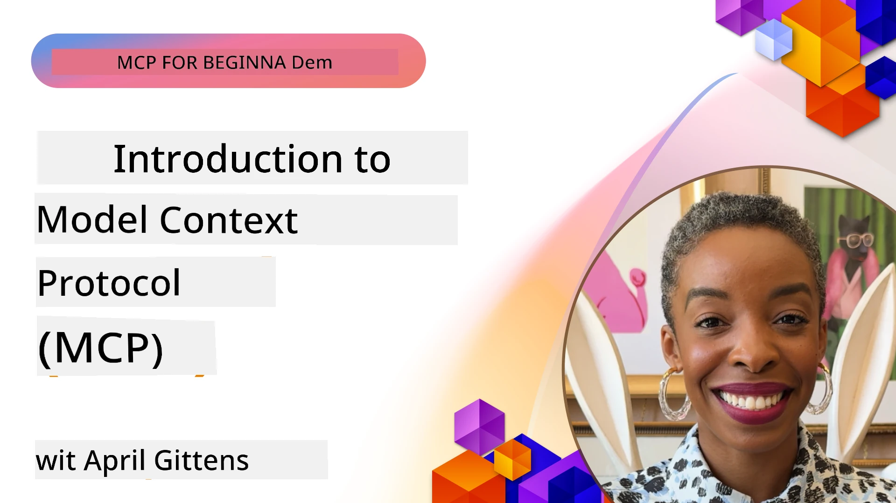
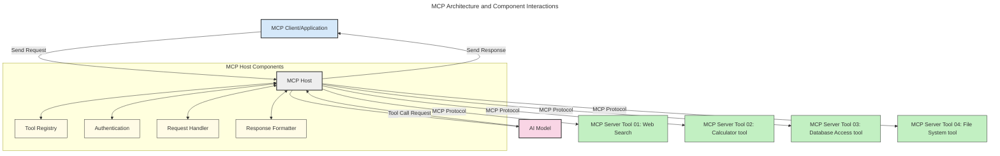

# Introduction to Model Context Protocol (MCP): Why E Still Important for Sccalable AI Applications

[](https://youtu.be/agBbdiOPLQA)

_(Click di pikshua we dey above to watch di video for dis lesson)_

Generative AI applications na beta step forward as dem dey usually allow di user to interact with di app using natural language prompts. But as people dey put more time and resources for these kind apps, you go wan make sure say e go easy to join other functionalities and resources inside am so e go easy to extend, make your app fit handle more than one model at di same time, and fit handle different model wahala. To put am simple, to build Gen AI apps easy to start, but as dem grow and waka reach complex, you go need to start to define one architecture and you for sure go need to rely on standard to make sure say your apps dey build consistent. Na here MCP go show as e go organize tins and bring standard.

---

## **🔍 Wetin be Model Context Protocol (MCP)?**

Di **Model Context Protocol (MCP)** na an **open, standardized interface** wey dey let Large Language Models (LLMs) take interact well well with outside tools, APIs, and data sources. E dey provide one consistent architecture wey fit make AI model fit do more things pass wetin e sabi before, make e smarter, scalable, and e respond well.

---

## **🎯 Why Standardization for AI Important**

As generative AI apps dey get complex, e dey important to follow standards wey go make sure say e fit **scale well, fit extend well, fit maintain well**, and **make person no get locked for one vendor**. MCP dey solve these tins by:

- Join model-tool integration together
- Reduce wahala of using one-broke-one custom solutions
- Allow many models from different vendors to dey inside one system

**Note:** Even though MCP dey call itself open standard, no plan dey to make MCP formal standard through existing bodies like IEEE, IETF, W3C, ISO or any other standards organization.

---

## **📚 Wetin You Go Learn**

After you finish this article, you go fit:

- Define **Model Context Protocol (MCP)** and where you fit use am
- Understand how MCP dey standardize how model dey talk to tools
- Identify main parts wey make up MCP architecture
- See real-world usage of MCP for enterprise and dev areas

---

## **💡 Why Model Context Protocol (MCP) Na Big Game-Changer**

### **🔗 MCP Don Solve AI Interaction Fragmentation**

Before MCP, if you wan join model and tools, you go:

- Write custom code for each tool-model pair
- Get non-standard APIs for every vendor
- Break often when e update
- No fit scale well if tools plenty

### **✅ Benefit Wey MCP Standardization Get**

| **Benefit**              | **Wetin E Mean**                                                                |
|--------------------------|--------------------------------------------------------------------------------|
| Interoperability         | LLMs fit work well with tools from different vendors                           |
| Consistency              | Make all platforms and tools behave the same way                               |
| Reusability              | Build tools once, use am for many projects and systems                         |
| Accelerated Development  | Developers fit finish work fast because of plug-and-play standardized setup    |

---

## **🧱 MCP Architecture Overview (High-Level)**

MCP dey run by **client-server model**, where:

- **MCP Hosts** na where AI models dey run
- **MCP Clients** na dem dey send requests
- **MCP Servers** dey provide context, tools, and capabilities

### **Main Parts:**

- **Resources** – Data wey fit be static or dynamic for models  
- **Prompts** – Pre-made workflows for how to generate output  
- **Tools** – Functions like search and calculation  
- **Sampling** – Agent behavior with recursive interactions
- **Elicitation** – Server dey ask user for input
- **Roots** – Filesystem limits for server access control

### **Protocol Architecture:**

MCP get two-layer architecture:
- **Data Layer**: JSON-RPC 2.0 communication with lifecycle handling and simple primitives
- **Transport Layer**: STDIO (local) and Streamable HTTP with SSE (remote) communication channels

---

## How MCP Servers Dey Work

MCP servers dey operate like this:

- **Request Flow**:
    1. End user or software dey initiate request.
    2. **MCP Client** go send request to **MCP Host**, wey dey manage AI Model runtime.
    3. **AI Model** go receive user prompt and fit ask to use outside tools or data with one or more tool calls.
    4. **MCP Host**, no be model direct, na im dey use standardized protocol to communicate with **MCP Server(s)**.
- **MCP Host Features**:
    - **Tool Registry**: Gathers list of tools and wetin dem fit do.
    - **Authentication**: Check permissions before tool fit use.
    - **Request Handler**: Handle tool requests wey model send.
    - **Response Formatter**: Arrange tool output so model go understand.
- **MCP Server Execution**:
    - **MCP Host** go send tool calls to one more **MCP Servers** wey get special functions (like search, calculations, database queries).
    - **MCP Servers** go run their work then send results back to **MCP Host** in consistent way.
    - **MCP Host** go format and pass results comot to **AI Model**.
- **Response Completion**:
    - **AI Model** go put tool output inside final answer.
    - **MCP Host** go send answer back to **MCP Client** so e fit give end user or calling software.  
    


## 👨‍💻 How to Build MCP Server (With Examples)

MCP servers allow you to add more power to LLMs by providing data and functions. 

You ready? Here na language or stack-specific SDKs with examples to build simple MCP servers for different languages and frameworks:

- **Python SDK**: https://github.com/modelcontextprotocol/python-sdk

- **TypeScript SDK**: https://github.com/modelcontextprotocol/typescript-sdk

- **Java SDK**: https://github.com/modelcontextprotocol/java-sdk

- **C#/.NET SDK**: https://github.com/modelcontextprotocol/csharp-sdk


## 🌍 Real-World Use Cases for MCP

MCP dey enable many apps by adding more AI capabilities:

| **Application**              | **Wet In Mean**                                                                |
|------------------------------|--------------------------------------------------------------------------------|
| Enterprise Data Integration  | Connect LLMs to database, CRMs, or internal tools                             |
| Agentic AI Systems           | Allow autonomous agents to get tools and make decisions                      |
| Multi-modal Applications     | Mix text, image, and audio tools inside one AI app                           |
| Real-time Data Integration   | Bring live data inside AI interaction for better, current results            |


### 🧠 MCP = Universal Standard for AI Interactions

Model Context Protocol (MCP) na universal standard for AI interactions, like how USB-C standardize how devices dey physically connect. For AI world, MCP give consistent interface wey let models (clients) fit join outside tools and data providers (servers) well well. This one remove need for different custom protocols for every API or data source.

With MCP, MCP-compatible tool (we dey call MCP server) dey follow one united standard. These servers dey list tools or actions wey dem fit do and carry out those actions when AI agent ask. AI agent platforms wey support MCP fit find tools for servers and call dem through this standard protocol.

### 💡 E Make Access to Knowledge Easy

More than just giving tools, MCP dey help provide access to knowledge. E allow apps to give context to Large Language Models (LLMs) by linking them to different data sources. For example, one MCP server fit be company document store, so agents fit find info anytime dem need am. Another server fit do specific things like send email or update records. From agent eye, na just tools dem be — some tools give data (knowledge context), others perform actions. MCP manage both well.

Agent wey connect to MCP server go sabi server capability and data access automatically using standard format. This standardization mean tools fit change as e dey dynamic. For example, if you add new MCP server to agent system, e go fit use new functions quick quick without extra customization.

This smooth integration dey follow arrangement wey diagram show, where servers dey provide tools and knowledge, making collaboration across systems easy.

### 👉 Example: Scalable Agent Solution

```mermaid
---
title: Scalable Agent Solution with MCP
description: A diagram illustrating how a user interacts with an LLM that connects to multiple MCP servers, with each server providing both knowledge and tools, creating a scalable AI system architecture
---
graph TD
    User -->|Prompt| LLM
    LLM -->|Response| User
    LLM -->|MCP| ServerA
    LLM -->|MCP| ServerB
    ServerA -->|Universal connector| ServerB
    ServerA --> KnowledgeA
    ServerA --> ToolsA
    ServerB --> KnowledgeB
    ServerB --> ToolsB

    subgraph Server A
        KnowledgeA[Knowledge]
        ToolsA[Tools]
    end

    subgraph Server B
        KnowledgeB[Knowledge]
        ToolsB[Tools]
    end
``` The Universal Connector let MCP servers dey talk and share capabilities among themselves, allowing ServerA to send work to ServerB or use its tools and knowledge. This kind federation of tools and data across servers support scalable and modular agent architectures. Because MCP standardize tool exposure, agents fit dynamically find tools and direct requests between servers without hardcoded integration.

Tool and knowledge federation: Tools and data fit access across servers, supporting more scalable and modular agent architectures.

### 🔄 Advanced MCP Scenarios with Client-Side LLM Integration

Beyond basic MCP architecture, some advanced cases involve both client and server having LLMs, allowing more complex interactions. For example, **Client App** fit be IDE wey get many MCP tools wey LLM fit use:

```mermaid
---
title: Advanced MCP Scenarios with Client-Server LLM Integration
description: A sequence diagram showing the detailed interaction flow between user, client application, client LLM, multiple MCP servers, and server LLM, illustrating tool discovery, user interaction, direct tool calling, and feature negotiation phases
---
sequenceDiagram
    autonumber
    actor User as 👤 User
    participant ClientApp as 🖥️ Client App
    participant ClientLLM as 🧠 Client LLM
    participant Server1 as 🔧 MCP Server 1
    participant Server2 as 📚 MCP Server 2
    participant ServerLLM as 🤖 Server LLM
    
    %% Discovery Phase
    rect rgb(220, 240, 255)
        Note over ClientApp, Server2: TOOL DISCOVERY PHASE
        ClientApp->>+Server1: Request available tools/resources
        Server1-->>-ClientApp: Return tool list (JSON)
        ClientApp->>+Server2: Request available tools/resources
        Server2-->>-ClientApp: Return tool list (JSON)
        Note right of ClientApp: Store combined tool<br/>catalog locally
    end
    
    %% User Interaction
    rect rgb(255, 240, 220)
        Note over User, ClientLLM: USER INTERACTION PHASE
        User->>+ClientApp: Enter natural language prompt
        ClientApp->>+ClientLLM: Forward prompt + tool catalog
        ClientLLM->>-ClientLLM: Analyze prompt & select tools
    end
    
    %% Scenario A: Direct Tool Calling
    alt Direct Tool Calling
        rect rgb(220, 255, 220)
            Note over ClientApp, Server1: SCENARIO A: DIRECT TOOL CALLING
            ClientLLM->>+ClientApp: Request tool execution
            ClientApp->>+Server1: Execute specific tool
            Server1-->>-ClientApp: Return results
            ClientApp->>+ClientLLM: Process results
            ClientLLM-->>-ClientApp: Generate response
            ClientApp-->>-User: Display final answer
        end
    
    %% Scenario B: Feature Negotiation (VS Code style)
    else Feature Negotiation (VS Code style)
        rect rgb(255, 220, 220)
            Note over ClientApp, ServerLLM: SCENARIO B: FEATURE NEGOTIATION
            ClientLLM->>+ClientApp: Identify needed capabilities
            ClientApp->>+Server2: Negotiate features/capabilities
            Server2->>+ServerLLM: Request additional context
            ServerLLM-->>-Server2: Provide context
            Server2-->>-ClientApp: Return available features
            ClientApp->>+Server2: Call negotiated tools
            Server2-->>-ClientApp: Return results
            ClientApp->>+ClientLLM: Process results
            ClientLLM-->>-ClientApp: Generate response
            ClientApp-->>-User: Display final answer
        end
    end
```
## 🔐 Practical Benefits of MCP

Here be practical benefits when you use MCP:

- **Freshness**: Models fit get up-to-date info pass their training data
- **Capability Extension**: Models fit use special tools for tasks dem no train for
- **Reduced Hallucinations**: External data sources give real info support
- **Privacy**: Sensitive info fit stay inside secure environment rather than inside prompts

## 📌 Key Takeaways

Here na main points to remember about MCP:

- **MCP** dey standardize how AI models dey talk to tools and data
- E promote **extensibility, consistency, and interoperability**
- MCP fit **reduce development time, improve reliability, and extend model powers**
- Client-server architecture make **flexible, extensible AI apps** possible

## 🧠 Exercise

Think about AI app wey you wan build.

- Which **external tools or data** fit make am better?
- How MCP fit make joining these tools **easier and more reliable?**

## Additional Resources

- [MCP GitHub Repository](https://github.com/modelcontextprotocol)


## Wetin next

Next: [Chapter 1: Core Concepts](../01-CoreConcepts/README.md)

---

<!-- CO-OP TRANSLATOR DISCLAIMER START -->
**Disclaimer**:
Dis document don translate use AI translation service wey dem call [Co-op Translator](https://github.com/Azure/co-op-translator). Even though we try make am correct, abeg sabi say automated translation fit get errors or mistake. Di original document wey e dey for im own language na im true source. If na serious matter, e good make person wey sabi translate am well do am. We no go responsible if person no understand well or if e misinterpret dis translation.
<!-- CO-OP TRANSLATOR DISCLAIMER END -->